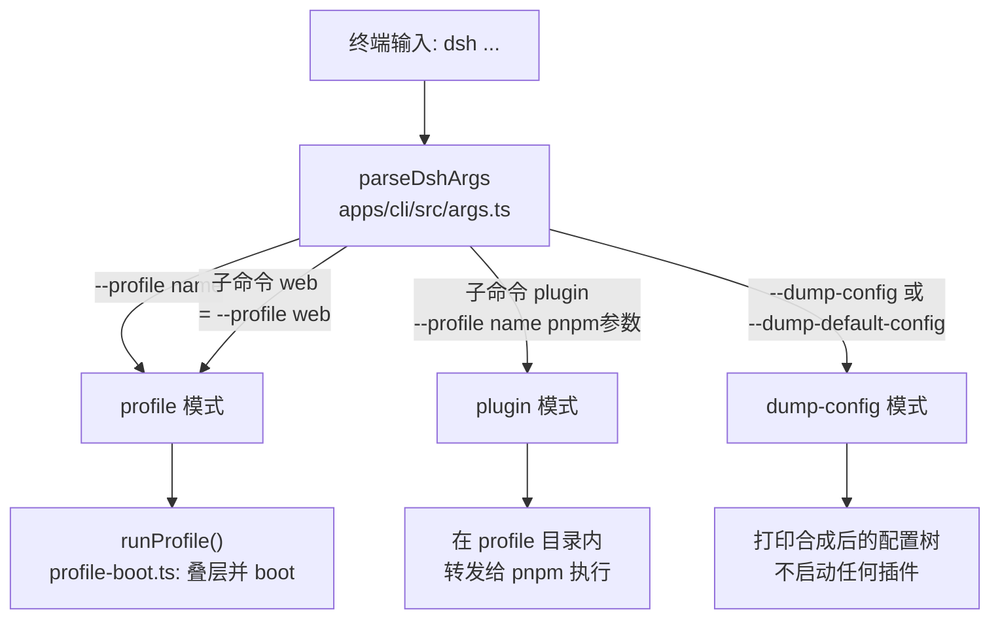
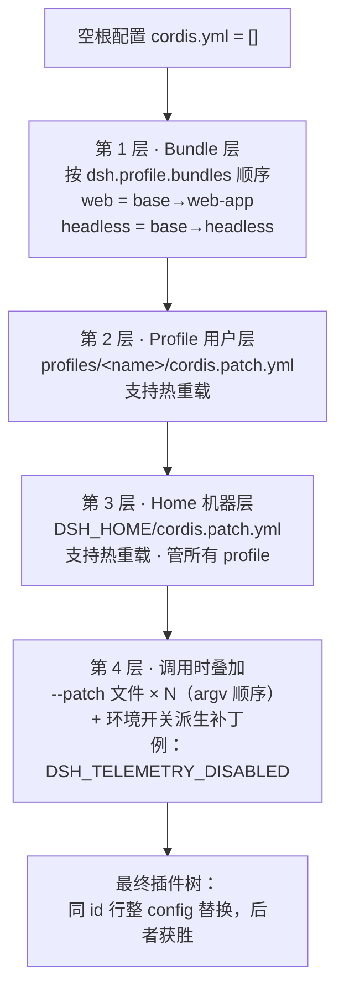

本文是快速上手路径的第三站：假定你已经通过 [快速开始：通过 npm 一行命令或源码编译运行 dsh](2-kuai-su-kai-shi-tong-guo-npm-xing-ming-ling-huo-yuan-ma-bian-yi-yun-xing-dsh) 跑起过 `dsh`，本文从源码层面回答三个新手最常问的问题——**`dsh` 命令本体是什么、`web` 和 `headless` 这两个开箱即用的模式背后发生了什么、"补丁覆盖"到底覆盖了什么**。读完你将能解释一次 `dsh web` 从 argv 到插件树的全过程，并用 `--patch` 与两个 dump 命令做配置实验。

## dsh 命令从哪里来：两种运行形态

从 npm 安装视角看，`dsh` 是包 `@deepseek-ai/dsh` 在 `package.json` 里登记的 bin 命令，指向构建产物 `lib/bin.js`；也就是说，全局安装这个包后，终端里的 `dsh` 就是这份脚本。它的描述一语道破职责："profile boot, plugin management, and the browser UI alias"——启动器本身不实现任何智能体逻辑，只负责选择并装载正确的运行面。

Sources: [package.json](apps/cli/package.json#L2-L16)

在仓库内开发时则走另一条路：根 `package.json` 提供了 `"dsh"` 脚本，用 `node --import tsx/esm apps/cli/src/bin.ts` 直接以 TypeScript 源码运行 CLI（无需先构建 CLI 本体），并把全部参数原样转发。因此源码开发的习惯写法是 `pnpm dsh --profile web` 这样的形式。注意生产级运行仍需要先执行 `pnpm run build` 构建宿主与前端产物，缺件的报错信息会提示补构建。

Sources: [package.json](package.json#L141)、[reference/README.md](apps/cli/reference/README.md#L95-L98)

`bin.ts` 的分发方式值得注意：它先用 `parseDshArgs` 把 argv 解析成三种调用形态之一，再针对每种形态用动态 `import()` 只加载对应的 runner。这意味着选了 `plugin` 模式的进程不会加载 profile 启动代码，各分发路径互不掺和；`--help`、`--version` 与解析错误都在解析器内部直接打印并退出，只有合法模式才会进入后面的 switch。

Sources: [bin.ts](apps/cli/src/bin.ts#L28-L54)

下面的流程图概括了一次调用的分流结构（阅读前提：图中每个方框对应一个源码模块，虚线内容表示该模式不会加载的部分）：



## 启动器的命令语法：旗标在前，其余归应用

`dsh` 是一个典型的"薄启动器"：它只解析自己拥有的旗标——要启动哪个 profile、追加哪些补丁覆盖文件、是否导出配置树——然后把第一个不认识的 token 之后的所有参数**原封不动**交给被启动的应用去解析，连 `-h` 都属于应用。因此 `dsh --profile tui --resume abc` 会把 `--resume abc` 传给 tui 应用，而 `dsh --profile web -h` 打印的是 web 应用的帮助而非启动器的。由此推出一条铁律：**启动器旗标必须放在最前面**。

Sources: [args.ts](apps/cli/src/args.ts#L1-L15)

解析器共识别三种调用形态，在类型上表现为一个判别联合：

| 形态 | 触发命令 | 关键字段 | 行为 |
|---|---|---|---|
| `ProfileInvocation` | `dsh --profile <name> ...` 或 `dsh web ...` | `profile`、`patches`、`args` | 启动 profile，把剩余参数交给应用 |
| `DumpConfigInvocation` | 加 `--dump-config` / `--dump-default-config` | `defaultOnly`、`patches` | 打印合成后的插件树即退出 |
| `PluginInvocation` | `dsh plugin --profile <name> <pnpm 参数>` | `args` | 初始化 profile 后把参数原样转发给 pnpm |

Sources: [args.ts](apps/cli/src/args.ts#L20-L48)

两个容易踩坑的细节：其一，`--patch` 使用"可重复的单值收集器"而不是变长选项——`--patch a.yml --patch b.yml` 收集出两个路径，故意不用 variadic 写法，否则变长匹配会把后面的内层应用参数也吞进去。其二，若子命令 `web` / `plugin` 前出现了父级旗标（如 `dsh --profile x web`），会被 `rejectParentOptions` 显式拒绝，避免语义含混。

Sources: [args.ts](apps/cli/src/args.ts#L57-L61)、[args.ts](apps/cli/src/args.ts#L147-L154)

日常使用对照以下速查表即可（来自启动器自带的帮助示例）：

```sh
dsh --profile web                          # 启动 web profile（等价：dsh web）
dsh --profile headless "run the tests"     # 单任务：作答一次后打印结果退出
dsh --profile tui --patch ./extra.yml      # 自定义 profile + 一份额外覆盖层
dsh --profile tui --resume <session>       # 旗标之后的参数全部归属应用
dsh --profile web --help                   # 这是 web 应用的帮助
dsh plugin --profile tui add <package>     # 向 tui profile 安装一个插件
```

Sources: [args.ts](apps/cli/src/args.ts#L64-L72)

另有一个转义规则：启动器会消费掉第一个 `--` 分隔符，如果你的应用参数真的需要一个字面上的 `--`，就要写成 `-- --`。

Sources: [reference/README.md](apps/cli/reference/README.md#L21)

## Profile：$DSH_HOME 下的插件组合单元

理解 web/headless 之前需要先建立 **Profile** 概念：一个 profile 就是 `$DSH_HOME/profiles/<name>` 下的一个目录，内含一份 `package.json`（记录外挂插件依赖与名为 `dsh.profile.bundles` 的有序 bundle 清单）和一份 `cordis.patch.yml`（用户自己的补丁覆盖层）。整个插件树的最终形态不是写在某个大配置文件里，而是由这些**按序叠加的补丁层**动态合成出来的。

Sources: [profile.ts](packages/boot/app-boot/src/profile.ts#L4-L18)、[README.md](apps/cli/README.md#L30-L32)

首次启动 web 或 headless 后，你的 Harness 主目录大致长成下面这样（目录树为示意结构）：

```text
~/.dsh/                              ← DSH_HOME（可用 $DSH_HOME 环境变量改指他处）
├── profiles/
│   ├── web/                         ← 首次 `dsh web` 时自动初始化
│   │   ├── package.json             ← 含 dsh.profile.bundles: [base, web-app]
│   │   ├── cordis.patch.yml         ← 你的 profile 级覆盖层（初始为空数组）
│   │   └── pnpm-workspace.yaml      ← hoisted 布局等 pnpm 设置
│   ├── headless/                    ← 同上，bundles 为 [base, headless]
│   └── node_modules/                ← 安装级模块回退区（每依赖一条符号链接）
├── sessions/                        ← JSONL 会话日志
├── settings.yaml                    ← 用户设置文档
└── .credentials.yaml                ← 受管凭据文档
```

主目录位置的解析优先级是：显式传入的路径 > `$DSH_HOME` 环境变量 > 默认 `~/.dsh`；空白的 `$DSH_HOME` 视同未设置，绝不会把当前目录误当主目录。

Sources: [index.ts](packages/util/home-paths/src/index.ts#L74-L92)、[index.ts](packages/util/home-paths/src/index.ts#L13-L19)

初始化的来源分两类：`web` 和 `headless` 是随安装发布的**模板 profile**（`PROFILE_TEMPLATES` 中硬编码了两者的 bundle 组合），首次使用时自动落盘；而其它任何名字如果对应的 manifest 不存在就会直接报错失败，并提示你去执行 `dsh plugin --profile <name> add <package>` 先创建它——这是"fail loud"设计，避免静默生成意外的组合。

Sources: [profile.ts](packages/boot/app-boot/src/profile.ts#L113-L117)、[profile.ts](packages/boot/app-boot/src/profile.ts#L371-L399)

初始化过程（`initProfile`）是幂等的：只在文件缺失时写入三样东西——声明 `dsh.profile.bundles` 的私有 manifest、一段带注释说明的空 `cordis.patch.yml` 模板（顶层 YAML 数组，允许 `!!js` 表达式）、以及让 profile 内 pnpm 采用 hoisted 布局的 `pnpm-workspace.yaml`。已存在的文件永远不会被触碰，重复执行等于无事发生。

Sources: [profile.ts](packages/boot/app-boot/src/profile.ts#L143-L152)、[profile.ts](packages/boot/app-boot/src/profile.ts#L127-L140)

还有一个对排障有用的机制：每次启动都会"治愈"`$DSH_HOME/profiles/node_modules` 这个扁平回退目录，为安装自身依赖闭包里的每个包建一条符号链接。这保证了清单里写的内置 bundle（如 `@deepseek-ai/dsh-base`）总是优先从 **dsh 安装本体**解析，其次才是 profile 自己的 `node_modules`（供外挂插件使用），杜绝"运行中的 dsh 却加载了别处来的旧版本核心"这类错位。

Sources: [profile.ts](packages/boot/app-boot/src/profile.ts#L204-L223)、[profile.ts](packages/boot/app-boot/src/profile.ts#L332-L344)

## web 与 headless：两个开箱即用的表面

两个模板 profile 共享同一个 base bundle，但代表了两种极端的使用姿态。`headless` 直接叠在 base 之上，注释写明其定位：单任务一次性模式，**不挂载 Host、HTTP 服务器、Web 运行时或浏览器插件**；`web` 则在其上继续挂出网关、静态资源服务与整套浏览器插件花名册。下表是两者面向用户的完整对比：

| 维度 | `web` | `headless` |
|---|---|---|
| 模板组合 | base + `@deepseek-ai/dsh-web-app` | base + `@deepseek-ai/dsh-headless` |
| 进程生命周期 | 常驻服务器，直到收到信号退出 | 单任务完成后自动退出 |
| 应用自有参数 | `--host`、`--port`、可重复 `--trusted-host`、`--no-open` | 任务文本位置参数（多词以空格拼接） |
| 默认行为 | 服务于 `http://127.0.0.1:3080` 并打开浏览器 | 打印最终助手文本：`completed` 退 0，否则退 1 |
| 安静性约束 | 有 URL 输出与端口监听 | 成功时不向 stderr 写入、不监听任何端口 |
| 典型用途 | 图形化交互、管理设置与模型 | 脚本/CI 中的一次性委托任务 |

Sources: [profile.ts](packages/boot/app-boot/src/profile.ts#L113-L117)、[reference/README.md](apps/cli/reference/README.md#L23-L31)、[README.md](apps/cli/README.md#L9-L16)

**headless 侧的实现思路**很能体现本项目的风格：任务是普通的位置参数，由一个普通 provider 插件注入 `cmdlineArgs` 服务后解析（空白任务视为用法错误），再把解析结果作为 `headlessStartup` 服务发布；runner 行注入该服务后才求值自己的配置表达式。bundle 补丁文件本身就只有 30 余行，值得通读一遍：

Sources: [startup.ts](packages/bundle/headless/src/startup.ts#L27-L58)、[cordis.patch.yml](packages/bundle/headless/cordis.patch.yml#L1-L36)

**web 侧的应用参数**同样遵循这一 provider 模式：`--host <host>` 绑定地址、`--port <port>` 监听端口（传 0 让操作系统挑选空闲端口）、可重复的 `--trusted-host` 向 `/api` 浏览器信任围栏追加授权主机、`--no-open` 禁止本次调用打开浏览器。安全上有两处硬编码：`--host 0.0.0.0` 被有意拒绝（会把远程代码执行暴露到网络上），`--port` 必须是纯数字。

Sources: [startup.ts](packages/bundle/web-app/src/startup.ts#L37-L89)

生产 web runner 还有几条部署细节值得记住：默认服务于 `http://127.0.0.1:3080`，且只在完整插件树就绪后才把标准 URL 交给系统打开浏览器；继承环境中的 `SSH_CONNECTION`/`SSH_TTY` 非空时会抑制自动打开浏览器（SSH 客户端拥有本地转发地址），但仍会打印 URL；`dsh web --help` 打印的是 web 应用自己的帮助并且什么都不会启动。

Sources: [reference/README.md](apps/cli/reference/README.md#L65-L78)

此外，所有模式都把**调用时所在目录作为默认工作区根**，并加载适用的 `AGENTS.md`/`CLAUDE.md` 指令；新会话默认落在 `workspace-write` 权限预设上（文件写入限制在工作区与平台临时根内，读取与网络不受限）。

Sources: [reference/README.md](apps/cli/reference/README.md#L79-L86)、[README.md](apps/cli/README.md#L16)

web bundle 其余部分挂载的是传输层与浏览器插件花名册：API 网关、webserver（host/port 来自惰性求值的应用参数）、web-runtime（负责拼装前端 dist、注册提示词片段、打开浏览器）、以及数十个 `dsh.client` 双半侧插件行。这部分属于后续章节的主题，此处只需知道它们同样是这张补丁列表上的行：

Sources: [cordis.patch.yml](packages/bundle/web-app/cordis.patch.yml#L99-L199)

## 补丁覆盖：按序叠加的配置层次

现在回答标题里的第三个概念。"补丁覆盖"指的是：profile 的最终配置树是在一份**空根**之上按固定顺序叠加多层补丁合成的，后到的层按行 id 整体取代先到的层。这一点在 `composeProfile` 的文档注释里写得非常直白——顺序依次是：`dsh.profile.bundles` 顺序的各 bundle 层、profile 自己的用户层 `cordis.patch.yml`、机器级的 `$DSH_HOME/cordis.patch.yml`（因为它作用于所有 profile 所以排在 profile 层之后）、`--patch` 传入的覆盖文件，最后是遥测开关派生的补丁。

Sources: [profile-boot.ts](apps/cli/src/profile-boot.ts#L127-L175)

两条合成语义务必牢记。第一，**每一层都是按行 id 寻址，最后写入者获胜**；第二，id 命中的补丁会替换目标行的**整个 `config` 值**而不是按键深合并——所以 base bundle 故意不在共享行里放任何因表面而异的值，web 层也把每个被覆盖行的全部键都重述了一遍。用一个真实例子感受：全文检索默认 opt-in，base 层把 `session-query-sqlite` 行写成 `path: ':memory:'` 且 `openAt: never`（保持精确读、标题、血缘追踪可用而 SQLite 不打开）；想在部署里启用内容搜索的场合，就在更晚的层里整行重写 `openAt` 为 `first-search` 或 `startup`，通常还配上持久化的 `path`：

```yaml
# 示例：$DSH_HOME/profiles/web/cordis.patch.yml —— 放在此处即对所有 web 启动生效
- id: session-query-sqlite
  config:
    path: 'D:/dsh-index/session-query.db'
    openAt: first-search
```

Sources: [cordis.patch.yml](packages/bundle/base/cordis.patch.yml#L1-L8)、[cordis.patch.yml](packages/bundle/base/cordis.patch.yml#L107-L125)、[cordis.patch.yml](packages/bundle/web-app/cordis.patch.yml#L1-L8)

叠加次序的示意图如下（阅读前提：箭头方向即"越晚越权威"，同一行 id 以最末端为准）：



层属性汇总如下表：

| 层 | 来源 | 生效时机 | 典型用途 |
|---|---|---|---|
| Bundle 层 | 各 bundle 包内声明的 `cordis.patch.yml`（经 `"dsh": {"bundle": {"patch": ...}}` 导出） | 每次启动 | 厂商维护的完整默认值 |
| Profile 用户层 | `<profile>/cordis.patch.yml` | 启动生效 + 编辑热重载 | 某 profile 的个性化定制 |
| Home 机器层 | `$DSH_HOME/cordis.patch.yml` | 启动生效 + 编辑热重载 | 跨 profile 的机器本地偏好 |
| 调用时叠加 | `--patch` 文件与环境开关派生补丁 | 仅本次调用 | 实验某改动、隐私硬开关 |

Sources: [profile-boot.ts](apps/cli/src/profile-boot.ts#L44-L58)、[package.json](packages/bundle/base/package.json#L36-L40)

**热重载**覆盖两层用户文件：每次 profile 启动都会同时监视 profile 层与 home 层这两个 `cordis.patch.yml` 的合法编辑并事务性地重新合成。合成时会按代克隆各层数组——因为 Loader 是按引用把 insert 行推进树的，复用同一个已解析对象会把用户覆盖"焊死"进内存里的 bundle 行，之后删除覆盖也无法回退到默认值。即便某些表面禁用了共享模块 HMR（web/headless 目前如此），启动器也会兜底挂一个只监视文件的 watch-only 实例，保证"改 yml 即生效"的契约不被打破。

Sources: [profile-boot.ts](apps/cli/src/profile-boot.ts#L240-L245)、[profile-boot.ts](apps/cli/src/profile-boot.ts#L279-L294)

相对地，有一个例外边界：**Bundle 成员的增删不会热生效**。`dsh plugin add/remove` 改的是磁盘上的 manifest 与 bundle 清单，正在运行的 profile 保持本次启动时的集合，加完后重启该 profile 即可。而普通的 `cordis.patch.yml` 编辑则始终走热重载通道。

Sources: [reference/README.md](apps/cli/reference/README.md#L55-L57)

关于"最后一层的特例"还有一处精巧设计：`DSH_TELEMETRY_DISABLED` 环境变量只要**非空**（包括 `'0'`、`'false'` 这类字面量）就会被换算成一个强制禁用遥测行的补丁追加在最上层——隐私开关宁可"错关"不可"错开"；而且若当前组合根本没有该行，开关自动满足，自定义 profile 无须专门挂载遥测也能带着开关启动。

Sources: [profile-boot.ts](apps/cli/src/profile-boot.ts#L61-L84)

### 用两个 dump 命令透视合成结果

不动手改配置之前，建议先用 dump 系命令建立直觉。`--dump-default-config` 只打印 bundle 各层（跳过用户层与 `--patch`，所以即使用户层损坏也能出结果）；`--dump-config` 则在其上追加 profile 层、home 层与全部 `--patch` 覆盖。两份输出都会用注释标注每一行来自哪个文件、被哪些覆盖层改写过，`!!js` 表达式保持未求值原样；二者互斥、且都不接受应用参数（dump 不会运行应用的命令行 provider，混入应用参数反而会造成误导性的输出差异）。

```sh
dsh --profile web --dump-default-config
dsh --profile web --patch ./extra.yml --dump-config
```

Sources: [reference/README.md](apps/cli/reference/README.md#L32-L40)、[args.ts](apps/cli/src/args.ts#L86-L102)

最后补充一个网页开发中常见的疑问："为什么 `--port 8080` 能盖过补丁里写的 3080？" 因为配置行的求值可以**惰性**进行：webserver 行保留着 `ctx.webStartup.port ?? 3080` 这样的表达式，命令行 provider 解析出的值优先于字面量。这也意味着如果你在某层覆盖时用字面量整体替换掉这样的 config，就会顺手拆掉这条运行时读取通道——覆盖前先想清楚要不要保留表达式。

Sources: [reference/README.md](apps/cli/reference/README.md#L19)、[cordis.patch.yml](packages/bundle/web-app/cordis.patch.yml#L150-L172)

## 别混淆：配置补丁 ≠ pnpm 依赖补丁

初学者最容易混淆的一点：仓库根部的 `patches/node-pty@1.2.0-beta.15.patch` 与上文反复出现的"补丁层"毫无关系。前者是 **pnpm 的 `patchedDependencies`** 机制——对第三方 npm 依赖 node-pty 的上游代码打的构建期修正补丁（在 `pnpm install` 时套用），与本项目的配置体系无关。为便于区分对比如下：

| 维度 | Cordis 配置补丁层 | pnpm 依赖补丁 |
|---|---|---|
| 操作对象 | 运行时的插件配置树（YAML 行） | 第三方依赖的源码 |
| 生效阶段 | 每次 `dsh` 启动/热重载 | 每次 `pnpm install` |
| 声明位置 | `cordis.patch.yml` 与 `--patch` 参数 | `pnpm-workspace.yaml` 的 `patchedDependencies` |
| 新手何时接触 | 每天——调配置就是在写补丁 | 几乎从不——仅维护者修改依赖行为时 |

Sources: [pnpm-workspace.yaml](pnpm-workspace.yaml#L71-L72)

顺带一提，同一个 `pnpm-workspace.yaml` 里还有一段 `allowBuilds` 白名单，控制哪些依赖允许跑安装脚本（node-pty 因 ConPTY 原生构建在其中）。将来若你在 `dsh plugin add` 一个带源码的 git 插件时遇到 pnpm 的 allowBuilds 提示，把打印出来的键复制进 profile 自己的 `pnpm-workspace.yaml` 再重试即可。

Sources: [pnpm-workspace.yaml](pnpm-workspace.yaml#L33-L55)、[reference/README.md](apps/cli/reference/README.md#L55-L63)

## 下一步阅读地图

到这里你已经掌握了 `dsh` 的一整个心智模型：**启动器解析 → profile 落盘 → 补丁层叠加 → 插件树合成**。建议按下面的顺序继续深入：

- 想搞懂"补丁列表上的行到底是什么机制"→ 先修 Cordis 概念基础：[Cordis 五大核心概念：插件、上下文服务、inject 依赖声明、类型化事件与可逆副作用](5-cordis-wu-da-he-xin-gai-nian-cha-jian-shang-xia-wen-fu-wu-inject-yi-lai-sheng-ming-lei-xing-hua-shi-jian-yu-ke-ni-fu-zuo-yong)，随后进入 [Profile、组合包与多层 Patch 的按序叠加机制](9-profile-zu-he-bao-yu-duo-ceng-patch-de-an-xu-die-jia-ji-zhi) 查看比本文更深一层的实现规则。
- 想读懂 base bundle 里那几十个 id 对应哪些能力 → 参考 [核心包地图：包分组职责与 ctx 服务键导览](10-he-xin-bao-di-tu-bao-fen-zu-zhi-ze-yu-ctx-fu-wu-jian-dao-lan)。
- 想继续追 web 表面的实现 → [Web 应用双半侧架构：宿主侧网关服务器与浏览器侧客户端运行时](23-web-ying-yong-shuang-ban-ce-jia-gou-su-zhu-ce-wang-guan-fu-wu-qi-yu-liu-lan-qi-ce-ke-hu-duan-yun-xing-shi) 与 [客户端 UI 插件、槽位机制、主题与样式定制](24-ke-hu-duan-ui-cha-jian-cao-wei-ji-zhi-zhu-ti-yu-yang-shi-ding-zhi)。
- 想看别人怎么组装自己的 profile → [示例组合包导览：acp-agent、headless-agent、jsonrpc-agent 与 mcp-memory](27-shi-li-zu-he-bao-dao-lan-acp-agent-headless-agent-jsonrpc-agent-yu-mcp-memory)。

动手永远是最好的下一步：挑一个真实需求（例如把全文检索打开、换一个默认模型），写一份三行的 `--patch` 覆盖文件，再用 `--dump-config` 亲眼确认它出现在层级的最上方——这正是这套补丁机制设计的乐趣所在。