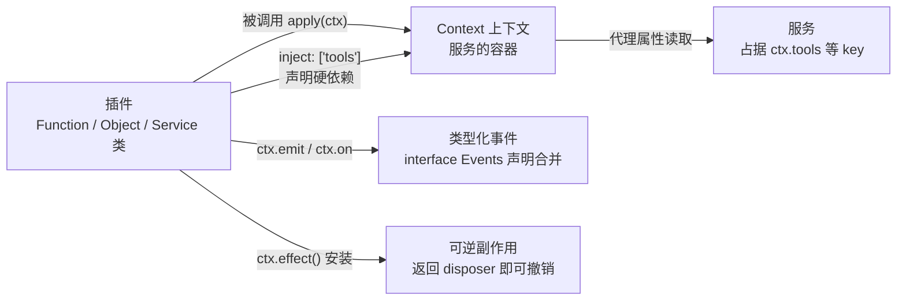
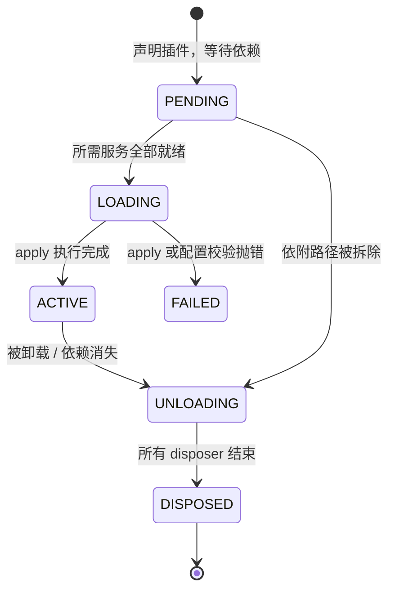
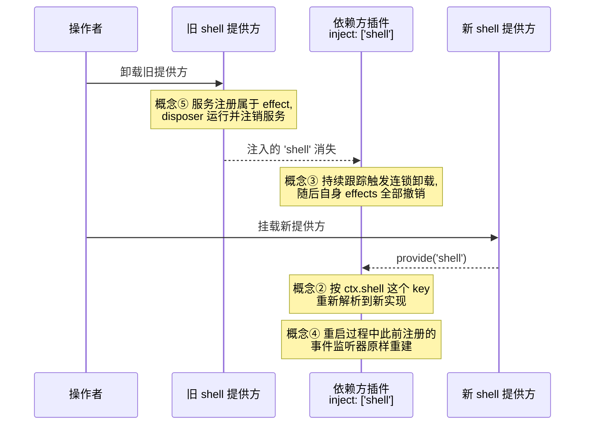

Cordis 是 DeepSeek Harness 底层以 vendor 方式引入的插件框架，源码位于仓库的 `vendor/cordis` 目录。本页面向初学者系统讲解阅读 harness 插件代码前必须掌握的五大核心概念：它们分别回答了"行为如何封装"、"能力如何共享"、"启动顺序如何确定"、"模块之间如何通信"、以及"卸载时如何善后"这五个问题。掌握这些概念后，你就能读懂 harness 中几乎每一个包的入口文件。

Sources: [cordis-primer.zh.md](docs/cordis-primer.zh.md#L1-L13)、[pnpm-workspace.yaml](pnpm-workspace.yaml#L1-L14)

## 五个概念的全景关系

先建立整体图景：每个**插件**在启动时会拿到一个 **Context（上下文）**；它可以向 Context **提供服务**（占据一个稳定的 `ctx.<key>`），也可以用 **inject 声明自己需要哪些服务**从而被动等待就绪；运行期间的跨插件通知走**类型化事件**；而所有注册动作本质上都是**可逆的副作用**，随插件卸载自动撤销。



这份官方定义可以直接对应到仓库文档：[cordis-primer.zh.md](docs/cordis-primer.zh.md#L7-L13)。下面逐一展开。

## 概念一：插件——一切行为的封装单元

**插件就是挂载到 Cordis 上的一小块功能描述。** 最常见的形态是一个导出 `apply(ctx)` 函数的模块：Cordis 加载模块时用上下文调用 `apply`，插件借此完成自己的全部注册。前面提到函数是最常见形式，但框架实际接受三种形态：

| 形态 | 写法 | 典型用途 |
|---|---|---|
| 函数插件 | `export function apply(ctx) {}` | 封装一段行为，不需要对外暴露能力 |
| 对象插件 | `export const p = { name, apply(ctx) {} }` | 与函数形态等价，便于附带显示名 |
| 类插件 | `class S extends Service { constructor(ctx) { super(ctx, 'name') } }` | 需要对外提供一个具名服务时使用 |

教程给出的建议是：**在你需要公开服务之前，一直使用函数形态**；类形态专属于"我要提供一个服务"的场景。

Sources: [01-first-plugin.zh.md](docs/cordis-tutorial/01-first-plugin.zh.md#L55-L77)

源码层面，这三种形态由同一个类型联合收敛：`vendor/cordis/src/registry.ts` 中的 `Plugin.Function`、`Plugin.Constructor`、`Plugin.Object` 三个接口都继承自 `Plugin.Base`，后者定义了所有形态共享的可选元数据——`name`（诊断显示名）、`Config`（配置校验 schema）、`inject`（服务依赖）、`provide`、`intercept`。换句话说，无论你选择哪种写法，框架眼中的插件都是同一份契约。

Sources: [registry.ts](vendor/cordis/src/registry.ts#L95-L133)

## 概念二：上下文服务——能力的稳定坐标

**Context 是服务的容器，而服务是插件提供、其他插件按名字消费的能力。** 在 harness 中你会反复见到 `ctx.tools`、`ctx.llm`、`ctx.sessions` 这样的表达式——每个名字背后都是一项服务。消费方只指定 `'tools'` 这样的字符串 key，而不导入具体实现，因此配置随时可以更换提供方而不必修改消费方代码。

Sources: [cordis-primer.zh.md](docs/cordis-primer.zh.md#L10)、[03-services.zh.md](docs/cordis-tutorial/03-services.zh.md#L7-L11)

这项机制有一个精巧的实现前提：**Context 本身是一个 Proxy（代理）**。你在代码里写下 `ctx.tools` 时，这次属性读取并不会命中某个普通字段，而是进入代理的服务解析器，沿 fiber 链查找名为 `'tools'` 的服务实现；如果该名字既不是服务也没有对应的 accessor，读取会直接抛出"cannot get property without inject"错误。这个设计保证了拼错的 key 会立刻暴露，而不是悄悄返回 `undefined`。

Sources: [context.ts](vendor/cordis/src/context.ts#L16-L42)、[reflect.ts](vendor/cordis/src/reflect.ts#L81-L120)

提供一项服务只需两步协同。以下是教程中的完整最小示例：

```ts
import { Service, type Context } from '@deepseek-ai/cordis'

declare module '@deepseek-ai/cordis' {
  interface Context {
    greeter: GreeterService
  }
}

export class GreeterService extends Service {
  constructor(ctx: Context) {
    super(ctx, 'greeter')   // 第一步：以名称 'greeter' 注册实例
  }

  greet(who: string) {
    return `Hello, ${who}!`
  }
}

export function apply(ctx: Context) {
  ctx.plugin(GreeterService)  // 类本身也是插件，像普通插件一样挂载
}
```

- **运行时**：`Service` 基类构造函数内部调用 `ctx.reflect.provide(name, this)` 完成注册，且该注册属于 effect——卸载提供方时会自动移除服务。
- **编译时**：`declare module '@deepseek-ai/cordis'` 块利用 TypeScript **声明合并**把 `greeter` 加入 `Context` 接口。它不生成任何代码，没有它服务在运行时依然工作，但消费方会失去 `ctx.greeter` 的类型检查。

Sources: [service.ts](vendor/cordis/src/service.ts#L36-L59)、[03-services.zh.md](docs/cordis-tutorial/03-services.zh.md#L14-L42)

需要注意命名纪律：**每个应用中的服务名称共用一个扁平命名空间**，harness 已占用 `tools`、`llm` 等常见名字，自有服务应加上有辨识度的前缀。

Sources: [03-services.zh.md](docs/cordis-tutorial/03-services.zh.md#L92-L94)

## 概念三：inject 依赖声明——让顺序不再靠手工编排

**插件通过 `inject` 列出自己需要的服务，只有当列表里的每一项都存在时才会启动。** 这将"谁先谁后"的表达权交给了服务依赖本身：配置文件中各条目的书写顺序无关紧要，真正决定插件何时启动的是依赖图的拓扑结构。

Sources: [cordis-primer.zh.md](docs/cordis-primer.zh.md#L11)

消费方插件的写法极其简单：

```ts
export const name = 'consumer'
export const inject = ['greeter']

export function apply(ctx: Context) {
  console.log(ctx.greeter.greet('world'))
}
```

当所需服务不存在时，插件的 fiber 会停留在 **PENDING** 状态：不崩溃、不报错、也不执行一半——它只是在安静地等待。甚至可以从 `cordis.yml` 中删掉提供方再运行，消费方依旧保持 PENDING 且不会拖住 Node 进程退出。

Sources: [03-services.zh.md](docs/cordis-tutorial/03-services.zh.md#L44-L72)

更关键的认知是：**inject 不是一次性的启动检查，而是持续跟踪的订阅**。应用运行期间若某项服务被卸载或热替换，每个注入它的插件都会随之卸载并撤销自身的副作用；服务恢复后又会重新加载。这正是 harness 能在配置层面直接替换 `shell` 之类服务提供方的原因——所有 `inject: ['shell']` 的插件会自动重启并绑定新实现。

Sources: [03-services.zh.md](docs/cordis-tutorial/03-services.zh.md#L74-L78)

源码对依赖声明的支持覆盖三种写法：数组形式（只要服务，不带每项服务的拦截配置）、对象形式（服务名到各自拦截配置的映射），以及 `@Inject()` 装饰器（可将依赖贡献进类的静态 `inject` 表，或延迟方法调用直到服务可用）。插件元数据接口中的对应字段正是 `Base.inject?: Inject`。

Sources: [registry.ts](vendor/cordis/src/registry.ts#L12-L24)、[registry.ts](vendor/cordis/src/registry.ts#L100-L111)

真实产品代码中随处可见这种模式。例如 agent-loop 服务的声明只有一行：

```ts
static inject = ['agents', 'sessions', 'llm', 'tools', 'systemPrompt']
```

一行代码即表达了"本服务要在 agents、sessions、llm、tools、systemPrompt 五项服务全部就绪后才启动"的约束。

Sources: [index.ts](packages/core/agent-loop/src/index.ts#L296-L297)

最后是可选依赖的反面模式：如果某项功能缺失时插件仍应工作，就不要放进 `inject`，改用不带强制的 `ctx.get('name')` 探测并在使用处兜底。

Sources: [03-services.zh.md](docs/cordis-tutorial/03-services.zh.md#L80-L90)

## 概念四：类型化事件——解耦的广播通道

**服务支持直接调用，事件则负责"我不知道谁在听，但我需要喊一嗓子"的通知场景。** harness 用事件处理工具结果转发、模型请求和审批决定等跨插件交互。相比服务方法调用的点对点，事件的发出方与监听方完全互不感知。

Sources: [04-events.zh.md](docs/cordis-tutorial/04-events.zh.md#L1-L7)

事件同样通过声明合并获得类型。区别在于合并目标从 `Context` 变成了 `Events`：

```ts
declare module '@deepseek-ai/cordis' {
  interface Context { stats: StatsService }          // 服务键
  interface Events {
    'stats/report'(name: string, count: number): void // 事件名 + 监听器签名
  }
}
```

这两个合并在事件系统中相互对应：`interface Events` 声明事件名及其监听器签名后，`ctx.emit` 和 `ctx.on` 都具有完整类型；`namespace/action` 命名约定（如 `'stats/report'`）让扁平的事件命名空间保持易读。消费方只需一行 `import type {} from './stats.ts'` 让 TypeScript 看见这份合并——它在运行时不导入任何内容。

Sources: [04-events.zh.md](docs/cordis-tutorial/04-events.zh.md#L14-L53)

**每个事件都有一个作为公开约定一部分的分发模式**，决定了监听器能否并发、能否短路、有无返回值。分发方法签名同样是通过 `declare module` 增补进 `Context` 接口的：

| 模式 | 是否 await？ | 监听器执行顺序 | 有无返回值 |
|---|---|---|---|
| `emit` | 否 | 按注册顺序同步观察 | 无 |
| `waterfall` | 否 | 按注册顺序观察 | 有（层层包装） |
| `parallel` | 是 | 全部并行 | 无 |
| `serial` | 是 | 按序 await，首个非空值胜出即停 | 有 |

Sources: [cordis-primer.zh.md](docs/cordis-primer.zh.md#L17-L28)

其中 waterfall 的实现最能体现框架的味道：最后一个参数是内层默认逻辑 `next`，每个监听器都会收到一个 continuation，调用 `next()` 就深入下游并把下游返回值带回自己这一层包装；**不调用 `next()` 直接返回则是"否决"，包括内建行为在内的整条下游链条都不会执行**。

```ts
// 监听器 2：拥有决策权时短路
ctx.on('demo/transform', async (input, next) => {
  if (input.includes('blocked')) return '** blocked **'
  return next()   // 观察型监听器必须委托！
})
```

由此产生一条常设纪律：只负责观察或标注的 waterfall 监听器必须调用 `next()`，否则会悄无声息地吞掉所有下游行为。

Sources: [events.ts](vendor/cordis/src/events.ts#L234-L243)、[04-events.zh.md](docs/cordis-tutorial/04-events.zh.md#L87-L137)

harness 自身也大量使用这一模式——如允许插件替换模型调用配置的 `agent/request`、允许策略代替用户作答的 `approval/request`；分发模式的约定还通过 `@mode` 标签做交叉校验。这是下一页的主题。

Sources: [04-events.zh.md](docs/cordis-tutorial/04-events.zh.md#L139-L141)、[cordis-primer.zh.md](docs/cordis-primer.zh.md#L28)

## 概念五：可逆副作用——"注册必能撤销"的安全网

前四个概念描述了插件"如何活着"，第五个概念保证它"死得干净"。**通过 Cordis API 建立的一切注册——提示词片段、工具 schema、适配器、提供方和监听器——都是可逆的副作用**：reload 和 teardown 时按预期撤销。

Sources: [cordis-primer.zh.md](docs/cordis-primer.zh.md#L13)

对于框架尚未管理的资源（定时器、连接、watcher 等），显式的包装手段是 `ctx.effect()`：主体在加载期间执行，返回的 disposer 在卸载期间执行。源码中该方法的行为契约非常清晰——立即执行 effect 体，收集其产生的 disposer 并在 fiber 卸载或手动调用 disposer 时以逆序运行；重复调用同一 disposer 是幂等的空操作。

Sources: [fiber.ts](vendor/cordis/src/fiber.ts#L401-L427)

日常开发中你反而很少亲手编写它，因为**内置注册 API 本身就已经是 effect**：

| 你写的调用 | 卸载时的自动行为 |
|---|---|
| `ctx.on(event, listener)` | 监听器随所属插件移除，无需手动 `removeListener` |
| `ctx.plugin(child)` | 子插件随父插件递归 dispose |
| 服务注册（`super(ctx, name)`） | 服务从 ctx 上注销并唤醒依赖方 |
| `ctx.tools.register(...)` 等 harness 注册表 | 返回的 disposer 附着到调用插件上，自动撤销 |

这个机制是被源码结构性保证的：事件总线存储监听器的方法内部直接调用了 `this.ctx.fiber.effect(...)`，因此"监听器生命周期 = 所属插件生命周期"没有任何旁路可以破坏。

Sources: [02-lifecycle-and-effects.zh.md](docs/cordis-tutorial/02-lifecycle-and-effects.zh.md#L84-L92)、[events.ts](vendor/cordis/src/events.ts#L245-L260)

一条重要的顺序规则要记住：**disposer 按注册顺序的逆序启动，但多个异步 disposer 是并发运行的**。若拆除步骤必须先后有序，请把它们放进同一个 effect 内依次 await。官方实践守则进一步要求：每个注册都应有对应的 disposer，要么从 `ctx.effect()` 返回，要么交给框架辅助方法处理。

Sources: [02-lifecycle-and-effects.zh.md](docs/cordis-tutorial/02-lifecycle-and-effects.zh.md#L94)、[cordis-primer.zh.md](docs/cordis-primer.zh.md#L50)

## 把五者串起来：Fiber 状态机与热重载演练

以上概念由一个运行时实例统一调度——每个已加载插件都对应一个 **fiber**，它持有验证后的配置、快照化的依赖实现以及该插件注册的全部 effects，并在以下状态间迁移：



PENDING 特别值得记住：初学者常把它误认为 bug——"为什么我的插件没有任何输出？"答案通常就是某个 `inject` 依赖未就绪。

Sources: [02-lifecycle-and-effects.zh.md](docs/cordis-tutorial/02-lifecycle-and-effects.zh.md#L68-L82)、[fiber.ts](vendor/cordis/src/fiber.ts#L127-L160)

用一个典型的服务热替换场景收束全文。假设我们要把 `shell` 的提供方换成另一个实现，五个概念将依次登场：



整个过程无需任何插件感知彼此的存在：提供方只是注册与注销了一项服务，依赖方只是声明过一个名字并用事件通信。这正是"一切皆插件"架构得以成立的地基。

Sources: [03-services.zh.md](docs/cordis-tutorial/03-services.zh.md#L74-L78)、[reflect.ts](vendor/cordis/src/reflect.ts#L114-L148)

## 动手验证与延伸阅读

强烈建议跟着教程亲手跑一遍最小示例（约十分钟）：环境只需一个 `tmp` 目录加一份两行的 `cordis.yml`，命令为 `node --import tsx ../../vendor/cordis/bin.js`。看完本页后继续学习的推荐路径如下。

| 下一步 | 学什么 | 为什么适合现在读 |
|---|---|---|
| [事件分发四模式与 Waterfall 环绕中间件语义](6-shi-jian-fen-fa-si-mo-shi-yu-waterfall-huan-rao-zhong-jian-jian-yu-yi) | 本页事件概念的深潜版 | 补全 bail 模式与包装语义细节 |
| [Cordis 分步教程：从第一个插件到进入 Harness 内部](7-cordis-fen-bu-jiao-cheng-cong-di-ge-cha-jian-dao-jin-ru-harness-nei-bu) | 七章循序渐进实操 | 覆盖配置、组合与 HMR 等剩余主题 |
| [架构总览：一切皆插件的插件树世界](8-jia-gou-zong-lan-qie-jie-cha-jian-de-cha-jian-shu-shi-jie) | 概念如何扩展到整个产品 | 把单插件视角升级为全局视角 |
| [核心包地图：包分组职责与 ctx 服务键导览](10-he-xin-bao-di-tu-bao-fen-zu-zhi-ze-yu-ctx-fu-wu-jian-dao-lan) | harness 全部服务键速查 | 实战时按图索骥找 `ctx.<key>` |
| [轮次流程剖析：turn/step 事件流与 Agent 生命周期扩展点](11-lun-ci-liu-cheng-pou-xi-turn-step-shi-jian-liu-yu-agent-sheng-ming-zhou-qi-kuo-zhan-dian) | 真实事件的编排范例 | 观察五大概念在一次对话轮次中的协作 |