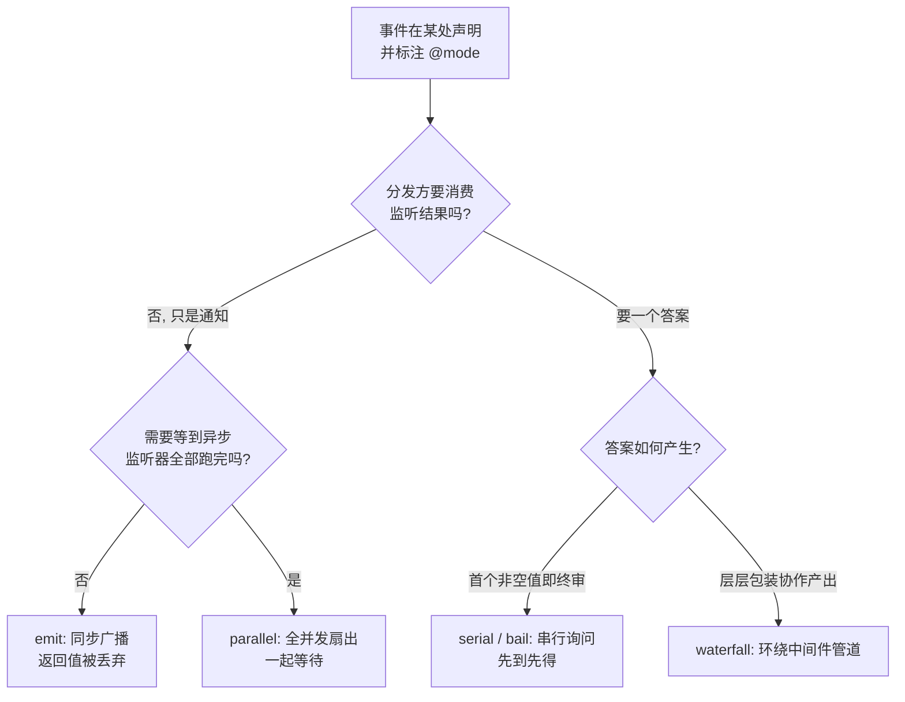
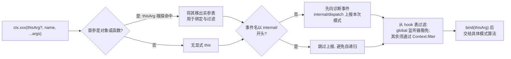
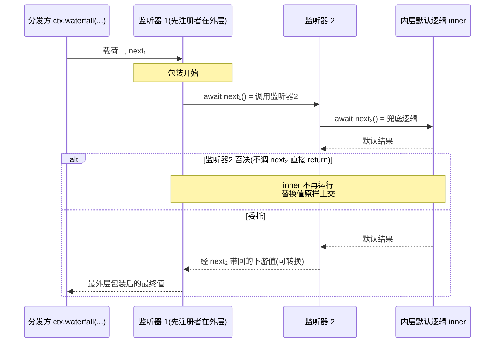

上一页介绍了 Cordis 的五大核心概念，其中“类型化事件”描述了插件间通信的通道。本页回答一个更细的问题：**当一条事件被发出后，它的监听器们到底以什么规则被执行？** Cordis 将这个规则固化为每个事件的**分发模式**——它是事件公开契约的一部分，在声明时就已确定。本页先建立四模式的完整坐标系，再深入其中最精巧的一种：Waterfall 环绕中间件。

## 四种分发模式：写在声明里的公开契约

Cordis 入门文档给出了权威的四模式定义：**每个事件具有以下分发模式之一，且只能通过对应方法分发**。这四种模式沿着两个正交维度展开——“分发方是否需要等待/结果”与“多个监听器之间如何裁决”——见下表：

| 模式 | 调用方式 | 是否等待？ | 监听器执行顺序 | 返回值消费？ |
|---|---|---|---|---|
| `emit` | `ctx.emit(name, ...args)` | 否 | 按注册顺序同步观察 | 否（忽略一切返回） |
| `parallel` | `await ctx.parallel(name, ...args)` | 是（全部完成后） | 全部并发 | 否（仅等待完成） |
| `serial` | `await ctx.serial(name, ...args)` | 是（逐个） | 按注册顺序 | 是（首个短路值胜出即停） |
| `waterfall` | `ctx.waterfall(name, ...args, next)` | 视链条上的 await 而定 | 外层先行，层层深入再层层折返 | 是（最外层包装后的最终值） |

Sources: [cordis-primer.zh.md](docs/cordis-primer.zh.md#L15-L28)、[04-events.zh.md](docs/cordis-tutorial/04-events.zh.md#L80-L92)

这套表格不只是文档惯例——它在源码层面有直接对应：Cordis 的事件总线把全部五种分发策略收敛为一个联合类型 `DispatchMode`，而 `ctx.parallel`、`ctx.emit`、`ctx.serial`、`ctx.bail`、`ctx.waterfall` 这五个方法签名正是通过 `declare module` 增补进每个 Context 的（前页讲过的同一种声明合并机制，合并目标换成了方法区）。分发方法是方法的约定而非运行期选项：一个事件名只应被属于它模式的方法分发，混用会导致监听器收不到预期参数（尤其是 waterfall 的尾参 `next`）。

Sources: [events.ts](vendor/cordis/src/events.ts#L24-L32)、[events.ts](vendor/cordis/src/events.ts#L34-L109)

选型逻辑可以用一张决策图概括。注意两个维度各自独立：要不要“等”决定的是分发方的耐心；怎么“裁决”决定的是监听器之间的关系：



还有一个值得对齐的细节：教程的速查表实际列出了**五个**分发方法——除了四模式外还有一个 `bail`，它是 `serial` 的同步版本（不等待异步监听器）。框架源码和目录生成器的枚举都包含它，且客户端输入子系统在生产代码中大量使用（如斜杠命令的抢答事件），但它不出现在入门级“四模式契约表”中，因为 harness 服务端事件几乎都以四模式中的某一种为公开约定。学习时建议以四模式为心智主干，将 `bail` 记作“serial 的同步双胞胎”。

Sources: [cordis-primer.zh.md](docs/cordis-primer.zh.md#L12)、[events.ts](vendor/cordis/src/events.ts#L128-L129)、[04-events.zh.md](docs/cordis-tutorial/04-events.zh.md#L88-L89)

## 短路判定的边界：什么是“提前终止值”

`serial` 与 `bail` 家族的语义建立在同一个判定函数上：监听器返回值若**不是** `null`、`false` 或 `undefined` 三者之一，分发立即停止并把该值交给分发方。这里有一条容易踩的反直觉规则——**返回 `false` 并不会终止 serial 分发**。设计意图是让“否定但不接管”的表决成为可能：`agent/turn-stopping` 的监听器通过反对来施加转向，而“这一步没有异议”这类假值表态会被视为弃权，分发继续进行到下一个监听器。

Sources: [events.ts](vendor/cordis/src/events.ts#L7-L15)、[events.ts](vendor/cordis/src/events.ts#L198-L209)

`parallel` 的错误处理也有自己的风格：它用 `Promise.allSettled` 等待全部监听器落地（而不是 `all` 提前失败），随后把所有 rejection 收拢为一个 `AggregateError` 抛出。也就是说 parallel 保证“人人都有机会发言”，代价是任何一个监听器的失败都会让整次分发的 Promise 进入 rejected 态——错误报告延迟到全员发言完毕之后一次性呈现。

Sources: [events.ts](vendor/cordis/src/events.ts#L177-L187)

相比之下，裸的 `ctx.emit` 更接近原生 EventEmitter：同步遍历执行、返回值直接丢弃。这在性能上是零开销的通知，但也意味着监听器内的同步异常会沿 `Array.map` 向上传导——harness 在 agent 通知场景下因此封装了自己的发射器（详见下文“统一调度入口”一节）。

Sources: [events.ts](vendor/cordis/src/events.ts#L189-L196)、[dispatch.ts](packages/core/agent/src/dispatch.ts#L120-L124)

## 统一调度入口 dispatch():thisArg、诊断上报与作用域过滤

四个模式方法看似平行，实则共享同一段前置管线——私有方法 `dispatch(type, args)`。无论最终用哪种算法执行，一次分发都要先经过三步处理：



第一步是 **thisArg 嗅探**：如果实参首位是一个对象或函数，它会被当作监听器的 `this` 与过滤载体移出实参表。第二步是**诊断上报**：所有非 `internal/` 事件在投递前会先触发一次 `internal/dispatch`，把本次使用的模式字符串、事件名与参数暴露给观测者——这是整个事件系统的可观测性缝隙。第三步是**作用域过滤**：若存在 thisArg 且其上有 `Context.filter` 符号对应的过滤器，普通监听器只有在过滤器判定通过时才收到事件，带 `global` 选项注册的监听器则不受过滤约束。

Sources: [events.ts](vendor/cordis/src/events.ts#L158-L175)、[events.ts](vendor/cordis/src/events.ts#L111-L117)

`Context.filter` 这个符号键由服务反射层负责安装：当一个服务所在上下文带有隔离标签时，读取该服务的代理会写入对应的过滤器函数。这正是 harness 中 “agent 作用域事件”（监听器声明 `this: Scoped<Agent>`）的实现地基——`scoped` 合成分发器每次都以目标 agent 构造的载体作为首参传入，使 payload 里的 `agent` 字段与过滤键永远一致，不可能错位。

Sources: [context.ts](vendor/cordis/src/context.ts#L42-L48)、[reflect.ts](vendor/cordis/src/reflect.ts#L311-L332)、[dispatch.ts](packages/core/agent/src/dispatch.ts#L38-L59)

一个跨层复用的案例能说明这条管线的通用性：harness 的 agent 分发器没有重造通知循环，而是自己调用了底层管线的原语 `ctx.events.dispatch('emit', args)`，拿到同一套过滤后的回调列表后再逐个执行——并为每个回调独立兜住同步抛出与 promise 拒绝两种失败，从而弥补裸 `Array.map` 会饿死后续监听器的缺陷。而 `serial` 与 `waterfall` 方法则直接前转到 Cordis 混入的原生方法。

Sources: [dispatch.ts](packages/core/agent/src/dispatch.ts#L120-L146)

## Waterfall：环绕中间件的三段执行论

现在进入本页的核心。Waterfall 的本质是把“N 个监听器”变成一条 **洋葱形中间件管道**：分发方提供的最后一个函数参数是最内层的默认逻辑（Cordis 称之为内层 `next`），每个监听器都收到自己的 `(...args, next)`，拥有三种选择——调用 `next()` 深入下游并把下游结果带回本层包装（**委托并转换**）、不调用 `next()` 直接返回（**否决/短路**）、或者修改共享参数后调用 `next()`（**协作式改写**）。

Sources: [cordis-primer.zh.md](docs/cordis-primer.zh.md#L30-L38)、[events.ts](vendor/cordis/src/events.ts#L224-L233)

源码实现只有十行，却精确编码了这套语义：分发首先照常解析出监听器数组，然后把实参表的最后一项弹出作为内层默认逻辑；接着构造闭包 `next`——它每被调用一次就从数组头部 `shift()` 出下一个监听器执行，数组耗尽后回落到内层默认逻辑；最后把 `next` 追加回实参尾部并启动整个链条。返回给分发方的，是最外层监听器的返回值：

```ts
// vendor/cordis/src/events.ts 核心六行
const cbs = this.dispatch('waterfall', args) // 过滤后的监听器队列
const inner = args.pop()                     // 最后一个实参 = 内层默认逻辑
const next = () => {
  const cb = cbs.shift() ?? inner            // 下一个监听器; 队列空则落到 inner
  return cb(...args)
}
args.push(next)                              // next 成为尾参 => “...args, next” 约定
return next()
```

Sources: [events.ts](vendor/cordis/src/events.ts#L234-L243)

下面的序列图以前序页面讲过的合同为前提：监听器按**注册顺序**排布，调用序从外向内，返回值的包装序从内向外。虚线框标注了否决路径——一旦某一层不调用 `next()`，最内层默认逻辑永远不会执行：



用官方教程的可运行示例走一遍第二行的执行轨迹：对输入 `'blocked words'`，监听器 1 先运行并调用 `next()`，驱动权移交监听器 2；监听器 2 识别到 `blocked` 后**不再调用** `next()`，直接返回替换文案 `'** blocked **'`——于是最内层的默认函数压根没执行；折返途中监听器 1 对 `next()` 的返回值执行 `.toUpperCase()` 包一层壳，最终输出 `'** BLOCKED **'`。同样的调用在 `'hello'` 输入下则两层全贯通，输出 `'HELLO'`。

Sources: [04-events.zh.md](docs/cordis-tutorial/04-events.zh.md#L94-L136)

这个对称结构派生出本仓库的一条常设纪律：**只做观察或标注的 waterfall 监听器必须调用 `next()`**。忘记委托不会报任何错——链条只是在你的层静默断掉，下游的所有默认行为（包括别的插件挂着的拦截器）被一并吞掉。策略型监听器反其道而行：当它“拥有决策权”时就应短路，这正是否决语义的设计用途。控制注册顺序的手段是 `on()` 的 `prepend` 选项——仅当监听器必须在既有普通注册之前出招时才使用。

Sources: [04-events.zh.md](docs/cordis-tutorial/04-events.zh.md#L138)、[cordis-primer.zh.md](docs/cordis-primer.zh.md#L36-L38)、[events.ts](vendor/cordis/src/events.ts#L111-L117)

值得一提的是 Cordis 自己也“吃自己的狗粮”：事件总线在构造时就内置了一条手写的 waterfall 链，用于插件的配置更新事件 `internal/update`——它先快照当前钩子表，再用同款 `shift-or-fallthrough` 的 `_next` 闭包把各层串起来，行为与我们刚分析的通用实现完全同构。这可能是最好的活教材：连框架的配置热更新（HMR）管道，本身就是一条可以逐层否决的瀑布。

Sources: [events.ts](vendor/cordis/src/events.ts#L140-L156)、[events.ts](vendor/cordis/src/events.ts#L342-L343)

## harness 实战：@mode 标签如何被机器强制执行

模式不只是口头约定。harness 用目录生成器把它变成了编译期检查项：每个导出到子系统参考页的事件，其 JSDoc 中必须带 `@mode` 标签，否则生成即报违规；投影器还会做**结构交叉验证**——签名末位参数名为 `next`（结构上就是 waterfall）却标注其他模式，或标注 waterfall 却没有 `next` 尾参，都会被逐条记为违例。这份五值白名单与框架的类型定义严格一致。

Sources: [cordis-catalog.ts](packages/typert/generator/src/cordis-catalog.ts#L199-L209)、[cordis-catalog.ts](packages/typert/generator/src/cordis-catalog.ts#L23)

结果是从 agent 核心事件族里抽样，能看到四模式各司其职的清晰分工：

| 事件 | @mode | 监听器能力 | 不作为时的默认逻辑 |
|---|---|---|---|
| `agent/inbox/inserted` 等 | emit | 观察、补充上下文 | 无需存在 |
| `agent/pre-step` | waterfall | 拒绝拟议步骤或替换进入步骤的消息集 | 返回 `{ kind: 'enter' }` 放行 |
| `agent/request` | waterfall | 替换即将冻结的模型调用配置 | 使用 agent options 的原始配置 |
| `agent/request-error` | waterfall | 返回 `{ kind: 'retry' }` 接管恢复 | 默认 `undefined` 让失败终结 |
| `agent/turn-stopping` | serial | 反对关闭轮次（数据化转向） | `void` 表示放行关闭 |

Sources: [runtime-types.ts](packages/core/agent/src/runtime-types.ts#L206-L217)、[runtime-types.ts](packages/core/agent/src/runtime-types.ts#L219-L260)、[runtime-types.ts](packages/core/agent/src/runtime-types.ts#L261-L278)

两处调用点的写实代码最能体现“尾参即默认逻辑”的用法味道。预处理步骤分发中，内层函数被显式写成返回“放行决策”的箭头函数，任何监听器都可以把这个默认决定替换成拒绝：

```ts
const decision = await this.dispatch.waterfall(
  'agent/pre-step', { messages: claimed, ...position, signal },
  (): Promise<PreStepDecision> => /* 内层默认: 放行 */, 
)
```

Sources: [agent.ts](packages/core/agent-loop/src/agent.ts#L232-L248)

审批流则展示了 fail-closed 的安全取向：`approval/request` 的 JSDoc 写明“返回一个结果即可认领请求，或调用 `next()`”——当没有任何监听器认领而链条一路落空时，兑付的是 `'unavailable'` 这个保守答案，绝不存在“无人审批则默认放行”。**内层默认逻辑的性质（宽容还是保守），本身就是 waterfall 事件最重要的接口承诺之一。**

Sources: [index.ts](packages/interaction/user-approval/src/index.ts#L22-L31)、[04-events.zh.md](docs/cordis-tutorial/04-events.zh.md#L140)

客户端一侧补齐了 bail 的生产画像：斜杠命令输入管线里的 `slash/input-*` 系列事件全部标注 `@mode bail`，由控制器用同步 `actx.bail(actx, event, payload)` 抢答布尔值——键盘按键这种高频交互既等不起异步编排，也不需要环绕包装，恰好落在“串行询问、先到先得”这个生态位上。

Sources: [types.ts](packages/client/ui-input-trigger/src/types.ts#L275-L303)、[service.ts](packages/client/ui-commands/src/client/service.ts#L214-L220)

## 如何为一类交互挑选模式

综合以上分析可以沉淀出一组判断句式：**通知型的横切关注点用 emit**（日志、指标、“发生了什么”）；**扇出后汇合的并行预热用 parallel**；**需要一个唯一裁决且希望逐一询问的场景用 serial**（有序表决，`false`/`null` 表示弃权继续）；**多个插件围绕同一份配置或决定展开协作改造、或允许某个插件独占决策权的场景用 waterfall**。为 waterfall 编写监听器时默诵那条纪律——不拥有决策权就必须 `next()`——同时在设计 waterfall 事件时想清楚内层默认逻辑的保守程度。

Sources: [cordis-primer.zh.md](docs/cordis-primer.zh.md#L34-L38)、[dispatch.ts](packages/core/agent/src/dispatch.ts#L41-L53)

至此，Cordis 的通信骨架已经完整：上一页给了你概念地图，本页给了你消息如何在插件树中流动的精确语义。接下来建议动手实践——[Cordis 分步教程：从第一个插件到进入 Harness 内部](7-cordis-fen-bu-jiao-cheng-cong-di-ge-cha-jian-dao-jin-ru-harness-nei-bu)会带你亲手写出五章节的事件代码；若你想看这些分发模式在真实流水线中的重量级应用，[工具注册表、waterfall 把关事件与执行流水线](14-gong-ju-zhu-ce-biao-waterfall-ba-guan-shi-jian-yu-zhi-xing-liu-shui-xian)展示了工具调用如何被瀑布式把关事件层层审签，而[轮次流程剖析：turn/step 事件流与 Agent 生命周期扩展点](11-lun-ci-liu-cheng-pou-xi-turn-step-shi-jian-liu-yu-agent-sheng-ming-zhou-qi-kuo-zhan-dian)则逐一拆解本页出现过的 agent 事件族在整个生命周期中的位置。