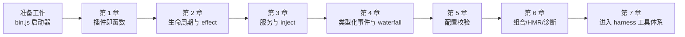
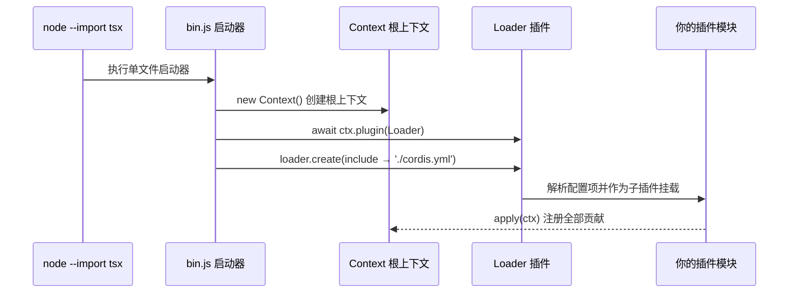
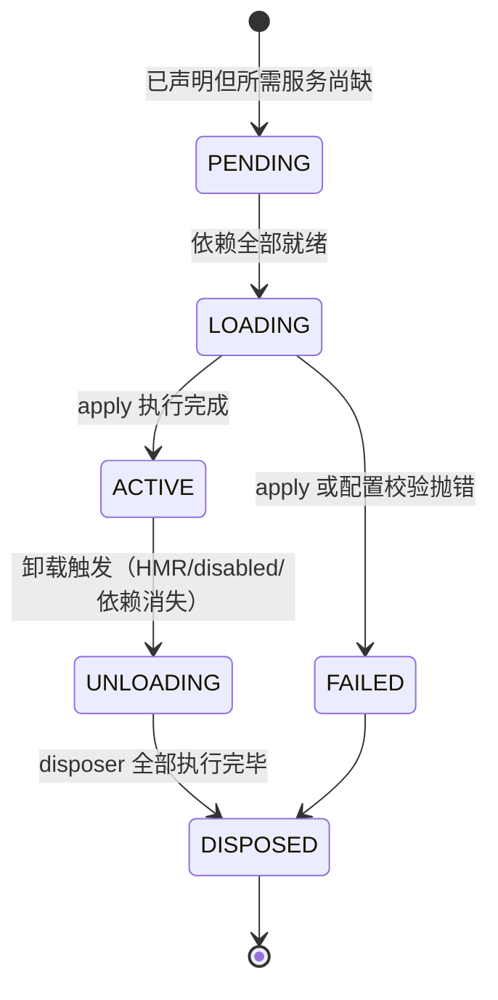
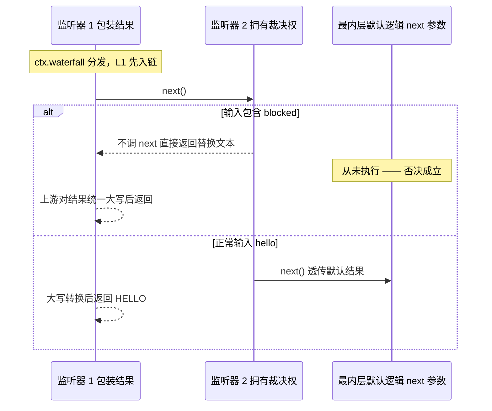
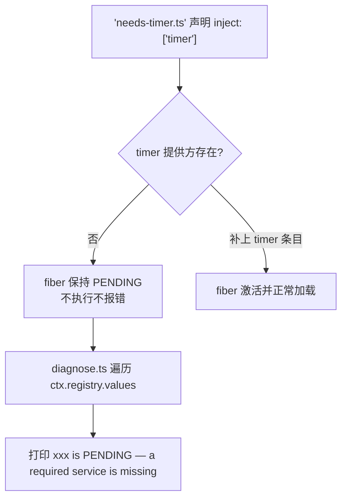
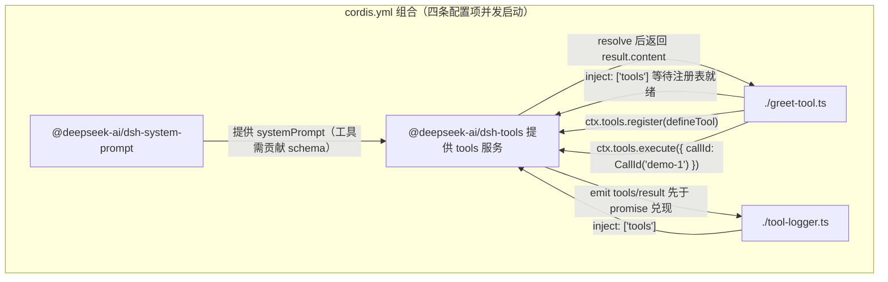

本页是 Cordis 插件框架的**动手实践教程**导读与精讲：Cordis 是 DeepSeek Harness 底层的插件框架——一个小型运行时，其中每项能力（工具、LLM 适配器、文件访问乃至 agent loop 本身）都是挂载到共享上下文中的插件。教程共 7 章，每章都是可运行的示例，你将在 `tmp/cordis-tutorial` 草稿目录中从零构建，最终向 harness 的 `tools` 服务注册一个可由模型调用的工具。全程无需 API 密钥。

Sources: [index.zh.md](docs/cordis-tutorial/index.zh.md#L5-L11)

## 教程定位与学习路径

这份教程面向 agent 开发者，不要求深厚的 TypeScript 功底：每一章都给出确切命令和预期输出，陌生的语法由末尾的 TypeScript 说明解释。它与两类相邻文档分工明确——想要精简的概念参考请读仓库内的《Cordis 入门》（cordis-primer），想要为 harness 本身编写被 Web UI 驱动的插件则应从"第一个 Harness 插件"用户指南开始；而本教程的独特价值是让你在启动器里逐行看到框架的每个概念如何落地。

Sources: [index.zh.md](docs/cordis-tutorial/index.zh.md#L7-L11)

各章之间严格递进，后面的模式全部复用前面的结论：



Sources: [index.zh.md](docs/cordis-tutorial/index.zh.md#L40-L48)

| 章节 | 核心问题 | 新引入的概念 | 你产出的文件 |
|---|---|---|---|
| 准备工作 | 应用如何被启动？ | 启动器、根 `Context`、Loader | `tmp/cordis-tutorial/` 目录 |
| 第 1 章 | 插件长什么样？ | `apply(ctx)`、三种插件形态 | `hello.ts` + `cordis.yml` |
| 第 2 章 | 卸载时发生什么？ | effect / disposer / fiber 状态机 | `lifecycle.ts` |
| 第 3 章 | 能力如何共享？ | `Service` 子类、`inject` 声明、PENDING | `greeter.ts`、`consumer.ts` |
| 第 4 章 | 如何解耦通信？ | `interface Events` 合并、5 种分发模式 | `stats.ts`、`reporter.ts`、`waterfall-demo.ts` |
| 第 5 章 | 配置如何验证？ | `Config` 接口+schema 二象性、`!!js` | `config-demo.ts` |
| 第 6 章 | 配置文件如何成为应用？ | `id`/`disabled`/`isolate`、HMR、PENDING 诊断 | `diagnose.ts`、`needs-timer.ts` |
| 第 7 章 | 如何接入真实 harness？ | `defineTool`、`tools.register/execute`、`tools/result` | `greet-tool.ts`、`tool-logger.ts` |

Sources: [index.zh.md](docs/cordis-tutorial/index.zh.md#L42-L48)、[01-first-plugin.zh.md](docs/cordis-tutorial/01-first-plugin.zh.md#L9-L29)、[02-lifecycle-and-effects.zh.md](docs/cordis-tutorial/02-lifecycle-and-effects.zh.md#L11-L49)、[03-services.zh.md](docs/cordis-tutorial/03-services.zh.md#L9-L66)、[04-events.zh.md](docs/cordis-tutorial/04-events.zh.md#L9-L70)、[05-config.zh.md](docs/cordis-tutorial/05-config.zh.md#L9-L42)、[06-composition-and-hmr.zh.md](docs/cordis-tutorial/06-composition-and-hmr.zh.md#L27-L101)、[07-into-the-harness.zh.md](docs/cordis-tutorial/07-into-the-harness.zh.md#L53-L81)

## 准备工作：一行命令背后的启动器

克隆仓库并执行 `pnpm install` 后，创建 `tmp/cordis-tutorial` 并进入该目录（`tmp/` 已被 git 忽略，写入的任何内容都不会进入版本控制）。整个教程从头到尾只需要一条命令：

```sh
node --import tsx ../../vendor/cordis/bin.js
```

这条命令的效果完全由两份"声明式输入"决定：`cordis.yml` 决定挂载哪些插件及如何配置它们，你的插件文件决定插件贡献什么内容。

Sources: [index.zh.md](docs/cordis-tutorial/index.zh.md#L13-L38)

理解这条命令，等价于理解整个应用的最小骨架。启动器只有一个文件的长度：

```js
import { Context } from '@deepseek-ai/cordis'
import { pathToFileURL } from 'node:url'
import Loader from '@deepseek-ai/cordis-plugin-loader'

const ctx = new Context()
ctx.baseUrl = pathToFileURL(process.cwd()).href + '/'

await ctx.plugin(Loader)
await ctx.loader.create({
  name: '@deepseek-ai/cordis-plugin-include',
  config: { path: './cordis.yml' },
})
```

它只做三件事：创建根 `Context`、把 Loader 插件挂载上去、让 Loader 从当前目录加载 `./cordis.yml`。之后所有事情——有哪些插件、如何配置、以什么顺序激活——都不是命令行参数而是配置文件的内容。

Sources: [vendor/cordis/bin.js](vendor/cordis/bin.js#L1-L17)、[index.zh.md](docs/cordis-tutorial/index.zh.md#L32-L38)

这个最小启动序列可以画成一次调用链：



Sources: [vendor/cordis/bin.js](vendor/cordis/bin.js#L7-L16)、[01-first-plugin.zh.md](docs/cordis-tutorial/01-first-plugin.zh.md#L45-L51)

## 第 1 章：插件就是函数，配置负责组合

第一课只有两个事实。其一，在本教程使用的 loader 配置中，插件模块通过命名导出提供 `apply` 函数，Cordis 加载模块时会用 **ctx** 对象调用它——插件通过这个上下文注册自己贡献的所有内容。其二，应用的组成完全写在 `cordis.yml` 里：一个 `- name: './hello.ts'` 就是一个 Cordis 配置项，`name` 是模块指定符（相对路径或 NPM 包名均可），loader 会挂载每一项。运行后控制台打印 `hello from my first plugin`，随后进程自行退出。

Sources: [01-first-plugin.zh.md](docs/cordis-tutorial/01-first-plugin.zh.md#L5-L43)

值得特别记住的是：**YAML 列表的书写顺序不保证加载顺序**。各项会并发启动，真正的先后由服务依赖（第 3 章的 `inject`）决定。所以本教程的 `cordis.yml` 不是命令脚本，而是对插件树的声明。仓库里的真实组合也遵循同一形态——例如 [`dsh` base 组合包](packages/bundle/base/cordis.patch.yml)就是一份数百行的插件清单，再由部署 overlay 对其按行修补。

Sources: [01-first-plugin.zh.md](docs/cordis-tutorial/01-first-plugin.zh.md#L31-L51)、[cordis.patch.yml](packages/bundle/base/cordis.patch.yml#L15-L22)

除了函数形态，Cordis 还接受另外两种入口形态。三者可混用于同一个应用：

| 形态 | 写法 | 适用场景 | 教程出现位置 |
|---|---|---|---|
| 函数插件 | `export function apply(ctx) {}` | 最常见形态；直接被调用，导出的 `name` 仅作诊断显示 | 第 1 章起贯穿全篇 |
| 对象插件 | `{ name, apply(ctx) {} }` | 需要一个带元数据的字面量对象时 | 第 1 章「其他两种插件形态」 |
| 类插件 | `class extends Service`，构造器内 `super(ctx, '服务名')` | 需要在 `ctx` 上公开服务时 | 第 3 章正式引入 |

Sources: [01-first-plugin.zh.md](docs/cordis-tutorial/01-first-plugin.zh.md#L53-L77)、[registry.ts](vendor/cordis/src/registry.ts#L91-L133)

本章最后刻意制造了两种失败，它们的差别是重要契约：让 `apply` 抛出异常时进程会终止——**加载失败必须明确报错，而不是静默跳过**；但如果某个配置项的模块无法被解析（比如路径拼写错误），Cordis 会通过 logger 服务报告错误而不使进程崩溃，且在启动早期这条日志可能丢失。

Sources: [01-first-plugin.zh.md](docs/cordis-tutorial/01-first-plugin.zh.md#L79-L91)

## 第 2 章：生命周期与 effect——所有注册都可逆

Cordis 插件可能因修改配置、热重载、显式释放或所需服务消失而卸载。规则因此确立：**通过 Cordis API 建立的注册属于 effect，会在所属插件卸载时自动撤销**；在这些 API 之外管理的资源（定时器、连接、watcher）必须包装进 `ctx.effect()` 并返回 disposer（资源释放函数）。

Sources: [02-lifecycle-and-effects.zh.md](docs/cordis-tutorial/02-lifecycle-and-effects.zh.md#L5-L9)

本章的 `lifecycle.ts` 演示同时用了两个 effect 的组合技：外层插件先用 `ctx.plugin(heartbeat)` 从代码挂载一个子插件，再用 `ctx.effect()` 包住一个 700ms 的定时器去 `fiber.dispose()` 该子插件。运行输出依次为 `heartbeat plugin loading`、三声 `tick`、`heartbeat cleaned up`、`disposed`——注意没有人手动调用过 `clearInterval` 所在的那个 disposer 的容器逻辑之外的任何东西。

Sources: [02-lifecycle-and-effects.zh.md](docs/cordis-tutorial/02-lifecycle-and-effects.zh.md#L11-L60)

三个观察点浓缩了本章：`ctx.plugin(heartbeat)` 说明从代码挂载函数插件与 YAML loader 为配置项做的事完全相同；effect 主体在**加载期间**运行、disposer 在**卸载期间**运行，生命周期与插件一致的资源永远无需手动清理；`fiber.dispose()` 会等待包括异步 disposer 在内的全部清理完成，并递归卸载其挂载的所有子插件。

Sources: [02-lifecycle-and-effects.zh.md](docs/cordis-tutorial/02-lifecycle-and-effects.zh.md#L62-L66)

每个已加载的插件实例都是一个 fiber，在以下状态间迁移。这个状态机在第 6 章诊断"消失的插件"时会再次派上用场：



Sources: [02-lifecycle-and-effects.zh.md](docs/cordis-tutorial/02-lifecycle-and-effects.zh.md#L68-L82)、[fiber.ts](vendor/cordis/src/fiber.ts#L139-L154)

好消息是你极少需要亲手写 `ctx.effect()`，因为内置注册 API 自身已是 effect：`ctx.on(event, listener)` 的监听器随卸载移除；`ctx.plugin(child)` 的子插件随父插件一同释放；服务注册以及 `ctx.tools.register(...)` 这类 harness 注册表 API 都会把返回的 disposer 附着到调用插件上自动撤销。唯一的顺序细节是：disposer 按注册的**逆序**启动，但多个**异步** disposer 会并发运行——需要严格顺序的拆除步骤应放进同一个 disposer 内部依次 await。

Sources: [02-lifecycle-and-effects.zh.md](docs/cordis-tutorial/02-lifecycle-and-effects.zh.md#L84-L94)、[events.ts](vendor/cordis/src/events.ts#L254-L260)

## 第 3 章：服务——ctx 上具名的能力

**服务**是一个插件提供、其他插件经 `ctx` 消费的具名能力；harness 的 `ctx.tools`、`ctx.llm` 和 `ctx.agents` 都是服务。关键设计在于：消费方只指定 `'tools'` 这样的能力名而不导入其提供方，因此配置层面可以直接更换提供方而无须修改消费方代码。

Sources: [03-services.zh.md](docs/cordis-tutorial/03-services.zh.md#L5-L5)

提供服务需要两个互相咬合的部分。**运行时部分**：`GreeterService` 继承 `Service` 并在构造器中执行 `super(ctx, 'greeter')`，实例随即以名称 `greeter` 注册，任何插件都能访问 `ctx.greeter`——注册本身属于 effect，提供方卸载时服务随之移除。**编译时部分**：文件顶部的 `declare module '@deepseek-ai/cordis'` 块借助 TypeScript 声明合并把 `greeter` 属性加入 `Context` 接口，让 `ctx.greeter` 全局类型安全；该块不生成任何代码，删掉它服务照常工作，只是失去类型检查。

Sources: [03-services.zh.md](docs/cordis-tutorial/03-services.zh.md#L11-L42)、[service.ts](vendor/cordis/src/service.ts#L11-L59)

消费方一侧惊人地简短——只需一行 `export const inject = ['greeter']`。Cordis 据此让插件保持 PENDING 直到所列每项服务都存在，于是 `apply` 内部可以保证 `ctx.greeter` 已就绪。你可以交换 YAML 中两行的顺序重跑，输出不变；彻底删掉 `./greeter.ts`，消费方也不崩溃不报错，只是安静地停在 PENDING，且不会阻止进程退出。

Sources: [03-services.zh.md](docs/cordis-tutorial/03-services.zh.md#L44-L72)

`inject` 不是一次性启动检查，而是**持续追踪的依赖关系**：如果运行中所需服务因提供方被卸载或热替换而消失，每个依赖它的插件也会随之卸载，并在服务恢复后重新加载。这正是 harness 能力可替换的实现基础——把 `dsh-bash-local` 这类提供方换成另一个同名能力的实现，所有注入该服务的插件都会重启并使用新实现。

Sources: [03-services.zh.md](docs/cordis-tutorial/03-services.zh.md#L74-L78)

两种补充形态完善了服务模型：可选依赖跳过 `inject` 改用 `ctx.get('name')` 探测（无提供方时得到 `undefined` 但插件正常运行）；命名方面，所有服务共用一个扁平命名空间，harness 已占用 `tools`、`llm` 等普通名，自建服务应加有辨识度的前缀——harness 注册的每一个名字都列在各子系统页面生成的 `cordis-surface` 区块里。

Sources: [03-services.zh.md](docs/cordis-tutorial/03-services.zh.md#L80-L94)

## 第 4 章：事件——类型化广播与 waterfall 短路

服务是点对点直接调用，**事件**则是广播：发出方无须知道谁在监听。harness 用事件处理工具结果、模型请求和审批决定等交互。事件的类型化同样靠声明合并完成——`interface Events` 中写下 `'stats/report'(name: string, count: number): void`，`ctx.emit` 和 `ctx.on` 即获得完整类型检查；监听方通过 `import type {} from './stats.ts'` 引入这些声明，这行零运行时代码，纯粹为 TypeScript 服务。`namespace/action` 命名约定保持扁平命名空间的可读性。

Sources: [04-events.zh.md](docs/cordis-tutorial/04-events.zh.md#L5-L78)

每种事件固定采用一种分发模式，这是事件约定的一部分，决定了监听器能否返回值、能否并发、能否短路：

| 模式 | 调用方式 | 语义 | 运行时依据 |
|---|---|---|---|
| emit | `ctx.emit(name, ...args)` | 同步广播；不等待也不收集返回值 | 监听器映射后逐一调用即返回 |
| parallel | `await ctx.parallel(...)` | 所有监听器并发运行并一同等待 | `Promise.allSettled` 聚合错误 |
| serial | `await ctx.serial(...)` | 按序等待；首个非 `null`/`false`/`undefined` 返回值胜出并停止 | 循环内 `isBailed` 判定 |
| bail | `ctx.bail(name, ...args)` | serial 的同步版本 | 同步循环 `isBailed` 判定 |
| waterfall | `ctx.waterfall(name, ...args, next)` | 环绕中间件组合，见下文 | 以 `next` 为最内层递归取监听器 |

Sources: [04-events.zh.md](docs/cordis-tutorial/04-events.zh.md#L80-L92)、[events.ts](vendor/cordis/src/events.ts#L24-L32)、[events.ts](vendor/cordis/src/events.ts#L183-L243)

waterfall 是实现拦截的模式：每个监听器额外收到一个 `next()` continuation，可以转换 `next()` 的返回值，也可以**不调用 `next()` 直接返回**——后者称为否决，会短路链条其余部分乃至最内层默认逻辑。`waterfall-demo.ts` 用两个监听器复现了这一行为：



实测输出为 `HELLO` 与 `** BLOCKED **` 两行。

Sources: [04-events.zh.md](docs/cordis-tutorial/04-events.zh.md#L96-L136)、[events.ts](vendor/cordis/src/events.ts#L224-L243)

由此产生本仓库的常设纪律：**只负责观察或标注的 waterfall 监听器必须调用 `next()`**——忘调的日志监听器会无声吞掉下游一切默认行为。harness 正是用这一模式承载协作决策：`agent/request` 允许插件改写模型调用配置，`approval/request` 允许策略代替用户作答。

Sources: [04-events.zh.md](docs/cordis-tutorial/04-events.zh.md#L138-L140)

## 第 5 章：配置——schema 校验与明确报错

`cordis.yml` 的每个配置项都可以携带 `config` 块，而插件用导出的 schema 在 `apply` 运行前校验它。约定如此强硬：**配置错误导致加载失败并给出精准报错，插件绝不会带着不完整配置启动**。

Sources: [05-config.zh.md](docs/cordis-tutorial/05-config.zh.md#L5-L5)

代码里的核心技巧是"`Config` 二象性"：同一个标识符既是描述字段类型的 TypeScript `interface Config`，又是同名的运行时 `Schema<Config>` 校验器——`apply(ctx, config)` 第二个参数收到的永远是补齐默认值后的完整校验产物。合法输入与非法输入只有一步之遥，对照如下：

| | 合法配置（正常运行） | 非法配置（明确报错） |
|---|---|---|
| `cordis.yml` 片段 | `targets: ['alpha', 'beta']` | `targets: 'not-an-array'` |
| 运行表现 | schema 默认值补齐缺失的 `greeting`，打印两行问候 | 抛出 `ValidationError: invalid config: - $.targets expected array but got not-an-array (at targets)` |
| fiber 状态 | `ACTIVE` | 进入 `FAILED`，启动器以状态码 1 退出 |

Sources: [05-config.zh.md](docs/cordis-tutorial/05-config.zh.md#L11-L68)、[fiber.ts](vendor/cordis/src/fiber.ts#L18-L62)

本章还介绍了本仓库 loader 的扩展能力：`!!js` 标签允许在**加载时**求值配置表达式，如 `greeting: !!js process.env.DEMO_GREETING ?? 'Hello'`。作用域收得很紧——`!!js` 仅在条目的 `config` 和 `disabled` 字段内有效；后者按每次挂载决策基于 loader 上下文求值，可用一行实现按平台或环境的门控，其余元数据（`name`、`id`、`inject` 等）保持静态。

Sources: [05-config.zh.md](docs/cordis-tutorial/05-config.zh.md#L70-L80)

## 第 6 章：组合与 HMR——把 cordis.yml 当作运行中的应用

至此"配置文件"升格为"插件树"。Cordis 配置项除 `name` 与 `config` 外还有更多元数据字段：

| 字段 | 作用 | 行为要点 |
|---|---|---|
| `id` | 给配置项稳定身份 | loader 据此区分"修改现有项"与"先删再加"，是 HMR 差异比较的键 |
| `disabled` | 保留条目但跳过挂载 | 支持静态布尔或 `!!js` 表达式门控；回改后插件连同 PENDING 依赖方一起复活 |
| `group`（组嵌套） | 把一份子列表作为一个单元装卸 | 整组启停 |
| `isolate` | 为组提供某服务的独立实例 | 两组可各自持有配置不同的同类服务，互不可见 |

Sources: [06-composition-and-hmr.zh.md](docs/cordis-tutorial/06-composition-and-hmr.zh.md#L7-L21)

热模块替换之所以可行，正是前几章机制的自然拼接：**卸载回卷 effect（第 2 章），加载遵循依赖（第 3 章），于是 HMR 插件可以在保存时先卸旧实例再装新代码**。示例组合特意暴露了一个易踩的坑：`@deepseek-ai/cordis-plugin-hmr` 通过 logger 服务记录消息（所以要加 console logger 导出器才能看见），又 `inject` 了 `timer` 服务做去抖（没有 timer 提供方它会永远静默 PENDING）。编辑 `hello.ts` 保存后，旧实例的全部 effect 回卷、新代码重新 `apply`，日志顺序完整记录了这一过程；编辑 `cordis.yml` 本身同样触发更新——loader 按 `id` 比较配置项，只挂载、卸载或重新配置发生变化的部分。

Sources: [06-composition-and-hmr.zh.md](docs/cordis-tutorial/06-composition-and-hmr.zh.md#L23-L59)

依赖驱动加载的另一面是沉默：`inject` 指向无人提供的服务时插件无限期 PENDING 且无任何输出——这是合法状态而非错误，因为提供方可能稍后才挂载。应对办法是主动枚举注册表查看 fiber 状态，`diagnose.ts` 五行循环即可做到：



下表汇总新手最常遇到的三类"没有输出"症状及其排查路径：

| 症状 | 根因 | 处理方式 |
|---|---|---|
| 插件毫无动静也无报错 | `inject` 的服务无提供方，停在 PENDING | 用 `diagnose.ts` 枚举 `FiberState.PENDING` 定位缺失服务名，再向 `cordis.yml` 添加对应提供方条目 |
| HMR 重载日志看不见 | 缺少 console logger 导出器 | 加入 `@deepseek-ai/cordis-plugin-logger-console` 条目 |
| HMR 永远不触发且不提示 | HMR 自身 inject 的 `timer` 无提供方，HMR 卡在 PENDING | 加入 `@deepseek-ai/cordis-plugin-timer` 条目 |
| 进程启动即退出且状态码非 0 | 配置校验抛 `ValidationError` 或 `apply` 抛异常，进入 FAILED | 按报错信息修正 YAML 或插件代码 |

Sources: [06-composition-and-hmr.zh.md](docs/cordis-tutorial/06-composition-and-hmr.zh.md#L61-L109)、[04-events.zh.md](docs/cordis-tutorial/04-events.zh.md#L138-L139)

## 第 7 章：进入 Harness——注册模型可调用的工具

收官章把前六章的模式拼成一个真实的 harness 切片：向 `tools` 服务注册工具、经由真正的工具流水线执行、并用独立插件观察结果事件。整个过程无密钥、不调用任何模型。

Sources: [07-into-the-harness.zh.md](docs/cordis-tutorial/07-into-the-harness.zh.md#L5-L5)

`greet-tool.ts` 的每一行都是旧知识的回报：`inject: ['tools']` 是第 3 章的服务等待；`ctx.tools.register(...)` 的注销 disposer 自动附着到插件是第 2 章的 effect 纪律，工具随插件卸载而注销；随后插件亲手扮演模型角色，用 `CallId('demo-1')` 构造关联 ID 发起一次 `ctx.tools.execute(...)`，让调用走完真实的执行流水线。

Sources: [07-into-the-harness.zh.md](docs/cordis-tutorial/07-into-the-harness.zh.md#L11-L49)

`tool-logger.ts` 则演示了观察者模式：作为互不相识的另一个插件，仅凭监听 harness 的 `tools/result` 广播即可审计应用中的每一次工具调用；`import type {} from '@deepseek-ai/dsh-tools'` 把第 4 章的单文件声明合并推广到了**包级**。本次 mini-app 的接线全景如下：



实测输出证实了时序：`[tool-logger] greet -> Hello, Cordis!` 先打印，`tool replied: [{"type":"text",...}]` 后到——`tools/result` 在结果物化过程中发出，早于 `execute` 返回的 promise 向调用方兑现。

Sources: [07-into-the-harness.zh.md](docs/cordis-tutorial/07-into-the-harness.zh.md#L55-L94)

一个容易忽略的组合细节：配置中必须显式列出 `@deepseek-ai/dsh-system-prompt`，因为 `dsh-tools` 注入了 `systemPrompt` 服务（工具要向系统提示词贡献 schema）；缺了这个提供方，两个示例插件都会像第 6 章那样卡在 PENDING——亲手体验一次第 6 章的诊断方法正好发生在最具真实感的场景里。

Sources: [07-into-the-harness.zh.md](docs/cordis-tutorial/07-into-the-harness.zh.md#L76-L83)

## 从教程走向完整 agent：如何读懂真实组合包

真实 agent 没有任何新机制，只是"这套组合再加上更多插件"：LLM 适配器、agent loop、持久化和运行入口。现在你已经具备逐行读懂 [examples/headless-agent/cordis.yml](examples/headless-agent/cordis.yml) 的全部词汇——开头几条目即为例证：`settings`、`credentials` 两个提供方承载用户平面数值，`llm-deepseek` 条目的 `config` 块正是第 5 章 schema 校验的对象，`agent-spine` 配置中的 `cwd: !!js process.cwd()` 正是第 5 章的加载时求值，每个条目的 `id` 也正是第 6 章 HMR 差异比较的稳定键。

Sources: [07-into-the-harness.zh.md](docs/cordis-tutorial/07-into-the-harness.zh.md#L98-L99)、[cordis.yml](examples/headless-agent/cordis.yml#L9-L46)、[cordis.patch.yml](packages/bundle/base/cordis.patch.yml#L15-L23)

建议的延伸路线有三条并行支线。想深入单个工具的定义（呈现层与更丰富的 schema），继续读仓库内"构建工具"指南（`docs/user/develop/basic/tool.zh.md`）；想在更高抽象层级回顾这套设计，请移步 wiki 的概念页面；想知道这些插件所在的系统全貌，阅读架构总览。

## 下一步

完成本教程后，沿目录体系推荐如下阅读顺序，各页与本教程的关系一目了然：

1. 回补概念坐标系：[Cordis 五大核心概念：插件、上下文服务、inject 依赖声明、类型化事件与可逆副作用](5-cordis-wu-da-he-xin-gai-nian-cha-jian-shang-xia-wen-fu-wu-inject-yi-lai-sheng-ming-lei-xing-hua-shi-jian-yu-ke-ni-fu-zuo-yong)——把你动手做过的七件事归位到五个正交概念。
2. 深挖最微妙的一环：[事件分发四模式与 Waterfall 环绕中间件语义](6-shi-jian-fen-fa-si-mo-shi-yu-waterfall-huan-rao-zhong-jian-jian-yu-yi)——展开第 4 章只点到为止的否决纪律。
3. 放眼全局地图：[架构总览：一切皆插件的插件树世界](8-jia-gou-zong-lan-qie-jie-cha-jian-de-cha-jian-shu-shi-jie)，随后用 [核心包地图：包分组职责与 ctx 服务键导览](10-he-xin-bao-di-tu-bao-fen-zu-zhi-ze-yu-ctx-fu-wu-jian-dao-lan) 对照第 3 章学到的 `ctx.*` 服务键认识整棵包树。
4. 观察同类组合的真实运转：[轮次流程剖析：turn/step 事件流与 Agent 生命周期扩展点](11-lun-ci-liu-cheng-pou-xi-turn-step-shi-jian-liu-yu-agent-sheng-ming-zhou-qi-kuo-zhan-dian)——第 7 章的工具流水线在完整轮次中的位置将在那里揭晓。