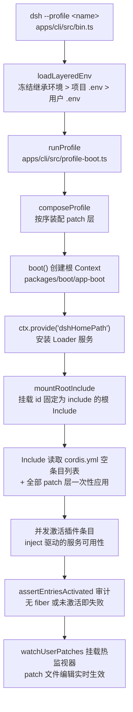
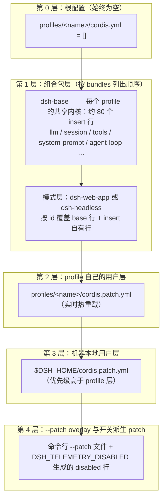
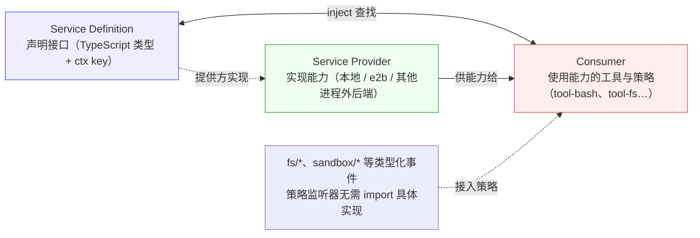

本页是整个"深入解析"部分的入口总览。我们将回答三个问题：DeepSeek Harness（下文简称 dsh）为什么可以做到"产品的每一部分都是插件"；一棵运行中的插件树是如何从一条命令被组装出来的；以及这种架构给扩展点设计带来了哪些可复用的模式。读完本页，你将获得一张全景地图——后续各页会逐一深入其中的每个区域。

## 无内核的世界：一切皆插件

dsh 构建在 Cordis 插件框架之上。Cordis 是 dsh 以 vendor 方式引入的底层框架，其主张是：**插件向共享上下文贡献服务、类型化事件和可逆的副作用**。在 dsh 中，这条主张被推到了极致——模型适配器、工具注册表、会话日志，乃至 agent loop（智能体循环）本身，全部都是普通插件，没有任何一部分享有特权地位。

这意味着 dsh 里**不存在需要打补丁的特权内核**。扩展产品的方式不是修改核心代码，而是把新插件挂载到其他插件旁边；所有注册（工具 schema、提示词片段、适配器、监听器）都是副作用，会在其所属插件卸载时自动撤销。

Sources: [architecture.zh.md](docs/architecture.zh.md#L9-L13) [cordis-primer.zh.md](docs/cordis-primer.zh.md#L5)

理解这一点的第一步是掌握 Cordis 的五个核心概念，它们构成了后续所有讨论的公共语言：

| Cordis 概念 | 一句话定义 | 在 dsh 中的体现 |
|---|---|---|
| 插件 | 实现 Service 的对象，带可选 `inject` 与 `apply(ctx)` | 组合包里的每一个配置行就是一个插件实例 |
| 上下文 | 服务的容器，服务占据稳定的 `ctx.<key>` | `ctx.tools`、`ctx.llm`、`ctx.sessions` 等 |
| inject | 声明式依赖：等服务就绪才启动 | 加载顺序由服务依赖表达，而非手动编排 |
| 类型化事件 | 通过声明合并注册事件名，按分发模式通信 | 事件即扩展点（详见后文） |
| 可逆注册 | 经由 `ctx.effect()` / `ctx.on()` 安装并返回释放函数 | 插件卸载时注册随之撤销，HMR 因此可行 |

Sources: [cordis-primer.zh.md](docs/cordis-primer.zh.md#L7-L13)

请特别注意 **inject** 这一条：它解释了为什么配置行的书写顺序无关紧要。一个插件声明它需要哪些服务，Cordis 就会在这些服务可用时才激活它——树的形状由依赖关系自然涌现，而不是由文件里的排列顺序决定。这一性质是我们稍后看到的"dsh-base 作为一整块 insert、行序不承载语义"的合法前提。

Sources: [base/cordis.patch.yml](packages/bundle/base/cordis.patch.yml#L12-L13)

## 这棵树是怎么被种下的：从一条命令到根上下文

从宏观俯瞰启动流水线：`dsh` 二进制解析命令行、冻结环境快照，然后按序叠加 patch 层，最后把整棵配置树挂载到一个 Cordis 根上下文中等待结算。



Sources: [bin.ts](apps/cli/src/bin.ts#L30-L36) [profile-boot.ts](apps/cli/src/profile-boot.ts#L207-L258)

具体来说，`dsh` 入口按调用形态分派到三种模式：`profile`（正常启动）、`plugin`（插件管理）与 `dump-config`（打印合成配置）。只有 `profile` 模式会走到 `runProfile`——它是所有启动面的共享路径，负责"叠加 patch 层、在 profile 的空根配置上挂载插件树、保持用户 patch 层实时生效，并接线 fail-loud 与有界关闭"。

Sources: [bin.ts](apps/cli/src/bin.ts#L38-L54) [profile-boot.ts](apps/cli/src/profile-boot.ts#L1-L12)

`boot()` 函数是启动粘合层的最深处，它的序列极为克制地体现了分层原则：先创建根上下文并把 `dshHomePath` 暴露给配置表达式，再安装 Cordis Loader，接着执行宿主可选的 `prepare` 回调（CLI 在这里注入环境快照与命令行参数），然后才通过 `mountRootInclude` 把根 Include 条目挂进树中。这个根 Include 条目有一个**固定 id `"include"`**——注释明确说明它是"应用胶水而非配置行"，固定 id 只是为了让启动诊断跨次运行保持稳定。

Sources: [index.ts](packages/boot/app-boot/src/index.ts#L757-L785) [index.ts](packages/boot/app-boot/src/index.ts#L511-L523)

树结算后的失败处理同样值得关注：`assertEntriesActivated` 会审计每一条已启用的配置行——没有 fiber 的（模块导入失败）、激活时抛错的、以及永远停在 pending 状态等不到服务的（它会精确报出缺失的 inject 键）——任何一种都会让启动以"fail loud"结束，绝不带着残缺的树静默运行。

Sources: [index.ts](packages/boot/app-boot/src/index.ts#L692-L724)

## 分层配方：一张空列表加按序叠加的 Patch 层

profile 运行的真相可能会颠覆直觉：profile 目录里的 `cordis.yml` **永远是一张空的条目列表**，并且在每次启动时都会被重写回空。整棵树不是写在这个文件里，而是作为 patch 层叠加出来的。这个文件存在于磁盘上的唯一理由，是 Loader 需要一个真实的 include 根来锚定模块解析的 baseUrl。

```text
PROFILE_ROOT_CONFIG：
# dsh profile root — an empty entry list. The tree is composed as patches:
# each bundle in package.json's dsh.profile.bundles, then cordis.patch.yml, then any
# --patch overlays. Edit cordis.patch.yml, not this file.
[]
```

Sources: [profile-boot.ts](apps/cli/src/profile-boot.ts#L59-L64) [profile-boot.ts](apps/cli/src/profile-boot.ts#L85-L103)

那树从哪里来？答案是四个层次的按序叠加。**Profile** 是存放在 Harness home（默认 `~/.dsh`）下的具名目录，其 `package.json` 中的 `dsh.profile.bundles` 列出所叠的组合包名并存放用户自己的 `cordis.patch.yml`；**组合包** 则是在 manifest 中声明 `"dsh": { "bundle": { "patch": "./cordis.patch.yml" } }` 的 npm 包，实体就是一份 patch 列表。发行版内置两套模板组合：`web` 叠加 `dsh-base + dsh-web-app`，`headless` 叠加 `dsh-base + dsh-headless`。

Sources: [app-boot/profile.ts](packages/boot/app-boot/src/profile.ts#L1-L23) [bundle/README.zh.md](packages/bundle/README.zh.md#L3-L6) [app-boot/profile.ts](packages/boot/app-boot/src/profile.ts#L113-L117)



Sources: [profile-boot.ts](apps/cli/src/profile-boot.ts#L121-L129) [architecture.zh.md](docs/architecture.zh.md#L15-L27)

两个组合包各司其职，形成清晰的分工：

| 组合包 | 角色 | 关键内容 |
|---|---|---|
| `dsh-base` | 每个 profile 最先应用的共享核心 | 以**一整块 `insert`** 写入：模型适配器、工具注册表、会话持久化、沙箱与审批策略、设置、凭据、遥测 |
| `dsh-web-app` | 浏览器表层 | 按 id 覆盖 base 行（如禁用 hmr），再 `insert` host 侧网关行与浏览器插件名册（connection、client-runtime、ui-* 族） |
| `dsh-headless` | 一次性任务模式 | 直接运行在 base 之上，不含 Host 或 Web 层 |

Sources: [bundle/README.zh.md](packages/bundle/README.zh.md#L11-L15) [base/cordis.patch.yml](packages/bundle/base/cordis.patch.yml#L1-L14)

这里藏着 dsh 组合系统最重要的规则之一：**patch 按 id 定位某一行并替换该行的整个 config，而不是深度合并**。所以 mode 特有的值不会出现在 base 里——base 只保留共享身份与中性默认值，每个模式组合包完整复述自己需要的全部键。这也意味着用户 patch 要覆盖某个值时，必须重述想保留的其他字段。每次叠加采用"最后一写胜出"（last write wins）语义。

Sources: [base/cordis.patch.yml](packages/bundle/base/cordis.patch.yml#L6-L10) [app-boot/README.zh.md](packages/boot/app-boot/README.zh.md#L57-L61)

想知道你的机器实际会长出一棵什么样的树？官方给出的探查方式是 `dsh --profile web --dump-config`——它会离线重放整条 patch 流水线，以 YAML 形式渲染最终条目列表，并为每个连续区段标注来源注释（`# == cordis.patch.yml` 等）。它打印出的任何条目，都可以由你自己的 patch 替换。

Sources: [architecture.zh.md](docs/architecture.zh.md#L29-L37) [index.ts](packages/boot/app-boot/src/index.ts#L349-L357)

Profile、组合包与多层 patch 的逐字段规则、解析顺序边界情况与树外插件的安装方式，将在下一页展开：[Profile、组合包与多层 Patch 的按序叠加机制](9-profile-zu-he-bao-yu-duo-ceng-patch-de-an-xu-die-jia-ji-zhi)。

## 树上长着什么：服务键构成的产品骨架

patch 决定了哪些插件被挂载，而插件之间靠 `ctx.<key>` 服务完成协作。核心包与其暴露的服务键可以浓缩成下面这张骨架图：

| 包 | 职责 | `ctx` 键 |
|---|---|---|
| `core/session` | 仅追加的 `SessionEvent` 日志和内存存储 | `ctx.sessions` |
| `core/system-prompt` | 提示词片段与工具 schema 的组装 | `ctx.systemPrompt` |
| `core/tools` | 作用域化的工具注册表和带把关的执行流水线 | `ctx.tools` |
| `core/agent` | `Agent` 接口、活跃 agent 注册表和 `agent/*` 事件 | `ctx.agents` |
| `core/agent-loop` | 该接口的默认驱动器实现 | `ctx.agentLoop` |
| `core/scope` | 按 agent 划分作用域的注册原语 | 库，无 ctx 键 |
| `llm/llm` | 消息与流式词汇表，及适配器 seam | `ctx.llm` |

Sources: [architecture.zh.md](docs/architecture.zh.md#L39-L51) [core/README.zh.md](packages/core/README.zh.md#L7-L15)

注意其中一对刻意分离的设计：`agent` 只负责公开接口约定，`agent-loop` 才是具体驱动器实现。消费者依赖的是前者这个 seam——于是循环本身同样可以被替换，这正是"一切皆插件"原则作用于产品最深处的结果。

Sources: [core/README.zh.md](packages/core/README.zh.md#L16-L18)

完整的包分组地图与更多服务键导览见专页：[核心包地图：包分组职责与 ctx 服务键导览](10-he-xin-bao-di-tu-bao-fen-zu-zhi-ze-yu-ctx-fu-wu-jian-dao-lan)。

## 插件如何对话：事件域即扩展点

树上的插件并不是互相调用的，而是通过三个各司其职的事件域交流：**会话事件**是追加到日志并通过 `session/event` 广播的持久事实，凡需要跨重启存活的内容都用它；**Agent 事件**（`agent/*`）携带活跃 Agent 对象，用于观察或拦截进行中的工作；**能力事件**则允许插件在不产生导入循环的前提下向某个能力接缝（如 `fs/*`、`tools/*`、`telemetry/*`）附加策略和适配器。

Sources: [architecture.zh.md](docs/architecture.zh.md#L55-L63)

这三类事件的精确区别在于它们的听众：会话事件面向持久化与投影，能力事件面向策略协作，Agent 事件则是当轮运行的神经信号。随后的 agent loop 骨架可以一句话概括——一次**步骤**是一次模型请求加上它调用的工具，一个**轮次**包含零或多步，从领取首条输入前开启、到不再欠债时关闭；执行途中依次流过 waterfall 类型的把关事件（`agent/pre-step`、`tools/pre-execute` 等）。

Sources: [architecture.zh.md](docs/architecture.zh.md#L67-L94)

轮次内部的事件时序与生命周期扩展点是下下页的主题，届时我们会逐个展开：[轮次流程剖析：turn/step 事件流与 Agent 生命周期扩展点](11-lun-ci-liu-cheng-pou-xi-turn-step-shi-jian-liu-yu-agent-sheng-ming-zhou-qi-kuo-zhan-dian)。

## 能力 seam：替换一个提供方就换了整个产品

**Seam（接缝）** 是这个架构中最具杠杆效应的模式。一个 seam 由三种角色组成：声明接口的 **Service Definition**、实现它的 **Service Provider**、使用它的 **Consumer**（通常是面向模型的工具）。单一角色不构成 seam——只有当三者经由稳定接口解耦、且提供方可整体替换时，它才是。

Sources: [architecture.zh.md](docs/architecture.zh.md#L102-L104)



seam 正是"替换一个提供方就能改变整个产品"的原因。文档给出的例子极具说服力：文件系统与子进程提供方共享同一个执行世界，因此把它们一起指向远程沙箱，Bash、PTY 和 LSP 就会**一并搬走**，不需要为任何消费方做专门 fork。subagent 提供方也适用同一机制，从而支撑起多提供方的委托生态。

Sources: [architecture.zh.md](docs/architecture.zh.md#L106-L106)

各项能力的接缝族——文件系统、Web、Skill 与 MCP——将在专页逐一拆解：[能力接缝设计模式：fs、LSP、Web、Skill 与 MCP 模型可见能力族](13-neng-li-jie-feng-she-ji-mo-shi-fs-lsp-web-skill-yu-mcp-mo-xing-ke-jian-neng-li-zu)。

## 这棵树是活的：可逆副作用与热 Patch

最后回到本页标题的隐喻——这是一棵"活的"插件树。Cordis 要求每个注册都配对释放函数（从 `ctx.effect()` 返回 disposer），因此插件的卸载、替换、重载在语义上是完全干净的。dsh 把这一点用到了用户层：profile 的 `cordis.patch.yml` 和 home 级的同名文件都由 `watchUserPatches` 持续监视，编辑保存后以事务方式重新合成完整 patch 列表并应用到树上——组合闭包保证重载时"组合包层在下、overlay 层在上"，用户的编辑永远不会挤占应用自有层的位置。

Sources: [cordis-primer.zh.md](docs/cordis-primer.zh.md#L13) [index.ts](packages/boot/app-boot/src/index.ts#L225-L265) [profile-boot.ts](apps/cli/src/profile-boot.ts#L227-L245)

即便某个组合为了测试未挂载 HMR 服务，CLI 也会自愈：检测到缺 HMR 时补挂一个 watch-only 实例（必要时连带 timer 服务），以确保"`cordis.patch.yml` 编辑在每个长期运行面上都保持热生效"这一文档化契约不被静默打破。另一个细节是 patch 对象在每次生成时会深拷贝——因为 include 推入树中的 `insert` 行是按引用工作的，复用同一个已解析对象会让用户覆盖"烧进"组合包的内存行，导致撤销失效。

Sources: [profile-boot.ts](apps/cli/src/profile-boot.ts#L264-L294) [profile-boot.ts](apps/cli/src/profile-boot.ts#L235-L247)

至此你已经看到了全貌：一个没有内核的世界，一棵从空列表生长出来的树，一套按 id 定位、整体替换的叠加语法，一组以 seam 解耦的能力平面。接下来建议按此路线深入——先把组合机制吃透，再对照包地图认识各区域，最后进入运行时的核心节奏：

1. [Profile、组合包与多层 Patch 的按序叠加机制](9-profile-zu-he-bao-yu-duo-ceng-patch-de-an-xu-die-jia-ji-zhi) —— 本页第 3、4 节的全量细节
2. [核心包地图：包分组职责与 ctx 服务键导览](10-he-xin-bao-di-tu-bao-fen-zu-zhi-ze-yu-ctx-fu-wu-jian-dao-lan) —— 树上各区域的职责手册
3. [轮次流程剖析：turn/step 事件流与 Agent 生命周期扩展点](11-lun-ci-liu-cheng-pou-xi-turn-step-shi-jian-liu-yu-agent-sheng-ming-zhou-qi-kuo-zhan-dian) —— 让树活起来的每一次心跳