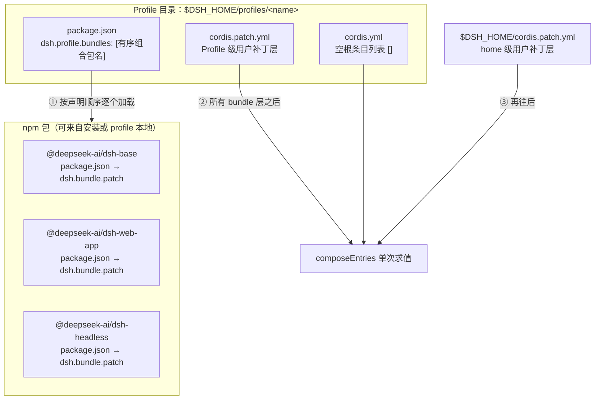
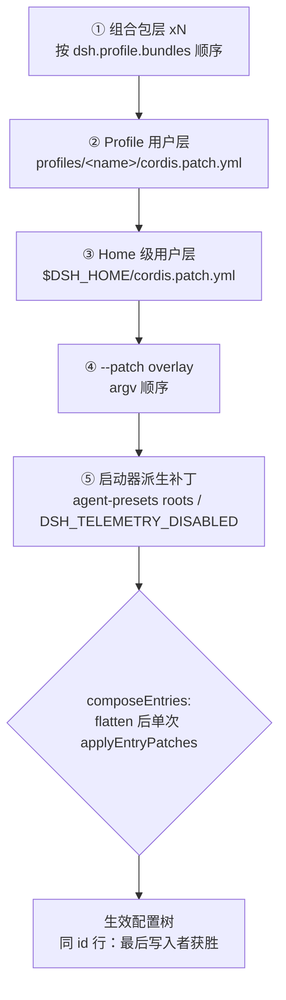
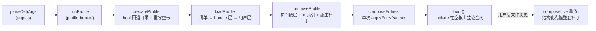

本页是[上一页 CLI 入门](4-cli-ru-men-dsh-ming-ling-ru-kou-web-headless-profile-yu-bu-ding-fu-gai)的深入解析：完整拆解 `dsh` 启动器如何把 Profile 目录、npm 组合包与多层补丁文件叠成一棵确定性的 Loader 配置树。你将理解六个层的叠加顺序、单次求值中"最后写入获胜"的补丁语义、热重载如何保持层序不变，以及双锚点模块解析契约。

## 从"一份配置文件"到"分层补丁叠加"

传统工具链把配置组织为一个自上而下生长的单一文件；DeepSeek Harness 反其道而行：**profile 的根配置是一个空数组 `[]`，整棵插件树完全由按序叠加的 patch 层合成出来**。profile 目录中的根文件 `cordis.yml` 永远只包含空条目列表，其存在的唯一理由是给 Loader 的 Include 插件提供一个锚定 `baseUrl` 的真实包含根——所有内容都通过 `patches` 参数在它之上挂载：

```yaml
# dsh profile root — an empty entry list. The tree is composed as patches:
# each bundle in package.json's dsh.profile.bundles, then cordis.patch.yml, then any
# --patch overlays. Edit cordis.patch.yml, not this file.
[]
```

这个设计带来三个直接收益：内置能力可以以 npm 包为单位发布和升级（每个包自带一层 patch）；用户定制天然获得明确的优先级关系（后写的层覆盖先写的层）；配合 HMR，任何一个用户层都可以被单独重读、重放而无需重启进程。生成的组合文档也以同样的语言概括了这一模型：*"The dsh-base bundle patch every profile applies first; mode bundles (dsh-web-app, dsh-headless) and the user's profile layer patch over it."*

Sources: [profile-boot.ts](apps/cli/src/profile-boot.ts#L59-L67), [composition.md](apps/cli/composition.md#L4-L6)

## 三个构件：Profile、组合包与 Patch 层

这套机制的物理形态由三个构件构成。**Profile** 是 `$DSH_HOME/profiles/<name>` 下的一个目录，持有一个带 `"dsh": { "profile": { "bundles": [...] } }` 清单段的 `package.json`（声明有序的组合包列表）和一个用户自己的 `cordis.patch.yml`（顶层 YAML 数组）。**组合包** 则是一个 npm 包，清单中以 `"dsh": { "bundle": { "patch": "./cordis.patch.yml" } }` 声明自己导出的那一层补丁——manifest 读取代码将这两个角色定义为同一份 `dsh` 清单段的两半，一个包甚至可以同时承担两种角色。



| 构件 | 物理形态 | 清单字段 | 职责 |
| --- | --- | --- | --- |
| Profile | `$DSH_HOME/profiles/<name>` 目录 | `package.json` → `dsh.profile.bundles` | 决定"用哪些组合包、什么顺序"，并提供自己的用户层 |
| 组合包 | npm 包 | `package.json` → `dsh.bundle.patch` | 以包为粒度封装一组插件行及其默认配置 |
| Patch 层 | 顶层 YAML 数组文件 | 无（约定文件名/路径） | 面向 `id` 的配置覆写、禁用与追加插入 |

值得注意的是"无效名字防呆"内建于 profile 解析：空的、含路径分隔符的名字以及保留名 `node_modules`（回退目录的同级路径）都会被显式拒绝。首次使用时 `web` 与 `headless` 会从随附模板自动初始化——分别叠加 `[@deepseek-ai/dsh-base, @deepseek-ai/dsh-web-app]` 与 `[@deepseek-ai/dsh-base, @deepseek-ai/dsh-headless]`；其他名字若不存在则报错并提示用 `dsh plugin` 创建。

Sources: [profile.ts](packages/boot/app-boot/src/profile.ts#L36-L51), [profile.ts](packages/boot/app-boot/src/profile.ts#L72-L96), [web-app/package.json](packages/bundle/web-app/package.json#L41-L45), [profile.ts](packages/boot/app-boot/src/profile.ts#L104-L111), [reference/README.zh.md](apps/cli/reference/README.zh.md#L9-L13)

## 生效顺序：六层补丁的确定性叠加

启动器对层序有唯一的权威定义。`composeProfile` 把补丁切成三段固定不变的区域并拼接：bundle 层在下、两个用户文件层居中、overlay 在上。完整顺序如下：

1. **组合包层 ×N** —— 按 `dsh.profile.bundles` 声明顺序，如 web profile 先 `@deepseek-ai/dsh-base` 再 `@deepseek-ai/dsh-web-app`；
2. **Profile 用户层** —— 该 profile 目录的 `cordis.patch.yml`；
3. **Home 级用户层** —— `$DSH_HOME/cordis.patch.yml`，机器级的全局偏好，注释明确写着它 *"applied over every profile's own layer"*（因此排在 profile 层之后，即优先级更高）；
4. **`--patch` overlay** —— 命令行传入的可重复文件，按 argv 顺序；
5. **启动器派生补丁** —— flag 推导出的逻辑补丁：仅当组合里存在 `agent-presets` 行时，把安装随附的预设目录合并进它的 `roots` 并重新覆写该行；仅当存在遥测行且 `DSH_TELEMETRY_DISABLED` 非空时生成 `{ id: 'session-telemetry-otel', disabled: true }`。



| 层级 | 来源文件 | 参与热重载重组？ | 设计意图 |
| --- | --- | --- | --- |
| ① 组合包 | 各 bundle 包内的 `cordis.patch.yml` | 是（作为底部不变区原样复用） | 发行版拥有的基线能力与模式差异 |
| ② Profile 层 | `<profile>/cordis.patch.yml` | 是（每次保存都重读） | 面向单个 profile 的持久定制 |
| ③ Home 层 | `$DSH_HOME/cordis.patch.yml` | 是 | 跨所有 profile 的机器本地偏好 |
| ④ overlay | `--patch` 指向的任意文件 | 否（属上层，重组时原样复用） | 一次调用的临时注入 |
| ⑤ 派生 | 进程内存（env / 安装布局推导） | 否 | 无法也不该被文件表达的环境事实 |

整体拼接由 `allPatches` 一处维护：`bundlePatches` + `profile.patches` + `homePatches` + `overlays`，四个展开项的排列就是应用顺序本身。`ComposedProfile` 结构体上的字段文档也精确记录了每段在热重载中所在的区域："Bundle layers concatenated — the part below the user layers on a live reload"、"Layers above the user layers on a live reload"。

Sources: [profile-boot.ts](apps/cli/src/profile-boot.ts#L43-L51), [profile-boot.ts](apps/cli/src/profile-boot.ts#L105-L129), [profile-boot.ts](apps/cli/src/profile-boot.ts#L131-L171), [profile-boot.ts](apps/cli/src/profile-boot.ts#L154-L169)

## 补丁应用语义：同一次求值中的"最后写入获胜"

多个 patch 列表并不是各自独立求值的简单并集。`composeEntries` 把所有层的补丁 `flat()` 成**一份扁平列表**，然后交给 Include 的补丁算法 `applyEntryPatches` 做**单次**求解——从空根出发得到最终条目列表。这条不变式在配置 dump 的实现说明中被特意点明：boot 与 dump 必须走同一次调用，以保证连"a later layer targeting a group child a plain config replacement introduced"（单遍 id 索引看不见的角落情形）这类边角组合行为也完全一致。

单次求解内部，每种补丁操作的语义是固定的：

| 操作 | 效果 | 注意点 |
| --- | --- | --- |
| `id:` 目标定位 | 找到既有行进行修改，而不是删除重建 | 目标行不存在只是**逐行警告**，不是致命错误——一份共享的 overlay 不必匹配每一棵树 |
| `config:` 覆写 | **整体替换**目标行的 config，不按键合并 | 因此一个取值因模式而异的行不应放在 base 层，而应让各模式 bundle 各自完整复述其配置 |
| `disabled: true` | 卸载插件但保留行；改回后连带 PENDING 依赖一起复活 | 组合里没有该行时开关被平凡满足，无需报错 |
| `insert:` 追加 | 向树中插入新行 | 后续层的 id 补丁可以命中早前层刚插入的行（得益于单次求值） |

解析层面则采取严格失败主义。三类文件的格式共用同一个 schema（Include 自己导出的 `entryListSchema`，保证 `!!js` 表达式节点在补丁与 dump 两端永不漂移）：profile/home 的可选用户层用 `loadOptionalPatches`——文件缺失表示"没有这一层"，返回 `undefined`；bundle 内置层与 `--patch` overlay 用 `loadOverlayPatches`——文件**必须存在**，因为调用方点名了它，缺席即误配。而一旦文件存在却不可读、不可解析或不是顶层数组，两者都会立刻抛错：*"a present patch file that cannot apply is a misconfiguration and must fail loud at boot, never be silently skipped."*

mode bundle 之间的覆写关系正是这些语义的直接运用。headless 的注释写道它"直接叠在 dsh-base 上"，对 base 中已存在的行做定向覆写；web-app 同样禁用了共享模块 HMR 行、覆写了 `system-prompt` 人设等行：

```yaml
# The shared module-reload HMR row stays off; the launcher's watch-only
# fallback still keeps the user patch layers live until the run exits.
- id: hmr
  disabled: true
```

Sources: [index.ts](packages/boot/app-boot/src/index.ts#L349-L356), [profile.ts](packages/boot/app-boot/src/profile.ts#L413-L420), [index.ts](packages/boot/app-boot/src/index.ts#L268-L306), [index.ts](packages/boot/app-boot/src/index.ts#L320-L338), [base/cordis.patch.yml](packages/bundle/base/cordis.patch.yml#L1-L12), [web-app/cordis.patch.yml](packages/bundle/web-app/cordis.patch.yml#L16-L17), [headless/cordis.patch.yml](packages/bundle/headless/cordis.patch.yml#L10-L13)

## 实现：从 Manifest 到 Loader 树的一条组合链路

把前面的概念串成执行时序，`runProfile` 的调用链清晰而线性：



| 步骤 | 函数 | 关键职责 |
| --- | --- | --- |
| 名字 → 目录 | `resolveProfileDir` | 校验非法名并解析 `$DSH_HOME/profiles/<name>` |
| 模板引导 | `loadProfile` 内检测缺失 manifest | 存在模板则 `initProfile` 自动初始化，否则报错 |
| 版本迁移 | `normalizeShippedProfile` | 把归安装所有的旧元组（如 headless 曾含 web-app）静默归一化为现行模板，任何其他列表视为用户自有、绝不改动 |
| 双锚点找包 | `resolveBundleDir` | 先从安装锚点、再从 profile 目录解析 bundle 包目录；两处皆无则提示运行 `dsh plugin ... install` |
| 加载 bundle 层 | `loadProfile` 的 `layers.map` | 每个 bundle 读其 manifest 声明的 patch 文件；缺 `dsh.bundle` 段会响亮失败——把无 bundle 的包列进层是误配而非"零补丁" |
| 收敛与索引 | `composeProfile` | 组装四段层，为 launcher 自身的行检查建立 `id → row` 映射 |
| 挂载 | `boot()` | `patches` 为空列表时不挂载任何东西，非空则以 overlay 身份应用于所含之树 |

两个防御性细节值得驻足。其一，`prepareProfile` 在每次启动时**无条件重写**空根 `cordis.yml`：Loader 的树回写特性（插件自我 dispose 时会把当前树持久化）可能把已组合的行烘焙进这个文件，导致下次启动时每一条 bundle insert 都重复一遍——只有把根文件永远压回空数组，才能维持"一切皆 patch"的前提。其二，bundle 缺 `dsh.bundle` 段视为硬错误，避免把普通依赖包误当成"什么都不贡献"的一层。

Sources: [profile.ts](packages/boot/app-boot/src/profile.ts#L371-L403), [profile.ts](packages/boot/app-boot/src/profile.ts#L297-L312), [profile.ts](packages/boot/app-boot/src/profile.ts#L344-L355), [profile-boot.ts](apps/cli/src/profile-boot.ts#L85-L103), [index.ts](packages/boot/app-boot/src/index.ts#L744-L752)

## 热重载下的层序不变性与结构化克隆

长驻 surface（web 等）上，两个用户层都是活的：`runProfile` 通过 Cordis HMR 分别注册 `cordis.patch.yml` 与 `$DSH_HOME/cordis.patch.yml` 的监视器，任一变更都会触发**全量重组**，而不是增量打补丁。重组函数 `composeLive` 保证重放时的层级结构与冷启动完全一致——bundle 层在下、派生 overlay 在上，用户编辑永远无法挤进这两端之间夹不到的位置：

```ts
const composeLive = (): PatchOptions[] => structuredClone([
  ...composed.bundlePatches,
  ...loadOptionalPatches(NAME, composed.profile.patchPath) ?? [],
  ...loadOptionalPatches(NAME, homePatchPath()) ?? [],
  ...composed.overlays,
])
```

这里有三处刻意为之的工程判断。第一，两份用户文件每次都**重新读取**——HMR 回调只会告诉我们哪个文件变了，缓存其中一个层的旧副本会让两个监视器互相缝入对方的陈旧内容。第二，每次重组都对整套补丁做 `structuredClone`，原因是 Include 会把 `insert` 行**按引用**推进已挂载的树、后续 id 补丁又原地改写这些对象——跨代复用同一个已解析对象会把用户的临时覆写永久烘焙进 bundle 的内存 insert 行，之后再删掉覆写也无法回到 bundle 默认值。第三，监视并非可选项：即使某个 surface 禁用了共享模块 HMR（web/headless 都禁了该行），只要树上没有 `hmr` 服务，启动器就会自行挂载一个无 module 根的 watch-only 实例（必要时连 `timer` 一起补上），让"profile 或 home 的补丁层编辑保持热更新"这一约定在任何长驻模式下都不落空。

Sources: [profile-boot.ts](apps/cli/src/profile-boot.ts#L228-L245), [profile-boot.ts](apps/cli/src/profile-boot.ts#L272-L294), [index.ts](packages/boot/app-boot/src/index.ts#L232-L265)

## 双锚点模块解析与安装回退目录

Patch 层说"要挂载哪个插件"，而插件代码能否被 Node 找到则是另一个正交问题，由一套双锚点加回退的解析契约回答。bundle 包名的解析先于一切：先从 dsh **安装自身的 package.json 锚点**解析，再从 profile 目录解析。这个顺序是一条明确契约——`@deepseek-ai/dsh-base` 和所有内置 bundle 永远来自正在运行的这份 dsh 安装，绝不会被 profile 里的一份旧拷贝遮蔽。

解析细节利用了 Node 自身的查找规则。`packageDirFromAnchor` 用 `createRequire(anchor).resolve.paths` 逐个候选路径探测带 manifest 的目录，结果与 Loader 从同一锚点 import 所走的路径完全一致；实现注释强调这样便无需依赖包导出 `./package.json` 这个便利面。

回退环节由 `healProfilesModuleFallback` 维护一个平坦目录 `$DSH_HOME/profiles/node_modules`：对安装应用的全部**可达依赖闭包**（从 app manifest 出发对 dependencies 与 peerDependencies 做 BFS，peer 也要参与是因为 Service Definition 包总是以 peer 形态出现却被树外插件直接导入）建立一对一符号链接。任何 profile 的插件经 Node 的父目录上溯，都会在 profile 自己的 `node_modules` 之后命中这个平坦目录——于是 pnpm 只管理 profile 的树外插件，箱内插件则经由普通的目录上溯自然到达，恰好兑现"bundles come from the installation"。链接维护同样幂等且防并发：正确链接保留、安装挪位则重指；首建竞态中输给"写入相同链接的对手进程"被视为成功。

Sources: [profile.ts](packages/boot/app-boot/src/profile.ts#L332-L355), [profile.ts](packages/boot/app-boot/src/profile.ts#L204-L255), [reference/README.zh.md](apps/cli/reference/README.zh.md#L11-L11)

## 自省工具：--dump-config 与来源标注

面对六层叠加，肉眼推演最终树既低效又易错。CLI 提供两级免启动内省：`--dump-default-config` 只打印 bundle 各层（内部传 `userLayer: false` 让加载器**跳过解析** profile 用户层——这是用户层损坏后的恢复诊断路径）；`--dump-config` 则在其之上加上 profile 层、home 层与全部 `--patch` overlay，如实反映即将启动的组合。两种 dump 都会渲染成仍然可加载的 YAML 文档，并附加 `# ==` 注释标明每组行来自哪个文件、被哪些层修改过。

标注的实现值得一提：文件标签取自一系列单次求值的前缀快照（基础 + 第 1..k 层），按位置做差分。由于补丁算法只在原地改写或追加行，顶层下标即可在快照间唯一标识一行；某层的追加改变了这行（config 替换、disable、组内插行），就把该层列入它的"修改者"。没匹配到任何行的补丁会像 Loader 启动时一样打印带层标签的警告，而且**早前层的警告在每个后续快照中原样延续**——新出现的警告尾部必然属于新加入的那层。

```sh
dsh --profile web --dump-default-config
dsh --profile web --patch ./extra.yml --dump-config
```

`!!js` 表达式在整个过程中保持字面原文、不求值，dump 与 boot 复用同一个空根文件作锚点，因此二者所见即为启动所挂载。

Sources: [dump-config.ts](apps/cli/src/dump-config.ts#L17-L54), [index.ts](packages/boot/app-boot/src/index.ts#L348-L377), [reference/README.zh.md](apps/cli/reference/README.zh.md#L32-L39), [args.ts](apps/cli/src/args.ts#L26-L31)

## 配置级 Include 叠加：示例使用的兄弟机制

除 profile 启动器外，仓库示例还展示了一种更轻量的兄弟机制：把一个 Include 条目作为普通配置行写进叶子 `cordis.yml`，让它 `path` 指向另一份配置并用 `patches` 数组施加增量。例如 acp-agent 示例中的 depth-two 快照 overlay：`depth-two.cordis.yml` 整个文件就是一个 id 为 `base` 的 Include 条目，在包含默认组合 `./cordis.yml` 之上追加一条针对 `tool-subagent` 的配置覆写。

它与本页主角共享完全相同的补丁词汇（同样的 `id`/`config`/`insert`，同一个算法），差别仅在调度入口：前者由启动器在 profile 空根上自动叠加多层文件，后者把"包含 + 打补丁"压缩为一条配置行，适合示例与快照测试表达"默认组合 + 一个变体"。想动手实验这些组合的读者可直接跳转示例导览页。

Sources: [depth-two.cordis.yml](examples/acp-agent/depth-two.cordis.yml#L1-L15), [composition.md](apps/cli/composition.md#L1-L6)

## 小结

Profile、组合包与 Patch 层共同构成一台小型"配置编译器"：**profile 清单决定编译单元与层序，bundle 以 npm 包交付基线，六个按序叠加的补丁区在单次 `applyEntryPatches` 求值中收敛成一棵树**；fail-loud 的解析、幂等的根重写、闭包式的符号链接回退与结构化克隆的全量重组，分别守住这条流水线的正确性、纯净性、可解析性与可热更性。想继续深入，建议顺着目录前往下一页了解这些组合包背后的[核心包地图](10-he-xin-bao-di-tu-bao-fen-zu-zhi-ze-yu-ctx-fu-wu-jian-dao-lan)；若想对照具体的 `.cordis.yml` 实例演练本文机制，请参考[示例组合包导览](27-shi-li-zu-he-bao-dao-lan-acp-agent-headless-agent-jsonrpc-agent-yu-mcp-memory)。