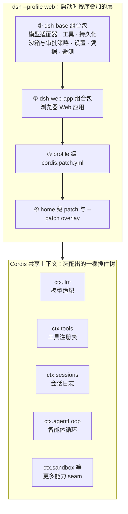
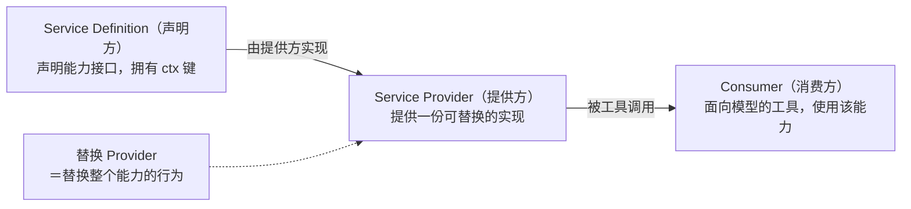

本页是整个文档站的第一站，面向初次接触本项目的开发者。我们回答三个问题：DeepSeek Harness 是什么；它作为智能体框架要解决什么问题；以及"一切皆插件"这句口号在代码中究竟意味着什么。读完本页，你将建立起足够的心智模型，可以顺利进入后续的快速开始与架构章节。

## DeepSeek Harness 是什么

DeepSeek Harness（命令行简称为 `dsh`）是由 DeepSeek AI 开发的开源智能体框架。它构建于**一切皆插件**的架构之上，底层由 [Cordis](https://github.com/cordiverse/cordis) 框架驱动，其设计思想来自论文 _A Programming Paradigm for Spatiotemporal Composability_。换句话说，它不是"一个写死的 AI 助手程序"，而是一个可以组装出 AI 助手的**框架**。
Sources: [README.zh.md](README.zh.md#L5-L7)

项目的官方定位目前处于**开发者预览**阶段，正在快速迭代，官方明确声明未来会出现破坏兼容性的变更。官方同时要求在运行前阅读安全说明——因为这类智能体框架可以执行模型生成的代码与命令、加载第三方插件，这既是它的价值，也是它需要谨慎对待的原因。
Sources: [README.zh.md](README.zh.md#L11-L15)

对最终用户而言，最常见的入口是一条命令：`npx @deepseek-ai/dsh web`。它会在本机 `http://127.0.0.1:3080` 启动一个 Web UI 并自动打开浏览器。在 Web UI 中配置 DeepSeek API 密钥、选择一个工作区目录后，你就可以让智能体读取和编辑工作区文件、运行命令、委派工作并维护计划；当某项操作按权限策略需要审批时，界面会先询问你。这一段描述了"用户视角的 harness"：一个通过对话驱动、能实际操作你计算机的智能体。
Sources: [README.zh.md](README.zh.md#L23-L29)
Sources: [docs/user/guide/index.zh.md](docs/user/guide/index.zh.md#L9-L23)

## 它解决什么问题

先看"智能体框架"需要提供哪些底层设施。从架构文档的核心包一览可以看到，一套可用的智能体至少需要：**会话日志**（`ctx.sessions`，记录模型所见的一切上下文）、**提示词组装**（`ctx.systemPrompt`，把提示词片段与工具 schema 拼装成请求）、**工具注册表**（`ctx.tools`，带把关的执行流水线）、**agent 接口与循环**（`ctx.agents` 与 `ctx.agentLoop`，驱动"请求模型 → 调用工具"的迭代），以及 **LLM 适配层**（`ctx.llm`，屏蔽不同模型提供方的差异）。
Sources: [docs/architecture.zh.md](docs/architecture.zh.md#L57-L70)

传统框架通常把这些设施焊死在内核里：你想换掉文件系统、换个沙箱、加一种工具，就得修改框架源码或者等待官方支持。DeepSeek Harness 对这个问题的回答写在架构文档的第一节：**不存在需要打补丁的特权内核**。产品的每一部分都是插件——包括模型适配器、工具注册表、会话日志，甚至 agent loop（智能体循环）本身。扩展 dsh 的方式不是改内核，而是把新插件挂载到其他插件旁边。
Sources: [docs/architecture.zh.md](docs/architecture.zh.md#L9-L13)

这种设计还有第二个关键性质：各项注册都是**可逆的副作用**，会在其插件卸载时自动撤销。这让"运行时增删能力"成为可能——项目甚至提供了插件管理器，让插件本身可以被动态检查、挂载和卸载。
Sources: [docs/architecture.zh.md](docs/architecture.zh.md#L13)
Sources: [packages/README.zh.md](packages/README.zh.md#L67)

第三个关键性质是**能力的可替换粒度**。架构文档用一个精炼的概念"seam（接缝）"来组织它：一项可替换能力由三部分组成——声明接口的 **Service Definition**、实现它的 **Service Provider**，以及使用它的 **Consumer**（通常是面向模型的工具）。只要换掉一个提供方，就能改变整个产品的行为。文档给出的例子非常直观：文件系统与进程提供方共享同一个执行世界，把它们指向远程沙箱，Bash、PTY 终端和 LSP 就一并搬了过去，无需为每个工具单独改造。
Sources: [docs/architecture.zh.md](docs/architecture.zh.md#L133-L139)

把上面三点合起来，就是本框架对"解决什么问题"的完整回答：**把智能体必备的每一项设施都做成可插拔、可替换、可组装的插件，让你既能开箱即用，也能在不碰框架内核的前提下重塑产品的任何一个部分。**
Sources: [docs/architecture.zh.md](docs/architecture.zh.md#L11-L13)

## 架构总览：一棵按层叠加的插件树

运行中的 `dsh` 并不是某个单一程序，而是**一棵插件树**，由启动时按序叠加的各层组合而成。理解这张图需要两个术语：**profile（配置档）** 是存放在 Harness home 目录中的具名组装，它列出自己叠放的组合包、存放自己安装的树外插件，并保存用户自己的 `cordis.patch.yml`；**组合包** 是 Cordis 配置项及其挂载代码的分发格式。各层的应用顺序是：先按 profile 列出的顺序应用每个组合包，然后依次是 profile 级 patch、home 级 patch，最后是任意 `--patch` 命令行覆盖。
Sources: [docs/architecture.zh.md](docs/architecture.zh.md#L15-L27)

下面的图展示了以 `web` profile 为例的组装过程：`dsh-base` 是 `web`、`headless`、`sdk` 与 `acp` 各 profile 共享的第一层（模型适配器、工具、持久化、沙箱与审批策略、设置、凭据、遥测），`dsh-web-app` 在其上增加浏览器应用，随后各层 patch 依次覆盖，最终把服务装配进 Cordis 共享上下文。
Sources: [docs/architecture.zh.md](docs/architecture.zh.md#L25-L27)

这个组装机制是**可观察**的：运行 `dsh --profile web --dump-config` 可以打印你机器上实际启动的配置树，而且文档明确指出——它打印出的任何条目，都可以由你自己的 patch 替换。这为初学者提供了一个极好的学习方式：先看默认配置长什么样，再尝试用 patch 改掉其中一项。
Sources: [docs/architecture.zh.md](docs/architecture.zh.md#L33-L41)

## 核心概念速览：初学者词典

**插件（Plugin）与 Cordis。** Cordis 是 dsh 底层的框架。一个插件向共享上下文贡献三类东西：**服务**（可以被其他插件使用的功能对象）、**类型化事件**（有明确类型的消息），以及**可逆的副作用**（注册会在插件卸载时撤销）。如果你写过浏览器扩展或 VS Code 插件，可以类比理解：宿主提供挂载点，插件负责往挂载点上"放东西"，卸载时"收东西"。
Sources: [docs/architecture.zh.md](docs/architecture.zh.md#L11-L13)

**服务与 `ctx` 键。** 每个服务在上下文中有一个名字，即 `ctx` 键。下表列出部分核心包及其向上下文贡献的键位——这张表同时就是"智能体框架的零件清单"：

| 包 | 职责 | `ctx` 键 |
|---|---|---|
| `core/session` | 仅追加的 `SessionEvent` 日志和内存存储 | `ctx.sessions` |
| `core/system-prompt` | 提示词片段与工具 schema 的组装 | `ctx.systemPrompt` |
| `core/tools` | 作用域化的工具注册表和带把关的执行流水线 | `ctx.tools` |
| `core/agent` | `Agent` 接口、活跃 agent 注册表和 `agent/*` 事件 | `ctx.agents` |
| `core/agent-loop` | 实现该接口的默认驱动器 | `ctx.agentLoop` |
| `core/scope` | 按 agent 划分作用域的注册原语 | 库，无 ctx 键 |
| `llm/llm` | 消息与流式词汇表，以及适配器 seam | `ctx.llm` |
| `webhook/webhook` | 已认证 delivery 的分派和 Workspace Session 创建 | `ctx.webhookRuntime` |

Sources: [docs/architecture.zh.md](docs/architecture.zh.md#L57-L70)

**能力 seam（接缝）。** 这是本仓库最值得记住的词。一个 seam 是一项可替换能力，包含三种角色：声明接口的 **Service Definition**（一个拥有自身 `ctx.<key>` 的 Cordis `Service`）、实现它的一个或多个 **Service Provider**，以及使用它的 **Consumer**（通常是面向模型的工具）。一个包可以合并承担多个角色，但"单一角色"本身不构成 seam。
Sources: [docs/glossary.zh.md](docs/glossary.zh.md#L7-L9)
Sources: [docs/architecture.zh.md](docs/architecture.zh.md#L135)

**轮次与步骤。** 这是描述智能体工作节奏的最小词汇：一个**步骤**是一次模型请求加上它所引发的工具执行；一个**轮次**包含零个或多个步骤，它在领取首条输入之前打开，并在不再欠下任何工作时关闭。用户发一句话，智能体可能连续做多轮"思考—用工具—再思考"，这些就发生在同一个轮次内。
Sources: [docs/glossary.zh.md](docs/glossary.zh.md#L37-L38)
Sources: [docs/architecture.zh.md](docs/architecture.zh.md#L88-L90)

## 扩展点：三个事件域

在 dsh 中，**事件就是扩展点**。架构文档把事件划分为三个域，并指出"选对事件域是大多数改动的第一个决定"。对初学者来说，这张表回答的是"我想加功能时，应该把代码挂在哪"：

| 事件域 | 特点 | 适用场景 |
|---|---|---|
| 会话事件 | 追加到持久日志，并通过 `session/event` 广播 | 某个事实必须在重新加载后仍然存在（模型可见的历史） |
| Agent 事件（`agent/*`） | 携带活跃 `Agent`：inbox、步骤、状态、请求、验证、续跑 | 观察或拦截进行中的工作 |
| 能力事件 | 无需导入循环，直接向某个 seam 附加 | 为文件系统（`fs/*`）、工具（`tools/*`）、遥测（`telemetry/*`）等附加策略和适配器 |

Sources: [docs/architecture.zh.md](docs/architecture.zh.md#L74-L84)

架构文档还给出了一张"新行为的归属位置"映射表，把常见扩展需求直接映射到机制上，例如：添加模型提供方 → 在 `ctx.llm` 上注册适配器；添加面向模型的能力 → 在 `ctx.tools` 上注册；限制所启动的进程 → 使用 `ctx.sandbox` 后端；添加文件系统访问或策略 → 注册 `ctx.fs` 提供方或监听 `fs/*` 事件。这张表是"一切皆插件"从口号落到操作的证明。
Sources: [docs/architecture.zh.md](docs/architecture.zh.md#L145-L168)

## 开箱即用的能力全景

仓库把数百个 npm 包按**能力系列**分组放在 `packages/` 目录下，官方文档建议把它当作顶层地图使用：先找到拥有某能力的组，再打开该组 README 查看细节。下表摘录了与"智能体能做什么"最直接相关的组：

| 组 | 职责（一句话） |
|---|---|
| `core/` | 产品 API 主干：会话、提示词、工具、agent 服务与具体循环 |
| `llm/` | LLM 能力系列：抽象服务 + DeepSeek 等提供方适配器 |
| `fs/` | 文件系统能力：seam、本地实现、面向模型的文件与搜索工具 |
| `shell/` | Bash 能力：执行器 seam、本地实现、面向模型的 shell 工具 |
| `terminal/` | 持久 PTY 终端能力与会话 |
| `sandbox/` | 进程限制 seam；bwrap、Landlock、Seatbelt 后端 |
| `web/` | Web 访问：搜索与抓取提供方、面向模型的 Web 工具 |
| `browser-use/`、`computer-use/` | 浏览器与桌面的独占注册提供方 |
| `subagent/` | subagent 提供方注册表与委托工具（多智能体协作） |
| `mcp/`、`hooks/` | 将 MCP 服务器工具接入为原生工具；桥接 Claude Code／Codex 钩子 |
| `session/`、`session-query/` | 会话持久化数据平面与检索（含 SQLite 全文搜索） |
| `interaction/` | 人机协作平面：审批 seam、权限预设、命令、询问用户的工具 |
| `bundle/` | 可安装的 `dsh --profile` 组合包层 |
| `extensions/`、`boot/`、`host/` | 运行时自修改、应用启动粘合层、Web GUI 宿主服务 |

Sources: [packages/README.zh.md](packages/README.zh.md#L29-L80)

值得强调的是最后三行的含义：连"管理插件"本身也是插件化的——`boot/plugin-manager` 提供插件管理器，`extensions` 组甚至允许 agent 运行时自修改（由模型发起的挂载与卸载）。框架没有为自己保留任何不开放的能力。
Sources: [docs/architecture.zh.md](docs/architecture.zh.md#L31)
Sources: [packages/README.zh.md](packages/README.zh.md#L67)

## 同一棵插件树，多种应用形态

因为产品 = 插件树，所以"换一种应用形态"就等价于"换一套 profile 组装"。官方随发行版交付五个 profile：`web`、`headless`、`sdk`、`sdk-minimal` 和 `acp`，通过 `dsh --profile <name>` 或 `dsh <name>` 选择。此外还有桌面载体与 Python SDK 两种形态：

| 形态 | 说明 | 典型使用者 |
|---|---|---|
| Web（`dsh web`） | 本机启动服务器 + 浏览器 GUI，默认端口 3080 | 想要图形界面的开发者 |
| Headless | 无界面的服务器 profile | 自动化、后台任务 |
| ACP | 仅面向自动化的 Agent Client Protocol 服务器 | 编辑器等自动化客户端接入 |
| TypeScript SDK | JSON-RPC 协议与 TypeScript 客户端／服务器 | 用代码驱动智能体 |
| Python SDK | 运行时 wheel 内打包了同一个 `dsh` CLI，客户端默认以显式 Harness home 启动 `dsh --profile sdk` | Python 开发者 |
| Electron 桌面应用 | 签名资源中携带精确匹配的 dsh 生产运行时；窗口加载打包 Web 资源并激活客户端插件 | 桌面用户 |

Sources: [docs/architecture.zh.md](docs/architecture.zh.md#L43-L55)
Sources: [packages/README.zh.md](packages/README.zh.md#L76-L77)

这张表背后是一个统一的架构事实：无论哪种形态，底层都是同一套 Cordis 插件组装机制。Python SDK 文档明确说它"遵循相同的应用架构"——运行时 wheel 把普通 `dsh` CLI 打包为平台专用包，只是选择不同的 profile 启动而已。
Sources: [docs/architecture.zh.md](docs/architecture.zh.md#L49)

## 运行边界与安全须知

官方安全文档的措辞非常直接：DeepSeek Harness 是**实验性的开发者预览软件**，尚未接受安全审计，不得视为安全或可用于生产环境的软件。它可以执行模型生成的代码与命令、加载第三方插件，并访问向其开放的网络、进程、凭据和文件——错误的模型输出、缺陷、配置错误或不可信插件可能损坏宿主计算机、修改或删除文件、泄露数据或凭据。
Sources: [SAFETY.zh.md](SAFETY.zh.md#L5-L9)

框架内置了**沙箱、审批提示与权限控制**来降低风险，但文档同样明确：这些机制降低风险，却不保证隔离，也不能保证防止损害；不要把 DeepSeek Harness 当作不可信工作负载唯一的安全控制措施。官方给出的负责任使用建议包括：仅授予所需的最小权限、优先在一次性虚拟机或容器中运行、备份可访问的文件、在允许运行前检查插件与拟执行的命令。
Sources: [SAFETY.zh.md](SAFETY.zh.md#L11-L23)

## 下一步阅读路线

本页建立了"是什么"与"为什么"的骨架，以下路线按依赖顺序展开"怎么做"。对初学者，我们建议严格按行进顺序阅读：

| 顺序 | 页面 | 你将学到 |
|---|---|---|
| 1 | [快速开始：npx 运行、从源码构建到启动 Web UI](2-kuai-su-kai-shi-npx-yun-xing-cong-yuan-ma-gou-jian-dao-qi-dong-web-ui) | 用最小代价把 dsh 跑起来 |
| 2 | [仓库布局导览：packages 能力分组、apps 应用、docs 文档与 scripts 校验脚本](4-cang-ku-bu-ju-dao-lan-packages-neng-li-fen-zu-apps-ying-yong-docs-wen-dang-yu-scripts-xiao-yan-jiao-ben) | 建立目录级空间感 |
| 3 | [Cordis 入门：插件、上下文、服务注入、类型化事件与可逆副作用](5-cordis-ru-men-cha-jian-shang-xia-wen-fu-wu-zhi-ru-lei-xing-hua-shi-jian-yu-ke-ni-fu-zuo-yong) | 理解"一切皆插件"的地基框架 |
| 4 | [总体架构：插件树、核心包职责与 ctx 服务键位图](9-zong-ti-jia-gou-cha-jian-shu-he-xin-bao-zhi-ze-yu-ctx-fu-wu-jian-wei-tu) | 把本页的零件清单展开成全景 |
| 5 | [Profile 与组合包：dsh-base、patch 叠加顺序与运行时组装机制](10-profile-yu-zu-he-bao-dsh-base-patch-die-jia-shun-xu-yu-yun-xing-shi-zu-zhuang-ji-zhi) | 深入本页"按层叠加"的组装细节 |
| 6 | [能力 Seams 与核心服务全景：可替换服务的提供方与消费方关系图](13-neng-li-seams-yu-he-xin-fu-wu-quan-jing-ke-ti-huan-fu-wu-de-ti-gong-fang-yu-xiao-fei-fang-guan-xi-tu) | 系统掌握 seam 这一核心抽象 |
| 7 | [安全说明与运行边界：模型权限、工具审批与安全须知](31-an-quan-shuo-ming-yu-yun-xing-bian-jie-mo-xing-quan-xian-gong-ju-shen-pi-yu-an-quan-xu-zhi) | 在动手实验前理解边界 |

如果你更倾向"先动手改代码"，也可以从第 3 步直接跳到 [扩展手册：添加工具、包、LLM 适配器、Remote API 与设置卡片](24-kuo-zhan-shou-ce-tian-jia-gong-ju-bao-llm-gua-pei-qi-remote-api-yu-she-zhi-qia-pian)，边做边学。无论哪条路线，请记住本页最重要的三个词：**插件**（一切能力的载体）、**seam**（可替换能力的三角色契约）、**profile**（把插件组装成产品的具名配方）。
Sources: [docs/architecture.zh.md](docs/architecture.zh.md#L11-L27)