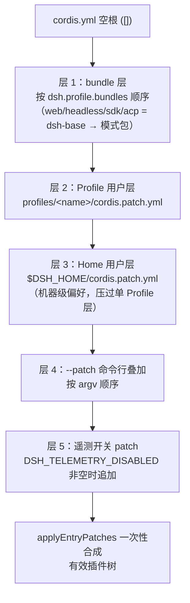
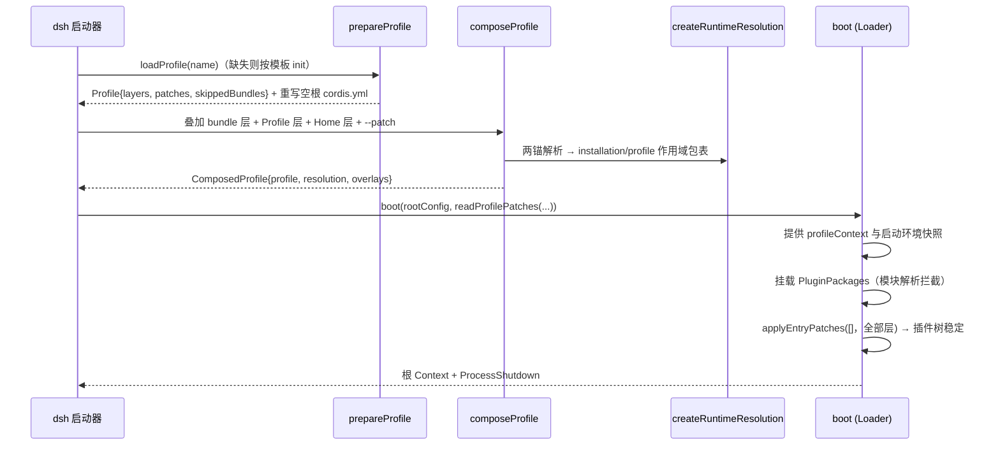

DeepSeek Harness 的每一个可运行形态——Web、Headless、SDK、ACP——都不是硬编码的应用，而是一个**Profile（配置档案）**：一组按序叠加的 patch 层在一个空根配置上组装出的插件树。本页解释这一组装机制的三个支柱：Profile 目录的结构与模板、**Bundle（组合包）**如何用 `dsh.bundle.patch` 声明自己的 patch 层、以及从 bundle 层到用户层再到命令行开关层的完整叠加顺序与运行时组装流程。它承接[总体架构](9-zong-ti-jia-gou-cha-jian-shu-he-xin-bao-zhi-ze-yu-ctx-fu-wu-jian-wei-tu)中的插件树概念，并为后续 [Agent Loop](11-agent-loop-yu-lun-ci-sheng-ming-zhou-qi-turn-start-dao-turn-end-de-bu-zou-liu-yu-shi-jian-shi-xu) 与 [CLI 启动](22-cli-yu-headless-acp-profile-qi-dong-ming-ling-xing-can-shu-yu-agent-client-protocol)等页面提供组合层语境。

Sources: [profile.ts](packages/boot/app-boot/src/profile.ts#L1-L35), [profile-boot.ts](apps/cli/src/profile-boot.ts#L1-L15)

## Profile：以目录为单位的组合单元

一个 Profile 是 `$DSH_HOME/profiles/<name>` 下的一个目录，由三份文件构成：`package.json` 携带 profile 清单 `dsh.profile`，其 `bundles` 字段是一份**有序的 bundle 包名列表**；`cordis.patch.yml` 是用户自己的 patch 层，永远应用在所有 bundle 层之后；`cordis.yml` 是 Loader 的挂载根——内容恒为空列表 `[]`，因为整棵树完全由 patch 层组合而成（见后文“运行时组装”）。目录里还有一份自动生成的 `pnpm-workspace.yaml`（`nodeLinker: hoisted`、`autoInstallPeers: false`），让树外插件在扁平 `node_modules` 中共享安装自身的唯一 cordis 实例，缺失的 peer 由运行时解析兜底。

Sources: [profile.ts](packages/boot/app-boot/src/profile.ts#L1-L35), [profile.ts](packages/boot/app-boot/src/profile.ts#L219-L234), [profile.ts](packages/boot/app-boot/src/profile.ts#L236-L262)

启动器内置了五个 Profile 模板，首次使用某个名字时按模板自动初始化（只复制 bundle 列表，不继承任何机器本地状态）：

| Profile 名 | `dsh.profile.bundles` | 用途 |
|---|---|---|
| `web` | `@deepseek-ai/dsh-base` → `@deepseek-ai/dsh-web-app` | 浏览器 GUI |
| `headless` | `@deepseek-ai/dsh-base` → `@deepseek-ai/dsh-headless` | 一次性命令行任务 |
| `sdk` | `@deepseek-ai/dsh-base` → `@deepseek-ai/dsh-sdk-app` | JSON-RPC stdio 服务 |
| `acp` | `@deepseek-ai/dsh-base` → `@deepseek-ai/dsh-acp-app` | ACP 自动化协议 |
| `sdk-minimal` | 仅 `@deepseek-ai/dsh-sdk-minimal` | 不依赖 base 的独立最小树 |

前四个都是“base 层 + 模式层”的两层结构；`sdk-minimal` 是唯一例外——它的单个 bundle 拥有完整独立的插件树。此外还有一份 `DEFAULT_PROFILE_BUNDLES`（仅 `dsh-base`）作为无名模板的缺省，以及三个**可选组合包**（agent-team-profile、voice-input-bundle、auto-review）由插件管理器按需开启。

Sources: [profile.ts](packages/boot/app-boot/src/profile.ts#L178-L203), [profile.ts](packages/boot/app-boot/src/profile.ts#L205-L217), [README.md](packages/bundle/README.md#L11-L15)

## 组合包：`dsh.bundle.patch` 声明契约

**Bundle 就是一个普通 npm 包**，唯一的契约是在其 `package.json` 中声明 `"dsh": { "bundle": { "patch": "./cordis.patch.yml" } }`——`patch` 可以是单个文件路径，也可以是有序文件列表（`bundlePatchFiles` 会做类型校验）。`packages/bundle` 分组共携带六个组合包：

| 组合包 | 角色 | 挂载的关键服务 |
|---|---|---|
| `base`（`@deepseek-ai/dsh-base`） | base 系 Profile 的共享核心，仅提供 patch | —（纯 patch 层） |
| `web-app` | 浏览器应用层 | 挂载 Web 行 |
| `headless` | 一次性 CLI 任务层 | `headless-runner` |
| `acp-app` | ACP stdio 自动化层 | 挂载 ACP 桥 |
| `sdk-app` | SDK JSON-RPC 层 | 挂载 SDK server |
| `sdk-minimal` | 无 base 的独立完整树 | —（完整 patch 树） |

Sources: [profile.ts](packages/boot/app-boot/src/profile.ts#L53-L75), [README.md](packages/bundle/README.md#L17-L27), [package.json](packages/bundle/base/package.json#L1-L28)

**dsh-base 是整个体系的重力中心**。它的 `cordis.patch.yml`（529 行）以**单条 `insert`** 在空根上一次插入约 90 个核心插件行，覆盖 LLM 适配（`llm`、`llm-deepseek`、`llm-pi-ai`）、凭据与授权、会话持久化与投影、存储、typert 注册/加载/网关、子进程与沙箱、shell/fs 工具、skill、命令、goal、compaction、subagent、workflow、web、system-prompt 与 agent-loop。仓库中的 [composition.md](apps/cli/composition.md) 由 `scripts/gen-doc-graphs.ts` 生成，是这份精确组合图的权威快照。

Sources: [cordis.patch.yml](packages/bundle/base/cordis.patch.yml#L1-L23), [composition.md](apps/cli/composition.md#L1-L5), [package.json](packages/bundle/base/package.json#L60-L137)

base 的行刻意保持“模式中立”：与运行形态相关的取值不在 base 中定死，而是留给上层。典型手法是 `!!js` 表达式——例如 `plugin-manager` 与 `hmr` 声明 `disabled: !!js "!ctx.get('profileContext')"`，只有由 `dsh` 启动器拉起（提供了 `profileContext` 服务）时才激活；而 `session-query-sqlite` 这类随模式变化的行，则由 web-app 层用 `':memory:'`/`openAt: never` 整行覆写。

Sources: [cordis.patch.yml](packages/bundle/base/cordis.patch.yml#L17-L32), [cordis.patch.yml](packages/bundle/web-app/cordis.patch.yml#L1-L40)

## Patch 叠加顺序：从 bundle 层到开关层

组合的核心语义只有两条。其一，**按 id 定位的 patch 是整行替换**：后层对同 id 行写入 `config` 时，是替换目标行的整个 `config` 而非合并键值。这正是 dsh-base 头部注释强调的规则——一行配置如果随模式不同，就绝不能放进 base，而应归入各模式 bundle，使任何一行最多只经历“一个 bundle 层 + 用户层”两次写入。其二，**同层内的行序不承载加载语义**（激活由服务可用性驱动），分组只服务于读者；生效与否完全由叠加顺序中的“最后写入者胜出”决定。`insert` 列表则是追加新行，base 的整个树就是这样一次插入建立的。

Sources: [cordis.patch.yml](packages/bundle/base/cordis.patch.yml#L1-L15), [cordis.patch.yml](packages/bundle/web-app/cordis.patch.yml#L1-L8)

在此语义之上，`readProfilePatches` 定义了精确的五段叠加顺序：

图中自上而下即优先级递增方向：同一 id 的行由更靠下的层最终定值。第 5 层是唯一条件生成的层——`resolveTelemetryPatch` 在 `DSH_TELEMETRY_DISABLED` 非空（任何非空值，含 `'0'`/`'false'`，隐私开关宁可“错关”不可“错开”）且组合中确有 `session-telemetry-otel` 行时，才追加 `{ id, disabled: true }`；没有该行的自定义 Profile 与此开关天然兼容。

Sources: [profile-context.ts](packages/boot/app-boot/src/profile-context.ts#L32-L76), [profile-boot.ts](apps/cli/src/profile-boot.ts#L186-L209)

| 叠加段 | 来源 | 作用域 | 说明 |
|---|---|---|---|
| bundle 层 | `dsh.profile.bundles` 依序展开 | 安装级 + Profile 级 | 失败的 bundle 记入 `skippedBundles`，启动时统一报告，不阻断其余层 |
| Profile 用户层 | `<profile>/cordis.patch.yml` | 单 Profile | 长驻形态下热重载 |
| Home 用户层 | `$DSH_HOME/cordis.patch.yml` | 所有 Profile | 机器本地偏好，优先级高于 Profile 层 |
| `--patch` | 命令行文件，argv 顺序 | 单次调用 | 本次调用冻结快照 |
| 遥测开关 | 环境变量派生 | 单次调用 | 仅在行存在时追加 |

Sources: [profile-context.ts](packages/boot/app-boot/src/profile-context.ts#L52-L68), [profile.ts](packages/boot/app-boot/src/profile.ts#L113-L122), [profile-boot.ts](apps/cli/src/profile-boot.ts#L53-L61)

值得注意的第四层语义示例是 web-app 自带的预设 patch：`presets/standard.patch.yml` 在 web patch 之后插入一行 `preset-standard`（`@deepseek-ai/dsh-agent-preset`），其 `config.plugins` 按 id 重述 base 行并给出带隔离组的完整配置（plan/compaction/delegation 等 `cordis:group` 分组）——Web 编辑器保存的修改随后会从 Profile 用户层按 id 覆盖这份列表，恰好复用了同一“整行替换”规则。

Sources: [standard.patch.yml](packages/bundle/web-app/presets/standard.patch.yml#L1-L5)

## 运行时组装：空根、两锚解析与 RuntimeResolution

启动时 `prepareProfile` 有一个反直觉但关键的动作：**每次启动都把 `cordis.yml` 重写为空列表**。这份文件存在的唯一理由是 Loader 需要一个真实 include 根来锚定 `baseUrl`；若不重写，Loader 的树写回机制（插件自我销毁时持久化当前树）会把已合成的行“烤”进该文件，导致下次启动 bundle 插入重复。根文件上的注释也明示用户：请编辑 `cordis.patch.yml`，不要动这个文件。

Sources: [profile-boot.ts](apps/cli/src/profile-boot.ts#L68-L78), [profile-boot.ts](apps/cli/src/profile-boot.ts#L133-L160)

bundle 包名的解析是**两锚**的：先从 dsh 安装自身（`INSTALL_ANCHOR` 指向安装的 `package.json`）解析，再从 Profile 目录解析。安装优先是硬契约——`dsh-base` 及所有内置 bundle 永远来自与运行中 `dsh` 相同的安装，pnpm 永不接管它们。解析失败、清单缺少 `dsh.bundle`、或兼容性评估未获豁免的 bundle 会被跳过（静默收集，`reportSkippedBundles` 在启动时统一打印一次），绝不让单个坏包炸掉整个 Profile。

Sources: [profile.ts](packages/boot/app-boot/src/profile.ts#L617-L640), [profile.ts](packages/boot/app-boot/src/profile.ts#L654-L688), [profile-boot.ts](apps/cli/src/profile-boot.ts#L63-L66)

模块层面的运行时组装由 `createRuntimeResolution` 完成，产出一个**冻结的不可变包表**：先对安装的依赖图做 BFS（peer 依赖也参与，因为 Service Definition 包如 `dsh-subprocess` 是实现包的 peer，却会被树外插件直接 import），得到 **installation 作用域**条目；再对不在安装内的 bundle 层做依赖闭包，得到 **profile 作用域**条目；installation 在前、profile 在后构成优先序。`PluginPackages` 服务消费这张表，为 Node 的 ESM/CJS 解析器提供拦截层，使 patch 中的裸包名在安装与 Profile 两个来源间正确落点。

Sources: [profile.ts](packages/boot/app-boot/src/profile.ts#L124-L161), [profile.ts](packages/boot/app-boot/src/profile.ts#L361-L413), [profile.ts](packages/boot/app-boot/src/profile.ts#L415-L463), [profile.ts](packages/boot/app-boot/src/profile.ts#L524-L536)

最终 `runProfile` 把所有输入汇入一次 `boot` 调用：`profileContext` 服务（名字、目录、`patchPath`、`startedBundles`、overlays、遥测环境值）先于任何插件挂载被提供，`cmdlineArgs` 以同样方式注入——应用参数不是启动器的业务，树内的插件读取的是同一份不可变快照。合成本身是**单次 `applyEntryPatches` 调用**（`composeEntries` 对空列表应用所有层的扁平克隆），与 boot include、flag 派生和 `--dump-config` 走完全相同的路径，保证“所见即所挂载”。

Sources: [profile-boot.ts](apps/cli/src/profile-boot.ts#L237-L244), [profile-boot.ts](apps/cli/src/profile-boot.ts#L286-L312), [profile.ts](packages/boot/app-boot/src/profile.ts#L722-L737)

## 演进与设计取舍

这套机制取代了早期硬编码的组合：`apps/cli` 曾内嵌 `base.cordis.yml` + `web.cordis.yml` 与三种各自的层栈（`--config`/`web`/`-p`），全局只有一份 `$DSH_HOME/config.yaml` 覆盖层。重构后一切皆 Profile：新的组合形态（如 TUI、provider pack）以普通 npm 包的形式按 Profile 安装，无需为每种部署形态在仓库中加行。设计中明确否决的替代方案也值得记录：依赖扫描加隐式字母序 `patchOrder`（双份事实来源）、`link:` 指向安装内 bundle（pnpm 无法版本化且嵌入机器路径）、bundle 清单携带 pre-boot `context` 模块（破坏“清单纯数据”性质），以及传递性自动应用 bundle（只允许 `dsh.profile.bundles` 直接条目贡献层，元 bundle 必须在自己的 patch 中显式重导出）——这些否决共同换来了**完全确定性**的层序。安装侧还有一个归一化细节：`headless` 曾有过含 `web-app` 的退役三层元组，`normalizeShippedProfile` 会把命中该精确元组的清单静默改写回当前模板，保留其余字段。

Sources: [2026-08-05-profile-plugin-bundles.md](.agents/notes/implemented/architecture/2026-08-05-profile-plugin-bundles.md#L1-L36), [profile.ts](packages/boot/app-boot/src/profile.ts#L197-L200), [profile.ts](packages/boot/app-boot/src/profile.ts#L574-L597)

自定义 Profile 的创建同样遵循“模板不继承”原则：`dsh --from-default-profile <template> <name>` 只复制安装级 bundle 列表，内置名字被保留为只读目标，目录以独占方式声明，既有或并发状态永不被复用。

Sources: [profile-boot.ts](apps/cli/src/profile-boot.ts#L100-L129)

## 小结与下一步

Profile + Bundle + 分层 patch 构成了 DeepSeek Harness 的组装内核：`dsh.profile.bundles` 提供确定性层序，`dsh.bundle.patch` 提供包级复用契约，“按 id 整行替换 + 最后写入胜出”提供可预测的定制语义，两锚解析与冻结的 RuntimeResolution 保证模块落点稳定。理解了“树从哪里来”，下一步自然是其上发生的事情：转向 [Agent Loop 与轮次生命周期](11-agent-loop-yu-lun-ci-sheng-ming-zhou-qi-turn-start-dao-turn-end-de-bu-zou-liu-yu-shi-jian-shi-xu)查看轮次内的事件时序，或阅读 [CLI 与 Headless/ACP](22-cli-yu-headless-acp-profile-qi-dong-ming-ling-xing-can-shu-yu-agent-client-protocol) 了解各启动器如何消费同一组装机制。