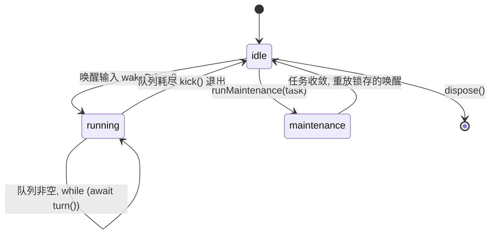
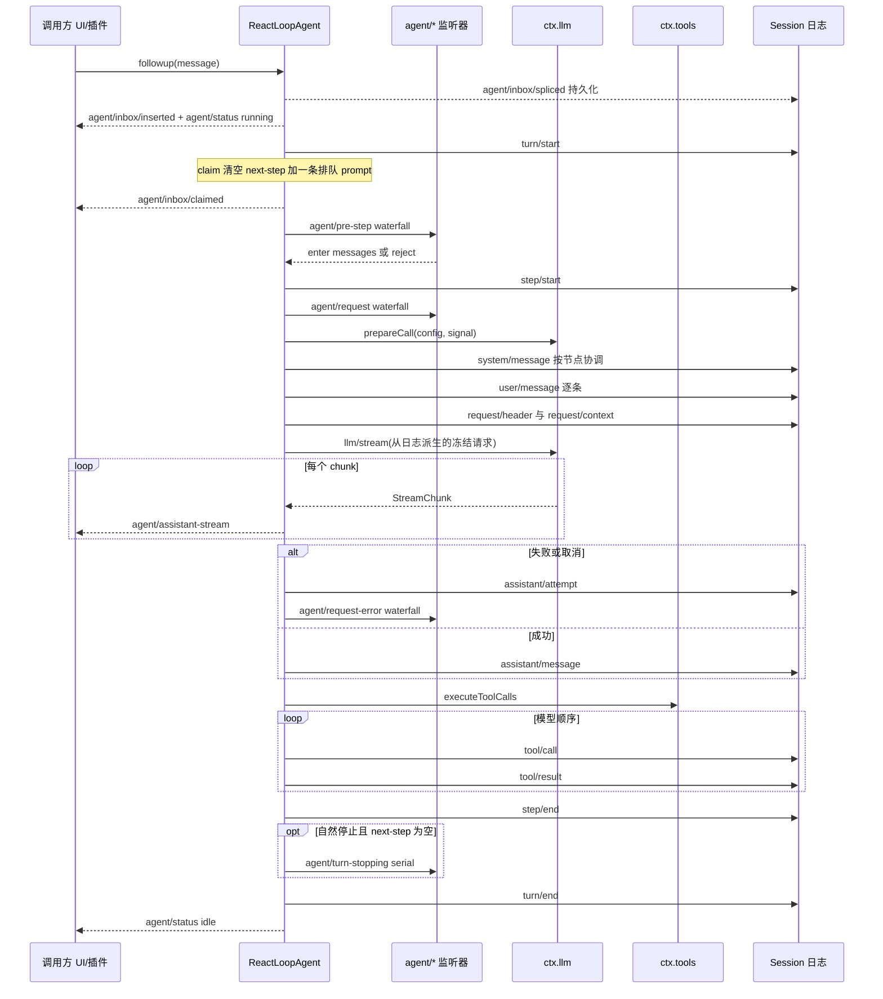

本页剖析 `@deepseek-ai/dsh-agent-loop` 的驱动器 `ReactLoopAgent`：一次用户输入如何从收件箱排队、被认领、经过 pre-step 仲裁、进入 `step/start` 与模型请求，最终以带明确原因的 `turn/end` 收敛。理解这条流水线的前提是一个核心设计：**轮次与步骤边界是持久的会话日志事件，而队列、状态与协调是进程内实时的 `agent/*` 事件**——两层各自服务于可回放性与可扩展性。

Sources: [agent.ts](packages/core/agent-loop/src/agent.ts#L1-L5), [agent-lifecycle.md](docs/agent-lifecycle.md#L6-L6)

## 双时间轴：持久会话事件与实时 agent/* 事件

`Session` 是追加型的 `SessionEvent` 日志，是唯一的事实来源；模型可见的消息历史（`deriveMessages()`）是从日志**派生**的，而不是单独存储的。轮次与步骤边界本身就是持久事件——`turn/start`、`turn/end`、`step/start`、`step/end`——由驱动器写入日志，任何阅读器（包括重启后的 resume 路径）都从这些事件重建状态。这意味着"轮次生命周期"不是一个内存状态机的事后描述，而是日志中一阶存在的记录。

Sources: [types.ts](packages/core/session/src/types.ts#L275-L301), [core.md](docs/subsystems/core.md#L346-L351)

实时层 `agent/*` 事件则完全不同：它们是进程本地的协调 API，用于队列状态、提示拦截、请求构造、转向（steering）、续跑（continuation）与错误通知。需要可回放的对话数据的消费者应订阅 `session/event`；`agent/*` 是活机器的扩展点缝合线。两层通过同一条驱动器代码在精确的边界上交错：驱动器先提交持久事实，再发布实时通知。

Sources: [runtime-types.ts](packages/core/agent/src/runtime-types.ts#L1-L6), [agent-lifecycle.md](docs/agent-lifecycle.md#L83-L89)

`agent/*` 事件经由一个"融合分发器" `agentEvents()` 发出：驱动器在构造函数中构建一次 `AgentEventDispatch`，把代理主体注入每个 payload、把代理自身作为 scope 载体传给 Cordis。这保证 payload 中的 `agent` 字段与 scope 键永不分叉，且热路径分发不重复分配——代理作用域的监听器只会收到自己那个代理的事件。

Sources: [dispatch.ts](packages/core/agent/src/dispatch.ts#L28-L82), [agent.ts](packages/core/agent-loop/src/agent.ts#L107-L129)

## 驱动器与三态相位机

`ReactLoopAgent` 用一个三态 `Phase` 联合类型描述整个代理的活动区间：`idle`（含 `lastTurn` 记忆）、`maintenance`（独占维护任务与中止控制器）、`running`（含 `abort` 信号、`turn`/`step` 坐标与 `wakeRequested` 锁存）。公开状态 `AgentStatus` 只有 `'idle' | 'running'` 两个值——`maintenance` 对外表现为 `idle`——每次相位翻转导致的公开状态变化都会 `emit` 一条 `agent/status`。

Sources: [agent.ts](packages/core/agent-loop/src/agent.ts#L42-L61), [agent.ts](packages/core/agent-loop/src/agent.ts#L140-L152), [runtime-types.ts](packages/core/agent/src/runtime-types.ts#L102-L109)

唤醒输入（`followup()`/`steer()`）通过 `wakeDriver()` 驱动机器：只有 `idle` 相位能启动驱动器；发向 maintenance 或已中止活动的唤醒会被**锁存**在 `wakeRequested` 中，待活动收敛到 idle 后重放。驱动器本体是 `kick()` 中的 `while (await this.turn()) {}` 循环——每轮结束若收件箱仍有待处理输入，就换一个新的 `AbortController` 继续下一轮；队列耗尽才回到 idle。`runMaintenance()` 则从真正的 idle 相位独占启动一个非轮次任务，期间到达的唤醒输入留在队列中，公开状态保持 `idle`。

Sources: [agent.ts](packages/core/agent-loop/src/agent.ts#L154-L204), [agent.ts](packages/core/agent-loop/src/agent.ts#L214-L265), [runtime-types.ts](packages/core/agent/src/runtime-types.ts#L193-L202)

一个对调试者重要的细节：唤醒提交时若代理已处于中止中的活动，`send()` 会在插入**之前**捕获 `wakingAfterAbort` 分类，把目标改写为 `next-turn`——被中止的活动无法接收唤醒，它天然属于下一个轮次。而"idle 时提交的唤醒总是打开轮边界"，即使该消息在驱动器认领前被清除——这就是取消收敛唤醒锁存语义。

Sources: [agent.ts](packages/core/agent-loop/src/agent.ts#L154-L161), [agent.ts](packages/core/agent-loop/src/agent.ts#L206-L224), [runtime-types.ts](packages/core/agent/src/runtime-types.ts#L204-L215)

## 从唤醒到 turn/start：队列、claim 与 pre-step 仲裁

输入入口只有三个语义化方法，全部落到同一个持久收件箱：`followup()` 投入 `next-turn`（成为其自己轮次的唯一普通消息）、`steer()` 投入 `next-step`（在最近的步骤边界被消费）、`inject()` 投入 `next-step` 但**不唤醒**驱动器。每次收件箱变更都会提交一条规范化的 `agent/inbox/spliced` 持久事件；`dsh-agent-loop` 为其服务生命周期注册了标准 `inbox` 投影，投影注册表在 `Session.append()` 返回时同步折叠该事件——因此冷读（进程重启前后的挂载间隙）也能重建待处理输入。

Sources: [agent.ts](packages/core/agent-loop/src/agent.ts#L163-L173), [inbox.ts](packages/core/agent-loop/src/inbox.ts#L26-L65), [types.ts](packages/core/agent/src/types.ts#L89-L104)

`turn()` 的第一个动作是**递增轮号并提交 `turn/start`**。轮号不是内存计数：它从持久化的 `turnBoundary` 投影的 `lastTurn` 恢复（驱动器构造函数读取，该投影由 `turn/start`/`turn/end`/`step/*` 事件折叠而来），因此 resume 后轮号无缝延续。随后进入步骤循环：`preStep()` 先 `claim` 认领批次——清空整个 `next-step` 列表，若目标是 `next-turn` 再加一条排队 prompt——并为每条消息发出 `agent/inbox/claimed { message, turn }`。

Sources: [agent.ts](packages/core/agent-loop/src/agent.ts#L296-L316), [inbox.ts](packages/core/agent-loop/src/inbox.ts#L103-L114), [index.ts](packages/core/agent-loop/src/index.ts#L57-L95)

认领之后是整个机器中唯一的请求前置仲裁链：先等待 `ctx.systemPrompt.assemble()` 汇编（信号检查点），再投影运行时上下文快照（`RuntimeContextProjection` 仅在快照内容变化时生成一条 `runtime-context` 来源的 user 消息），最后跑 `agent/pre-step` 瀑布。监听器可以 `reject`（拒绝打开步骤）或 `enter` 一份**完整权威的消息批次**——返回值是权威的；包装 `next()` 的监听器会保留下游消息与 `startsRequestSeries`，除非有意替换。

Sources: [agent.ts](packages/core/agent-loop/src/agent.ts#L267-L286), [runtime-context.ts](packages/core/agent-loop/src/runtime-context.ts#L114-L164), [runtime-types.ts](packages/core/agent/src/runtime-types.ts#L309-L320)

两个空批次分支值得记住：`reject` 使轮次以 `blocked` 结束——**已认领的批次保持已移除状态**，被拒绝的消息既不丢弃也不作为 `user/message` 入账，轮次在没有步骤的情况下关闭。而首个提议步骤被改写为空（或唤醒消息在认领前被清除）时，该唤醒仍拥有轮边界：日志记录一对没有 `step/*` 的 `turn/start` + `turn/end(completed)`，不花费任何模型调用。

Sources: [agent.ts](packages/core/agent-loop/src/agent.ts#L317-L327), [runtime-types.ts](packages/core/agent/src/runtime-types.ts#L289-L299), [agent-lifecycle.md](docs/agent-lifecycle.md#L31-L32)

## 步骤时序：step/start 与 step/end 之间

一旦 pre-step 决议 `enter`，驱动器提交 `step/start` 并进入 `step()`。每个模型尝试按固定顺序推进：`agent/request` 瀑布提出 `LlmCallConfig`（首次来自代理选项、此后来自已记录 header，去掉适配器自有字段），随后 `ctx.llm.prepareCall()` 在活跃轮次信号下绑定适配器并解析推理努力与输出上限默认值——**prompt 准入使用的是真实的 `prepareCall()` 结果**，而非之前的推测。

Sources: [agent.ts](packages/core/agent-loop/src/agent.ts#L329-L334), [agent.ts](packages/core/agent-loop/src/agent.ts#L381-L408), [agent.ts](packages/core/agent-loop/src/agent.ts#L529-L579), [runtime-types.ts](packages/core/agent/src/runtime-types.ts#L321-L337)

接着是日志准入序列：`system/message` 按节点协调（首个提示即使为空也保留表面节点 0；`in-history` 能力的延续系列追加变化文本；无能力路由或新系列则归一化到头部节点并清空后续节点）、仅首次尝试逐条提交 `user/message`、`request/header`（四种 reason：`initial`/`resume`/`change`/`series`）、工具增删时的 `developer/message`、路由元数据变化时的 `request/context`。请求本身**从日志派生**：`deriveMessages()` 之后逐条深冻结消息身份（弱集合记录已冻结身份），再整体冻结为带 `markAgentLoopRequest` 标记的请求对象。

Sources: [agent.ts](packages/core/agent-loop/src/agent.ts#L388-L407), [agent.ts](packages/core/agent-loop/src/agent.ts#L582-L670), [runtime-context.ts](packages/core/agent-loop/src/runtime-context.ts#L65-L111), [agent-loop/README.md](packages/core/agent-loop/README.md#L92-L96)

流式阶段把每个 chunk 双发：持久侧累积进 `AssistantStreamAttempt`，实时侧逐帧 `emit` `agent/assistant-stream { frame }`（`start`/`chunk`/`end` 三种帧，`end` 帧携带持久结算的 `seq` 或 `abandoned`）。成功结算写一条 `assistant/message`——携带精确压缩的定时流与可选 `usage`；内容为空或 `max-tokens` 收尾也会记录。此时无工具调用则步骤以 `completed` 结束，有工具调用则交给调度器，`concludesTurn` 的结果可以让轮次在此步直接终结。

Sources: [agent.ts](packages/core/agent-loop/src/agent.ts#L409-L427), [agent.ts](packages/core/agent-loop/src/agent.ts#L495-L521), [runtime-types.ts](packages/core/agent/src/runtime-types.ts#L354-L363), [session/types.ts](packages/core/session/src/types.ts#L318-L349)

`step/end` 写在 `finally` 块里——即使步骤体抛错也一定提交，与 `step/start` 严格配对。之后驱动器检查两个条件才允许轮次关闭：步骤结论存在（`completed`/`max-tokens`）**且** `next-step` 收件箱已排空。满足时先跑 `agent/turn-stopping` 串行检查点：模型已不欠任何响应，但监听器仍可通过 `agent.steer(...)` 提出异议——机器随后重读收件箱，新鲜的 steering 会开启另一个步骤；数据决定结果，监听器顺序无法改变结局。收件箱未排空时，循环以 `target = 'next-step'` 继续下一步。

Sources: [agent.ts](packages/core/agent-loop/src/agent.ts#L331-L347), [runtime-types.ts](packages/core/agent/src/runtime-types.ts#L364-L381), [agent-lifecycle.md](docs/agent-lifecycle.md#L67-L76)

一条粘性规则贯穿整个步骤循环：`max-tokens` 一旦出现就不被降级——后续正常完成的步骤不会把轮次结论改写回 `completed`。这让 UI 与策略消费者可以信任 `turn/end` 的结论语义。

Sources: [agent.ts](packages/core/agent-loop/src/agent.ts#L332-L337), [agent.ts](packages/core/agent-loop/src/agent.ts#L513-L513)

## 失败、重试与取消：三种持久结局

失败尝试的持久结局是 `assistant/attempt`：到达结算但未产生表面消息的失败、重试、取消或流错误尝试，把精确的原始流嵌入这条 log-only 事件——既不伪造模型可见历史，也不丢失诊断证据。结算之后进入 `agent/request-error` 瀑布（运行在失败步骤仍打开、失败轮次信号仍活跃的时刻）：监听器返回 `{ kind: 'retry' }` 且**不调用** `next()` 即接管恢复，默认 `undefined` 使失败终结为抛出的 `LlmError`。重试发生在**同一个打开的步骤内**：重新准备请求并重新协调同一渲染汇编，不重复 pre-step，也不重复 user 批次（`firstAttempt` 标志保证 `user/message` 只入账一次）。

Sources: [agent.ts](packages/core/agent-loop/src/agent.ts#L428-L493), [agent.ts](packages/core/agent-loop/src/agent.ts#L402-L407), [runtime-types.ts](packages/core/agent/src/runtime-types.ts#L338-L353), [session/types.ts](packages/core/session/src/types.ts#L350-L355)

取消的持久形态取决于流式进度：轮次在流中途被取消时，已送达的文本/推理前缀被结算为 `interrupted: true` 的 `assistant/message`（未派发的工具调用缺席）；没有任何可见内容的取消尝试则结算为 `assistant/attempt`。取消原因由 `cancel(cause)` 的调用方以类型强制的方式提供（`user`/`parent`/`hook`/`disposed`），驱动器只拷贝 `turn/end` 可记录的字段——活跃 `AbortSignal.reason` 保留调用方原对象（Node 的 fetch 会往上面挂 `stack`，直接入日志会被数据校验拒绝）。

Sources: [agent.ts](packages/core/agent-loop/src/agent.ts#L431-L460), [agent.ts](packages/core/agent-loop/src/agent.ts#L72-L95), [session/types.ts](packages/core/session/src/types.ts#L331-L349)

工具侧的取消有独立的合成结果协议：中止发生时已启动的调用照常排空并按模型顺序提交结果，而每个**未启动**的调用获得一条固定的合成错误结果——错误码 `ABORTED_BEFORE_DISPATCH`、文本 `Error: tool call aborted before dispatch`——保证回放（例如换模型重放被中止的步骤）依然结构有效。内部调度器失败则相反：停止新派发、排空已启动调用、抛出首个失败，**不**伪造任何工具结果。

Sources: [tool-calls.ts](packages/core/agent-loop/src/tool-calls.ts#L96-L101), [tool-calls.ts](packages/core/agent-loop/src/tool-calls.ts#L238-L260)

无轮次定位的失败也不丢：`throwError()` 在其活跃边界 `emit` `agent/error { turn, step, error }` 后再抛出，由 `kick()` 的边界捕获收敛。最终 `turn/end` 的 `error` 变体总是结构化的——`LlmError` 逐字保留 `LlmFailure` 事实，其他错误经 `errorChain` 压平为 `code: 'UNKNOWN'` 的文本。

Sources: [agent.ts](packages/core/agent-loop/src/agent.ts#L244-L265), [agent.ts](packages/core/agent-loop/src/agent.ts#L349-L364)

## turn/end 的七种结束原因

`TurnEndReason` 是合并可扩展的映射（插件可声明合并新变体），核心七种如下：

| reason | 触发条件 | 产生方 |
|---|---|---|
| `completed` | 模型无工具调用自然收尾；空批次拥有轮边界未花模型调用；工具结果携带 `concludesTurn` | 驱动器实时发出 |
| `max-tokens` | 至少一个步骤触达输出上限（粘性，不被后续完成降级） | 驱动器实时发出 |
| `aborted { reason }` | `cancel(cause)` 中止活跃轮次，`reason` 为拷贝后的取消原因 | 驱动器实时发出 |
| `blocked` | `agent/pre-step` 返回 `reject`，轮次无步骤关闭 | 驱动器实时发出 |
| `error { error }` | 步骤/轮次失败；`LlmError` 保真，其余压平为 `UNKNOWN` | 驱动器实时发出 |
| `interrupted` | 崩溃孤儿轮：存储日志中最后一个轮次未结束，由 agent-loop resume 事后补写关闭事件 | 仅恢复路径 |
| `forked` | fork 种子构造闭合源会话在分叉边界仍打开的轮次 | 仅 fork 种子 |

Sources: [session/types.ts](packages/core/session/src/types.ts#L195-L232), [agent.ts](packages/core/agent-loop/src/agent.ts#L309-L372)

`turn/end` 提交后的尾部逻辑决定了驱动器是"轮次结束"还是"代理结束"：收件箱仍有待处理输入则换新 `AbortController`、`step` 归零、返回 `true` 让 `kick()` 继续下一轮；否则返回 `false`，驱动器在 `finally` 中回到 `idle` 并重放锁存的唤醒。因此 `agent/status` 的 `running` 区间可能横跨多个连续轮次——它描述的是驱动器级排空区间，不能证明某个特定轮次仍打开。

Sources: [agent.ts](packages/core/agent-loop/src/agent.ts#L365-L379), [agent.ts](packages/core/agent-loop/src/agent.ts#L252-L265), [core.md](docs/subsystems/core.md#L193-L193)

## 工具调度：屏障、有界并行池与模型顺序提交

步骤内的工具调用由 `executeToolCalls()` 调度，核心是**按活跃并发模式分组**：以模型顺序取下一个调用，询问 `ctx.tools.executionMode()`——独占模式形成屏障（单独成组），`parallel` 模式把其余调用并入一个受 `maxParallelToolCalls`（默认 10，运行时可变的 Config 字段）约束的滚动池。后来调用在启动前**重新分类**，注册表变化可以在池中途制造出新的屏障。

Sources: [tool-calls.ts](packages/core/agent-loop/src/tool-calls.ts#L60-L102), [tool-calls.ts](packages/core/agent-loop/src/tool-calls.ts#L199-L213), [agent-loop/README.md](packages/core/agent-loop/README.md#L36-L58)

并发只存在于派发阶段：有序的 pre 阶段可以 await，但结果与结果上下文的提交严格按**模型顺序**推进（`commitReady` 只跨越连续就绪的槽位），每个 `tool/result` 通过 `sourceEventSeqs` 引用它对应的 `tool/call` 的 seq。`additionalContexts` 交给调用方 acceptor——驱动器把它拼接到 `next-step` 收件箱，在步骤边界成为下一批认领输入。`concludesTurn` 的结果以 `concluded` 累积返回，让轮次在该步骤终结。

Sources: [tool-calls.ts](packages/core/agent-loop/src/tool-calls.ts#L147-L161), [agent.ts](packages/core/agent-loop/src/agent.ts#L517-L520), [tool-calls.ts](packages/core/agent-loop/src/tool-calls.ts#L268-L290)

pre/execute/post 的把关事件语义（`tool/call` 前后的审批、钩子与观察点）属于工具执行流水线的领域，本页不展开——驱动器只是通过 `ctx.tools[TOOL_RUNTIME_SCHEDULER]` 的 `prepare`/`dispatch`/`finalize`/`finish` 接口消费它。

Sources: [tool-calls.ts](packages/core/agent-loop/src/tool-calls.ts#L165-L197), [工具系统与执行流水线](16-gong-ju-xi-tong-yu-zhi-xing-liu-shui-xian-tooldefinition-schema-dsl-yu-pre-execute-post-ba-guan-shi-jian)

## 消费指南：在正确的层挂载你的逻辑

`agent/*` 词汇表按分发模式分为四类，选错层的典型症状是：想回放的数据只存在于 `session/event`，而想拦截的行为只存在于 `agent/*` 瀑布。

| 事件 | 模式 | 触发时机 | 典型用途 |
|---|---|---|---|
| `agent/created` | serial | 工厂 setup 后、creation 解析前 | 每代理初始化，失败会回滚创建 |
| `agent/disposed` | emit | 驱动收敛与 scoped 撤销之后、session 分离之前 | 清理观察者 |
| `agent/status` | emit | `idle` ⇄ `running` 每次翻转 | UI 忙碌指示、队列感知 |
| `agent/inbox/inserted` | emit | 消息进入 live 收件箱 | 输入回显 |
| `agent/inbox/claimed` | emit | 消息在打开的轮次内被认领 | 标记"该消息已成为历史" |
| `agent/inbox/discarded` | emit | 消息被丢弃 | 取消反馈 |
| `agent/pre-step` | waterfall | 每个提议步骤前的唯一仲裁点 | 拦截、改写批次、注入门控 |
| `agent/request` | waterfall | 每次模型尝试的配置提出点 | 切换路由/推理努力（不能改消息） |
| `agent/request-error` | waterfall | 失败尝试结算后、重试或关步前 | 上下文溢出压缩与重试策略 |
| `agent/assistant-stream` | emit | 每个流帧 | 实时打字机渲染 |
| `agent/turn-stopping` | serial | 自然停止且 next-step 排空、最终 drain 前 | 结论检查点、steer 续命 |
| `agent/error` | emit | 步/轮失败在其活跃边界上报 | 监控与告警 |

Sources: [runtime-types.ts](packages/core/agent/src/runtime-types.ts#L245-L394), [core.md](docs/subsystems/core.md#L302-L344)

两个高频扩展场景的精确边界值得强调。其一是压缩类插件：`dsh-compaction-basic` 用 `agent/pre-step` 在请求派生前施加压力检查，用 `agent/request-error` 只处理规范的上下文溢出，恢复运行在打开的步骤内、仅当修剪后仍溢出才重试。其二是转向类插件：steering 与注入上下文走同一条 pre-step 瀑布——在更晚的 claim 操作取走它们的 next-step 批次之后。

Sources: [agent-lifecycle.md](docs/agent-lifecycle.md#L85-L87), [agent-loop/README.md](packages/core/agent-loop/README.md#L192-L201)

轮次与步骤边界的只读消费方无需监听任何事件：`turnBoundary` 会话投影（`openTurnStartSeq`、`lastStepStartSeq`、`lastStepBoundary`、`lastTurn`）由 `dsh-agent-loop` 注册并从日志折叠，读者把键缺失视为"无打开轮次"的能力缺失而非损坏状态。

Sources: [types.ts](packages/core/agent/src/types.ts#L69-L87), [index.ts](packages/core/agent-loop/src/index.ts#L46-L95)

## 延伸阅读

- 追问"这四类事件该如何选择"——见 [事件域与扩展点：会话事件、agent/* 实时事件与能力事件的选择原则](12-shi-jian-yu-yu-kuo-zhan-dian-hui-hua-shi-jian-agent-shi-shi-shi-jian-yu-neng-li-shi-jian-de-xuan-ze-yuan-ze)
- 步骤事件在磁盘上的形状与格式版本演进——见 [会话模型与持久化：SessionEvent 日志、JSONL 提供方与格式版本演进](15-hui-hua-mo-xing-yu-chi-jiu-hua-sessionevent-ri-zhi-jsonl-ti-gong-fang-yu-ge-shi-ban-ben-yan-jin)
- `StreamChunk` 与适配器如何喂给 `agent/assistant-stream`——见 [LLM 适配与流式协议：Message/ContentBlock、StreamChunk 与适配器约定](17-llm-gua-pei-yu-liu-shi-xie-yi-message-contentblock-streamchunk-yu-gua-pei-qi-yue-ding)
- 驱动器所在的核心包全景——见 [总体架构：插件树、核心包职责与 ctx 服务键位图](9-zong-ti-jia-gou-cha-jian-shu-he-xin-bao-zhi-ze-yu-ctx-fu-wu-jian-wei-tu)