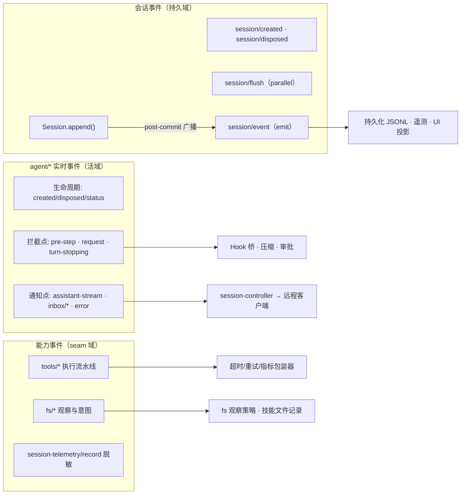
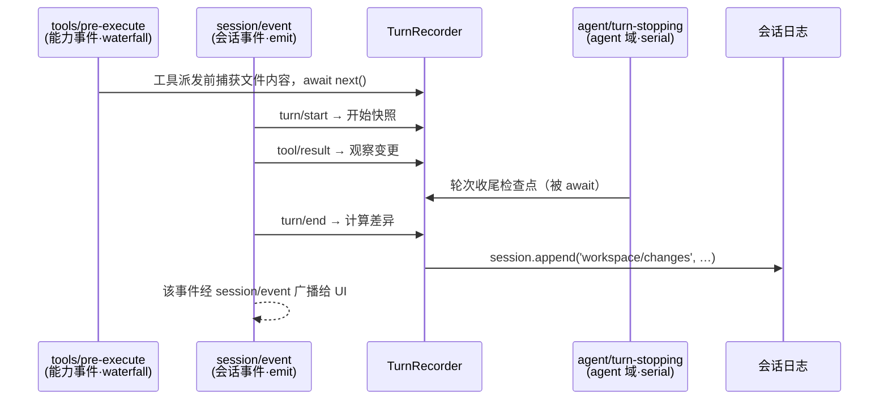

在 DeepSeek Harness 中，"一切皆插件"的架构让事件成为最主要的扩展面：框架官方文档明确指出，**"事件即扩展点，选对事件域是大多数改动要做的第一个决策"**。本页面向中级开发者，解释三个事件域——会话事件、`agent/*` 实时事件与能力事件——各自的语义边界、分发契约，以及在不同需求下如何选域。阅读本页前建议先了解 Cordis 的类型化事件机制（见 [Cordis 入门](5-cordis-ru-men-cha-jian-shang-xia-wen-fu-wu-zhu-ru-lei-xing-hua-shi-jian-yu-ke-ni-fu-zuo-yong)）与分发模式（见 [Cordis 分发模式与瀑布语义](6-cordis-fen-fa-mo-shi-yu-pu-bu-yu-yi-emit-waterfall-parallel-serial-bail-de-xie-zuo-shi-zhong-jian-jian)）；轮次内事件的具体时序则由 [Agent Loop 与轮次生命周期](11-agent-loop-yu-lun-ci-sheng-ming-zhou-qi-turn-start-dao-turn-end-de-bu-zou-liu-yu-shi-jian-shi-xu) 专门讲解。

Sources: [architecture.md](docs/architecture.md#L72-L74)

## 三个事件域总览

框架将全部扩展事件划分为三个域，每个域回答一个不同的问题：**事实要不要活过一次进程重启？你要观察/拦截的是"飞行中"的工作，还是既成事实？你要挂的是策略，还是状态？** 官方架构文档给出的定义是：会话事件是"追加进日志的持久事实，通过 `session/event` 广播"，当事实必须在重载后依然成立时使用；`agent/*` 事件携带活的 `Agent` 对象（收件箱、步骤、状态、请求、校验、续跑），用于观察或拦截进行中的工作；能力事件则把策略与适配器挂到 seam（如 `fs/*`、`tools/*`、`telemetry/*`）上，且**无需导入 agent loop**。

一个关键的分类事实是：`turn/*`、`step/*`、`system/message`、`user/message`、`assistant/message`、`assistant/attempt`、`tool/*` 这些听起来像"实时事件"的名字，实际上都是**持久的会话事件**（写入日志）；其余的才是跨三个域的活扩展点。这意味着不能凭事件名前缀判断域，而要看**声明位置**——本章稍后用 `agent/inbox/spliced` 这个反例专门说明。

Sources: [architecture.md](docs/architecture.md#L76-L78), [architecture.md](docs/architecture.md#L109)

下面的概念图展示了三个事件域各自的载体、分发通道与典型消费者（先看图例：左侧是事件域，中间是分发机制，右侧是消费者类别）：

Sources: [architecture.md](docs/architecture.md#L76-L82), [event-producer-consumer.md](docs/event-producer-consumer.md)

## 会话事件：持久事实与日志广播

会话事件的根基是 `SessionEventMap`——一个**可合并扩展的、只追加的事实源**接口。核心变体包括 `turn/start`、`turn/end`、`step/start`、`step/end`、`user/message`、`developer/message`、`system/message`、`assistant/message`、`assistant/attempt`、`tool/call`、`tool/result`、`request/header`、`request/context` 与 `session/end-seed`；插件通过 TypeScript 声明合并为 `SessionEventMap` 增加新变体（`SessionEventType = keyof SessionEventMap`），无需改动 `dsh-session` 包本身。每条日志条目是带 `seq`（单调递增）、`time` 与按 `type` 判别的 `data` 的判别联合，消息类变体还必须声明 `surfaceOp`（如何进入派生模型历史的有序表面）。

Sources: [types.ts](packages/core/session/src/types.ts#L275-L431), [types.ts](packages/core/session/src/types.ts#L493-L516)

**`session/event` 是"提交后"的扇出通道**。`Session.append()` 的契约是：先做 JSON 无损校验与快照冻结，事件一旦进入日志即视为**已提交**；随后监听器以 fire-and-forget 方式收到通知，观察者的失败被逐个记录、隔离，既不会改变 `append` 的返回值，也不会阻止后续监听者观察同一条已接受的事件。这条契约的推论是：监听 `session/event` 的代码看到的事件永远是**既成事实**——你可以记录、投影、转发，但不能否决或修改它。与之配套，`session/created` 是发布流程中的同步公告（监听器同步抛出可否决并回滚创建），`session/disposed` 在会话离开内存仓库时发出一次，而 `session/flush` 是**被等待的 parallel 持久化检查点**：调用方会等所有监听器落地，供持久化插件把缓冲事件刷到磁盘。

Sources: [index.ts](packages/core/session/src/index.ts#L43-L88), [index.ts](packages/core/session/src/index.ts#L686-L773)

框架对"谁负责持久化"给出了明确的域分工答案：**持久化是插件的事**——`dsh-session` 的模块文档开门见山写着"subscribe to `session/event`, drain on `session/flush`"。 shipped 的 JSONL 后端正是这样实现的：订阅追加流缓冲写入，在 flush 检查点排空。同时仓库为会话事件词汇表设有生成物与校验门禁：`KNOWN_SESSION_EVENT_TYPES` 枚举本构建认识的全部事件类型，持久化读取路径遇到集合之外的类型时，除非该事件带 `ignorable` 标记，否则**拒绝重建会话**——因为一个未知但必需的事件可能改变日志其余部分的解释。新增持久化事件因此要走 `persistence-change` 声明流程（例如 `workspace/changes` 事件的登记），这是"选会话事件域"所附带的责任。

Sources: [index.ts](packages/core/session/src/index.ts#L1-L7), [known-event-types.ts](packages/core/session/src/known-event-types.ts#L7-L26), [2026-09-14-workspace-changes-event.md](docs/persistence-changes/2026-09-14-workspace-changes-event.md)

## agent/* 实时事件：飞行中的观察与拦截

`agent/*` 事件由 `dsh-agent` 声明、由具体驱动 `dsh-agent-loop` 派发，全部携带活的 `Agent` 对象，官方称之为"机器的扩展点"。按生命周期可分三组。**生命周期组**：`agent/created`（serial，监听器按序被等待，抛出会令创建失败并回滚——AgentLoop 在所有创建监听器完成前扣留排队输入）、`agent/disposed`（emit）、`agent/status`（emit，`idle` ⇄ `running` 翻转）、以及三条收件箱通知 `agent/inbox/inserted`、`agent/inbox/claimed`、`agent/inbox/discarded`（均 emit）。**错误通知组**：`agent/error`（emit），即使错误没有可持久记录的轮次内位置，机器也会在此上报。

Sources: [runtime-types.ts](packages/core/agent/src/runtime-types.ts#L245-L307), [runtime-types.ts](packages/core/agent/src/runtime-types.ts#L382-L393)

**拦截组**才是这个域真正独特的能力，它们使用不同的分发模式来表达不同的控制权。`agent/pre-step`（waterfall）是请求派生前唯一的瀑布链：监听器可以否决提议的步骤，或整体替换进入该步骤的消息批次，返回的 `PreStepDecision` 是**权威的**。`agent/request`（waterfall）允许替换冻结的调用配置（模型路由等），但明文规定**不能改动消息**——模型可见的内容必须走日志通道。`agent/request-error`（waterfall）在循环重试或收尾前处理失败的模型请求：自任恢复的监听器不调用 `next()` 而返回 `{ kind: 'retry' }`，默认 `undefined` 则让失败保持终态。`agent/turn-stopping`（serial，无 `next()`）是轮次收尾前的终检点：监听器的等待被**先于边界提交**而 await，若它通过 `agent.steer(...)` 投入新转向，机器会重读收件箱并继续跑下一个步骤——决定权交给数据，监听器顺序不影响结果。`agent/assistant-stream`（emit）则是进程内的流式发布：chunk 帧是瞬态的，循环会在提交 end 帧之前把完整压缩流作为一条 `assistant/message`（或 log-only 的 `assistant/attempt`）写入日志。

Sources: [runtime-types.ts](packages/core/agent/src/runtime-types.ts#L308-L381), [core.md](docs/subsystems/core.md#L302)

**前缀不决定域：`agent/inbox/spliced` 是会话事件。** 收件箱的每次归一化变更都以 `session.append('agent/inbox/spliced', …)` 写入**持久日志**（收件箱状态本身是由日志折叠重建的投影），然后驱动才补发 `agent/inbox/inserted` / `agent/inbox/discarded` 这样的活通知。这正是"持久事实 + 活通知"双通道模式的实例：需要跨重启恢复的收件箱状态走日志，需要即时 UI 反应的变化走 emit。此外，驱动还有一种私有的辅助事件 `agent-loop/config-start-failed`（emit），用于声明式 agent 条目在发布前失败时，让缓冲工作的一方及时拒绝而非无限等待——它不属于 `agent/*` 域，因为它不携带 `Agent`。

Sources: [inbox.ts](packages/core/agent-loop/src/inbox.ts#L197-L243), [index.ts](packages/core/agent-loop/src/index.ts#L228-L240)

## 能力事件：无循环依赖的策略挂载点

第三个域挂在**能力 seam** 上。seam 的定义是"可替换能力"：一个 Service Definition 声明接口、若干 Service Provider 提供实现、Consumer（常是模型工具）使用它。能力事件的职责是在**不导入 agent loop、不产生包间循环**的前提下，把策略和适配器附加到这些 seam 上。以工具执行流水线为例：`tools/pre-execute`（waterfall）在派发前允许、拒绝、取消或转人工询问；`tools/execute`（waterfall）包裹实际派发，供超时、重试或指标包装器使用；`tools/post-execute`（waterfall）可接受、替换、充实或阻断归一化结果；`tools/ptc-dispatch-log`（waterfall）只影响**日志副本**的内容（如溢出策略的预览 + 定位符），程序已收到完整值；`tools/result`（emit）观察最终的深冻结快照。

Sources: [architecture.md](docs/architecture.md#L129-L133), [index.ts](packages/core/tools/src/index.ts#L142-L198)

能力事件域里有一条值得注意的例外规则：**registry-subject 事件不做作用域过滤**。`tools/change`（emit）在工具注册/注销或作用域限制变化时发出，它的 JSDoc 明确说明这是"蓄意的非作用域过滤"——一次全局的可用工具集变化关乎**每个** agent 的下一次组装，因此即使通过 `agent.ctx` 订阅，也会看到所有变化而非仅本作用域的。文件系统能力的事件同样体现了 seam 语义：`fs/write-intent` 与 `fs/edit-intent` 是**单槽决策**瀑布（第一个返回意图的监听者独占决策权，而非与同伴叠加组合），`fs/observed`（emit）记录权威的正/负观察。遥测域的 `session-telemetry/record` 则是 Service Definition 自带的脱敏扩展点：无监听器挂载时数据按原样导出，"导出数据的干净程度等于部署所挂规则的干净程度"。

Sources: [index.ts](packages/core/tools/src/index.ts#L199-L208), [index.ts](packages/fs/fs/src/index.ts#L50-L79), [index.ts](packages/session/session-telemetry/src/index.ts#L41-L58)

## 分发模式与作用域过滤：选域之外的第二层决策

选定域之后，还有两个维度决定事件的实际行为：**分发模式**与**作用域过滤**。Cordis 提供四种模式，各域按控制权需求选用：`emit` 同步派发并忽略返回值（纯通知）；`parallel` 并发运行所有监听器并等待全部落地（无瀑布否决的持久化检查点）；`serial` 按序等待、可中途 bail（有顺序语义的初始化/终检）；`waterfall` 以 `next()` 续延构成洋葱式中间件链（不调用 `next()` 即否决，逐层改写结果）。

| 模式 | 监听器语义 | 返回值契约 | 本仓库代表事件 |
|---|---|---|---|
| `emit` | 同步触发，失败被逐个隔离记录 | 忽略 | `session/event`、`agent/status`、`tools/result` |
| `parallel` | 并发运行，**调用方 await 全部** | 全落地才算完成 | `session/flush` |
| `serial` | 按序 await，可 bail 终止 | 首个 bail 值 | `agent/created`、`agent/turn-stopping` |
| `waterfall` | 洋葱式包裹，必须 `next()` 委托 | 最外层监听器返回值 | `agent/pre-step`、`tools/execute`、`fs/write-intent` |

Sources: [events.md](docs/cordis-api/events.md#L10-L120)

**作用域过滤**解决的是多 agent 并存时"谁该听到谁"的问题。规则由 glossary 一句话锁定："关于某个 agent 活动的事件以该 agent 的载体派发；关于注册表本身的事件（如工具新增）是 registry-subject，保持不过滤。"实现在 `scopeTarget` 构建的载体过滤器里：未打标的全局监听器一律放行；打了作用域标的监听器，只有当其标等于派发键**或其祖先**时才被放行——事件沿作用域链**向上**流动，永不向下。这条向上规则让一个常驻组合能观察它名下组合的每个 agent（含子代理），而子代理的监听器听不到父级域外的事件。哪些事件参与过滤并非手工维护：生成器 `gen-scoped-events` 扫描全部事件声明的 `this: Scoped<Base>` 标注与负载中的主题属性，生成不变量校验用的解析器表——若一个事件声明了 `Scoped<Agent>` 但负载里的 `agent` 字段与载体可能分叉， fused dispatcher（`agentEvents`）会把主体注入负载，使**作用域键与负载的 agent 不可能不一致**。

Sources: [glossary.md](docs/glossary.md#L13-L20), [index.ts](packages/core/scope/src/index.ts#L157-L185), [scoped-events.generated.ts](packages/core/scope/src/scoped-events.generated.ts#L13-L51), [dispatch.ts](packages/core/agent/src/dispatch.ts#L1-L13)

值得注意的边界是 `session/*` 四事件的 `@dshScopeScan unsupported` 标注：它们的作用域过滤以 `Scoped<Session>` 载体为键，但负载不暴露外部路由键，因此生成的解析器对它们只检查载体存在性（生成表中记为 `null`）。语义上，agent 作用域的监听者只会收到"经该 agent 上下文进入"的会话事件——父作用域自然覆盖子代理的会话流。

Sources: [scoped-events.generated.ts](packages/core/scope/src/scoped-events.generated.ts#L26-L39), [index.ts](packages/core/session/src/index.ts#L43-L88)

## 选择原则：一张决策表

框架给出的第一条经验法则是**按持久性分流**："SDK 用户需要可回放的转录数据就消费 `session/event`；`agent/*` 是队列/状态、提示拦截、请求构建、转向、续跑与错误的活协调 API。"会话序列图文档同样申明其分工："可回放事实记在 `session/event` 上，活控制/状态在 `agent/*` 上。"在这两者之外，若你的改动是在为某个能力 seam 定策略（而非关心特定轮次），那就要找对应 seam 的事件。下表把架构文档"新行为去哪"的条目按域归类，可直接当决策表用：

| 你的需求 | 选哪个域 | 具体机制 |
|---|---|---|
| 事实必须在重载后成立（转录、标题、审批记录、变更摘要） | **会话事件** | 扩展 `SessionEventMap` 并 `session.append`；从日志渲染与回放 |
| UI/编辑器集成需要渲染对话 | **会话事件** | 驱动 `ctx.agents` 并从 `session/event` 渲染 |
| 拦截/改写即将进入步骤的输入 | **agent 域** | `agent/pre-step`（waterfall，决定权威） |
| 切换模型路由、注入重试恢复、在轮次收尾前转向 | **agent 域** | `agent/request` / `agent/request-error` / `agent/turn-stopping` |
| 队列与运行状态感知（含子代理协调） | **agent 域** | `agent/inbox/*`、`agent/status`、`agent/created` |
| 工具执行的前置把关、超时包装、结果改写 | **能力事件** | `tools/pre-execute` → `tools/execute` → `tools/post-execute` |
| 文件写入策略与文件观察记录 | **能力事件** | `fs/write-intent` / `fs/observed` |
| 遥测脱敏等导出策略 | **能力事件** | `session-telemetry/record`（waterfall） |

Sources: [agent-lifecycle.md](docs/agent-lifecycle.md#L89), [agent-lifecycle.md](docs/agent-lifecycle.md#L2), [architecture.md](docs/architecture.md#L141-L162)

还有几条从源码契约中可以提炼的**反向排除规则**。第一，不要用 `agent/*` 承载需要跨重启存续的状态——轮次与步骤边界都被刻意设计为持久会话事件而非 agent emit，理由正是可回放性。第二，不要在 `agent/request` 或 `session/event` 监听器里试图修改模型可见内容：前者明文禁止改消息（必须走日志通道），后者是提交后的只读扇出；要影响模型输入，正确路径是 `agent/pre-step` 的消息批次替换或 `agent.inject()` 注入上下文（落在下一个被接受的请求里）。第三，若你的策略属于某个已存在的 seam，优先用该 seam 的事件而非监听 agent 域——`workspace-changes` 捕获文件工具编辑前内容用的是 `tools/pre-execute` 而不是任何 agent 事件，因为"改文件"这个事实的权威决策点在工具流水线上。

Sources: [core.md](docs/subsystems/core.md#L302), [runtime-types.ts](packages/core/agent/src/runtime-types.ts#L320-L337), [architecture.md](docs/architecture.md#L153-L155)

## 实战案例：workspace-changes 插件的三域协作

`dsh-workspace-changes`（Web bundle 自带）是三个域在一个插件内协作的完整样本，它为每个顶层轮次生成"本轮改了哪些文件"的持久摘要。其监听器布局如下：

Sources: [index.ts](packages/deliverables/workspace-changes/src/index.ts#L143-L164)

逐条看代码：插件在全局上下文上挂 `session/event`（分发 `turn/start`/`tool/result`/`turn/end` 给按会话记录器）与 `session/disposed`（清理记录器）；在 `agent/turn-stopping` 上做轮末停机检查点（serial，因此记录器可被 await）；在 `tools/pre-execute` 上于工具体执行**之前**捕获将被编辑文件的内容，然后调用 `next()` 委托放行——这正是 waterfall "包裹后委托"的标准写法。最终摘要以 `session.append('workspace/changes', { turn })` 成为**持久事实**（该事件是 log-only、永不模型可见，且按 `persistence-change` 流程登记过兼容性），摘要与逐文件对比则由 `workspaceChanges` 服务按需提供。这个布局把三类需求各归其位：可回放的"改了什么"进日志；"何时该收尾"进 agent 域检查点；"编辑前内容从哪拿"进工具流水线瀑布。

Sources: [index.ts](packages/deliverables/workspace-changes/src/index.ts#L94-L118), [recorder.ts](packages/deliverables/workspace-changes/src/recorder.ts#L354), [2026-09-14-workspace-changes-event.md](docs/persistence-changes/2026-09-14-workspace-changes-event.md)

消费端也印证了域的分工。遥测协调器作为典型的**会话事件消费者**，挂载 `session/created`/`session/disposed`/`session/event`/`session/flush` 全套监听，并把 `agent/error` 作为操作信号**中继**进遥测通道（跨域单向桥接，而非混用两域语义）；而 `agent/assistant-stream` 的消费者矩阵显示只有 `headless` 与 `session-controller` 监听它——后者是活流事件**唯一的远程消费者**（Web 的 Session-follow 适配器），其余 UI 增量需求都应在进程内消化，回放需求则交给日志中嵌入的完整流。

Sources: [coordinator.ts](packages/session/session-telemetry/src/coordinator.ts#L92-L120), [event-producer-consumer.md](docs/event-producer-consumer.md), [architecture.md](docs/architecture.md#L109)

## 小结与延伸阅读

三个事件域可以浓缩为三句选型口诀：**要成为历史，写会话日志（`Session.append` + `session/event` 广播）；要干预现在，听 `agent/*`（按控制权挑 waterfall/serial/emit）；要给某个能力定规矩，挂 seam 事件（`tools/*`、`fs/*`、`telemetry/*`）。** 选定后再核对两层契约：分发模式决定你的监听器是否有否决权、是否被 await；作用域过滤决定你在多 agent 进程里听到谁的流量（事件沿链向上、registry-subject 不过滤）。仓库还提供两张生成文档做日常索引：事件生产者/消费者矩阵列出每个事件的派发方与监听方，子系统页则内嵌各域事件的精确签名。

想继续深入，推荐按以下路径阅读：理解事件在轮次中的精确时序，请看 [Agent Loop 与轮次生命周期](11-agent-loop-yu-lun-ci-sheng-ming-zhou-qi-turn-start-dao-turn-end-de-bu-zou-liu-yu-shi-jian-shi-xu)；能力事件背后的服务全景，请看 [能力 Seams 与核心服务全景](13-neng-li-seams-yu-he-xin-fu-wu-quan-jing-ke-ti-huan-fu-wu-de-ti-gong-fang-yu-xiao-fei-fang-guan-xi-tu)；会话日志的持久化细节与格式演进，请看 [会话模型与持久化](15-hui-hua-mo-xing-yu-chi-jiu-hua-sessionevent-ri-zhi-jsonl-ti-gong-fang-yu-ge-shi-ban-ben-yan-jin) 与 [工具系统与执行流水线](16-gong-ju-xi-tong-yu-zhi-xing-liu-shui-xian-tooldefinition-schema-dsl-yu-pre-execute-post-ba-guan-shi-jian)；动手写插件时，[插件开发实战](25-cha-jian-kai-fa-shi-zhan-fu-wu-ding-yi-shi-jian-jian-ting-yu-dong-tai-cordis-pei-zhi) 与 [扩展手册](24-kuo-zhan-shou-ce-tian-jia-gong-ju-bao-llm-gua-pei-qi-remote-api-yu-she-zhi-qia-pian) 提供按步骤的操作指南。