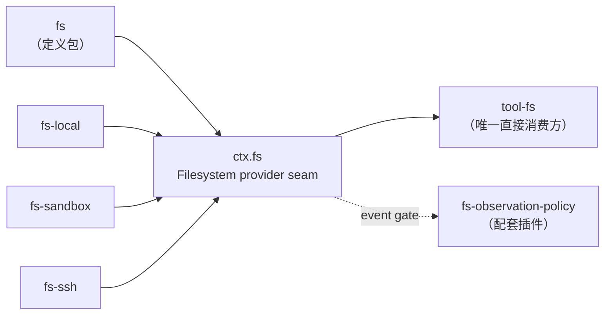

本页解读仓库中的生成文档 [docs/capability-seams.zh.md](docs/capability-seams.zh.md)：一张覆盖全部 `ctx` 服务键的关系图加一张七列全景表。上一页讨论了事件域的选择原则，本页则把视角从"事件"转到"服务"——回答三个问题：**框架里有哪些服务键？哪些是可替换的能力 seam？每个 seam 的定义方、实现方与消费方分别是谁？** 读完本页，你应当能够独立读懂全景图中任意一条 `pkg_* --> svc_* --> pkg_*` 链路，并知道替换某个后端时需要动哪里。

Sources: [capability-seams.zh.md](docs/capability-seams.zh.md#L1-L8)

## 一张图与一张表：服务全景的两个视图

生成的文档由两部分组成。第一部分是一个 `flowchart LR` 的 Mermaid 全景图，把"拥有服务声明的包、已知实现包，以及直接消费该服务的包"画在同一张图里；第二部分是逐服务键展开的七列表格，给出与图完全一致但更易检索的信息。文档头部明确标注"英文源文件由 `scripts/gen-doc-graphs.ts` 生成"，禁止手改——这是整份文档可信度的基础：它不是人肉维护的快照，而是从代码中推导出的可复验事实。

Sources: [capability-seams.zh.md](docs/capability-seams.zh.md#L1-L3)，[capability-seams.md](docs/capability-seams.md#L1-L3)

表格当前列出 **90 个服务键**（从 `ctx.hmr` 到 `ctx.cordisInspect`），每行对应生成脚本 `SERVICE_ROLES` 清单中的一条记录。表格末行同时声明了维护模式："混合模式。服务从 Cordis 声明中发现；接口、实现和消费方角色在 `scripts/gen-doc-graphs.ts` 中分类，并设有完整性守卫。"这句话是理解本文档性质的关键：**键与图是机器发现的，角色语义是人工标注的，两者之间有机器守卫强制一致。**

Sources: [capability-seams.zh.md](docs/capability-seams.zh.md#L570-L572)，[capability-seams.zh.md](docs/capability-seams.zh.md#L661-L663)

## 四类角色：core、seam、bundle、service

生成脚本中的 `ServiceRole` 接口把每个服务键的 `mode` 限定为四种字面量：`'core' | 'seam' | 'bundle' | 'service'`。文档开篇对四者给出了一句话定义：服务可以是**核心主干服务**（core）、**可替换的能力 seam**（seam）、**组合包/组合点**（bundle）或**独立服务**（service）。判定标准不是包的位置，而是一个替换性问题：*换掉它，是否改变产品能力边界？*

Sources: [scripts/gen-doc-graphs.ts](scripts/gen-doc-graphs.ts#L68-L80)，[capability-seams.zh.md](docs/capability-seams.zh.md#L4-L6)

在当前生成的 90 行中，33 个键是 `seam`，55 个是 `core`，`bundle` 与 `service` 各只有 1 个。四种角色的对照如下：

| 角色 | 语义 | 判定问题 | 全景表中的代表 |
| --- | --- | --- | --- |
| `core` | 主干服务：所有部署都需要，不存在"另一个实现"的替换语义 | 删掉它产品还能跑吗？——不能 | `ctx.sessions`、`ctx.tools`、`ctx.systemPrompt` |
| `seam` | 可替换能力：有抽象接口，存在至少一个可并列注册的具体后端 | 换一个实现会改变执行世界/能力边界吗？——会 | `ctx.fs`、`ctx.llm`、`ctx.shell` |
| `bundle` | 组合点：具体的"叶子插件"，扩展包只依赖其事件与服务，不依赖此包 | 它是唯一的组装成品吗？——是 | `ctx.agentLoop` |
| `service` | 独立服务：挂载即生效的旁路能力，无消费方耦合 | 它有直接消费方吗？——没有 | `ctx.productTelemetry` |

Sources: [capability-seams.zh.md](docs/capability-seams.zh.md#L587-L622)，[capability-seams.zh.md](docs/capability-seams.zh.md#L610-L632)

`bundle` 与 `service` 的两行注释值得细读。`ctx.agentLoop` 的说明是"唯一的具体循环插件；扩展包依赖 dsh-agent 的事件和服务，而不依赖此包"——这正是第 9 页讲过的"agent 接口与驱动器分离"在全景表中的落点。`ctx.productTelemetry` 的说明是"挂载插件本身不会采集信息"，且直接消费方一列为空：它的输出直接离开进程，不进入框架内的调用链。

Sources: [capability-seams.zh.md](docs/capability-seams.zh.md#L632-L633)，[scripts/gen-doc-graphs.ts](scripts/gen-doc-graphs.ts#L583-L590)，[scripts/gen-doc-graphs.ts](scripts/gen-doc-graphs.ts#L408-L414)

## seam 的三元角色与代码形态（以 ctx.fs 为例）

架构文档对 seam 给出了精确的定义：**一个 seam 是一项可替换能力，包含三种角色——声明接口的 Service Definition、实现它的 Service Provider，以及使用它的 Consumer（通常是面向模型的工具）。一个包可以合并承担多个角色，但单一角色本身不是 seam。** 这段定义是阅读全景表的"解码器"：表格里的"所属包/实现/直接消费方"三列，正是这三种角色在各服务键上的展开。

Sources: [architecture.zh.md](docs/architecture.zh.md#L133-L139)

以全景表中最完整的一行 `ctx.fs` 为例。**定义方**是 `packages/fs/fs`：它在 `declare module '@deepseek-ai/cordis'` 中把 `fs: FileSystem` 挂进 `Context` 接口，并声明一个继承 Cordis `Service` 的抽象类 `FileSystem`——`resolve`、`stat`、`lstat`、写与编辑等抽象方法构成了 seam 的全部契约。接口词汇表刻意使用**品牌化的不透明类型**（如 `FsTargetKey`、`FsVersion`），注释明确要求"消费方绝不可解析它或假设它是本地绝对路径"，从而保证远程、沙箱等后端可以自由定义自己的目标身份。

Sources: [architecture.zh.md](docs/architecture.zh.md#L133-L139)，[index.ts](packages/fs/fs/src/index.ts#L63-L91)，[types.ts](packages/fs/fs/src/types.ts#L20-L34)

**实现方**是三个并列的后端包：`fs-local`（宿主本地文件系统）、`fs-sandbox`（按共享沙箱模式围栏变更）、`fs-ssh`（远程执行世界）。`fs-local` 的模块文档第一行就自述身份——"Host-filesystem implementation of `ctx.fs`"——并以 `class LocalFileSystem extends FileSystem` 实现契约、以 `export default LocalFileSystem` 导出，供组合层挂载。**消费方**是 `tool-fs`：全景表注释写明"tool-fs 通过 ctx.fs 执行读/写/编辑"，即模型可见的文件工具从不触碰具体后端，只调用 seam 接口。

Sources: [capability-seams.zh.md](docs/capability-seams.zh.md#L645-L645)，[index.ts](packages/fs/fs-local/src/index.ts#L1-L4)，[index.ts](packages/fs/fs-local/src/index.ts#L299-L301)

把全景图中 `ctx.fs` 的子图单独抽出，三元角色一目了然。**阅读须知**：实线箭头 `-->` 指向服务节点表示"提供实现"，从服务节点指出表示"直接消费"；虚线箭头 `-. event gate .->` 是一类特殊边，表示该包**不调用服务方法，而是通过 `fs/*` 等能力事件向 seam 附加策略**：

Sources: [capability-seams.zh.md](docs/capability-seams.zh.md#L328-L331)，[capability-seams.zh.md](docs/capability-seams.zh.md#L460-L460)，[capability-seams.zh.md](docs/capability-seams.zh.md#L567-L567)

## 如何读图：边与节点的语义

全景图的绘制规则集中在生成脚本的 `renderCapabilitySeams` 函数中，只有四种边型，机械且无歧义。对每个服务键：定义包 `owner --> svc`（所有者声明服务）；每个实现包 `impl --> svc`（实现指向接口）；每个直接消费方 `svc --> consumer`（服务流向使用方）；配套插件则用带 `event gate` 标签的虚线单独收录、排在实线之后。节点 id 的 `pkg_`/`svc_` 前缀即来源于此处的 `nodeId('pkg', ...)` 与 `nodeId('svc', ...)` 调用。

Sources: [scripts/gen-doc-graphs.ts](scripts/gen-doc-graphs.ts#L900-L944)

两个阅读要点。**其一，"直接消费方"只统计第一跳。** 例如 `ctx.sessions`（内存会话存储）的直接消费方包括 `agent-loop`、`agent`、`session-persistence` 等八个包，但 `session-query-sqlite` 之所以出现在列表里，是因为它同时消费 `ctx.sessions` 与 `ctx.sessionPersistence` 两个服务——更下游的使用者不会重复出现在每个键的行里。想要完整的传递依赖，应结合模块图而非在全景图中逐跳追踪。**其二，实现与消费方可以是同一批包。** `ctx.browserUse` 的实现与消费方同为三个 experimental 驱动包：这类"注册即使用"的 seam 中，提供方向服务注册自己，然后在自己的会话作用域内消费注册句柄。

Sources: [capability-seams.zh.md](docs/capability-seams.zh.md#L587-L587)，[scripts/gen-doc-graphs.ts](scripts/gen-doc-graphs.ts#L234-L240)，[scripts/gen-doc-graphs.ts](scripts/gen-doc-graphs.ts#L118-L127)

## 全景表七列怎么用

表格的七列各有固定语义，逐列说明如下：

| 列 | 含义 | 阅读要点 |
| --- | --- | --- |
| `ctx 键` | Cordis 上下文上的服务键名 | 与源码中 `declare module` 注入的属性一一对应 |
| `角色` | `core` / `seam` / `bundle` / `service` | 判断该键是否可替换的第一信号 |
| `所属包` | 声明服务接口（Service Definition）的包 | 想理解契约，从这里读起 |
| `实现` | 已知实现包（Service Provider），可并列多个 | 为空不代表缺陷：`ctx.approval` 的应答方是事件监听者而非注册实现 |
| `直接消费方` | 第一跳调用方 | 只有一跳，不含传递依赖 |
| `配套插件` | 经能力事件门（event gate）附加策略的插件 | 图中唯一使用虚线的角色 |
| `说明` | 一句话职责与所有权边界 | 生成脚本中人工维护的 `note` 字段 |

Sources: [capability-seams.zh.md](docs/capability-seams.zh.md#L570-L663)，[scripts/gen-doc-graphs.ts](scripts/gen-doc-graphs.ts#L938-L941)

## 代表性 seam 速览（按领域分组）

90 个服务键中，`seam` 类占比约三分之一（33/90）。下表按领域摘录最常用的一批 seam 及其"定义包 → 实现 → 直接消费方"链路，可作为扩展开发时的速查索引：

| 领域 | ctx 键 | 定义包 | 已知实现 | 直接消费方 |
| --- | --- | --- | --- | --- |
| 文件 | `ctx.fs` | fs | fs-local, fs-sandbox, fs-ssh | tool-fs |
| 进程 | `ctx.subprocess` | subprocess | subprocess-local, subprocess-ssh | bash-local, bash-sandbox, terminal-bash, lsp-stdio, subagent-acp/codex/claude-code |
| Shell | `ctx.shell` | shell | bash-local, bash-sandbox, pwsh-local | tool-bash, tool-pwsh, hooks-* |
| 沙箱 | `ctx.sandbox` | sandbox | sandbox-local, sandbox-ssh | bash-sandbox, terminal-bash |
| 终端 | `ctx.terminals` | terminal | terminal-bash | tool-terminal |
| 后台任务 | `ctx.jobs` | jobs | jobs-local | tool-bash/pwsh/terminal/subagent, tool-jobs, api-job-controller |
| 溢出存储 | `ctx.spillStore` | spill | spill-local | spill-policy |
| 模型 | `ctx.llm` | llm | llm-deepseek, llm-pi-ai, llm-replay | agent-loop, compaction-basic |
| 会话持久化 | `ctx.sessionPersistence` | session-persistence | session-persistence-jsonl | agent-loop, tool-bash, hooks-*, session-query* |
| 会话查询 | `ctx.sessionQuery` | session-query | session-query-sqlite | session-reference, tool-session-query |
| KV 存储 | `ctx.storage` | storage | storage-json, storage-sqlite | storage-domain |
| 凭据 | `ctx.credentials` | credentials | credentials-local | api-settings-controller, llm-deepseek, llm-pi-ai |
| 子代理 | `ctx.subagents` | subagent | spawn/fork-in-process, acp, codex, claude-code, dsh-sdk | tool-subagent, tool-subagent-control, tool-ralph |
| 技能 | `ctx.skills` | skill | skill-badge/filesystem/office | tool-skill |
| PTC 运行时 | `ctx.ptcRuntime` | ptc-runtime | ptc-runtime-node, ptc-runtime-python | tools, workflow-ptc |
| 审批 | `ctx.approval` | user-approval | （无：应答方是监听者） | tools, tool-bash, acp |
| 人机问答 | `ctx.userQuestions` | user-questions | （无：UI 前端充当提供方） | tool-ask-user |
| Web 访问 | `ctx.web` | web | web-search-exa/perplexity/deepseek, web-fetch-http | tool-web |

Sources: [capability-seams.zh.md](docs/capability-seams.zh.md#L570-L663)，[capability-seams.zh.md](docs/capability-seams.zh.md#L636-L645)，[capability-seams.zh.md](docs/capability-seams.zh.md#L647-L659)

两个反复出现的模式值得注意。**模式一：`*-local` 是每个执行类 seam 的默认实现。** `subprocess-local`、`jobs-local`、`spill-local`、`credentials-local`、`attachment-local` 都遵循"接口包 + 本地实现包"的命名配对，而 `*-ssh` 系列则把同一个接口指向远程执行世界。**模式二：有的 seam 没有注册式实现。** `ctx.approval` 的实现列为空，注释说明一次性权限决策通过 `approval/request` waterfall 事件分派，应答方是监听者，缺席时**失败关闭**为 `unavailable`——这类 seam 的"实现"不在依赖注入里，而在事件域中，与上一页讨论的能力事件选择原则直接衔接。

Sources: [scripts/gen-doc-graphs.ts](scripts/gen-doc-graphs.ts#L613-L630)，[capability-seams.zh.md](docs/capability-seams.zh.md#L642-L642)，[scripts/gen-doc-graphs.ts](scripts/gen-doc-graphs.ts#L667-L674)

## 图与表从哪里来：生成脚本与完整性守卫

生成流水线是"混合模式"：`projectCordisCatalog` 从真实源码中发现所有 Cordis 服务声明，产出 `ServiceEntry` 列表——这部分是**机器枚举的事实**；`SERVICE_ROLES` 常量数组为每个键人工标注模式、实现、消费方与说明——这部分是**人工分类**。两者由完整性守卫 `assertServiceRolesComplete` 强制对齐：凡是源码中发现但未分类的键报 `missing service role classification`，凡是已分类但源码中已消失的键报 `stale service role classification`，任一情况都直接抛错、生成失败。

Sources: [scripts/gen-doc-graphs.ts](scripts/gen-doc-graphs.ts#L887-L898)，[scripts/gen-doc-graphs.ts](scripts/gen-doc-graphs.ts#L900-L903)

这个守卫的实际约束力在于：**不可能出现"代码里加了新服务但文档没更新"的漂移**。向仓库添加带新服务声明的包时，CI 会强制你在 `SERVICE_ROLES` 中补上对应条目并回答"它是不是 seam、谁实现它、谁消费它"这三个设计问题；反之，删除服务时也必须清理分类，否则文档生成失败。日常维护只需运行 `pnpm run gen-doc-graphs` 再生英文源文件，再按文档头部的双语配对说明同步中文侧并运行 `verify-translation-pairing` 重新记录配对。

Sources: [capability-seams.zh.md](docs/capability-seams.zh.md#L1-L2)，[capability-seams.zh.md](docs/capability-seams.zh.md#L663-L663)

## 从 seam 到运行组合：实现由 patch 行决定

全景图回答"有哪些实现存在"，而"哪次运行实际挂载哪个实现"由组合层决定。共享组合包 `dsh-base` 的 patch 行给出了典型答案：`ctx.fs` 挂的是**沙箱化后端** `dsh-fs-sandbox` 而非裸的 `fs-local`；`ctx.credentials` 挂 `dsh-credentials-local`；`ctx.storage` 配 `storage-json` 后端；`ctx.subprocess` 挂 `subprocess-local`；`ctx.sandbox` 挂 `sandbox-local`；`ctx.jobs` 挂 `jobs-local`；`ctx.llm` 侧则由 `dsh-llm-deepseek-api-key` 提供官方 DeepSeek 适配器。patch 文件头部写明了替换机制：后续组合包与用户的 profile patch **按行 id 寻址、整行替换 config、同一 id 以最后一次写入为准**。

Sources: [cordis.patch.yml](packages/bundle/base/cordis.patch.yml#L1-L4)，[cordis.patch.yml](packages/bundle/base/cordis.patch.yml#L515-L518)，[cordis.patch.yml](packages/bundle/base/cordis.patch.yml#L117-L171)，[cordis.patch.yml](packages/bundle/base/cordis.patch.yml#L219-L226)，[cordis.patch.yml](packages/bundle/base/cordis.patch.yml#L524-L525)

因此，"替换一个 seam 实现"在操作上就是一行 patch 的改写（示意，按 id 寻址机制推导）：

| 层 | 行 id | 挂载的插件 | 效果 |
| --- | --- | --- | --- |
| dsh-base（现状） | `fs-sandbox` | `@deepseek-ai/dsh-fs-sandbox` | 文件变更被围栏在共享沙箱模式内 |
| 用户 overlay（示意） | `fs-sandbox` | `@deepseek-ai/dsh-fs-ssh` | 同一 id 整行替换，文件世界切换到远程主机 |

这就是架构文档那句论断的机制来源：**seam 正是"替换一个提供方就能改变整个产品"的原因**——把文件系统与进程提供方指向远程执行世界，Bash、PTY 与 LSP 便一并迁移，无需任何提供方专用 fork。组合层的叠层顺序与 patch 语义详见 [Profile 与组合包](10-profile-yu-zu-he-bao-dsh-base-patch-die-jia-shun-xu-yu-yun-xing-shi-zu-zhuang-ji-zhi)。

Sources: [cordis.patch.yml](packages/bundle/base/cordis.patch.yml#L1-L4)，[architecture.zh.md](docs/architecture.zh.md#L137-L139)

## 小结与下一步

本页给出了一张自校验的服务全景的读法：四种角色模式回答"这是什么性质的服务"，三元角色回答"谁定义、谁实现、谁消费"，完整性守卫保证图与代码永不漂移，组合层的 patch 行决定"此刻运行的是哪个实现"。把新能力接入框架时，架构文档的"新行为的归属位置"速查表（添加模型提供方→注册 `ctx.llm`，添加 shell 执行→注册 `ctx.shell` 后端，添加文件系统访问→注册 `ctx.fs` 提供方或监听 `fs/*` 事件……）与本页的全景表互为索引。

Sources: [architecture.zh.md](docs/architecture.zh.md#L145-L167)

建议的后续阅读路径：向纵深走，[工具系统与执行流水线](16-gong-ju-xi-tong-yu-zhi-xing-liu-shui-xian-tooldefinition-schema-dsl-yu-pre-execute-post-ba-guan-shi-jian)展开 `ctx.tools` 这一最大消费方的把关事件，[沙箱与安全边界](18-sha-xiang-yu-an-quan-bian-jie-ce-lue-jie-xi-bwrap-landlock-seatbelt-hou-duan-yu-shen-pi-seam)与[子代理与多智能体协作](19-zi-dai-li-yu-duo-zhi-neng-ti-xie-zuo-subagent-ti-gong-fang-fork-in-process-yu-agent-teams)分别深入 `ctx.sandbox` 与 `ctx.subagents` 两个高价值 seam；向横向走，[Host/Client 双聚合与 Typert 远程调用](14-host-client-shuang-ju-he-yu-typert-yuan-cheng-diao-yong-tsconfig-chai-fen-remote-sheng-ming-yu-rpc-wang-guan)解释这些服务如何跨越进程边界暴露为 Remote，[扩展手册](24-kuo-zhan-shou-ce-tian-jia-gong-ju-bao-llm-gua-pei-qi-remote-api-yu-she-zhi-qia-pian)则把本页的分类学转化为动手步骤。