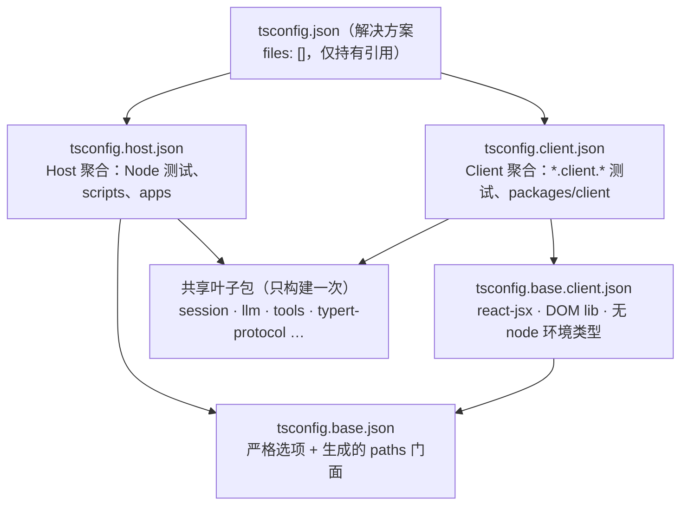
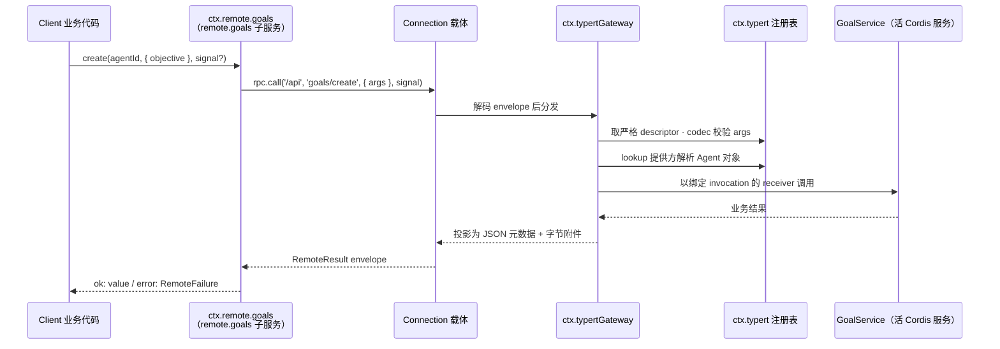

本页解释 DeepSeek Harness 中最容易被误读的一组架构决策：为什么同一个仓库要维护两套互不相交的 TypeScript 程序（Host 聚合与 Client 聚合）、包级 tsconfig face 如何拆分、Typert 如何从 Host 源码生成类型化的远程调用约定，以及 `ctx.typertGateway` 与 `ctx.remote` 这对对称入口如何通过 Connection 载体完成一次真正的 RPC。阅读前建议先了解 Cordis 服务模型与 [总体架构：插件树、核心包职责与 ctx 服务键位图](9-zong-ti-jia-gou-cha-jian-shu-he-xin-bao-zhi-ze-yu-ctx-fu-wu-jian-wei-tu)。

## 为什么一个仓库需要两套 TypeScript 程序

根因在 Cordis 的声明合并机制：Host 侧与 Client 侧会以**不同的服务类型**合并同名 Cordis `Context` 键位（如 `sessions`、`loader`）。TypeScript 的 interface 声明合并无法在一个 `ts.Program` 内同时看到两套冲突的合并结果——一旦两边的 Context 增强进入同一个编译程序，类型系统就会把不兼容的服务签名叠加到同一个键上。因此仓库被组织为两个互斥的检查单元：`tsconfig.json` 作为解决方案文件，`files: []` 使其自身不持有任何程序，仅通过 project references 指向 `tsconfig.host.json` 与 `tsconfig.client.json`，注释中明确警告"host/client cordis Context merges never meet"，且永远不要将其展平为单一 `ts.Program`。

Sources: [tsconfig.json](tsconfig.json#L1-L15), [tsconfig.host.json](tsconfig.host.json#L1-L9)

这一拆分不只是类型洁癖，它是 Typert 远程调用的存在前提。架构决策记录中写明：Host 与 Browser Client 使用独立的 TypeScript Program，Remote 投影因此**不能把完整 Host 声明导入消费端**——Client 只能看到被 `@Remote` 标记的方法及其 Client-safe 类型，这反过来强制了 wire 约定与业务实现的显式边界。

Sources: [.agents/notes/implemented/architecture/2026-08-02-typert-remote-method-calls.zh.md](.agents/notes/implemented/architecture/2026-08-02-typert-remote-method-calls.zh.md#L7-L16)

两个聚合共享大量叶子包（`session`、`llm`、`tools`、`typert-protocol` 等），这些包只构建一次，通过各自 client 包的 project references 被两个程序分别引用。整体结构如下：



Sources: [tsconfig.client.json](tsconfig.client.json#L1-L15)

## 根级四层 tsconfig 与聚合边界

根级配置共四层，各有不可动摇的职责边界：

| 文件 | 角色 | 关键约束 |
|---|---|---|
| `tsconfig.json` | 解决方案入口，供 `tsc -b` 与 tsserver 使用 | `files: []`，永不添加 include/files |
| `tsconfig.base.json` | 共享编译选项 + **paths 门面** | 永不添加 include/files，否则会收窄门面的 match-all 范围 |
| `tsconfig.base.client.json` | 浏览器侧编译形态 | `jsx: react-jsx`、DOM lib、`types: ["client-build-environment"]`，无环境 node 类型 |
| `tsconfig.host.json` / `tsconfig.client.json` | 两个检查聚合 | `noEmit` 类型检查；文件归属靠 include/exclude 与命名约定 |

Sources: [tsconfig.json](tsconfig.json#L1-L15), [tsconfig.base.json](tsconfig.base.json#L1-L8), [tsconfig.base.client.json](tsconfig.base.client.json#L1-L12)

`tsconfig.base.json` 中的 `paths` 映射是**生成的**：一条通配符把每个 `@deepseek-ai/dsh-<name>` 映射到其源码目录，因为包目录名跨组唯一，first-on-disk-wins 的解析无歧义；新增包无需手工编辑。由 `scripts/gen-tsconfig-paths.ts` 维护生成逻辑。这个门面同时服务 `vite-tsconfig-paths`（vitest 配置指向此处）与 tsx 运行 scripts 的解析需求。

Sources: [tsconfig.base.json](tsconfig.base.json#L178-L192), [tsconfig.base.json](tsconfig.base.json#L26-L29)

测试文件通过**后缀命名**声明自己属于哪个聚合：`*.client.*` 归 Client 聚合，`*.host.spec.ts` 归 Host 聚合，两者互斥，因此每个聚合只需排除对方的后缀，包级测试通配符无需逐文件登记。Client 聚合还在 `references` 中显式引用 typert registry、api gateway / remotes / 各 controller 的 `tsconfig.client.json` face——注意这里引用的是 **face 文件**而非包默认 tsconfig，因为 TS project references 没有通配符形式，聚合成员必须显式列出。

Sources: [tsconfig.host.json](tsconfig.host.json#L181-L199), [tsconfig.client.json](tsconfig.client.json#L39-L44), [tsconfig.client.json](tsconfig.client.json#L70-L80)

构建顺序被固定为 **Host 先行**：`build:lib` 依次执行 `build:lib:host`（`tsc -b tsconfig.host.json` + `tsdown --env.DSH_BUILD_FACE host`）与 `build:lib:client`。顺序不可交换——Typert 生成器以 Host aggregate 为唯一 `ts.Program` 在 Host 阶段生成严格 wire 约定，Client 阶段随后编译并打包消费这些生成文件；干净工作树不能跳过 Host 阶段。

Sources: [package.json](package.json#L24-L26), [docs/api-gateway.zh.md](docs/api-gateway.zh.md#L141-L157)

## 包级 face 拆分：共享叶子与双 face 包

拆分在包级同样成立。凡是同时服务两侧的"边界包"，都会拆出三个 tsconfig：默认 `tsconfig.json` 是 `files: []` 的解决方案，引用 `tsconfig.host.json` 与 `tsconfig.client.json` 两个 face。以 `packages/api/gateway` 为例：Host face 的 `files` 列出 `src/index.ts`、`stream-server.ts` 等 Node 侧入口；Client face 的 `files` 列出 `src/client/*.ts`；而 `stream-protocol.ts` 与 `remote-error-codes.ts` **同时出现在两侧 files 中**——它们是 wire 协议的共享叶子，两侧各自编译一份相同语义的声明，从而避免任何一侧导入另一侧的 Context 合并。

Sources: [packages/api/gateway/tsconfig.json](packages/api/gateway/tsconfig.json#L1-L12), [packages/api/gateway/tsconfig.host.json](packages/api/gateway/tsconfig.host.json#L8-L14), [packages/api/gateway/tsconfig.client.json](packages/api/gateway/tsconfig.client.json#L8-L17)

跨 face 的依赖也通过 face 文件引用表达：gateway 的 Host face 引用 `client/connection/tsconfig.host.json`，Client face 引用 `client/connection/tsconfig.client.json`，而两侧共同依赖的 `typert/protocol` 只有一个（它是纯协议包，无需拆分）。`apps/desktop` 是应用级拆分的样本：Host face `include: ["src"]` 且 `exclude: ["src/client"]`，Client face 只 `include` `src/client` 等渲染进程入口。

Sources: [packages/api/gateway/tsconfig.host.json](packages/api/gateway/tsconfig.host.json#L15-L43), [packages/api/gateway/tsconfig.client.json](packages/api/gateway/tsconfig.client.json#L18-L35), [apps/desktop/tsconfig.host.json](apps/desktop/tsconfig.host.json#L7-L35), [apps/desktop/tsconfig.client.json](apps/desktop/tsconfig.client.json#L7-L20)

## Typert 组件地图：四个包的分工

Typert 组由四个包构成一条"构建时生成 → 运行时注册 → 双端调用"的流水线：

| 包 | 运行位置 | 职责 | ctx 键 |
|---|---|---|---|
| `typert/protocol` | 双侧 | 声明 decorator、Gateway binding、可合并协议映射、调用描述符与提供方类型；不做 TypeScript 分析、不注册 Cordis 服务 | — |
| `typert/generator` | 构建时 | 从 Host `ts.Program` 严格分析 Remote 签名、类型图、lookup、Context 与源码位置，生成 Host 与 Host-for-Client 产物 | — |
| `typert/registry` | Host/Client 运行时 | 保存生成的反射与实时 Zod schema，持有 lookup 与 Context 提供方注册表 | `ctx.typert` |
| `typert/loader` | Host 运行时 | 监听 Cordis Loader 条目，自动注册带 `./typert` 导出的插件包产物 | 消费 `ctx.loader` 与 `ctx.typert` |

Sources: [packages/typert/README.zh.md](packages/typert/README.zh.md#L23-L31), [docs/api-gateway.zh.md](docs/api-gateway.zh.md#L82-L95)

生成器遵循一条核心分离原则：**提取与生成通过与编译器无关的模型解耦**。`WorkspaceAnalyzer` 读取以 face aggregate tsconfig 为种子的 TypeScript 程序，产出 `FaceModel` 与 `TypeGraph`；`FaceModelEmitter` 只消费该模型，绝不接收编译器节点。Host 与 Client 是两个独立的 TypeScript 程序，直接项目引用确定编译器 face 的成员归属。

Sources: [packages/typert/generator/README.zh.md](packages/typert/generator/README.zh.md#L64-L66), [packages/typert/generator/README.zh.md](packages/typert/generator/README.zh.md#L82-L88)

registry 侧提供三个确定性 key 组合函数：schema 键 `<package>#<name>`、包 face 键 `<package>#<face>` 与 endpoint 键 `<namespace>/<method>`，后者是本地与远程调用注册表共用的寻址单位。loader 则约定 `./typert` 为宿主侧产物的 package.json exports 键，以 `['typert', 'loader']` 为服务依赖实现自动注册。

Sources: [packages/typert/registry/src/service.ts](packages/typert/registry/src/service.ts#L49-L70), [packages/typert/loader/src/index.ts](packages/typert/loader/src/index.ts#L39-L45)

## Remote 声明：decorator、lookup 与作用域上下文

业务服务通过 `TypertRemoteService` 基类或 `bindTypertRemote()` 显式绑定 Cordis 服务键与 wire namespace（默认同名）。`@Remote('create')` 标记直接调用根 Context 中服务的方法；`@RemoteScope('agent', 'current')` 标记先经 `ctx.typert.contexts` 把 identity 解析为作用域 Context、再从该 Context 取服务的方法。decorator 的运行时职责极轻：只在 Service 原型上写入**带版本的描述符**（`RemoteMethodDescriptorV1`），记录方法名、调用模式与别名——严格反射完全是构建期编译器的职责。

Sources: [docs/api-gateway.zh.md](docs/api-gateway.zh.md#L7-L15), [packages/typert/protocol/src/index.ts](packages/typert/protocol/src/index.ts#L142-L180), [packages/typert/protocol/src/index.ts](packages/typert/protocol/src/index.ts#L198-L257)

两个关键签名约定：需要协作式取消的方法把全局类型 `signal: AbortSignal` 声明为最后一个 Host 参数——它记入描述符而**不进入 wire `args`**，生成的 Client 方法将其暴露为末位可选参数；流式方法返回 `RemoteStream<Out, In>`，其中 `Out` 是 Host 下行产出、`In` 是 Client 可经 `RemoteStreamHandle.send()` 上行的条目类型，Host 侧通过 `this.ctx.invocation.uplink()` 读取（Gateway 在调用派生的 Context 上注入 `invocation` 访问器）。

Sources: [packages/typert/protocol/src/types.ts](packages/typert/protocol/src/types.ts#L82-L120), [packages/typert/protocol/src/index.ts](packages/typert/protocol/src/index.ts#L182-L191), [docs/subsystems/typert.zh.md](docs/subsystems/typert.zh.md#L216-L241)

复杂的 Host 对象（如 `Agent`）不能直接跨 wire 传输。业务包通过声明合并扩展 `TypertLookupMap` 把 Host 对象类型关联到 wire identity（如 `agentId` 字段），并在运行时向 `ctx.typert.lookups` 注册提供方；Gateway 见到 `source: 'lookup'` 的参数时先解析对象再调用。调用本身的反射信息由 `InvocationDescriptor` 承载——它是**本地元数据而非 wire message**，请求只发送 endpoint 与具名 `args`。

Sources: [docs/subsystems/typert.zh.md](docs/subsystems/typert.zh.md#L9-L37), [docs/subsystems/typert.zh.md](docs/subsystems/typert.zh.md#L39-L141)

## 生成产物与发布约定

含 Remote 方法的业务包把生成文件写入自己的 `lib/`（而非源码目录），并通过两个 exports 子路径暴露：`./typert` 指向 Host face，`./remote` 指向 Host-for-Client face。以 `dsh-goal` 为例：

```json
"./typert": { "types": "./lib/typert.host.d.ts", "default": "./lib/typert.host.js" },
"./remote": { "types": "./lib/typert.remote-client.d.ts", "default": "./lib/typert.remote-client.js" }
```

Sources: [packages/goal/goal/package.json](packages/goal/goal/package.json#L33-L40), [docs/api-gateway.zh.md](docs/api-gateway.zh.md#L103-L115)

| 产物文件 | 消费方 | 内容 |
|---|---|---|
| `typert.host.js` / `.d.ts` | Host Loader / Host 类型系统 | Host face 运行时反射、严格调用描述符与 schema 注册值 |
| `typert.remote-client.js` | `api-remotes` | 可挂载的 `TypertRemoteContribution`（严格描述符 + 运行时 codec） |
| `typert.remote-client.d.ts` | Client 类型系统 | `TypertRemoteNamespaceMap` / `TypertRemoteScopeMap` 声明合并与 Client-safe 类型引用 |
| `typert.remote-client.d.ts.map` | 编辑器 | 将生成方法属性导航回 Host 包中带 `@Remote` 的源方法 |

Client 声明中的参数名来自 wire 字段，参数与返回类型引用业务包导出的 Client-safe 类型；支持 declaration map 的编辑器可以从 `ctx.remote.goals.create` 一路跳回 Host 源方法。严格分析同时约束签名形态：Remote 必须是公开、非静态、有具体实现的实例方法，不能是泛型，参数须为具名必填的简单标识符（不允许解构、默认值、rest 或可选参数）。

Sources: [docs/api-gateway.zh.md](docs/api-gateway.zh.md#L105-L119)

开发期存在一条 **SRC 回退路径**：以 `node --import tsx/esm` 从源码启动 Host 时不会执行 Typert 编译插件，但 decorator 初始化器仍把方法标记写入原型描述符，Gateway 据此从运行中函数解析简单参数名（参数名匹配 lookup 的 `parameter` 即走 wire 字段解析，其余仅做 JSON-safety 检查）。回退只解决 Host 源码进程的分发问题——Client 始终消费最近一次生成的 `lib/typert.remote-client.*`，拒绝挂载缺少严格 codec 的 SRC 描述符，保证热卸载不会悄然降低校验强度。

Sources: [docs/api-gateway.zh.md](docs/api-gateway.zh.md#L133-L139)

## Host 网关：`ctx.typertGateway` 的分发语义

`packages/api/gateway` 同时拥有两个对等入口：默认入口提供 Host dispatcher `TypertGatewayService`（`static inject = ['typert']`），`/client` 入口提供消费端 `ctx.remote`——但两侧构建永不进入同一个 `ts.Program`。网关每次调用都**从当前注册表解析描述符与实时服务、不缓存业务对象**：要求 `args` 字段集合与描述符完全一致，先用 codec 校验 wire 值，再经 lookup/Context 提供方解析接收者，最后以绑定 `invocation` 的 receiver 调用活 Cordis 服务。

Sources: [packages/api/gateway/src/index.ts](packages/api/gateway/src/index.ts#L1-L6), [packages/api/gateway/src/index.ts](packages/api/gateway/src/index.ts#L193-L200), [docs/api-gateway.zh.md](docs/api-gateway.zh.md#L90-L95), [docs/api-gateway.zh.md](docs/api-gateway.zh.md#L121-L127)

网关外的失败由 `TypertGatewayError` 承载，其 `gateway/*` 码构成可扩展的错误词汇表（`RemoteErrorDetailsMap` 中由各方声明合并）：`gateway/lookup-unavailable`、`gateway/context-failed`、`gateway/arguments-invalid`、`gateway/uplink-overflow` 等约 19 个稳定类别。这些码**原样过线**而非折叠为 `internal`，Client 侧因此能按码分支恢复。

Sources: [packages/api/gateway/src/index.ts](packages/api/gateway/src/index.ts#L162-L191), [docs/subsystems/typert.zh.md](docs/subsystems/typert.zh.md#L289-L311), [packages/typert/protocol/src/types.ts](packages/typert/protocol/src/types.ts#L44-L59)

## Client 侧：`ctx.remote`、`$mount` 与事件转发

Client 入口的 `ClientRemoteService` 以 `'remote'` 为键注册，`inject = ['typert', 'connection']`。它**不使用 JavaScript Proxy**：`$mount(contribution)` 按贡献包分组描述符，把每个 namespace 实体化为可追踪的 `remote.<namespace>` Cordis 子服务并安装具体方法；挂载前做冲突校验（endpoint 重复、与既有 namespace 冲突即整批拒绝），卸载时逆序拆除并中止进行中的调用。生成的声明合并让业务代码直接写出 `ctx.remote.goals.create(...)` 这样的类型化调用。

Sources: [packages/api/gateway/src/client/index.ts](packages/api/gateway/src/client/index.ts#L102-L142), [packages/api/gateway/src/client/index.ts](packages/api/gateway/src/client/index.ts#L202-L267), [docs/api-gateway.zh.md](docs/api-gateway.zh.md#L58-L60)

**选择权在装配层**：Client 应用只装配 `@deepseek-ai/dsh-api-remotes`，其 `apply()` 显式列出本应用允许挂载的约 23 个 `/remote` 贡献并逆序释放——新增一个 Host Remote 包是 Client 组合所有者的显式决定，而非自动发现。该装配同时是"两个平面合法相遇的唯一位置"：它 re-export 全部所选 namespace 的 payload 类型词汇，使业务包只需命名一个装配包。

Sources: [packages/api/remotes/src/client/index.ts](packages/api/remotes/src/client/index.ts#L4-L26), [packages/api/remotes/src/client/index.ts](packages/api/remotes/src/client/index.ts#L166-L195), [docs/api-gateway.zh.md](docs/api-gateway.zh.md#L78-L80)

Host 侧的同名装配包注册**转发事件源**：`inject = ['typertGateway']`，把 `API_REMOTE_FORWARDED_EVENTS` 白名单中的 Cordis 事件（`emit` 与 `waterfall` 两种模式）桥接进网关内部事件流；白名单的**值**在 `remote-events.ts`，**类型投影**在 `types.ts` 中通过声明合并扩展 `TypertRemoteEventSelection`——缺了这个"选择席位"，消费方编译面里 `TypertRemoteEvent` 为 `never`，一切 `$on` 调用都无法通过类型检查。

Sources: [packages/api/remotes/src/index.ts](packages/api/remotes/src/index.ts#L36-L81), [packages/api/remotes/src/types.ts](packages/api/remotes/src/types.ts#L14-L19), [packages/api/remotes/src/client/index.ts](packages/api/remotes/src/client/index.ts#L65-L71)

## 一次调用的端到端时序

一元调用走 Connection 的 `/api` 信任围栏：Client 端 `connection.rpc.call('/api', '<namespace>/<method>', { args }, signal)`，HTTP 载体对应 `POST /api/<namespace>/<method>`。流式调用则改走网关私有的多路复用 WebSocket——`REMOTE_STREAM_MUX_PATH = '/api/remote.mux'`，内部还有一个 `'$events'` 逻辑流承载转发事件，下行项经 mux 投递、上行项与取消走同一条逻辑流。



Sources: [docs/api-gateway.zh.md](docs/api-gateway.zh.md#L121-L127), [packages/api/gateway/src/stream-protocol.ts](packages/api/gateway/src/stream-protocol.ts#L6-L19)

流程的每个环节都有明确归属：Connection 拥有 RPC envelope、rpcId 关联、信任边界与响应封装；网关只认领存在严格描述符或活跃 SRC 标记的两段式 endpoint；描述符永不通过 wire 发送——两侧各自消费同一生成模型在本地产出的副本。含 `Uint8Array` 的一元结果使用二进制附件协议：网关把字节投影为 JSON 兼容元数据加上相对于结果的字节附件，Client 端 codec 再还原原生字节视图。

Sources: [docs/api-gateway.zh.md](docs/api-gateway.zh.md#L90-L95), [docs/api-gateway.zh.md](docs/api-gateway.zh.md#L159-L163)

## 边界与下一步

这套机制只处理"单请求单结果"的一元调用与 Host → Client 流（含 Client 上行）。会话事件流、分页、增量 reduce、projection 等仍属独立数据协议。lookup 策略按 key 配置，因此所有 `agent`/`session` 参数共享冷恢复行为——没有"逐参数猜测对象是否来自恢复"的机制，这是刻意的约束而非缺陷。

Sources: [docs/api-gateway.zh.md](docs/api-gateway.zh.md#L159-L166)

继续探索的推荐路径：

- 动手添加一个 Remote API：[扩展手册：添加工具、包、LLM 适配器、Remote API 与设置卡片](24-kuo-zhan-shou-ce-tian-jia-gong-ju-bao-llm-gua-pei-qi-remote-api-yu-she-zhi-qia-pian)
- 理解载体与 `/api` 信任围栏的传输细节：[Web 应用与浏览器客户端：连接传输、UI 插件模块与产品隔离](20-web-ying-yong-yu-liu-lan-qi-ke-hu-duan-lian-jie-chuan-shu-ui-cha-jian-mo-kuai-yu-chan-pin-ge-chi)
- 回看服务键位全景，定位 `ctx.typert` / `ctx.typertGateway` / `ctx.remote` 在插件树中的位置：[能力 Seams 与核心服务全景：可替换服务的提供方与消费方关系图](13-neng-li-seams-yu-he-xin-fu-wu-quan-jing-ke-ti-huan-fu-wu-de-ti-gong-fang-yu-xiao-fei-fang-guan-xi-tu)
- 了解桌面端如何消费这套双 face 体系：[Electron 桌面应用：签名运行时、Desktop Host 与内置 profile](21-electron-zhuo-mian-ying-yong-qian-ming-yun-xing-shi-desktop-host-yu-nei-zhi-profile)