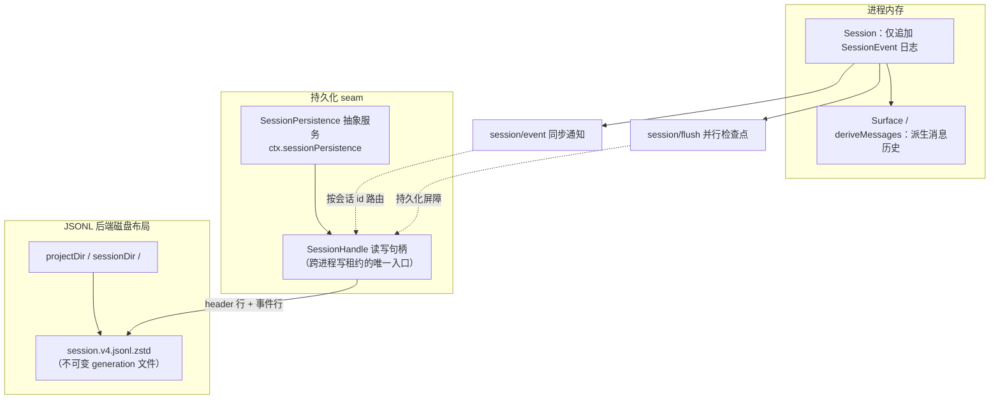
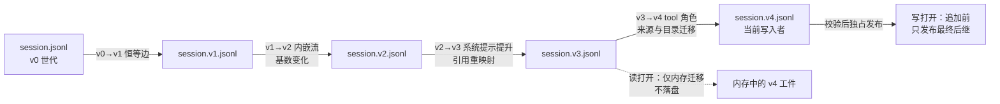

本页解释 DeepSeek Harness 中“会话”这一子系统的两条主线：其一是**内存中的事件溯源模型**——`Session` 是一个仅追加的 `SessionEvent` 日志，是智能体全部交互历史的唯一真源；其二是**磁盘上的持久化机制**——`SessionPersistence` seam 与随产品交付的 JSONL 后端，以及支撑历史数据长期可读的**格式版本演进体系**（v0→v4 的静态迁移链）。本页面向已了解插件框架基本概念的读者，聚焦可验证的结构与不变量，不重复 Agent Loop 与事件域的内容。

Sources: [session.md](docs/subsystems/session.md#L1-L5)

## 核心原则：日志即真源，历史即投影

DeepSeek Harness 的会话设计遵循严格的事件溯源：`Session` 内部只维护一个**仅追加**的类型化事件数组，LLM 的消息历史是从该日志**派生**出来的，从不单独存储。崩溃后重放整个日志，即可无损重建对话状态——包括每一个模型请求的完整装配（调用配置、工具 schema）与每一次助手回复的原始流式记录。这一原则带来三个直接推论：事件数据必须是无损 JSON（任何不可序列化的值在追加点即被拒绝）；序列号必须连续无空洞（`seq = log.length`）；持久化后端只需存储“header + 事件行”两种物理记录即可完备。

Sources: [session.md](docs/subsystems/session.md#L3-L5)

Sources: [persistence.md](docs/subsystems/persistence.md#L1-L5)

## 会话模型：SessionEvent 信封与事件词汇表

每条日志条目是一个 `SessionEvent`——在 `type` 字段上的**正规可辨识联合**（而非独立的 `type`/`data` 联合），因此 `switch (event.type)` 可以无类型断言地收窄 `event.data`。信封只携带四个核心字段：`type`、单调递增的 `seq`（品牌化类型 `SessionSeq`）、纪元毫秒 `time`、以及事件负载 `data`。序列号体系由三个品牌化数字类型构成：`SessionSeq` 表示已存在事件的位置，`SessionLogOffset` 表示日志缺口或前缀长度（可以等于事件数），两者都只接受非负安全整数并拒绝负零。

Sources: [types.ts](packages/core/session/src/types.ts#L19-L65)

词汇表 `SessionEventMap` 通过**声明合并**对插件开放扩展——压缩子系统可添加 `compaction/start`、`compaction/summary`、`compaction/end`，钩子协议可添加纯日志型 `hook/invoked`、`hook/result`。核心词汇覆盖轮次与步骤边界（`turn/start`、`turn/end`、`step/start`、`step/end`）、五类表面消息（`user/message`、`developer/message`、`system/message`、`assistant/message`、`tool/result`）、失败尝试存证（`assistant/attempt`，内嵌完整原始流）、工具往返（`tool/call`、`tool/result`），以及请求装配快照（`request/header`、`request/context`）。其中 `request/header` 让“每一次对话请求都是日志的纯函数”成为可重建性不变量。

Sources: [session.md](docs/subsystems/session.md#L12-L30)

| 事件类别 | 代表事件 | 日志语义要点 |
|---|---|---|
| 轮次/步骤边界 | `turn/start`、`turn/end`、`step/start`、`step/end` | 空轮次可无 step；`turn/end` 携带 `TurnEndReason` |
| 表面消息 | `user/message`、`system/message`、`assistant/message`、`tool/result` | 必须携带 `surfaceOp` 声明如何进入派生表面 |
| 失败存证 | `assistant/attempt` | 内嵌 exact timed stream，不产生表面消息 |
| 工具往返 | `tool/call`、`tool/result` | `callId` 配对；`arguments` 保留模型原始 JSON 串 |
| 请求装配 | `request/header`、`request/context` | 最新 header 快照即可重建请求；context 仅在路由变化时追加 |
| 日志边界 | `session/end-seed` | fork 谱系切割标记，仅构造器与 `buildForkSeed` 可创建 |

Sources: [session.md](docs/subsystems/session.md#L12-L60)

表面事件必须声明**如何加入有序表面**：`surfaceOp: 'append'` 是常规尾部追加；`{ op: 'replace', startSeq, endSeq }` 则替换一个包含区间（压缩即用此机制），且必须通过 `sourceEventSeqs` 引用全部被遮蔽的表面节点。这一元数据由编译器在 `Session.append()` 调用点强制：非表面事件禁止携带表面字段，而 `assistant/message` 因内嵌自己的流式证据而禁止引用来源。未知词汇的兼容性由每事件可选的 `ignorable: true` 标记管理：读取方遇到未识别且**未标记** ignorable 的事件类型时必须拒绝重建会话，而不是静默丢弃——这正是“添加普通事件类型无需提升格式版本”的机制基础。

Sources: [session.md](docs/subsystems/session.md#L242-L310)

`Session.append()` 是日志的唯一写入口，提交前完成三重把关：对 `data` 与表面元数据做**无损 JSON 快照**（BigInt、函数、循环引用、稀疏数组等一律抛错）、运行请求数据校验（如 header 禁止已退役的 `system` 字段、空可选字段必须省略）、以及表面管理器的规范化校验（引用唯一性、替换区间合法性、被遮蔽节点完整覆盖）。错误在追加点失败而非延后到 flush——日志是持久真源，坏事件不能进入。追加成功后，事件经同步的 `session/event` 通知对外广播（观察者失败只记日志，不回滚提交），而 `session/flush` 则是调用方必须逐个 await 的**并行**持久化屏障。

Sources: [index.ts](packages/core/session/src/index.ts#L700-L778)

## 持久化 seam：SessionPersistence 服务与 SessionHandle

持久化被建模为一个**能力 seam**：抽象服务 `SessionPersistence`（挂载为 `ctx.sessionPersistence`）暴露四个寻址操作——`create`（新建并取写所有权）、`open(id, 'read' | 'write')`（原子认领单写者所有权）、`stat`/`list`（免读正文的轻量观察），外加一个服务级 `flush()` 聚合屏障。`stat`/`list` 返回的 `SessionPersistenceSnapshot` 携带不透明 `revision` 令牌，供派生读模型缓存比对，而无需加载完整日志。所有日志读写都经由每会话的 `SessionHandle` 流动，**绝不**通过按 id 寻址的服务方法——句柄是跨进程写租约把守的唯一门户。

Sources: [index.ts](packages/session/session-persistence/src/index.ts#L135-L201)

句柄是单所有者状态而非共享服务：写句柄是该会话唯一的变更者，读句柄永不取得所有权且可与写句柄并存。其操作语义构成一份严密的契约：

| 操作 | 语义 | 关键承诺 |
|---|---|---|
| `read(offset, length)` | 返回有效连续逻辑日志的切片 | 撕裂的物理尾部绝不返回；同句柄重复读取绝不观察到更旧状态 |
| `append(events)` | 追加连续批次，首事件 seq 必须等于存储侧下一序号 | 尽力而为持久化；已提交事件永不重写 |
| `flush()` | **持久化屏障** | 完成后所有已确认追加可幸免于崩溃；空会话在此刻实体化、可被其他进程列出 |
| `close()` | 幂等、不可取消的唯一拆除路径 | 写句柄完成待处理持久化并释放写所有权；后续操作以 `SessionHandleClosedError` 拒绝 |

Sources: [handle.ts](packages/session/session-persistence/src/handle.ts#L42-L118)

可见性规则同样明确：`create` 完成之刻会话即在本进程内可观察，但后端可把物理实体化推迟到首次 `append`/`flush`（纯优化）；其他进程只能看到已实体化的会话——崩溃前从未实体化的会话等于从未存在。错误类型族覆盖了全部失败方向：`SessionAlreadyExistsError`、`SessionAlreadyOwnedError`（写所有权被占）、`SessionReadOnlyError`、`SessionOwnershipLostError`、`SessionPersistenceCorruptionError` 与格式拒绝专用的 `SessionFormatUnsupportedError`。

Sources: [index.ts](packages/session/session-persistence/src/index.ts#L16-L37)

## JSONL 提供方：磁盘布局、写后窗口与崩溃恢复

随产品交付的 `@deepseek-ai/dsh-session-persistence-jsonl` 是该 seam 的参考实现。它的磁盘布局为 **根目录 → 项目目录 → 每会话目录 → 生成文件**：第一个物理记录是 `type: 'session'` 的 header 行（版本号、id、创建时间、cwd、谱系位、委托深度、agent preset），其后每行一个事件。header 行的校验是严格白名单式的——必需键缺失、出现未知键、`cwd` 非绝对路径都会被形状守卫拒绝；同时它显式拒绝历史上已退役的策略基线字段（`sandboxMode`、`approvalPolicy`）。值得注意的细节是：逻辑 header 只携带 `isSeeded` 谱系位，而 fork 继承的**精确切割长度**单独随正文存储（挂在最后一个带 `inherited: true` 标记的 `session/end-seed` 事件上），二者永不混入可回放的事件日志。

Sources: [format.ts](packages/session/session-persistence-jsonl/src/format.ts#L83-L157)

安全与编码层面有三个精心设计的机制。其一，`SessionId` 是未经校验的品牌化字符串，因此在进入文件系统前必须经过 `encodeSegment`——一个在全部 JS UTF-16 字符串（含孤立代理项）上单射的路径段编码，中和 `../`、绝对路径、NUL 与分隔符。其二，物理编码默认是**带校验和的 Zstandard 帧**（可配置为明文），且第一个独立可解码的帧必须恰好只包含 header 行。其三，格式文件名由 `sessionFormatLogFilename` 规范化：版本零保留原始的 `session.jsonl`，其后每个世代携带小写数字分量 `session.vN.jsonl`——非规范、临时、大写、前导零命名一律不认定为已提交世代。

Sources: [format.ts](packages/session/session-persistence-jsonl/src/format.ts#L1-L9)

写路径是**有界写后窗口**设计：`session/event` 是同步通知，后端按会话 id 将其路由进活跃写句柄的缓冲区而不阻塞生产方（监听器只安装一次，因为持久化已保证每 id 只有一个活跃写句柄），每批最多等待 `LIVE_WRITE_BATCH_MAX_DELAY_MS = 200` 毫秒即开始落盘；句柄内部用单 promise 链串行化全部变更，路由事件与显式 `append` 走同一条链。跨进程互斥由工件目录内的 `SessionWriteLease` 写锁保证。

Sources: [storage.ts](packages/session/session-persistence-jsonl/src/storage.ts#L535-L548)

崩溃恢复策略刻意**保留被中断的轮次**而非截断修复：以打开的 `turn/start` 结尾且无 `turn/end` 的日志不做修剪——长周期任务中单个轮次可能极其庞大，且这些事件在崩溃前已被持久追加。扫描器逐行解析并维护 `committedBytes` 游标：末尾无换行的不完整记录被识别为撕裂尾部，读取方永不返回它，而写路径在首次追加前先截断到安全偏移；由撕裂 Zstd 帧恢复出的完整事件由首次变更重写落盘。行级校验的失败方向经过精确排序——当前格式的结构性拒绝（`assertV4RowAdmission`）**先于**可恢复尾部的抑制执行，保证“本构建拒绝解读”与“物理尾部撕裂”两种故障不会被混淆。与之配套，`session-checkpoint-policy` 插件在三个语义屏障处强制 flush：模型请求构造前、顶层工具执行前、下一步开始前，使“崩溃在已记录的工具调用与结果之间”不再丢失已派发的副作用意图（恢复时补一条 `TOOL_OUTCOME_UNKNOWN` 结果）。

Sources: [persistence.md](docs/subsystems/persistence.md#L104-L120)

## 格式版本演进：静态迁移链与流式 Stage

格式版本由代码常量 `SESSION_FORMAT_VERSION = 4` 唯一拥有（当前 checkout 的写入者）。版本提升的判定规则写在常量文档里：**提升与否取决于写入者发射什么，而非读取者能接受什么**——只有 header 形状、事件信封、核心事件语义或表面机制的结构性变化才触发 bump；添加普通事件类型不 bump，由 `ignorable` 标记承担词汇增长。“宁可多 bump”被明确写成默认取向：近似恒等的升级步骤几乎免费，而错失一次 bump 会让旧运行时静默地读错新日志。

Sources: [types.ts](packages/core/session/src/types.ts#L67-L89)

读取侧的格式翻译由**构建期静态组装**的目录完成：`dsh-session-format-catalog` 在模块初始化时从各相邻迁移包装配编解码器与迁移边，校验从零到当前写入者的完整无缺口链条，并暴露物理分发、仅 header 分类、单遍行恢复与当前记录编码。运行时若存储日志的版本高于本构建写入者，链条规划器直接拒绝：“存储会话使用更新的格式，本构建只写 v4”。这套设计与文件名中的世代号共同构成**世代不可变**模型：历史 generation 文件永不改写，写打开在追加前必须校验并只发布最终的当前世代后继，而读打开可以在内存中返回已迁移工件而不落盘；源文件路径、字节与 inode 保持原样。

Sources: [chain.ts](packages/session/session-format/src/chain.ts#L52-L94)

| 迁移边 | 包 | 转换摘要 |
|---|---|---|
| v0→v1 | `session-format-v0-to-v1` | 冻结的 v0 行解码 + 恒等转换，仅应用 v0 持久化接受的有限遗留规范化 |
| v1→v2 | `session-format-v1-to-v2` | **改变基数**：把顶层 `assistant/chunk` 事件内嵌进 `assistant/message` 的 exact timed stream，失败尝试记为 `assistant/attempt`，稠密重映射全部序号引用 |
| v2→v3 | `session-format-v2-to-v3` | 系统提示提升为消息、本地事件引用重映射、PTC 与 preset 名称翻译、信封规范化 |
| v3→v4 | `session-format-v3-to-v4` | 工具结果提升为 `tool` 角色、生产者来源改名映射、父目录（subagent catalog）证据补齐、中断轮次闭合、被审计引用的稠密重编号 |

Sources: [v3-to-v4 README](packages/session/session-format-v3-to-v4/README.md#L5-L12)

Sources: [session-format-catalog README](packages/session/session-format-catalog/README.md#L9-L11)

迁移 API 本身经历了一次由真实故障驱动的重构：最早的整工件实现曾把一个 116 MB 的真实会话变成耗尽 16 GB Node 进程的操作——逐帧异步解压、全量物化、每边深快照、以及打包助手块展开出的约 914 万个逻辑事件同时驻留内存。现在的协议是**有状态同步 Stage**：`SessionFormatMigration` 是不可变声明（相邻版本号、header 迁移、目标校验、`createStage`），每个恢复工件获得独立的 `SessionFormatMigrationStage`，通过 `transformEvent`/`transformRun` 同步发射零到多个输出，`finish()` 按源到目标顺序结算尾部；编译链把各阶段用上下文对象反向连接，紧凑运行直接以可迭代形式穿过链条而不展开中间数组。 Adjacent 校验在 `defineSessionFormatMigration` 中强制：`toVersion` 必须恰好等于 `fromVersion + 1`。

Sources: [released-session-format-migrations.md](.agents/notes/implemented/architecture/2026-08-31-released-session-format-migrations.md#L45-L77)

## 兼容性治理：变更记录、基线与发布状态

格式演进不只是代码问题，更是一套**记录与校验的治理体系**。`docs/persistence-changes/` 中每条被确认的持久化类型变更由四个同名文件构成（英文确认书、中文对偶、生成的双语一致性记录、受影响根的完整 after schema 快照），后续记录以上一条记录的 after schema 作为自己的 before schema。每一个被检测到的结构变化都要求一条确认记录，且最小决策由固定规则推导：

| 检测到的变化 | 最小决策 |
|---|---|
| 添加可选事件体属性（含完整子树） | `same-version` |
| 把必需属性改为可选 | `same-version` |
| 添加普通事件类型 | `same-version` |
| 为普通事件添加更高数值 `data.version` 载荷替代项（保留全部旧替代项） | `same-version` |
| 把可选属性改为必需、添加必需属性、更改既有类型、删除/重命名属性或事件 | `version-bump` |
| 更改 Session header 或事件信封 | `version-bump` |

Sources: [README.md](docs/persistence-changes/README.md#L39-L47)

版本状态由三个**分离的事实源**回答：“写入者是谁”看代码常量；“已接受的兼容基线是什么”看终局化记录（当前 `latestFinalizedVersion: 4`，检查点在 `finalized/v4.json`，V4 内的向后兼容添加仍可通过新确认记录演进）；“最新已发布格式是什么”看发布记录（当前 `latestReleasedVersion: 3`，证据标签 `dsh-v0.1.5-alpha.1`）。写入者版本高于已记录发布版本是常态——意味着该写入格式尚未发布。历史格式本身也有完整的可检阅索引：从 v0 到当前写入者，每个整数格式都有双语参考文档与完整 schema 快照（v3 为 60 根/467 类型，v4 为 62 根/587 类型）。

Sources: [session-format-status.md](docs/session-format-status.md#L12-L39)

拒绝语义与治理体系闭环：后端用 `SessionFormatUnsupportedError` 拒绝无法可靠解读的日志——它与损坏错误严格区分，因为数据并没有坏；`stat` 与 `list` 会对最高规范世代分类，在不读取或改动正文的前提下翻译受支持的历史 header。为了让用户能定位被拒绝的原始日志，拒绝诊断携带 `SessionLocation`（JSONL 后端给出项目/会话目录内 transcript 的绝对路径），但它是唯一的诊断出口——日志访问本身仍然只走句柄 `read`。对存量数据的实际迁移则由一次性脚本承担（`pnpm run migrate:sessions-to-v4`，支持并发、失败汇总与子目录证据的顺序重试）。

Sources: [persistence.md](docs/subsystems/persistence.md#L116-L146)

## 小结与阅读路径

把三块内容合起来看：**事件溯源的内存模型**保证了“回放即重建”的语义完备性；**句柄化的持久化 seam** 把多进程单写者、尽力追加加显式屏障的存储契约与后端实现解耦；**静态迁移链加治理记录**则让已发布的用户数据在结构性变更面前长期可读。三者共享同一条设计主线——错误尽早失败（追加点校验、fail-closed 词汇检查）、状态只增不改（仅追加日志、不可变世代）、以及把不确定性显式化（`ignorable` 标记、`TOOL_OUTCOME_UNKNOWN`、发布/基线/写入者三源分离）。

Sources: [session.md](docs/subsystems/session.md#L1-L5)

若要继续深入，建议按以下路径阅读：向上理解日志如何被消费，请看 [事件域与扩展点：会话事件、agent/* 实时事件与能力事件的选择原则](12-shi-jian-yu-yu-kuo-zhan-dian-hui-hua-shi-jian-agent-shi-shi-shi-jian-yu-neng-li-shi-jian-de-xuan-ze-yuan-ze) 与 [能力 Seams 与核心服务全景](13-neng-li-seams-yu-he-xin-fu-wu-quan-jing-ke-ti-huan-fu-wu-de-ti-gong-fang-yu-xiao-fei-fang-guan-xi-tu)；横向对照另一个持久化子系统（非会话日志的键值域），请看 [总体架构：插件树、核心包职责与 ctx 服务键位图](9-zong-ti-jia-gou-cha-jian-shu-he-xin-bao-zhi-ze-yu-ctx-fu-wu-jian-wei-tu)；实践层面，录制会话的快照回放与迁移工具链在 [快照测试与录制会话](27-kuai-zhao-ce-shi-yu-lu-zhi-hui-hua-session-sdk-acp-web-kuai-zhao-de-zu-zhi-yu-hui-fang) 中展开；下一步进入工具与模型边界，请转向 [工具系统与执行流水线](16-gong-ju-xi-tong-yu-zhi-xing-liu-shui-xian-tooldefinition-schema-dsl-yu-pre-execute-post-ba-guan-shi-jian)。