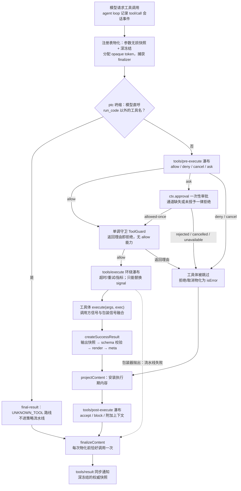

本页解释 DeepSeek Harness 的工具中枢：`@deepseek-ai/dsh-tools` 如何用一个 `ToolDefinition` 类型描述工具、用一套统一的 schema DSL 同时驱动类型推断与运行时校验、以及一次工具调用如何穿过 `tools/pre-execute` → 单调守卫 → `tools/execute` → 工具体 → `tools/post-execute` → `finalizeContent` → `tools/result` 这条把关事件流水线。读完本页，你应当能回答三个问题：一个工具由哪些字段构成、模型的参数与工具的返回值分别在哪个边界被校验、以及策略插件（审批、钩子、沙箱）在哪里介入而不必修改工具本身。

Sources: [index.ts](packages/core/tools/src/index.ts#L1-L5) · [tool-execution-pipeline.md](docs/tool-execution-pipeline.md#L1-L66)

## 全景：注册表与六阶段流水线

`dsh-tools` 挂载后提供 `ctx.tools` —— 一个同时承担**注册表**（工具可见性的单一事实源）和**执行器**（调用分发流水线）双重职责的 Cordis 服务。注册一个工具就足以让它可见：注册表会自动把 schema 送入系统提示词组装，而 agent loop 则把每一次模型请求的工具调用分发进来。流水线由若干 Cordis **瀑布（waterfall）事件**串联——如果你还不熟悉 `waterfall` 的 `next()` 委托语义，先参阅 [Cordis 分发模式与瀑布语义](6-cordis-fen-fa-mo-shi-yu-pu-bu-yu-yi-emit-waterfall-parallel-serial-bail-de-xie-zuo-shi-zhong-jian-jian)，本页所有"把关事件"都建立在那套协作式中间件机制之上。

下面的流程图给出一次调用的完整路径（前提：瀑布事件是可被多个插件监听并依次短路的事件链；菱形是注册表内部的判定点）：



图中有两个容易忽略的细节：其一，**拒绝也是一种"结果"而非异常**——策略拒绝与审批未通过走 `post-result` 路径，仍会经过 `projectContent` 与 `tools/post-execute`，只有真正的流水线失败（包装器抛出、参数非法）才走 `final-result` 快捷路径直接跳到 `finalizeContent`；其二，`tools/result` 是唯一的**最终通知**，它发出的快照与 `execute()` 返回值是同一个对象，观察者无法再改变结局。

Sources: [index.ts](packages/core/tools/src/index.ts#L1369-L1371) · [tool-execution-pipeline.md](docs/tool-execution-pipeline.md#L17-L66)

## ToolDefinition：一个工具的完整解剖

`ToolDefinition` 继承自 `ToolSchema`——后者在 `@deepseek-ai/dsh-llm` 中声明（因为它是模型请求 `GenerateOptions.tools` 的线格式），只含三个模型可见字段：`name`、`description`、`parameters`（外加 `deferLoading` 注解）。`ToolDefinition` 在此之上叠加执行侧的全部契约，其中 `output` 是**强制性**的：每个工具必须声明其规范输出 schema 与纯函数渲染器。这套拆分让"模型看到什么"与"进程里怎么执行"成为两个可独立投影的面。

| 字段 | 模型可见？ | 作用 |
|---|---|---|
| `name` / `description` / `parameters`（继承 `ToolSchema`） | 是 | 模型请求中的工具声明；`schemas()` 只投影这三个字段 |
| `output.schema` | 否* | 强制性的规范输出契约；每个成功返回值都要通过它校验（*仅在 PTC 模式的生成 SDK 中暴露） |
| `output.render(args, value)` | 否 | 纯函数：把已校验的规范值投影成 `ContentBlock[]` 模型内容 |
| `output.presentationMeta(args, value)` | 否 | 可回放的 UI 元数据，持久化在 `tool/result` 的 `meta` 上，仅供顶层调用计算 |
| `execute(args, exec)` | 否 | 工具体：只返回规范 JSON 值；异步工作必须观察 `exec.signal` |
| `projectContent(exec, result)` | 否 | 可选：在 `tools/post-execute` 之前安装执行期间准备的图文内容；策略替换仍优先 |
| `finalizeContent(exec, result)` | 否 | 可选：物化前最后一次内容变换，包括绕过 post-execute 的流水线失败也会调用它 |
| `timeoutMs` | 否 | 协作式超时预算（毫秒），由 `tools/execute` 包装器执行，永不发给模型 |
| `isConcurrencySafe(args)` | 否 | 纯同步分类器：返回 `true` 才允许与兄弟调用并行（fail-closed） |
| `presentCall` / `presentResult` | 否 | 纯函数 UI 卡片渲染意图（下文专述） |

Sources: [types.ts](packages/llm/llm/src/types.ts#L466-L484) · [index.ts](packages/core/tools/src/index.ts#L212-L314)

第一方工具不直接手写这个接口，而是通过 `defineTool` 获得类型化包装。注册时注册表只"借用"你的 readonly 定义——这不是序列化边界，注册后不得再变更 schema 或回调；注册会校验 `output` 结构、原始 schema 与 `timeoutMs` 为正有限数，并拒绝保留名 `run_code`（它是 PTC 呈现模式的传输工具，任何作用域都不得注册或遮蔽）。重复注册同一名字会直接抛错，错误信息会提示你应改用目标 agent 的 `agent.ctx` 注册按 agent 的变体。

Sources: [index.ts](packages/core/tools/src/index.ts#L1063-L1088) · [schema.ts](packages/core/tools/src/schema.ts#L547-L556)

## 统一 schema DSL：从 ValueSchemaSpec 到受控 JSON Schema

参数与输出共用一套**作者侧词汇表** `ValueSchemaSpec`：九种节点覆盖 `string`、`number`、`integer`、`boolean`、`null`、`array`、`object`、作者专属的 `json` 与恰好匹配一个分支的 `oneOf`。标量节点上的 `enum`/`const` 字面量必须与节点类型一致，这使编译期类型推断能收窄到字面量联合。参数根是一个**隐式开放对象**：`ParameterSchemaSpec` 的每个属性自带可选的 `required: true` 注解，而不是套一层显式的 object 节点；显式 object 节点则强制作者声明 `additionalProperties`，避免嵌套对象意外继承 JSON Schema 的开放默认。

| DSL 节点 | `type` / `oneOf` | `InferValue` 推断 | 备注 |
|---|---|---|---|
| `StringValueSchemaSpec` | `'string'` | `string` 或 `const`/`enum` 字面量 | 字面量必须匹配节点类型 |
| `NumberValueSchemaSpec` | `'number'` | `number` 或字面量 | 有限 JSON 数字 |
| `IntegerValueSchemaSpec` | `'integer'` | `number` 或字面量 | |
| `BooleanValueSchemaSpec` | `'boolean'` | `boolean` 或字面量 | |
| `NullValueSchemaSpec` | `'null'` | `null` | |
| `ArrayValueSchemaSpec` | `'array'` | 按 `items` 推断的数组 | 省略 `items` 接受任意 JSON 项 |
| `ObjectValueSchemaSpec` | `'object'` | 按 `properties` 与开放性推断 | `additionalProperties` 必填 |
| `JsonValueSchemaSpec` | `'json'`（仅作者侧） | `JsonValue` | 编译为仅含注解的无约束 schema |
| `OneOfValueSchemaSpec` | `oneOf` | 分支联合类型 | 至少两个分支 |

Sources: [schema.ts](packages/core/tools/src/schema.ts#L84-L106) · [schema.ts](packages/core/tools/src/schema.ts#L143-L175)

类型推断 `InferValue<S>` 在 **16 层容器深度**内保持精确（逐层展开字面量约束、数组与对象），超过后回宽为 `JsonValue` 而不是耗尽编译器。`defineTool` 把参数推断绑到 `parameterSchemaSpecToJsonSchema()` 编译产物上：`execute` 收到的 `args` 自动具备 `InferArgs<S>` 类型，`execute` 的返回值、`render` 与 `presentationMeta` 的 `value` 参数则绑到 `InferValue<OutputSchema>`。编译器本身是**栈安全的迭代任务图**而非递归下降，并检测循环引用——一个自我引用的 schema 会在注册时报"circular"而不是耗尽调用栈。

Sources: [schema.ts](packages/core/tools/src/schema.ts#L168-L175) · [schema.ts](packages/core/tools/src/schema.ts#L274-L330) · [schema.ts](packages/core/tools/src/schema.ts#L438-L458)

DSL 编译的目标是**受控 JSON Schema 子集** `JsonSchemaNode`：单一标量 `type`、对象 `properties`/`required`/布尔 `additionalProperties`、数组 `items`、类型正确的 `enum`/`const` 与 `oneOf`，其余一律注解。不支持的关键词会**拒绝**而不是静默放行——`assertSupportedJsonSchema()` 在注册边界拒绝畸形组合，`validateJsonSchemaValue()` 在运行时强制执行并按路径报告违规。这个子集同样服务于子代理、workflow、MCP 与动态注册提交的原始线格式 schema，是全仓库共享的信任边界。

Sources: [json-schema.ts](packages/core/tools/src/json-schema.ts#L1-L59) · [json-schema.ts](packages/core/tools/src/json-schema.ts#L385-L385) · [json-schema.ts](packages/core/tools/src/json-schema.ts#L654-L654)

`defineTool` 对**执行路径强校验、对展示路径软校验**：`execute` 的参数违规抛 `ToolArgsError`（附逐条路径化违规信息）；而 `presentCall`/`presentResult` 可能在历史日志回放中被调用于过期参数，包装器校验失败时返回 `undefined`（回退到通用卡片）而不是抛错——展示永远不能让回放崩溃。

Sources: [schema.ts](packages/core/tools/src/schema.ts#L461-L480) · [schema.ts](packages/core/tools/src/schema.ts#L597-L633)

## 注册、作用域与呈现模式

`ctx.tools` 的可见性解析遵循 Cordis 作用域层模型。`view(scope)` 在一次层遍历中推导出完整的注册表视图：先按"最远祖先优先"合并继承面（全局层是链上最远的一层），对继承面应用**取交集的限制**，最后叠加作用域**自有注册**——自有注册豁免于限制，也遮蔽同名继承项。这个豁免是刻意的：委派运行时把子代理的结构化输出工具注册进子代理自己的层，父层的能力过滤不得剥掉子代理赖以应答的机制。

Sources: [index.ts](packages/core/tools/src/index.ts#L1178-L1219)

对调用方的 API 是四个注册类方法加三个查询类方法：`register()` 注册工具并触发 `tools/change` 通知；`restrict({ allow, deny })` 为当前作用域编译继承面掩码（空过滤器、未知名字、作用域自有名字、保留传输名都会失败）；`guard()` 注册单调守卫并显式 `notify: false`——守卫不改变可用工具集，因此不触发 `tools/change`；`presentAs(mode)` 为当前作用域声明呈现模式（仅限作用域，全局覆盖是配置字段 `mode`）。查询侧，`get(name, scope)` 按作用域视角解析、`schemas(scope)` 深克隆出模型可见投影、`executionMode(exec)` 做 fail-closed 的并行分类（只有精确的 `true` 才并行，未知、隐藏、抛错一律独占）。

Sources: [index.ts](packages/core/tools/src/index.ts#L1097-L1142) · [index.ts](packages/core/tools/src/index.ts#L1230-L1312)

呈现模式 `ToolPresentationMode`（`native` / `ptc` / `both`）决定模型**看到什么**：`native` 发送每个可见 schema；`ptc` 只发送保留的 `run_code` 传输工具外加一份按作用域生成的 SDK 提示词段；`both` 两者都发。模式按作用域链**就近解析**（`modeFor`），因此一个 agent preset 的常设声明会覆盖其下所有 agent。模式不只是呈现——它同时约束执行器：`collapses()` 谓词规定在 `ptc` 模式下，模型直呼 `run_code` 以外名字的调用在进入策略流水线**之前**就被确定性拒绝（错误信息会指路"请改在 `run_code` 程序内调用"），确保提示词宣告的规则与执行器强制执行的规则永远一致。PTC 运行时本身（TypeScript/Python SDK 渲染、子分发调度）是独立子系统，详见 `docs/subsystems/ptc-runtime.md`。

Sources: [index.ts](packages/core/tools/src/index.ts#L922-L1002) · [index.ts](packages/core/tools/src/index.ts#L1351-L1353) · [index.ts](packages/core/tools/src/index.ts#L1400-L1474)

## 执行流水线逐段解析

### 预处理：参数物化与执行身份

`execute(input)` 接收调用方提供的 `ToolExecutionInput`（必填的 `callId`、`name`、`arguments` 与调用方自有的 `AbortSignal`），第一步在 `createExecution` 中完成三件事：把参数经一次递归 `snapshotJsonValue` **无损物化**并 `deepFreeze`（此后策略与工具体看到的是同一份不可变快照）；分配注册表自有的 opaque `ToolExecutionToken`（symbol，仅用于身份比较，嵌套调用只能拿到它作为 `parent`）；以及在参数物化**之前**捕获 `finalizeContent`/`projectContent` 回调——契约规定 finalizer 在调用开始时快照，避免参数 getter 在物化中途偷换回调。任何非无损 JSON 的参数在此直接落为错误结果。

Sources: [index.ts](packages/core/tools/src/index.ts#L316-L352) · [index.ts](packages/core/tools/src/index.ts#L1391-L1481)

### tools/pre-execute：可扩展的 allow/deny/cancel/ask 策略

通过检查后，调用进入第一个把关事件 `tools/pre-execute` 瀑布。监听器收到 `(exec, next)` 并返回一个 `PreToolDecision`；`next()` 委托"放行"。钩子桥（Claude Code/Codex 的 PreToolUse）、权限门与沙箱策略都在这个瀑布上运行，且分发是**作用域过滤**的——agent 级监听器只看到自己 agent 的调用。输入重写被刻意排除：参数此刻早已记录并呈现，重写会造成审计分裂。

| 决策 | 语义 |
|---|---|
| `{ kind: 'allow' }` | 放行，交给单调守卫阶段 |
| `{ kind: 'deny', reason, info? }` | 跳过工具体；`reason` 物化为模型可见错误，`info` 携带结构化错误身份 |
| `{ kind: 'cancel' }` | 选择规范取消结果，不呈现策略拒绝 |
| `{ kind: 'ask', reason?, displayReason? }` | 交审批 seam 解析；仅 `allowed-once` 放行 |

Sources: [index.ts](packages/core/tools/src/index.ts#L1493-L1539) · [index.ts](packages/core/tools/src/index.ts#L596-L611)

`ask` 决策经 `serviceAsk` 消费可选的 `ctx.approval` seam：审批服务缺失、调用没有所属 agent（无处审计、无处路由 UI）、或审批返回 `rejected`/`cancelled`/`unavailable`，一律**降级为拒绝**——且三种非授予各有独立的拒绝理由，让模型能区分"人说不行"与"没有审批通道"。只有 `allowed-once` 映射为放行。注册审批服务的提供方与消费方关系，参见 [能力 Seams 与核心服务全景](13-neng-li-seams-yu-he-xin-fu-wu-quan-jing-ke-ti-huan-fu-wu-de-ti-gong-fang-yu-xiao-fei-fang-guan-xi-tu) 与 `docs/subsystems/approval.md`。

Sources: [index.ts](packages/core/tools/src/index.ts#L1727-L1768)

### 单调守卫：不可逆转的最终策略

守卫阶段在所有可扩展 pre-execute 监听器之后运行。`ToolGuard` 是一个同步函数 `(exec) => string | undefined`，其返回类型**刻意没有 allow**：`undefined` 表示"维持瀑布结论"，返回理由只能**降低**权限。因为守卫排列顺序无法把已发生的拒绝改回允许，必须不可重排的所有者策略（例如权限系统的硬边界）作为守卫注册就获得了排序免疫力。`guardReason` 先查全局层，再沿 agent 作用域链逐层查找第一个拒绝。

Sources: [index.ts](packages/core/tools/src/index.ts#L723-L731) · [index.ts](packages/core/tools/src/index.ts#L1144-L1154)

### tools/execute：环绕分发与信号融合

放行后进入 `tools/execute` 环绕（around）瀑布——超时、重试与指标等"包裹工具体"的关注点在这里实现（`timeoutMs` 的实际执行者 `dsh-tool-call-timeout-policy` 就是一个这样的包装器）。包装器可以调用 `next()` 进入工具体并拿到规范化结果，但对 `exec` 只能替换 `signal`，调用身份不可变。为防止替换信号**脱离**调用方取消，注册表在真正分发工具体前用 `fuseToolSignals` 把原始调用方信号与包装器信号重新融合：任一触发即中止，工具体沉降后再拆解清理。

Sources: [index.ts](packages/core/tools/src/index.ts#L1564-L1592) · [index.ts](packages/core/tools/src/index.ts#L156-L164)

### 工具体执行与规范输出

工具体解析使用 `resolveExecution`（在 `get` 之上再应用坍缩判定），不可见工具报 `UNKNOWN_TOOL`。返回值进入 `createSuccessResult` 的四步规范化：快照为无损 JSON → 对 `output.schema` 校验（违规抛 `ToolOutputError`）→ 冻结 → 交给纯函数 `output.render` 生成模型内容；顶层调用再计算 `presentationMeta`。**任何一步失败都变成 `isError` 结果**而不是异常外泄——工具抛错、渲染抛错、meta 非 JSON，最终都收敛为调用方拿到的规范化失败。成功结果上还会带上 `deferContext` 收集的附加上下文与 `concludeTurn` 终结标记（二者都只存在于成功分支，组合工具的嵌套结果转发遵循同一通道）。

Sources: [index.ts](packages/core/tools/src/index.ts#L1832-L1862) · [index.ts](packages/core/tools/src/index.ts#L418-L435)

### tools/post-execute：接受、替换或阻止

第二个把关事件 `tools/post-execute` 瀑布审视规范化后的结果。`PostToolDecision` 的三种走向：`accept { content? }` 替换模型可见内容但保留规范 value；`accept { value }` 替换规范 value（重新过 `output.schema` 校验并重算 content/meta，且不得替换失败结果的 value）；`block { feedback }` 把成功结果翻转为 `isError`，`feedback` 成为给模型的纠正反馈。任一决策可附 `additionalContexts`，它们与工具体 `deferContext` 的上下文一起，由 agent loop 按**活动批次 FIFO** 在已记录的工具结果之后注入为 user/message——下一请求可见，但不打断当前轮次。

Sources: [index.ts](packages/core/tools/src/index.ts#L1770-L1820) · [index.ts](packages/core/tools/src/index.ts#L613-L620)

### finalizeContent 与 tools/result：权威终态

最后，`finishScheduledExecution` 物化候选结果，调用快照过的 `finalizeContent`（**恰好一次**，对每个规范化结局——包括绕过 post-execute 的流水线失败），再次物化，然后冻结整个 `exec` 与结果对象并同步发出 `tools/result`。观察者的失败被彻底隔离：同步抛出或返回的 rejected promise 只产生一条日志警告，不影响任何人的结局。返回给 `execute()` 调用方的就是这个深冻结快照，`tool/result` 会话事件随后由 agent loop 记录为唯一的模型可见结局。

Sources: [index.ts](packages/core/tools/src/index.ts#L1669-L1714)

## 取消语义：两种 ABORTED 的分界

取消在流水线里有精确的阶段语义，判定依据是注册表在包装器视图**之外**维护的 `bodyInvoked` 状态：

| 取消时机 | 判定 | 结果 |
|---|---|---|
| 进入流水线后、分发前 | `bodyInvoked === false` | `ABORTED_BEFORE_DISPATCH`：未启动的工具体被跳过 |
| 工具体已启动但调用方信号中止 | `bodyInvoked === true` | `ABORTED`：替换一个成功的结局；**已启动的工作不被抛弃**，会被排干到静止，且可能保留工具自有的结构化错误 |
| 审批等待中调用方中止 | caller signal aborted + 审批报告取消 | 走 post-execute 路径的取消结果 |

工具作者的义务与此对齐：异步工作必须观察或转发 `exec.signal`，并在自己拥有的工作静止后才沉降 promise——注册表不抛弃你的 promise，但也无法硬杀同进程代码。若工具声明了 `timeoutMs`，即是断言它会把信号转发给一个可在中止时静止的协作式实现。

Sources: [index.ts](packages/core/tools/src/index.ts#L1355-L1364) · [index.ts](packages/core/tools/src/index.ts#L1549-L1557)

## 不变量与调度 seam：流水线如何被监督

流水线自身的结构由包内附带的**不变量伴生插件**监督：它监听内部分发，强制每个执行只能按 `pre → execute → post` 的单调顺序穿过瀑布（重复进入 pre、跳过 pre 直接 execute 都是失败），校验 `tools/result` 发布的快照必须已冻结且携带非空身份，并验证 PTC 子分发的封闭性（`rootCallId` 全程一致、`parentCallId` 归属于根、事件必须落在 open turn 之内）。这些检查让"流水线阶段不可重排、终态不可变"从注释升级为运行时可验证的事实。

Sources: [invariant.ts](packages/core/tools/src/invariant.ts#L15-L30) · [invariant.ts](packages/core/tools/src/invariant.ts#L85-L121)

调度侧，agent loop 不直接使用 `execute()`，而是经由 `TOOL_RUNTIME_SCHEDULER` symbol 暴露的内部 seam 把流水线拆成可编排的阶段：`prepare`（物化 + pre-execute + 守卫）、`dispatch`（环绕瀑布 + 工具体）、`finalize`/`finish`（post-execute / 直接终态）。loop 据此实现**滚动池并行**：先 `executionMode` 分类每个待定调用，`parallel` 的兄弟调用重叠执行，`exclusive` 的调用独自运行并形成排序屏障。这是调度策略与执行策略解耦的关键 seam——并行语义的完整约定在 [Agent Loop 与轮次生命周期](11-agent-loop-yu-lun-ci-sheng-ming-zhou-qi-turn-start-dao-turn-end-de-bu-zou-liu-yu-shi-jian-shi-xu) 展开。

Sources: [index.ts](packages/core/tools/src/index.ts#L440-L472) · [tool-calls.ts](packages/core/agent-loop/src/tool-calls.ts#L153-L205)

## UI 呈现词汇：card 渲染意图

`presentCall`/`presentResult` 返回**以 `card` 标记的渲染意图联合**——工具以传输中立的方式描述"我希望怎么被展示"，任何 UI 桥接对其 `switch`。硬规则只有两条：**纯函数**（它们会在直播流式与历史回放两种场景被调用，禁止 I/O、时钟与随机数）与**UI 专属格式不进模型结果**（fenced 代码块、diff、路径相对化属于 `presentationMeta` 与卡片，不属于规范值）。

| 视图 | 卡片类型 | 关键字段 | 典型工具 |
|---|---|---|---|
| `ToolCallView`（待执行） | `generic` | `title`、`kind?`（`read`/`edit`/`execute`/… 图标）、`locations?`（编辑器跟随的文件位置） | 无声明时的默认回退 |
| | `terminal` | `title`（命令）、`description?`、`cwd?` | tool-bash |
| | `diff` | `diffs: [{ path, oldText, newText }]`（新建文件 `oldText: null`） | tool-fs `write`/`edit` |
| `ToolResultView`（已完成） | `terminal` | `output?`、`exitCode?`、`signal?` | shell 工具（退出状态胶囊） |
| | `read` / `search` / `web` / `diff` | 由持久化的 `result.meta` 重建（行窗口、按文件分组的匹配、搜索来源等） | fs/web 工具 |

值得强调的分层：内置 Web Client 并不消费这两个方法，而是通过 `tool.call.toolview` 插槽从原始 `tool/call`/`tool/result` 事件与持久化 `meta` 派生组件 props——渲染意图词汇是给 Host 本地呈现方的可选加速路径，而非客户端的强依赖。给 UI 卡片补充结果期事实（如 diff、行窗口）的正确通道是 `output.presentationMeta`，它随 `tool/result` 持久化，回放可复现。

Sources: [presentation.ts](packages/core/tools/src/presentation.ts#L46-L46) · [presentation.ts](packages/core/tools/src/presentation.ts#L134-L140) · [adding-a-tool.md](docs/cookbook/adding-a-tool.md#L86-L100)

## 把关事件生态：谁在哪里介入

流水线的扩展点分工明确，策略插件各就各位而不必修改工具：

| 介入方 | 挂载点 | 职责 |
|---|---|---|
| 钩子桥（Claude Code / Codex PreToolUse→PostToolUse） | `tools/pre-execute` / `tools/post-execute` | 外部钩子协议映射为 allow/deny/ask 与结果改写 |
| 权限预设与审批 UI | `tools/pre-execute`（ask）+ `ctx.approval` | 一次性审批，缺失时降级拒绝 |
| 沙箱策略 | `tools/pre-execute` | 为调用解析沙箱后端与策略（详见 [沙箱与安全边界](18-sha-xiang-yu-an-quan-bian-jie-ce-lue-jie-xi-bwrap-landlock-seatbelt-hou-duan-yu-shen-pi-seam)） |
| 超时/重试/指标 | `tools/execute` | 环绕分发，只能替换 signal |
| 文件系统意图 | `fs/write-intent` / `fs/edit-intent` | 位于 `tool-fs` 之下，仅文件变更类工具触发 |
| PTC 子分发日志整形 | `tools/ptc-dispatch-log` | 只改持久日志副本（如超大结果的 spill 预览 + 定位符），程序已拿到完整值 |
| 结果观测 | `tools/result` | 只读终态；监听器失败被隔离 |

`tools/change` 则是可用工具集变化（注册、注销、限制变化）的**未过滤**注册表主题通知——刻意不做作用域过滤，因为全局变化关乎每个 agent 的下一次组装。

Sources: [tool-execution-pipeline.md](docs/tool-execution-pipeline.md#L60-L66) · [index.ts](packages/core/tools/src/index.ts#L177-L208) · [types.ts](packages/core/tools/src/types.ts#L26-L60)

## 把工具接进来：作者的最小闭环

把以上契约合到一个最小工具上：`defineTool` 校验参数、推断类型；`execute` 只返回规范值并尊重 `exec.signal`；`output.render` 生成模型内容；策略（审批、沙箱、超时）全部留给把关事件。注册即生效，dispose 即注销——工具的生命周期跟随注册它的 Cordis effect。完整的逐步教程（含后台作业、PTC 免费接入与验证要求）见扩展手册页 [扩展手册：添加工具、包、LLM 适配器、Remote API 与设置卡片](24-kuo-zhan-shou-ce-tian-jia-gong-ju-bao-llm-gua-pei-qi-remote-api-yu-she-zhi-qia-pian) 与 `docs/cookbook/adding-a-tool.md`。

```ts
ctx.tools.register(defineTool({
  name: 'read_file',
  description: 'Read a file from disk.',
  parameters: {
    path: { type: 'string', required: true, description: 'Absolute path' },
    limit: { type: 'number' },                     // 缺省即可选
  },
  output: {
    schema: { type: 'string' },
    render: (_args, value) => [{ type: 'text', text: value }],
  },
  async execute(args, exec) {
    // args 已按 schema 类型化；exec.signal 驱动协作式取消
    return readFile(args.path, { encoding: 'utf8', signal: exec.signal })
  },
}))
```

Sources: [adding-a-tool.md](docs/cookbook/adding-a-tool.md#L17-L47) · [adding-a-tool.md](docs/cookbook/adding-a-tool.md#L50-L82)

## 延伸阅读

- 上下游衔接：调用从哪里来、结果如何回到模型——[Agent Loop 与轮次生命周期](11-agent-loop-yu-lun-ci-sheng-ming-zhou-qi-turn-start-dao-turn-end-de-bu-zou-liu-yu-shi-jian-shi-xu)；工具 schema 如何进入模型请求——[LLM 适配与流式协议](17-llm-gua-pei-yu-liu-shi-xie-yi-message-contentblock-streamchunk-yu-gua-pei-qi-yue-ding)。
- 瀑布与事件的框架机制：[Cordis 入门](5-cordis-ru-men-cha-jian-shang-xia-wen-fu-wu-zhu-ru-lei-xing-hua-shi-jian-yu-ke-ni-fu-zuo-yong) 与 `tools/*` 事件在事件域中的定位——[事件域与扩展点](12-shi-jian-yu-yu-kuo-zhan-dian-hui-hua-shi-jian-agent-shi-shi-shi-jian-yu-neng-li-shi-jian-de-xuan-ze-yuan-ze)。
- 生成的参考目录：精确的工具 schema 与事件签名以 `docs/tool-catalog.md` 与 `docs/tool-execution-pipeline.md`（生成式 Mermaid 图，勿手改）为准，由 `scripts/gen-tool-catalog.ts` 与 `scripts/gen-doc-graphs.ts` 再生。