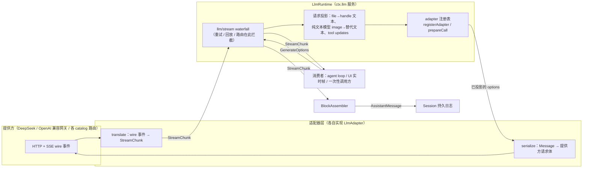
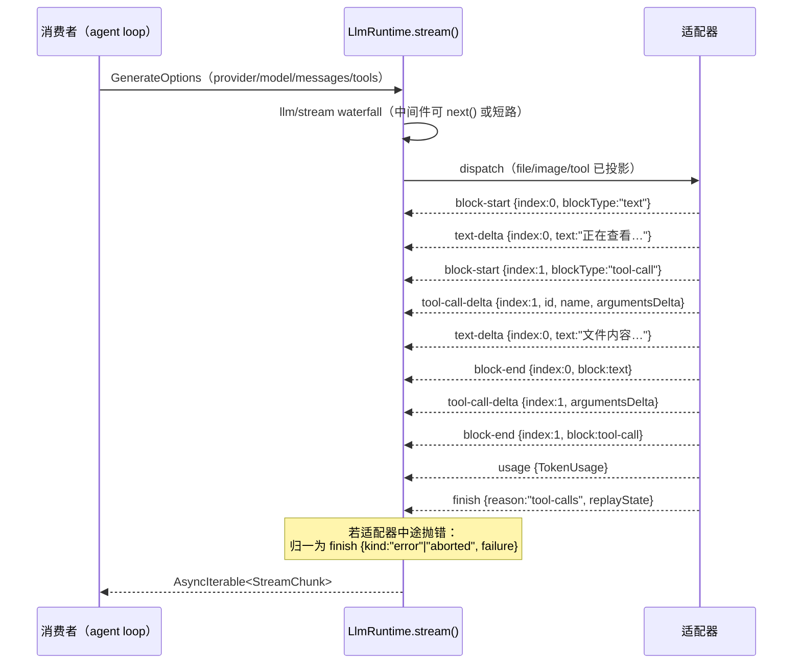

任何智能体框架最终都要回答一个问题：当接入第三个、第四个大模型提供方时，会话日志、UI 渲染、重试策略要重写多少遍？DeepSeek Harness 的答案是"零遍"——`packages/llm/llm` 定义了一套**提供方中立的规范词汇表**（provider-neutral vocabulary）：持久化的 `Message`、类型化的 `ContentBlock`、以及适配器输出的原始流协议 `StreamChunk`。适配器是唯一允许接触 wire 类型的地方，它们把提供方私有协议翻译进这套词汇表，而循环、会话日志和插件只认这套词汇表。本页自顶向下讲解这套协议的三个层次——消息与内容块、流式 chunk、适配器契约——并以仓库中两个结构迥异的真实适配器（直连 DeepSeek 与库背书的 pi-ai）作为对照。

Sources: [types.ts](packages/llm/llm/src/types.ts#L1-L5) [README.md](packages/llm/README.md#L19-L31)

## 词汇表的边界：谁在翻译什么

先建立全景再进入细节。下图是请求与响应两条路径上各组件的职责划分：**适配器向内翻译（入站响应 → StreamChunk），`LlmRuntime` 向外投影（出站请求先做路由无关的投影再交给适配器）**。`llm/stream` waterfall 是挂在 `LlmRuntime` 上的可拦截点，中间件可以调用 `next()` 放行到真实适配器，也可以自行产出 chunk 短路整个调用（重试、回放、路由都以此实现）。

前置说明：下图 mermaid `flowchart` 中，实线箭头表示数据/控制流方向；`GenerateOptions` 是完全组装好的模型请求，`StreamChunk` 是下文详解的流式协议。

这套词汇表采用 **merge-extensible map** 模式：核心联合类型是封闭的，但联合本身从 `ContentBlockMap`、`FinishReasonMap`、`MessageSourceMap` 这类接口映射中派生，插件可以向映射中添加新条目来扩展词汇，而消费方按 `switch` 处理已知条目、**落空（fall through）未知条目**即可保持前向兼容。

Sources: [index.ts](packages/llm/llm/src/index.ts#L57-L78) [types.ts](packages/llm/llm/src/types.ts#L132-L165)

## Message：带身份与来源的持久化对话单元

会话由 `Message` 组成，每条消息是"稳定 id + 角色 + 来源 + 内容块数组"的不可变值。角色映射 `MessageRoleMap` 是**封闭的**（system / developer / user / assistant / tool），注释给出了理由：每个模型可见的角色都必须同时拥有一个持久的 Session 事件和一个适配器投影，两者缺一不可，所以不存在开放扩展角色的空间。

来源映射 `MessageSourceMap` 则是**可扩展的**：`kind` 回答"这条消息是谁产出的"，model 来源必然携带 `AssistantProviderMetadata`——产出该消息的 provider 路由、模型 id，以及可选的 `replayState`（适配器私有的无损回放状态）。注意 `replayState` 的访问规则：`LlmRuntime` 只在**同一个适配器实例当前同时拥有历史 provider 和目标 provider** 时才把它交给适配器，否则剥离（见后文 `forAdapter`）。这意味着"回放元数据"是适配器的私有资产，共享的只有"存放位置"这一约定。

Sources: [message.ts](packages/llm/llm/src/message.ts#L110-L136) [message.ts](packages/llm/llm/src/message.ts#L9-L21) [message.ts](packages/llm/llm/src/message.ts#L138-L196)

### ContentBlock 词汇表

消息的 `content` 是内容块数组，联合类型从 `ContentBlockMap` 派生。七个核心块的语义如下表：

| 块类型 | 关键字段 | 语义与边界 |
|---|---|---|
| `text` | `text` | 用户可见的正文 |
| `reasoning` | `text` | 思考/推理内容，与可见正文**刻意区分** |
| `image` | `attachment`、`offloaded?` | 角色中立的持久图像引用；`offloaded` 表示已按确定性决策替换为占位文本 |
| `file` | `attachment` | 持久原样文件引用；**任何提供方都不会原生收到 file 块**，请求组装时一律投影为确定性 handle 文本 |
| `tool-call` | `id`、`name`、`arguments` | 模型发起的工具调用；`arguments` 保持模型产出的**原始 JSON 字符串** |
| `tool-addition` | `toolName` | developer 消息专用：激活历史请求头中声明过的某个工具 |
| `tool-removal` | `toolName` | developer 消息专用：按会话本地名字动态移除工具 |

Sources: [types.ts](packages/llm/llm/src/types.ts#L61-L130) [types.ts](packages/llm/llm/src/types.ts#L132-L150)

两个持久化引用块值得展开。`FileBlock` 的投影发生在 `LlmRuntime` 的适配器边界（见 `projectFilesToText`）：文件被替换为包含名字、字节大小、sha256 摘要前缀与只读保存路径的 handle 文本，而持久日志保留结构化引用供展示与授权使用。`ImageBlock` 则相反——图像**可以**原生进入请求，但纯文本模型的路由会将其替换为确定性占位文本（`textOnlyImageText`），`offloaded` 标记的块则发送命名图像与恢复路径的占位文本。

Sources: [content.ts](packages/llm/llm/src/content.ts#L143-L158) [index.ts](packages/llm/llm/src/index.ts#L1065-L1076)

## StreamChunk：适配器输出的原始流协议

一次流式响应会交错产出多个类型化块（正文、推理、多个工具调用）。`StreamChunk` 用 `index` 把每条 delta 绑定到所属块，并让 `block-end` 直接携带**已组装完成的 `ContentBlock`**——消费者不必自己重新拼 delta。这是适配器与框架之间唯一的流式契约，共七种 chunk：

| chunk `type` | 载荷 | 作用 |
|---|---|---|
| `block-start` | `index`、`blockType` | 声明一个新块开始 |
| `text-delta` | `index`、`text` | 正文增量片段 |
| `reasoning-delta` | `index`、`text` | 推理增量片段 |
| `tool-call-delta` | `index`、`id`、`name?`、`argumentsDelta` | 工具调用增量；`argumentsDelta` 是原始 JSON 片段 |
| `block-end` | `index`、`block` | 关闭块并携带权威的完整 `ContentBlock` |
| `usage` | `usage: TokenUsage` | 本次调用的 token 计量 |
| `finish` | `reason: FinishReason`、`replayState?` | 终止原因与可选回放信封 |

Sources: [types.ts](packages/llm/llm/src/types.ts#L444-L464)

协议的时序与所有权约定写在联合类型的文档注释里：适配器必须**先发 `usage`、再发 `finish`，之后不得再发任何 chunk**；工具参数端到端保持原始 JSON 字符串（解析过的提供方必须在 `block-end` 处重新字符串化）；适配器实现可以抛异常，但 `LlmRuntime.stream()` 会把抛出的失败**归一化为终态 `error` 或 `aborted` finish**，消费者因此永远面对统一的终止形态。`TokenUsage` 的计数是**不相交的**：`inputTokens` 只计未命中缓存的输入，缓存读写单列（计费输入 = 三者之和），把缓存命中折叠进 prompt 总数的提供方（如 DeepSeek 的 `prompt_tokens`）由适配器负责扣回。

Sources: [types.ts](packages/llm/llm/src/types.ts#L444-L451) [types.ts](packages/llm/llm/src/types.ts#L167-L189)

下图展示一次"正文 + 工具调用"交错流的典型时序。前置说明：`sequenceDiagram` 从上到下是时间顺序，适配器每 `yield` 一次就是一个 chunk；`index` 相同的 chunk 属于同一个块，因此两个块可以交错推进。

`FinishReason` 同样从 map 派生：`stop`、`tool-calls`、`max-tokens` 是成功类终止，`aborted` 与 `error` 则携带完整的 `LlmFailure`。提供方私有的停止原因必须映射进这组中立词汇（后文 pi-ai 的 `mapStopReason` 是完整示例）。

Sources: [types.ts](packages/llm/llm/src/types.ts#L152-L165) [index.ts](packages/llm/llm/src/index.ts#L1152-L1161)

## BlockAssembler：从 chunk 流重建 assistant 消息

`BlockAssembler` 是**唯一共享的组装算法**：agent loop 一边把原始 chunk 写进日志（保证回放保真），一边把同样的 chunk 喂给它，流结束后读取 `blocks()` / `message()` / `usage` / `finish`。它对"只有 delta、没有 block-start/end"的协议也宽容（`ensure` 会按 delta 隐式建块），并且对畸形流有防御：**已被 `block-end` 关闭的索引再收到 delta 会被忽略**，保证行为不良的适配器既不能撑爆内存也不能污染已完成的块。

Sources: [assembler.ts](packages/llm/llm/src/assembler.ts#L26-L96)

组装的最后一个决策点在 `assembled()`：`max-tokens` 终止时**丢弃全部 tool-call 块**——一个被截断的调用执行起来不安全。关键设计是"一次 keep/drop 决策同时作用于内容与元数据"：`blocks()` 与 `replayState` 都从同一个结果派生，因此两者**不可能不一致**；回放信封中与被丢块对位的条目被同步剪除，条目长度与块数不齐的信封则整个丢弃。中断路径由 `interruptedBlocks()` 覆盖：只保留有非空白内容的闭合/开放 text 与 reasoning 块——工具调用被排除，因为中断先于派发，保留一个调用就要凭空捏造一个结果。

Sources: [assembler.ts](packages/llm/llm/src/assembler.ts#L135-L150) [assembler.ts](packages/llm/llm/src/assembler.ts#L152-L179) [assembler.ts](packages/llm/llm/src/assembler.ts#L200-L208)

`ReplayEnvelope` 是"适配器私有、拆分共享"的回放契约：`response` 是响应级私有元数据（如原生 id 与停止原因），`blocks` 是与首见流顺序一一对应的逐块条目。适配器若元数据与块结构无关，可以直接省略 `blocks` 让信封原样穿透组装；反之，组装丢块时同步丢条目就是框架侧唯一需要理解的对齐规则。

Sources: [types.ts](packages/llm/llm/src/types.ts#L423-L442)

## 适配器契约：LlmAdapter 与八条 MUST 约定

`LlmAdapter` 是适配器的抽象基类，**唯一必须实现的方法是 `stream(options)`**——接收完全组装的请求、返回遵守 StreamChunk 协议的异步可迭代。其余方法全部有默认实现：`providerInfo`（路由显示名）、`providerRetryPolicy`（路由级重试策略）、`imageRequestPricing`（路由级请求图像计价，同步无 I/O）、`listModels`（可通告模型目录）、`resolveModel`（精确模型元数据）以及 `prepareCall`（把模型元数据与派发绑定到同一个适配器"代"，动态适配器重写它以防配置变更把一代的能力与另一代的端点拼在一起）。适配器通过 `ctx.llm.registerAdapter(providers, adapter)` 注册到一个或多个 provider 路由；路由冲突整体失败（`DUPLICATE_ADAPTER`），注册句柄的 `replace()` 支持原子换路由。

Sources: [index.ts](packages/llm/llm/src/index.ts#L202-L291) [index.ts](packages/llm/llm/src/index.ts#L388-L399) [index.ts](packages/llm/llm/src/index.ts#L964-L983)

每条约定都在两个在产适配器中双向成立，消费者可以放心依赖：

| `#` | 约定 | 代码证据 |
|---|---|---|
| 1 | `usage` 在 `finish` 之前，之后不发任何 chunk | 两个翻译器都在终态一次性产出 `usage`+`finish` 并 `return` |
| 2 | 工具 `arguments` 端到端为原始 JSON 字符串 | DeepSeek 累积 `partial_json`；pi-ai 在 `toolcall_end` 处 `JSON.stringify` 解析过的对象 |
| 3 | 两条 sanctioned 错误路径、一个 `LlmFailure` 类型 | 从 `stream()` 抛出（DeepSeek 风格）**或**以 `finish {kind:'error'\|'aborted'}` 收尾（pi-ai 风格） |
| 4 | 一次适配器调用 = 一次提供方尝试 | pi-ai 显式 `maxRetries: 0`，"可见的尝试归 agent 恢复层所有" |
| 5 | 提供方停滞在传输层被限时 | 两个适配器都架 `idleWatchdog`，默认 `DEFAULT_STREAM_IDLE_TIMEOUT_MS = 300_000`（五分钟），只在整个请求的稳定 signal 上武装，超时映射为 `TIMEOUT` |
| 6 | 上下文溢出只有一个规范 code | `isContextWindowExceededError()` 同时供抛出式与 in-band 式分类，产出 `CONTEXT_WINDOW_EXCEEDED` |
| 7 | 空完成是可重试错误，不是静默成功 | 终态 `stop` 却零内容块 → `EMPTY_RESPONSE` 错误，默认重试策略收录该 code |
| 8 | 每个提供方 HTTP 请求携带应用归因头 | `attributionHeaders()`；DeepSeek 直连在 fetch 头中显式展开 |

Sources: [translate.ts](packages/llm/llm-deepseek/src/translate.ts#L147-L162) [stream.ts](packages/llm/llm-pi-ai/src/stream.ts#L194-L215) [stream.ts](packages/llm/llm-pi-ai/src/stream.ts#L216-L227) [adapter.ts](packages/llm/llm-pi-ai/src/adapter.ts#L114-L132) [adapter.ts](packages/llm/llm-deepseek/src/adapter.ts#L51-L73) [defaults.ts](packages/llm/llm-deepseek/src/defaults.ts#L3-L4) [adapter.ts](packages/llm/llm-pi-ai/src/adapter.ts#L350-L355) [error.ts](packages/llm/llm/src/error.ts#L76-L89) [error.ts](packages/llm/llm/src/error.ts#L33-L42) [adapter.ts](packages/llm/llm-deepseek/src/adapter.ts#L120-L132)

两个在产适配器的结构对照，能直观看到"同一契约、两种实现路径"：

| 维度 | `dsh-llm-deepseek`（直连） | `dsh-llm-pi-ai`（库背书） |
|---|---|---|
| 传输 | 直接 `fetch` DeepSeek Messages API，`eventsource-parser` 自行分帧 SSE | pi-ai `Models.streamSimple()`，覆盖多 wire 协议与手工声明的网关 |
| 入站翻译 | `translate()`：`content_block_*` / `message_*` 事件 → StreamChunk（wire 索引重映射为本地连续索引） | `toStreamChunks()`：pi-ai `AssistantMessageEvent` → StreamChunk（contentIndex 一一对应） |
| 错误交付风格 | 中途抛 `LlmError`（`MALFORMED_RESPONSE`、`EMPTY_RESPONSE` 等），由 `LlmRuntime` 归一 | in-band `error` 事件 → `error`/`aborted` finish chunk |
| 快照语义 | 每次调用解析一次连接配置 | 整个路由集合是**不可变快照**，调用前整体捕获，配置变更建新快照 |
| 空闲看门狗 | `MESSAGES_IDLE`，连接级默认 300 s | `LLM_STREAM_IDLE_TIMEOUT`，profile 级 `streamIdleTimeoutMs` |

Sources: [adapter.ts](packages/llm/llm-deepseek/src/adapter.ts#L75-L159) [adapter.ts](packages/llm/llm-pi-ai/src/adapter.ts#L29-L60) [adapter.ts](packages/llm/llm-pi-ai/src/adapter.ts#L330-L348)

## 失败归一化与重试边界

所有从适配器边界抛出的失败（选择、派发、迭代）都被 `adapterFailureChunk` 收敛为一个终态 chunk：`normalizeLlmFailure` 提取序列化的 `LlmFailure`，调用方 signal 已中止或 code 为 `ABORTED` 时给 `aborted`，否则给 `error`。**中间件、嵌套调用与消费者自身的失败仍按插件错误抛出**——适配器边界之外的失败不属于这套归一化。`LlmFailure` 的字段刻意保持中立：`code` 是稳定的机器路由码，`status`/`providerRetryAfterMs`/`requestId` 是可选的提供方事实，`offloadImages` 专为 `IMAGE_OFFLOAD_REQUIRED` 服务（驱动最旧图像的确定性卸载并重试）。

Sources: [index.ts](packages/llm/llm/src/index.ts#L1089-L1121) [index.ts](packages/llm/llm/src/index.ts#L1152-L1161) [types.ts](packages/llm/llm/src/types.ts#L40-L59)

失败分类的词汇表集中在 `error.ts`：`CONTEXT_WINDOW_EXCEEDED`、`QUOTA`、`EMPTY_RESPONSE`、`INVALID_CREDENTIAL` 是四个规范 code，其中 `isContextWindowExceededError()` 用一组正则识别 OpenAI 系提供方与库适配器的各种"超出上下文"措辞，保证两种错误交付风格产出同一分类——**消费者按 code 路由，绝不解析 message**。重试策略在路由注册时解析为不可变的 `ResolvedRetryPolicy`（normal 有界重试 / always 无界重试 + 指数退避抖动），默认可重试集合为 `EMPTY_RESPONSE`、`RATE_LIMIT`、`SERVER`、`TIMEOUT`、`TRANSPORT`；而执行重试的不是适配器也不是 `LlmRuntime`，而是可选的 `dsh-llm-retry` 插件——它在 agent 的失败步骤扩展点上落地，把每次重试写成持久的 `llm/retry` / `llm/retry-started` 会话事件。

Sources: [error.ts](packages/llm/llm/src/error.ts#L24-L51) [error.ts](packages/llm/llm/src/error.ts#L76-L89) [retry-policy.ts](packages/llm/llm/src/retry-policy.ts#L14-L24) [retry-policy.ts](packages/llm/llm/src/retry-policy.ts#L36-L57) [types.ts](packages/llm/llm-retry/src/types.ts#L6-L13)

## 紧凑流记录：AssistantStreamRecord

持久日志不可能原样存储每条 delta——一次长回复可能有数千个 chunk。`AssistantStreamAccumulator` 在推入每个 `TimedStreamChunk`（chunk + 原始会话时间戳）的同时做**无损增量压缩**：同一块索引、时间间隔可精确还原的连续 text/reasoning/tool-call delta 合并为一条 `text-chunks` / `reasoning-chunks` / `tool-call-chunks` 记录（`time0` + `dt` 间隔数组 + 每个原始 delta 一个数组条目），其余类型（block-start/end、usage、finish）保持为裸 `chunk` 记录。`expandAssistantStream()` 在持久边界上严格校验记录键、成员数、索引、时间戳、工具调用身份与无损 JSON 后，重建**与原始序列逐 delta 边界一致**的时间化 chunk 序列。

Sources: [assistant-stream.ts](packages/llm/llm/src/assistant-stream.ts#L13-L47) [assistant-stream.ts](packages/llm/llm/src/assistant-stream.ts#L99-L194) [assistant-stream.ts](packages/llm/llm/src/assistant-stream.ts#L196-L232)

这套紧凑记录还带一组**记录级读取器**，让遥测、token 计量与 UI 折叠不必展开整个流：`isTokenDelta` 判定一个 chunk 是否承载首个输出 token（用于首字延迟测量），`isVisibleChunk` 判定它是否贡献读者可见的转录内容（工具调用是协议而非内容；纯空白的 text/reasoning 不算可见），`assistantStreamFirstTokenTime` / `assistantStreamHasVisibleContent` 等则直接扫描压缩记录并在第一个命中处停住。会话日志将记录嵌入 `assistant` 结算事件供持久回放与恢复校验，进程内的 `agent/assistant-stream` 实时帧则承载现场呈现——两种消费者读的是同一份压缩形态。

Sources: [assistant-stream.ts](packages/llm/llm/src/assistant-stream.ts#L244-L282) [assistant-stream.ts](packages/llm/llm/src/assistant-stream.ts#L327-L353) [llm-streaming.md](docs/subsystems/llm-streaming.md#L222-L226)

## 入站方向的投影：适配器收到的请求已被整流

适配器并不直接面对"原始"历史。`LlmRuntime` 在派发前做三类**路由无关**的投影：含 file 块的历史无条件投影为 handle 文本（没有提供方原生接收 file）；模型元数据声明不含 image 模态时，图像块被替换为文本占位；工具变更块按路由声明的 `toolUpdate` 模式（`in-history` / `addition-only` / 无）选择投影方式，而不是把 developer 消息原样发给不理解它的提供方。适配器收到的 `GenerateOptions` 中的 `messages` 因此"与提供方所见完全一致"。此外，历史 assistant 消息上的 `replayState` 只有在**同一适配器实例同时拥有历史 provider 与目标 provider** 时才会保留（`forAdapter`），跨适配器的请求永远拿不到彼此的私有回放状态。

Sources: [index.ts](packages/llm/llm/src/index.ts#L1060-L1087) [index.ts](packages/llm/llm/src/index.ts#L991-L1006) [types.ts](packages/llm/llm/src/types.ts#L510-L553)

## 动手写一个适配器时的职责清单

把上述约定收敛为一份可执行清单（完整步骤见扩展手册页）：实现 `LlmAdapter` 子类并至少实现 `stream()`；出站方向将 `GenerateOptions` 序列化为提供方请求体（DeepSeek 的 `serialize` 展示了角色过滤：用户与 tool 结果内容省略 reasoning/tool-call 块、空用户消息跳过、developer 消息成为前随用户轮的 system 级更新），每个 HTTP 请求展开 `attributionHeaders()`；入站方向解析 SSE 帧（未终止的尾巴不算事件、`error` 事件走 `providerError` 分类），逐事件翻译为 StreamChunk 并**在 `message_stop` 类终态处校验工具 JSON、计算 `totalTokens`、一次性产出 `usage` + `finish`**；成功 finish 附上 `ReplayEnvelope`；流中途抛出的异常交由 `LlmRuntime` 归一，无需自行包装终态 chunk（但 in-band 错误按约定用 finish 交付）；最后为请求架上传输层空闲看门狗并禁用底层库重试。

Sources: [serialize.ts](packages/llm/llm-deepseek/src/serialize.ts#L26-L39) [sse.ts](packages/llm/llm-deepseek/src/sse.ts#L13-L28) [translate.ts](packages/llm/llm-deepseek/src/translate.ts#L121-L166) [adapter.ts](packages/llm/llm-pi-ai/src/adapter.ts#L129-L131)

## 下一步阅读

- 词汇表的消费者之一——轮次循环如何喂 `BlockAssembler`、何时打开新轮次重试：[Agent Loop 与轮次生命周期：turn/start 到 turn/end 的步骤流与事件时序](11-agent-loop-yu-lun-ci-sheng-ming-zhou-qi-turn-start-dao-turn-end-de-bu-zou-liu-yu-shi-jian-shi-xu)
- `ToolSchema` 与工具调用块的完整生命周期：[工具系统与执行流水线：ToolDefinition、schema DSL 与 pre/execute/post 把关事件](16-gong-ju-xi-tong-yu-zhi-xing-liu-shui-xian-tooldefinition-schema-dsl-yu-pre-execute-post-ba-guan-shi-jian)
- 持久日志如何存储这些消息与紧凑流记录：[会话模型与持久化：SessionEvent 日志、JSONL 提供方与格式版本演进](15-hui-hua-mo-xing-yu-chi-jiu-hua-sessionevent-ri-zhi-jsonl-ti-gong-fang-yu-ge-shi-ban-ben-yan-jin)
- 添加新适配器的实操步骤：[扩展手册：添加工具、包、LLM 适配器、Remote API 与设置卡片](24-kuo-zhan-shou-ce-tian-jia-gong-ju-bao-llm-gua-pei-qi-remote-api-yu-she-zhi-qia-pian)
- 用录制会话回放验证适配器协议兼容性：[快照测试与录制会话：session/sdk/acp/web 快照的组织与回放](27-kuai-zhao-ce-shi-yu-lu-zhi-hui-hua-session-sdk-acp-web-kuai-zhao-de-zu-zhi-yu-hui-fang)