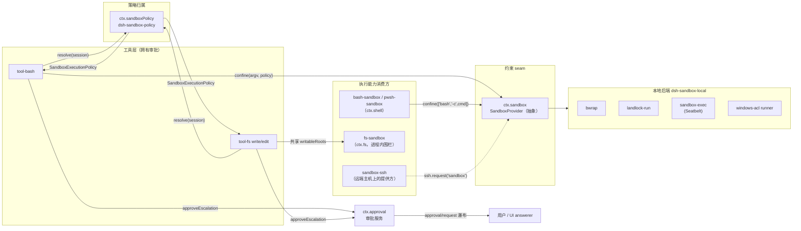
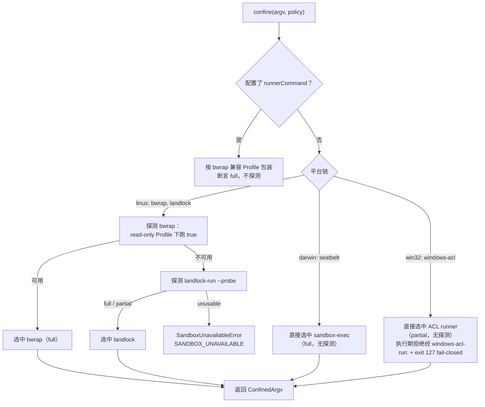
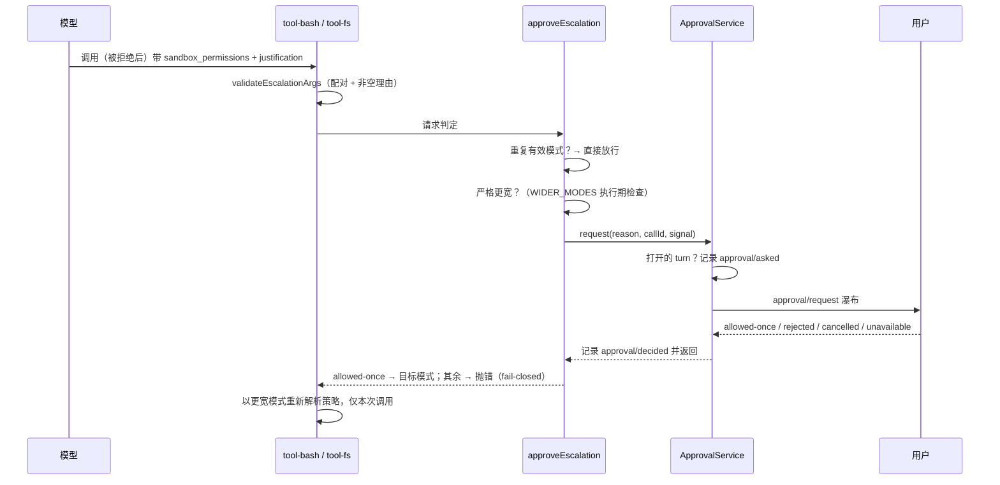

本页是进程沙箱子系统（`packages/sandbox/` 包组）的参考文档，面向需要理解或扩展沙箱能力的中级开发者。内容覆盖四条主线：**模式词汇与逐调用策略**（`SandboxMode`、`SandboxPolicy` 及其解析优先级）、**本地后端选择与平台 Profile 方言**（Linux bwrap/Landlock、macOS Seatbelt、Windows ACL 受限令牌）、**包装 argv 与 stderr 分类方言**（拒绝 vs runner 故障的判定），以及**审批 seam**（`sandbox_permissions` 升权如何经 `ctx.approval` 在执行前完成人审）。文件系统围栏（`fs-sandbox`）与远端沙箱提供方作为消费方一并说明。

## 总体架构：一条能力 seam，两类状态归属

沙箱子系统把"如何限制"（后端）与"限制到什么程度"（策略）拆成两个独立归属：`ctx.sandbox` 是抽象的进程约束 seam，消费方传入精确 argv 与策略，拿回包装后的 argv；`ctx.sandboxPolicy` 是共享的策略归属，负责部署默认值与逐会话覆盖的解析。`danger-full-access` 是显式旁路——消费方直接 spawn 原始 argv，完全不经过 `ctx.sandbox`；只有受约束模式才会到达提供方，且提供方收到的策略把模式收窄为 `ConfinedSandboxMode`，同一时刻不同消费方可以以不同策略请求同一个提供方而不互相污染。

这一分层的关键推论是：**策略是逐调用的，不是固定在提供方上的**。两个消费方可以在同一瞬间以不同策略请求同一个提供方（bash 在 `read-only` 下运行，而被约束的子代理需要其状态目录可写），一次获批的升权重试则是一次带着更宽策略的新调用。这样并发会话、多消费方与一次性提权互不改变提供方状态。

Sources: [index.ts](packages/sandbox/sandbox/src/index.ts#L1-L22)、[sandbox.zh.md](docs/subsystems/sandbox.zh.md#L1-L30)、[README.zh.md](packages/sandbox/README.zh.md#L18-L26)

## 模式词汇与强制执行事实

`SandboxMode` 只管控**文件系统效果**，三种取值各有明确语义：`read-only` 仅允许必需的接收器（如 `/dev/null`）；`workspace-write` 额外允许工作区与后端定义的临时区；`danger-full-access` 完全绕过约束。网络与进程可见性刻意排除在词汇之外——这不是遗漏，而是让每种后端只承诺自己能兑现的边界。`ConfinedSandboxMode` 用类型系统排除 `danger-full-access`，保证提供方接口只会见到约束模式。

| 模式 | 允许写入 | 谁解析它 | 到达提供方？ |
|---|---|---|---|
| `read-only` | 无（仅 `/dev/null` 等必需接收器） | 默认值，也是 fail-safe 起点 | 是 |
| `workspace-write` | 会话工作区 + 平台临时区 | 会话覆盖或部署配置 | 是 |
| `danger-full-access` | 不限制（旁路） | 会话覆盖或部署配置 | 否——消费方直接 spawn 原始 argv |

强制执行完整性是后端**报告的事实**而非承诺：`full` 表示后端管控了该模式承诺的全部文件效果；`partial` 表示活跃后端或较旧的内核 ABI 只能管控其中子集，要求绝对边界的消费方必须拒绝或将这一区别向上暴露。当前唯一的 `partial` 来源是 Windows ACL 后端（NTFS 硬链接别名、读取不受限、AppContainer ACL 树不可读三条固有边界）与旧 Landlock ABI 内核。

Sources: [index.ts](packages/sandbox/sandbox/src/index.ts#L24-L60)、[index.ts](packages/sandbox/sandbox-local/src/index.ts#L169-L189)

## 逐调用策略：解析优先级与可写根域

`SandboxExecutionPolicy` 携带一次能力调用的完整文件效果策略：模式、`workspace-write` 的绝对根目录，以及可选的调用会话身份 `sessionId`——即使模式不消费这个根，它也随策略一起携带，让消费方可以"解析一次、再决定走哪条强制路径"。`sessionId` 是后端键控每会话状态的依据（Windows ACL 后端据此为每个活跃会话/工作区对维护随机私有临时目录与 SID）；无代理调用缺省，回退到按调用的后端状态。

解析优先级由 `ctx.sandboxPolicy.resolve()` 统一持有，bash 与 fs 都不必重复实现：**已批准的显式模式 > 会话日志中最后一条 `sandbox/mode` 事件 > 部署默认值**。工作区根的规则同样只有一份：有会话时用会话不可变的 cwd，无会话（或会话没有 cwd）时用配置的回退根（默认 `process.cwd()`）。部署默认模式是 `read-only`——fail-safe 起点，想要工作区可写的部署必须显式选择加入。

Sources: [index.ts](packages/sandbox/sandbox/src/index.ts#L35-L73)、[index.ts](packages/sandbox/sandbox-policy/src/index.ts#L110-L124)、[index.ts](packages/sandbox/sandbox-policy/src/index.ts#L155-L181)

可写根域的"含义"有一个唯一归属：`writableRoots()` 把 `workspace-write` 解释为"工作区根 + `/tmp` + `os.tmpdir()`"的规范化去重列表（`read-only` 返回空列表）。Seatbelt 的 SBPL Profile 与 fs-sandbox 的进程内围栏都从这里派生允许列表，因此"写工具写不了 /tmp 而 bash 可以"这类不对称在两者之间不可能出现。`canonicalPath()` 用 `realpathSync.native` 解析符号链接——macOS 上 `/tmp` 实际就是 `/private/tmp`，按拼写授予会匹配不到任何路径；解析失败时保守地原样返回（缺失的根匹配不到任何东西，直到它存在为止），绝不发明回退值去授予调用方没有点名的路径。

Sources: [roots.ts](packages/sandbox/sandbox/src/roots.ts#L20-L56)、[profiles.ts](packages/sandbox/sandbox-local/src/profiles.ts#L45-L58)

## 策略归属服务与 session/mode 事件

`SandboxPolicyService`（`ctx.sandboxPolicy`）不只是个解析函数：它在构造时向会话投影注册 `sandboxMode` 折叠单元，把会话日志中的 `sandbox/mode` 事件折叠成投影状态，并向系统提示词贡献 `sandbox:policy` 上下文段——渲染当前策略的模型可读描述（含工作区路径），让模型在不重写稳定系统提示词的前提下知道当前生效的文件策略。`setSandboxMode()` 是会话模式覆盖的唯一写入路径：切换即事件，日志之外不存在任何改动模式状态的通道；事件是 log-only 的（如 `approval/*` 的先例），持久、可重放、永不进入模型转录，最后一次事件即当前覆盖。`source: 'delegation'` 标记子代理在委派时被种子化的覆盖——这条线索通向子代理系统的策略继承。

Sources: [index.ts](packages/sandbox/sandbox-policy/src/index.ts#L125-L153)、[session-mode.ts](packages/sandbox/sandbox-policy/src/session-mode.ts#L26-L56)

值得注意的工程细节是根目录解析的时序：`workspaceRoot` 没有 schema 默认值，`process.cwd()` 回退在构造函数里解析并总是存储绝对路径，避免"配置了相对路径却在不同工作目录下漂移"的隐患。`resolveWorkspaceRoot` 会拒绝非绝对路径，维持执行世界的拼写（规范文件系统身份由各强制层在自己的主机上解析）。

Sources: [index.ts](packages/sandbox/sandbox-policy/src/index.ts#L74-L87)、[index.ts](packages/sandbox/sandbox-policy/src/index.ts#L125-L131)

## 后端选择：平台链、功能探测与 fail-closed

`LocalSandboxProvider` 注册为 `ctx.sandbox`，它把后端选择建模为**平台优先、探测其次**的静态链：Linux 是 `['bwrap', 'landlock']`（bwrap 的挂载 Profile 最贴近模式词汇，故优先），macOS 是 `['seatbelt']`，Windows 是 `['windows-acl']`。只有多于一个候选的平台才做功能探测——探测用于仲裁，不重新验证没有替代项的选择；独候选（darwin/win32）直接选中，其执行期拒绝仍然构成 fail-closed 终点。链的裁决在提供方生命周期内解析一次并缓存。

探测本身是功能性的而非版本检查：bwrap 与 Seatbelt 的探测都让真实 `read-only` Profile 执行 `true`，退出 0 即内核接受并强制了 Profile；Landlock 的 `--probe` 构建并强制一个最大化规则集，其报告区分 `full` 与旧 ABI 的 `partial`。`probeTimeoutMs`（默认 5000）必须是正有限数——Node 把 `spawnSync({ timeout: 0 })` 视为**无超时**，未校验的 0 会静默变成"无界"，与字段的承诺正好相反。运维可用 `runnerCommand` 覆盖 runner argv（追加 bwrap 兼容 Profile 参数，断言 `full`、跳过选择与探测），但必须同时提供 `runnerFailureSignatures`，让自定义 runner 拒绝 Profile 时仍可被识别为 runner 故障。

Sources: [index.ts](packages/sandbox/sandbox-local/src/index.ts#L151-L167)、[index.ts](packages/sandbox/sandbox-local/src/index.ts#L191-L200)、[index.ts](packages/sandbox/sandbox-local/src/index.ts#L478-L533)、[index.ts](packages/sandbox/sandbox-local/src/index.ts#L253-L258)

fail-closed 是整条 seam 的硬约束：平台没有链、或没有候选通过探测时，`confine()` 抛出 `SandboxUnavailableError`（错误码 `SANDBOX_UNAVAILABLE`），命令**绝不**以未约束方式运行。错误消息直接给出可操作指引（安装 bubblewrap / 运行支持 Landlock 的内核 / 确保 sandbox-exec 可用 / 确保 ACL runner 可启动，或把消费方切到 `danger-full-access`），经 `HarnessError` 结构化错误通道传递，调用方可以区分"缺少约束"与"命令失败"。

Sources: [index.ts](packages/sandbox/sandbox/src/index.ts#L119-L137)、[index.ts](packages/sandbox/sandbox-local/src/index.ts#L478-L488)

## 各平台 Profile 方言

每个后端用"自己的方言"表达同一份策略，`profiles.ts` 是这些方言的翻译层。所有方言都以 `--` 分隔符收尾，其后是调用方的原始 argv——提供方替换的是 argv 前缀，命令本身逐字保留（shell 形状的消费方传 `['bash', '-c', command]` 而非 shell 字符串）。

| 后端 | 平台 | Profile 方言 | 静态强制执行 | 拒绝方言（stderr 子串） |
|---|---|---|---|---|
| bwrap | Linux | `--ro-bind / /`、`--dev /dev`、`--unshare-pid`、`--proc /proc`、`--die-with-parent`；`workspace-write` 加 `--tmpfs /tmp` 与 `--bind 工作区 工作区` | `full` | `read-only file system`（EROFS） |
| landlock-run | Linux | 允许列表授权：`--ro /` 只读根；`--rw /dev/null`，`workspace-write` 加 `--rw /tmp --rw 工作区` | 经探测区分 `full`/`partial` | `permission denied`（EACCES） |
| sandbox-exec | macOS | SBPL：`(allow default)` + `(deny file-write*)` + 允许 `/dev/null` 字面量与 `writableRoots` 各 `subpath` | `full` | `operation not permitted`（EPERM） |
| windows-acl | Windows | 受限令牌 + DACL 授予（见下节） | `partial` | `access is denied` 等四种变体 |

bwrap 与 Landlock 方言保留各自的授予拼写（临时 `/tmp` 挂载、launcher 自有的旗标），而非强行统一到 `writableRoots`——这是沙箱 RFC 中记录的诚实的 per-runner 差异，由测试钉住奇偶性；Seatbelt 则显式从 `writableRoots` 派生，与 fs 围栏永不漂移。

Sources: [profiles.ts](packages/sandbox/sandbox-local/src/profiles.ts#L13-L35)、[profiles.ts](packages/sandbox/sandbox-local/src/profiles.ts#L45-L58)、[index.ts](packages/sandbox/sandbox-local/src/index.ts#L202-L215)

Landlock 后端的二进制契约值得单独一提：`@deepseek-ai/node-addon-system/landlock-run` 的 JS API 拥有 launcher 的 CLI 契约（`LAUNCHER_BIN`、失败退出码 125、授权旗标拼写），消费方永远不解析 launcher 输出或手写旗标——契约与二进制在同一家族里同步版本，使探测解析的漂移在结构上不可能。该模块刻意没有任何环境变量覆盖：**哪个二进制来约束进程绝不能由环境决定**，测试注入一律走函数参数。启动器不可解析时回退到本包边界内的绝对路径（绝不相对 cwd——相对路径会把 cwd 控制权交给"哪个二进制约束"这个决定），而它的存在与否不重要：`probe` 是唯一的可用性信号。

Sources: [index.ts](native/system/packages/entry/src/index.ts#L17-L34)、[index.ts](native/system/packages/entry/src/index.ts#L55-L83)、[index.ts](native/system/packages/entry/src/index.ts#L87-L128)

## Windows ACL 受限令牌后端

Windows 上没有 bwrap/Landlock/Seatbelt 的对应物，`sandbox-windows-acl` 用 **WRITE_RESTRICTED 受限令牌**实现写入限制：令牌的限制 SID 列表包含两个不同的写 SID——工作区写 SID（从规范化工作区路径确定性派生，身份是**按工作区**的）与临时写 SID（每个活跃会话/工作区对的**随机**私有临时目录）。交集检查允许写入恰好是这两个能力拥有 Write ACE 的目录；令牌同时降到 Low 完整性，每个被授予目录带 no-write-up 标签。父进程只负责键控：runner 收到 `--write-sid` 与 `--temp-write-sid` 后自己不再管理 DACL。

授予生命周期是两级设计：工作区根 ACE 每个**工作区**每个服务器生命周期只物化一次并**永久站立**（精确 ACE 跳过使后续提供是 O(1)，而不是每会话重传播整棵树——跨会话复用缓存）；私有临时 ACE 则可撤销，提供方 dispose 时统一回收（干净关机不留临时 ACE，崩溃残留会被新提供方的全新随机路径与 SID 天然隔离）。同级会话共享工作区但无法进入彼此的临时树，因为临时目录的 SID 不同于共享的工作区 SID；半物化的临时授予在错误传播前被撤销、目录被移除（fail-closed 清理）。无代理的 `workspace-write` 调用传环境临时根且不带 SID 旗标，runner 为该次调用自建自删随机私有子目录。

Sources: [index.ts](packages/sandbox/sandbox-windows-acl/src/index.ts#L1-L44)、[index.ts](packages/sandbox/sandbox-local/src/index.ts#L348-L437)、[index.ts](packages/sandbox/sandbox-local/src/index.ts#L439-L476)

后端自我报告 `partial` 并非谦虚，而是三条固有边界的诚实披露：NTFS 硬链接把一个文件对象别名到授予路径之外；读取完全不受限（WRITE_RESTRICTED 只交集写访问）；另一个 AppContainer 工具用包 SID ACL 过的树对 Low 完整性子进程不可读。后端强制了剩余 ACL 可及的表面，但不得宣称绝对承诺。该后端还有一条区别于其他 rung 的运行时契约：runner 侧任何失败打印 `windows-acl-run: <detail>` 并退出 127（区别于 Landlock 的 125）。

Sources: [index.ts](packages/sandbox/sandbox-local/src/index.ts#L169-L189)、[index.ts](packages/sandbox/sandbox-local/src/index.ts#L217-L242)

## 包装 argv 与分类方言：拒绝 vs runner 故障

`confine()` 的返回值 `ConfinedArgv` 除了替换后的 argv，还携带三类**正交的**事实：所选后端的强制执行完整性、该后端的拒绝方言（`denialSignatures`——本后端对一个被拒文件效果产生的 stderr 子串），以及结构化的 runner 故障证据规则（`runnerFailureRules`）。这两类分类器回答两个不同的问题：**拒绝**意味着约束正常工作、内核阻止了命令；**runner 故障**意味着命令根本没运行（沙箱基础设施坏了）。消费方先查 runner 故障（非零退出 + 规则的退出码门控 + 逐行致命签名，先按整行精确相等剔除信息行），再查拒绝签名；退出状态单独永远不能证明 runner 故障。

| 后端 | runner 故障规则 | 设计依据 |
|---|---|---|
| bwrap | 致命签名 `bwrap: `（仅签名） | 当前致命路径退出 1，但公共契约不保留该状态 |
| landlock-run | 退出码门控 `[125]` + 致命签名 `landlock-run: ` + 信息行排除 `partial enforcement (older Landlock ABI)` | launcher 的版本化 exit-125 契约 |
| sandbox-exec | 致命签名 `sandbox-exec: `（仅签名） | 未发布 launcher 故障退出码 |
| windows-acl | 退出码门控 `[127]` + 致命签名 `windows-acl-run: ` | runner 文档化的失败退出 |

这套结构化规则直接来自一次真实事故的教训（post-mortem 0004）：旧 Landlock ABI 内核上，launcher 在每次子进程执行前打印一条良性的 partial-enforcement 提示，而当时消费者用单个 `landlock-run: ` 前缀加任意非零退出判定 launcher 失败——ripgrep 的"无匹配退出 1"等正常结果被错误地归因为沙箱基础设施故障。修复后的规则能够表达"Landlock 失败需要退出 125、证据必须落在单条致命行内、同前缀有一条精确信息行"，而旧的字符串袋做不到。进程归因需要**独立证据的合取**；共享前缀不是协议。

Sources: [index.ts](packages/sandbox/sandbox-local/src/index.ts#L220-L242)、[diagnostics.ts](packages/sandbox/sandbox/src/diagnostics.ts#L58-L101)、[0004-landlock-partial-notice-misclassified-child-failures.md](docs/postmortem/0004-landlock-partial-notice-misclassified-child-failures.md#L1-L56)

bash 消费方（`SandboxBashExecutor`，pwsh 侧是其镜像）拥有 spawn 与结果归因：它在每次调用时把完整策略压到 spec 上，通过 `ctx.sandbox.confine(['bash', '-c', command], policy)` 包装，再为每个进程保留独立的归因事实（提供方可能在重叠调用间变化方言，共享"最近一次包装"会归因错位）。结算时 runner 故障优先于拒绝（命令没跑过），前台路径直接抛 `SANDBOX_UNAVAILABLE`，后台进程携带 `runnerFailed` 标记；spawn 阶段的 `ENOENT`/`EACCES` 只有在错误路径精确指向 runner 程序且工作目录可用时才归因给 runner——工作目录是调用方的资产，必须独立排查。

Sources: [index.ts](packages/shell/bash-sandbox/src/index.ts#L85-L133)、[index.ts](packages/shell/bash-sandbox/src/index.ts#L135-L192)、[diagnostics.ts](packages/sandbox/sandbox/src/diagnostics.ts#L28-L55)

进程内文件围栏（`SandboxedFileSystem`，注册为 `ctx.fs`）是同一策略的另一种强制形态：它继承本地文件系统全部机制，只在 `writeText`/`editText` 两个变更入口加**每调用策略围栏**——`read-only` 拒绝一切变更；`workspace-write` 在委托前**重新规范化**目标（捕捉工具解析后被并发调换的符号链接祖先），要求包含在 `writableRoots` 之下，并把**这个新鲜目标**（而非陈旧目标）交给继承的原子写，消除 check-here-write-there 的 TOCTOU；拒绝抛结构化 `FS_SANDBOX_DENIED`。文档明确其威胁模型定位：这是**可信代码中对模型控制路径的策略检查，不是内核边界**——不可信代码的内核级隔离是 `ctx.shell`（bash/pwsh 沙箱执行器）的职责。

Sources: [index.ts](packages/fs/fs-sandbox/src/index.ts#L1-L30)、[index.ts](packages/fs/fs-sandbox/src/index.ts#L111-L144)

seam 的可替换性在远端同样成立：`sandbox-ssh` 把 `confine` 请求转发到 SSH 主机上与文件系统/子进程提供方同主机的沙箱解析，携带回 `ConfinedArgv` 事实；任何失败（含中止）都映射为 `SandboxUnavailableError`——远端无法约束时同样绝不放行。

Sources: [index.ts](packages/ssh/sandbox-ssh/src/index.ts#L9-L34)

## 审批 seam：升权编排与 fail-closed 人审

工具层拥有审批，共享词汇归 `dsh-sandbox/escalation` 所有——一个归属点让 bash 与 fs 两个执行家族的审批顺序和逐字错误文本不会漂移。升级是**严格放宽表**驱动的执行期检查：`read-only` 可升到 `workspace-write` 或 `danger-full-access`，`workspace-write` 只能升到 `danger-full-access`；而工具 schema 的枚举固定为封闭目标词汇 `ESCALATION_TARGETS`（`workspace-write`、`danger-full-access`）——schema 是注册表全局的，有效模式是逐调用事实，把"比默认值更宽"烘焙进枚举会让一个模式更低的会话没有任何杠杆。

模型侧的协议由三个共享文本构成：`[sandbox: file access denied under <mode> mode]` 拒绝标记（两个家族逐字一致，模型无论内核拒绝 bash 效果还是围栏拒绝变更都能以同一方式识别）、同轮升级提示（"用 `sandbox_permissions` + `justification` 精确重试一次"——提示住在决策点上，批准的重试不依赖模型记得工具描述）、以及 `sandbox_permissions` 参数描述。`validateEscalationArgs` 补上 schema 无法表达的配对约束：`sandbox_permissions` 与 `justification` 必须成对出现，且理由必须是非空句子——没有理由的审批请求或驱动不了任何东西的理由都是畸形 ask。

Sources: [escalation.ts](packages/sandbox/sandbox/src/escalation.ts#L22-L61)、[escalation.ts](packages/sandbox/sandbox/src/escalation.ts#L63-L98)、[tool-bash/src/index.ts](packages/shell/tool-bash/src/index.ts#L223-L252)

`approveEscalation()` 是执行前的有序 fail-closed 序列，审批通道被建模为最小**结构**形状（`EscalationApprover`）而非审批服务类型——工具层闭包 `ctx.approval.request(...)` 传下来，`dsh-sandbox` 因此不必依赖审批或 agent 包。序列的每一步都指向"执行前"：重复有效模式直接放行（无需审批）；非严格更宽的目标抛错；缺审批服务或缺调用代理抛错；然后才发起人审，按结果映射——只有 `allowed-once` 返回目标模式，且授权只属于发起询问的这一次调用（`rejected` 的错误文本明确要求模型"停下解释而不是绕路"）。

| 审批结果 | 语义 | 升权序列的处理 |
|---|---|---|
| `allowed-once` | 一次性授予 | 返回目标模式，压到本次调用的策略上 |
| `rejected` | 用户明确拒绝 | 抛错：保持拒绝，模型应停下解释 |
| `cancelled` | 请求被撤回（信号中止） | 抛错：审批被取消 |
| `unavailable` | 无可用 answerer | 抛错：需要审批但无审批通道 |

Sources: [escalation.ts](packages/sandbox/sandbox/src/escalation.ts#L150-L208)

`ApprovalService`（`ctx.approval`）侧的契约同样 fail-closed：会话策略 `ask`（默认，委托给组合的 answerer，无 answerer 时落到 `unavailable`）或 `never`（每个 ask 确定性 `rejected`，CI/无人值守姿态）。`request()` 要求打开的 turn——审批对 `approval/asked` + `approval/decided` 必须被 turn 包围，因为 turn 是持久日志的提交/重放边界，turn 之间的裸事件与崩溃尾无法区分、重载时被静默丢弃。判定阶段在服务自身路径上先裁决 `never`（监听器形状的门无法保证注册顺序无关的确定性拒绝）；`approval/request` 瀑布以 `unavailable` 兜底，异常 answerer 与词汇外返回值都被归一化为 `unavailable` 而不是让工具调用开敞；信号中止立即赢得竞态解决为 `cancelled`，迟到的 answer 被构造性丢弃。审计理由自包含（`escalate sandbox to <mode>: <justification>`），`displayReason` 提供中英文本供 UI 呈现。

Sources: [index.ts](packages/interaction/user-approval/src/index.ts#L197-L234)、[index.ts](packages/interaction/user-approval/src/index.ts#L261-L307)

工具层的组合守护最后补齐闭环：挂载了约束执行器却缺 `ctx.sandboxPolicy` 的分裂组合在插件加载时即失败（`escalationModes` 非空而策略服务缺失）；没有约束后端时升级字段根本不进入 schema（但 schema 校验只查已通告键，所以 `execute` 内还有一道组合守护拒绝未通告的 `sandbox_permissions`）。fs 侧的 `FsSandboxController` 把每插件构建一次的通告门控、逐调用策略解析与拒绝标记映射（`FS_SANDBOX_DENIED` → 共享 `[sandbox: …]` 标记 + 升级提示，保留结构化错误码）集中在两个变更工具之间共享。

Sources: [tool-bash/src/index.ts](packages/shell/tool-bash/src/index.ts#L213-L252)、[tool-bash/src/index.ts](packages/shell/tool-bash/src/index.ts#L440-L459)、[sandbox.ts](packages/fs/tool-fs/src/sandbox.ts#L43-L108)、[sandbox.ts](packages/fs/tool-fs/src/sandbox.ts#L110-L132)

## 消费方全景与安全边界

沙箱 seam 的完整消费图谱如下。理解的关键是各行的"强制形态"不同：bash/pwsh 走内核级进程约束，fs 围栏是进程内策略检查，SSH 把约束解析搬到远端主机——但它们共享同一份策略解析与同一套升级协议。

| 消费方 | 注册位置 | 强制形态 | 与策略的关系 |
|---|---|---|---|
| `bash-sandbox` | `ctx.shell`（替换本地 bash 执行器） | 内核级（bwrap/Landlock/Seatbelt/ACL runner 包装 argv） | 每调用完整策略；报告 mode/enforcement/denied/runnerFailed |
| `pwsh-sandbox` | `ctx.shell`（pwsh 镜像） | 内核级（Windows 上解析为 ACL runner 链） | 同 bash，逐调用镜像（jscpd 显式豁免的刻意复制） |
| `fs-sandbox` | `ctx.fs`（替换本地文件系统） | 进程内围栏（规范化 + 包含检查） | 共享 `writableRoots`，与 Seatbelt 不漂移 |
| `sandbox-ssh` | 远端组合的 `ctx.sandbox` | 远端主机上的本地后端 | 经 `ssh.request('sandbox')` 转发，事实原样带回 |
| `tool-bash` / `tool-fs` | 工具注册 | ——（不强制，拥有升级与渲染） | 通告升级字段、调用 `approveEscalation`、渲染拒绝标记 |

Sources: [index.ts](packages/shell/pwsh-sandbox/src/index.ts#L1-L44)、[index.ts](packages/ssh/sandbox-ssh/src/index.ts#L9-L34)、[README.zh.md](packages/sandbox/README.zh.md#L18-L26)

把边界收紧到最后一句安全声明：沙箱词汇只管控文件效果，网络与进程可见性在词汇之外；`danger-full-access` 是显式旁路而非"更宽松的沙箱"；Windows 后端诚实地报告 `partial` 并披露其三条固有边界；进程内围栏的残余 TOCTOU（包含复查与系统调用之间祖先符号链接被调换）在其威胁模型中被收窄并被接受。需要模型权限、工具审批与部署建议的运维视角，请继续阅读安全说明页。

Sources: [index.ts](packages/sandbox/sandbox-windows-acl/src/index.ts#L1-L44)、[index.ts](packages/fs/fs-sandbox/src/index.ts#L14-L30)

## 延伸阅读

本页聚焦沙箱 seam 的内部机制。若要理解策略如何在插件树中流动与被替换，见[能力 Seams 与核心服务全景](13-neng-li-seams-yu-he-xin-fu-wu-quan-jing-ke-ti-huan-fu-wu-de-ti-gong-fang-yu-xiao-fei-fang-guan-xi-tu)；工具层如何消费本页的执行器与围栏，见[工具系统与执行流水线](16-gong-ju-xi-tong-yu-zhi-xing-liu-shui-xian-tooldefinition-schema-dsl-yu-pre-execute-post-ba-guan-shi-jian)；`sandbox/mode` 与 `approval/policy` 事件如何随委派种子到子代理，见[子代理与多智能体协作](19-zi-dai-li-yu-duo-zhi-neng-ti-xie-zuo-subagent-ti-gong-fang-fork-in-process-yu-agent-teams)；部署与运维视角的安全须知，见[安全说明与运行边界](31-an-quan-shuo-ming-yu-yun-xing-bian-jie-mo-xing-quan-xian-gong-ju-shen-pi-yu-an-quan-xu-zhi)。