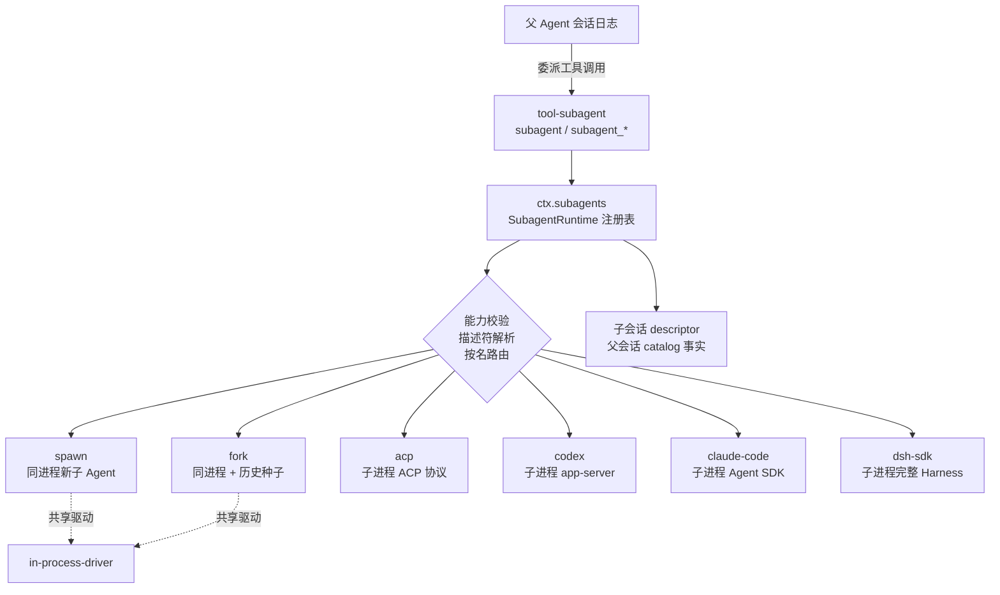
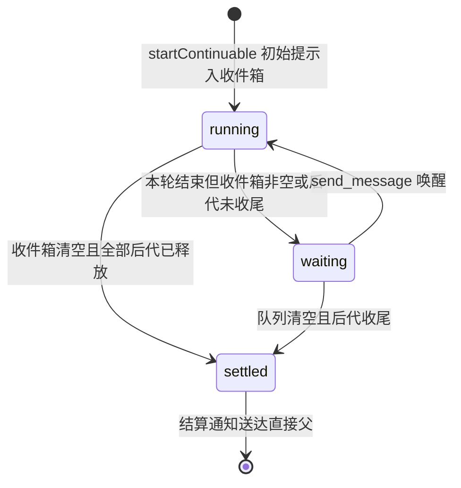
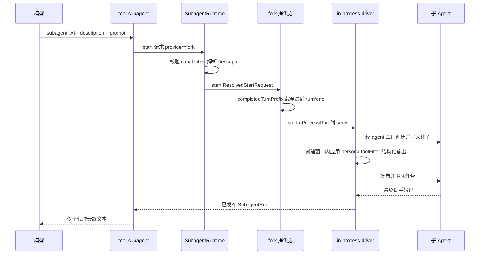
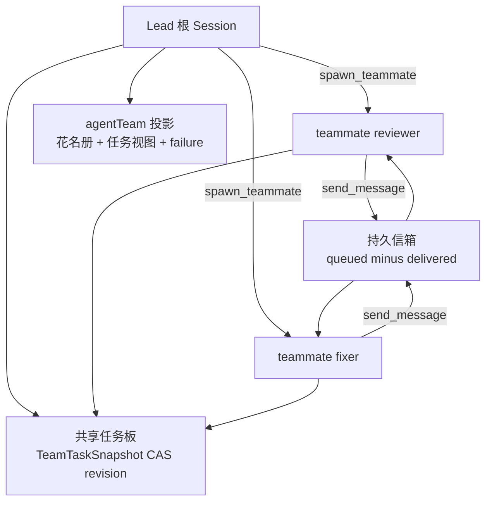

本页剖析 DeepSeek Harness 的委派能力族：`ctx.subagents` 委派 seam 如何以"一个服务、多个提供方"的注册表模型组织六种子代理后端；`fork-in-process` 如何用会话日志前缀（而非操作系统 fork）实现上下文继承；持续子代理的 Activation 生命周期与相邻 Agent 消息路由；以及实验性的 Agent Teams 隐式根多智能体域。委派是**可选能力而非 agent loop 的一部分**——这与 bash、LSP 等 capability seam 同理，但其独特点是**多个提供方实现可以并存**，由按名路由决定每次委派的传输方式。前置知识建议先读 [Agent Loop 与轮次生命周期](11-agent-loop-yu-lun-ci-sheng-ming-zhou-qi-turn-start-dao-turn-end-de-bu-zou-liu-yu-shi-jian-shi-xu) 与 [能力 Seams 与核心服务全景](13-neng-li-seams-yu-he-xin-fu-wu-quan-jing-ke-ti-huan-fu-wu-de-ti-gong-fang-yu-xiao-fei-fang-guan-xi-tu)。

Sources: [subagent.md](docs/subsystems/subagent.md#L1-L12), [README.md](packages/subagent/README.md#L14-L26)

## 委派 Seam：一个服务、多个提供方

`ctx.subagents` 是一个命名提供方注册表：每个后端以唯一名称注册（如 `spawn`、`fork`、`acp`），请求按名选择传输方式。服务契约的核心是 `SubagentProvider` 接口——提供方是受信任的同进程实现，通过 `start()` 建立一次性子代理并在发布后返回 `SubagentRun` 句柄；可选的 `prepareContinuable()` 方法的**存在本身就是能力声明**：服务拒绝在缺少该方法的提供方上启动持续子代理，而拥有该方法的提供方仍可服务普通一次性委派。



Sources: [subagent.md](docs/subsystems/subagent.md#L391-L453), [README.md](packages/subagent/README.md#L20-L26)

委派前的能力协商遵循"**fail loud, no silent degradation**"原则：提供方在静态描述符上声明 `SubagentCapabilities`（`agentOptions`、`outputSchema`、`depthLimit`、`toolFilter`、`persona` 五项，与 `SubagentStartRequest` 的可选字段一一对应），服务在调用 `start()` **之前**校验请求所需能力——缺失即以类型化错误 `UNSUPPORTED_CAPABILITY` 拒绝，绝不接受后忽略。这五个标志只描述一次性 `start` 路径；持续子代理由延续管理器自行组装子代理，仅以 `prepareContinuable` 把关。

Sources: [types.ts](packages/subagent/subagent/src/types.ts#L119-L136), [subagent.md](docs/subsystems/subagent.md#L14-L40)

发布即所有权转移：提供方的 `start()` 只在真实子代理存在后才 fulfill——在此之前提供方拥有全部准备工作并在失败时清理未发布的部分资源；之后调用方拥有 run 并必须 `dispose()` 以取消剩余工作、达到静默。本地一次性 run 必须发布普通子代理/会话后才算完成，`SubagentRun.id` 等于子会话 id，子会话的 `parentSession` 头记录父会话 id。服务随后铸造 `runId`、观测结果、发出 `subagent/start` 生命周期事件（与配对的 `subagent/end` 构成 observe-only 事件对）。

Sources: [subagent.md](docs/subsystems/subagent.md#L346-L453), [types.ts](packages/subagent/subagent/src/types.ts#L299-L319)

## 两种子代理形态：one-shot 与 continuable

一次性子代理是"发布后归调用方所有、单结果即弃"的前台委派：消费者 await `SubagentRun.result` 并始终 dispose。终局 `SubagentResult` 携带子代理最终非空助手输出（跳过纯 usage 消息，无则回退到累积文本流）、可选的经 schema 校验的 `structured` 值、以及 ≤4096 UTF-8 字节且不含工具输入/环境值/凭据的**安全诊断** `diagnostic`。停止原因是**合并可扩展派生联合**——后端可添加变体，消费者对未知原因按失败处理：

| stopReason | 语义 | 消费方处理 |
|---|---|---|
| `completed` | 子代理正常完成本轮 | 文本作为工具结果返回 |
| `aborted` | 请求信号触发或 dispose 取消 | `isError` 工具结果 |
| `error` | 模型或传输故障 | `isError` + 安全诊断 + 部分文本 |
| `max-tokens` | 子代理撞上 token 上限 | `isError` + 保留的部分输出 |
| `refusal` | 子代理拒绝任务 | `isError` 工具结果 |

Sources: [types.ts](packages/subagent/subagent/src/types.ts#L246-L297), [subagent.md](docs/subsystems/subagent.md#L286-L344)

持续子代理则是"**一个持久 Session + 至多一个进程内 Activation**"的模型。Activation 不是请求、结果或取消——它是重建后的子 Agent 的驻留期，可执行多轮 FIFO 回合并保持驻留直至后代全部收尾。运行时不变式为一条链：持久 Session → 可选的活 Activation → 唯一保留的 `AgentHandle` → Agent 收件箱作为唯一轮次 FIFO → 零或多个自有子 Activation。

Sources: [subagent.md](docs/subsystems/subagent.md#L135-L150)

`sendMessage()` 是唯一的模型侧消息操作，只允许直接父或直接持续子这一条相邻边，按目标 Activation 的驻留状态路由：

| 目标 Activation 状态 | `sendMessage` 行为 |
|---|---|
| `running`（有活动驱动或维护任务） | 在最近步骤边界 Steer 同一 Activation |
| `waiting`（无 Agent 活动但收件箱非空或有未收尾子 Activation） | 唤醒并 Steer 同一 Activation |
| 无 Activation | 冷恢复：从持久化重建新 Activation 再 Steer |

来源权威来自**精确的活 Agent 对象**：父到子要求目标会话头 `parentSession` 指名发送者；子到父要求发送者的驻留 Activation 指名目标。兄弟、跨多代祖先、自指、过期 Agent 对象一律拒绝。`interrupt()` 是唯一的公开停止操作——同步授权后对活目标发出 `Agent.cancel(cause, { keepInbox: true })` 即返回，不等待静默：未认领的收件箱工作、Activation 与已发布后代全部保留，授权类型为 `user`（人类客户端呈现的持久直接父地址）或 `ancestor`（血统包含调用者的精确活 Agent 对象）。

Sources: [subagent.md](docs/subsystems/subagent.md#L150-L186), [types.ts](packages/subagent/subagent/src/types.ts#L60-L73)

驻留容量由宿主设置 `maxActiveSubagents` 控制（默认 `8`）：每个新建或冷恢复的 Activation 前采样，满员时以 `ACTIVATION_LIMIT_REACHED` 拒绝创建（浏览器提示走 `subagent/delivery-unavailable`），不排队——因为等待后代的父代理不能同时等待自己的占用名额。Activation 结算时，管理器向子的持久直接父投递一条**结算通知**（以 `subagent-settled` 来源标注的 notice 形式用户消息，携带最终助手文本或 `It left no closing message.`），这是持续子代理结果进入父历史的独立通道，不经过任何工具结果。

Sources: [README.md](packages/subagent/subagent/README.md#L36-L45), [subagent.md](docs/subsystems/subagent.md#L200-L224)



两种形态的对比：

| 维度 | one-shot | continuable |
|---|---|---|
| 生命周期 | 单结果后释放 | 持久 Session + 至多一个 Activation |
| 归属句柄 | `SubagentRun`（调用方拥有，须 dispose） | 延续管理器持有 `AgentHandle` |
| 后续通信 | 无（结果一次返回） | `send_message` 沿相邻边 Steer / 冷恢复 |
| 结算呈现 | 工具结果即最终输出 | 独立结算通知（notice 形式用户消息） |
| 后台语义 | 注册为父拥有的 Task，经 `job_output`/`job_kill` 收集 | 返回 `started subagent <childId>` 后台运行 |

Sources: [subagent.md](docs/subsystems/subagent.md#L346-L389), [README.md](packages/subagent/tool-subagent/README.md#L54-L62), [subagent/README.md](packages/subagent/subagent/README.md#L110-L124)

## fork-in-process：用数据继承上下文，而非系统调用

需要澄清的命名直觉：`fork-in-process` **不是**操作系统级 fork，也不是进程克隆。它是一个注册在 `ctx.subagents` 上的进程内提供方，将每个子代理运行为子 Agent，并以**父会话日志的一个前缀切片作为会话种子**——子代理继承父代理已完成的对话轮，而非运行时内存。"fork" 语义完全由数据（`seed: SessionEvent[]`）表达，复用的是 `CreateAgentOptions.seed` 这一与 `ctx.agents.resume()` 相同的持久原语：从 seq 0 连续、无损 JSON、轮次平衡。

Sources: [index.ts](packages/subagent/subagent-fork-in-process/src/index.ts#L1-L21), [subagent.md](docs/subsystems/subagent.md#L455-L464)

种子边界的计算规则封装在 `completedTurnPrefix` 中：取父日志中**最后一个 `turn/end` 及其之前的全部事件**。父代理当前的工具调用轮在子代理启动时仍是开放的（unbalanced），无法作为合法子会话重放，因此被排除；首个轮完成之前种子为空，子代理行为等价于全新 spawn。由于活跃序列号等于数组下标，切片天然满足种子合同。提供方仅在种子非空时传递 `{ seed }`，空种子则省略以保持会话未播种：

```ts
function completedTurnPrefix(parent: Agent): SessionEvent[] {
  const events = parent.session.snapshotEvents()
  const lastEnd = events.findLast(e => e.type === 'turn/end')
  if (lastEnd === undefined) return []
  // seq === array index (the append contract), so slice up to and including it.
  return events.slice(0, lastEnd.seq + 1)
}
```

Sources: [index.ts](packages/subagent/subagent-fork-in-process/src/index.ts#L40-L55)

fork 提供方声明全部五项能力与 `inheritsParentContext: true`（该标志是描述性的——模型侧工具据此生成"它看不到当前进行中的轮次"而非"它看不到本对话"的措辞，工具层不描述工具注册或权威继承）。一次性路径上，种子交给共享驱动 `startInProcessRun(request, { seed })`；持续路径上，`prepareContinuable` 返回 `ContinuableCreateSpec`——**一次性捕获**父日志前缀作为子的持久转录一部分，后续冷恢复重放该前缀而非重新 fork 父代理的更新历史。

Sources: [index.ts](packages/subagent/subagent-fork-in-process/src/index.ts#L57-L96), [types.ts](packages/subagent/subagent/src/types.ts#L231-L244)



fork 与姊妹后端共享 `dsh-subagent-in-process-driver` 的运行机制（深度校验、子代理创建、每子定制、结构化输出、取消、结果读取、静默释放），后端本身只贡献"以什么种子启动"这一决策：

| 维度 | spawn | fork | 进程外后端 |
|---|---|---|---|
| 上下文继承 | 无（空会话，任务提示须自足） | 父已完成轮前缀（截至 `turn/end`） | 无（独立完整上下文） |
| 种子机制 | 不传 `seed` | `InProcessRunOptions.seed` | 不适用 |
| 共享组合 | 同进程共享 agent 工厂、LLM、工具服务 | 同左 | 仅传递任务与工作目录 |
| 约束生效 | 父代理强制策略可生效 | 同左 | 子进程内不可强制 |
| KV Cache | 独立前缀 | 子代理可在同 provider/model 下复用字节相同的继承前缀 | 独立前缀 |

Sources: [README.md](packages/subagent/subagent-in-process-driver/README.md#L17-L51), [README.md](packages/subagent/subagent-spawn-in-process/README.md#L52-L57), [README.md](packages/subagent/subagent-fork-in-process/README.md#L30-L44)

一个值得注意的部署差异：基础 bundle 与 ACP/headless 示例将 fork 绑定为 `backgroundMode: one-shot`，而 CLI 预设选择 `continuable`——两种绑定都保持继承前缀可复用，因为父子双方的消息工具定义逐字节一致。同时，已发布的 fork 工具**不暴露子代理 LLM 路由选择**：子代理继承父的 provider 与 model，使复制的父历史保持 KV Cache 复用资格——一旦子代理路由改变，继承前缀的复用即失效。

Sources: [README.md](packages/subagent/subagent-fork-in-process/README.md#L83-L92), [README.md](packages/subagent/subagent-fork-in-process/README.md#L126-L131)

## 提供方全景：从同进程到完整外部运行时

六个提供方覆盖了从"同进程轻量子代理"到"完整隔离外部运行时"的连续谱系：

| 提供方（默认注册名） | 实现包 | 进程模型 | 上下文继承 | 启动期能力 | 形态支持 |
|---|---|---|---|---|---|
| `spawn` | dsh-subagent-spawn-in-process | 同进程新子 Agent | 无 | 全部五项 | one-shot 与 continuable |
| `fork` | dsh-subagent-fork-in-process | 同进程 + 历史种子 | 是 | 全部五项 | 两者（按组合绑定） |
| `acp` | dsh-subagent-acp | 每运行一个新子进程，ACP 协议握手 | 无 | 无（相关请求被服务拒绝） | 仅 one-shot |
| `codex` | dsh-subagent-codex | 每运行新 app-server 进程 + 临时线程 | 无 | 深度 provider-managed | 仅 one-shot |
| `claude-code` | dsh-subagent-claude-code | 每运行一个无监督 Claude Code 会话 | 无 | 同 codex | 仅 one-shot |
| `dsh-sdk` | dsh-subagent-dsh-sdk | 每运行一个完整 Harness 子进程（SDK JSON-RPC） | 无 | 仅 `agentOptions` | 仅 one-shot |

Sources: [README.md](packages/subagent/README.md#L20-L26), [README.md](packages/subagent/subagent-dsh-sdk/README.md#L44-L45), [README.md](packages/subagent/subagent-acp/README.md#L119-L126)

进程外后端的共同设计是"**协议即序列化边界**"：同进程值不做防御性克隆，敌意输入校验发生在协议层；每次运行一个全新进程（无进程池），仅工作目录与任务跨越边界。`acp` 后端对每个子进程执行 ACP `initialize`/`newSession` 握手后才发布 run，权限提示按 `permission: reject | allow` 自动应答（无人类参与）；`dsh-sdk` 后端则让子代理成为**完整的 Harness 对等体**——拥有自己的组合、会话持久化、模型路由与工具，父代理只通过 `initialize` 路由传递 provider/model/maxTokens，并通过不可变的 `agentRouteDefaults` 将配置基线发布给 `dsh-tool-subagent` 供模型覆盖。注意 `dsh-sdk` 的子进程由 SDK 客户端而非 `ctx.subprocess` 生成——这是 SDK 托管传输的文档化例外。

Sources: [README.md](packages/subagent/subagent-acp/README.md#L92-L118), [README.md](packages/subagent/subagent-dsh-sdk/README.md#L94-L104), [README.md](packages/subagent/subagent-dsh-sdk/README.md#L38-L53)

`codex` 与 `claude-code` 以 Profile Bundle 形式安装（`dsh plugin --profile <name> add ...`），安装引入钉扎的官方封装与平台载荷，patch 层只注册**休眠**提供方——安装控制宿主可用性，模型可见性仍由委派工具行决定。两者都把原生配置视为权威：Codex 保留父 cwd 与 `CODEX_HOME` 原生认证，仅覆盖可选 model 与审批/沙箱模式（`permissionMode` 含显式的 `dangerously-bypass-approvals-and-sandbox`）；Claude Code 的 `permissionMode` 从 `dontAsk` 到 `bypassPermissions` 分五档，其中 `plan` 模式拒批执行审批并把完成的计划作为最终答案返回。进程外子代理的失败诊断保持**固定格式单行**（如 `Subagent failure (provider: ACP; stage: <stage>; category: <category>; ...)`），stderr、异常文本、任务内容、路径与环境值一律不出现在诊断中。

Sources: [README.md](packages/subagent/subagent-codex/README.md#L31-L53), [README.md](packages/subagent/subagent-claude-code/README.md#L33-L48), [README.md](packages/subagent/subagent-acp/README.md#L66-L70)

## 模型侧工具面

`dsh-tool-subagent` 以"一个实例 = 一个提供方 + 一个工具名"的方式暴露委派：每个实例镜像其提供方的生命周期——提供方出现即注册工具、离开即释放，兄弟加载顺序与 HMR 替换都不会留下悬空工具。工具措辞随 `inheritsParentContext` 语境化（fresh 子代理 vs fork 子代理的不同描述），深度默认读宿主设置 `subagent.maxDepth`（初始 `1`，`0` 禁止委派，`'provider-managed'` 不向上进程外提供方传上限）：

| 配置字段 | 默认值 | 作用 |
|---|---|---|
| `provider` | 必填 | `ctx.subagents` 上的提供方名 |
| `toolName` | `subagent` | 模型可见工具名，每实例唯一 |
| `backgroundMode` | `one-shot` | `continuable` 时调用默认后台化，要求提供方 `prepareContinuable` |
| `enableRunInBackground` | `true` | 暴露 `run_in_background` 参数 |
| `agentOptions` | — | 子代理 provider/model/reasoningEffort/maxTokens 默认值 |
| `persona` / `toolFilter` | — | 每子人格（作用域遮蔽）与工具收窄（可见即不可执行） |
| `modelSelectionSettings` | `false` | 采样宿主精确路由授权偏好，启用后附 `list_subagent_models` 发现工具 |

Sources: [README.md](packages/subagent/tool-subagent/README.md#L29-L62), [README.md](packages/subagent/tool-subagent/README.md#L86-L96)

`dsh-tool-subagent-control` 为持续子代理添加三个全局控制工具，全部是对 `ctx.subagents.sendMessage()`、`interrupt()` 与目录投影的薄适配器——驻留、冷恢复与授权判定都在服务层，工具只透传精确的活调用者（`exec.agent`）作为发送者与权威：

| 工具 | 语义 | 接受输出 |
|---|---|---|
| `send_message` | 向直接持续子或直接父定向投递；运行目标最近步骤边界 Steer，空闲目标开轮，缺席子冷恢复 | `message delivered to agent <id>`（附收件箱 messageId） |
| `interrupt_agent` | 仅停当前轮：排队消息保留、后代继续运行、子仍可后续对话 | `interrupt requested for agent <id>` |
| `list_agents` | `children`（默认，直读父目录不打开子日志）或 `descendants`（稳定先序递归）列出持续子代理及其 `running`/`inactive` 状态 | 每行 `<id> [<status>] — <label>` |

注意 `list_agents` 的状态是**快照而非投递承诺**：`inactive` 不意味着任务完成，也不保证 `send_message` 会成功；一次性子代理被排除在外，因为它们无法接收后续消息。

Sources: [README.md](packages/subagent/tool-subagent-control/README.md#L34-L60), [README.md](packages/subagent/tool-subagent-control/README.md#L99-L135), [subagent.md](docs/subsystems/subagent.md#L267-L283)

## Agent Teams：实验性隐式根多智能体域

Agent Teams 是构建在委派 seam 之上的实验域：一个会话的代理成为 **Lead**，创建命名队友（teammate）执行委派工作，成员间交换持久消息并在共享任务板上协作。关键联系是：`spawn_teammate` 底层**复用 subagent 提供方**——`freshProvider` 默认 `spawn`、`forkProvider` 默认 `fork`，创建请求选择 fresh（无 Lead 对话记忆）或 fork（继承 Lead 已完成轮）。最小组合只需持久会话存储加两个实验包：

```yaml
- name: '@deepseek-ai/dsh-session-persistence-jsonl'
- name: '@deepseek-ai/dsh-experimental-agent-team'
- name: '@deepseek-ai/dsh-experimental-tool-agent-team'
```

Sources: [README.md](packages/experimental/agent-team/README.md#L15-L37), [README.md](packages/experimental/tool-agent-team/README.md#L26-L34)

与 subagent control 工具的"相邻边消息"不同，Team 消息是**任意成员到任意成员**且**持久先行**：Lead Session 先完整存储队列消息，目标的回执只在其收件箱项或已记录用户消息持久化之后确认——"queued minus delivered" 即崩溃恢复信箱。每条消息仍走 Steer（运行中目标最近步骤边界，离线目标唤醒或冷恢复），目标会话在收件箱项与最终用户消息上都保留消息标识与发送者归因，作为去重键。模型可见性方面，工具结果立即报 `accepted`（已送达）或 `queued`（暂存等待），queued 消息不可重发。

Sources: [agent-team.md](docs/subsystems/agent-team.md#L26-L54)

共享任务板是**比较原子改（CAS）的快照式 DAG**：每个任务事件存储完整快照，`revision` 每 mutation 递增并作为 cas 值——基于过期副本的更新被拒绝，两个成员无法静默互相覆盖；`blockedBy` 边必须指向未删除任务且保持图无环；`writeScopes` 是归一化的建议性路径前缀而非锁，仅在两个进行中任务规划触碰重叠路径时产生警告。任务状态机为 `pending`（未开始或已释放）→ `in_progress`（有属主）→ `completed`（阻塞满足），`deleted` 是保留的墓碑；Lead 可将任务指派给任意成员，认领仅在其全部依赖完成时可行。

Sources: [agent-team.md](docs/subsystems/agent-team.md#L56-L74)

`TeamId` 是独立 brand 下的根 `SessionId`，队友的会话 id 即持久身份，`name` 是不可变的模型/UI 标签。每个成员从 `provisioning` 出发到达唯一终局花名册阶段 `active` 或 `failed`，而 `running`/`inactive` 是派生的活动状态、永不改写持久记录。全部状态通过 Lead Session 的 `agentTeam` Session 投影发布给浏览器客户端——投影按 `TeamId` 选择记录重放出花名册、任务板与恢复信箱，普通 fork 继承的事件保留祖先 id、绝不进入新根的状态：



Sources: [agent-team.md](docs/subsystems/agent-team.md#L7-L24), [agent-team.md](docs/subsystems/agent-team.md#L78-L125)

`dsh-experimental-tool-agent-team` 为**每个**团队成员（Lead 与每个队友）安装相同的九个工具：`spawn_teammate`（仅 Lead）、`send_message`、`list_agents`（按 `target` 标识成员，不暴露 Session id）、`wait_agent`（等待下一个团队变更，无进展时立即返回 `noProgress` 提示先唤醒队友而非轮询）、`interrupt_agent`（仅 Lead）以及任务板四件套 `team_task_create`/`team_task_list`/`team_task_get`/`team_task_update`。这套工具会替代同名 legacy 全局 subagent 工具——需要两者并存的组合必须显式禁用其一。

Sources: [README.md](packages/experimental/tool-agent-team/README.md#L42-L55)

两种多智能体协作面的定位对比：

| 维度 | subagent + control 工具 | Agent Teams（实验） |
|---|---|---|
| 拓扑 | 父子树，仅相邻边可通信 | Lead + 命名队友，任意成员互发 |
| 消息持久性 | 接受即无独立结果，无持久信箱 | Lead 先落盘，恢复信箱，恰好一次语义 |
| 协调原语 | interrupt + 结算通知 | 共享任务板 CAS revision + writeScopes 警告 |
| 发现 | 父目录 catalog 投影 | 花名册投影（roster phase + 派生活动） |
| 进程边界 | 可跨进程（ACP/Codex/SDK 提供方） | 单进程单持久库，无跨进程协调 |
| 稳定性 | 稳定 | experimental |

Sources: [README.md](packages/experimental/agent-team/README.md#L18-L21), [README.md](packages/subagent/tool-subagent-control/README.md#L142-L147)

## 边界与已知限制

该能力族的当前约束界定了其适用边界。seam 层面：后代目录读取是顺序的（每个可达 catalog 一次观察，大型冷树累积存储延迟）；ACP 子代理不可追踪枚举且仍是一次性（远程提供方需要 Activation 所有权合同才能支持持续子代理）；激活收件箱与所有权图**不跨 Harness 进程协调**——并发访问同一持久库需要持久信箱与跨进程租约协议；已接受但未落盘的消息在崩溃时丢失且不自动重放；子到父投递要求直接父保持存活（无持久父信箱）。fork 层面：种子是一次性快照——子代理看不到 fork 之后父代理记录的任何内容，没有活上下文共享。Agent Teams 层面：队友不能有独立工作目录，多进程不能协调同一团队，且任务属主释放没有自动超时机制。

Sources: [README.md](packages/subagent/subagent/README.md#L171-L186), [README.md](packages/subagent/subagent-fork-in-process/README.md#L126-L131), [README.md](packages/experimental/agent-team/README.md#L18-L21)

## 延伸阅读

委派执行最终落入工具执行流水线（审批、pre/post 把关）与沙箱边界的约束之下——子代理的权限作用域在启动时固定且不可从内部放宽（`subagent:delegation` 语句），需要越界操作时拒绝并陈述限制而非重试。建议按以下路径继续：[工具系统与执行流水线](16-gong-ju-xi-tong-yu-zhi-xing-liu-shui-xian-tooldefinition-schema-dsl-yu-pre-execute-post-ba-guan-shi-jian) 理解委派工具如何经过执行把关；[沙箱与安全边界](18-sha-xiang-yu-an-quan-bian-jie-ce-lue-jie-xi-bwrap-landlock-seatbelt-hou-duan-yu-shen-pi-seam) 理解委派策略与审批继承；[会话模型与持久化](15-hui-hua-mo-xing-yu-chi-jiu-hua-sessionevent-ri-zhi-jsonl-ti-gong-fang-yu-ge-shi-ban-ben-yan-jin) 理解种子与 descriptor 的持久层基础；[CLI 与 Headless/ACP](22-cli-yu-headless-acp-profile-qi-dong-ming-ling-xing-can-shu-yu-agent-client-protocol) 了解 ACP 双向角色（本仓库既可作为 ACP 服务端被委派，也可通过 `subagent-acp` 作为客户端委派外部 ACP 代理）。