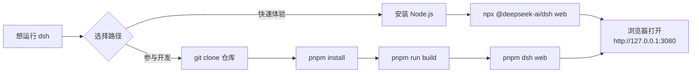
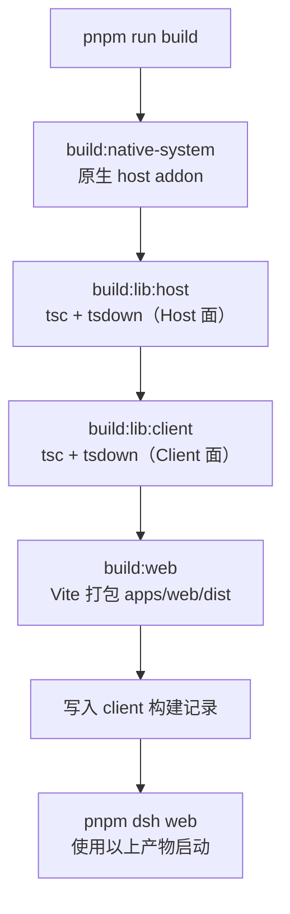
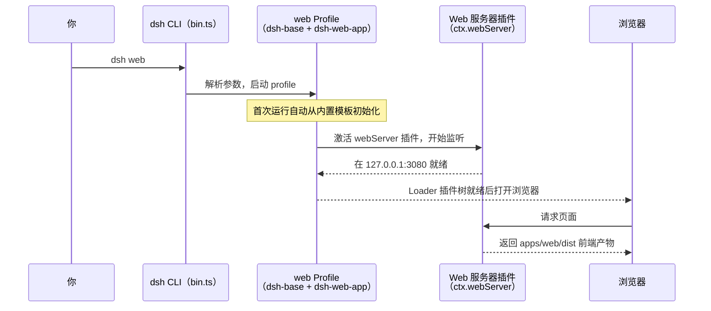

本页面向第一次接触 DeepSeek Harness（`dsh`）的开发者，只解决三件事：**用 npx 最快跑起来**、**从源码构建出可运行产物**、**把 Web UI 启动并完成第一次对话**。命令行为、默认端口、参数含义均以仓库源码与文档为准；更深的运行机制（profile 体系、插件树组装）属于后续章节，本页仅在需要理解启动流程时点到为止。

Sources: [README.zh.md](README.zh.md#L19-L45)

## 开始之前：安全须知

`dsh` 目前处于开发者预览阶段，尚未经过安全审计。它能够执行模型生成的代码与命令、加载第三方插件，并访问你向它开放的网络、进程、凭据和文件。首次运行前请阅读安全说明，并遵循几条基本原则：只授予最小权限与访问范围、优先在一次性虚拟机或容器中运行、备份它能访问的文件、不在敏感环境中暴露凭据。

Sources: [SAFETY.zh.md](SAFETY.zh.md#L5-L23)、[README.zh.md](README.zh.md#L11-L15)

## 前置条件与两条路径

仓库对运行环境有明确下限：Node.js 需要 `^22.19.0 || >=24.0.0`，包管理器通过 `packageManager` 字段固定为 `pnpm@11.7.0`。如果只想体验产品，装好 Node.js 就够了——`npx` 会从 npm 临时下载 CLI 并启动；如果想阅读或修改源码，则需要 Git、pnpm（建议经 Corepack 启用）以及一次完整构建。

Sources: [package.json](package.json#L7-L10)、[docs/development.zh.md](docs/development.zh.md#L11-L16)

| 对比维度 | 路径一：npx 运行 | 路径二：从源码运行 |
|---|---|---|
| 一句话定位 | 零安装体验，npm 即下即用 | 面向开发者，可修改代码后验证 |
| 前置条件 | Node.js（22.19+ 或 24+） | Node.js + pnpm@11.7.0 + Git + 一次完整构建 |
| 启动命令 | `npx @deepseek-ai/dsh web` | `pnpm dsh web` |
| 产物来源 | npm 注册表发布的 `@deepseek-ai/dsh` 包 | 本仓库构建出的 `lib/` 与 `apps/web/dist/` |
| 典型耗时 | 数十秒（含下载） | 首次构建通常以分钟计 |



Sources: [README.zh.md](README.zh.md#L19-L45)、[package.json](package.json#L7-L10)

## 路径一：用 npx 直接运行

安装 Node.js 后，在任意目录执行：

```sh
npx @deepseek-ai/dsh web
```

这条命令默认在 `http://127.0.0.1:3080` 启动 Web UI，并且在本机（非 SSH）启动时会用默认浏览器自动打开页面。如果你通过 SSH 远程使用，进程只会打印宿主机 URL——因为本地转发地址由 SSH 客户端或编辑器持有，进程无法替你打开浏览器；此时手动在本地浏览器访问该地址即可。若想只起服务器、不弹浏览器，追加 `--no-open`。

Sources: [README.zh.md](README.zh.md#L21-L29)、[apps/cli/reference/README.md](apps/cli/reference/README.md#L103-L115)

命令背后是 npm 包 `@deepseek-ai/dsh`（即 `apps/cli` 应用）提供的 `dsh` 可执行文件。它是整个项目唯一的 Node 应用启动器：`web`、`headless`、`sdk`、`acp` 等都是它的"profile（档案）"模式，而不是各自独立的可执行程序。`dsh web` 等价于 `dsh --profile web`。

Sources: [apps/cli/package.json](apps/cli/package.json#L2-L16)、[apps/cli/README.md](apps/cli/README.md#L9-L17)

### 进入 Web UI 后的第一次配置

服务器跑起来只是第一步，一个新的 Web UI 还不能直接对话，需要完成三步：**配置模型**——打开 Settings → Models，填入 DeepSeek API key 并保存，模型路由立即生效、无需重启服务器；**选择工作区**——点击 Choose workspace，把启动 `dsh` 时所在的项目目录添加进来，不选工作区时输入框不可用；**运行任务**——发起会话，例如发送"总结这个仓库并列出主要包"，智能体即可读取和编辑工作区文件、执行命令并维护计划，涉及敏感操作时会按当前权限策略先请求审批。

Sources: [docs/user/guide/index.md](docs/user/guide/index.md#L5-L23)

## 路径二：从源码构建并运行

克隆仓库后依次执行四条命令：

```sh
git clone https://github.com/deepseek-ai/deepseek-harness.git
cd deepseek-harness
pnpm install
pnpm run build
pnpm dsh web
```

`pnpm install` 除了装依赖，还会通过 postinstall 脚本配置 Lefthook Git 钩子；克隆完成后建议先跑一次 `pnpm run typecheck`，它成功退出即表示环境搭建完毕。这部分的环境细节（Windows 与 WSL2 的取舍、钩子排障）在下一页有专门展开。

Sources: [README.zh.md](README.zh.md#L33-L45)、[docs/development.zh.md](docs/development.zh.md#L26-L50)

### `pnpm dsh` 到底执行了什么

根 `package.json` 里定义了脚本 `"dsh": "node --import tsx/esm apps/cli/src/bin.ts"`——它用 tsx 直接运行 TypeScript 编写的 CLI 入口 `apps/cli/src/bin.ts`，**不做任何构建**，并把 `dsh` 之后的全部参数原样转发。所以 `pnpm dsh web` 的语义是"用源码启动器，伺服上一次构建的产物"。`pnpm run start:web` 与它完全等价，只是多了一个 npm script 的名字。

Sources: [package.json](package.json#L197-L202)、[apps/cli/reference/README.md](apps/cli/reference/README.md#L134-L137)

这也意味着：**从源码运行 Web 之前必须先有构建产物**。生产模式的 Web 运行器需要已构建的包产物和前端产物（即 `pnpm run build` 的输出），全新检出后或产物过期时都要重新构建一次。

Sources: [apps/cli/reference/README.md](apps/cli/reference/README.md#L115)、[apps/cli/README.md](apps/cli/README.md#L58)

### `pnpm run build` 的构建管线

根构建脚本 `scripts/build.ts` 串起三个阶段，顺序固定：先构建原生系统插件（host addon），再构建 Host/Client 两侧的库产物，最后打包 Web 前端。

| 阶段 | 对应脚本 | 产出物 |
|---|---|---|
| 1. 原生系统 | `build:native-system` | `native/system` 的 host addon |
| 2a. Host 库 | `build:lib:host` | `tsc -b tsconfig.host.json` 类型产物 + tsdown 打包的 `lib/index.js` 等 |
| 2b. Client 库 | `build:lib:client` | `tsc -b tsconfig.client.json` + tsdown client 阶段产物 |
| 3. Web 前端 | `build:web` | Vite 构建出的 `apps/web/dist/`（由 `dsh web` 伺服的静态页面） |

构建还会把根包版本、七位源码 commit 等信息内联进 client 产物，并写入一份构建记录。

Sources: [scripts/build.ts](scripts/build.ts#L31-L51)、[docs/development.zh.md](docs/development.zh.md#L76-L91)、[package.json](package.json#L27-L27)



## `dsh web` 启动时发生了什么

理解启动流程有助于定位问题。`bin.ts` 中的 `runCli()` 解析命令行后进入 profile 模式，动态加载 `profile-boot` 模块启动 `web` profile；`web` profile 在首次使用时会从内置模板自动初始化——它的组合是 `dsh-base` 基础包叠加 `dsh-web-app` 浏览器面组合包。后者负责前端静态资源伺服、Web 场景的系统提示词与 URL 地址栏等运行时粘合。

Sources: [apps/cli/src/bin.ts](apps/cli/src/bin.ts#L18-L39)、[apps/cli/reference/README.md](apps/cli/reference/README.md#L9-L13)、[packages/bundle/web-app/package.json](packages/bundle/web-app/package.json#L2-L3)



承载页面的 HTTP 载体是 `dsh-host-webserver` 插件提供的 `ctx.webServer` 服务：一个 `node:http` 服务器，激活时立即监听，监听失败（例如端口已被占用，报 `EADDRINUSE`）会导致该插件初始化被拒绝、启动进程报告失败的 fiber。它的配置中 `host` 只接受 `127.0.0.1`（默认，仅回环）和 `0.0.0.0`（刻意的全网卡暴露）两种值，`port` 为 0 时由操作系统分配。

Sources: [docs/subsystems/web-server.zh.md](docs/subsystems/web-server.zh.md#L33-L53)、[packages/bundle/web-app/package.json](packages/bundle/web-app/package.json#L128-L134)

另外两点对日常使用很重要：**默认工作区**是执行 `dsh` 命令时所在的目录，基础 profile 的新会话默认使用 `workspace-write` 权限预设（Bash 与文件系统写入被限制在会话工作区与平台临时目录内，读取与网络不受限）；**优雅退出**时第一次 `SIGINT`/`SIGTERM` 给插件树最多五秒的资源释放时间，第二次信号才强制立即退出。

Sources: [apps/cli/reference/README.md](apps/cli/reference/README.md#L117-L121)

## 常用命令与参数速查

`dsh web` 的启动器旗标在前，剩余参数全部交给 web 应用本身解析。它只认识四个应用参数：`--host` 与 `--port` 覆盖组合配置中对应行的值，`--trusted-host` 可重复使用、为本次调用追加受信主机，`--no-open` 禁止打开浏览器。

Sources: [apps/cli/reference/README.md](apps/cli/reference/README.md#L32-L40)、[apps/cli/reference/README.md](apps/cli/reference/README.md#L103-L113)

| 命令 / 参数 | 作用 |
|---|---|
| `npx @deepseek-ai/dsh web` | 从 npm 运行 Web UI（零安装体验） |
| `pnpm run build` | 构建全部仓库产物（源码运行的前置步骤） |
| `pnpm dsh web` | 用源码启动器伺服已构建产物（与 `start:web` 等价） |
| `pnpm run start:web` | 同上，作为独立 npm script 的名字 |
| `pnpm run dev:web` | 构建、伺服，并在源码修改时持续重建 client bundle 的开发回路 |
| `dsh web --no-open` | 启动服务器但不自动打开浏览器 |
| `dsh web --port 3081` | 覆盖监听端口（默认 3080） |
| `dsh web --host 0.0.0.0` | 覆盖监听地址（默认仅回环 127.0.0.1） |
| `dsh web --dump-config` | 不启动，打印组合后的完整配置树及每行来源文件 |
| `dsh web --help` | 查看 web 应用自身的参数说明 |

其中 `dev:web` 值得单独说明：它按顺序执行"完整构建一次 → 启动三个长驻 watcher（client 类型产物、tsdown 打包、Vite 前端）→ 通过 `dsh web` 伺服"。这样编辑源码后浏览器侧产物自动重建，Host 侧 webserver 会侦测到 bundle 变化并广播重载。它后面也可以直接携带 `dsh web` 的参数，例如 `pnpm run dev:web --no-open --port 3081`；`--skip-build` 可复用已有产物树跳过首轮构建。

Sources: [scripts/dev-web.ts](scripts/dev-web.ts#L1-L39)、[docs/development.zh.md](docs/development.zh.md#L162-L173)

## 模型凭证从哪里来

Web UI 中通过 Settings → Models 配置的 API key 保存后立即生效。若偏好环境变量方式，真实 DeepSeek 适配器会从环境变量或仓库根目录被 gitignore 的 `.env` 文件读取 `DEEPSEEK_API_KEY`，可选的 `DEEPSEEK_BASE_URL` 默认指向公开 API。请勿提交真实凭证；headless 等模式的演示同样依赖这组变量。

Sources: [docs/user/guide/index.md](docs/user/guide/index.md#L7-L11)、[docs/development.zh.md](docs/development.zh.md#L105-L114)

## 常见问题排查

| 现象 | 可能原因 | 处理方式 |
|---|---|---|
| 启动即失败，日志提示 `EADDRINUSE` | 3080 端口已被占用 | 换端口：`dsh web --port 3081` |
| `pnpm dsh web` 报缺少产物 | 未执行过完整构建，或源码更新后产物过期 | 先运行 `pnpm run build`，再启动 |
| 启动失败并打印 `Full diagnostics:` 行 | 必需插件激活失败 | 打开该行指出的 `$DSH_HOME` 下 `startup-<时间戳>-<uuid>.log`，内含版本、平台、每个插件状态与原始错误 |
| 页面能打开但发不出消息 | 未选择工作区 | 点击 Choose workspace 添加并选中目录 |
| 会话报模型不可用 | 未配置 API key | Settings → Models 填入 DeepSeek API key（立即生效，无需重启） |
| SSH 会话中浏览器没有自动打开 | SSH 启动只打印宿主机 URL | 在本地浏览器手动访问打印的地址（本地转发地址由 SSH 客户端持有） |

Sources: [apps/cli/reference/README.md](apps/cli/reference/README.md#L71-L77)、[docs/subsystems/web-server.zh.md](docs/subsystems/web-server.zh.md#L49-L53)、[docs/user/guide/index.md](docs/user/guide/index.md#L13-L15)

## 下一步阅读

跑通 Web UI 后，建议按如下顺序深入：回顾[项目概述：一切皆插件的智能体框架（DeepSeek Harness 是什么、解决什么问题）](1-xiang-mu-gai-shu-qie-jie-cha-jian-de-zhi-neng-ti-kuang-jia-deepseek-harness-shi-shi-yao-jie-jue-shi-yao-wen-ti)建立全局认知；若计划改代码，继续阅读[开发环境搭建：Node/pnpm 前置条件、Windows 与 WSL2、Lefthook 钩子与首次类型检查](3-kai-fa-huan-jing-da-jian-node-pnpm-qian-zhi-tiao-jian-windows-yu-wsl2-lefthook-gou-zi-yu-shou-ci-lei-xing-jian-cha)与[仓库布局导览：packages 能力分组、apps 应用、docs 文档与 scripts 校验脚本](4-cang-ku-bu-ju-dao-lan-packages-neng-li-fen-zu-apps-ying-yong-docs-wen-dang-yu-scripts-xiao-yan-jiao-ben)；想理解 `dsh` 其余入口模式（headless 一次性任务、ACP、SDK profile），见[CLI 与 Headless/ACP：profile 启动、命令行参数与 Agent Client Protocol](22-cli-yu-headless-acp-profile-qi-dong-ming-ling-xing-can-shu-yu-agent-client-protocol)；想深入 Web UI 背后的连接传输与前端插件体系，见[Web 应用与浏览器客户端：连接传输、UI 插件模块与产品隔离](20-web-ying-yong-yu-liu-lan-qi-ke-hu-duan-lian-jie-chuan-shu-ui-cha-jian-mo-kuai-yu-chan-pin-ge-chi)；偏好桌面体验可参考[Electron 桌面应用：签名运行时、Desktop Host 与内置 profile](21-electron-zhuo-mian-ying-yong-qian-ming-yun-xing-shi-desktop-host-yu-nei-zhi-profile)。