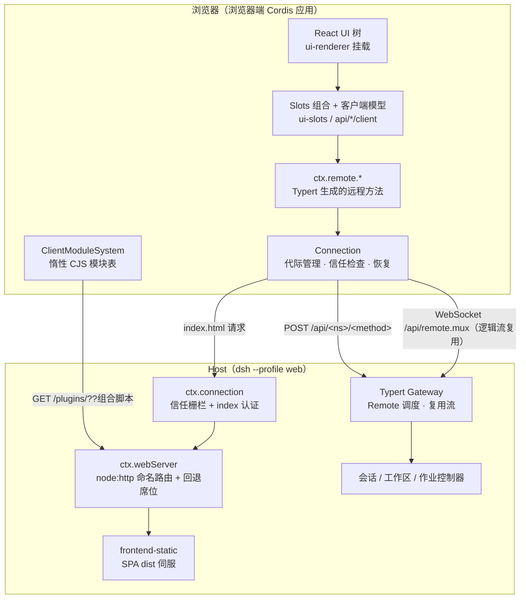
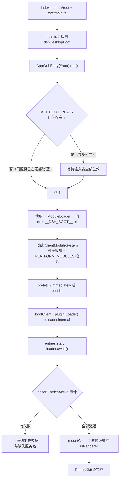
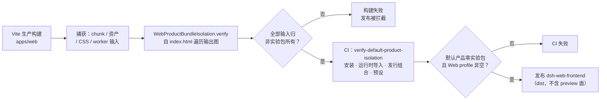

本页面向中级开发者，系统讲解 DeepSeek Harness 的浏览器客户端（Web App）如何组织三个正交关注点：**连接传输**（浏览器如何与 Host 通信、断线如何恢复）、**UI 插件模块**（浏览器端 Cordis 插件如何被发现、加载、组合与热替换），以及**产品隔离**（构建期如何保证默认产品不含实验性包）。阅读本页前建议先了解 [Host/Client 双聚合与 Typert 远程调用](14-host-client-shuang-ju-he-yu-typert-yuan-cheng-diao-yong-tsconfig-chai-fen-remote-sheng-ming-yu-rpc-wang-guan) 中的双面构建模型。

## 一、全景分层：从 Host 状态到 React 树

Web 客户端是一个运行在浏览器中的 Cordis 应用，由独立加载的插件装配而成。整个技术栈的依赖方向是单向的：**Host 状态 → Remote 传输 → 客户端模型 → UI 适配器 → 会话/呈现 → Slots → React**；用户操作则通过闭包注入的 Client 服务或生成的 Remote 命名空间原路返回。呈现组件永远不会直接拿到 `ctx`——服务与模型对象留在插件的 `apply` 闭包里，只以回调与可观察源的形式投影给组件。

| 层 | 主要归属包 | 职责 |
|---|---|---|
| Host 应用 | 业务服务与 `packages/api/*-controller` 的 Host 面 | 权威状态、持久化、变更顺序、访问策略、流生产 |
| 传输与 API 装配 | `client/connection`、`api/gateway`、`api/remotes` | 建立连接代际、暴露生成的 `ctx.remote` 方法与流、转发选定的 Cordis 事件 |
| 客户端模型 | `api/session-controller/client`、`api/workspace-controller/client` | 维护 React 无关的 Host 状态镜像，解决流/一元竞态，暴露窄命令服务 |
| UI 适配器 | `client/ui-session`、`client/ui-workspace` | 把模型可观察量转换成 Slot 源，拥有视图级导航与状态策略 |
| 会话数据 | `client/ui-conversation`、`ui-chat`、`ui-trajectory` 等 | 把标准事件装配成独立目标快照，拥有会话外壳与输入流 |
| 组合与渲染 | `client/ui-slots`、`client/ui-renderer`、`client/ui-layout` | 声明扩展位置、派生组件 props、把可观察量绑定到 React hooks |

Sources: [web-client.md](docs/subsystems/web-client.md#L13-L27)

应用壳（shell）本身被做成一个库：`@deepseek-ai/dsh-client-web` 导出 `AppWebEntry`、静态模块表与 `applyIndexInjections`；而 `apps/web`（npm 名 `@deepseek-ai/dsh-web-frontend`）只是一个 Vite 构建入口，其 `dist/` 由 `apps/cli` 的 `dsh web` 命令伺服。这意味着"前端"与"伺服前端的主机"是两个独立发布物——同一个浏览器客户端被 Web、桌面（Electron）与静态 worker 预览三种载体复用。

Sources: [index.ts](packages/client/web/src/index.ts#L7-L12), [package.json](apps/web/package.json#L4-L5)

上图需要的前置知识：`ctx.webServer` 是 Host 侧唯一的 `node:http` 载体插件，`ctx.connection` 是其上的信任与认证层，而浏览器端的 `Connection` 是所有 RPC 与逻辑流共用的物理载体。三者共同构成"传输"这一层，下文逐一展开。

Sources: [web-server.md](docs/subsystems/web-server.md#L1-L15), [web-client.md](docs/subsystems/web-client.md#L33-L39)

## 二、连接传输：`/api` 载体、信任栅栏与代际恢复

### 2.1 Host 侧载体：命名路由、回退席位与认证

`dsh-host-webserver` 是浏览器的 HTTP 载体：单个 `node:http` 插件提供 `ctx.webServer` 服务，内含命名路由注册表（`exact` 精确匹配优先，其次最长前缀，最后是唯一所有者的**回退席位**）、可选 gzip 压缩、index.html 变换回调。路由按 `(kind, path)` 全局唯一，注册顺序不携带请求语义——回退席位默认由 `frontend-static` 认领，用于伺服 SPA 构建产物。监听失败（如端口占用）会拒绝初始化并让启动过程报告失败的 fiber。

Sources: [web-server.md](docs/subsystems/web-server.md#L1-L15), [web-server.md](docs/subsystems/web-server.md#L58-L66)

Host 的 `ctx.connection`（`HostConnectionHandle`）提供信任与认证原语：`createSharedFetchHandler('/api')` 组装共享通道的 Fetch 处理器；`requestRejection`/`admit` 应用 Host/Origin 检查与浏览器认证；`authorizeIndex` 在前端 index 请求上执行令牌换 Cookie——有效的进程令牌收到 303 重定向加持久 Cookie，已有有效 Cookie 直接伺服，其余一律 401。`authenticatedUrl` 则把新鲜进程令牌附到应用 URL 上，供启动时打印。

Sources: [web-server.md](docs/subsystems/web-server.md#L76-L124), [frontend-static/README.md](packages/host/frontend-static/README.md#L32-L39)

### 2.2 客户端侧：Connection 与 Gateway 的职责切分

浏览器端的职责切分非常明确：**Connection 拥有请求 URL 解析、关联、`/api` 载体、信任检查、精确 Fetch 路由与连接代际**；**API Gateway 拥有 Remote 调度、取消、逻辑流与选定的 Host 事件转发**。一次 Remote 调用的形态是 `connection.rpc.call('/api', '<namespace>/<method>', { args }, signal)`，HTTP 载体将其映射为 `POST /api/<namespace>/<method>`，载荷只含命名的 `args` 对象；响应信封按 `rpcId` 校验关联，含 `Uint8Array` 的结果走 multipart 二进制通道。

Sources: [web-client.md](docs/subsystems/web-client.md#L33-L39), [api-gateway.md](docs/api-gateway.md#L119-L127), [rpc.ts](packages/client/connection/src/client/rpc.ts#L34-L81)

连接代际（generation）是整套恢复语义的核心。内部 `$events` 逻辑流就是代际源：它的 `ready` 首帧携带 Host home（用于路径显示缩写），并在 Host 监听器挂载之后、任何控制器开始基线读取之前确立代际。`ConnectionGenerationSource` 的契约是：先挂好增量监听再调用 `ready`，此后保持挂起直到代际丢失或 `signal` 中止。

Sources: [web-client.md](docs/subsystems/web-client.md#L35-L39), [connection.ts](packages/client/connection/src/client/connection.ts#L42-L70)

### 2.3 断线恢复：物理与逻辑分离

物理与逻辑恢复是**分离**的：Gateway 的 mux 负责恢复物理 WebSocket；每个 `RemoteStream` 在 Connection 发布可用新代际时各自重开自己的逻辑源。载体失败可重试，而业务错误、畸形首帧或协议违规则终止流。`ConnectionController` 实现了带抖动的指数退避（`backoffBaseMs × factor^(n-1)` 封顶 `backoffMaxMs`）、浏览器离线时暂停重试、手动 `reconnect()` 立即重置尝试序列，以及就绪看门狗——握手慢于 `generationReadyWarnMs` 先告警，超过 `generationReadyTimeoutMs` 则取消该代际重来。

Sources: [web-client.md](docs/subsystems/web-client.md#L67-L69), [connection.ts](packages/client/connection/src/client/connection.ts#L74-L143), [connection.ts](packages/client/connection/src/client/connection.ts#L291-L323)

关键设计决策是**不存在**单一的 `Runtime`、`HostFrame` 或万能 `resync()` API——每个客户端模型按自己数据的语义定义替换或续传策略：

| 数据形态 | 断线后的恢复语义 |
|---|---|
| 持久会话日志 | 校验逻辑序号区间，从每个代际的开头快照整窗替换；`page()` 供给更早历史并修复区间缺口 |
| 会话控制流 / 工作区流 | 断线期间保留最后发布值，新代际开头基线到达后原子替换 |
| 普通转发通知 | 不重放；有状态域需要基线、游标或显式查询 |

Sources: [web-client.md](docs/subsystems/web-client.md#L71-L77)

### 2.4 产品组装：`dsh --profile web` 的启动面

Host 侧的应用由 `dsh-web-app` 组合包定义：`dsh --profile web` 启动后打印携带新鲜进程令牌的 `dsh web:` URL 行并（非 SSH 时）打开默认浏览器。这行 URL 与浏览器打开是**就绪信号**——只在 Loader 树稳定、必需启动审计通过且 Connection 认证可用之后才发生。默认只接受本机回退连接；`--host 0.0.0.0` 会被启动期以安全为由拒绝，LAN 信任在启动时一次性采样（回退绑定不派生 LAN 地址，全接口绑定则把每个非内部 IPv4 字面量并入 `/api` 浏览器信任栅栏）。

Sources: [web-app/README.md](packages/bundle/web-app/README.md#L10-L16), [web-app/README.md](packages/bundle/web-app/README.md#L38-L60), [web-app/README.md](packages/bundle/web-app/README.md#L104-L119)

## 三、浏览器启动链：Boot Graph、惰性 CJS 模块系统与挂载

### 3.1 启动注入：`window.__DSH_BOOT__` 与注入表

Host 把组合好的 `WebBootGraph` 写到 `window.__DSH_BOOT__`，并在解析器预加载的脚本执行之前安装浏览器模块加载器门面 `window.__ModuleLoader__`。伺服的 index.html 由 Host 渲染：结构化注入表（global / script / script-src / script-preload / style / html 六种行）先落为 HTML 文本，`frontend-static` 再在 `<head>` 开头拼接 `<base href="./">` 冻结入口目录。浏览器端 `applyIndexInjections` 是同一张表的页面侧解释器——静态 worker 页面没有伺服 HTML，便直接按表顺序执行行；global 行保证先于读取它的脚本生效。

Sources: [web-client.md](docs/subsystems/web-client.md#L29-L31), [apply-injections.ts](packages/client/web/src/apply-injections.ts#L1-L15), [frontend-static/README.md](packages/host/frontend-static/README.md#L44-L48)

`apps/web/index.html` 本身极简：`#root` 挂载点加一个 `/src/main.ts` 模块入口。`main.ts` 做三件事：检查 `#root` 存在并构造 `AppWebEntry`；探测 `dshDesktopBoot` 全局判断是否运行在 Electron 载体中——桌面分支通过 `desktop.ready()` 拿到注入表与流基址，写入 `__DSH_TRANSPORT__` 并执行注入后再放行 `__DSH_BOOT_READY__` 门闩；最后 `entry.run()` 启动加载器。任何阶段的失败经由 `onFailure` 回调报告给载体（浏览器载体则渲染在 boot 页上）。

Sources: [index.html](apps/web/index.html#L10-L16), [main.ts](apps/web/src/main.ts#L7-L41)

### 3.2 启动内核与静态种子模块

`AppWebEntry.run()` 的流程是：等待 `__DSH_BOOT_READY__` 门闩 → 要求 `window.__ModuleLoader__` 门面存在 → 可选读取 `__DSH_TRANSPORT__.loadBundle`（worker 预览页用注入传输接管 bundle 字节）→ 用 `getStaticModules()` 的种子表创建模块系统 → 预取 `immediately` 档位的 bundle → 新建根 `Context` → `bootClient` 逐条目激活 → 安装 Electron 窗口拖拽矩形召回器 → `mountClient` 移交挂载点。预取只提前传输，失败由 Loader 导入重试并上报。

Sources: [boot.ts](packages/client/web/src/boot.ts#L49-L95), [boot.ts](packages/client/web/src/boot.ts#L104-L124)

种子表是整个模块系统的**平台单例契约**：react、react/jsx-runtime、react-dom、react-dom/client、vendored cordis、client-store、ui-slots、ui-primitives、ui-dockkit 共 9 个模块以 shell 静态导入的实体共享，所有 bundle 的 require 都解析到同一实例。`satisfies Record<PlatformModule, unknown>` 投影契约保证：往 `PLATFORM_MODULES` 加一个平台字而不加静态导入（或反之）会直接编译失败，而不是漂移成运行时 require 未命中。

Sources: [seed.ts](packages/client/web/src/seed.ts#L1-L40)

### 3.3 装配、审计与渲染器挂载

`bootClient` 的装配序列：`ctx.plugin(Loader)` 挂载 vendored Cordis Loader，`loader.internal = modules` 注入模块系统，把 `internal/status` 纤维状态投影为 boot 页标签，为每个 manifest 行标 `loading` 后经 `entries.start` 启动，随后 `loader.await()` 等待静默，最后 `assertEntriesActive` 审计——无 fiber 的条目带出模块系统记录的导入错误；pending 条目则列出它在等待的全部缺失服务名。这使插件失败在 boot 页上可直接诊断，而不是静默丢块。

Sources: [boot-client.ts](packages/client/web/src/boot-client.ts#L40-L90)

渲染器挂载走**依赖纤维**：`mountClient` 用 `ctx.inject(['uiRenderer'], ...)` 挂载，挂载副作用在 `uiRenderer` 服务被提供时安装、被替换时重装——替换渲染器服务即重挂整个应用。这是 Web 与桌面测试载体共享的同一条启动链。

Sources: [mount.ts](packages/client/web/src/mount.ts#L1-L25)

Sources: [boot.ts](packages/client/web/src/boot.ts#L49-L95)

### 3.4 独立伺服的拒绝与 worker 预览面

`apps/web` 明确**不是**独立应用：裸 Vite 的 serve/preview 命令会抛错——"bare Vite cannot inject `window.__DSH_BOOT__`"，因为脱离 Host 就没有 boot 图。仓库检出请用 `pnpm dsh web`，客户端插件 HMR 用 `pnpm run dev:web`。另一个例外是实验性的 worker 预览面：构建时 `emitPreviewPage` 插件把 bootstrap 入口标签拼进 index.html 的副本生成 `preview.html`，其入口 `preview.ts` 先经实验包的 source 阶段选择器、再连 Worker Host，其后与伺服启动链逐字相同。该面独立于发布载荷（见第五节）。

Sources: [vite.config.ts](apps/web/vite.config.ts#L14-L16), [vite.config.ts](apps/web/vite.config.ts#L58-L92), [preview.ts](apps/web/src/preview.ts#L1-L15)

## 四、UI 插件模块：`dsh.client` 清单、组合脚本与 Slots 组合

### 4.1 线协议：条目图与组合脚本

插件加入浏览器插件表的唯一途径是在 package.json 声明 `dsh.client`（`platform: 'web'`、可选 `inject` 依赖边、可选 `immediately` 一档预取），并从 `exports["./client"]` 导出构建好的 bundle。Host 的 Node 半部增量扫描 Loader 条目，把每个包组合为 `WebBootEntry` 行（条目名 == 包名；`url` 是**修订版单资源组合引用**，相对文档解析；`rev` 由 mtime/ctime/size 派生，无哈希可执行字节）与 `WebBootBatch` 组合脚本描述符（`bootstrap` 阻塞解析阶段 / `application` 预加载阶段）。条目图按模块图顺序排列——动态包行先于 `external` 请求它的行；而 **Cordis 激活顺序与此无关**，仍由纤维服务等待决定。

Sources: [client-modules.md](docs/subsystems/client-modules.md#L18-L90)

组合脚本走 `GET/HEAD /plugins/??<包a>/client.js,<包b>/client.js&rev=<rev>` 路由：脚本在首次 GET 时拼接一次，末尾携带只含组合查询的 sourceMappingURL。浏览器端的 `ClientModuleSystem` 是惰性 CommonJS 表：加载 bundle 只是注册其工厂，物化条目才运行工厂并同步解析 require。传输失败（脚本未执行）可在同 URL 重试一次；而脚本已执行却未注册该行（解析错误或中途抛出）则永不重放——重放会在首个重复注册处再次中断——该行回退到 Host 为每个包都伺服的单资源 URL。

Sources: [client-modules.md](docs/subsystems/client-modules.md#L106-L110), [system.ts](packages/client/modules/src/client/system.ts#L13-L27), [system.ts](packages/client/modules/src/client/system.ts#L160-L176)

`ctx.clientModules`（`ClientModuleRegistry`）服务暴露 `graph()`、`fetchBundle()`、`rebuilt()`、`onGraphChanged()` 等读取与重建面；扫描按包增量进行，没有全量重扫路径——每次 Cordis `internal/plugin` 发射只标记对应条目名 dirty，微任务冲刷后与活 Loader 条目对账。

Sources: [client-modules.md](docs/subsystems/client-modules.md#L154-L185)

### 4.2 HMR：一次一个插件的热替换

发行 Web 组合挂载 `dsh-client-hmr` 传输：Host 半部 stat 轮询每个包的盖章产物并经 `/plugins/events` SSE 通道转发图变更与重建通知，每个新连接收到当前全图。浏览器半部在 `rebuilt` 帧上：先在旧 fiber 仍在服务时失效旧模块并预取单资源脚本，再删除注册表运行时、排空旧 fiber、清除其条目引用并移除其拥有的样式（工厂物化期间注入的 `<style>` 由 `claimStyles` 打上 `data-plugin` 归属标记）。级联靠 Cordis 自身完成——纤维的激活纪元串接其服务提供者 uid，替换提供者 fiber 自动重级联所有依赖方，HMR 侧零簿记。React 状态在重载的插件内丢失，而会话、工作区与连接状态存活。

Sources: [hmr/README.md](packages/client/hmr/README.md#L52-L60), [system.ts](packages/client/modules/src/client/system.ts#L65-L76), [hmr/README.md](packages/client/hmr/README.md#L24-L27)

### 4.3 Slots：类型化 React 组合系统

功能插件之间不互相运行时导入——跨包 UI 组合通过 **Slots** 完成。`SlotMap` 是编译期注册表：包声明合并出 key、基数、作用域、所有者 props 与可选槽级注入面；声明子的 `children` 条目让 key 变活、授权父条目的 `renderSlot`/`renderSlotChain` 调用。`root` 是唯一内建声明，由 `ui-renderer` 直接经 Cordis 服务渲染 `ctx.slots.renderSlot('root', {})`，其余全部经父条目渲染。注册与声明跟随 Cordis 副作用生命周期——销毁一个条目即递归塌缩它声明的子槽，可选功能条目因此能让整棵子树作为一个生命周期单元出现或消失。

Sources: [slots.md](docs/subsystems/slots.md#L18-L33)

| 轴 | 值 | 语义 |
|---|---|---|
| 基数 cardinality | `single` | 单格，活跃优先级胜者渲染 |
| | `list` | 按 `id` 寻址、按 `order` 排序的加法列表 |
| | `keyed` | 所有者派发 `entryKey`，匹配格获得键专属 props |
| | `chain` | 每条目供纯 `select(owner)`，优先级序首个非空结果渲染 |
| 作用域 scope | `root` | 一个根作用域组件与 store 实例 |
| | `session-maybe` | 继承外围 Provider 绑定但可无绑定渲染 |
| | `session` | 必须有已解析的 Provider 绑定 |

Sources: [slots.md](docs/subsystems/slots.md#L42-L52)

组件通过注册时装配的输入获得能力：框架级标准 props（`useSessions`、`useSession`、`useProjection`、`useConversation`、`useChat` 等）由 shipped 适配器按目标槽作用域注入；注册项的 `inject` 工厂在插件 `apply` 世界运行、可闭包注入 Cordis 服务；保留的 `hooks` 对象把裸 `getSnapshot`/`subscribe` 源转换成缓存绑定的 hook props——组件自身永远不接触 `useSyncExternalStore`（`ui-renderer` 是唯一绑定裸可观察量的包）。扩展插件的标准注入模式是 `ctx.slots.inject(key, callback)`：回调对声明子的每次注册执行并返回自己的注册。

Sources: [slots.md](docs/subsystems/slots.md#L96-L128)

### 4.4 包边界规则

功能插件包可经 `import type` 共享声明，但**不得**运行时导入或再导出另一功能插件的值。跨包行为走注入的 Cordis 服务，跨包 UI 走 Slots。需要共享的运行时值必须落在无功能生命周期的窄静态所有者（`client/store`、`ui-primitives` 或浏览器安全工具包）中；传输与生成的 API 装配允许导入运行时贡献，因为"装配一个协议"正是它们的显式职责。仓库 `packages/client` 下现有 52 个 `ui-*` 功能包与 7 个运行时支撑包（connection、modules、store、slots、renderer 等），全部遵循这套边界。

Sources: [web-client.md](docs/subsystems/web-client.md#L79-L88), [packages/client 目录](packages/client)

## 五、产品隔离：三道构建期与产品定义门禁

"产品隔离"回答一个问题：**默认发行给用户的 Web 产品，如何被机器证明不含任何 `@deepseek-ai/dsh-experimental-*` 实验包**。仓库用三道独立的门禁从不同粒度强制执行，任一违规都会在构建或 CI 阶段拦截发布。

| 门禁 | 执行点 | 检查粒度 | 违规后果 |
|---|---|---|---|
| Vite 插件捕获 | 每次生产构建 | chunk / 资产 / CSS / worker 的实际输入 | 构建失败（发布前） |
| 输出图遍历 | 每次生产构建 | index.html 可达的完整输出图 | 构建失败（发布前） |
| 默认产品审计 | CI（verify 脚本） | 安装、运行时导入、发行组合、预设、index 入口 | CI 失败 |

Sources: [product-isolation.ts](apps/web/product-isolation.ts#L1-L26), [verify-default-product-isolation.ts](scripts/verify-default-product-isolation.ts#L1-L13)

### 5.1 门禁一：Vite 构建期输入捕获

`apps/web/product-isolation.ts` 导出 `productWebBundleIsolation`，返回两个 Vite 插件。捕获面覆盖四类输入：`generateBundle: pre` 阶段深拷贝每个 chunk（保留纯 CSS chunk 的模块输入，Vite 之后会移除其 JS 包装）；`experimental.renderBuiltUrl` 记录资产 URL 边；worker 子构建经注入插件记录完整 watched 输入集；CSS 侧则包裹 `vite:css` 的 `transform`，记录每次样式转换的输入文件与 `addWatchFile` 依赖。捕获在 `buildStart` 重置、`generateBundle: post` 阶段统一校验；`browserDependencyAnalysis` 是配套的只分析不落盘模式（要求 `build.write: false`）。

Sources: [product-isolation.ts](apps/web/product-isolation.ts#L28-L106)

### 5.2 门禁二：输出图遍历与实验所有权判定

`WebProductBundleIsolation.verify` 从发射的 `index.html` 出发遍历整个可达输出图：chunk 的 imports / dynamicImports / implicitlyLoadedBefore / referencedFiles / importedCss / importedAssets、公共目录引用、worker 入口全部入队。对每个模块执行 `assertInput`，其判定链是：模块 id 命中 `@deepseek-ai/dsh-experimental-*` 正则即拒绝；物理路径落在 `packages/experimental` 词法范围内即拒绝；符号链接经 `realpath` 归一后**再查一遍**；缺失输入直接拒绝（依赖 tarball 的 source-map 源除外）；外模块必须能证明已被打包；样式表必须有记录在案的转换输入。资产则要求有 `originalFileNames` 并逐个核验所有权。

Sources: [web-product-bundle-isolation.ts](scripts/web-product-bundle-isolation.ts#L129-L199), [bundle-input-isolation.ts](scripts/bundle-input-isolation.ts#L31-L52), [bundle-input-isolation.ts](scripts/bundle-input-isolation.ts#L74-L96)

### 5.3 门禁三：默认产品的定义级审计

`verifyDefaultProductIsolation` 把检查提升到产品定义层，且覆盖三类越界路径：**默认安装**（扫 `apps/*`、`packages/*/*`、`vendor`、`native/system/packages`、`python/sdk-runtime` 的 manifest 依赖图）、**运行时导入**（对非测试源码做 TypeScript AST 扫描）、**发行组合**（从 `packages/boot/app-boot/src/profile.ts` 读取字面量 `PROFILE_TEMPLATES.web.bundles` 清单，`composeEntries` 组合各 bundle 的 patch 层，要求组合出的 Web profile 至少含一个插件）。此外它还校验：默认 bundle 必须声明 `dsh.bundle.patch`、可选 bundle 不得混入默认清单、`packages/bundle/web-app/presets/*.patch.yml` 必须存在、以及 `apps/web/index.html` 的每个 `script[type=module]` 入口可静态扫描（外链 http(s) 入口直接判违规）。唯一的声明例外是 `OPTIONAL_BUNDLES`——随产品附带但无发行模板选中、依赖图独立的可选包。

Sources: [verify-default-product-isolation.ts](scripts/verify-default-product-isolation.ts#L239-L290), [verify-default-product-isolation.ts](scripts/verify-default-product-isolation.ts#L383-L413)

Sources: [web-product-bundle-isolation.ts](scripts/web-product-bundle-isolation.ts#L129-L199)

### 5.4 发布载荷的物理隔离

隔离最终落到发布物上：`@deepseek-ai/dsh-web-frontend` 的 `files` 字段只发布 `dist`，并显式排除 sourcemap、`preview.html` 与 `dist/preview`——实验性 worker 预览面（依赖 `@deepseek-ai/dsh-experimental-webworker-*`）在物理上不进入默认安装。构建端还有一条配套规则：vendored Cordis Loader 的 Node 探针经 `define` 注入 `process.versions.node = "0.0.0"`，让它选择"空 internal 槽"分支，恰好留给浏览器模块系统填充。

Sources: [package.json](apps/web/package.json#L16-L22), [vite.config.ts](apps/web/vite.config.ts#L248-L260)

## 六、构建产物布局与开发模式

### 6.1 chunk 布局：vendor 的 React 无关纪律

Vite 构建把产物划分为清晰目录：主 chunk 在 `assets/` 根、Shiki 懒语法 chunk 在 `assets/langs/`、KaTeX 字体在 `assets/fonts/`、worker 预览面在 `dist/preview/`。vendor chunk 按精确 npm 包名收敛只随依赖升级变化的重渲染家族（katex、shiki、micromark/mdast 管线），有一条硬纪律：**每个成员必须 React 无关**——rollup 会把入口与 manual chunk 共享的模块折叠进 manual chunk，一个导入 react 的成员就会把唯一共享的 React 副本拖进 vendor。不在清单内的一切（react 家族、vendored cordis、全部工作区代码）留在默认 `index` chunk，编辑壳代码只重哈希 index，回头客户端保住 vendor 缓存。

Sources: [vite.config.ts](apps/web/vite.config.ts#L97-L137), [vite.config.ts](apps/web/vite.config.ts#L199-L230)

`resolve.dedupe: ['react', 'react-dom']` 保证裸说明符始终从本包 node_modules 解析、不因区间漂移 ship 第二个 React 拆裂 hook 与元素身份；`base: './'` 相对资产 URL 让 `preview.html` 与伺服 index 在任意挂载基址下都解析一致。组合路由为 `/plugins/??` 的插件包**从不进入** Vite 图——它们是运行时经客户端模块系统到达的 bundle。

Sources: [vite.config.ts](apps/web/vite.config.ts#L234-L247)

### 6.2 开发模式：一条命令三个面

Web 开发只需一条命令：`pnpm run dev:web` 同时构建当前 Host、Client 与 Web 产物，启动源码 Host，并保持 Client bundle 重建。Host 经 tsx 从源启动，走 Typert 的 SRC 开发回退（装饰器初始化器记录版本化描述符 + 运行时解析参数名）；watcher 重建客户端类型发射、Client 插件与库 bundle 以及 Web 壳。**约束**：watcher 不分析 Host 装饰器、不生成 Remote Client DTS——增删装饰器或改契约后必须重跑有序的 `pnpm run build:lib`，运行中的 Client watcher 会在重打包时消费这些生成文件。

Sources: [api-gateway.md](docs/api-gateway.md#L128-L148), [dev-web.ts](scripts/dev-web.ts)

## 延伸阅读

- 理解 Remote 方法如何从 Host 服务一路生成到 `ctx.remote`：[Host/Client 双聚合与 Typert 远程调用](14-host-client-shuang-ju-he-yu-typert-yuan-cheng-diao-yong-tsconfig-chai-fen-remote-sheng-ming-yu-rpc-wang-guan)
- 理解插槽体系的框架级细节与会话事件关联：[事件域与扩展点](12-shi-jian-yu-yu-kuo-zhan-dian-hui-hua-shi-jian-agent-shi-shi-shi-jian-yu-neng-li-shi-jian-de-xuan-ze-yuan-ze)
- 浏览器客户端的 E2E 与快照验证如何组织：[快照测试与录制会话](27-kuai-zhao-ce-shi-yu-lu-zhi-hui-hua-session-sdk-acp-web-kuai-zhao-de-zu-zhi-yu-hui-fang)
- 同一浏览器客户端如何被桌面载体复用（`dshDesktopBoot` 分支的另一端）：[Electron 桌面应用：签名运行时、Desktop Host 与内置 profile](21-electron-zhuo-mian-ying-yong-qian-ming-yun-xing-shi-desktop-host-yu-nei-zhi-profile)
- 想动手添加一个 UI 插件模块：[扩展手册：添加工具、包、LLM 适配器、Remote API 与设置卡片](24-kuo-zhan-shou-ce-tian-jia-gong-ju-bao-llm-gua-pei-qi-remote-api-yu-she-zhi-qia-pian)