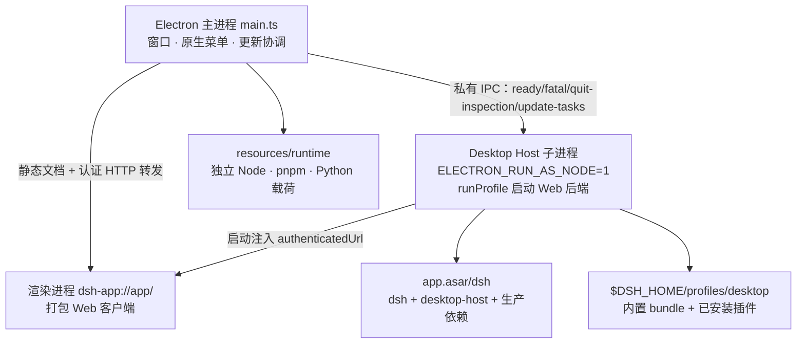
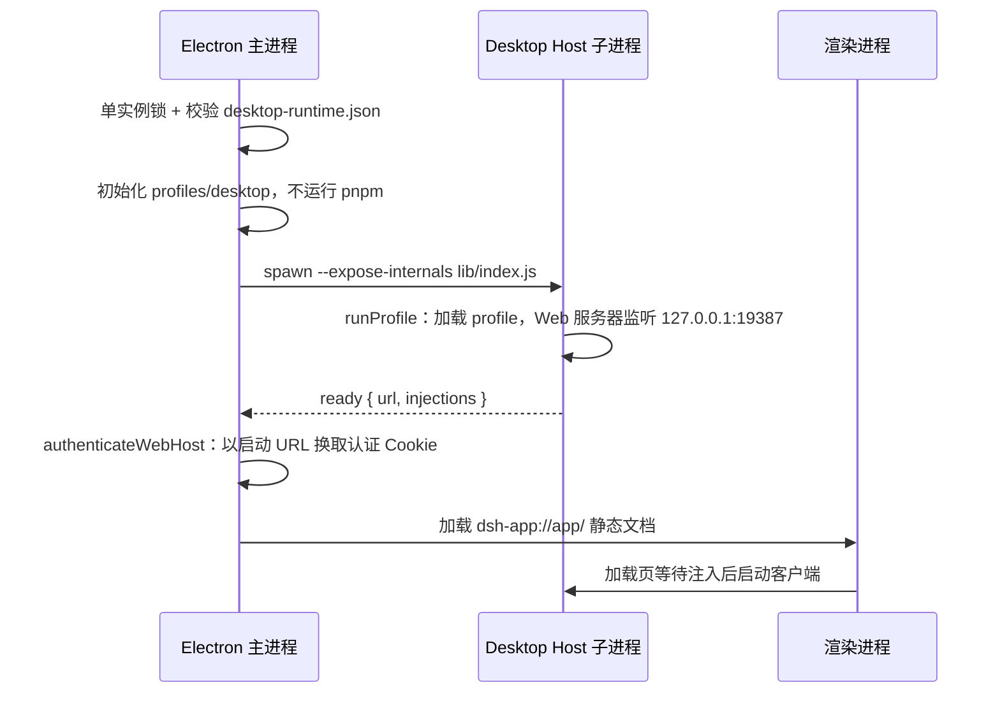

本页面向中级开发者，拆解 DeepSeek Harness 桌面端（`apps/desktop`）的三根支柱：以 RunAsNode 子进程承载完整 Web 后端的**薄壳架构**、随发布一起签名分发的**不可变运行时**，以及 Electron 独占的 **`$DSH_HOME/profiles/desktop` 内置 profile**。读完本页，你应当能回答三个问题：桌面端为什么不用系统 Node、`app.asar/dsh` 里到底装了什么、以及插件为什么装进一个 Electron 私有的 profile 目录。

## 薄壳架构：三层进程模型

桌面应用是完整 dsh Web 应用外的一层 Electron 壳：Electron 以 `ELECTRON_RUN_AS_NODE=1` 启动的子进程运行共享 profile runner，主进程立即从自定义协议 `dsh-app://app/` 加载打包内的 Web 入口，共享加载页等待 Host 启动注入后在同一文档中启动客户端；应用 HTTP 请求则由主进程认证后转发给 Host。壳本身只负责窗口、原生集成与更新编排，所有业务逻辑都运行在与 Web 版完全相同的后端代码上。

这一形态由六条关键技术决策锁定，每一条都有明确的因果链：

| 决策 | 直接结果 |
|---|---|
| 发布身份 | Electron 与 `@deepseek-ai/dsh` 始终使用同一精确版本，桌面壳 API、Web 客户端、后端与插件依赖图作为一个组合验证 |
| 运行时 | dsh 通过 `ELECTRON_RUN_AS_NODE=1` + `--expose-internals` 的 Electron 运行，包操作全部使用内置 pnpm，不要求系统 Node/pnpm |
| 包来源 | `app.asar/dsh` 携带完整生产依赖树，启动时零安装；profile 只安装外部插件 |
| 状态归属 | Electron 获取进程生命周期单实例锁，独占 `$DSH_HOME/profiles/desktop`，避免 CLI 与桌面端互相改写依赖 |
| 传输 | Electron 加载打包 Web 资源，Host 提供启动注入与经过认证的 API，Web 服务与认证共享一套实现 |
| 更新 | Electron 壳、匹配的 dsh 运行时与 pnpm 组成一个已签名更新单元，杜绝版本分裂 |

Sources: [README.zh.md](apps/desktop/README.zh.md#L5) [README.zh.md](apps/desktop/README.zh.md#L63-L73)

单实例锁在访问任何 profile 之前声明：`requestSingleInstanceLock()` 失败即退出，后续启动路由给已有实例并聚焦主窗口。这与 profile 事务锁（见下文）共同构成“状态归属”决策的两级防线——前者保证同一时刻只有一个壳进程，后者保证 profile 文件操作互斥。

Sources: [single-instance.ts](apps/desktop/src/single-instance.ts#L16-L26) [README.zh.md](apps/desktop/README.zh.md#L68)

## 启动时序：从窗口到 Host 就绪

启动是"壳先行、Host 随后、注入收尾”的三段式。主进程先加载屏幕外的共享 Web 加载页，同时校验运行时描述符并准备 profile，然后才拉起 Host；Host 完成应用引导后通过私有 IPC 上报 `ready`，壳换取认证 Cookie 并把启动注入交给渲染进程。

Sources: [README.zh.md](apps/desktop/README.zh.md#L97-L100) [main.ts](apps/desktop/src/main.ts#L408-L420)

`ready` 消息的 `url` 是 `ctx.connection.authenticatedUrl(...)` 生成的带认证地址，`injections` 则来自 `ctx.webServer.collectIndexInjections()`——它们是共享加载页启动客户端所需的启动注入。壳收到后调用 `authenticateWebHost` 把启动 URL 兑换成绑定 Host 授权的浏览器 Cookie，此后所有 `dsh-app://app` 发起的请求由 `forwardWebRequest` 以该 Cookie 转发，并强制 origin 校验、剥离逐跳头。渲染进程从不直接接触 Host 端口之外的任何认证材料。

Sources: [index.ts](apps/desktop-host/src/index.ts#L87-L92) [web-document.ts](apps/desktop/src/web-document.ts#L43-L50) [web-document.ts](apps/desktop/src/web-document.ts#L77-L90)

## Desktop Host：私有 Node 模式后端

`@deepseek-ai/dsh-desktop-host` 是只随 Desktop 发布的私有包，其依赖闭包精确枚举了桌面后端所需的能力面：app-boot 的 profile 加载、`dsh` 的 profile-boot 运行器、webserver/connection 的宿主服务，以及 jobs、schedule、workspace、deepseek-account 等被桌面专属插件消费的服务。它的 `lib/index.js` 是 Host 进程唯一入口，也是运行时描述符中强制校验存在的文件之一。

Sources: [package.json](apps/desktop-host/package.json#L1-L29) [core-package-set.ts](apps/desktop/src/core-package-set.ts#L17-L27)

入口逻辑围绕 `runProfile` 展开：以 `desktop` 为 profile 名、`--no-open --port 19387` 为启动参数引导应用；传入的 `packageManager` 把包管理器指回 Electron 自身（`process.execPath` + `--expose-internals`）与随包 pnpm，环境变量 `DSH_DESKTOP_NODE_EXECUTABLE` 和前缀化 PATH 只作用于包操作进程。这使得 Creator 与 Web 插件管理器在 Electron Node 模式下无需系统 PATH 中存在 pnpm。

Sources: [index.ts](apps/desktop-host/src/index.ts#L16-L47) [README.zh.md](apps/desktop/README.zh.md#L11)

壳与 Host 之间是一条类型化的私有 IPC 协议（当前代数 `DESKTOP_HOST_PROTOCOL_VERSION = 4`），全部消息在两侧都经过形状校验：

| 方向 | 消息 | 载荷 | 语义 |
|---|---|---|---|
| Host → 壳 | `ready` | `url`、`injections` | 应用已就绪，附认证地址与启动注入 |
| Host → 壳 | `fatal` | `message`、`diagnostic` | 启动失败；诊断上限 64 Ki 字符，含完整 inspect 结果 |
| Host → 壳 | `platform-session` | `session` 或 `null` | Platform 凭据更新，永不转发给渲染进程 |
| Host → 壳 | `shutdown-complete` | 无 | Host 树已关闭，可安全退出 |
| Host → 壳 | `quit-inspection` | `requestId`、`activeTasks`、`scheduledTasks` | 退出影响检查的关联应答 |
| Host → 壳 | `update-tasks` | `requestId`、`active` | 更新准入检查的关联应答 |
| 壳 → Host | `shutdown` / `quit-inspection` / `update-tasks` | 请求 ID 与动作 | 控制请求，错误时以保守值应答 |

Sources: [host-protocol.ts](apps/desktop/src/host-protocol.ts#L1-L5) [host-process.ts](apps/desktop/src/host-process.ts#L12-L47) [index.ts](apps/desktop-host/src/index.ts#L74-L90)

Host 启动后在应用上下文上安装四个桌面专属服务，它们是"私有 Host"与通用 Web 后端的全部差异所在：

1. **更新任务控制**（`installDesktopUpdateTaskControl`）：`inspect` 检查是否有活动任务；`lock` 拒绝新的 `connection/request`（直接 503）、排空已准入请求后复查；`unlock` 释放并用代数防超驰。
2. **退出检查**（`installDesktopQuitInspection`）：汇总 `activeTasks`（运行中代理、排队消息、运行/停止中的后台任务）与 `scheduledTasks`（已加载会话中武装的定时提醒，经 `workspace/session-activity` 瀑布查询）；壳侧等待上限 2 秒，超时按"未知即需确认"处理。
3. **Platform 会话发布**（`installPlatformSessionPublisher`）：订阅 `deepseekAccount` 依赖的生命周期，随账号状态变化发布或清除会话，供内嵌 Platform 视图使用。
4. **Office 引擎解析与技能**（`installOfficeEngineResolution` + `desktopOffice` 插件）：把 ASAR 内的 `libreoffice-kit-*` 原生引擎重定向到 `.unpacked` 物理目录，并注册 Office 创作技能。

Sources: [update-tasks.ts](apps/desktop-host/src/update-tasks.ts#L16-L63) [quit-inspection.ts](apps/desktop-host/src/quit-inspection.ts#L10-L41) [host-process.ts](apps/desktop/src/host-process.ts#L62-L68) [platform-session.ts](apps/desktop-host/src/platform-session.ts#L11-L37) [office.ts](apps/desktop-host/src/office.ts#L13-L39) [office-engine.ts](apps/desktop-host/src/office-engine.ts#L23-L45)

`hasDesktopActiveTasks` 的判定口径被更新与退出两条链路共享：任一代理处于 `running`、收件箱 `nextTurn`/`nextStep` 非空，或全局与每个代理的作业中存在 `running`/`stopping`，即视为有可中断工作。单一事实来源避免了"更新说安全、退出却要确认"的自相矛盾。

Sources: [update-tasks.ts](apps/desktop-host/src/update-tasks.ts#L16-L23)

## 签名运行时：desktop-runtime.json 与核心包集合

每个 Desktop 发布携带一份不可变运行时描述符 `desktop-runtime.json`，置于 `resources/app.asar/dsh` 根部。它声明 schema 版本、发布标识、目标平台/架构、共享包表，以及**每一个文件**的字节数、SHA-256 与可执行位；`readDesktopRuntime` 启动时校验共享包记录（`@deepseek-ai/dsh` 与 desktop-host 必须与发布版本一致），`verifyDesktopRuntime` 则在打包 afterPack 阶段逐文件验证。

Sources: [runtime-tree.ts](apps/desktop/src/runtime-tree.ts#L14-L15) [runtime-tree.ts](apps/desktop/src/runtime-tree.ts#L47-L68) [runtime-tree.ts](apps/desktop/src/runtime-tree.ts#L174-L215)

发布标识 `DesktopRelease` 把四项事实钉在一起：产品版本（Electron 与 dsh 强制同版，打包前即断言）、Host 生命周期协议代数、Electron 的 Node 版本与锁定 pnpm 版本。任何一项失配都会让准备阶段直接失败，而不是带着未验证的组合出厂。

| 字段 | 来源 | 作用 |
|---|---|---|
| `version` | 桌面包与根包 manifest 双读比对 | 更新比较、产物命名、运行时一致性锚点 |
| `hostProtocolVersion` | `DESKTOP_HOST_PROTOCOL_VERSION`（当前 4） | 壳与 Host 私有 IPC 的代数兼容 |
| `nodeVersion` | 运行时准备产出的 `versions.json` | 原生模块 ABI 边界 |
| `pnpmVersion` | 同上 | 插件安装行为一致性 |

Sources: [prepare-dsh.ts](apps/desktop/scripts/prepare-dsh.ts#L53-L67) [release.ts](apps/desktop/src/release.ts#L7-L14)

核心包集合解决"离线且零信任"的包来源问题：`prepare-package-set.ts` 从 dsh 与 desktop-host 两个根遍历 workspace 依赖闭包，产出本地 npm tarball（`desktop-packages/`）与描述符（`desktop-packages.json`，含每包 sha512 完整性）；安装时以精确的 `file:./desktop-packages/<file>` overrides 把每一个第一方包钉死在本地集合上，`verifyDesktopCoreLockfile` 再反向检查锁文件——任何核心包名经注册表解析都会让构建失败。验证还包括“描述符与目录内容严格互不包含额外 tarball"。

Sources: [prepare-package-set.ts](apps/desktop/scripts/prepare-package-set.ts#L53-L80) [core-package-set.ts](apps/desktop/src/core-package-set.ts#L135-L183)

物化运行时使用目标自带的 Node 与 pnpm 完成（连 registry、store、XDG 目录都指向一次性构建状态），随后由[运行时文件策略](apps/desktop/scripts/runtime-file-policy.ts)过滤不可变副本：剔除包管理器元数据、source map、TypeScript 声明与构建缓存、其他平台的 LibreOffice 引擎与 node-pty 预编译产物等；未识别资产与目标运行时二进制一律保留。打包应用只运行编译后的 JavaScript 与预生成 Typert 元数据，不携带 TypeScript 插件源。

Sources: [prepare-dsh.ts](apps/desktop/scripts/prepare-dsh.ts#L69-L110) [runtime-file-policy.ts](apps/desktop/scripts/runtime-file-policy.ts#L12-L44) [README.zh.md](apps/desktop/README.zh.md#L210-L216)

## 打包产物布局

electron-builder 配置把上述材料装配成如下布局，`electronFuses.runAsNode` 保证 RunAsNode 子进程可用，Windows NSIS 为按用户安装并启用差分升级：

| 安装后路径 | 内容 | 说明 |
|---|---|---|
| `app.asar/lib/main.js` 等 | Electron 主进程与各隔离 preload | 主 bundle 内联 workspace devDependencies，裸导入仅剩 `electron`、Node 内置与 manifest `dependencies` |
| `app.asar/renderer/` | 更新弹窗、强更蒙层、欢迎页等原生 HTML | 每个文档使用独立 preload 与 IPC 校验 |
| `app.asar/dsh/` | dsh + desktop-host + 完整生产依赖树 + `desktop-runtime.json` | 启动零安装的不可变运行时 |
| `app.asar.unpacked/` | `.node`/`.dylib`/`.dll`/`.exe`、rg、所选平台 `libreoffice-kit-*` | 原生文件移出 ASAR；Windows 上签名后逐字节比对 |
| `resources/runtime/` | `primary-runtime`（独立 Node、pnpm、Python 分发包）与 `runtime/bin` | `runtime/bin` 仅进入包安装进程 PATH，不进入 PTC/agent shell |

Sources: [electron-builder-config.mjs](apps/desktop/scripts/electron-builder-config.mjs#L100-L149) [electron-builder-config.mjs](apps/desktop/scripts/electron-builder-config.mjs#L168-L195) [README.zh.md](apps/desktop/README.zh.md#L49-L59)

## 内置 profile：$DSH_HOME/profiles/desktop

Electron 独占 `$DSH_HOME/profiles/desktop` 目录及其 `lock` 文件。profile 的 `package.json` 由 `dsh.profile.bundles` 声明有序 bundle 层——与 Web 共享模板完全一致的 `['@deepseek-ai/dsh-base', '@deepseek-ai/dsh-web-app']`，已启用的第三方插件追加在后；用户自己的补丁层则是 profile 目录下的 `cordis.patch.yml`，叠加于所有 bundle 层之后。这套"bundle 有序叠加 + 用户补丁收尾”的机制与 CLI/ACP 等其他 profile 家族同构，细节见 [Profile 与组合包](10-profile-yu-zu-he-bao-dsh-base-patch-die-jia-shun-xu-yu-yun-xing-shi-zu-zhuang-ji-zhi)。

Sources: [paths.ts](apps/desktop/src/paths.ts#L12-L23) [profile.ts](packages/boot/app-boot/src/profile.ts#L27-L46) [profile.ts](packages/boot/app-boot/src/profile.ts#L141-L154) [project-manager.ts](apps/desktop/src/project-manager.ts#L32)

`DesktopProjectManager.applyRelease` 是"验证但不安装”的关键：在 profile 事务锁内读取并校验运行时描述符、迁移工作区设置、用 `initProfile` 创建缺失的 manifest/空用户补丁/pnpm workspace 文件（不覆盖已有文件）、删除早期 Link 后端留下的 `.dsh-module-fallback` 投影——**启动路径从不运行 pnpm**。事务锁以 PID 文件实现：读到已有锁时用 `process.kill(pid, 0)` 探活，进程已死才清理重建，避免崩溃遗留死锁。

Sources: [project-manager.ts](apps/desktop/src/project-manager.ts#L83-L130) [README.zh.md](apps/desktop/README.zh.md#L99-L100)

致命恢复走同一条锁：`disableAllPlugins` 在锁内调用共享 app-boot 的 `sanitizeProfile`，按 Web 模板的内置 bundle 列表禁用第三方 bundle，并把 `cordis.patch.yml` 重命名为 `cordis.patch.yml.bak-<时间戳>`（重名追加序号），无需解析补丁内容。恢复操作等待 Host 关闭后才执行，因此即使 Host 完全无法启动，原生对话框也能把应用带回可引导状态。

Sources: [project-manager.ts](apps/desktop/src/project-manager.ts#L76-L77) [README.zh.md](apps/desktop/README.zh.md#L103-L105) [README.zh.md](apps/desktop/README.zh.md#L125)

Electron 的 Node 版本、平台或架构变化时，已安装插件保留不删——原生兼容性问题推迟到加载时报错，可由内置 pnpm 修复。主应用的“插件”页面通过共享[插件管理器](../../packages/boot/plugin-manager/README.zh.md)操作该 profile，包操作使用内置 pnpm 与正常的用户/profile 配置，与 Web 端行为一致。

Sources: [README.zh.md](apps/desktop/README.zh.md#L101-L105)

### Office 技能与内置工作区依赖

desktop-host 的 `desktop-office` 插件把两件事绑进内置 profile：其一是 `workspaceDependencies`（`load_workspace_dependencies` 工具首次使用时把随包 Python 载荷——numpy、pandas、python-docx、python-pptx、openpyxl、Pillow、lxml、XlsxWriter 及依赖——离线安装到 `$DSH_HOME/dsh-runtimes/dsh-primary-runtime`）；其二是 `officeSkills`，默认注册 `office-docx`、`office-pptx`、`office-xlsx` 三个技能，资源指向 ASAR 外的 `office-skills` 目录，Node 与 CLI 分别来自主运行时与 LibreOffice kit。技能资源与原生引擎随 Desktop 版本一起发布，由 `runtime.json` 记录版本映射与组装摘要。

Sources: [office.ts](apps/desktop-host/src/office.ts#L13-L39) [README.zh.md](apps/desktop/README.zh.md#L51-L55) [README.zh.md](apps/desktop/README.zh.md#L61)

## 更新单元与退出协商

更新以“已签名单元”为单位：壳、dsh 运行时与 pnpm 同版同进退。`DesktopUpdateCoordinator` 包装 electron-updater，关闭自动下载与退出时自动安装，固定 `nightly` 通道并禁止降级；安装前经 `beforeRestart` 完成任务授权（Host 退出检查）、准入锁定与受控关停的完整链路。常规轮询以十分钟为基础间隔、±20% 随机抖动，失败指数退避上限一小时；左下角账户行呈现本地化的下载/验证/就绪/重试状态。

Sources: [update-coordinator.ts](apps/desktop/src/update-coordinator.ts#L15-L77) [README.zh.md](apps/desktop/README.zh.md#L371-L383)

所有普通退出入口都先向 Host 发起 `quit-inspection`：`activeTasks` 与更新重启检查同口径，`scheduledTasks` 只统计本次运行中已加载会话里武装的定时提醒（未加载会话的提醒不会触发，不计入）。壳侧 2 秒截止；Host 不可用或超时都按“存在未知可中断工作”处理，弹出确认而不是静默退出。强更策略（`/api/v0/check_client_update`、页面与鉴权源站白名单）在打包时写进 extraMetadata，由独立蒙层窗口执行。

Sources: [quit-inspection.ts](apps/desktop-host/src/quit-inspection.ts#L10-L41) [host-process.ts](apps/desktop/src/host-process.ts#L62-L68) [README.zh.md](apps/desktop/README.zh.md#L387-L399)

## 开发工作流：dev:desktop 与一次性项目

`pnpm run dev:desktop` 构建当前 Host、客户端 bundle、Web 前端与 Electron 壳，然后把已构建的 CLI 包、私有 desktop-host 包及其 workspace 依赖**投影**为一次性桌面 npm 项目——不从 npm 解析 dsh。三份状态彼此隔离：Harness home 在 `apps/desktop/.desktop-build/development/home`，一次性项目在 `.../project`，Electron 浏览器数据在 `.../electron-user-data`，因此会话、凭据与插件都不会污染真实环境。

Sources: [README.zh.md](apps/desktop/README.zh.md#L127-L135) [dev.ts](apps/desktop/scripts/dev.ts#L93-L125)

开发启动器为三个进程分配独立调试端口：主进程 9229、渲染进程 9222、Host 子进程 9230（经 `DSH_DESKTOP_HOST_INSPECT_PORT` 传入 `--inspect=127.0.0.1:...`）。开发态的发布标识同样遵循四元组：版本取自桌面包 manifest，`nodeVersion` 用 `ELECTRON_RUN_AS_NODE=1` 的 Electron 实测，pnpm 取开发依赖中的固定版本。构建完成后 `start:desktop` 跳过构建直接复用产物；Web 侧对应 `dev:web`/`start:web`。

Sources: [dev.ts](apps/desktop/scripts/dev.ts#L59-L91) [dev.ts](apps/desktop/scripts/dev.ts#L105-L114) [README.zh.md](apps/desktop/README.zh.md#L133-L135)

## 延伸阅读

- profile 叠加与 bundle 解析的完整规则：[Profile 与组合包](10-profile-yu-zu-he-bao-dsh-base-patch-die-jia-shun-xu-yu-yun-xing-shi-zu-zhuang-ji-zhi)；本页的 `desktop` profile 是其中被 Electron 独占的一个实例。
- 与浏览器形态共享的 Web 客户端与传输细节：[Web 应用与浏览器客户端](20-web-ying-yong-yu-liu-lan-qi-ke-hu-duan-lian-jie-chuan-shu-ui-cha-jian-mo-kuai-yu-chan-pin-ge-chi)。
- 同一 profile 机制在命令行与 Agent Client Protocol 上的表现：[CLI 与 Headless/ACP](22-cli-yu-headless-acp-profile-qi-dong-ming-ling-xing-can-shu-yu-agent-client-protocol)。
- 桌面签名与公证的发布工程细节（macOS notarytool、Windows EV Token 签名缓存）：[apps/desktop/README](apps/desktop/README.zh.md#L153-L230) 的"打包"与"上传更新"章节。