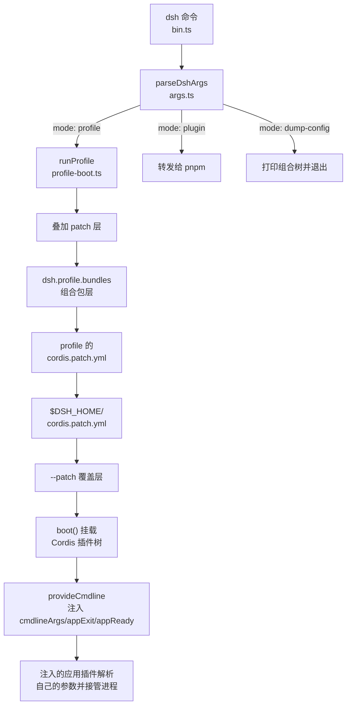
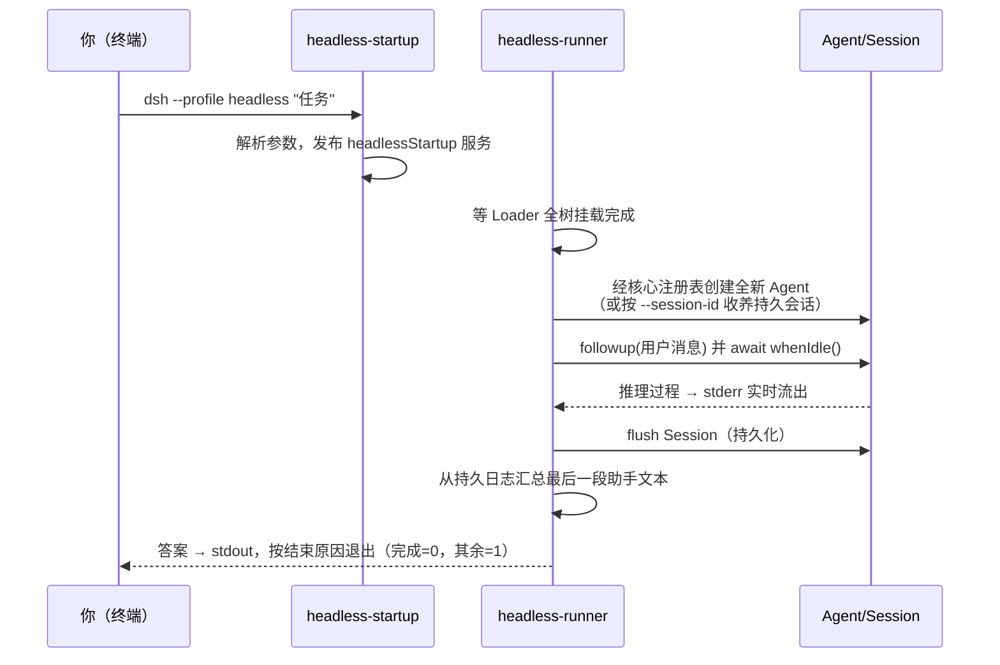

当你安装好 DeepSeek Harness 后，第一个接触的入口就是 `dsh` 命令。这条命令是整个框架**唯一受支持的 Node 应用启动器**：无论你想启动带网页界面的 Web 应用、跑完一个任务就退出的无界面模式，还是给自动化程序提供标准协议接口的 ACP 服务，入口都是它。本页面向初学者，讲清三件事：`dsh` 如何解析命令行参数并启动一个 profile、参数如何一层层传递到插件树、以及 headless 与 ACP 两种"无界面"形态各自的工作方式。Web 桌面应用、Electron 与 Python SDK 虽然同属"应用形态"，但分别由本目录下的其他页面负责。

Sources: [README.zh.md](apps/cli/README.zh.md#L5-L5)

## 核心概念：profile 即应用形态

理解本页的前提只有一个：**profile（配置档案）是 dsh 的组合单位，应用形态由 profile 决定，而不是由不同的可执行文件决定**。SDK、ACP、headless 都只是 profile，不是独立的公开命令。一个 profile 在磁盘上就是 `$DSH_HOME/profiles/<name>` 目录，里面有两类文件：一个 `package.json`，其中的 `dsh.profile.bundles` 字段按顺序列出该 profile 使用的组合包；一个 `cordis.patch.yml`，是你自己的 patch 覆盖层。启动时，配置树以空根为起点，依次叠加：各组合包声明的 patch、profile 自己的 `cordis.patch.yml`、home 级的 `$DSH_HOME/cordis.patch.yml`，最后是 `--patch` 命令行覆盖层。

Sources: [profile.ts](packages/boot/app-boot/src/profile.ts#L5-L14), [README.zh.md](apps/cli/README.zh.md#L35-L46)

仓库内置了五个"随附模板" profile，首次使用时自动初始化到你的 home 目录。其中与本页相关的三个是：`headless`（dsh-base + dsh-headless 组合包）、`acp`（dsh-base + dsh-acp-app 组合包）、`sdk`（dsh-base + dsh-sdk-app 组合包，详情见 Python SDK 页）。组合包名先从 dsh 安装目录解析，再从 profile 目录的 `node_modules` 解析，因此内置组合包始终来自安装本身，不会被 profile 覆盖。

Sources: [profile.ts](packages/boot/app-boot/src/profile.ts#L179-L195), [README.zh.md](apps/cli/README.zh.md#L46-L46)



上图概括了从一条命令到一个运行中的应用的完整链路：启动器只负责"选 profile、叠层、挂树、交参数"，之后的行为完全由树里的插件决定。

Sources: [bin.ts](apps/cli/src/bin.ts#L18-L64), [profile-boot.ts](apps/cli/src/profile-boot.ts#L296-L312)

## 命令行参数：启动器只解析自己的旗标

`dsh` 的参数解析有一条对初学者非常重要的**归属规则**：启动器只解析自己认识的旗标——`--profile`、`--from-default-profile`、`--patch` 和三个 config dump 旗标——从它遇到的第一个不认识的 token 开始，剩余参数原封不动地交给被启动的应用。因此 `dsh --profile tui --resume abc` 中，`--resume abc` 属于 tui 应用；`dsh --profile web --help` 打印的是 web 应用自己的帮助，而 `dsh --help`（没有 profile 可以接手）才打印启动器自己的帮助。

Sources: [args.ts](apps/cli/src/args.ts#L4-L11), [README.zh.md](apps/cli/README.zh.md#L22-L32)

这个规则由 commander 的 `passThroughOptions()` 与 `allowUnknownOption()` 实现，配合 `helpOption(false)` 让应用拥有自己的 `-h`。两个易错点值得记住：其一，`dsh <name>` 是 `dsh --profile <name>` 的简写，但简写名必须紧跟 `dsh`；其二，`desktop` 是保留名——它由 Electron 桌面应用独占管理，命令行传入会被直接拒绝。

Sources: [args.ts](apps/cli/src/args.ts#L158-L166), [args.ts](apps/cli/src/args.ts#L83-L87)

解析结果归结为四种**调用模式**，`bin.ts` 据此动态 import 对应的运行器，不启动的模式不会加载：

| 模式 | 触发方式 | 行为 |
|---|---|---|
| `profile` | `dsh <name>` 或 `dsh --profile <name>` | 启动 profile，把内部参数交给插件树 |
| `plugin` | `dsh plugin --profile <name> <pnpm 参数>` | 在 profile 目录里把参数转发给 pnpm |
| `dump-config` | `--dump-config` / `--dump-default-config` | 打印组合后的配置树，不启动 |
| `dump-config-schema` | `--dump-config-schema` | 打印插件的 JSON Schema，不挂载 profile |

Sources: [bin.ts](apps/cli/src/bin.ts#L22-L59), [args.ts](apps/cli/src/args.ts#L20-L61)

### 参数如何抵达插件树：cmdline 服务

启动器解析完之后，参数通过 `@deepseek-ai/dsh-cmdline` 包的 `provideCmdline()` 在插件树挂载**之前**注入三个宿主值：`ctx.cmdlineArgs`（冻结的参数快照）、`ctx.appExit`（有界的退出请求）和 `ctx.appReady`（启动成功信号）。任何注入 `cmdlineArgs` 的应用插件都可以用 `parseCmdline()` 拿这份快照跑自己的 commander 程序，把解析出的值发布成普通服务——随后，配置树中的普通行可以用 `!!js` 表达式读取它，例如 `port: !!js ctx.webStartup.port ?? 3080`，实现"旗标优先于 YAML 里写死的值"。

Sources: [index.ts](packages/boot/cmdline/src/index.ts#L67-L89), [index.ts](packages/boot/cmdline/src/index.ts#L13-L15)

这套设计把"进程怎么退出"也标准化了：对 stdio 形态的应用（如 ACP），`exitOnStdinEnd()` 把"标准输入到达 EOF"（即客户端关闭了管道）绑定到启动器的有界关闭上——但只有应用的命令解析成功、`appReady` 提交之后 EOF 才会触发退出，这样启动失败仍然如实报错而不是静默退出。

Sources: [index.ts](packages/boot/cmdline/src/index.ts#L123-L145), [index.ts](packages/boot/cmdline/src/index.ts#L165-L186)

## Profile 启动管线

`runProfile()` 是所有 `dsh` 界面共享的启动函数，它按固定顺序完成七步：

1. **安装代理**：在任何插件挂载前，从启动器的环境快照解析 `HTTP(S)_PROXY` 并接管 Node 的 fetch 代理（Node 原生只在启动时采样环境，无法感知 `.env` 层声明的代理）。
2. **准备 profile**：缺失的 profile 若指定了 `--from-default-profile` 模板则初始化；随后加载 profile 并始终重写空的根配置文件 `cordis.yml`（防止 Loader 的树回写把组合结果"烤"进根文件导致下次启动重复叠加）。
3. **组合 patch 层**：按上文顺序叠加组合包层、profile 层、home 层、`--patch` 层。
4. **安装信号与故障处理**：SIGTERM 视为管理者的普通停止请求（退出码 0），SIGINT 是用户中断（退出码 130）——两个信号从启动窗口就开始接管，而不只是启动完成后。
5. **启动树**：把 `profileContext`、启动环境快照注入宿主上下文，挂载插件包解析，最后 `provideCmdline`。
6. **提交就绪**：树处于 ACTIVE 且 Loader 存在时提交 `appReady`，等待中的 stdio 应用从此进入正式生命周期。
7. **有界关闭**：`appExit` 触发的退出会先让插件树释放，最多给 5 秒宽限，超时或二次信号则强制退出。

Sources: [profile-boot.ts](apps/cli/src/profile-boot.ts#L244-L326), [profile-boot.ts](apps/cli/src/profile-boot.ts#L280-L281), [process-shutdown.ts](apps/cli/src/process-shutdown.ts#L4-L77)

启动失败时也不会"哑掉"：必需插件激活失败会打印失败插件、原始堆栈和缺失服务清单，并把完整诊断（版本、平台、每个插件的模块与状态）写入 `$DSH_HOME/logs` 下的唯一日志文件。

Sources: [startup-diagnostics.ts](apps/cli/src/startup-diagnostics.ts#L1-L1), [reference/README.md](apps/cli/reference/README.md#L71-L77)

自定义 profile 用一条命令即可创建：`dsh rescue --from-default-profile web` 会从随附的 web 模板复制组合包列表到新 profile 目录（目录被独占式创建，模板名与已存在的目录都会被拒绝），之后 `dsh rescue` 直接启动它。已有 profile 传入 `--from-default-profile` 不会改动或启动它，省略该选项即可正常使用。

Sources: [profile-boot.ts](apps/cli/src/profile-boot.ts#L101-L151), [reference/README.md](apps/cli/reference/README.md#L15-L22)

## Headless：一次性任务模式

`dsh --profile headless "运行测试"` 是"问一个任务、拿一个答案、然后退出"的形态。它基于 dsh-headless 组合包——直接骑在 dsh-base 之上，**不挂载 Host、HTTP 服务器或浏览器插件**，所以没有 UI、没有端口，stdout/stderr 就是全部交互面。组合包的 patch 做了三件事：调整系统提示词（注入工作目录与模型身份的 persona）、插入两个插件行、禁用 HMR。

Sources: [index.ts](packages/bundle/headless/src/index.ts#L1-L11), [cordis.patch.yml](packages/bundle/headless/cordis.patch.yml#L1-L35)

两个插件行的分工值得初学者留意，它展示了 cmdline 服务约定的标准用法：

- **`headless-startup`**：注入 `cmdlineArgs`，用自己的 commander 程序解析任务位置参数、`--session-id`、`--json` 与 `--help`，解析成功后把结果发布为 `headlessStartup` 服务。
- **`headless-runner`**：普通消费者，其延迟求值的 config 逐字段读取该服务（`task: !!js ctx.headlessStartup.task`），再执行真正的任务循环。

Sources: [startup.ts](packages/bundle/headless/src/startup.ts#L16-L53), [cordis.patch.yml](packages/bundle/headless/cordis.patch.yml#L26-L34)

运行流程本身很直接：



Sources: [index.ts](packages/bundle/headless/src/index.ts#L309-L384), [index.ts](packages/bundle/headless/src/index.ts#L391-L399)

三个细节决定了这个模式对脚本友好：其一，**输出有严格约定**——最终答案走 stdout，模型推理过程以 `dsh: reasoning:` 为前缀流到 stderr，诊断同样走 stderr，所以管道脚本可以放心只消费 stdout。其二，`--json` 把 stdout 换成换行分隔的事件流，事件只来自**已提交**的会话事件（不会携带可能被重试丢弃的内容），且每个字符串与键被截断在 8KB、每行事件在 32KB 以内，保证消费方不会被失控的工具输出撑爆。其三，任务文本为 `-` 时从 stdin 读取，方便 `echo "任务" | dsh --profile headless` 的管道用法。

Sources: [index.ts](packages/bundle/headless/src/index.ts#L108-L164), [json-stream.ts](packages/bundle/headless/src/json-stream.ts#L1-L19), [startup.ts](packages/bundle/headless/src/startup.ts#L46-L52)

`--session-id` 用于续聊一个已存在的会话，但**收养有严格前置条件**：该会话不能运行在 agent preset 之下（headless 不组合 preset 名册，续聊会静默换成 headless 的工具与提示词）、不能是子代理或 fork 会话、必须记录了工作目录且与当前目录一致；此外它要求树里有 `sessionPersistence` 与 `sessionQuery` 服务，否则持久化无从谈起。请求的 id 不存在会直接报错——因为"把打错的 id 当成全新空会话"比失败危险得多。

Sources: [index.ts](packages/bundle/headless/src/index.ts#L210-L230), [index.ts](packages/bundle/headless/src/index.ts#L245-L293)

## ACP：Agent Client Protocol 自动化服务

如果说 headless 是"给人写脚本用"，那么 ACP 就是"给程序用"的形态。ACP（Agent Client Protocol）是一个标准化的 JSON-RPC 协议，`dsh --profile acp` 会在 stdio 上启动一个遵循该协议的服务器，让编辑器插件、测试运行器或其他 harness 进程可以程序化地驱动持久会话。仓库自带的进程外子代理提供方 `dsh-subagent-acp` 就是一个典型客户端：它 spawn 同一个 acp profile 来执行委派任务。

Sources: [index.ts](packages/acp/acp/src/index.ts#L1-L10), [README.zh.md](packages/acp/acp/README.zh.md#L12-L12), [run.ts](packages/subagent/subagent-acp/src/run.ts#L1-L6)

acp profile 的组合同样是"启动提供者 + 桥接器"两行：`acp-app-startup` 解析这个应用唯一的命令（零旗标，`--help` 除外），成功后把 stdin EOF 绑定到启动器的有界关闭并发布就绪服务；`acp` 桥接器等待该服务就绪后才认领 stdio——这保证了 `--help` 或参数错误不会意外启动协议传输。

Sources: [index.ts](packages/bundle/acp-app/src/index.ts#L25-L48), [cordis.patch.yml](packages/bundle/acp-app/cordis.patch.yml#L13-L24)

### 协议面一览

桥接器基于 `@agentclientprotocol/sdk` 构建，一个连接可同时运行多个互相独立的会话。客户端可调用的方法与语义如下：

| 方法 | 语义 |
|---|---|
| `initialize` | 返回协议版本与能力声明；图片提示词能力只在持久附件存储和当前路由都支持图片时如实公布 |
| `authenticate` | 立即成功，本服务器不需要鉴权 |
| `session/new` | 创建全新持久 agent，校验绝对 `cwd`，在发布前挂载请求的 MCP 服务器 |
| `session/list` | 按确定的新到旧顺序分页列出可恢复的根会话（过滤子代理/fork 会话），支持按物理目录标识筛选 |
| `session/resume` | 恢复已持久化且非活跃的会话，恢复前校验 cwd 匹配；恢复日志但不回放旧更新 |
| `session/set_config_option` | 串行更新会话的模型或推理强度选项 |
| `session/prompt` | 提交有序的文本/资源链接/受支持图片，每个会话同时只允许一个进行中的提示词 |
| `session/cancel` | 取消该会话当前拥有的提示词或自主工作；未知会话 id 为空操作 |
| `session/close` | 停稳式关闭：取消、更新排干、后代释放、持久化 flush |
| `session/update`（通知） | 服务端推送的语义更新流 |
| `session/request_permission` | 权限请求，带一次性"允许/拒绝"选项 |

Sources: [index.ts](packages/acp/acp/src/index.ts#L175-L370), [README.zh.md](packages/acp/acp/README.zh.md#L58-L76)

### 更新投影与停止原因

`session/update` 通知的每个事件都由**已提交的** DSH 会话事件投影而来：`assistant/message` 中的 reasoning 块变成 `agent_thought_chunk`、文本/图片块变成 `agent_message_chunk`，`tool/call` 与 `tool/result` 变成通用工具生命周期（`tool_call` / `tool_call_update`），助手消息还附带上下文用量 `usage_update`。原始的提供方流式增量、重试尝试、DSH 专有呈现卡片都不会进入协议——这是"自动化专用"的刻意边界。

Sources: [updates.ts](packages/acp/acp/src/updates.ts#L16-L102), [README.zh.md](packages/acp/acp/README.zh.md#L88-L95)

一轮提示的终止原因通过一个纯映射函数转换到 ACP 词汇表：`completed` 映射 `end_turn`，`max-tokens` 映射 `max_tokens`，`interrupted`（被 hook 或其他所有者中断）映射 `cancelled`，而被 hook 中止等"普通静止"一律报告 `end_turn`——`cancelled` 被保留给客户端显式取消的路径。

Sources: [codec.ts](packages/acp/acp/src/codec.ts#L14-L35)

### 权限与生命周期

当会话中的工具触发审批请求时，桥接器把它转成标准的 `session/request_permission`，选项固定为 `allow-once`（允许一次）与 `reject-once`（拒绝）两种——**永远不会**从客户端应答中推断出持久授权。客户端断开连接或插件被释放时，所有会话走同一套停稳式清理：先同步取消每个提示词，再并行关闭所有会话记录，最后把失败聚合上报。

Sources: [index.ts](packages/acp/acp/src/index.ts#L152-L173), [index.ts](packages/acp/acp/src/index.ts#L394-L437)

初学者还应了解它的边界：单个主工作区（不支持 `additionalDirectories`）、仅光栅图片（PNG/JPEG/WebP/GIF，且要求模型声明图片输入能力）、仅 MCP 工具（MCP resource 与 prompt 无消费方）、没有 transcript 回放或交互式扩展（计划、todo、终端、elicitation 等 UI 特性留在 harness 的 UI 模块里）。

Sources: [content.ts](packages/acp/acp/src/content.ts#L89-L104), [README.zh.md](packages/acp/acp/README.zh.md#L164-L172)

## 三种无界面形态对比

把本页的两种形态与 SDK 形态并排看，选择就不难了：

| 维度 | headless | acp | sdk（详见 Python SDK 页） |
|---|---|---|---|
| 传输 | stdout/stderr 约定 | JSON-RPC over stdio（标准 ACP） | JSON-RPC over stdio |
| 会话模型 | 一次运行一个会话，退出即结束 | 一个连接上多个持久会话，可 list/resume/close | 多轮次 API，可恢复 |
| 输出 | 最终文本或 `--json` 事件流 | 标准语义更新通知 | 结构化轮次结果 |
| 典型用途 | 脚本、CI、管道一次性任务 | 编辑器集成、进程外子代理、自动化控制器 | Python 程序嵌入智能体 |
| 权限 | 树内审批策略 | 客户端一次性应答 | SDK 侧策略 |

Sources: [README.zh.md](apps/cli/README.zh.md#L7-L20), [README.zh.md](packages/acp/acp/README.zh.md#L26-L36)

## 动手实验

按以下顺序实验可以建立完整的手感：

```sh
# 1. 一次性任务：答案进 stdout，推理进 stderr
dsh --profile headless "运行仓库里的单元测试"

# 2. 机器可读模式：换行分隔的 JSON 事件流
dsh --profile headless --json "总结这个目录的用途" > events.jsonl

# 3. 从 stdin 读任务（管道友好）
echo "解释 pnpm-workspace.yaml" | dsh --profile headless

# 4. 续聊已有会话
dsh --profile headless --session-id session-xxxx "继续刚才的任务"

# 5. 启动 ACP 服务器（stdout 只承载协议流量，日志请勿混入）
dsh --profile acp

# 6. 查看各自的帮助：启动器的 vs 应用的
dsh --help
dsh --profile headless --help
```

Sources: [startup.ts](packages/bundle/headless/src/startup.ts#L46-L52), [index.ts](packages/bundle/headless/src/index.ts#L38-L53), [index.ts](packages/bundle/acp-app/src/index.ts#L30-L33)

若想动手写一个最小 ACP 客户端，可以参考仓库自带的进程外子代理客户端 `dsh-subagent-acp`：它演示了 spawn 子进程、initialize 握手、创建会话、提交提示词、消费更新直至停稳关闭的完整往返。

Sources: [run.ts](packages/subagent/subagent-acp/src/run.ts#L1-L27), [README.zh.md](packages/acp/acp/README.zh.md#L55-L55)

## 下一步阅读

- 想理解 patch 层叠与组合包机制的全貌，继续阅读 [Profile 与组合包：dsh-base、patch 叠加顺序与运行时组装机制](10-profile-yu-zu-he-bao-dsh-base-patch-die-jia-shun-xu-yu-yun-xing-shi-zu-zhuang-ji-zhi)。
- 想知道 headless 里"任务被 Agent 驱动"之后发生了什么，阅读 [Agent Loop 与轮次生命周期：turn/start 到 turn/end 的步骤流与事件时序](11-agent-loop-yu-lun-ci-sheng-ming-zhou-qi-turn-start-dao-turn-end-de-bu-zou-liu-yu-shi-jian-shi-xu)。
- ACP 的典型客户端——子代理系统，见 [子代理与多智能体协作：subagent 提供方、fork-in-process 与 Agent Teams](19-zi-dai-li-yu-duo-zhi-neng-ti-xie-zuo-subagent-ti-gong-fang-fork-in-process-yu-agent-teams)。
- 带界面的形态见 [Web 应用与浏览器客户端：连接传输、UI 插件模块与产品隔离](20-web-ying-yong-yu-liu-lan-qi-ke-hu-duan-lian-jie-chuan-shu-ui-cha-jian-mo-kuai-yu-chan-pin-ge-chi)；SDK 形态见 [Python SDK：JSON-RPC 客户端、内置运行时与轮次 API](23-python-sdk-json-rpc-ke-hu-duan-nei-zhi-yun-xing-shi-yu-lun-ci-api)。