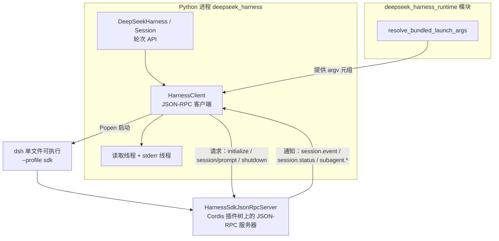
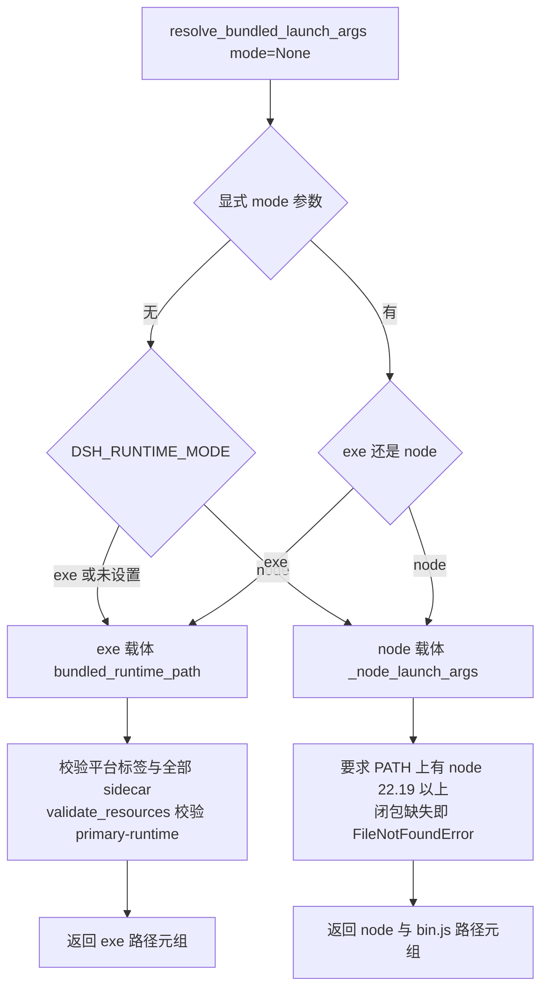
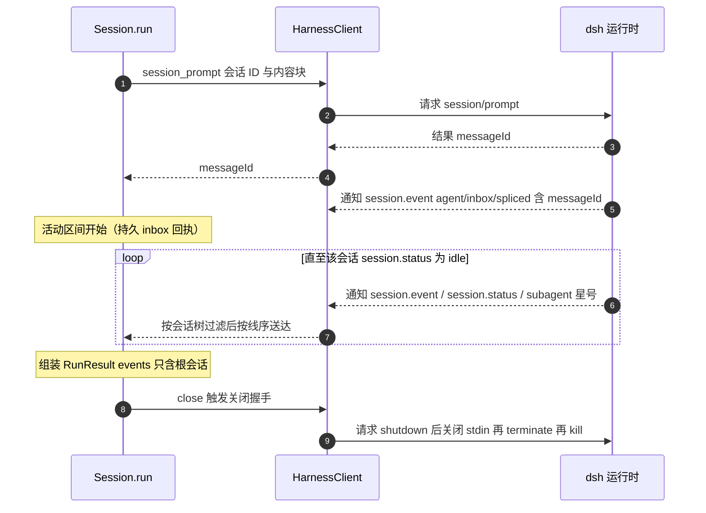

Python SDK 是 DeepSeek Harness 面向 Python 生态的分发形态：它把完整的 Harness 运行时打包为一个子进程，Python 侧通过 **stdio 上的按行分隔 JSON-RPC** 驱动智能体轮次。本页从三个层面拆解这套设计——线协议与客户端线程模型、内置运行时 wheel 的载体解析与资源校验、以及高层轮次 API 的活动区间语义。阅读前建议先了解 [Profile 与组合包：dsh-base、patch 叠加顺序与运行时组装机制](10-profile-yu-zu-he-bao-dsh-base-patch-die-jia-shun-xu-yu-yun-xing-shi-zu-zhuang-ji-zhi) 中的 profile 概念，以及 [Agent Loop 与轮次生命周期](11-agent-loop-yu-lun-ci-sheng-ming-zhou-qi-turn-start-dao-turn-end-de-bu-zou-liu-yu-shi-jian-shi-xu) 中的会话事件模型。

## 总览：一个子进程承载完整 Harness

Python 侧由两个严格同版本的包组成：`deepseek-harness-sdk` 是纯客户端（高层轮次 API + 底层 JSON-RPC 客户端），`deepseek-harness-runtime-bin` 是平台运行时 wheel（打包为原生可执行文件的 `dsh` CLI 及其闭合 Node 依赖树）。安装前者时会自动安装当前平台上版本完全一致的后者——这一约束直接写在 `pyproject.toml` 的依赖声明里（`deepseek-harness-runtime-bin==0.0.0.dev0` 精确固定）。SDK 本身没有独立的应用入口：它以 `--profile sdk` 启动内置 `dsh` CLI，由所选 profile 拥有 JSON-RPC 服务器、agent 组合、凭据、持久化、工具与关闭流程。

| 仓库目录 | 发行包 / 模块 | 角色 |
|---|---|---|
| `python/sdk` | `deepseek-harness-sdk` / `deepseek_harness` | 高层轮次 API 与底层 JSON-RPC 客户端 |
| `python/sdk-runtime` | `deepseek-harness-runtime-bin` / `deepseek_harness_runtime` | 内置 `dsh` CLI 可执行文件与原生 sidecar |

Sources: [python/README.md](python/README.md#L9-L16) [python/sdk/pyproject.toml](python/sdk/pyproject.toml#L5-L16) [python/sdk/README.md](python/sdk/README.md#L13-L16)

理解这套架构的关键在于：**Python 只是驱动者，组合发生在运行时**。下图展示了三个参与方——Python 进程内的两层 API、运行时 wheel 里的解析函数、以及被启动的 `dsh` 子进程。读法：实线是调用/进程关系，`resolve_bundled_launch_args()` 在启动前把"载体选择"折叠为一个 argv 元组交给 `HarnessClient`。

Sources: [python/sdk/src/deepseek_harness/api.py](python/sdk/src/deepseek_harness/api.py#L49-L131) [python/sdk-runtime/src/deepseek_harness_runtime/__init__.py](python/sdk-runtime/src/deepseek_harness_runtime/__init__.py#L1-L20)

## 线协议：按行分隔的 JSON-RPC 2.0

协议契约由 TypeScript 包 `@deepseek-ai/dsh-sdk-protocol` 定义，Python 客户端是同一契约的姊妹实现。传输帧的判定规则很简单：带 `id` 与 `method` 的是请求，只有 `id` 的是响应，只有 `method` 的是通知；畸形行被直接忽略。握手的返回身份是线级稳定的 `deepseek-harness-sdk-runtime`。

| 方向 | 方法 | 关键载荷 | 语义 |
|---|---|---|---|
| 请求 | `initialize` | `cwd`、`provider`、`model`、可选 `reasoningEffort`/`maxTokens` | 进程级握手，返回 `serverInfo` |
| 请求 | `session/prompt` | `sessionId`、`contentBlocks` | 入队一条用户轮次，返回持久回执 `messageId` |
| 请求 | `shutdown` | 无 | 幂等关闭，返回空对象 |
| 通知 | `session.event` | `sessionId` + 完整会话日志事件 | 事件在记录时实时流出 |
| 通知 | `session.status` | `sessionId`、`idle`/`running` | 整 agent 生命周期状态 |
| 通知 | `subagent.started` | `parentSessionId`、`childSessionId` | 运行时内子会话被创建 |
| 通知 | `subagent.finished` | provider、agentId、父/子会话、`status`、`stopReason`、可选 `lastAssistantMessage` | 仅报告本进程子代理运行 |

Sources: [packages/sdk/protocol/src/types.ts](packages/sdk/protocol/src/types.ts#L1-L9) [packages/sdk/protocol/src/types.ts](packages/sdk/protocol/src/types.ts#L107-L119) [packages/sdk/protocol/src/transport.ts](packages/sdk/protocol/src/transport.ts#L1-L7)

Python 侧的消息路由发生在读取线程里，按帧形状三分为：**响应**（只有 `id`）投递给按请求 ID 注册的单容量等待队列，`error` 对象被转换成保留 `code`/`message`/`data` 的 `JsonRpcError`；**通知**（只有 `method`）先记录会话亲缘关系，再扇出给所有谓词匹配的订阅者，无人接收才落入全局队列；**服务器→客户端请求**（`id` + `method`）进入 `_requests` 队列，由 `next_request()` 取出、`respond()`/`respond_error()` 回答——这为协议级客户端保留了完整的双向通道。

Sources: [python/sdk/src/deepseek_harness/client.py](python/sdk/src/deepseek_harness/client.py#L377-L418) [python/sdk/src/deepseek_harness/client.py](python/sdk/src/deepseek_harness/client.py#L240-L260)

## HarnessClient 的线程模型与诊断

`HarnessClient` 是同步阻塞式客户端，用三个线程换来一个简洁的同步外观：`start()` 用 `Popen` 拉起运行时（行缓冲、UTF-8 文本管道），读取线程逐行解析 stdout 并分发消息，stderr 线程把子进程错误输出滚进一个 400 行的环形缓冲。所有请求经 UUID 请求 ID + 单容量 `queue.Queue` 等待；写方向由独立的写锁串行化，写失败一律升级为携带诊断信息的 `TransportClosedError`。诊断信息在超时与传输失败时自动拼接：子进程退出码加上 stderr 尾部——这是排查"profile 起不来"时的第一现场。

Sources: [python/sdk/src/deepseek_harness/client.py](python/sdk/src/deepseek_harness/client.py#L42-L92) [python/sdk/src/deepseek_harness/client.py](python/sdk/src/deepseek_harness/client.py#L332-L342) [python/sdk/src/deepseek_harness/client.py](python/sdk/src/deepseek_harness/client.py#L437-L456)

通知订阅是理解轮次 API 的前置概念。`subscribe_notifications(filter)` 返回可作上下文管理器的 `NotificationSubscription`，其队列只收谓词命中的通知；`subscribe_session_notifications(session_id)` 则把过滤器预设为"属于该会话树"。运行时退出时，`_fail_waiters` 会把 `TransportClosedError` 同时塞进所有等待队列、订阅队列与全局队列，让阻塞中的调用方立即醒来而不是永久悬挂。

Sources: [python/sdk/src/deepseek_harness/client.py](python/sdk/src/deepseek_harness/client.py#L226-L238) [python/sdk/src/deepseek_harness/client.py](python/sdk/src/deepseek_harness/client.py#L539-L577) [python/sdk/src/deepseek_harness/client.py](python/sdk/src/deepseek_harness/client.py#L420-L431)

## 内置运行时：双载体解析与资源校验

运行时 wheel 里共存两种载体：**exe**（生产）是按平台命名的单文件 Node 可执行文件，不需要目标机器装 Node；**node**（仅开发）是 `runtime/node/` 下的完整 `node_modules` 闭包，跑在系统 Node ≥ 22.19 上。载体选择遵循三级优先：显式参数 > `DSH_RUNTIME_MODE` 环境变量 > 自动解析，而自动解析**只找生产 exe**——开发载体必须显式选择，避免生产部署悄悄搭上源码构建。下面的流程图给出完整判定路径（菱形为分支，矩形为返回值）：

| 载体 | 定位 | 形态 | 选择方式 | 系统依赖 |
|---|---|---|---|---|
| exe | 生产 | `deepseek-harness-sdk-runtime-<platform>-<arch>[.exe]` + `-rg` / macOS `-spawn-helper` / `-office/` sidecar | 默认自动；`DSH_RUNTIME_MODE=exe` | 无需系统 Node |
| node | 仅开发 | `runtime/node/node_modules/` 闭包 | 必须显式 `DSH_RUNTIME_MODE=node` 或 `mode="node"` | 系统 Node ≥ 22.19 |

Sources: [python/sdk-runtime/src/deepseek_harness_runtime/__init__.py](python/sdk-runtime/src/deepseek_harness_runtime/__init__.py#L1-L20) [python/sdk-runtime/src/deepseek_harness_runtime/__init__.py](python/sdk-runtime/src/deepseek_harness_runtime/__init__.py#L114-L134)

平台矩阵为 Linux x64/arm64、macOS x64/arm64、Windows x64，不匹配直接抛出带采购路径提示的 `FileNotFoundError`。exe 校验是彻底的：ripgrep sidecar、macOS 的 node-pty spawn helper、`-office/` 目录（内含完整 Office 包与 libreoffice-kit 引擎，按 `optionalDependencies` 判定原生或 wasm 引擎）缺一不可；随后 `validate_resources` 再校验 `<platform>-<arch>/primary-runtime/` 下的 authoring 资源——`runtime.json` 清单的平台/架构必须匹配、Python 版本号合法、site-packages 非空、Python 解释器/独立 Node/Office 技能树齐全，POSIX 上还要验证可执行位。

Sources: [python/sdk-runtime/src/deepseek_harness_runtime/__init__.py](python/sdk-runtime/src/deepseek_harness_runtime/__init__.py#L58-L111) [python/sdk-runtime/src/deepseek_harness_runtime/__init__.py](python/sdk-runtime/src/deepseek_harness_runtime/__init__.py#L137-L150) [python/sdk-runtime/src/deepseek_harness_runtime/_resources.py](python/sdk-runtime/src/deepseek_harness_runtime/_resources.py#L12-L44)

单文件可执行的内部还有一个私有入口 `runtime-bootstrap.mjs`：在 SEA（Single Executable Application）模式下，它用模块钩子把 `@deepseek-ai/libreoffice-kit` 的解析重定向到可执行文件旁的 `-office/` 目录——Office 需要孵化真实文件进程与 URL Worker，嵌入字节无法满足；同时在进入 CLI 前注入载体默认值 `DSH_BUNDLED_PRIMARY_RUNTIME`，供 sdk profile 的 `workspace-dependencies` 与 `skill-office` 行按需消费。该 wheel 还会安装一个 `dsh` 控制台命令：它要求非空 `DSH_HOME`，POSIX 上 `execvpe` 替换进程，Windows 上等待并转发退出码。

Sources: [python/sdk-runtime/runtime-bootstrap.mjs](python/sdk-runtime/runtime-bootstrap.mjs#L7-L43) [python/sdk-runtime/README.md](python/sdk-runtime/README.md#L17-L18) [python/sdk-runtime/src/deepseek_harness_runtime/__init__.py](python/sdk-runtime/src/deepseek_harness_runtime/__init__.py#L179-L192)

## 轮次 API：DeepSeekHarness、Session 与 RunResult

`DeepSeekHarness` 是可复用的同步门面：运行时子进程**延迟启动**并在多次 `run()` 间复用，直到 `close()` 或上下文管理器退出。`start()` 把握手参数（cwd、provider、model、可选 reasoning_effort/max_tokens）经 `initialize` 发给运行时；`start_session()` 生成或接受一个会话 ID，返回 `Session` 对象。运行时默认继承调用方环境变量——既有的 `DEEPSEEK_API_KEY` 与 `DEEPSEEK_BASE_URL` 直接生效，`base_url`/`api_key` 配置项则显式写入这两个变量以覆盖或注入。

Sources: [python/sdk/src/deepseek_harness/api.py](python/sdk/src/deepseek_harness/api.py#L49-L131) [python/sdk/src/deepseek_harness/api.py](python/sdk/src/deepseek_harness/api.py#L13-L37)

| 配置字段 | 默认值 | 说明 |
|---|---|---|
| `provider` / `model` | `deepseek-official` / `deepseek-v4-flash` | 握手时选定的路由与模型 |
| `reasoning_effort` / `max_tokens` | `None` | 适配器自有标识 / 正整数输出上限 |
| `cwd` / `runtime_cwd` | 当前目录 / 同 `cwd` | 记录到会话头的工作目录 / 运行时进程工作目录 |
| `dsh_bin` / `profile` / `patches` | `None` / `"sdk"` / `()` | 显式可执行文件、profile 名、有序调用级 patch |
| `dsh_home` / `env` | `None` / `{}` | 显式 home（或子环境 `DSH_HOME`）/ 附加子进程环境 |
| `base_url` / `api_key` | `None` | 映射为 `DEEPSEEK_BASE_URL` / `DEEPSEEK_API_KEY` |
| `initialize_timeout_seconds` | `30.0` | 握手独立上限 |
| `request_timeout_seconds` | `None` | 普通请求默认不限时 |
| `shutdown_timeout_seconds` | `1.0` | 关闭各阶段上限 |

Sources: [python/sdk/src/deepseek_harness/api.py](python/sdk/src/deepseek_harness/api.py#L13-L37) [python/sdk/src/deepseek_harness/client.py](python/sdk/src/deepseek_harness/client.py#L24-L36)

`Session.run()` 的核心是**活动区间**（activity interval）语义：从本次提示词被持久 inbox 接收开始，到整 agent 下一次进入 idle 结束。时序上有两个精确锚点——客户端先等到的必须是携带自己 `messageId` 的 `agent/inbox/spliced` 事件（持久回执，证明消息已落盘），此后持续收集通知，直到出现本会话的 `session.status: idle` 才收束为 `RunResult`。先决概念：`session.event` 通知承载会话日志事件信封，`turn/end` 是轮次终结事件（见 [Agent Loop 与轮次生命周期](11-agent-loop-yu-lun-ci-sheng-ming-zhou-qi-turn-start-dao-turn-end-de-bu-zou-liu-yu-shi-jian-shi-xu)）。

Sources: [python/sdk/src/deepseek_harness/api.py](python/sdk/src/deepseek_harness/api.py#L139-L189) [python/sdk/src/deepseek_harness/api.py](python/sdk/src/deepseek_harness/api.py#L192-L202)

`RunResult(session_id, final_response, finish_reason, events, notifications)` 各字段的提取规则都定义在客户端：`final_response` 逆序扫描 `assistant/message` 事件、拼接最后一个的文本块；`finish_reason` 取最后一个 `turn/end` 的 `data.reason.kind`，若缺失字符串会抛 `SdkProtocolError`——协议违规显式失败而非静默返回 `None`；`events` 只含根会话事件；`notifications` 含根会话与已知后代、保持线序。输入归一化方面，字符串被包成单个 `{"type": "text"}` 块，列表则原样透传为 `contentBlocks`。

Sources: [python/sdk/src/deepseek_harness/api.py](python/sdk/src/deepseek_harness/api.py#L183-L248) [python/sdk/src/deepseek_harness/api.py](python/sdk/src/deepseek_harness/api.py#L205-L208)

值得中间层开发者注意的两个服务器侧行为：其一，`session/prompt` 对未知 `sessionId` **惰性创建** agent+会话对，创建并发经 `sessionCreations` 映射去重，交付前还会校验保留的 agent 仍存活于注册表中；其二，`image` 内容块可携带内联 base64 光栅数据（PNG/JPEG/WebP/GIF），服务器在投递前将其**准入**到持久附件存储并替换为附件引用——普通块则原样透传。

Sources: [packages/sdk/server/src/server.ts](packages/sdk/server/src/server.ts#L178-L201) [packages/sdk/server/src/server.ts](packages/sdk/server/src/server.ts#L261-L294) [packages/sdk/protocol/src/types.ts](packages/sdk/protocol/src/types.ts#L36-L59)

## 会话树通知：子代理谱系的客户端追踪

当根会话派生子代理时，`subagent.started` 通知携带 `parentSessionId`→`childSessionId` 边；`HarnessClient` 在运行时进程的整个生命周期里累积这棵谱系树。会话树过滤器把"相关通知"定义为：通知的 `sessionId` 沿父链上溯能到达根会话（带 visited 集合防环），或本身就是与根会话直接相关的 `subagent.started`/`subagent.finished` 边。因此一次 `Session.run()` 里，`on_notification` 回调能按线序收到所有已知后代的活动，而 `RunResult.events` 仍严格只含根会话事件——后代输出不会污染根会话日志视图。子代理提供方体系的完整论述见 [子代理与多智能体协作：subagent 提供方、fork-in-process 与 Agent Teams](19-zi-dai-li-yu-duo-zhi-neng-ti-xie-zuo-subagent-ti-gong-fang-fork-in-process-yu-agent-teams)。

Sources: [python/sdk/src/deepseek_harness/client.py](python/sdk/src/deepseek_harness/client.py#L492-L536) [python/sdk/README.md](python/sdk/README.md#L66-L70)

服务器侧的对应接线也值得一提：`HarnessSdkJsonRpcServer` 构造时订阅四个 Cordis 上下文事件并桥接为协议通知——`session/event` → `session.event`，`agent/status` → `session.status`，带父会话的 `session/created` → `subagent.started`，本进程的 `subagent/end` → `subagent.finished`（远程运行不报告；`max-tokens` 停止原因可经 `maxTokensAsSuccess` 选项映射为 `ok` 而非基础设施错误）。

Sources: [packages/sdk/server/src/server.ts](packages/sdk/server/src/server.ts#L75-L130) [packages/sdk/server/src/server.ts](packages/sdk/server/src/server.ts#L59-L68)

## Profile 选择、Patch 层与环境注入

启动参数的组装规则是：`(载体 argv, "--profile", profile, 每个 patch 的 "--patch <绝对路径>")`。随附两个开箱即用的 profile——默认的 `sdk`（在 `dsh-base` 之上叠加，stdout 专属于 JSON-RPC，禁用会话标题 LLM 与 HMR）与独立的 `sdk-minimal`（不含 `dsh-base` 的完整显式 Cordis 树）。自定义 profile 的硬约束：必须保留 `@deepseek-ai/dsh-sdk-app` 或另一行 `@deepseek-ai/dsh-sdk-jsonrpc-server`，否则在 CLI 启动或 SDK 初始化时直接失败，没有完整配置回退。patch 叠加顺序的机制细节见 [Profile 与组合包](10-profile-yu-zu-he-bao-dsh-base-patch-die-jia-shun-xu-yu-yun-xing-shi-zu-zhuang-ji-zhi)。

| 维度 | `sdk`（默认） | `sdk-minimal` |
|---|---|---|
| 组合方式 | `dsh-base` 之上叠加 bundle patch | 独立完整树，逐行显式声明 |
| 模型适配 | 沿用 base 组合；provider 未注册且为 `deepseek-official` 时挂 DeepSeek 后备适配器 | `llm-deepseek` 行，读 `DEEPSEEK_API_KEY`，上下文窗口默认 `DSH_CONTEXT_WINDOW`=1000000 |
| 工具面 | base 全量 + 条件启用的 `workspace-dependencies`/`skill-office`（依赖内置 primary runtime） | 仅按平台选择的持久 `bash`/`pwsh` |
| `maxTokensAsSuccess` | 默认 `true`（`DSH_MAX_TOKENS_AS_SUCCESS` 可改） | 固定 `false` |
| 会话持久化 | home 内凭据、设置与会话存储 | 仅未压缩 JSONL（`sessions/`） |

Sources: [python/sdk/src/deepseek_harness/client.py](python/sdk/src/deepseek_harness/client.py#L458-L486) [python/sdk/README.md](python/sdk/README.md#L45-L62) [packages/bundle/sdk-app/cordis.patch.yml](packages/bundle/sdk-app/cordis.patch.yml#L1-L42) [packages/bundle/sdk-minimal/cordis.patch.yml](packages/bundle/sdk-minimal/cordis.patch.yml#L1-L32) [packages/bundle/sdk-minimal/cordis.patch.yml](packages/bundle/sdk-minimal/cordis.patch.yml#L126-L159)

`initialize` 握手在服务器侧还有一道前置校验：`reasoningEffort` 必须非空字符串、`maxTokens` 必须为正安全整数，随后立即调用 `llm.resolveCallConfig` 验证该 provider/model/effort/maxTokens 路由真实可解析——错误在握手期暴露而不是首轮运行时。若 provider 无适配器注册且恰好是 `deepseek-official`，服务器会临时挂载 DeepSeek API-Key 适配器作为后备；其他未注册 provider 一律报错。

Sources: [packages/sdk/server/src/server.ts](packages/sdk/server/src/server.ts#L137-L171)

持久自定义走运行时 wheel 安装的 `dsh` 命令：先 `--dump-default-config` 初始化 profile，再 `dsh plugin --profile <name> add file:<bundle>` 安装外部 bundle（该管理命令需要 `pnpm`，普通 SDK 运行不需要）；单次调用的变更则走 `patches` 元组，按序追加在 profile 层与 home patch 层之后。CLI 语法与 profile 启动的完整说明见 [CLI 与 Headless/ACP：profile 启动、命令行参数与 Agent Client Protocol](22-cli-yu-headless-acp-profile-qi-dong-ming-ling-xing-can-shu-yu-agent-client-protocol)。

Sources: [python/sdk/README.zh.md](python/sdk/README.zh.md#L35-L58) [python/sdk-runtime/README.md](python/sdk-runtime/README.md#L45-L47)

## 超时、关闭握手与错误面

超时被刻意分层：握手 30 秒独立上限（profile 初始化可能较重），普通请求默认不限时（agent 轮次天然长时），关闭各阶段 1 秒。`initialize` 超时的话术也经过设计：先 `close()` 释放子进程，再抛出指明所选 profile 的 `TimeoutError`；`JsonRpcError` 则自动附加 stderr 诊断尾部。

| 参数 | 默认 | 作用点 |
|---|---|---|
| `initialize_timeout_seconds` | `30.0` | profile 握手；超时先关闭再抛出并指明 profile |
| `request_timeout_seconds` | `None` | 普通 JSON-RPC 请求；默认不限时 |
| `shutdown_timeout_seconds` | `1.0` | shutdown 请求、进程等待、terminate→kill 各阶段 |

Sources: [python/sdk/src/deepseek_harness/api.py](python/sdk/src/deepseek_harness/api.py#L33-L35) [python/sdk/src/deepseek_harness/client.py](python/sdk/src/deepseek_harness/client.py#L158-L170)

`close()` 的关闭握手是渐进降级的五步：发送有界的 `shutdown` 请求（让运行时把持久状态刷完）→ 关闭 stdin（EOF 信号）→ 已确认 shutdown 完成则限时 `wait()` → 仍在运行则 `terminate()` → 仍在运行则 `kill()` + `wait()`。全程幂等，收尾时所有等待者与订阅者统一收到 `TransportClosedError`，两个线程各限时 0.5 秒回收。

Sources: [python/sdk/src/deepseek_harness/client.py](python/sdk/src/deepseek_harness/client.py#L94-L131)

错误类型面刻意保持最小：

| 异常 | 触发场景 |
|---|---|
| `HarnessError` | SDK 与运行时失败的公共基类 |
| `TransportClosedError` | 运行时进程退出或关闭 stdout；写失败；close 时唤醒全部等待者 |
| `SdkProtocolError` | 运行时发来协议外数据（如 `turn/end` 缺 `data.reason.kind`） |
| `JsonRpcError` | JSON-RPC error 响应，保留线级 `code`/`message`/`data` |

Sources: [python/sdk/src/deepseek_harness/errors.py](python/sdk/src/deepseek_harness/errors.py#L4-L24) [python/sdk/src/deepseek_harness/api.py](python/sdk/src/deepseek_harness/api.py#L231-L248)

## 上手路径与延伸阅读

最小可运行示例是 `python/sdk/examples/minimal.py`：解析命令行参数（`--profile` 默认 `sdk-minimal`、模型默认取 `DSH_MODEL` 环境变量再回退 `deepseek-v4-flash`）、强制显式 `--dsh-home`，然后以 `with DeepSeekHarness(...)` 跑一个轮次并打印 `result.final_response`。正式教程（安装、运行示例、插件安装与 `str_replace_editor` 选配）见 `docs/user/guide/python-sdk.md`。

Sources: [python/sdk/examples/minimal.py](python/sdk/examples/minimal.py#L13-L44) [docs/user/guide/python-sdk.md](docs/user/guide/python-sdk.md#L96-L121)

建议的延伸路线：想理解 `dsh --profile sdk` 背后的组合机制，读 [Profile 与组合包](10-profile-yu-zu-he-bao-dsh-base-patch-die-jia-shun-xu-yu-yun-xing-shi-zu-zhuang-ji-zhi)；想深挖活动区间里流转的事件（`turn/start`→`turn/end`、`assistant/message`），读 [Agent Loop 与轮次生命周期](11-agent-loop-yu-lun-ci-sheng-ming-zhou-qi-turn-start-dao-turn-end-de-bu-zou-liu-yu-shi-jian-shi-xu) 与 [LLM 适配与流式协议](17-llm-gua-pei-yu-liu-shi-xie-yi-message-contentblock-streamchunk-yu-gua-pei-qi-yue-ding)；想看同一线协议如何被快照测试逐帧固化，读 [快照测试与录制会话](27-kuai-zhao-ce-shi-yu-lu-zhi-hui-hua-session-sdk-acp-web-kuai-zhao-de-zu-zhi-yu-hui-fang)。仓库中 `snapshots/sdk/` 目录下的快照（如 `multi-turn`、`ptc-turn`、`bash-tool`）正是以 Python SDK 作为驱动端录制的。