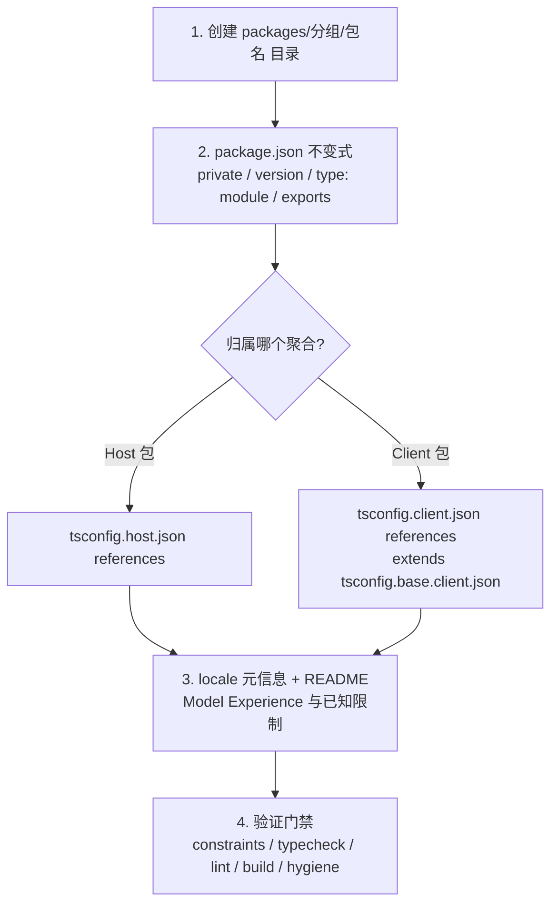
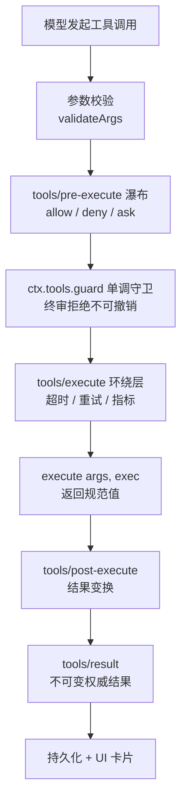
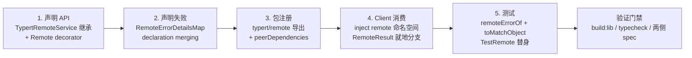

本页是 DeepSeek Harness 扩展开发的核心手册，将 `docs/cookbook/` 下的五份官方实操指南——添加 workspace 包、添加工具、添加 LLM 适配器、新增 Remote API、添加设置卡片——整合为一份面向高级开发者的单一参考。每条路径都遵循同一节奏：**声明 → 注册 → 验证**；所有注册都建立在 Cordis 副作用之上，插件 fiber 被 dispose 时注册自动回收，这也是 HMR 安全的根基。本页聚焦"怎么做"；各机制的完整原理见对应章节页（工具流水线、LLM 协议、Typert 网关），此处只给出生存所需的机制底线。

Sources: [extension-cookbook.zh.md](docs/cookbook/extension-cookbook.zh.md#L1-L9)

## 总览：五种扩展路径与微内核前提

在动手之前，先确立一个可验证的架构事实：**每个产品功能都映射到一个文档化扩展点上的监听器，没有任何一行代码修改 agent loop 本身**——这是仓库的微内核声明，`/goal`、压缩、权限系统、MCP、定时任务等全部由 `tools/pre-execute`、`turn/end`、`ctx.tools.register()` 这类扩展点组合而成。因此你的扩展不需要"侵入"框架，只需要选择正确的 seam 并在其上注册监听器或服务。模型适配器同样走注册路径：通过 `registerAdapter` 注册 `LlmAdapter` 子类，内建的 `dsh-llm-deepseek` 与 `dsh-llm-pi-ai` 就是两个已交付示例。

Sources: [extension-cookbook.zh.md](docs/cookbook/extension-cookbook.zh.md#L104-L137)

| 扩展目标 | 官方食谱 | 核心 API | 产出物形态 |
|---|---|---|---|
| 为模型提供新能力 | 添加工具 | `ctx.tools.register(defineTool(...))` | 插件包 + 工具定义 |
| 沉淀可复用能力单元 | 添加 workspace 包 | 逐文件清单 + 根配置注册 | `@deepseek-ai/dsh-<name>` 包 |
| 接入新的模型提供方 | 添加 LLM 适配器 | `ctx.llm.registerAdapter(routes, adapter)` | `LlmAdapter` 子类插件 |
| 暴露 Host→Client 调用端点 | 新增 Remote API | `TypertRemoteService` + `@Remote` | Host 服务 + 生成 Client 声明 |
| 让插件配置可即时编辑 | 添加设置卡片 | `z.<t>().volatile()` + 设置卡片 | Volatile Config 字段 |

Sources: [extension-cookbook.zh.md](docs/cookbook/extension-cookbook.zh.md#L106-L135)

## 先有包，后有插件：workspace 包添加清单

除一次性脚本插件外，一切扩展都以 `@deepseek-ai/dsh-<name>` 包为载体，官方清单以 `packages/shell` 与 `packages/llm` 下的包为模板验证。目录骨架为 `packages/<group>/<pkg>/`：`package.json`（从 `packages/core/tools` 复制后调整）、`tsconfig.json`（extends 根 base、`rootDir: src`、`outDir: lib/types`、声明 references）、`src/index.ts`（服务默认导出或 name/inject/apply/Config 插件）、可选的 `locale/en.json` 与 `locale/zh.json` 展示元信息，以及强制要求的 `README.md`。当已有分组（`core`、`llm`、`shell`、`client`/`host`、`util` 等）与角色匹配时就复用它；分组是纯容器，允许新建但没有 `package.json`。

Sources: [adding-a-package.zh.md](docs/cookbook/adding-a-package.zh.md#L5-L34)



`package.json` 存在六条不变式，由 `pnpm run constraints`（实现在 `scripts/check-workspace-constraints.ts`）强制执行：`private: true`、`version` 与根 package.json 一致、`type: module`、`main: "lib/index.js"`、`types` 与 `exports["."]` 指向 `lib/types/index.d.ts`。注册进根配置时记住一条铁律：**普通包恰好属于一个聚合**——Host 包加进 `tsconfig.host.json` 的 `references`，Client 包加进 `tsconfig.client.json`，绝不两边都加（`api/remotes` 因 Host 生成与 Client 消费的顺序依赖是唯一例外）。而根 `package.json` workspaces、`tsdown.config.ts`、`.oxlintrc.json` 等由 glob 或 manifest 发现机制自动覆盖，无需手动编辑。

Sources: [adding-a-package.zh.md](docs/cookbook/adding-a-package.zh.md#L36-L45); [check-workspace-constraints.ts](scripts/check-workspace-constraints.ts#L1-L22)

### 用符合实际的角色词汇命名

命名规范是这份清单中最容易被忽视却最能长期受益的部分：名称必须描述**当前稳定职责**，而不是首个实现或可能的未来扩展。接口包用能力名称，实现包加机制/协议/环境/厂商限定词；只有同主机执行属于约定时才用 `local`。单数 `ctx` key 对应 engine/runtime/policy/controller 这类单一服务，复数 key 对应 registry 或拥有多个具名成员的服务；不兼容的 host 与 client 声明绝不能复用同一个 Cordis Context key。下表摘录最高频的判据（完整 18 词见原文）：

| 词汇 | 适用条件 | 不适用条件 |
|---|---|---|
| `Controller` | 接受命令或用户意图，改变既有领域/展示状态 | 执行任意工作或拥有 provider |
| `Registry` | 拥有动态具名注册、查询与生命周期 | 主要约定是分派、执行或编排 |
| `Runtime` | 运行实时工作，跨调用拥有分派与取消 | 只存储记录或解析一个值 |
| `Provider` | 提供一项能力定义的一个实现 | 表示能力定义或 provider registry |
| `Backend` | 在已定义接口之后实现可替换底层 | 表示面向用户的服务 |
| `Service` | 无法用更精确角色诚实描述的内聚服务 | 只因继承 Cordis `Service` 而使用 |

Sources: [adding-a-package.zh.md](docs/cookbook/adding-a-package.zh.md#L47-L88)

### 包 README 与展示元信息

包 README 必须前置服务 API、配置、事件与扩展点，并包含两个门禁章节：**Model Experience**（每个模型上下文条目一个 H3，内含 What the model sees / Token effect / KV Cache effect 三个有序 H4 字段）和 **Known Limitations and Deferred Work**（或进入 `scripts/verify-package-readme-limitations.ts` 白名单）。可选的插件展示元信息放在 `locale/en.json` 的 `meta.title`/`meta.description`（其他语言同字段），并在 package.json 合并 `./locale/*.json` 导出与 `files` 条目；回退链为 locale → `package.json.name`/`description` → 完整插件名，设置页会剥离技术短名的 scope 与前缀而插件管理页保留全名。完成后用 `pnpm run verify-package-meta` 校验字段与资源导出。

Sources: [adding-a-package.zh.md](docs/cookbook/adding-a-package.zh.md#L90-L165)

### 变体：vendored 包

若要引入上游 Cordis 生态包（如 `@cordisjs/plugin-http`），不是加 npm 依赖而是把固定版本源码 **vendor** 到 `vendor/<dir>/`：保留上游 exports/type、rescope 包名、给本地相对导入加显式 `.ts` 后缀，并在 `tsconfig.base.json` 添加 paths 映射、`tsconfig.host.json` 添加 reference（置于 `packages/*` 之前）。注意 pre-commit 守卫 `scripts/check-vendor-manifest.sh`：`vendor/*/src` 有暂存改动时必须同步暂存 `vendor/README.md` 的 manifest 行。

Sources: [adding-a-vendored-package.zh.md](docs/cookbook/adding-a-vendored-package.zh.md#L5-L26)

## 添加工具：defineTool 契约

工具是模型能力的最小单元。`ctx.tools.register()` 直接接受原始 JSON Schema 的 `ToolDefinition`，但一等公民是 `defineTool`——它在编译期从 `parameters` schema DSL 推导 `args` 类型，在运行前完成统一校验，并把 `output.render` 与规范值绑定。下面的最小形态（教程版见[快速上手工具](docs/user/develop/basic/tool.zh.md#L10-L28)）展示了四要素：模型可见的 `description`、参数 schema、规范输出 schema 与纯渲染函数：

```ts
ctx.tools.register(defineTool({
  name: 'greet',
  description: 'Greet someone by name.',
  parameters: {
    name: { type: 'string', required: true, description: 'The name to greet' },
  },
  output: {
    schema: { type: 'string' },
    render: (_args, value) => [{ type: 'text', text: value }],
  },
  async execute(args, exec) {
    return `Hello, ${args.name}!`
  },
}))
```

Sources: [adding-a-tool.zh.md](docs/cookbook/adding-a-tool.zh.md#L9-L37); [tool.zh.md](docs/user/develop/basic/tool.zh.md#L31-L37)

`defineTool` 的选项契约在源码中一目了然：`output.schema` 强制校验每个成功值，`render`/`presentationMeta` 是纯投影，`presentCall`/`presentResult` 是纯展示器，`execute` 在参数校验之后运行且参数已按 `InferArgs` 定型。八条 execute 约定必须内化：**参数已校验**（无法表达的约束如非空字符串、跨字段规则仍需手动检查）；**注册借用只读定义**（热替换工具须 dispose 副作用后重新注册，而非就地修改 schema）；**执行身份受保护**（注册表冻结 `arguments` 并分配不透明 `exec.token`，调用身份不可伪造）；**返回规范 JSON 值**（不要返回预格式化文本，人类可读解释交给 `output.render`）；**抛异常或返回无效值即 `isError`**（领域层面的"不理想但成功"写进规范值）；**遵守 `exec.signal`**；需要结果期 UI 事实时用 **`presentationMeta`** 投影持久化 metadata；异步通知用 **`exec.agent.inject()`**（追加持久化上下文，但不会唤醒空闲 agent）。

Sources: [adding-a-tool.zh.md](docs/cookbook/adding-a-tool.zh.md#L39-L49); [schema.ts](packages/core/tools/src/schema.ts#L482-L545)

### 执行流水线上的策略扩展点

工具作者的纪律是**不要把部署策略内建进工具**——允许/拒绝/询问交给 `tools/pre-execute` 瀑布（可重排的策略层，权限门禁示例从它返回 `{ kind: 'deny', reason }`），不可撤销的终审拒绝交给 `ctx.tools.guard()`（单调守卫，后续监听器无法放行被它拒绝的调用），超时/重试/指标用 `tools/execute` 环绕层（仅可替换 `exec.signal`），显式结果变换用 `tools/post-execute`，只读观测用 `tools/result`。注册动作本身也是副作用：dispose 即注销，schema 自动流入系统提示词装配，且在 PTC mode 下每个可见工具无需任何额外集成即可被 `await tools.<name>(args)` 调用——所以请把 `output.schema` 设计成实用的程序化 API。

Sources: [adding-a-tool.zh.md](docs/cookbook/adding-a-tool.zh.md#L57-L67); [index.ts](packages/core/tools/src/index.ts#L1063-L1090); [index.ts](packages/core/tools/src/index.ts#L1136-L1141)



长时间运行的工作走 producer 配置控制的 `run_in_background` 模式：用 `ctx.jobs.start({ kind, label, owner: exec.agent, run })` 注册任务，spec 提供同步 `cancel`、不 reject 的 `done` 与拉式 `output` 源；模型通过 `dsh-tool-jobs` 从输出环消费读取。成功后台分支返回类型化规范句柄（如 `{ kind: 'background', jobId }`）——PTC mode 绝不能靠解析人类可读文本取得 id，这正是规范值与 Native 渲染分离的原因。

Sources: [adding-a-tool.zh.md](docs/cookbook/adding-a-tool.zh.md#L51-L55)

## 工具的 UI 卡片与 Web Client 呈现

`output.render` 服务模型，UI 卡片是独立的第二个关注点，由 `presentCall(args)`（PENDING 卡）与 `presentResult(args, result)`（完成卡）声明，两者返回带 **`card` 标签的渲染意图**。内建卡片类型覆盖最常见的工具形态：`generic`（默认，`kind` 提供图标、`locations` 标注文件）、`terminal`（调用即 shell 命令，tool-bash 使用）、`diff`（创建/修改文件，tool-fs write/edit 使用）、`read`（完成态文件窗口，含从 1 起始的 offset 与每行文件行号）、`search`（按文件分组的 matches 或扁平 paths，必须携带 `truncated`/`total` 使 UI 永不把截断结果当完整呈现）、`web`（`kind: 'search' | 'fetch'` 区分检索形态）。三条硬性规则：**纯函数**（实时流式与日志回放都会运行，禁止 I/O、时钟、随机数）；**UI 格式不进入模型结果**（围栏代码块、diff 不应为服务 UI 而写进规范值）；**展示路径软校验**（`defineTool` 对格式错误或旧版日志参数返回 `undefined` 回退通用卡片，绝不抛异常打断回放）。

Sources: [adding-a-tool.zh.md](docs/cookbook/adding-a-tool.zh.md#L69-L97)

一个容易踩的架构边界：内置 Web Client **不消费** `presentCall`/`presentResult`——Session `page` 与 `follow` 传输原始 `tool/call`/`tool/result` 事件（含持久化 `result.meta`），Client 插件在 keyed slot `tool.call.toolview` 中按 wire 工具名自行注册视图，从 wire 值本地校验并派生组件 props。需要有界结构化结果事实时用 `output.presentationMeta(args, value)` 持久化，但不要在 metadata 里保存 React props 或预选卡片，也不要把 Host 工具实现导入浏览器 bundle。

Sources: [adding-a-tool.zh.md](docs/cookbook/adding-a-tool.zh.md#L97-L101)

## 添加 LLM 适配器：StreamChunk 协议义务

接入新的模型提供方只需继承 `LlmAdapter` 并实现唯一的抽象方法 `stream(options: GenerateOptions): AsyncIterable<StreamChunk>`，然后在插件中以 `ctx.llm.registerAdapter(['my-provider'], new MyAdapter(...))` 注册。注册语义有三条：基于副作用（fiber dispose 即注销，天然支持 HMR）；**每个提供方路由仅对应一个适配器，重复注册抛 `LlmError`，多路由注册全部成功或全部失败**；`options.provider` 选择适配器而 `options.model` 是提供方模型 ID，因此动态模型列表无需重新注册。可选覆写点包括 `listModels()`（GUI 选择器要求成员资格）、`resolveModel()`（返回提供方/模型身份及可选 `context`/`reasoning`/`defaultMaxTokens` 等精确元数据的能力 seam）与 `prepareCall()`（把模型元数据与请求分发绑定到同一适配器代，防止设置变更时跨代混搭）。

Sources: [adding-an-llm-adapter.zh.md](docs/cookbook/adding-an-llm-adapter.zh.md#L5-L22); [index.ts](packages/llm/llm/src/index.ts#L202-L291); [index.ts](packages/llm/llm/src/index.ts#L388-L420)

适配器是唯一翻译提供方 wire 协议的层，消费方依赖 `StreamChunk` 的不变式。每条义务都对应一个真实的失败模式：

| 协议义务 | 违约后果 |
|---|---|
| `usage` 必须在 `finish` **之前**发出，之后不再发出任何内容 | 用量统计丢失或重复计数；稳健做法是缓冲到提供方流结束再统一 flush |
| 工具 `arguments` 全程为原始 JSON 字符串，流式片段走 `argumentsDelta` | 提供方返回已解析对象时必须在 `block-end` 重新 stringify，否则下游解析断裂 |
| 按首次出现顺序分配块 `index`，同一块的每次 delta 复用 | 交错 delta 无法拼装回完整块 |
| 错误仅两条路径：从 `stream()` 抛出（传输/协议故障，用带稳定 code 的 `LlmError`），或以 `finish {kind: 'error' \| 'aborted'}` 结束（提供方带内故障） | 消费方两者都处理；静默吞错会绕过重试策略 |
| 遵守 `options.signal`（传给 fetch 或 SDK） | 取消请求不受控，浪费配额 |
| 无法支持的字段抛 `LlmError(..., 'UNSUPPORTED_OPTION')`，不静默丢弃 | 请求语义与调用方预期悄然偏离 |
| 需要跨调用原生元数据时，把最小无损 JSON 投影作为 `finish.replayState` 发出 | 会话回放无法重建提供方历史 |

Sources: [adding-an-llm-adapter.zh.md](docs/cookbook/adding-an-llm-adapter.zh.md#L24-L33); [types.ts](packages/llm/llm/src/types.ts#L444-L464)

实现结构上，让 wire 类型、请求序列化、传输解析、分片转换与适配器类各司其职——`packages/llm/llm-deepseek` 的 `wire-types.ts`、`serialize.ts`、`sse.ts`、`transport.ts`、`translate.ts`、`adapter.ts` 拆分就是参考布局；`llm-pi-ai` 则演示封装第三方 LLM 库的路径。提供方特有的思考模式开关放在适配器 Config 中，不要发明第二套模型元数据通道。

Sources: [adding-an-llm-adapter.zh.md](docs/cookbook/adding-an-llm-adapter.zh.md#L35-L37); [llm-deepseek](packages/llm/llm-deepseek/src/adapter.ts#L1-L1)

## 新增 Remote API：Typert 五步走

当 Client（浏览器/桌面）需要调用 Host 侧服务时，走 Typert Remote 五步流程：**声明方法、声明失败、在包上注册、在 Client 消费、写测试**。decorator 语义、lookup 解析、生成管线与 `/api` 路由属于机制层，由 [Host/Client 双聚合与 Typert 远程调用](14-host-client-shuang-ju-he-yu-typert-yuan-cheng-diao-yong-tsconfig-chai-fen-remote-sheng-ming-yu-rpc-wang-guan)与 [API Gateway 参考](docs/api-gateway.zh.md)负责；本节只保留每一步的操作要点。



Sources: [adding-a-remote-api.zh.md](docs/cookbook/adding-a-remote-api.zh.md#L1-L5)

**第 1 步·声明 API**：owner 是 Host 侧 Cordis 服务，继承 `TypertRemoteService` 把 service 键与 wire namespace 绑定，再用 `@Remote('导出名')` 标注要暴露的方法。业务方法签名若已符合 wire 约定就直接标注；只有形态需要调整（补 `signal`、换参数顺序、换导出名）时才写 `remoteExport*` adapter 转调不改名的业务方法。lookup 对象（`Agent`、`Session`）只能占顶层参数位，支持取消的方法把 `signal: AbortSignal` 放最后一位。

Sources: [adding-a-remote-api.zh.md](docs/cookbook/adding-a-remote-api.zh.md#L7-L28); [index.ts](packages/typert/protocol/src/index.ts#L165-L180)

**第 2 步·声明失败**：Remote 失败只有一个类 `RemoteError`，域码经 declaration merging 进 `RemoteErrorDetailsMap`，失败点直接 `throw new RemoteError(code, message, details)`——不要建域异常类家族，也不要写出口映射函数。码名 `<域>/<理由>` 的声明落点四规则：单一生产者落在紧挨抛出点；多包共同生产落最低层共同依赖的域包；载体码（`gateway/bad-request`/`gateway/cancelled`/`gateway/internal`）已在 protocol/gateway 声明，直接用不复制；不上 wire 的本地失败不进码表。**第 3 步·注册**：`@Remote` 必须落在 Loader entry 插件包里；包清单补 `./typert` 与 `./remote` 两个生成导出和 protocol 的 peer 依赖。改动签名、码表、namespace 或导出名后必须重跑 `pnpm run build:lib`，Client 才拿得到新声明与 codec；只改实现体无需重新生成。

Sources: [adding-a-remote-api.zh.md](docs/cookbook/adding-a-remote-api.zh.md#L42-L101); [types.ts](packages/typert/protocol/src/types.ts#L44-L78)

**第 4 步·Client 消费**：调用插件在 `inject` 里同时声明 `remote` 与 `remote.<namespace>`，调用点直写 `ctx.remote.<namespace>.<method>(...)`——不要用 `Pick<...>` 窄化、不要手写方法签名、不要造 wire 中转对象。结果是 `RemoteResult<T>`，就地 `if (!result.ok)` 分支；Host 的固定事实（`home`、`isLoopback`）读 `ctx.remote.$host` 的普通值，重连后刷新走 `connection/reset` 事件。**第 5 步·测试**：owner 侧捕获后用 `remoteErrorOf` 取失败、以 `toMatchObject` 比对 `code` 与所需 `details`（不要 `toEqual` 深比对、不要断言 `instanceof`）；Client 侧替身 `RemoteError` 与 `TestRemote` 一律从 `@deepseek-ai/dsh-client-test-runtime` 取值——从 `api-remotes` facade 值导入会拉起尚未构建的装配链。

Sources: [adding-a-remote-api.zh.md](docs/cookbook/adding-a-remote-api.zh.md#L120-L194)

## 添加设置卡片：volatile 即时配置

插件 Config 中的字段默认持久化且改动需要重载；声明为 **volatile** 的字段则获得即时编辑能力——通过产品所属的设置卡片修改后立即生效，无需重挂插件。声明分两层：导出的 `Config` 接口描述插件收到的值（每个 volatile 字段是 `Volatile<T>` 引用），schemastery schema 用 `.volatile()` 标记对应节点。运行时纪律是**在操作开始时读取 `.get()`**（需要一致快照的请求一次性捕获全部所需值），跨字段校验用 `.check()`——这些检查在持久化前由 Host 执行，不进入序列化的表单 schema；监听 `loader/volatile-update` 事件可对变更做出反应。

```ts
export interface Config {
  endpoint: Volatile<string | undefined>
  retries: Volatile<number>
}

export const Config = z.object({
  endpoint: z.string().volatile(),
  retries: z.number().step(1).min(0).default(3).volatile(),
})
```

Sources: [adding-a-settings-card.zh.md](docs/cookbook/adding-a-settings-card.zh.md#L5-L28); [schema.ts](packages/settings/settings/src/schema.ts#L33-L42)

组合层面有三个要点：为每个实例分配唯一的 profile 条目 id，基础组合包已挂载 settings 与 config-editor，自定义 profile 挂载前先读相应包 README；`role('secret')` 阻止值进入表单响应，凭据域管理的值应使用凭据引用；普通字段不进入设置 schema。验证编辑时在插件页面修改并保存，确认 profile patch、消费者下一次操作、插件实例标识不变以及重启后恢复；提交无效值则文件与即时值都必须纹丝不动。自定义插件页面从 Plugins 页所有者接收 `form.state` 与 `form.mutate(operations, expectedRevision)`，Host 校验完整 Config 并经 ConfigEditor 与 volatile HMR 应用修改——`packages/client/ui-settings-plugins` 是现有卡片的示例集。

Sources: [adding-a-settings-card.zh.md](docs/cookbook/adding-a-settings-card.zh.md#L30-L42)

对不属于自己的组合包/行/官方插件页面有话要说的插件，可向 `plugins.detail.actions`（页头控件）、`plugins.detail.badge`（标题旁标签）或 `plugins.detail.section`（页面内容下区块）注册条目，每个条目都以页面的 `subject` 渲染（`ctx.slots.inject('plugins.detail.badge', ...)` 是标准挂载方式）。

Sources: [adding-a-settings-card.zh.md](docs/cookbook/adding-a-settings-card.zh.md#L44-L49)

### 浏览器半侧挂载规则

浏览器半侧由客户端模块系统送达页面：它扫描已启用的 Loader 条目，找出声明了 `dsh.client` 的包并送出每个包构建好的 `./client` 导出。关键规则只有一条：**只把半侧挂在说明符恰为裸包名的那一行上**——从子路径导出挂载的行永远不带半侧，因此把一个包拆成多行的组合包，其半侧留在根行，需要在其他行关闭时仍存活的页面应独立成包。构建产物必须是 lazy-CJS factory 格式（向页面模块加载器登记包名与 `factory(require)`），package.json 声明形如 `"dsh": { "client": { "platform": "web", "inject": ["@deepseek-ai/dsh-client-ui-settings"] } }`。内置命名空间的伴生包是同一半侧的纯客户端形态：宿主 `apply` 为空、列入 Web 组合的插件花名册、通过 `ctx.configForms.whileServed` 注册表单。

Sources: [adding-a-settings-card.zh.md](docs/cookbook/adding-a-settings-card.zh.md#L51-L73); [README.zh.md](packages/client/modules/README.zh.md#L13-L45); [cordis.patch.yml](packages/bundle/web-app/cordis.patch.yml#L31-L60)

## 验证门禁速查

五条路径共享仓库测试政策（详见[测试策略](26-ce-shi-ce-lue-dan-yuan-ce-shi-100-fu-gai-lu-men-jin-yu-zhen-shi-api-e2e)），但各有必跑命令；产品可见面的变更还需补组装覆盖或录制会话快照。

| 扩展路径 | 必跑验证 |
|---|---|
| 新增包 | `pnpm install` → `doc-sync` → `constraints && typecheck && lint` → `build && hygiene` + 覆盖率 |
| 新增工具 | 所在包行为专项测试 + 面向模型/UI 变更的组装覆盖 |
| LLM 适配器 | 适配器覆盖 + 真实提供方检查 + 已发布入口要求 |
| Remote API | `build:lib`（签名/码表/namespace 变更后必跑）→ `typecheck`（Host/Client 双 program）→ 点名 `npx vitest run <owner> <client>` → 产品可见端点补快照 |
| 设置卡片 | 页面改值保存 + profile patch / 实例标识 / 重启恢复 / 无效值拒绝四项确认 + `verify-package-meta` |

Sources: [adding-a-package.zh.md](docs/cookbook/adding-a-package.zh.md#L167-L173); [adding-a-remote-api.zh.md](docs/cookbook/adding-a-remote-api.zh.md#L196-L198); [adding-a-settings-card.zh.md](docs/cookbook/adding-a-settings-card.zh.md#L36-L42)

## 延伸阅读

五条路径在本页只展开到"能正确交付"的深度；继续向下挖的推荐顺序：理解工具定义与执行流水线的完整机制（`ToolDefinition`、schema DSL、pre/execute/post 事件时序）见[工具系统与执行流水线](16-gong-ju-xi-tong-yu-zhi-xing-liu-shui-xian-tooldefinition-schema-dsl-yu-pre-execute-post-ba-guan-shi-jian)；`Message/ContentBlock`、`StreamChunk` 与适配器约定的协议层细节见[LLM 适配与流式协议](17-llm-gua-pei-yu-liu-shi-xie-yi-message-contentblock-streamchunk-yu-gua-pei-qi-yue-ding)；Typert 网关的 decorator 语义、lookup 解析与生成管线见[Host/Client 双聚合与 Typert 远程调用](14-host-client-shuang-ju-he-yu-typert-yuan-cheng-diao-yong-tsconfig-chai-fen-remote-sheng-ming-yu-rpc-wang-guan)。当你的扩展需要定义服务、监听事件或使用动态 Cordis 配置时，进入下一篇[插件开发实战](25-cha-jian-kai-fa-shi-zhan-fu-wu-ding-yi-shi-jian-jian-ting-yu-dong-tai-cordis-pei-zhi)；理解 profile patch 叠加如何决定你的插件何时被加载，回看[Profile 与组合包](10-profile-yu-zu-he-bao-dsh-base-patch-die-jia-shun-xu-yu-yun-xing-shi-zu-zhuang-ji-zhi)。