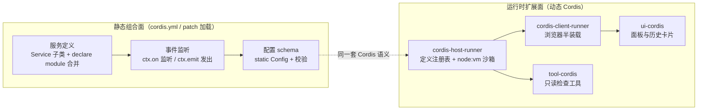
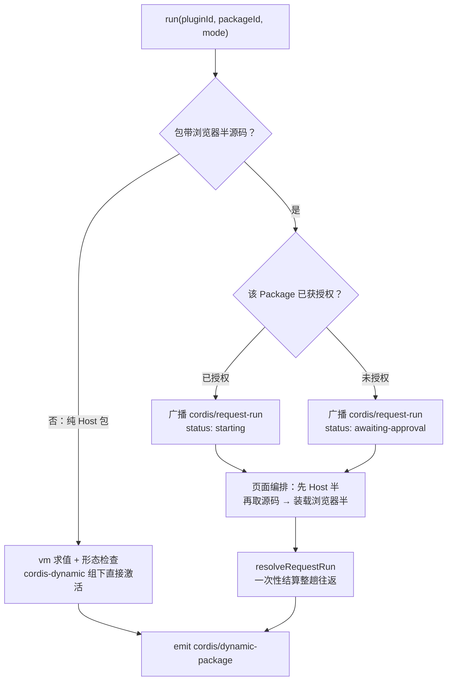
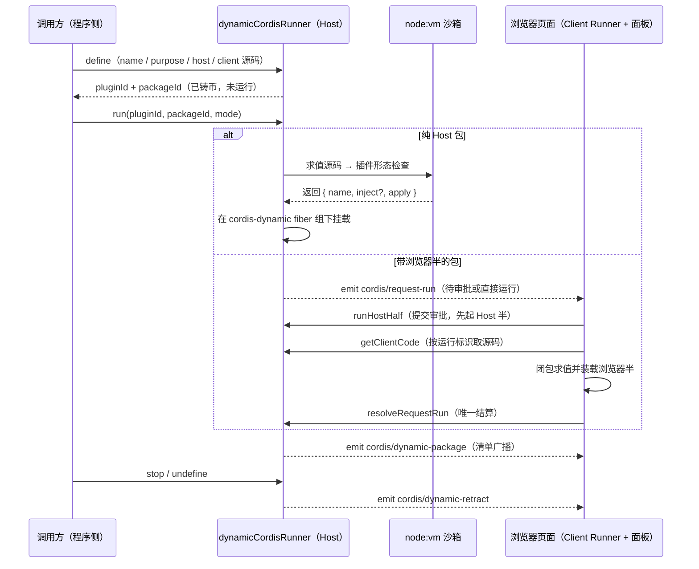

前面几页已经建立了 Cordis 的概念模型与框架级 API 细节。本页是面向实战的综合演练：以本仓库的真实代码为蓝本，演示一个生产级插件如何**定义服务**、如何**监听与发出事件**，以及如何利用 harness 独有的**动态 Cordis** 体系，在不重启、不修改 `cordis.yml` 的前提下给运行中的应用加装插件。阅读本页前建议先完成 [Cordis 入门：插件、上下文、服务注入、类型化事件与可逆副作用](5-cordis-ru-men-cha-jian-shang-xia-wen-fu-wu-zhu-ru-lei-xing-hua-shi-jian-yu-ke-ni-fu-zuo-yong)，并在需要时对照 [Cordis 实战教程（七讲）：从第一个插件到生命周期、服务、事件、配置与 HMR](7-cordis-shi-zhan-jiao-cheng-qi-jiang-cong-di-ge-cha-jian-dao-sheng-ming-zhou-qi-fu-wu-shi-jian-pei-zhi-yu-hmr)。

Sources: [docs/cordis-tutorial/index.zh.md](docs/cordis-tutorial/index.zh.md#L5-L11)

## 三条实战路线全景

一个 harness 插件作者会沿三条路线工作：**静态组合面**上的服务定义、事件监听与配置 schema，构成了 `cordis.yml`/patch 加载的常规插件；**运行时扩展面**上的动态 Cordis 体系，则让"插件"本身成为运行期可创建、可审批、可撤收的对象。两条面共享同一套 Cordis 语义——effect 清理、`inject` 依赖跟踪、fiber 生命周期——这正是动态包能被当作"普通插件"对待的原因。本页依次展开这三个主题，最后给出机制选择指南。



Sources: [packages/extensions/README.zh.md](packages/extensions/README.zh.md#L10-L31)

| 实战路线 | 载体 | 生命周期 | 本页案例 |
|---|---|---|---|
| 服务定义 | `Service` 子类或函数插件 | 随提供方插件卸载而撤销 | `ScheduleService`（定时任务域） |
| 事件监听 | `ctx.on` 注册的监听器 | 监听即 effect，随插件消失 | `agent/created` 挂载调度工具 |
| 动态 Cordis | 进程内定义的 Plugin/Package/Run | 仅进程内存在，重启清空 | `dynamicCordisRunner` 运行往返 |

Sources: [packages/schedule/schedule/src/index.ts](packages/schedule/schedule/src/index.ts#L100-L106), [docs/cordis-tutorial/03-services.zh.md](docs/cordis-tutorial/03-services.zh.md#L39-L42)

## 服务定义实战

### 教程骨架回顾：两部分协同

Cordis 中定义服务由两部分协同完成：**运行时**部分是 `Service` 子类调用 `super(ctx, '名称')` 把实例注册到上下文，此后任何插件都能通过 `ctx.名称` 访问它；**编译时**部分是 `declare module '@deepseek-ai/cordis'` 块利用 TypeScript 声明合并，把该键加入 `Context` 接口，使 `ctx.名称` 处处通过类型检查。注册属于 effect——卸载提供方时会自动移除服务，这正是服务可以被配置层替换的前提。

Sources: [docs/cordis-tutorial/03-services.zh.md](docs/cordis-tutorial/03-services.zh.md#L12-L42)

### 生产模式：`ScheduleService` 的三件套

教程里的 `GreeterService` 只有骨架；生产服务还需要**依赖声明、配置 schema 与 effect 化初始化**三件套。仓库中 `@deepseek-ai/dsh-schedule` 的 `ScheduleService` 是完整范本：它用 `static inject` 声明六个硬依赖（类形态的 `inject`），用 `static Config: z<Config>` 声明经 zod 校验的保留策略配置，并在构造函数里通过 `ctx.effect` 挂接启动/收尾逻辑——运行时 `dispose`、串行队列排空与存储域关闭全部收敛在同一个 effect 的清理函数里，保证插件卸载路径只有一条。

Sources: [packages/schedule/schedule/src/index.ts](packages/schedule/schedule/src/index.ts#L65-L166)

| 维度 | 教程骨架（Greeter） | 生产模式（ScheduleService） |
|---|---|---|
| 依赖声明 | `export const inject = ['greeter']`（消费方） | `static inject = ['agents', 'sessions', 'tools', …]`（提供方自身） |
| 配置 | 无 | `static Config: z<Config>`，字段级 min/max/default 校验 |
| 初始化 | 构造后立即可用 | `ctx.effect` 内等待存储域就绪，失败即回滚关闭 |
| 收尾 | 无资源 | 清理函数依次置停标记、dispose 运行时、排空队列、关闭域 |

Sources: [docs/cordis-tutorial/03-services.zh.md](docs/cordis-tutorial/03-services.zh.md#L49-L59), [packages/schedule/schedule/src/index.ts](packages/schedule/schedule/src/index.ts#L100-L166)

配置块的校验语义与教程一致：`apply`（或类构造）永远收到**完整且经过验证**的配置，缺省字段由 schema 默认值补齐；校验失败时插件 fiber 直接进入 FAILED 状态并给出精确的路径化错误，绝不会在配置不完整时启动。对"每次操作都要读最新值"的字段，还可以用 `.volatile()` 标记——字段变化只更新稳定引用而不重挂插件，Loader 经 `loader/volatile-update` 通知实例。这是静态插件读取配置的两种节奏：普通字段跟插件同生共死，volatile 字段跟操作同生共死。

Sources: [docs/cordis-tutorial/05-config.zh.md](docs/cordis-tutorial/05-config.zh.md#L17-L96)

### 轻量供给与命名纪律

并非所有"服务"都需要一个 `Service` 子类。harness 的服务名称共用一个扁平命名空间，自有服务必须带辨识前缀（`tools`、`llm` 等普通名已被占用）；各子系统页面生成的 `cordis-surface` 区块列出了 harness 已注册的每一个名称，写代码前先查再定名，是避免运行期冲突的第一道纪律。

Sources: [docs/cordis-tutorial/03-services.zh.md](docs/cordis-tutorial/03-services.zh.md#L92-L94)

## 事件监听实战

### 监听即 effect

`ctx.on()` 属于 effect：监听器随插件一同消失，不需要手动维护 `removeListener`。这意味着事件监听的正确粒度就是插件本身——插件活着，观察就在；插件卸载，观察自动撤收。声明新事件时同样走声明合并：`interface Events` 块声明事件名与监听器签名，让 `ctx.emit` 与 `ctx.on` 双双获得完整类型；`namespace/action` 命名约定让扁平事件空间保持可读。

Sources: [docs/cordis-tutorial/04-events.zh.md](docs/cordis-tutorial/04-events.zh.md#L14-L21), [docs/cordis-tutorial/04-events.zh.md](docs/cordis-tutorial/04-events.zh.md#L44-L78)

### 分发模式与 waterfall 纪律

事件采用哪种分发模式是其约定的一部分，决定了监听器能否返回值、能否并发、能否短路：

| 模式 | 调用 | 语义 |
|---|---|---|
| emit | `ctx.emit(name, ...args)` | 同步广播；不等待、不收集返回值 |
| parallel | `await ctx.parallel(...)` | 全部监听器并发运行，一同等待 |
| serial | `await ctx.serial(...)` | 顺序运行；首个非 `null`/`false`/`undefined` 返回值胜出并停止 |
| bail | `ctx.bail(...)` | serial 的同步版本 |
| waterfall | `ctx.waterfall(..., next)` | 环绕中间件，可转换或短路 |

Sources: [docs/cordis-tutorial/04-events.zh.md](docs/cordis-tutorial/04-events.zh.md#L82-L92)

waterfall 是实战中最容易出错的模式，本仓库为此立了常设纪律：**只负责观察或标注的 waterfall 监听器必须调用 `next()`**；不调用就直接返回代表有意短路。一个忘记调用 `next()` 的日志监听器会悄无声息地吞掉所有下游默认行为。harness 用 waterfall 承载协作式决策——`agent/request` 允许插件替换模型调用配置，`approval/request` 允许策略代替用户作答，`tools/pre-execute` 允许钩子插件返回类型化的 allow/deny 决策——这些扩展点的监听器都必须明确表态：要么传递 `next()`，要么接管决策。

Sources: [docs/cordis-tutorial/04-events.zh.md](docs/cordis-tutorial/04-events.zh.md#L96-L140), [docs/cookbook/extension-cookbook.zh.md](docs/cookbook/extension-cookbook.zh.md#L17-L35)

### 生产示例：随 Agent 生命周期挂载工具

`ScheduleService` 展示了一组配合使用的监听器：插件在 `agent/created` 时把调度工具挂到每个根 Agent 上，用 `WeakSet` 去重、用 `Map` 记录每个 Agent 对应的 disposer；`agent/disposed` 时取出并执行对应的清理；`session/created` 时回放历史事件恢复任务。注释里写明了关键推理——"插件作用域的 effect 负责 Agent 释放时拆除注册，所以它也必须在 Agent 本身被释放时处置"——这是**监听器持有跨对象资源**时的标准簿记模式：注册与注销成对出现在两条事件上，而生命周期归属由 effect 保证。

Sources: [packages/schedule/schedule/src/index.ts](packages/schedule/schedule/src/index.ts#L167-L188)

### 发出方纪律：通知不是事务参与者

事件发出侧同样有纪律。`ScheduleService` 的 `emitChanged()` 在每次持久化任务写入落地后发出 `schedule/changed`，但用 `try/catch` 包裹同步监听器异常——因为 emit 是内联分发，一个抛错的观察者不能拒绝调用方或跳过随后的 `requestDrive()`。这条模式可以概括为：**通知型事件的发出方对监听器异常负责兜底，业务型 waterfall 的发出方则把决策权交给监听器链**。选择哪种事件域（会话事件、`agent/*` 实时事件、能力事件）的完整原则，参见 [事件域与扩展点：会话事件、agent/* 实时事件与能力事件的选择原则](12-shi-jian-yu-yu-kuo-zhan-dian-hui-hua-shi-jian-agent-shi-shi-shi-jian-yu-neng-li-shi-jian-de-xuan-ze-yuan-ze)。

Sources: [packages/schedule/schedule/src/index.ts](packages/schedule/schedule/src/index.ts#L388-L403)

## 动态 Cordis：给运行中的应用加装插件

### 三个配置面的分工

harness 有三条"让插件进入运行时"的路径，作用域与持久性完全不同。**静态组合**（`cordis.yml` 与各 bundle 的 patch 层）由部署者编写，重启或 HMR 生效；**Plugin Manager**（`@deepseek-ai/dsh-plugin-manager`）负责持久化安装外部组合包：启停 profile 插件条目、安装/删除 npm 或 git 组合包，改动写入 `cordis.patch.yml` 与 `package.json`，启用 HMR 时配置变化立即生效；**动态 Cordis**（`packages/extensions` 包组）则在进程内定义、审批、运行和撤收插件——定义按会话隔离、仅存在于内存中，重启即清空，适合试验性、一次性的运行时扩展。

Sources: [packages/boot/plugin-manager/README.zh.md](packages/boot/plugin-manager/README.zh.md#L10-L42), [packages/extensions/cordis-host-runner/README.zh.md](packages/extensions/cordis-host-runner/README.zh.md#L48-L54)

### 包组地图

动态 Cordis 由四个包协作完成，各占一个平台面：

| 包 | 职责 | 平台面 |
|---|---|---|
| `cordis-host-runner` | 定义注册表、`node:vm` 沙箱化的 host 半生命周期、inspect 注册表；提供 `ctx.dynamicCordisRunner` 与 `ctx.cordisInspect` | Node 宿主 |
| `cordis-client-runner` | 将浏览器半源码求值为运行中的插件，应答运行请求 | 浏览器页面 |
| `ui-cordis` | 控制面板与历史生命周期工具卡片 | 浏览器侧 slot |
| `tool-cordis` | 两个只读运行时 API 发现工具 | 注册到 `ctx.tools` |

Sources: [packages/extensions/README.zh.md](packages/extensions/README.zh.md#L23-L31)

### Plugin / Package / Run 模型

动态体系有三个核心实体：**Plugin** 是稳定实例，持有属主会话、版本指针与审批记录；**Package** 是不可变版本，携带 `name`、`purpose` 与可选的 `host`/`client` 两半源码——每次修改都会铸造新的 Package 而非就地改写；**Run** 是一次活跃激活，持有 host 半 fiber、handler 表与渲染失败记录，同一 Plugin 最多有一个在途活动。`define` 请求即围绕此模型构造：会话属主、新建或追加到既有 Plugin、名称、用途、至少一半源码。

Sources: [packages/extensions/cordis-host-runner/src/registry.ts](packages/extensions/cordis-host-runner/src/registry.ts#L16-L98)

服务本身是标准的 Cordis 服务类：`DynamicCordisRunnerService extends TypertRemoteService`，`static inject = ['tools']`，`static Config` 只有一个字段 `vmTimeoutMs`（默认 5000 毫秒，约束 host 半在 vm 中同步求值的时限）。`define` 对元数据做去空格与必填校验、对两半源码做语法预检（不执行任何代码），然后铸造 Plugin 与 Package 标识——注意 `define` 只登记，不运行。

Sources: [packages/extensions/cordis-host-runner/src/index.ts](packages/extensions/cordis-host-runner/src/index.ts#L128-L207)

### 生命周期：define → run → 审批 → 装载 → 撤收

`run` 是整个体系的枢纽，其分支逻辑如下图：纯 host 包在沙箱中求值后直接激活；带浏览器半的包必须广播一次 `cordis/request-run`，由某个已连接页面驱动编排——先起 host 半（host 半失败会在浏览器动作之前短路）、再取浏览器半源码、再装载，最后一次结算。是否需要人工审批由该 Package 的授权记录决定：未经批准的浏览器半等待用户决策，批准后该 Package 及（可选地）同 Plugin 的未来版本被记入授权集合。



Sources: [packages/extensions/cordis-host-runner/src/index.ts](packages/extensions/cordis-host-runner/src/index.ts#L253-L360)

完整的运行往返时序如下（`stop` 与 `undefine` 是它的逆操作：停止保留全部版本只撤下活跃 Run，移除则连注册表条目一起删除，并向属主会话注入用户上下文消息）：



Sources: [docs/subsystems/extensions.zh.md](docs/subsystems/extensions.zh.md#L277-L381), [packages/extensions/cordis-client-runner/README.zh.md](packages/extensions/cordis-client-runner/README.zh.md#L73-L76)

服务端对"谁在作答"有严格校验：`runHostHalf` 会核对请求身份、Plugin/Package/模式三元组与最新运行尝试的状态机，陈旧的作答（作答期间 revision 已被顶掉）会收到 `accepted: false`，请求保持可作答直到另一个页面作答或调用方取消。装载本身是幂等的：重复装载同一 revision 不改变任何东西，新 revision 顶替旧 revision，同一定义的操作串行执行；页面刷新按设计从干净状态开始，浏览器半需要再次显式运行才会加载。

Sources: [packages/extensions/cordis-host-runner/src/index.ts](packages/extensions/cordis-host-runner/src/index.ts#L329-L360), [packages/extensions/cordis-client-runner/README.zh.md](packages/extensions/cordis-client-runner/README.zh.md#L36-L40)

### host 半沙箱：可用面与重定向

host 半在 `node:vm` 的全新 realm 中求值。沙箱立场必须先讲清楚：**隔离全局变量，但不是安全边界**。全局变量被系统性重定向到 Cordis 服务——`require`/`fetch`/定时器全部不可用，取而代之的是教学生式的陷阱错误，指引作者声明 `inject: ['fs']`、`['web']`、`['bash']` 或 `['timer']`；`console` 是带包 ID 标签的直通实现；`harness` 对象提供注册动词。求值返回值经过形态检查（函数或带 `apply` 的对象）后，在 `cordis-dynamic` fiber 组下作为子 fiber 挂载——启动失败会被 `dispose` 后重抛，绝不留下挂载失败的 fiber。

Sources: [packages/extensions/cordis-host-runner/src/sandbox.ts](packages/extensions/cordis-host-runner/src/sandbox.ts#L1-L117), [packages/extensions/cordis-host-runner/src/lifecycle.ts](packages/extensions/cordis-host-runner/src/lifecycle.ts#L14-L57)

| 沙箱内访问 | 行为 |
|---|---|
| `harness.defineTool` / `harness.registerTool` | 真实工具 DSL，schema 规范化 + 跨 realm JSON 克隆；仅接受带标记的定义 |
| `harness.handle(method, fn)` | 注册浏览器半可调用的 Host 方法，结果经 JSON 物化 |
| `ctx.on` / `ctx.once` / `ctx.provide` | 白名单动词；`provide` 以轻量方式向其他包供给服务 |
| `ctx.timeout` 等定时器 | 需先 `inject: ['timer']`，调用是 fiber effect，停止时自动清理 |
| `ctx.tools.register` / `schemas` / `get` | 注册 + 只读元数据；`get` 只返回 schema 视图，绝不暴露可调用的 `execute` |
| 声明的 `inject` 服务 | 经 Proxy 包装：方法返回值若为 `Context` 直接拒绝，防止沙箱代码拿到未守卫的运行时句柄 |
| 未声明的服务 / 框架内部 | 抛出教学式错误，区分"请在 inject 中声明"与"框架内部按设计不暴露" |

Sources: [packages/extensions/cordis-host-runner/src/guard.ts](packages/extensions/cordis-host-runner/src/guard.ts#L542-L655), [packages/extensions/cordis-host-runner/src/guard.ts](packages/extensions/cordis-host-runner/src/guard.ts#L713-L781)

动态包的写法与静态插件同构，只是注册动词换成了沙箱门面。以下是仓库测试中真实使用的四个 host 半源码样例，分别演示监听事件、注册工具、供给服务与注入消费：

```ts
// 监听者：在每次 tools/change 上打日志
return {
  name: 'change-logger',
  apply(ctx) {
    ctx.on('tools/change', () => console.log('tools changed'))
  },
}

// 工具注册者：经沙箱 harness 助手注册一个 reverse_text 工具
return {
  name: 'reverse-text',
  inject: ['tools'],
  apply(ctx) {
    harness.registerTool(ctx, harness.defineTool({
      name: 'reverse_text',
      description: 'Reverse a string.',
      parameters: { text: { type: 'string', required: true } },
      output: { schema: { type: 'string' }, render(_args, value) { return [{ type: 'text', text: value }] } },
      async execute(args) { return args.text.split('').reverse().join('') },
    }))
  },
}

// 服务供给者：ctx.provide 轻量供给，无需 Service 子类
return {
  name: 'greeter-provider',
  apply(ctx) { ctx.provide('greeter', { greet: (name) => 'hi ' + name }) },
}

// 服务消费者：注入 greeter 服务并暴露为工具
return {
  name: 'greeter-consumer',
  inject: ['greeter', 'tools'],
  apply(ctx) {
    harness.registerTool(ctx, harness.defineTool({
      name: 'greet', description: 'Greet someone via the greeter service.',
      parameters: { name: { type: 'string', required: true } },
      output: { schema: { type: 'string' }, render(_args, value) { return [{ type: 'text', text: value }] } },
      async execute(args) { return ctx.greeter.greet(args.name) },
    }))
  },
}
```

Sources: [packages/extensions/cordis-host-runner/tests/helpers.ts](packages/extensions/cordis-host-runner/tests/helpers.ts#L171-L237)

注意 `inject` 在沙箱里的额外含义：host 半只能触达它声明过的服务——这正是 Cordis 依赖跟踪在沙箱边界的延续，声明过的提供方消失时动态包会照常 park，服务恢复时照常激活；`missingServices` 辅助函数还能读出一个已 settle 但未激活的 fiber 正在等待哪些服务。

Sources: [packages/extensions/cordis-host-runner/src/guard.ts](packages/extensions/cordis-host-runner/src/guard.ts#L700-L711), [packages/extensions/cordis-host-runner/src/lifecycle.ts](packages/extensions/cordis-host-runner/src/lifecycle.ts#L47-L57)

### 浏览器半与审批语义

浏览器半是纯 JavaScript——无 JSX、无 TypeScript、不能 import 模块——作为一个 async 函数运行，拿到一组固定名字：`React`、`console`、`styles` 与 `host`（`host.call` 回调 Host 半注册的 handler）；`fetch`、`setTimeout` 等浏览器全局同样不可用。它与 host 半共用同一套激活门控、effect 清理与状态投影：求值后的插件被塞进模块表并经 loader 挂载，卸载时先移除 entry、等待 fiber 清理完成、再使 factory 失效并撤下样式。渲染失败发生在加载回执之后，由 Client 侧逐 entry 上报，Host 每包只保留最新一条并经 steering 发送给属主会话。

Sources: [packages/extensions/cordis-client-runner/README.zh.md](packages/extensions/cordis-client-runner/README.zh.md#L30-L41), [packages/extensions/cordis-client-runner/README.zh.md](packages/extensions/cordis-client-runner/README.zh.md#L111-L123)

审批是框架级的而非页面级的：任何已连接页面都可以应答任何会话发起的运行请求，首个有效作答胜出。`ui-cordis` 面板渲染全部定义（不按会话过滤，当前会话的行置顶成组），侧边栏席位显示"在跑数 + 待确认数"角标；面板不把运行态放进组件 state，而是在收到四条 `cordis/*` 公告（`dynamic-package`、`dynamic-retract`、`request-run`、`request-run-resolved`）时触发单飞的清单重读。历史上模型写下的 `cordis_define`/`cordis_run` 调用以只读卡片形式留存在会话流中；当前内置模型工具**不能**创建或更新动态定义，创建入口是程序侧 `define` 与面板手势。

Sources: [packages/extensions/ui-cordis/README.zh.md](packages/extensions/ui-cordis/README.zh.md#L30-L42), [packages/extensions/ui-cordis/README.zh.md](packages/extensions/ui-cordis/README.zh.md#L56-L76), [packages/extensions/cordis-host-runner/README.zh.md](packages/extensions/cordis-host-runner/README.zh.md#L107-L111)

### 只读检查：先查询再写代码

`tool-cordis` 为"写插件之前的侦察"提供两个只读工具：`cordis_inspect_list` 列出 Host 已知的全部 Inspect Provider（含从浏览器同步来的 manifest），每个条目带平台、用途、方法与输入/输出 schema；`cordis_inspect_query` 执行一次只读查询，可读到精确的服务方法签名、事件模式、插件配置 schema、工具 schema、主题 token 与 live slot 树。工具描述明确要求：platform/provider/method 必须来自 `cordis_inspect_list` 的结果，不要猜名字，也不要把 Inspect 方法当业务服务调用。挂载时注意：Host provider（`@deepseek-ai/dsh-tool-cordis/host`）每进程挂载一次，preset 行只控制 Agent 工具面，仅有 preset 行不会注册任何 Host provider；浏览器查询则需要已连接页面。

Sources: [packages/extensions/tool-cordis/src/index.ts](packages/extensions/tool-cordis/src/index.ts#L22-L72), [packages/extensions/tool-cordis/README.zh.md](packages/extensions/tool-cordis/README.zh.md#L25-L29), [packages/extensions/tool-cordis/README.zh.md](packages/extensions/tool-cordis/README.zh.md#L69-L72)

## 排错速查

| 症状 | 根因 | 处理 |
|---|---|---|
| run 失败，消息含 `already registered` | 新版本要在旧 Run 仍持有名字时注册同名产物 | 先经 runner 或面板 stop 旧包，再运行新版本 |
| host 半 settle 后始终不激活 | `inject` 声明的服务尚无提供方 | 合法语义；用 `missingServices` 读出等待清单，补挂提供方或改声明 |
| 带浏览器半的包 run 一直挂起 | headless/ACP 部署没有页面应答，且挂起请求无超时 | 换纯 host 包，或在有连接页面的部署中运行；取消提问轮次可解除挂起 |
| `vmTimeoutMs` 似乎没约束住 | 该上限只约束同步求值，async 函数体会逃出 | 与工具集一致的协作式信任立场；不要把动态包当恶意代码防线 |
| 运行成功但 UI 没出现 | React 渲染在加载回执之后，可能事后崩溃 | 失败经 steering 发往属主会话，同时在浏览器面板本地显示 |
| 重启后定义消失 | 定义注册表在进程内存中，仅按会话隔离 | 需要持久化请改走 Plugin Manager 安装组合包 |
| 检查工具列表里看不到某插件 | `Config.listConfigs` 只遍历 profile 的 Loader 树 | 仅出现在 agent preset 声明里的插件不会被列出，除非 profile 树也挂载了它 |

Sources: [packages/extensions/cordis-host-runner/src/lifecycle.ts](packages/extensions/cordis-host-runner/src/lifecycle.ts#L33-L44), [packages/extensions/cordis-host-runner/README.zh.md](packages/extensions/cordis-host-runner/README.zh.md#L121-L134), [packages/extensions/tool-cordis/README.zh.md](packages/extensions/tool-cordis/README.zh.md#L69-L72)

## 路径选择与延伸阅读

| 机制 | 生效时机 | 持久性 | 适用场景 |
|---|---|---|---|
| `cordis.yml` / patch 静态组合 | 加载时（或 HMR 刷新） | 随配置文件 | 部署者可控的功能组合 |
| Plugin Manager 安装组合包 | 保存后组合（在线 profile 即时，否则重启） | 写入 profile 文件 | 安装第三方/外部插件并长期启停 |
| 动态 Cordis runner | 进程内即时 define/run | 仅内存、按会话隔离 | 试验、演示、运行期一次性扩展 |
| 直接 `ctx.tools.register` | 插件 `apply` 内 | 随插件卸载注销 | 自带包交付的内置工具 |

Sources: [packages/boot/plugin-manager/README.zh.md](packages/boot/plugin-manager/README.zh.md#L29-L42), [docs/cordis-tutorial/07-into-the-harness.zh.md](docs/cordis-tutorial/07-into-the-harness.zh.md#L50-L84)

无论走哪条路径，机制内核都是同一套：注册是 effect、依赖靠 `inject` 跟踪、决策走 waterfall。下一步建议按需深入：为模型添加生产级工具请读 [工具系统与执行流水线：ToolDefinition、schema DSL 与 pre/execute/post 把关事件](16-gong-ju-xi-tong-yu-zhi-xing-liu-shui-xian-tooldefinition-schema-dsl-yu-pre-execute-post-ba-guan-shi-jian) 与 [扩展手册：添加工具、包、LLM 适配器、Remote API 与设置卡片](24-kuo-zhan-shou-ce-tian-jia-gong-ju-bao-llm-gua-pei-qi-remote-api-yu-she-zhi-qia-pian)；需要框架级 API 细节（Context、Service、Fiber、Event、Registry）请回到 [Cordis API 参考：Context、Service、Fiber、Event 与 Registry 的框架级细节](8-cordis-api-can-kao-context-service-fiber-event-yu-registry-de-kuang-jia-ji-xi-jie)；完成实战后，进入 [测试策略：单元测试、100% 覆盖率门禁与真实 API e2e](26-ce-shi-ce-lue-dan-yuan-ce-shi-100-fu-gai-lu-men-jin-yu-zhen-shi-api-e2e) 了解如何为你的插件建立质量门禁。