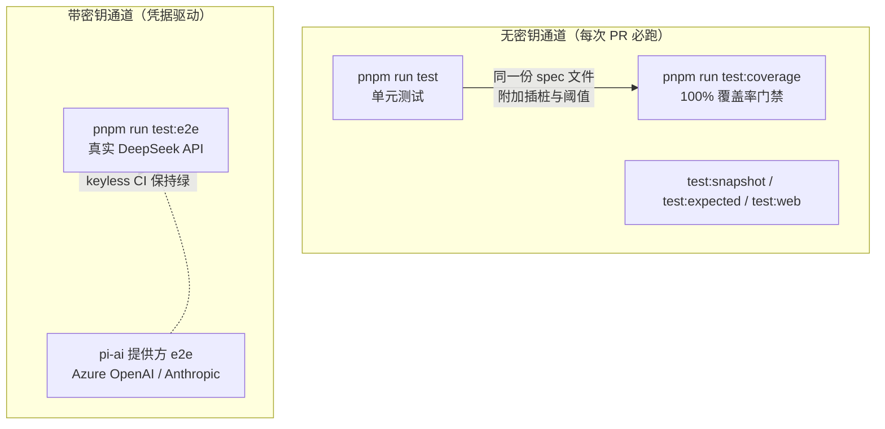
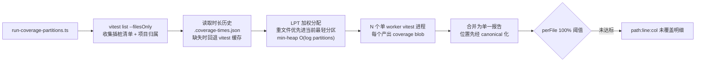
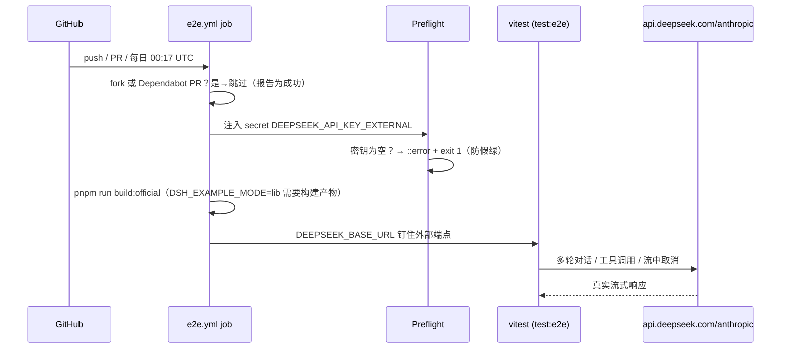

本页剖析 deepseek-harness 仓库的测试体系如何分层组织：单元测试的同包布局与双项目执行模型、对 `packages/*/*/src` 逐文件 100% 覆盖的门禁机制（含豁免与分区调度）、以及调用真实提供方 API 的 e2e 通道如何通过"自跳过 + CI 防假绿"实现 keyless 与 credentialed 双形态运行。快照、浏览器与基准测试通道仅作总览，细节分别归属于快照与性能基准专页。

## 测试通道总览：一条命令就是一条契约

仓库将测试组织为若干条彼此独立的命令通道，每条通道对应一个明确的验证目标和一个 CI 门禁位置。这个设计的核心原则写在 `docs/testing.zh.md` 中：绿色测试套件必须"有意义"——每条通道只回答一类问题，且不允许某条通道的绿灯替代另一条通道的证明。

| 通道 | 命令 | 验证目标 | CI 归属 |
| --- | --- | --- | --- |
| 单元测试 | `pnpm run test` | 包/应用/脚本的 `tests/**` 单元行为 | PR 门禁 |
| 覆盖率门禁 | `pnpm run test:coverage` | `packages/*/*/src` 按文件 100% 覆盖 | PR 必需门禁（`node 24 / coverage`） |
| 真实 API e2e | `pnpm run test:e2e` | 带密钥调用 DeepSeek 等真实提供方 | 独立工作流 `E2E (real DeepSeek API)` |
| 预期输出 | `pnpm run test:expected` | 无密钥组装 CLI/进程预期 | PR 门禁 |
| 性能基准 | `pnpm run test:bench` | 耗时/堆/缩放预算 | 必需门禁 `node 24 / benchmarks` |
| 快照 | `pnpm run test:snapshot` | 录制会话回放的持久化预期 | PR 门禁 |
| Web 快照 | `pnpm run test:web` | Chromium/WebKit 浏览器输出 | 必需的 Linux PR 门禁 |

这份清单并非本页作者的归纳，而是仓库成文的测试契约：[testing.zh.md](docs/testing.zh.md#L7-L15)。其中覆盖率门禁的定位尤其值得注意——文档明确指出"未覆盖的行往往是门禁正确标记出的死代码（应删除），而非需要补写的测试"，也就是说 100% 门禁在这里首先是一台死代码探测器，其次才是补测试的驱动力。



图中虚线表达一个关键机制：e2e 套件是**自跳过**的——本地无密钥时整个套件安静跳过，不影响开发流；而 CI 在可信事件上通过 preflight 强制密钥存在，防止"全部跳过"伪装成绿灯。下文分三节展开。

Sources: [testing.zh.md](docs/testing.zh.md#L7-L15)

## 单元测试：同包布局与双项目执行模型

单元测试的物理布局遵循"测试文件与其所覆盖的代码区域放在一起"的约定：每个包持有自己的 `tests/` 目录，vitest 的 include 模式与之一一对应。根配置收集四类文件——`packages/*/*/tests/**/*.spec.{ts,tsx}`、`apps/*/tests/**/*.spec.{ts,tsx}`、`scripts/**/*.spec.ts`（仓库脚本的元测试）与 `website/tests/**/*.spec.ts`：

```ts
const testIncludes = [
  'packages/*/*/tests/**/*.spec.{ts,tsx}',
  'apps/*/tests/**/*.spec.{ts,tsx}',
  'scripts/**/*.spec.ts',
  'website/tests/**/*.spec.ts',
]
```

注意 `.tsx` 被显式纳入——客户端组件 spec 通过**逐文件 `@vitest-environment` pragma** 选择 jsdom 环境，而非全局切换。`scripts/**/*.spec.ts` 的存在意味着仓库的校验脚本自身也是被测对象：文档标准、翻译配对、门禁调度器都由 vitest 套件钉住。

执行模型上，配置通过 **projects 机制**将全部 spec 拆进两个互斥项目。绝大多数套件进入 `thread-safe` 项目；少数触碰进程全局状态或时序敏感 I/O 的套件（JSONL 持久化、子进程、ACP 子代理等 8 个文件）被显式列入 `processBoundTests`，进入 `process-bound` 项目做清单隔离。两个项目都使用 `pool: 'forks'`——配置注释记录了原因：Node 24 在三种平台上都出现过 worker 线程触发 CJS 词法分析器崩溃的问题，fork 出的 worker 避开了这条共享线程路径。

平台条件排除同样在配置层完成：Windows 上排除所有依赖真实 POSIX shell 的套件（bash-local、bash-sandbox、tool-bash、ssh 全家），但**刻意保留** pwsh 套件——PowerShell 随 Windows 自带，可以原生运行；显式列表而非 `packages/shell/*` 通配，保证了 Service Definition 包 `packages/shell/shell` 在 Windows 上继续执行。非 Linux 主机还排除与 Worker 固定 Linux 平台对齐的 oracle-diff 套件，因为"宿主原生 Windows/macOS 行为不是它们的参照物"。

Sources: [vitest.config.ts](vitest.config.ts#L123-L128)、[vitest.config.ts](vitest.config.ts#L150-L203)、[vitest.config.ts](vitest.config.ts#L27-L46)

### 解析规则：只允许源码，永远不允许 lib

所有 vitest 配置共享同一条解析约定：`vite-tsconfig-paths` 指向 `tsconfig.base.json`，工作区裸导入**永远解析到 `src`**，绝不经由包的 `exports` 解析到构建后的 `lib/`。仓库文档给出了精确理由——`lib/` 中的陈旧产物会加载第二份模块单例，让依赖单例状态的测试结果随构建新鲜度漂移。配套地，所有配置共享 `vitestExecArgv`（`--no-webstorage`，防止进程级 Web Storage 遮蔽 jsdom 存储）和一个预转译装饰器的 Vite 插件——它还会把编译器合成的装饰器访问器标记为 `v8 ignore`，避免无源码行为的合成代码污染覆盖率。

三个 setup 文件在每个项目中生效：`test-proxy-environment.ts`（代理环境）、`test-invariants.ts`（不变量）、`test-dom-environment.ts`（DOM 环境）。e2e 配置复用前两个但不含 DOM 环境，因为真实 API 套件全部运行在纯 Node 下。

Sources: [testing.zh.md](docs/testing.zh.md#L43-L45)、[vitest.shared.ts](vitest.shared.ts#L9-L43)、[vitest.config.ts](vitest.config.ts#L161-L167)

## 100% 覆盖率门禁：perFile 四维阈值与豁免契约

覆盖率配置的核心是一段几乎不需要解释的阈值声明：

```ts
thresholds: {
  perFile: true,
  statements: 100,
  branches: 100,
  functions: 100,
  lines: 100,
}
```

`perFile: true` 是语义关键：覆盖率按**单文件**判定，一个大而全的高覆盖文件不能补贴一个几乎没测的小文件——"100% or it doesn't merge"。四个维度全部 100%，分支覆盖的纳入尤其重要，因为行覆盖只能证明行被执行过，无法证明每个决策路径都被验证过。

失败时的报告同样经过设计：除内置 `text`（本地还有 `html`）外，自定义 CJS reporter 会为每个未达标文件打印**精确的 `path:line:col` 未覆盖语句/分支/函数记录**——注释解释了为什么必须是绝对路径：istanbul-reports 通过 `require()` 加载自定义 reporter，这也是该 reporter 采用 CJS 的原因。内置 threshold ERROR 只能报文件名，这个 reporter 补上了定位信息。

Sources: [vitest.config.ts](vitest.config.ts#L358-L375)、[vitest.config.ts](vitest.config.ts#L14-L17)

### 测量范围：include 与四类 exclude

插桩范围被刻意收窄到 `packages/*/*/src/**/*.{ts,tsx}`——"覆盖率测量的是我们的运行时源码"，vendor 与应用/配置 fixture 天然出局，`.tsx` 客户端组件与其他代码一视同仁地受门禁约束。

exclude 清单则揭示了门禁的成熟度哲学，可归纳为四类：

| 豁免类别 | 代表条目 | 理由 |
| --- | --- | --- |
| 无可执行代码/进程外入口 | `types.ts`、`bin.ts`、`worker.ts` | 类型文件无运行时覆盖；自执行入口若被单测导入会在进程内启动，真实覆盖来自子进程/Worker 测试 |
| GUI 债务 | `ui-chat/src/client/chat/*` 等数十条 | 剩余分支需要浏览器级 harness，jsdom 通道尚不可达；每条附 `TODO(gui)` 与移除条件 |
| 平台不对称 | `sandbox-windows-acl/src/**`、`lease.ts` 的 POSIX 面 | 源码只在单一平台执行，对侧通道永远盖不到；行为由注入绑定的单测钉住 |
| 条件探测豁免 | `pwshCoverageExclusions` | 运行时探测 pwsh 是否可用——套件在无 pwsh 主机上自跳过，对应源文件保持豁免；CI runner 带 pwsh，照常执行完整门禁 |

第四类最能体现工程精度：pwsh 探测直接调用套件自己的 `resolve.ts` 模块来检测，保证"豁免恰好在与套件跳过相同的条件下生效"——探测范围若比套件更窄，就会在套件实际运行的主机上错误豁免文件。此外配置对两个环境变量做了硬校验：`DSH_COVERAGE_EXEMPT_HEAVY` 与 `DSH_COVERAGE_PARTITION_MODE` 若被设置但值不是 `'1'`，直接抛错——**配置错误必须失败，不允许静默降级**。

Sources: [vitest.config.ts](vitest.config.ts#L204-L215)、[vitest.config.ts](vitest.config.ts#L116-L145)

### 重型套件的并行豁免通道

部分套件在 v8 插桩下付出数倍运行时代价（编译器 fixture、真实子进程），却对阈值贡献为零。仓库没有让它们拖慢插桩门禁，而是建立了一条并行豁免通道：`DSH_COVERAGE_EXEMPT_HEAVY=1` 时，豁免清单中的套件从插桩运行中剔除，随后**未经插桩地**在旁路 gate 中照常执行——正确性信号不变，只免去插桩税。

准入规则写在 `scripts/coverage-exempt.ts` 的成员契约中：一个套件有资格豁免，当且仅当它在进程内执行的每个受覆盖率测量的文件**已经被其他套件完全覆盖**，从而把它移出插桩运行不改变任何阈值结果。当前清单包括 typert 编译器套件、webworker-runtime 全套（含一个 900 秒预算的全语料导入检查）、三个脚本 spec 和 packer 的构建产物证明套件。

Sources: [scripts/coverage-exempt.ts](scripts/coverage-exempt.ts#L5-L26)、[vitest.config.ts](vitest.config.ts#L130-L139)

## 分区执行：让 100% 门禁在 CI 上可调度

逐文件 100% 门禁作用于整个 monorepo 的 src 树，单进程插桩运行的时间成本不可接受。仓库的解法是把插桩运行**拆成 N 个单 worker 分区**，最后合并报告。入口是 `pnpm run test:coverage:partitioned`，由 `DSH_COVERAGE_PARTITIONS`（必须为 ≥2 的整数）指定分区数。



调度算法值得细看：`assignWeightedPartitions` 按**最长处理时间优先（LPT）**分配——文件按记录时长降序排列，依次放入当前最轻的分区桶，min-heap 维护桶序使每次放置为 O(log partitions)。相同时长按文件名字典序打破平局；堆比较在总权重相等时偏向文件数更少的桶，让时长稀疏的首轮运行仍能均衡文件数。时长历史持久化在仓库根的 gitignored 文件 `.coverage-times.json` 中——CI 每次检出都会清掉 `node_modules/.vite`，vitest 自身缓存无法在 CI 存活，这个文件让自托管 runner 跨运行保留测量；新测量覆盖旧值，已删除的 spec 条目随之清理。

两个细节保证了分区的正确性：其一，分区进程内的阈值与报告被环境变量抑制，只有合并后的最终报告执行一次阈值判定；其二，`vitest list --filesOnly` 收集清单时保留了每文件的项目归属（`thread-safe` / `process-bound`），分区配置把文件列表按项目拆开下发——两个项目互斥，若把整个分区列表交给每个项目，普通文件会被执行两次。

Sources: [scripts/coverage-partitions.ts](scripts/coverage-partitions.ts#L16-L26)、[scripts/coverage-partitions.ts](scripts/coverage-partitions.ts#L292-L320)、[scripts/coverage-partitions.ts](scripts/coverage-partitions.ts#L163-L179)、[scripts/run-coverage-partitions.ts](scripts/run-coverage-partitions.ts#L8-L31)

### 门禁编排与 CI 环境预算

`run-gates.ts` 把覆盖率组织为一个三节点依赖图：`native-system` 构建先行，随后**插桩门禁与豁免重型套件门禁并行**。`DSH_COVERAGE_MAX_WORKERS` 总预算在两条通道间按 2:1 分割（豁免通道拿 1/3）——注释解释了不对称的原因：豁免通道的墙钟由其最长的单个文件主导，多 worker 边际收益低。CI 环境下若未显式指定分区数，`ciWorkerEnvironment` 按 `total - floor(total/3)` 自动推导插桩分区数。

真实的 PR job 印证了这套预算的使用方式：`node 24 / coverage` job 声明 `DSH_COVERAGE_TEST_TIMEOUT_MS: '90000'`——注释记录了具体案例（subprocess-local 与 bash-sandbox 的清理用例在托管镜像的共享主机上超过默认 5000ms 预算），并把超时参数同时提升到 test、`expect.poll` 与 hook 三个默认值上，因为"setup 与 teardown 承受同样的主机争用"。`DSH_GATE_FAIL_FAST: '1'` 让一个 gate 失败立即中止兄弟 gate，不再空等另一条多分钟的插桩运行。

Sources: [scripts/run-gates.ts](scripts/run-gates.ts#L671-L706)、[scripts/run-gates.ts](scripts/run-gates.ts#L659-L669)、[scripts/run-gates.ts](scripts/run-gates.ts#L185-L207)、[ci.yml](.github/workflows/ci.yml#L110-L134)

## 真实 API e2e：自跳过、防假绿与密钥流转

e2e 通道的独立配置文件开门见山地说明了它为何单独存在："真实 API 套件，独立成套因为它花费 token"。配置加载 gitignored 的根目录 `.env`（Node 原生 `process.loadEnvFile`，文件不存在则静默跳过），并接受 `DSH_E2E_MAX_WORKERS` 控制文件级并行度（默认 4，设为 1 恢复串行）。

执行参数针对真实模型的特性调校：`testTimeout: 120_000`（真实生成需要宽裕时间）、`retry: 2`（注释点名瞬时抖动来源——共享内部密钥会撞并发配额）、`hookTimeout: 30_000`。覆盖率在此**显式关闭**——配置注释明确"单元套件拥有覆盖率门禁"，两条通道职责不重叠。include 范围同样收窄：`packages/*/*/tests/**/*.e2e.ts` 加上 `apps/cli` 与 `apps/desktop` 的 e2e；`**/*.expected.e2e.ts` 被排除（属预期输出通道），浏览器侧 e2e 归属 `test:web` job。

Sources: [vitest.e2e.config.ts](vitest.e2e.config.ts#L31-L61)

### 自跳过模式：密钥即开关

带密钥测试的标准写法是按用例检查环境变量，用 `describe.skipIf` 控制整组跳过。`llm-pi-ai` 的双提供方套件是范本：

```ts
const azureOpenAIKey = process.env.AZURE_OPENAI_API_KEY
// 严格 ANTHROPIC_*：DeepSeek 端点不服务 anthropic-messages 协议，
// 回退 DEEPSEEK_API_KEY 会把 keyless 跳过变成 404。
const anthropicApiKey = process.env.ANTHROPIC_API_KEY

for (const profile of providerCases) {
  describe.skipIf(profile.apiKey === undefined)(
    `llm-pi-ai ${profile.provider} e2e (${profile.api})`,
    () => { /* 流式文本 + 工具调用往返 + 原生 replay 元数据 */ },
  )
}
```

注意注释中的反例约束：密钥变量必须严格匹配提供方——若 Anthropic 用例回退到 `DEEPSEEK_API_KEY`，无该密钥的开发者本地会从"安静跳过"变成 404 失败，自跳过机制就被破坏了。断言层面，这些测试验证的不只是文本回包，还有 usage 计数、finish 原因和**提供方原生 replay 元数据**（stopReason、协议版本、模型名），为离线回放通道提供锚点。

Sources: [provider-apis.e2e.ts](packages/llm/llm-pi-ai/tests/provider-apis.e2e.ts#L168-L185)、[testing.zh.md](docs/testing.zh.md#L11)

### CI 防假绿：preflight 硬失败与信任边界

自跳过带来一个必须正面处理的副作用：**CI 上密钥配置错误会让套件"全部跳过"却报绿**。`e2e.yml` 工作流用三层机制封堵：

1. **信任边界**：job 级 `if` 跳过 fork PR 与 Dependabot PR——GitHub 对这两类 PR 扣留仓库密钥，跑起来必然空跳。被 `if` 跳过的 job 报告为成功检查，因此该工作流可以安全地作为必需状态检查。
2. **Preflight 硬失败**：在可信事件上，若 `DEEPSEEK_API_KEY` 为空直接 `exit 1` 并输出 `::error`——"配置错误的密钥不应以假绿收场"。
3. **安全注释**：工作流顶部以大写 SECURITY 标记警告**永远不要把触发器改成 `pull_request_target`**——后者会在带密钥的基仓库上下文中检出不受信的 fork 代码，是教科书式的密钥泄露向量。



测试步骤的环境变量同样有讲究：`DEEPSEEK_BASE_URL` 显式钉住外部端点，防止杂散的仓库根 `.env` 把运行重定向到别处；secret 只作用于 preflight 与测试两个步骤，从不暴露给 checkout/setup/install；`DSH_EXAMPLE_MODE=lib` 要求 e2e 套件以 **lib 模式**启动示例 bin——普通 Node 执行构建产物、经由真实包 exports 解析插件，即真实消费者运行的形态。这也解释了为何测试前必须先执行 `pnpm run build:official`。全仓库 telemetry 通过 `DSH_TELEMETRY_DISABLED=1` 关闭，CI 永不向生产遥测端点上报。

除此之外还有一个**手动 opt-in** 的提供方套件：`pi-ai-provider-e2e.yml` 没有任何 push/PR/定时触发器，只能手动 dispatch，对 Azure OpenAI 与 Anthropic 两个外部提供方各做冒烟，模型名可通过输入参数指定，preflight 同样要求两个密钥齐备。

| 环境变量 | 作用域 | 语义 |
| --- | --- | --- |
| `DEEPSEEK_API_KEY` | e2e 测试进程 | 主 DeepSeek 密钥，来自 secret `DEEPSEEK_API_KEY_EXTERNAL` |
| `DEEPSEEK_BASE_URL` | e2e 测试进程 | 钉住 `https://api.deepseek.com/anthropic`，防 `.env` 重定向 |
| `DSH_E2E_MAX_WORKERS` | vitest 文件池 | 并行文件数上限（默认 4；`=1` 串行），为共享 API 配额留余量 |
| `DSH_EXAMPLE_MODE` | 测试子进程启动器 | `lib` = 构建产物 + 真实包 exports |
| `EXA_API_KEY` 等 | 各提供方套件 | 各自控制自跳过，keyless CI 自动绿 |

Sources: [e2e.yml](.github/workflows/e2e.yml#L20-L37)、[e2e.yml](.github/workflows/e2e.yml#L88-L127)、[pi-ai-provider-e2e.yml](.github/workflows/pi-ai-provider-e2e.yml#L4-L13)

## 成文的测试哲学：五条原则

命令与门禁之外，仓库在 `docs/testing.zh.md` 中固化了五条判断性规则，它们解释了上述机制为何如此设计。

**带密钥策略：推理在这里很便宜。** "我们是 DeepSeek，不要吝惜真实 API 测试。无密钥测试只能证明底层通路；只有带密钥运行才能证明 agent 能对接真实模型正常工作。"高价值场景被点名：文件写入提示词、多轮对话、工具使用、流中取消，以及**冒烟测试**。这直接解释了 e2e 通道为何是独立的必需检查而非可选附加。

**优先真实实现而非 mock。** 只 mock 开销高或不确定的边界——LLM 适配器、网络、时钟；下游一切保持真实。理由是认识论的："手写替身只能证明桥接层在搬运字节，不能证明交付的工具行为符合断言"——桥接工具调用测试因此把真实的工具注册表与执行管线保留在环内。恢复测试进一步要求按步骤区分分片前与分片后的失败，证明失败分片不会派生出消息或工具副作用。

**验证外部世界，而非自我报告。** e2e 断言应当重新运行命令或从外部重新读取文件；"对 agent 自身输出做关键词探测会让作弊的 agent 通过"。未修改的文件要求逐字节一致。资源所有权归测试自己：harness 在测试中创建，`afterEach` 中 dispose——即使失败、重试或超时也要执行。

**测试真实入口路径。** 产品可见的插件必须有非单元的真实组合测试：手动 `ctx.plugin(...)` 不够，要通过 Loader 和 app/process 启动测试专用的 `cordis.yml`。"真实入口"指已发布产物——包的 `bin` 运行构建后的 `lib/bin.js`、由普通 `node` 执行，从而暴露 tsx 会掩盖的失败（结算竞态、模块解析、被吞掉的加载失败）。守卫的有效性标准同样明确："一个守卫只有在回归能让它失败时才有效"。

**何时需要快照测试。** 每项非平凡的模型可见、协议可见或人类可见变更，都必须在同一 PR 中添加或更新无密钥录制会话场景——"包级、e2e、仅 mock 和 PR 理由证据不能取代组装后的 transcript"。这条规则把快照通道定位为最终仲裁者，其组织与回放机制见下一页专文。

Sources: [testing.zh.md](docs/testing.zh.md#L23-L25)、[testing.zh.md](docs/testing.zh.md#L27-L31)、[testing.zh.md](docs/testing.zh.md#L33-L35)、[testing.zh.md](docs/testing.zh.md#L37-L41)、[testing.zh.md](docs/testing.zh.md#L53-L56)

## 本地速查与失败排查

日常开发中最常用的三条命令与它们的诊断路径如下表。

| 场景 | 命令 | 失败时看什么 |
| --- | --- | --- |
| 日常单元测试 | `pnpm run test`（先构建 native-system） | vitest 常规输出；平台相关失败先查配置中的排除清单是否遗漏 |
| 覆盖率未达 100% | `pnpm run test:coverage` | reporter 输出的 `path:line:col` 未覆盖明细；先判断是死代码还是缺测试——文档立场是优先删死代码 |
| 本地跑真实 API | 根目录 `.env` 写入密钥后 `pnpm run test:e2e` | 套件整体 skipped 说明密钥未进环境；个别 404 检查密钥变量名是否严格匹配提供方 |
| 插桩过慢 | `DSH_COVERAGE_PARTITIONS=4 pnpm run test:coverage:partitioned` | 分区不均时查看 `.coverage-times.json` 是否过期（跨大重构后可删除重建） |
| 插桩下超时 | `DSH_COVERAGE_TEST_TIMEOUT_MS=90000` 前缀 | CI 同款预算；清理类 fixture 优先在此预算内声明显式超时 |

两个容易踩的坑也值得预先知晓。其一，Windows 上 bash/ssh 系套件不会运行是**预期行为**，但 pwsh 套件会——本地没有 pwsh 时它们自跳过，对应的源文件豁免自动生效，覆盖率门禁仍绿；其二，单元测试中永远不要为子进程手写 `--import tsx`——CI 与有构建产物的通道通过共享双模式启动器从构建后的 `lib/` 运行 profile 子进程，只有测试对象本身就是源码路径解析时才允许选择 `src`，且需在测试中写明该约定。

Sources: [testing.zh.md](docs/testing.zh.md#L47-L51)、[vitest.config.ts](vitest.config.ts#L116-L121)、[scripts/coverage-partitions.ts](scripts/coverage-partitions.ts#L136-L140)

## 下一步阅读

- 理解本页的测试布局前提（workspace 与 tsconfig paths），建议先读 [开发环境搭建](3-kai-fa-huan-jing-da-jian-node-pnpm-qian-zhi-tiao-jian-windows-yu-wsl2-lefthook-gou-zi-yu-shou-ci-lei-xing-jian-cha)。
- 覆盖率门禁钉住的录制会话回放机制，见 [快照测试与录制会话：session/sdk/acp/web 快照的组织与回放](27-kuai-zhao-ce-shi-yu-lu-zhi-hui-hua-session-sdk-acp-web-kuai-zhao-de-zu-zhi-yu-hui-fang)。
- 基准预算通道（`test:bench` 与 worker 计时）的完整展开，见 [性能基准测试：benchmarks 布局、worker 计时与回归预算](28-xing-neng-ji-zhun-ce-shi-benchmarks-bu-ju-worker-ji-shi-yu-hui-gui-yu-suan)。
- 各门禁如何组装进 PR 检查矩阵与发版流程，见 [贡献指南与 CI 工作流：PR 规范、门禁组织与发版流程](29-gong-xian-zhi-nan-yu-ci-gong-zuo-liu-pr-gui-fan-men-jin-zu-zhi-yu-fa-ban-liu-cheng)。