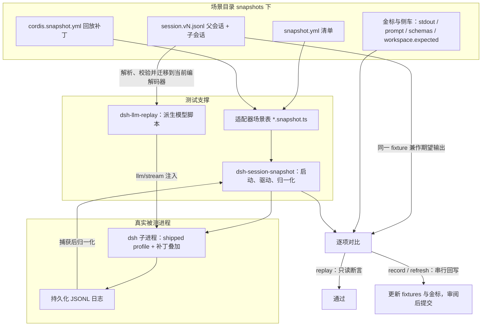

DeepSeek Harness 的**快照层**是一套"无钥匙"（keyless）的录制会话测试体系：每个场景提交一份真实的会话 JSONL，它既是回放时喂给模型的"输入脚本"，又是运行结束后持久化日志的"期望输出"。本文面向中级开发者，讲解 `snapshots/` 下 session（headless）、sdk、acp、web 四类快照的目录组织、清单语义、三种执行模式与回放判定机制。

Sources: [docs/testing.md](docs/testing.md#L18-L22), [snapshots/AGENTS.md](snapshots/AGENTS.md#L1-L3)

## 快照层在测试体系中的位置

快照层与单元测试、覆盖率门禁、真实 API e2e 并列为独立测试层：`pnpm run test:snapshot` 回放已提交的录制，全程不需要 API key；而"每一个非平凡的模型、协议或用户可见变更，必须在同一个 PR 中新增或更新一个无钥匙录制会话场景"是本仓库的硬性政策——包级测试、e2e 或 mock 证据都不能替代组装后的完整转写。Web 浏览器快照另有独立命令 `pnpm run test:web`，在 Chromium 中比对 `snapshots/web/` 的会话驱动输出与 `apps/web/tests/expected/` 的纯 UI 输出。

Sources: [docs/testing.md](docs/testing.md#L18-L19), [docs/testing.md](docs/testing.md#L53-L55)

快照层的核心约束写在 `snapshots/AGENTS.md` 中：这棵树只收"已提交会话 JSONL 兼作回放输入与期望持久化输出"的测试；所有被测进程都必须通过随发行版发布的 `dsh` CLI 与 shipped profile 启动，测试客户端只驱动公开协议或浏览器接口——禁止再发明应用入口、隐藏 CLI 模式或场景驱动器。

Sources: [snapshots/AGENTS.md](snapshots/AGENTS.md#L1-L6)

## 语料库布局：场景目录、命名语法与 snapshot.yml

语料库按 profile 分为四个顶层目录（`session`、`sdk`、`acp`、`web`，其中 `session` 目录对应 headless profile），每个场景是一个子目录，内含封闭的 `snapshot.yml` 清单、会话 fixture、组合补丁与各类金标。以 `snapshots/session/text-turn` 为例：`session.v1.jsonl`（选中的父会话）、`snapshot.yml`（清单）、`cordis.snapshot.yml`（回放组合补丁）、`system-prompt.expected.md` 与 `tool-schemas.expected.json`（请求头侧车）、`writer.expected.jsonl`（保留历史代时的原生写入器预期）。

Sources: [scripts/session-snapshot-corpus.corpus.ts](scripts/session-snapshot-corpus.corpus.ts#L11-L20), [snapshots/session/text-turn/snapshot.yml](snapshots/session/text-turn/snapshot.yml#L1-L11)

**命名语法**是封闭文法：父会话文件名为 `session[.vN].jsonl`，子会话为 `session.<ordinal>[.vN].jsonl`；v0 世代省略 `.v0` 后缀，正数世代使用小写 `.vN`，且文件名必须与首行 header 的版本一致。回放、录制与刷新都只选择每个角色**数值最高**的世代——旧世代留在目录里但不参与选择，这正是"同目录存放多代 fixture"（如 `session.v2.jsonl` 与 `session.v3.jsonl` 并存）的含义。

Sources: [packages/test-support/session-snapshot/src/session-files.ts](packages/test-support/session-snapshot/src/session-files.ts#L26-L47), [packages/test-support/session-snapshot/src/session-files.ts](packages/test-support/session-snapshot/src/session-files.ts#L82-L90)

`snapshot.yml` 是封闭 schema（未知字段直接报错），声明场景的所有权元数据：

| 字段 | 含义 |
|---|---|
| `profile` | `headless` / `sdk` / `acp` / `web`，必须与所在目录一致 |
| `composition` | 组合 id；每个组合有且仅有一个 header pin 场景 |
| `recording` | `live`（可用真实 API 重录）/ `authored`（手工构造，record 永不重写） |
| `header` | 请求头类别 `class`、是否 `pin`、侧车来源 `systemPromptSource` / `toolSchemasSource`、合法变更数等 |
| `replay.override` | 是否存在 `replay.override.json` 旁车（守卫要求文件与声明严格成对） |
| `platform` / `permission` | 宿主约束（`posix` / `pwsh`）与进程权限预设 |
| `workspace.final` | 场景会改写工作区 → 必须提交完整的 `workspace.expected/` |
| `input` | 仅 ACP 允许的控制器输入 `input.json` |
| `session` | 只读借用方：引用其他场景的选中父代，自身不得拥有 fixture |
| `sessionFormat` | 永久保留的历史格式代 `version` 与迁移覆盖名 `coverage` |

Sources: [packages/test-support/session-snapshot/src/manifest.ts](packages/test-support/session-snapshot/src/manifest.ts#L95-L125), [packages/test-support/session-snapshot/src/manifest.ts](packages/test-support/session-snapshot/src/manifest.ts#L146-L157)

三种典型形态可以直接对照文件验证：`text-turn` 声明了 `sessionFormat.version: 1` 与 `coverage: [adjacent-migration]`（永久保留的 v1 迁移 fixture）；`fs-write` 声明 `workspace.final: true` 并提交 `workspace.expected/notes.txt` 作为独立最终状态裁判；`fresh-round-trip`（web）的 header pin 标记为 `pin: true`。

Sources: [snapshots/session/text-turn/snapshot.yml](snapshots/session/text-turn/snapshot.yml#L6-L10), [snapshots/session/fs-write/snapshot.yml](snapshots/session/fs-write/snapshot.yml#L8-L10), [snapshots/web/fresh-round-trip/snapshot.yml](snapshots/web/fresh-round-trip/snapshot.yml#L1-L8)

## 三种执行模式：replay、record、refresh

| 模式 | 触发方式 | 模型来源 | 写盘行为 | 并发 |
|---|---|---|---|---|
| **replay**（默认） | 不设或 `DSH_SNAPSHOT=replay` | `dsh-llm-replay` 回放已提交 fixture | 不写任何已提交文件 | 文件级并行 + 场景内并发（上限默认 5） |
| **record** | `DSH_SNAPSHOT=record` | 真实 API（读环境变量或根目录 `.env`） | 以当前写入器格式重录 fixtures 并更新金标 | 串行 |
| **refresh** | `DSH_SNAPSHOT=refresh` | `dsh-llm-replay` 回放 | 重写派生金标；仅"跟踪当前写入器"的场景才回写 session fixtures | 串行 |

Sources: [vitest.snapshot.config.ts](vitest.snapshot.config.ts#L33-L42), [vitest.snapshot.config.ts](vitest.snapshot.config.ts#L56-L69)

并发设计的理由写在配置注释里：replay 不写已提交输出，且每个场景拥有独立的临时 cwd 与持久化根，因此可以在"文件级 worker 预算 × 文件内并发预算"下并行（`DSH_SNAPSHOT_MAX_CONCURRENCY` / `DSH_SNAPSHOT_MAX_WORKERS` 可覆盖）；而 record 每个场景都消耗真实 API 配额、refresh 的回写要从磁盘上已有的 fixture 收割易变值，并发写会互相污染，故保持串行。快照文件的单测超时为 120 秒。

Sources: [vitest.snapshot.config.ts](vitest.snapshot.config.ts#L19-L25), [vitest.snapshot.config.ts](vitest.snapshot.config.ts#L56-L73)

是否回写 session fixture 由纯函数 `writesCurrentSessionFixtures` 判定：只有"具备写能力的模式（record/refresh）+ 场景自拥有 fixture（非借用方）+ 未声明保留的历史 `sessionFormat`"三者同时成立才写。这保证了保留历史代与借用场景的 fixture 永不被 record/refresh 重写——record 甚至不会重命名或删除已完成的世代，源码树中的淘汰靠人工审阅完成。

Sources: [packages/test-support/session-snapshot/src/manifest.ts](packages/test-support/session-snapshot/src/manifest.ts#L127-L144), [packages/test-support/session-snapshot/README.md](packages/test-support/session-snapshot/README.md#L61-L67)

## 回放管线：llm-replay 如何"复刻"模型

理解回放的关键前提是：**fixture 不是模型输出的随意摘录，而是一次真实运行的持久化投影**。`dsh-llm-replay` 插件把选中的会话世代经真实格式目录（`sessionFormatCatalog`）解析、校验并迁移到当前编解码器，然后从嵌入的 assistant 流中派生出逐次模型调用的脚本。回放时按"首次调用顺序"把新会话绑定到脚本——父会话优先认领主脚本，子会话依次认领子脚本；配了 `providers` 时注册为可被模型发现的路由适配器，否则安装兜底的 `llm/stream` 瀑布监听。

Sources: [packages/test-support/llm-replay/README.md](packages/test-support/llm-replay/README.md#L22-L41), [packages/test-support/llm-replay/src/index.ts](packages/test-support/llm-replay/src/index.ts#L1-L8), [packages/test-support/llm-replay/src/index.ts](packages/test-support/llm-replay/src/index.ts#L42-L47)

脚本绑定靠三个环境变量传递（快照 harness 在启动子进程时设置，插件的配置项默认读取同名变量）：`DSH_SNAPSHOT_FILE` 指向选中的主 fixture，`DSH_SNAPSHOT_CHILD_FILES` 是 PATH 分隔的子会话日志列表，`DSH_SNAPSHOT_OVERRIDE` 指向可选的 `replay.override.json`。

Sources: [snapshots/session/headless.snapshot.ts](snapshots/session/headless.snapshot.ts#L1136-L1159), [packages/test-support/llm-replay/README.md](packages/test-support/llm-replay/README.md#L22-L41)

每个脚本条目是三种 `ReplayEntry` 之一：普通 `chunks`（从录制的 assistant 流派生）、`throw`（可在吐出前缀块后抛错）与 `hang`（建模取消/挂起）。后两种无法从"成功的持久化日志"重建，必须提供 `replay.override.json` 旁车显式声明——清单的 `replay.override: true` 与文件存在性由语料库守卫强制成对，防止游离的旁车静默篡改派生脚本。

Sources: [packages/test-support/llm-replay/src/index.ts](packages/test-support/llm-replay/src/index.ts#L58-L71), [packages/test-support/llm-replay/README.md](packages/test-support/llm-replay/README.md#L47-L55)

回放还有一个" Consumption 裁判"：直接安装 replay 的测试应在拆除时调用 `assertConsumed()`，把"场景实际驱动的模型调用次数少于录制"从静默偏差变成清晰的诊断。它的已知边界同样明确：首调顺序绑定假设子代理按顺序委派（并发的兄弟子代理会绑定不定）；只有普通循环块与显式标记的本地压缩输出可派生。

Sources: [packages/test-support/llm-replay/README.md](packages/test-support/llm-replay/README.md#L76-L80), [packages/test-support/llm-replay/README.md](packages/test-support/llm-replay/README.md#L142-L149)

## 确定性机制：身份令牌、归一化与 header pin

提交的会话是**归一化的不动点**。易变身份被替换为保序的"类型化首次出现令牌"：`{{session:1}}`、`{{message:1}}`、`{{approval:1}}` 等八类（session/message/approval/workflow/command/rpc/retry/id），跨父与子日志统一计数，因此相等关系在脱敏后依然可验证；生成的 cwd 统一记为 `{{cwd}}`。看一条真实的 fixture 首行即可确认：header 的 `id` 是 `{{session:1}}`，`cwd` 是 `{{cwd}}`。

Sources: [snapshots/AGENTS.md](snapshots/AGENTS.md#L8-L8), [packages/test-support/session-snapshot/src/identity.ts](packages/test-support/session-snapshot/src/identity.ts#L5-L8), [packages/test-support/session-snapshot/src/identity.ts](packages/test-support/session-snapshot/src/identity.ts#L46-L65), [snapshots/session/text-turn/session.v1.jsonl](snapshots/session/text-turn/session.v1.jsonl#L1-L9)

第二层归一化处理"体积与易变的大对象"：提交 fixture 保留完整 header 与事件载荷，但**省略 `seq`/`time` 信封**（回放时按行序重新合成）；`request/header` 中的系统提示词替换为 `{{system}}`、工具 schema 替换为 `{{tools}}`，完整内容提交为独立的可读侧车——`system-prompt.expected.md`（Markdown，后续 `system/message` 变更以 HTML 注释分隔）与 `tool-schemas.expected.json`（结构化 `initial`/`changes`）。守卫要求系统提示词必须在首个 `request/header` 之前出现，且未脱敏的提示词文本或 schema 出现在 fixture 内即失败。

Sources: [docs/testing.md](docs/testing.md#L22-L22), [snapshots/session/text-turn/session.v1.jsonl](snapshots/session/text-turn/session.v1.jsonl#L12-L12), [packages/test-support/session-snapshot/src/suite.ts](packages/test-support/session-snapshot/src/suite.ts#L54-L82), [packages/test-support/session-snapshot/README.md](packages/test-support/session-snapshot/README.md#L97-L105)

第三层是 **header pin**：每个"组合 × header 类别"有且仅有一个 `pin: true` 场景，拥有该类别的令牌化请求头序列；同类其他场景逐一与 pin 重建结果比对相等。这把"会话依赖的组合差异"逼成显式的新类别，而不是逃脱覆盖。当两个类别的完整提示词/序列完全一致时，可通过 `systemPromptSource` / `toolSchemasSource` 跨类别共享侧车（允许 adapter 本地符号链接，语料库守卫会解析链接并核对声明的目标），确保每个不同版本只提交一次。

Sources: [packages/test-support/session-snapshot/src/suite.ts](packages/test-support/session-snapshot/src/suite.ts#L24-L45), [scripts/session-snapshot-corpus.corpus.ts](scripts/session-snapshot-corpus.corpus.ts#L86-L94), [snapshots/AGENTS.md](snapshots/AGENTS.md#L12-L14)

对于声明了保留历史代的场景，回放输入保持旧世代不变，而**当前原生写入器**对该输入的精确输出单独记录在 `writer.expected.jsonl`（子角色为 `writer.<ordinal>.expected.jsonl`）——它只做写入器对齐裁判，绝不参与回放的世代选择。headless 驱动在 replay 模式下还会校验"原生写入器产出与迁移输出逐行一致（仅 message id 易变）"，防止写入器与迁移器漂移。

Sources: [packages/test-support/session-snapshot/README.md](packages/test-support/session-snapshot/README.md#L40-L44), [packages/test-support/session-snapshot/src/session-files.ts](packages/test-support/session-snapshot/src/session-files.ts#L49-L58), [snapshots/session/headless.snapshot.ts](snapshots/session/headless.snapshot.ts#L88-L100)

## 四个适配器：headless、sdk、acp、web

四个 profile 共享同一套核心（清单、世代选择、身份映射、归一化、工作区对比），各自叠加启动器、场景驱动与对比层的差异。`.snapshot.ts` 后缀被保留给录制的适配器——仓库内全量扫描只允许下面七个文件（语料库守卫测试强制这一点）。

| profile | 驱动文件 | 被测入口 | 控制方式 | 主要断言对象 |
|---|---|---|---|---|
| headless（`snapshots/session/`） | `headless.snapshot.ts` | `dsh --profile headless` 子进程 | 从 fixture 推导的命令行 task | stdout / stderr / 归一化日志 / header pin / 工作区 |
| sdk（`snapshots/sdk/`） | `sdk.snapshot.ts` | `dsh --profile sdk` 经 `dsh-sdk-client` | stdio JSON-RPC 驱动一轮 | `RunResult`、完整通知流、持久化日志 |
| acp（`snapshots/acp/`） | `acp.snapshot.ts` | `dsh --profile acp` | `input.json` 步骤脚本 + ACP JSON-RPC | `stdout.expected.jsonl` 协议转写、日志 |
| web（`snapshots/web/`） | `apps/web/tests/*.snapshot.ts`（4 个） | 进程内真实 web 组合 + Chromium | 浏览器交互 | `ui.expected.md` ARIA 金标、请求头 |

Sources: [scripts/session-snapshot-corpus.corpus.ts](scripts/session-snapshot-corpus.corpus.ts#L12-L20), [scripts/session-snapshot-corpus.corpus.ts](scripts/session-snapshot-corpus.corpus.ts#L81-L84)

**headless 适配器**是体量最大的驱动：每个场景从主 fixture 推导任务文本（或退回清单 `input.task`），把三层补丁叠加为 profile patch——默认组合的 `cordis.yml`、所属组合的 `cordis.snapshot.yml`（回放）/ `cordis.yml`（录制）、以及 `model.cordis.yml`——再通过共享的 Loader 冒烟工具启动 `apps/cli/src/bin.ts`。回放补丁关闭真实的 deepseek 适配器与遥测，注入带 replay-only 模型目录的 `llm-replay`，并把 JSONL 后端固定为 `compression: none`（压缩 JSONL 没有快照收割路径）。运行后逐一断言：stdout 等于 fixture 的最终文本、stderr 等于 fixture 派生的预期、持久化日志数量与角色数一致、归一化后的每个会话与期望快照逐记录相等、header pin 校验通过、工作区与初始快照一致（或与 `workspace.expected/` 一致）。

Sources: [snapshots/session/headless.snapshot.ts](snapshots/session/headless.snapshot.ts#L36-L44), [snapshots/session/headless.snapshot.ts](snapshots/session/headless.snapshot.ts#L1068-L1109), [snapshots/session/headless.snapshot.ts](snapshots/session/headless.snapshot.ts#L1120-L1177), [snapshots/session/text-turn/cordis.snapshot.yml](snapshots/session/text-turn/cordis.snapshot.yml#L1-L46), [snapshots/session/headless.snapshot.ts](snapshots/session/headless.snapshot.ts#L1219-L1279)

**sdk 适配器**验证的是"外部 SDK 消费者看到的世界"：真实启动 `dsh --profile sdk` 运行时，经 `DeepSeekHarness` 客户端在 stdio JSON-RPC 上驱动一轮，钉住 `RunResult` 与完整通知流，再对持久化日志做同样的归一化对比。声明式的 `SDK_ASSERTIONS` 表按场景追加断言，例如 `ptc-turn` 要求最终响应为 `CODE_ONE+CODE_TWO` 且工具 `run_code` 的参数键为 `code`/`description`，`persistent-tools` 钉住最小系统提示词与工具描述、并断言运行时上下文的包含/排除项。

Sources: [snapshots/sdk/sdk.snapshot.ts](snapshots/sdk/sdk.snapshot.ts#L1-L10), [snapshots/sdk/sdk.snapshot.ts](snapshots/sdk/sdk.snapshot.ts#L78-L89), [snapshots/sdk/sdk.snapshot.ts](snapshots/sdk/sdk.snapshot.ts#L127-L168)

**acp 适配器**覆盖协议行为（取消、权限往返等刺激来自 ACP 客户端的场景）：共享 harness 经 cordis Loader 启动真实子进程，以确定性 `input.json` 步骤脚本（`newSession` 捕获服务端随机 id、`promptAndCancel`、`waitForSubagentTurnEnd` 等）驱动 ACP JSON-RPC stdio，同时 tee 原始 stdout 作为纯度与预期输出检查；权限请求按 KIND 的 FIFO 队列应答——选项 id 是代理随机生成、脚本无法预知，而 KIND 是 ACP 稳定词汇。

Sources: [snapshots/acp/acp.snapshot.ts](snapshots/acp/acp.snapshot.ts#L26-L92), [packages/test-support/session-snapshot/src/harness.ts](packages/test-support/session-snapshot/src/harness.ts#L4-L17), [packages/test-support/session-snapshot/src/harness.ts](packages/test-support/session-snapshot/src/harness.ts#L79-L118)

## Web 快照的组装回路

`snapshots/web/` 的每个场景由 `apps/web/tests/` 下的同名 `*.snapshot.ts` 驱动（`code-language`、`message-feedback-protocol`、`minimal-preset`、`preset-migration` 四个）。以 `minimal-preset` 为例：`launchWebScaffold` 以快照方式启动**真实的 web 组合**——在空 profile 根上叠加 dsh-base 与 dsh-web-app 的 bundle 补丁，临时持久化根、Web 端口固定为 0、禁用 agent-instructions 与标题 LLM，回放模式下在运行后的根 ctx 上直装 `installLlmReplay`——然后用 `replayFixture` 指向的 `session.v3.jsonl` 驱动一轮真实交互。

Sources: [apps/web/tests/minimal-preset.snapshot.ts](apps/web/tests/minimal-preset.snapshot.ts#L24-L58), [apps/web/tests/scaffold.ts](apps/web/tests/scaffold.ts#L4-L13)

浏览器侧的判定链是：Playwright 打开真实页面 → `captureStableAria` 捕获稳定 ARIA 快照 → `compareOrRefreshGolden` 与 `ui.expected.md` 金标比对（refresh 模式下重写）；最后 `assertFixtureInventory` 断言场景目录的文件清单**封闭**——多一个少一个文件都算失败，防止游离文件静默进入或退出证据链。改写工作区的 Web 场景则走 `assertFinalWorkspaceSnapshot`，要求清单声明 `workspace.final` 并与 `workspace.expected/` 完整对比。

Sources: [apps/web/tests/minimal-preset.snapshot.ts](apps/web/tests/minimal-preset.snapshot.ts#L136-L146), [apps/web/tests/minimal-preset.snapshot.ts](apps/web/tests/minimal-preset.snapshot.ts#L174-L188), [apps/web/tests/scaffold.ts](apps/web/tests/scaffold.ts#L75-L104)

执行拓扑上，Web 快照属于 `vitest.web.config.ts` 的浏览器 lane（包含 e2e 与 snapshot 文件、默认关闭文件级并行）；`test:web:ci` 由 `run-web-snapshots.ts` 编排——先串行运行两个会改写工作区的 HMR/动态 Cordis 生命周期文件，再以 `DSH_WEB_SNAPSHOT_WORKERS` 控制的有界 worker 池并行余下文件；CI 在该 lane 强制只读的 `DSH_SNAPSHOT=replay`。快照 lane（`vitest.snapshot.config.ts`）仅在 `DSH_EXAMPLE_MODE=lib` 时把组装 Web 快照纳入（执行生成的 client bundle，需先 `pnpm run build`；source 模式保持零构建路径）。

Sources: [vitest.web.config.ts](vitest.web.config.ts#L15-L30), [scripts/run-web-snapshots.ts](scripts/run-web-snapshots.ts#L5-L21), [docs/testing.md](docs/testing.md#L19-L19), [vitest.snapshot.config.ts](vitest.snapshot.config.ts#L26-L32)

## 语料库守护与格式演进

三个语料库级守卫测试把"组织规则"变成可执行约束。第一，`.snapshot.ts` 后缀保留：全仓扫描到的快照命名文件必须恰好等于七个封闭适配器。第二，所有权与卫生：每个场景必须被拥有（或显式借用且不拥有 fixture）、每个组合/类别恰有一个 pin、借用不得链式穿透、`replay.override.json` 与 `workspace.expected/` 的存在性和清单严格互为充要、`input.json`/`stdout.expected.jsonl` 为 ACP 专属、身份脱敏是逐字节不动点、提示词与 schema 必须出没在侧车。第三，格式演进预算：会话语料库要求"基线 v3 + 当前代占多数"，且对每个历史世代有封顶的显式保留（最多 11 个角色），v0 必须覆盖 `multi-hop`/`packed-row`/`retry-failure`/`shipped-profile`，相邻世代必须覆盖 `adjacent-migration`，`retired-tools` 是唯一允许停留在当前版本号的保留理由。

Sources: [scripts/session-snapshot-corpus.corpus.ts](scripts/session-snapshot-corpus.corpus.ts#L81-L84), [scripts/session-snapshot-corpus.corpus.ts](scripts/session-snapshot-corpus.corpus.ts#L86-L131), [scripts/session-snapshot-corpus-policy.ts](scripts/session-snapshot-corpus-policy.ts#L17-L25), [scripts/session-snapshot-corpus-policy.ts](scripts/session-snapshot-corpus-policy.ts#L66-L112)

历史世代的 fixture 并非死数据：`llm-replay` 自带的语料库测试会把 `snapshots/`、`packages/` 与 `scripts/snapshots/python-sdk-single-exe/` 下每个带版本的 `session*.jsonl` 经真实格式目录完整还原（不改源字节），并精确断言"越代迁移"被拒绝。物理编码 fixture（WebWorker 运行时与 Python 单文件可执行）由 `session-fixture-layout.ts` 单独校验持久化层物理编码，而快照语料库校验的是逻辑事件投影。

Sources: [packages/test-support/llm-replay/README.md](packages/test-support/llm-replay/README.md#L95-L104), [scripts/session-fixture-layout.ts](scripts/session-fixture-layout.ts#L28-L36), [scripts/session-fixture-layout.ts](scripts/session-fixture-layout.ts#L154-L172)

## 实操命令与 CI 门禁

| 命令 | 作用 |
|---|---|
| `pnpm run test:snapshot` | 无钥回放全部快照（默认 replay，不写盘） |
| `pnpm run test:snapshot:record` | 真实 API 重录（`DSH_SNAPSHOT=record --update`），读 `.env` 或环境 key |
| `pnpm run test:snapshot:refresh` | 回放并重写派生金标 |
| `pnpm run test:web` / `test:web:refresh` / `test:web:ci` | 构建后运行 Web 浏览器快照 lane / 重写金标 / CI 编排入口 |
| `DSH_SNAPSHOT_MAX_CONCURRENCY` / `DSH_SNAPSHOT_MAX_WORKERS` | 覆盖 replay 的文件内并发与文件级 worker 数 |
| `DSH_WEB_SNAPSHOT_WORKERS` | `test:web:ci` 并行池大小 |

Sources: [package.json](package.json#L64-L72), [vitest.snapshot.config.ts](vitest.snapshot.config.ts#L9-L25), [scripts/run-web-snapshots.ts](scripts/run-web-snapshots.ts#L5-L8)

新增场景的实操路径：在对应 profile 目录建场景文件夹 → 写 `snapshot.yml`（确定组合与 header 类别）→ 录制（`test:snapshot:record`）或手工构造（`recording: authored`）→ 审阅全部 JSONL、侧车与工作区差异后提交。PR CI 中，快照门禁在"node 24 / snapshots and artifacts"作业内随 `check:ci:consumers` 聚合运行；任何回写都必须经人工审阅——replay 是唯一无副作用的日常入口。

Sources: [docs/testing.md](docs/testing.md#L53-L55), [vitest.snapshot.config.ts](vitest.snapshot.config.ts#L33-L42), [.github/workflows/ci.yml](.github/workflows/ci.yml#L363-L364)

## 延伸阅读

- 回看测试分层与"何时必须加快照"的政策全貌：[测试策略：单元测试、100% 覆盖率门禁与真实 API e2e](26-ce-shi-ce-lue-dan-yuan-ce-shi-100-fu-gai-lu-men-jin-yu-zhen-shi-api-e2e)
- 理解 fixture 的来源与格式版本语义：[会话模型与持久化：SessionEvent 日志、JSONL 提供方与格式版本演进](15-hui-hua-mo-xing-yu-chi-jiu-hua-sessionevent-ri-zhi-jsonl-ti-gong-fang-yu-ge-shi-ban-ben-yan-jin)
- 被 headless/ACP 快照驱动的入口形态：[CLI 与 Headless/ACP：profile 启动、命令行参数与 Agent Client Protocol](22-cli-yu-headless-acp-profile-qi-dong-ming-ling-xing-can-shu-yu-agent-client-protocol)
- Web 快照背后的客户端架构：[Web 应用与浏览器客户端：连接传输、UI 插件模块与产品隔离](20-web-ying-yong-yu-liu-lan-qi-ke-hu-duan-lian-jie-chuan-shu-ui-cha-jian-mo-kuai-yu-chan-pin-ge-chi)
- 下一站——同层的性能视角：[性能基准测试：benchmarks 布局、worker 计时与回归预算](28-xing-neng-ji-zhun-ce-shi-benchmarks-bu-ju-worker-ji-shi-yu-hui-gui-yu-suan)