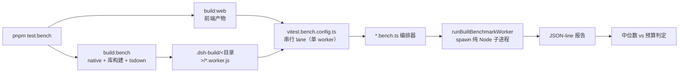
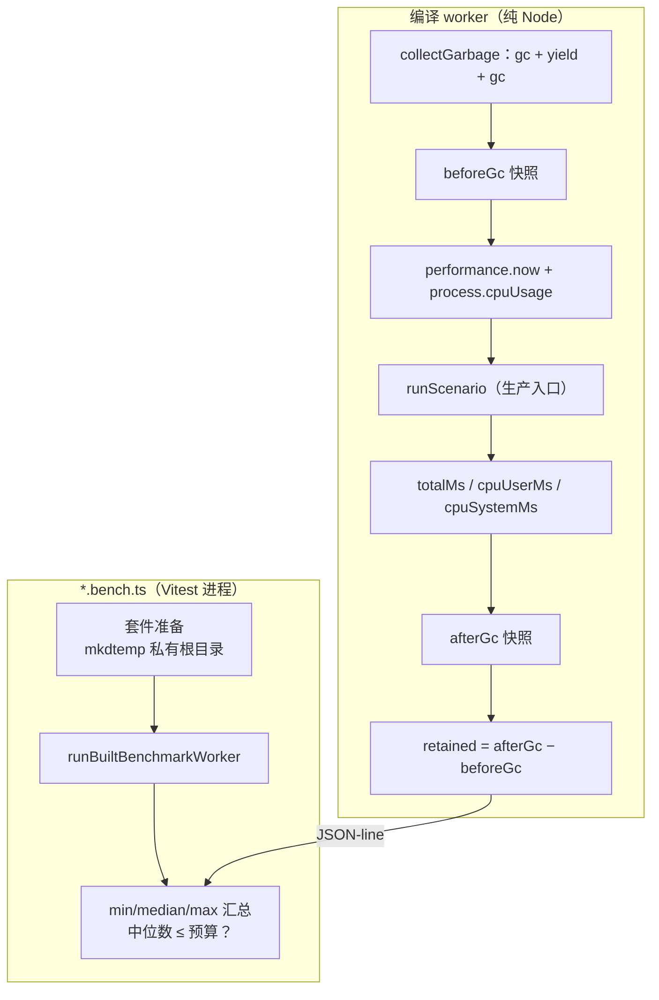

本文剖析 `benchmarks/` 目录这一**仓库级必需性能门禁**的完整机制：它如何按“用户路径”组织基准目录、如何通过预编译 worker 在纯 Node 子进程中完成计时、以及参考机期望如何换算成 CI 上强制执行的回归预算。阅读本文前建议先了解 [测试策略](26-ce-shi-ce-lue-dan-yuan-ce-shi-100-fu-gai-lu-men-jin-yu-zhen-shi-api-e2e) 中的门禁组织方式。

## 定位：仓库级必需性能门禁

`benchmarks/` 树拥有的是**必需的、横跨包所有权**的性能门禁——被测量的用户路径（如“打开一个大会话”）穿越多个包的边界，因此不能归属任何单一包。与之相对，包内部的性能诊断使用 `.perf.ts` 后缀留在各自包旁，不进入 `test:bench` 清单；`vitest.web.perf.config.ts` 明确注释这类“手动高基数诊断”不属于任何默认 Vitest 清单，因而在 CI 执行的测试 lane 之外。

这一划分由若干硬性规约支撑：基准按被测用户路径组织（一个路径一个目录），**不镜像包树**；一律使用经评审的常量合成固定输入，禁止使用录制会话、用户素材、环境仓库或网络服务；必须走生产入口点，不允许为测量复制产品算法或添加仅供测量的生产导出。环境变量不得覆盖性能预算，保证门禁判定不被运行环境篡改。

Sources: [benchmarks/AGENTS.md](benchmarks/AGENTS.md#L1-L17), [vitest.web.perf.config.ts](vitest.web.perf.config.ts#L2-L16)

## 目录布局：一个用户路径一个目录

六个基准目录各自对应一条独立的用户路径，加上一个跨目录共享的 `support/`。命名约定区分测量面：Host 侧用例为 `*.bench.ts`，Client 侧（浏览器产物消费方）为 `*.bench.client.ts`；worker、fixture 与支撑模块**不携带** bench 后缀。`support/` 有严格的晋升条件——只有至少两个基准目录需要同一行为时，helper 才能从目录私有位置迁入。

| 目录 | 被测用户路径 | 测量面 | 计时载体 |
|---|---|---|---|
| `session-open` | 冷打开 released-v0 会话、升级后重开、首屏历史、Agent 恢复 | Host | `session-open.worker.ts` |
| `agent-continuation` | 长历史请求、工具密集续聊、fork 子会话目录发现、SDK profile 续聊 | Host | 3 个 worker + `profile-adapter.ts` |
| `conversation-fold` | 冷 Client 的会话折叠（50 万 delta → 紧凑记录） | Client face | `conversation-fold.worker.client.ts` |
| `active-stream-reconnect` | 活跃 Assistant 流重连时折叠 10 万 delta 未完成前缀 | Client face | `reconnect.worker.client.ts` |
| `long-session-browser` | 浏览器打开 240 轮会话、加载早期分页、Trajectory、流式期间打字 | Browser | 无 worker，Playwright + CDP |
| `terminal-io` | 终端输出有界化：容量增长 32 倍时不得全窗口重扫 | Host | `terminal-io.worker.ts` |
| `support/` | 跨目录共享：worker 启动器与校准换算 | — | — |

每个目录附带双语 README（部分目录）并按规约在 `.agents/notes/implemented/testing/` 中维护一份**所属 Agent Note**，记录工作负载、计时边界、内存端点、校准参照、被否决的替代方案与已知排除项。

Sources: [benchmarks/AGENTS.md](benchmarks/AGENTS.md#L3-L14), [benchmarks/package.json](benchmarks/package.json#L11-L42), [benchmarks/agent-continuation/README.zh.md](benchmarks/agent-continuation/README.zh.md#L1-L12)

## 执行编排：预构建产物与串行测量 lane

整个编排是一条“先构建、后串行测量”的流水线。`test:bench` 依次执行 `build:bench`（native addon + 工作区库 + worker 编译）、`build:web`（浏览器基准依赖的前端产物），最后由 `test:bench:built` 启动 Vitest。`build:bench` 中 worker 的编译由独立的 `benchmarks/tsdown.config.ts` 驱动，输出到 `benchmarks/.dsh-build/`。

`vitest.bench.config.ts` 的配置浓缩了测量隔离的全部考量：`include` 同时匹配 `*.bench.ts` 与 `*.bench.client.ts`；`fileParallelism: false` 与 `maxWorkers: 1` 保证**任何一次测量都不与其他基准共享 CPU**；单文件超时放宽到 600 秒、hook 超时 120 秒，以容纳多进程多样本的采样循环。

CI 侧由 `check:ci:bench` 脚本触发 run-gates 的 `ci-bench` 聚合——它只含一个名为 bench 的叶子门禁，执行 `test:bench`。对应 `.github/workflows/ci.yml` 中的 `node-24-bench` job：仅在 pull request 上运行，固定使用标准托管 `ubuntu-24.04` runner（不受 Linux 故障转移开关影响），超时 15 分钟，且**独占一条 lane**——“壁钟预算需要一台空闲的 runner”。安装步骤无条件装载 Chromium 及其 Linux 依赖，供浏览器基准使用。每次更换 runner 类别都必须以一次真实托管运行验证 job 超时，本地工作流断言不足以证明。

Sources: [package.json](package.json#L22-L27), [package.json](package.json#L58-L59), [package.json](package.json#L84-L86), [vitest.bench.config.ts](vitest.bench.config.ts#L7-L27), [.github/workflows/ci.yml](.github/workflows/ci.yml#L193-L237), [scripts/run-gates.ts](scripts/run-gates.ts#L284-L285), [.agents/notes/implemented/testing/2026-09-06-standard-hosted-benchmark-runner.zh.md](.agents/notes/implemented/testing/2026-09-06-standard-hosted-benchmark-runner.zh.md#L7-L13)

## Worker 计时：编译产物、纯 Node 子进程与 JSON 报告

计时精度取决于把一切非测量因素从被测进程中剔除，这里有三层机制。

**第一层：预编译 worker 产物。** tsdown 配置把五个基准目录的 worker 编译成 `es2024` ESM 输出，关键约束是 `neverBundle: [/^@deepseek-ai\//]`——工作区包**保持 external**，使产品服务经其构建后的 `lib` 包出口解析，测的是生产产物而非源码；Host 侧 worker 用 `tsconfig.host.json`，Client 侧（conversation-fold、reconnect）用 `tsconfig.client.json`，分别对准双聚合 tsconfig 划分。

**第二层：受控子进程启动器。** `runBuiltBenchmarkWorker` 拒绝非编译后 JavaScript 的 worker 路径，剥离 `NODE_OPTIONS` 与 `TSX_TSCONFIG_PATH` 后用 `process.execPath` 直接 spawn：可选 `--expose-gc` 打开强制 GC，`--max-old-space-size` 约束老生代上限（用于压力样本），超时以 `SIGKILL` 收割僵死子进程。成功时从 stdout **最后一行以 `{` 开头的文本**解析出类型化 JSON 报告。

**第三层：运行时自证。** worker 侧调用 `assertBuiltBenchmarkRuntime` 做三重断言：模块 URL 必须位于 `benchmarks/.dsh-build/`、`process.execArgv` 中不得出现任何 tsx 加载器、关键包必须解析到 `lib/…​.js`。这防止有人绕过构建直接以源码运行 worker，导致计时掺入 TypeScript 转译开销。

以最复杂的 `session-open` 为例：worker 内 `collectGarbage` 在要求 `--expose-gc` 的前提下执行两次 GC 并在中间 `scheduler.yield()`，随后 `measure()` 包裹"GC 前快照 → `performance.now()` 与 `process.cpuUsage()` 起点 → 运行场景 → 双时钟终点 → GC 后快照"，一次性产出 `totalMs`、CPU 用户/系统时间、事件数、`beforeGc`/`afterGc` 全量内存快照及 `retained` 增量；`phase-migrate`/`phase-steady` 场景还细分 `openMs`/`readMs`/`sessionRestoreMs`/`projectionMs` 四段相位计时。编排进程对每个场景驱动 **5 个全新进程样本**，汇总为 min/median/max 加原始样本数组——按 AGENTS.md 要求，“报告足够多的原始与聚合测量以解释每个判定”。

Sources: [benchmarks/tsdown.config.ts](benchmarks/tsdown.config.ts#L3-L13), [benchmarks/tsdown.config.ts](benchmarks/tsdown.config.ts#L15-L59), [benchmarks/support/built-worker.ts](benchmarks/support/built-worker.ts#L28-L76), [benchmarks/support/built-worker.ts](benchmarks/support/built-worker.ts#L83-L97), [benchmarks/session-open/session-open.worker.ts](benchmarks/session-open/session-open.worker.ts#L110-L129), [benchmarks/session-open/session-open.worker.ts](benchmarks/session-open/session-open.worker.ts#L182-L202), [benchmarks/session-open/session-open.bench.ts](benchmarks/session-open/session-open.bench.ts#L36-L39)

## 回归预算：参考机期望 × CI 时间刻度 × 方差余量

预算换算收敛在 16 行的 `support/calibration.ts` 中：`CI_TIME_SCALE = 2` 是 x64 CI runner 相对 **arm64 参考机**的实测壁钟比值，`PERFORMANCE_BUDGET_HEADROOM = 1.25` 是允许的方差余量，`ciTimeBudget(expectedMs) = ceil(expectedMs × 2 × 1.25)` 给出最终整数 CI 预算。所有时间预算共用这一换算，而**内存与无量纲比率明确不适用时间刻度**（AGENTS.md 单独强调这条边界）。

预算值有两种合法来源，且每个基准文件都用注释写明出处。其一是**参考机期望**：`session-open` 的 `EXPECTED_MS` 记录参考机上各端点耗时（如 migrationOpen 220 ms、projection 14 ms），经 `ciTimeBudget` 换算；`terminal-io` 注明 "M5 Pro / Node 26.5 参考期望"，`agent-continuation` 注明 "M4 Pro / Node 24.19"。其二是**标准 2-CPU 托管 CI 的实测中位数取整**：注释记录原始样本区间（如 reopen 样本跨度 47.4–49.2 ms），取整为 50 ms 期望，只乘 1.25 余量得 63 ms。还有第三种特例——经评审的托管硬上限，如 `FIRST_OPEN_AGENT_RESUME_BUDGET_MS = 562`（`floor(450 × 1.25)`）与 `REQUEST_HISTORY_BUDGET_MS = 297`，校准记录保留原始参照。

| 端点示例 | 期望来源 | 推导 | 最终预算 |
|---|---|---|---:|
| 会话迁移打开 | 参考机 220 ms | `ceil(220×2×1.25)` | 550 ms |
| 升级后重开 | CI 实测中位 48.6 ms → 取整 50 | `ceil(50×1.25)` | 63 ms |
| 首开 Agent 恢复 | 评审托管上限 450 ms | `floor(450×1.25)` | 562 ms |
| 工具续聊 | CI 实测中位 898.252 ms → 取整 900 | `ceil(900×1.25)` | 1,125 ms |
| Agent 恢复保留堆 | 历史参照 26.1 MB | `ceil(26.1×1.25)`，**不乘时间刻度** | 33 MB |
| 终端稳态容量比率 | 无量纲 | 大/小容量 ingest 中位数之比 ≤ 4，**不适用时间刻度** | 比率 4 |
| 折叠 delta 缩放 | 无量纲 | 2.5× × 1.25 余量 | 3.125× |

判定统计量按端点语义选择：时间端点用 5 样本**中位数**；内存端点用样本**最大值**（如 `MAX_RETAINED_HEAP_BYTES = 16 MiB` 对所有样本成立）；缩放类用比值。同一文件内还内嵌**校准守护测试**：用录制的真实样本验证预算接受历史中位数（48.6 ≤ 63）、拒绝合成回归（75 > 63、4 000 > 550），并用 `expect(BUDGET).toBe(63)` 把预算数值本身钉死——任何人改动预算都必须显式更新这些正反例。前端预算的完整校准表（参考额度、历史 CI 限制、实测中位数）保存在所属 Agent Note 中，浏览器端点同样遵循“参考额度 × 缩放 + 余量”的同一模型。

Sources: [benchmarks/support/calibration.ts](benchmarks/support/calibration.ts#L1-L16), [benchmarks/session-open/session-open.bench.ts](benchmarks/session-open/session-open.bench.ts#L49-L76), [benchmarks/session-open/session-open.bench.ts](benchmarks/session-open/session-open.bench.ts#L285-L311), [benchmarks/agent-continuation/agent-continuation.bench.ts](benchmarks/agent-continuation/agent-continuation.bench.ts#L16-L29), [benchmarks/terminal-io/terminal-io.bench.ts](benchmarks/terminal-io/terminal-io.bench.ts#L8-L14), [benchmarks/conversation-fold/conversation-fold.bench.client.ts](benchmarks/conversation-fold/conversation-fold.bench.client.ts#L26-L40), [.agents/notes/implemented/testing/2026-09-06-frontend-performance-budgets.zh.md](.agents/notes/implemented/testing/2026-09-06-frontend-performance-budgets.zh.md#L31-L44)

## 浏览器与客户端侧测量的边界

浏览器基准 `long-session-browser` 与 Node worker 共享校准模型，但计时边界有自己的精确约定。它在**重放（keyless replay）模式**下经共享的 shipped-composition Web scaffold 驱动三个全新浏览器进程，测量打开 240 轮合成会话、逐页加载早期历史、首次进入 Trajectory、以及在 16 ms 间隔节奏流式回复期间键入下一条草稿。两处细节体现测量的诚实性：其一，“完成”以**两次 `requestAnimationFrame`** 定义——注释直言这只证明存在渲染机会，而非 GPU 呈现时间戳，因此其证据等级与发布 Host 证据分开报告；其二，流式期间的主线程占用不用壁钟而用 **CDP `Performance.getMetrics` 的 `TaskDuration`** 差值度量，并断言打字输入事件与流式回复**时间上重叠**（`inputOverlapped` 必须为 true），证明 UI 在流式压力下保持响应。CI 实测中位数（打开 875 ms 等）取代参考机换算成为打开/分页/Trajectory 的预算基准。

客户端 face 的另外两个基准均不触碰浏览器渲染：`active-stream-reconnect` 的 README 明言“这项针对 Node 的工作负载既不构建也不测量浏览器渲染”，三个全新编译 worker 在计时调用 `ClientAssistantStream.replace()` 前构造含 10 万 delta 的未完成 reasoning 前缀；该私有集成适配器被**打进 worker 产物**——这正是 AGENTS.md 允许的“当没有公开 Node 导出暴露被测路径时，编译 worker 可打包私有集成适配器”条款的应用。`conversation-fold` 则用 200 轮 × 2 000 文本 delta（共 50 万流式 delta 压缩为 1 600 条紧凑记录）的大窗口与 100 delta 的小窗口对照，用**缩放比率预算**把“随紧凑记录数成比例的折叠”与“随每条 delta 重放”两种实现策略在数学上区分开——同窗口逐 delta 重放需要数百毫秒，而折叠预算仅 16 ms 参考期望。

Sources: [benchmarks/long-session-browser/long-session.bench.ts](benchmarks/long-session-browser/long-session.bench.ts#L13-L26), [benchmarks/long-session-browser/long-session.bench.ts](benchmarks/long-session-browser/long-session.bench.ts#L36-L41), [benchmarks/long-session-browser/long-session.bench.ts](benchmarks/long-session-browser/long-session.bench.ts#L131-L140), [benchmarks/long-session-browser/README.zh.md](benchmarks/long-session-browser/README.zh.md#L9-L18), [benchmarks/active-stream-reconnect/README.zh.md](benchmarks/active-stream-reconnect/README.zh.md#L5-L8), [benchmarks/AGENTS.md](benchmarks/AGENTS.md#L5-L6), [benchmarks/conversation-fold/conversation-fold.bench.client.ts](benchmarks/conversation-fold/conversation-fold.bench.client.ts#L15-L24)

## 本地运行与新增基准的约定

本地复现门禁的完整路径是 `pnpm run test:bench`（构建库、worker 与 Web 产物后串行运行全部清单）；产物已就绪时可用 `pnpm exec vitest run --config vitest.bench.config.ts benchmarks/<目录>` 单选一个目录，首次运行前需通过 benchmark workspace 安装 Chromium（CI 中的对应命令是 `pnpm --filter @deepseek-ai/dsh-benchmarks exec playwright install --with-deps chromium`）。规约同时要求：不要让计时运行与构建或其他基准重叠——这是 `test:bench` 把构建与测量串在同一条命令里的原因。

新增基准时须遵守的清单可从现有实现归纳：为新的用户路径建立独立目录而非塞入现有目录；fixture 全部由经评审常量合成，放在 `*.constants.ts` 或专用合成模块中；worker 以编译产物运行并通过 `assertBuiltBenchmarkRuntime` 自证；每个端点声明注释完备的预算来源（参考机期望或 CI 实测中位数）；在 `.agents/notes/implemented/testing/` 记录工作负载、计时边界、内存端点、校准参照与排除项；helper 在第二个目录需要之前不进入 `support/`。压力样本（如 `session-open` 的 128 MB 老生代上限运行）与正常堆计时样本分开采样、只验证完成性不计入时间判定，这是“约束堆”与“预算”两条关注线的分离。

Sources: [benchmarks/agent-continuation/README.zh.md](benchmarks/agent-continuation/README.zh.md#L9-L13), [.github/workflows/ci.yml](.github/workflows/ci.yml#L231-L237), [benchmarks/session-open/session-open.bench.ts](benchmarks/session-open/session-open.bench.ts#L406-L416), [benchmarks/AGENTS.md](benchmarks/AGENTS.md#L10-L17)

## 延伸阅读

- 性能门禁在整体测试分层中的位置与 100% 覆盖率门禁的协作方式，见 [测试策略：单元测试、100% 覆盖率门禁与真实 API e2e](26-ce-shi-ce-lue-dan-yuan-ce-shi-100-fu-gai-lu-men-jin-yu-zhen-shi-api-e2e)。
- 浏览器基准复用的 scaffold、录制与重放机制，见 [快照测试与录制会话](27-kuai-zhao-ce-shi-yu-lu-zhi-hui-hua-session-sdk-acp-web-kuai-zhao-de-zu-zhi-yu-hui-fang)。
- 被测量的用户路径由哪些包与入口构成，见 [扩展手册](24-kuo-zhan-shou-ce-tian-jia-gong-ju-bao-llm-gua-pei-qi-remote-api-yu-she-zhi-qia-pian) 与 [总体架构](9-zong-ti-jia-gou-cha-jian-shu-he-xin-bao-zhi-ze-yu-ctx-fu-wu-jian-wei-tu)。