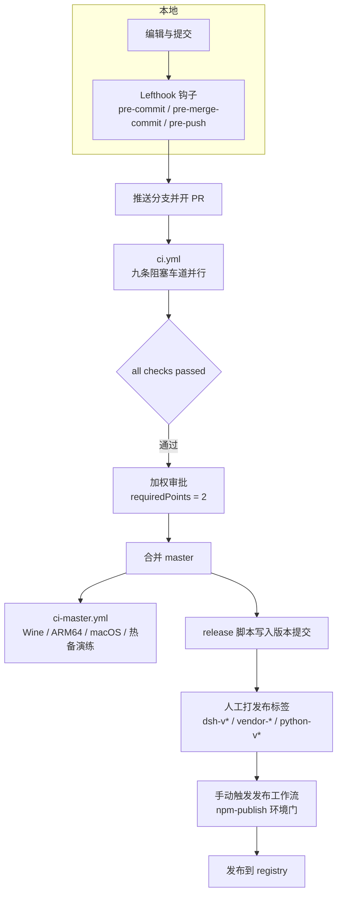
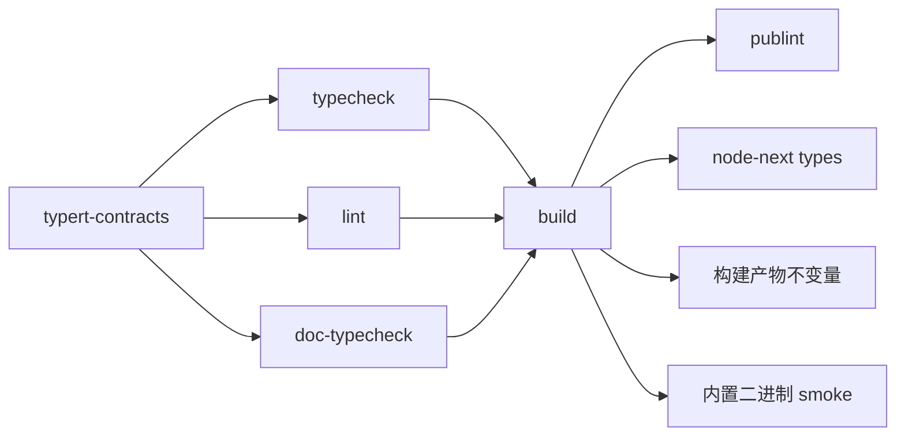
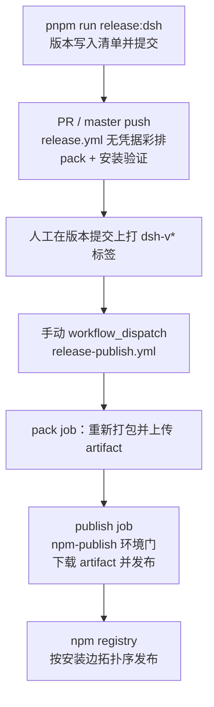

本页面向希望理解 DeepSeek Harness 工程协作机制的中间级开发者，梳理三条主线：**PR 规范**（模板、标签与提交历史约定）、**门禁组织**（本地 Lefthook 检查点、`run-gates` 聚合器与 GitHub Actions 车道划分）、以及**发版流程**（三个独立发布序列与双重人工发布门）。需要先说明一个重要事实：官方仓库当前不接受外部 PR，但仓库内部维护着一套完整的 PR 流水线与质量门禁——它既是团队的开发纪律，也是社区观察该项目工程标准的最直接窗口。

## 贡献政策：官方仓库之外的参与方式

`CONTRIBUTING.md` 开宗明义：项目仍处早期活跃开发阶段，**暂时无法接受外部 Pull Request**。但贡献代码远非唯一参与方式——文件列出了三条社区路径：在 GitHub Discussions 中反馈问题并为您关注的话题点赞（团队规模很小，但会监测讨论并据此分配资源）；围绕生态做贡献，例如创建插件并给项目打上 `dsh-plugin` 话题以便他人发现；以及撰写博客、教程和回答社区问题。仓库自我定位是"一个想法、一份官方展示与灵感来源"，而非对社区的强制约束——官方包并不天然比社区包更重要。

Sources: [CONTRIBUTING.md](CONTRIBUTING.md#L9-L19)

对社区贡献者而言，这份政策的实际含义是：插件、SDK 扩展与 Issue/讨论是您的贡献接口，而本页描述的 PR 流水线主要服务于核心团队。若您想从外部视角复现其中任何检查，本地命令全部公开可用（见下文"本地门禁"一节）。

Sources: [CONTRIBUTING.md](CONTRIBUTING.md#L1-L3)

## PR 规范：模板、标签与提交历史

每个 PR 从 `.github/pull_request_template.md` 开始，模板强制三段结构：**Motivation**（一句话说明问题，并以 `Fixes #NN` 或 `Related #NN` 引用同仓库 Issue）；**Changes**（分两层写——命令、配置、API、协议或持久化格式的高层变化，以及用户、模型或系统可观察行为的变化，没有则写 None）；**Testing**（每种测试方法一个条目，方法保持可见，可复核证据——测试输出、截图、录屏、日志——折叠进对应的 Proof 区域）。这个结构把"改了什么"与"如何证明"分成两个正交维度，审查者可以按需展开。

Sources: [.github/pull_request_template.md](.github/pull_request_template.md#L1-L22)

标签体系遵循统一分类法：**每个 PR 恰好一个 `kind/*` 标签**（变更种类），**所有相关变更各打一个 `area/*` 标签**（影响面），外加 GitHub 原生 Issue Type。提交历史同样有明文约定：独立变更拆分为独立 PR，引入问题的 PR 在扩散前先修复；独立分支或堆叠分支可以 merge-forward 或 rebase；重写历史必须用 `--force-with-lease`（检测到远端移动即中止），禁止裸 `--force`。行为语义变更时"带着它的测试一起改"，并在 PR 中说明原因。

Sources: [AGENTS.md](AGENTS.md#L159-L160), [AGENTS.md](AGENTS.md#L152-L153)

推送前的本地检查遵循"证据匹配变更面"原则：针对行为跑聚焦测试、模型/用户输出变更跑快照、文档变更跑 `doc-sync`、发布路径跑构建后 smoke、Provider 变更跑真实 API e2e。规则明确**禁止默认跑全量套件**——穷尽覆盖与平台矩阵由 CI 负责，只有显式要求、CI 诊断或不可拆分的仓库级变更才在本地全量演练。覆盖门禁是 `test:coverage` 而非 `test`（缘由见测试策略页）。堆叠 PR 在 `gh stack sync` 之后立即验证，检查未通过不得合并。

Sources: [AGENTS.md](AGENTS.md#L112-L119), [26-ce-shi-ce-lue-dan-yuan-ce-shi-100-fu-gai-lu-men-jin-yu-zhen-shi-api-e2e](26-ce-shi-ce-lue-dan-yuan-ce-shi-100-fu-gai-lu-men-jin-yu-zhen-shi-api-e2e)

## 本地门禁：Lefthook 的三个 Git 钩子阶段

本地检查点由 Lefthook 承担，设计哲学写在 `lefthook.yml` 首行注释里：**钩子只做快速局部检查，完整仓库级门禁矩阵归 CI 所有**。钩子通过 `node scripts/install-lefthook.mjs` 安装（`postinstall` 自动执行），工作区本地化配置的安全契约由专门的 Agent Note 约束。三个阶段各司其职：

| 阶段 | 检查项 | 触发条件与行为 |
|---|---|---|
| `pre-commit` | 翻译配对记录 | 暂存的 `*.i18n.yaml` 对照暂存的属主 blob 校验（归档笔记除外） |
| `pre-commit` | 归档 Agent Note 格式 | 暂存 `.agents/notes/archived/**` 时校验冻结语义 |
| `pre-commit` | 暂存文件 lint | 用免项目上下文的 `.oxlintrc.staged.json` 配置跑 Oxlint，自动修复并带一次有界重试 |
| `pre-commit` | 第三方声明再生 | 暂存文件命中生成器任一输入时**再生成** `THIRD_PARTY_NOTICES.md` 并加入暂存区，而非拒绝提交 |
| `pre-commit` | 空白检查 | `git diff --cached --check`，文件以恰好一个换行结尾 |
| `pre-commit` | vendor 清单守卫 | `vendor/*/src` 下的改动必须伴随 `vendor/README.md` 清单更新 |
| `pre-merge-commit` | 翻译配对 + 归档笔记 | Git 创建自动合并提交前执行同一套索引级检查 |
| `pre-push` | 类型检查 | `pnpm run typecheck`：先完成 Host lib 阶段（含生成的 Typert 契约），再做 Client TypeScript 检查 |

Sources: [lefthook.yml](lefthook.yml#L1-L56), [docs/development.md](docs/development.md#L112-L126)

值得注意的是"再生而非拒绝"的设计取舍：第三方声明的 glob 覆盖生成器读取的每一个输入（包括生成器自身与构建期 pin 来源），依赖编辑忘了更新声明时，与其让测试车道在很久之后才失败，不如提交瞬间自动补上。而删除清单文件的情形钩子无法捕获——lefthook 只检查磁盘上存在的文件——该场景仍由测试车道的新鲜度断言兜底。除暂存记录校验外，钩子**有意不运行测试、快照、文档检查、构建或 hygiene**；想本地跑全量门禁的开发者可以显式执行 `pnpm run check:all`，它与 Git 钩子相互独立。

Sources: [lefthook.yml](lefthook.yml#L20-L28), [docs/development.md](docs/development.md#L122-L126)

## 门禁组织：run-gates 聚合器与 PR 车道

### run-gates：脚本归脚本，图归运行器

所有质量门禁的执行核心是 `scripts/run-gates.ts`。它的头注释划出一条清晰的职责边界：**package.json 拥有公开的聚合名称**（如 `check:ci:static`），**运行器拥有经过校验的依赖图、调度器环境与进程诊断**。每个聚合是一组带 `needs`/`after` 依赖边的 `Gate` 节点，由有界并发调度器在进程内执行；`DSH_GATE_CONCURRENCY` 覆盖并发数，`DSH_GATE_FAIL_FAST` 让首个阻塞门禁失败后中止兄弟门禁（避免红色运行继续烧付费 runner 时间），`allowFailure` 标记让个别诊断保持可见而不拖垮聚合。

Sources: [scripts/run-gates.ts](scripts/run-gates.ts#L1-L7), [package.json](package.json#L79-L93), [scripts/run-gates.ts](scripts/run-gates.ts#L38-L53)

以 PR 上最重要的 `ci-primary` 聚合为例（本地等价命令 `check:ci`），可以看到构建消费链的典型形状：Typert 契约先生成，`typecheck`、`lint`、`doc-typecheck` 三者都依赖它；`build` 等待三个消费方全部完成——注释解释了原因：准备好的 typecheck 和 build 都会驱动 Client tsc，build 不能与它们竞争 tsbuildinfo 或在读取代声明时替换它们；构建之后 `publint`、NodeNext 类型校验、构建产物不变量检查与内置二进制 smoke 依次消费产物。

Sources: [scripts/run-gates.ts](scripts/run-gates.ts#L386-L401)

### ci.yml：九条阻塞车道与一个汇总判定

PR 触发的 [ci.yml](.github/workflows/ci.yml) 把独立门禁编入宽车道，每个 job 通过 `runs-on` 表达式解析 runner 池。工作流级 `concurrency` 组按 ref 取消被取代的运行——注释算过账：新的 push 若排队在陈旧运行之后，意味着第二次完整九任务运行叠在付费企业 runner 上且无自动取消。工作流还固定两个环境事实：主 Node 版本为 24，且 `DSH_TELEMETRY_DISABLED=1` 保证 CI 运行永不向烤进产品的遥测端点上报。

Sources: [.github/workflows/ci.yml](.github/workflows/ci.yml#L6-L27)

| 车道（job） | 执行的聚合 | 要点 |
|---|---|---|
| node 24 / static | `check:ci:static` | 静态门禁聚合；完整历史以供归档门禁读取可信 PR base |
| node 24 / coverage | `check:ci:coverage` | 安装与 bubblewrap 准备并行；90 秒测试超时预算 |
| node 24 / benchmarks | `check:ci:bench` | 独占 `ubuntu-24.04`——墙钟预算需要空闲 runner；15 分钟超时 |
| node 24 / snapshots and artifacts | `check:ci:consumers` | 车道内一次构建供快照与产物读者共享 |
| node-compat 矩阵 | `check:node-compat` | 22.19 / **24.9** / 26 三列；24.9 是刻意钉住——24.0–24.11.1 携带 v1 内部 loader 却报告主版本 24，裸 `24` 只会重复测 v2 |
| python 3.10 / keyless SDK | pytest + 审查策略单测 | 无凭据 Python 套件 |
| python runtime / release-shaped matrix | 复用 `build-exe-for-python-sdk.yml` | PR 阻塞 Linux/Windows x64 |
| windows node 24 / build & observational | `check:ci:windows-blocking` + 观察性门禁 | 原生 Windows 构建阻塞；观察性检查 `continue-on-error`，仅以 `::warning` 上报 |
| windows node 24 / coverage | `check:ci:coverage` | 通过 GitHub 缓存恢复分区时长历史，第二次运行按实测时长加权分区 |
| windows node 24 / native tests | 4 个指定 spec 文件 | 原生进程测试独立阻塞 |
| **all checks passed** | 汇总 | 见下文 |

Sources: [.github/workflows/ci.yml](.github/workflows/ci.yml#L42-L108), [.github/workflows/ci.yml](.github/workflows/ci.yml#L193-L196), [.github/workflows/ci.yml](.github/workflows/ci.yml#L367-L405), [.github/workflows/ci.yml](.github/workflows/ci.yml#L500-L552)

分支保护只需要一个稳定检查：**`all checks passed`**。注释给出了理由——矩阵腿的名称会随车道和 Node 版本演进，逐个枚举必然脆弱。这个簿记 job 的 `needs` 列出本工作流全部九个阻塞 job，任一 `failure`/`cancelled`/`skipped` 都判红；显式的状态函数在 needs 失败或跳过后仍能给出判定，而不用为一个过时判定吊着已取消的工作流。一个值得注意的精确细节：`windows-coverage` 车道**不在** `needs` 列表中——原生 Windows 构建与进程测试是必需项，Windows 覆盖率不是。

Sources: [.github/workflows/ci.yml](.github/workflows/ci.yml#L692-L727)

### Runner 池与故障转移

每个 Linux job 的 `runs-on` 表达式读取仓库变量 `DSH_CI_FAILOVER_LINUX`：未设置时使用托管企业池；设为 `selfhosted` 时三条企业车道整体改道到自有 `vm-backup` 池，重跑失败 job 就是全部切换动作（依赖项 writer 可改、非 PR 可编辑、无需合并）；设为 `blacksmith` 则按工作负载路由到对应规格的 Blacksmith 托管 runner。Windows 有独立的 `DSH_CI_FAILOVER_WINDOWS` 开关。自托管池只接受可信事件——同仓库、非 fork、非 Dependabot 的 PR 或 master push；Dependabot PR 一律排除在自托管池外，留在托管 runner 排队。

Sources: [.github/workflows/ci.yml](.github/workflows/ci.yml#L28-L44), [.github/workflows/ci.yml](.github/workflows/ci.yml#L367-L372)

## 合并后通道：ci-master 与自托管热备

[ci-master.yml](.github/workflows/ci-master.yml) 只监听 master push，承担三类 PR 上无法经济运行的信号。其一是**平台补全**：Python 运行时在这里构建 macOS（arm64/x64）与 Linux ARM64 目标，与 PR 上的 x64 目标拼成完整发布矩阵；Windows 门禁以 Wine 形式在托管 Linux 上运行一次，apt 依赖闭包经镜像缓存复用，避免降级网络上的百兆级重下。

Sources: [.github/workflows/ci-master.yml](.github/workflows/ci-master.yml#L36-L48)

其二是**热备演练**：`serial-linux-selfhosted` job 在每次 master 推进时，于持久的 64 核自托管 VM 上串行跑完整的无分片主 Node CI（所有并发度压到 1）。设计意图写在注释里——持续证明该环境随时可以接管必需车道：一旦托管池降级，把 `DSH_CI_FAILOVER_LINUX` 设为 `selfhosted` 即完成切换。该车道还顺带证明了持久镜像上的 Playwright 浏览器供给仍然可用。Windows 侧有对称的 `serial-windows` 热备。

Sources: [.github/workflows/ci-master.yml](.github/workflows/ci-master.yml#L100-L135), [.github/workflows/ci-master.yml](.github/workflows/ci-master.yml#L227-L229)

其三是**容量基准**：两个手动 `workflow_dispatch` 套件（`larger-runner-benchmark` 与 `consolidated-runner-benchmark`）在自有 fleet 的 4 到 96 核各档位上对比"每平台独立车道"与"合并低扇出拓扑"的墙钟表现，为 runner 采购与车道划分提供数据。

Sources: [.github/workflows/ci-master.yml](.github/workflows/ci-master.yml#L281-L296)

## 治理自动化：加权审批与 Issue 策略

PR 合并的审批门不是简单的"两个 approve"，而是**加权积分制**：`.github/review-ownership/approval-policy.json` 声明 `requiredPoints: 2`、默认每人 1 分、指定审查者 2 分——即一名 2 分审查者可单独批准，或两名 1 分审查者合计。`weighted-approval.yml` 监听 `pull_request_target`、`issue_comment`（支持 `/delegate` 委托）与上游 `workflow_run` 事件，先撤销旧状态再发布新的加权审批状态；`/delegate` 会触发独立的 review-event 工作流按 blame 所有权重新计算。该工作流的安全模型写在 `SECURITY` 注释里：**写状态的任务只从受信默认分支检出策略**，PR 评论与审查仅作为 API 数据读取，绝不执行 PR 侧代码。

Sources: [.github/review-ownership/approval-policy.json](.github/review-ownership/approval-policy.json#L1-L13), [.github/workflows/weighted-approval.yml](.github/workflows/weighted-approval.yml#L2-L30)

Issue 治理同样自动化：`issue-policy.yml` 在 PR 事件与审查提交时从默认分支检出受信策略执行（`selective-preflight.json` 决定选择性预检或保留旧版全量策略），需要读 GitHub Project 时通过 App token 精确授予 issues:read 权限。策略单测纳入本地命令 `test:issue-management`，审查所有权算法的单测则在 `test:approval-policy`——治理规则与产品代码一样有测试与 CI 车道（static 聚合中的 `Weighted approval policy` 与 `Issue management policy` 两个门禁）。

Sources: [.github/workflows/issue-policy.yml](.github/workflows/issue-policy.yml#L2-L48), [scripts/run-gates.ts](scripts/run-gates.ts#L324-L345)

## 发版流程：三个发布序列与双重人工门

### 家族模型

发版的第一个架构决策是**把发布序列拆成独立家族**：`packages/` + `apps/` 构成 `dsh` 家族，`vendor/` 构成 `vendor` 家族，`native/` 是第三个独立序列，各有自己的工作流与版本线——发布其中一个绝不重发另一个。`scripts/release/families.ts` 以抽象基类承载公共机制（成员发现、发布排序、载荷校验），家族维度只存在于子类与注册表两处，新序列只需加一个子类加一个注册项，其余脚本零分支。

| 家族 | 成员范围 | 版本模型 | 标签命名 |
|---|---|---|---|
| `dsh` | `packages/*/*` + `apps/*` 的可发布清单 | **全家族共享一个版本**（预发布如 `0.1.7-rc.2` 同样适用），单一标签命名整个版本 | `dsh-v*` |
| `vendor` | `vendor/*` | 每包独立版本线，但每次发布推进并发布完整家族 | `vendor-<包名>-v*` |
| native | `native/system` | 独立工作流与版本线 | 独立序列 |

Sources: [scripts/release/families.ts](scripts/release/families.ts#L3-L11), [scripts/release/families.ts](scripts/release/families.ts#L321-L373), [scripts/release/families.ts](scripts/release/families.ts#L375-L425)

发布排序算法值得单独一提：**安装边（dependencies/optionalDependencies）绝对服从**——环即缺陷，直接报错——这保证中断的发布留下的是一个自洽前缀（已发布的包不会指向 registry 上缺失的东西）；**peer 边尽力排序**，兄弟包互声明 peer 会成环，npm 对未满足 peer 只是警告，因此这些边在会死锁处被丢弃，而每条被丢弃的边都进结果、打印给操作者——丢弃排序约束是关于真实发布的决策，不是实现细节。npm dist tag 规则同样编码在家族里：`alpha`/`canary` 预发布进对应通道，其余预发布进 `next`。

Sources: [scripts/release/families.ts](scripts/release/families.ts#L146-L178), [scripts/release/families.ts](scripts/release/families.ts#L355-L361)

### 版本写入与彩排

版本号的落点体现"仓库可读"原则：`release:dsh` / `release:vendor`（`bump.ts`）把新版本写进清单并提交——**发布版本从仓库读取，而非在 CI 内推导**；锁文件随后跟进，**人在提交合并后创建标签，CI 永远不写仓库**。彩排则完全无凭据：[release.yml](.github/workflows/release.yml) 在每次 PR 与 master push 上运行 `dependencies` 与 `pack` 两个 job——校验依赖策略与 npm 安装布局、按官方 profile 构建、以彩排并发度 8 打包 dsh 家族 tarball，再额外打包 vendor 家族与 Landlock entry（安装验证需要它们，因为 harness 包把 vendored 框架声明为 peer，验证不得依赖 registry 已有匹配版本）、跑 `release:verify-packed-install` 黑盒安装验证，最后把 tarball 作为 7 天保留期的 artifact 上传。

Sources: [scripts/release/bump.ts](scripts/release/bump.ts#L1-L8), [.github/workflows/release.yml](.github/workflows/release.yml#L1-L30), [.github/workflows/release.yml](.github/workflows/release.yml#L74-L181)

### 发布门

真正的发布是 [release-publish.yml](.github/workflows/release-publish.yml)，它**只监听 `workflow_dispatch`**，注释写明意图：发布必须是来自 `dsh-v*` 标签的、显式且经过审查的行为，且永不作为 PR 检查出现。流程上有一个关键设计——发布运行会**重新打包当前树**，保证上传的字节正是本次 dispatch 产生的字节；publish job 是序列中唯一能写 registry 的任务，挂在 `npm-publish` 环境上（必需审查者与允许的标签都配置在环境上），全局串行不可取消，且检出与安装只带发布脚本、无构建步骤——发布上传的正是 pack job 产物。

Sources: [.github/workflows/release-publish.yml](.github/workflows/release-publish.yml#L1-L30), [.github/workflows/release-publish.yml](.github/workflows/release-publish.yml#L92-L131)

### Python 与 vendor 的发布序列

Python SDK 走同构但独立的 [python-release.yml](.github/workflows/python-release.yml)：手动运行默认 `publish=false`，构建并验证完整发布而不接触凭据；发布仅在匹配 `python-v*` 标签的手动运行中被接受。构建 job 复用同一个可复用工作流产出六个 wheel——五个平台目标（linux x64/arm64、macOS arm64/x64、win x64）的运行时 wheel 加一个跨平台 SDK wheel；随后 `python-compat` 在 Python 3.10 与 3.14 矩阵上安装本地 release wheel 并走公开入口 smoke。发布并发组把公开发布在全局按标签串行化，干跑则按 ref 隔离、不会阻塞一次有意的发布。vendor 家族的 `release-vendor-publish.yml` 与 dsh 发布工作流同构，同样手动、同样来自 `vendor-*` 标签、同样重新打包。

Sources: [.github/workflows/python-release.yml](.github/workflows/python-release.yml#L1-L40), [.github/workflows/python-release.yml](.github/workflows/python-release.yml#L78-L80), [.github/workflows/release-vendor-publish.yml](.github/workflows/release-vendor-publish.yml#L1-L8)

## 小结

DeepSeek Harness 的协作体系可以压缩成三层缓存式过滤：**Lefthook** 在秒级处理可机械判定的事（配对、lint、空白、清单），**run-gates + ci.yml** 在分钟级处理需要构建与矩阵的穷尽验证，**加权审批与人工发布门**在小时级处理只有人能做的判断。三层之间的分工边界被反复显式声明——钩子不跑测试、CI 不推导版本、发布 job 不构建——每一处都对应一条可追溯的设计注释。若您想继续深入，建议沿目录阅读：门禁中覆盖率的实现细节在 [测试策略](26-ce-shi-ce-lue-dan-yuan-ce-shi-100-fu-gai-lu-men-jin-yu-zhen-shi-api-e2e)，翻译配对与文档门禁的规则在 [文档标准与国际化](30-wen-dang-biao-zhun-yu-guo-ji-hua-wen-dang-yu-suan-shuang-yu-pei-dui-yu-fan-yi-gui-ze)，本地环境的首次搭建在 [开发环境搭建](3-kai-fa-huan-jing-da-jian-node-pnpm-qian-zhi-tiao-jian-windows-yu-wsl2-lefthook-gou-zi-yu-shou-ci-lei-xing-jian-cha)。