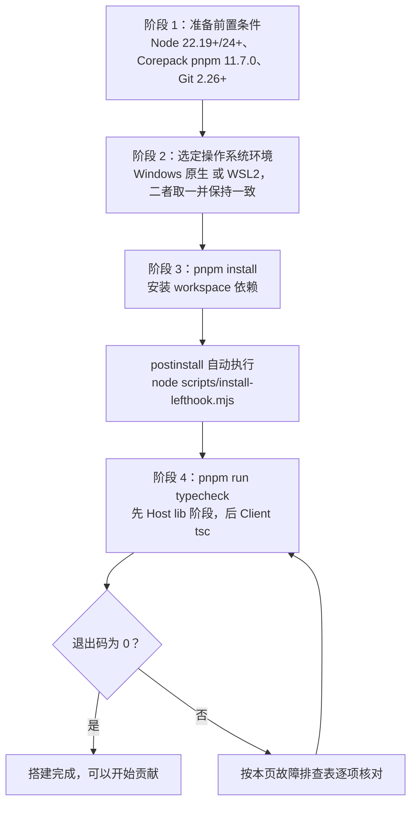
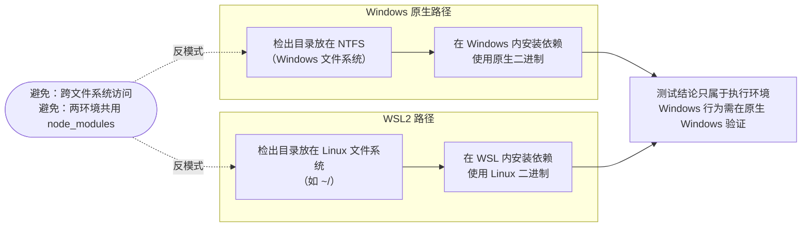
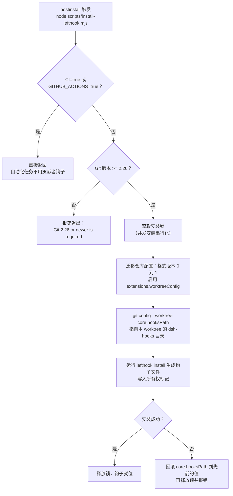
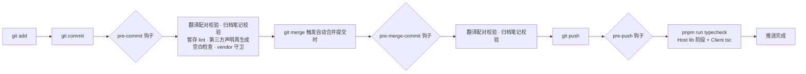

本页面向第一次接触 DeepSeek Harness 代码库的贡献者，覆盖从安装工具链到本地检查全部通过的完整搭建流程。你会了解到仓库对 Node、pnpm、Git 的版本要求及其设计原因，Windows 原生环境与 WSL2 的选择原则，`pnpm install` 如何自动配置 worktree 本地的 Lefthook 钩子，以及首次类型检查为什么必须先跑完 Host 阶段再跑 Client 阶段。整条路径的终点只有一个明确信号：`pnpm run typecheck` 成功退出。

Sources: [development.zh.md](docs/development.zh.md#L5)

## 页面定位与阅读路径

本页属于「入门」章节的第三站。如果你还没有运行过产品本身，建议先阅读[项目概述：一切皆插件的智能体框架（DeepSeek Harness 是什么、解决什么问题）](1-xiang-mu-gai-shu-qie-jie-cha-jian-de-zhi-neng-ti-kuang-jia-deepseek-harness-shi-shi-yao-jie-jue-shi-yao-wen-ti)了解框架定位，再通过[快速开始：npx 运行、从源码构建到启动 Web UI](2-kuai-su-kai-shi-npx-yun-xing-cong-yuan-ma-gou-jian-dao-qi-dong-web-ui)体验一次产品；本页则把视角从「使用」切换到「贡献代码」。完成本页搭建后，推荐进入[仓库布局导览：packages 能力分组、apps 应用、docs 文档与 scripts 校验脚本](4-cang-ku-bu-ju-dao-lan-packages-neng-li-fen-zu-apps-ying-yong-docs-wen-dang-yu-scripts-xiao-yan-jiao-ben)认识目录结构，日常开发问题可查阅[贡献指南与 CI 工作流：PR 规范、门禁组织与发版流程](29-gong-xian-zhi-nan-yu-ci-gong-zuo-liu-pr-gui-fan-men-jin-zu-zhi-yu-fa-ban-liu-cheng)。

搭建过程可以概括为下图所示的五个阶段：准备三个版本受控的工具，选择并固定一种操作系统环境，安装依赖（同时自动配置 Git 钩子），运行首次类型检查，最后以 typecheck 退出码为零作为搭建完成的判定标准。



Sources: [development.zh.md](docs/development.zh.md#L5-L50)

## 前置条件：Node、pnpm 与 Git 的版本门槛

仓库在根 `package.json` 中用两个标准字段声明了工具链要求：`engines.node` 限定为 `^22.19.0 || >=24.0.0`，`packageManager` 固定为 `pnpm@11.7.0`。这两个值不是随意选择的——CI 在 22.19、24、26 三个版本上运行，其中 22.19 是被直接验证的 Node 22 LTS 下限，24 承担主要类型检查与覆盖率任务，26 验证下一个偶数版本线。

Sources: [package.json](package.json#L7-L10), [development.zh.md](docs/development.zh.md#L13)

**为什么 LTS 下限恰好是 22.19？** 仓库记录了一份专门的 Agent Note 解释这个决策。两个 Node 源码特性决定了基线：`node:sqlite` 模块在 22.13（LTS 线）才取消 `--experimental-sqlite` 标志要求，原生 TypeScript 类型剥离在 22.18 才在 22.x 线上默认可用。但真正的门槛来自依赖方：LLM 适配层的 Pi 适配器依赖 `@earendil-works/pi-ai`，该包声明 `engines.node >=22.19.0`，于是工作区宣称的下限不能低于它，否则严格引擎检查的安装会失败。同时 `@types/node` 被固定在 22.x 线（`^22.20.0`），让「使用只有新版本才有的 API」直接在所有机器上变成 `tsc` 编译错误，而不是等到运行时才暴露。

Sources: [2026-07-06-node-engine-floor.zh.md](.agents/notes/implemented/process/2026-07-06-node-engine-floor.zh.md#L13-L24)

pnpm 的安装通过 **Corepack** 完成——它是随 Node 分发的包管理器版本管理器，会读取 `packageManager` 字段并自动使用指定的 pnpm 版本，因此你不需要全局安装 pnpm。如果 `pnpm --version` 无法解析，先运行 `corepack enable` 即可。Git 方面要求 2.26 或更高版本，原因在下文 Lefthook 一节展开：钩子安装器依赖该版本引入的 `git config --show-scope` 能力，并会启用 Git 的 worktree 专属配置扩展。

Sources: [development.zh.md](docs/development.zh.md#L14-L15), [install-lefthook.mjs](scripts/install-lefthook.mjs#L219-L230)

下表汇总了全部前置条件，可作为安装前的核对清单：

| 工具 | 最低/固定版本 | 声明位置 | 说明 |
|---|---|---|---|
| Node.js | `^22.19.0 \|\| >=24.0.0` | `package.json` 的 `engines.node` | CI 覆盖 22.19、24、26；避免 23.x 等 EOL 版本 |
| pnpm | `11.7.0`（Corepack 自动固定） | `package.json` 的 `packageManager` | 无法解析时先执行 `corepack enable` |
| Git | `2.26+` | 安装器运行时校验 | worktree 本地钩子需要 `--show-scope` 与 worktree 配置扩展 |
| DEEPSEEK_API_KEY | 无 | 环境变量或仓库根目录被 gitignore 的 `.env` | 可选；用于 agent 演示与真实 API e2e，缺失时相关套件自动跳过 |

Sources: [package.json](package.json#L7-L10), [development.zh.md](docs/development.zh.md#L14-L16), [development.zh.md](docs/development.zh.md#L105-L114)

## Windows 与 WSL2：选定一种环境并坚持使用

在 Windows 上有两条完全受支持的开发路径：使用 Windows 原生工具链，或通过 WSL 2（适用于 Linux 的 Windows 子系统第二版）获得 Linux 环境。WSL 2 的价值有两层：一是验证代码在 Linux 下的行为，二是当原生依赖编译或文件系统权限阻碍 Windows 开发时，提供切换到 Linux 工具链的出路。无论选择哪条路径，都要为该环境准备相应的运行时与编译工具。

Sources: [development.zh.md](docs/development.zh.md#L18-L20)

官方指南中最重要的一条原则是**环境一致性**：检出目录、已安装的依赖和工具链必须放在同一个操作系统环境中。具体来说，用 WSL 2 开发时把检出目录放在 Linux 文件系统里（例如 `~/` 下），用 Windows 原生工具时则放在 Windows 文件系统里。跨两种文件系统访问（例如从 WSL 操作 `D:\` 下的目录）会显著拖慢 Git、依赖安装和构建等 I/O 密集型操作。

Sources: [development.zh.md](docs/development.zh.md#L22)

第二条原则是**按环境分别安装依赖**。不同操作系统使用的原生二进制和链接方式可能不同（例如 ConPTY、平台专属的原生插件），因此在一个环境里装好的 `node_modules` 不能复用到另一个环境。同时要注意：测试结果只对执行它的环境负责——Linux 侧通过的测试不能证明 Windows 特有行为正确，后者仍需在原生 Windows 上验证。

Sources: [development.zh.md](docs/development.zh.md#L24)



Sources: [development.zh.md](docs/development.zh.md#L18-L24)

## 首次搭建：从 pnpm install 到钩子就位

前置条件就绪后，在仓库根目录执行一条命令即可完成依赖安装：

```sh
pnpm install
```

这条命令的职责远不止下载依赖。根 `package.json` 声明了 `postinstall` 钩子脚本 `node scripts/install-lefthook.mjs`，pnpm 在安装结束后会自动执行它，为你配置 worktree 本地的 Lefthook Git 钩子。也就是说，**钩子配置是安装流程的内建环节，无需任何手动步骤**。

Sources: [development.zh.md](docs/development.zh.md#L28-L34), [package.json](package.json#L203)

安装器能顺利运行构建脚本，依赖 `pnpm-workspace.yaml` 中显式审查过的 `allowBuilds` 白名单——pnpm 10+ 默认阻止任何携带安装脚本的依赖执行脚本，未列出的脚本直接导致安装失败。仓库只放行了真正需要构建脚本的包：`esbuild`（原生二进制）、`lefthook`（Git 钩子）、`node-pty`（Windows ConPTY 等持久 PTY 后端的跨平台边界）和 `koffi`（Windows 上 JSONL 持久化的写穿发布调用），其余携带生命周期脚本的包被显式拒绝且不影响安装。

Sources: [pnpm-workspace.yaml](pnpm-workspace.yaml#L35-L56)

有一种情况需要手动补装钩子：如果依赖是从缓存恢复的，或安装时 `postinstall` 被跳过（例如使用了忽略脚本的安装参数），钩子可能缺失。此时运行：

```sh
node scripts/install-lefthook.mjs
```

Sources: [development.zh.md](docs/development.zh.md#L36-L40)

如果安装器**拒绝你现有的 Git 配置**或报告陈旧的锁文件，正确反应是阅读它的诊断信息和链接的 Agent Note，而不是凭猜测编辑 worktree 元数据。另外，如果你移动了检出目录的位置，请重新运行这个包装脚本，让它重新生成记录自有路径的所有权标记。

Sources: [development.zh.md](docs/development.zh.md#L42), [2026-07-27-worktree-local-lefthook.zh.md](.agents/notes/implemented/process/2026-07-27-worktree-local-lefthook.zh.md#L20-L22)

## Lefthook 安装器做了什么：worktree 本地钩子的安全约定

理解安装器的行为逻辑，能帮你在它「拒绝工作」时快速定位原因。整体流程如下：



Sources: [install-lefthook.mjs](scripts/install-lefthook.mjs#L611-L750)

几个关键设计值得初学者了解。第一，钩子目录是 **worktree 本地**的：安装器把每个 worktree（`git worktree` 创建的独立检出）的 `core.hooksPath` 分别指向各自 Git 目录下的 `dsh-hooks` 文件夹，而不是让所有 worktree 共享同一个钩子目录。这解决了共享钩子的两个问题——共享钩子会一直执行「第一个安装钩子的 worktree」里记录的绝对二进制路径，并发安装还会互相覆写。安装采用文件锁串行化，重复安装保持幂等。

Sources: [2026-07-27-worktree-local-lefthook.zh.md](.agents/notes/implemented/process/2026-07-27-worktree-local-lefthook.zh.md#L9-L22), [install-lefthook.mjs](scripts/install-lefthook.mjs#L11-L17)

第二，安装器**绝不覆盖用户自有的配置**。如果它探测到 `core.hooksPath` 已被用户或其它钩子管理器设置（系统、全局或本地作用域），默认直接报错拒绝，提示你把已有钩子链入 `lefthook.yml`，或显式设置 `DSH_LEFTHOOK_ALLOW_HOOKS_PATH_OVERRIDE=1` 才允许替换继承路径；worktree 专属的自定义路径则必须被显式整合或移除，没有覆盖捷径。`$GIT_COMMON_DIR/hooks` 里的既有文件永远不会被移除或改写；若 Lefthook 在修改 `core.hooksPath` 之后失败，安装器还会回滚先前的 worktree 配置值。

Sources: [install-lefthook.mjs](scripts/install-lefthook.mjs#L585-L609), [2026-07-27-worktree-local-lefthook.zh.md](.agents/notes/implemented/process/2026-07-27-worktree-local-lefthook.zh.md#L20-L24)

第三，启用 worktree 配置扩展是**一次性的仓库格式升级**（`core.repositoryFormatVersion` 从 0 升到 1，并设置 `extensions.worktreeConfig=true`）。升级前安装器会检查共用配置中是否残留会被激活的休眠 `extensions.*` 项、`core.worktree` 或休眠 worktree 配置，有则拒绝继续并给出迁移指引。这就是前置条件要求 Git 2.26 的原因：安装器需要 `git config --show-scope` 来区分配置值的作用域。此外，当环境变量 `CI=true` 或 `GITHUB_ACTIONS=true` 时，安装器在做任何探测和变更之前就直接返回——CI 不使用贡献者钩子。

Sources: [install-lefthook.mjs](scripts/install-lefthook.mjs#L232-L291), [install-lefthook.mjs](scripts/install-lefthook.mjs#L219-L230), [2026-07-27-worktree-local-lefthook.zh.md](.agents/notes/implemented/process/2026-07-27-worktree-local-lefthook.zh.md#L17-L19)

## Lefthook 钩子清单：提交与推送时的快速检查点

钩子的具体行为定义在仓库根目录的 `lefthook.yml` 中。设计原则写在该文件的第一行注释里：**保持本地检查点快速，全量门禁矩阵归 CI 所有**。三个钩子阶段的分工如下表：

| 钩子阶段 | 触发时机 | 包含的检查任务 |
|---|---|---|
| `pre-commit` | `git commit` 创建提交前 | 配对翻译记录校验（仅暂存的 `*.i18n.yaml`）、归档 Agent Note 格式校验、暂存代码文件的 Oxlint 检查（带一次有界自动修复并回填暂存区）、`THIRD_PARTY_NOTICES.md` 重新生成（当暂存文件属于其输入时）、暂存区空白字符检查、vendor manifest 守卫 |
| `pre-merge-commit` | Git 创建自动合并提交前 | 同样以索引为准的配对翻译记录校验、归档 Agent Note 校验 |
| `pre-push` | `git push` 推送前 | 运行 `pnpm run typecheck` |

Sources: [lefthook.yml](lefthook.yml#L1-L56), [development.zh.md](docs/development.zh.md#L120-L124)

其中几个任务的语义需要展开。**配对记录校验**只针对暂存的 `*.i18n.yaml` 文件，对照暂存的配对文档 blob 进行校验，跳过已归档的笔记目录。**暂存 lint** 使用 `.oxlintrc.staged.json` 这个不加载项目的独立配置，对暂存的 TypeScript/JavaScript 文件执行 Oxlint，并通过一次有界重试自动应用修复（`stage_fixed: true` 会把修复结果回填到暂存区）。**第三方声明再生成**的 glob 覆盖生成器会读取的每一个输入——包括 `package.json` 系列、`pnpm-lock.yaml`、vendor manifest 和生成器自身——其设计意图是「再生成而非拒绝」：忘记同步声明的依赖编辑会在提交时被自动补齐，而不是在很久之后的测试 lane 里失败。

Sources: [lefthook.yml](lefthook.yml#L7-L31), [development.zh.md](docs/development.zh.md#L122)

**vendor manifest 守卫**检查 `vendor/*/src` 下的改动是否连同对应的 `vendor/README.md` manifest 更新一起暂存——如果你打算编辑 vendor 代码，请先阅读该 manifest。需要特别建立的心理预期是：除上述限定范围的暂存校验外，这些钩子**有意不运行**测试、快照、文档检查、构建或 `hygiene`。本地只运行与改动行为相关的最小检查集，全量覆盖率门禁、构建产物冒烟测试和 Node 版本兼容性验证由 CI 负责。如果你想主动执行完整的本地门禁集，可以运行 `pnpm run check:all`，它独立于 Git 钩子存在。

Sources: [development.zh.md](docs/development.zh.md#L126-L130)



Sources: [lefthook.yml](lefthook.yml#L1-L56)

## 首次类型检查：为什么先 Host 后 Client

新克隆完成、钩子就位后，最后一步是在仓库根目录运行一次类型检查：

```sh
pnpm run typecheck
```

这条命令成功退出即表示搭建完成。理解它内部发生的事，有助于你日后解读它的输出。

Sources: [development.zh.md](docs/development.zh.md#L44-L50)

`pnpm run typecheck` 的实际定义是 `npm run build:lib:host && npm run typecheck:contracts-ready`：先执行完整的 Host lib 阶段，再运行 Client TypeScript 检查。Host lib 阶段包含三步——`tsc -b tsconfig.host.json`（构建 Host aggregate 的类型引用图）、`tsdown --env.DSH_BUILD_FACE host`（打包 Host 面）、以及桌面 bundle 步骤；随后 Client 检查执行 `tsc -b tsconfig.client.json`。

Sources: [package.json](package.json#L25), [package.json](package.json#L46-L47)

**为什么顺序不能颠倒？** 仓库的 Typert 子系统只在 Host 构建阶段以 `tsconfig.host.json` 为种子运行，它分析 Host 类型并生成 Host 反射产物及 **Host-for-Client Remote 投影**——这些生成产物是 Client 侧 `tsc` 编译所消费的输入。如果跳过 Host 阶段直接跑 Client 检查，Client 的类型引用图会因为缺少这些生成的 Remote 声明而失败。这也是「新克隆后必须完整跑一次」的原因：你的 worktree 在此之前没有任何生成产物。想深入了解 Host/Client 双聚合与 Typert 的完整机制，可阅读[Host/Client 双聚合与 Typert 远程调用：tsconfig 拆分、Remote 声明与 RPC 网关](14-host-client-shuang-ju-he-yu-typert-yuan-cheng-diao-yong-tsconfig-chai-fen-remote-sheng-ming-yu-rpc-wang-guan)。

Sources: [development.zh.md](docs/development.zh.md#L89), [development.zh.md](docs/development.zh.md#L124)

下表对比首次类型检查执行前后的 worktree 状态，帮助你确认命令真的完成了它该做的事：

| 维度 | 执行前（新克隆） | 执行后 |
|---|---|---|
| Host 类型引用图 | 未构建 | `tsc -b tsconfig.host.json` 完成，Host 包类型检查通过 |
| Typert 生成产物 | 不存在 | Host 反射产物与 Host-for-Client Remote 声明已生成 |
| Client 类型检查 | 缺少生成声明，无法独立通过 | `tsc -b tsconfig.client.json` 通过 |
| Git 钩子 | 已由 postinstall 就位 | 保持就位；pre-push 每次推送都会复跑同一条 typecheck |
| 搭建状态判定 | 未完成 | typecheck 退出码为 0，**搭建完成** |

Sources: [package.json](package.json#L25), [package.json](package.json#L46-L47), [development.zh.md](docs/development.zh.md#L44-L50)

## 常见问题排查速查表

初学者在搭建阶段最常遇到的障碍集中在钩子安装器与类型检查两处。下表把官方指南中的处置建议集中成速查表：

| 症状 | 可能原因 | 处置方式 |
|---|---|---|
| `pnpm --version` 无法解析 | Corepack 未启用 | 运行 `corepack enable` 后重试 |
| 安装器报错要求 Git 2.26+ | Git 版本过低 | 升级 Git 到 2.26 或更高版本 |
| 提交时没有触发任何钩子 | 依赖从缓存恢复或 postinstall 被跳过 | 手动运行 `node scripts/install-lefthook.mjs` |
| 安装器拒绝现有 `core.hooksPath` | 用户或其它钩子管理器已占用该配置 | 按诊断把已有钩子链入 `lefthook.yml`，或确有需要时以 `DSH_LEFTHOOK_ALLOW_HOOKS_PATH_OVERRIDE=1` 显式覆盖继承路径 |
| 安装器报告陈旧锁 | 先前的安装器进程异常终止 | 确认没有安装器在运行后，按诊断手动移除锁文件并重试，不要凭猜测编辑 worktree 元数据 |
| 移动检出目录后钩子失效 | 所有权标记记录的是旧绝对路径 | 重新运行 `node scripts/install-lefthook.mjs` 重新生成自有路径 |
| WSL 内操作 Windows 目录极慢 | 跨文件系统 I/O | 把检出目录迁入 Linux 文件系统（或迁回 Windows 原生路径），并重新安装依赖 |
| `pnpm run typecheck` 在 Client 阶段报缺少 Remote 声明 | Host lib 阶段未完成或生成产物缺失 | 确认命令完整执行（它自带 Host 阶段）；不要手动只跑 `tsc -b tsconfig.client.json` |

Sources: [development.zh.md](docs/development.zh.md#L14-L16), [development.zh.md](docs/development.zh.md#L36-L42), [development.zh.md](docs/development.zh.md#L22-L24), [install-lefthook.mjs](scripts/install-lefthook.mjs#L585-L591), [2026-07-27-worktree-local-lefthook.zh.md](.agents/notes/implemented/process/2026-07-27-worktree-local-lefthook.zh.md#L20-L24), [package.json](package.json#L46-L47)

## 搭建完成之后

当 `pnpm run typecheck` 以退出码 0 结束，你的 worktree 已具备完整的依赖、钩子与类型生成产物，搭建阶段正式结束。接下来的自然路径是：通过[仓库布局导览：packages 能力分组、apps 应用、docs 文档与 scripts 校验脚本](4-cang-ku-bu-ju-dao-lan-packages-neng-li-fen-zu-apps-ying-yong-docs-wen-dang-yu-scripts-xiao-yan-jiao-ben)建立对目录结构的全局认知；若计划编写插件，从[Cordis 入门：插件、上下文、服务注入、类型化事件与可逆副作用](5-cordis-ru-men-cha-jian-shang-xia-wen-fu-wu-zhu-ru-lei-xing-hua-shi-jian-yu-ke-ni-fu-zuo-yong)开始学习框架模型；在提交第一个 PR 前，建议通读[测试策略：单元测试、100% 覆盖率门禁与真实 API e2e](26-ce-shi-ce-lue-dan-yuan-ce-shi-100-fu-gai-lu-men-jin-yu-zhen-shi-api-e2e)与[贡献指南与 CI 工作流：PR 规范、门禁组织与发版流程](29-gong-xian-zhi-nan-yu-ci-gong-zuo-liu-pr-gui-fan-men-jin-zu-zhi-yu-fa-ban-liu-cheng)，理解钩子背后的 CI 门禁全貌。