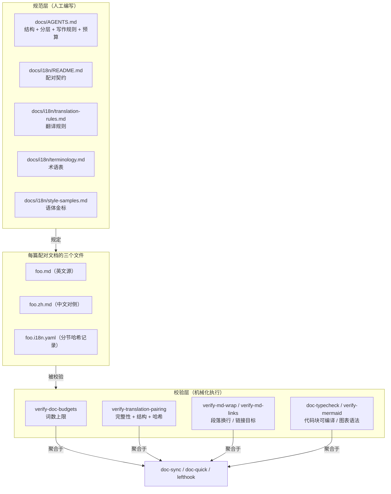
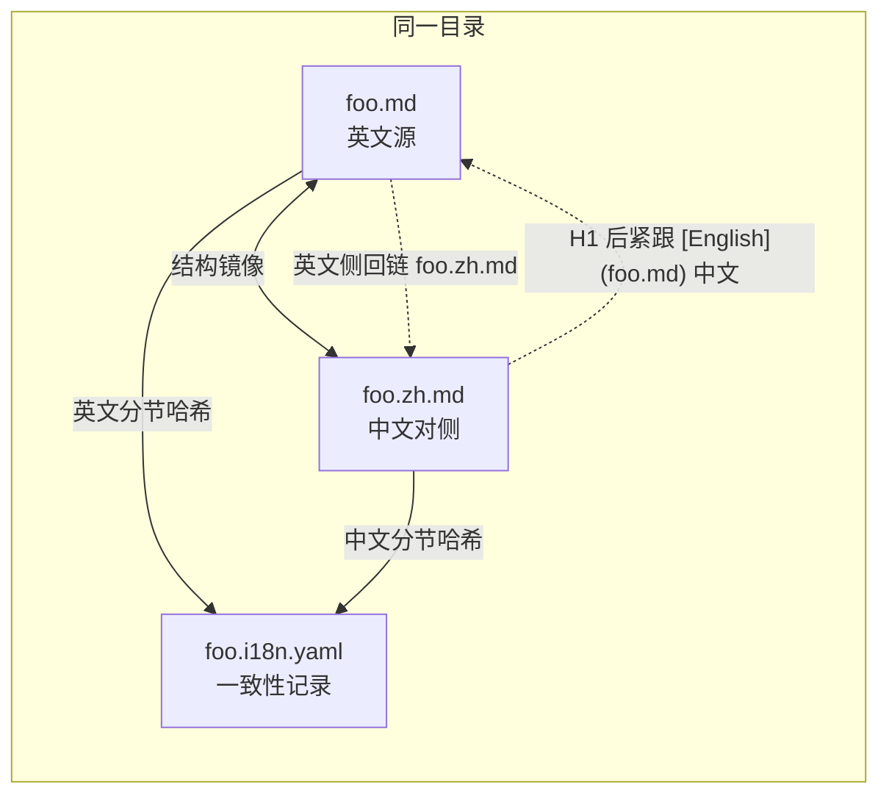
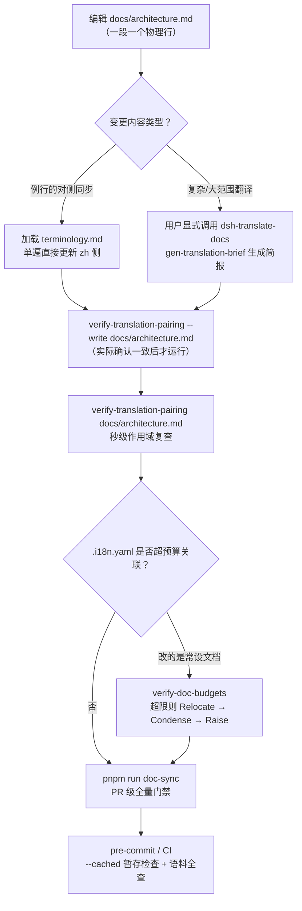

本页解析 DeepSeek Harness 中约束文档质量的三套核心机制：**文档预算**（限制常设文档篇幅的词数上限）、**双语配对**（`.md` ↔ `.zh.md` ↔ `.i18n.yaml` 三文件一致性契约）与**翻译规则**（术语表、语体金标与排版规范）。这些机制并非口头约定，而是由 `verify-doc-budgets`、`verify-translation-pairing` 等脚本门禁机械化强制执行，并纳入 `doc-sync` 聚合与 Git 钩子。

## 一套被脚本门禁强制的文档体系

该仓库的文档标准建立在**「规则必须可校验」**这一原则上：每条写作规范都对应一个可执行的校验脚本，违规在提交、合并或 CI 阶段直接变红。规范本体由 [docs/AGENTS.md](docs/AGENTS.md#L1-L5) 定义——它声明了文档结构、Markdown 分层、写作规则与词数上限四个主题，并把配对契约委托给 `docs/i18n/README.md`。整体机制可用下图概括：



Sources: [AGENTS.md](docs/AGENTS.md#L1-L5), [README.md](docs/i18n/README.md#L1-L7)

## 文档分层标准：一个事实只有一个家

写预算之前必须先理解**分层分类法**，因为预算门禁红了两条救济路径中的第一条就是「搬到正确的层」。每篇在范围内的文档被归类为 **tutorial**（按序路径导向结果，只引入当前步骤所需的概念）或 **reference**（定义查询范围与当前行为，无教学序列），二者必须分开，必要时对章节显式标注。[docs/AGENTS.md](docs/AGENTS.md#L9-L13)

**一个事实只有一个家**：每个事实归属于其职责所在的层，其他位置只放链接。这个分层表规定了每类文档的职责与禁区——根 `AGENTS.md` 只放每次会话都需要的常设指令；`architecture.md` 只放有序的架构导览；类型定义归 `subsystems/`；决策理由归 Agent Notes；操作步骤归 cookbook；事故叙事只允许出现在 `postmortem/`。放置口诀是：bug 进 postmortem、理由进 Agent Note、流程进 cookbook、类型定义进 subsystems、包契约进 README、常设指令进根 `AGENTS.md` 并附理由链接。[docs/AGENTS.md](docs/AGENTS.md#L15-L35)

## 文档预算：词数上限与棘轮规则

**预算清单只约束常设文档**。[scripts/doc-budgets.manifest.json](scripts/doc-budgets.manifest.json#L2-L10) 以「文件路径 → 词数上限」的形式登记了 8 篇核心文档：

| 文档 | 词数上限 |
|---|---|
| `AGENTS.md`（根） | 1,950 |
| `docs/AGENTS.md` | 1,320 |
| `docs/architecture.md` | 2,410 |
| `docs/cordis-primer.md` | 600 |
| `docs/defensive-patterns.md` | 550 |
| `docs/testing.md` | 1,350 |
| `packages/AGENTS.md` | 750 |
| `packages/README.md` | 994 |

执行器 [verify-doc-budgets.ts](scripts/verify-doc-budgets.ts#L1-L6) 用 `wc -w` 等价的逻辑——按空白分隔的 token 计数——统计每篇文档的实际词数，超限或文件缺失都会失败；缺失文件的报错会提示在同一次变更中更新清单（防止改名后留下幽灵预算）。`--list` 参数只报告当前用量而不失败，便于增量化迭代时随时查看余量。[scripts/verify-doc-budgets.ts](scripts/verify-doc-budgets.ts#L13-L47)

**超限后的处置顺序是棘轮式的**：第一步 **Relocate**——把属于其他层的内容搬走，必要时留一行链接；第二步 **Condense**——压缩属于本层但可以更短的内容；第三步才允许 **Raise**——只有当内容确实需要空间时提高上限，且必须在 PR 中论证清单改动，过低的上限被视为「预算 bug」。此外上限是护栏而非削减目标：达标时应保留至少 5% 余量，超限时冻结上限直至文档回到目标以下；只有文档仍有空间时才允许下调。[docs/AGENTS.md](docs/AGENTS.md#L48-L58)

Sources: [doc-budgets.manifest.json](scripts/doc-budgets.manifest.json#L2-L10), [verify-doc-budgets.ts](scripts/verify-doc-budgets.ts#L1-L15), [AGENTS.md](docs/AGENTS.md#L48-L58)

## 仓库级 Markdown 写作规范

配对门禁之外，双语仓库的两侧文件还共同受一套 Markdown 基础规范约束。最独特的一条是**一段一个物理行**：`verify-md-wrap` 通过 GFM AST 识别跨多行的散文段落并拒绝提交，作者应使用编辑器软换行；代码块、表格与列表结构保留原格式，代码注释受 linter 列宽约束。该检查器还会先屏蔽 VitePress frontmatter 与自定义容器分隔符再解析，避免误报。[docs/AGENTS.md](docs/AGENTS.md#L41)、[verify-md-wrap.ts](scripts/verify-md-wrap.ts#L1-L5)

另外两条与配对直接相关的规范：围栏 ` ```ts ` 代码块**必须可编译**（`doc-typecheck` 门禁），逐字粘贴的类型声明应改用 ` ```ts type-equiv ` 并登记进清单以防与源码漂移；相对链接由 `verify-md-links` 校验本地目标可达。这些规范对 `.zh.md` 文件原样适用——中文侧并不享有格式豁免。[docs/AGENTS.md](docs/AGENTS.md#L42-L43)、[translation-rules.md](docs/i18n/translation-rules.md#L33)

## 双语配对契约：三个同目录兄弟文件

配对契约的第一原则是**两种语言权力平等**：文档可以先用任意一种语言编写和评审——中文优先的 Agent Note 与英文优先的同等合法，对侧从该侧翻译而来；没有哪个文件天然高人一等，约束它们的是「必须表达相同内容」。第二原则是**配对整体合入**：一个 PR 永远不会只合入一种语言。契约还要求 `.zh.md` 文件在 H1 之后紧跟语言切换行 `[English](foo.md) | 中文`，已人工编写的英文侧 reciprocate 一行 `English | [中文](foo.zh.md)`。[README.md](docs/i18n/README.md#L9-L25)



**一致性记录是配对的锚点**。`foo.i18n.yaml` 为每个仍含语言内容的标题分节保存一条记录：键是该节的英文标题 slug 路径（首个标题前的文本用 `/`，重复路径追加 `~2`、`~3`），值是该节两侧内容的哈希。关键细节在于哈希的**覆盖范围**：它只计入该节的顶层块，**排除围栏代码块与生成区块**——这两类内容门禁本来就要求两侧逐字节一致；实现上，分节逻辑在遍历 mdast 时跳过 `code` 节点与落入生成区块行范围内的块，两侧再按 `sha256` 截取 16 位十六进制。[README.md](docs/i18n/README.md#L11-L24)、[translation-pairing-record.ts](scripts/translation-pairing-record.ts#L66-L120)

一个真实的记录片段（根 README 的 license 节）：

```yaml
/deepseek-harness/license:
  en: 926995344fc1c72b
  zh: c8fab5ab85932f9d
```

分节记录的设计动机是**让 Git 文本合并顺畅工作**：不同分节的独立编辑落在记录的不同行上；只有两个分支修改了同一标题分节下的语言内容时才会冲突，此时解决 Markdown 后重跑 `--write` 即可。改任一侧的语言内容而不重新确认配对，门禁立即变红。[development.md](docs/development.md#L116-L124)

Sources: [README.md](docs/i18n/README.md#L9-L26), [README.i18n.yaml](README.i18n.yaml#L1-L20), [translation-pairing-record.ts](scripts/translation-pairing-record.ts#L1-L5)

## 配对门禁：verify-translation-pairing 的四重检查

`pnpm run verify-translation-pairing` 是契约的机械执行者，它执行四类判定：**其一**，范围内每篇文档都必须有完整配对（README 发现对 basename 大小写不敏感）；**其二**，凡是存在的配对工件必须完整一致——三个文件齐全、记录为规范形式且逐条等于按当前内容计算的值、链接语言区域正确、生成区块逐字节一致、语言切换行在位、结构签名相等；**其三**，被清单列为 `excluded` 的文件不得存在 `.zh.md` 或 `.i18n.yaml`（半删配对从任一残骸都会被捕获）；**其四**，半删除的配对从 `.zh.md` 或 `.i18n.yaml` 任一残骸锚定后同样判红。[README.md](docs/i18n/README.md#L30-L34)、[verify-translation-pairing.ts](scripts/verify-translation-pairing.ts#L189-L359)

**结构签名**是结构一致性的载体，它从两侧文档各提取一份有序序列并逐字段比对：

| 签名字段 | 捕获内容 | 允许的跨语言差异 |
|---|---|---|
| `headings` | 标题深度序列（h2 → 2） | 标题**文本**被翻译 |
| `code` | 代码围栏逐字内容（info string + 正文） | **无**——必须逐字节一致 |
| `tables` | 每张表的行列数 | 单元格文本翻译 |
| `lists` | 每个列表的种类、有序起点、直接项数 | 项内文本翻译 |
| `links` | 语义链接目标（切换行被排除） | 双语语料内目标按 `.md`/`.zh.md` 本地化 |

实现上，门禁用 GFM 扩展解析两侧 Markdown，递归访问树节点累积签名，再对每个字段返回首个分歧点。[translation-pairing.ts](scripts/translation-pairing.ts#L283-L295)、[translation-pairing.ts](scripts/translation-pairing.ts#L332-L386)

**CLI 支持三种模式**，`--write` 的防误伤设计尤其值得注意——裸 `--write` 会静默批准树上所有漂移的配对，因此它强制要求显式指名配对或 `--all`：

| 调用形式 | 行为 |
|---|---|
| `verify-translation-pairing` | 全语料检查（`doc-sync` 与 CI 运行的形式） |
| `verify-translation-pairing <pair...>` | 只检查指名配对——三个文件或裸词干任一均可命名，秒级自检 |
| `--list` | 打印全语料状态（missing / out-of-sync / ok），永不失败 |
| `--write <pair...>` | 重录已确认配对的分节哈希，创建缺失记录 |
| `--write --all` | 重录所有完整配对（批量操作必须显式声明） |
| `--cached <pair...>` | 从 Git 索引读取内容检查（供钩子校验暂存区） |

[translation-pairing.ts](scripts/translation-pairing.ts#L229-L281)、[verify-translation-pairing.ts](scripts/verify-translation-pairing.ts#L1-L10)

**范围与排除采用「默认全配对、清单只写例外」的策略**：范围内文档包括根 `CONTRIBUTING.md`、`BRAND_GUIDELINES.md`、`SAFETY.md`，所有非 vendor README，以及 `.agents/notes/**`、`docs/**`、`python/**` 下的活跃文档。清单 [translation-pairing.manifest.json](scripts/translation-pairing.manifest.json#L3-L12) 只有 9 条显式排除：生成的无对侧文档（`cordis-api/inherited.md`）、仅英文维护的指令文件（`docs/AGENTS.md`、各级 `AGENTS.md` 及其 `CLAUDE.md` 符号链接）、双语自构的（`terminology.md`、`style-samples.md`）、机器逐字消费的流水线资产（`translation-prompt.md`）、仓库内部政策（`review-ownership/README.md`）。冻结的 `.agents/notes/archived/` 三元组不在本演进门禁内，由专门的 `verify-archived-agent-notes` 验证其完整性并封存——翻译维护永远不得改写它们。没有逐文件推进清单、日期分界或 README 专用政策类别：每篇现在或未来的范围内文档都必须以完整双语配对合入。[README.md](docs/i18n/README.md#L46-L65)

**生成区块是「生成内容不重译」的关键机制**。生成器把产出的数据放进 `<!-- BEGIN GENERATED slug -->` / `<!-- END GENERATED slug -->` 标记之间，并把同一区块写入两个语言页面，因此重新生成不需要手工更新中文侧或重录配对。区块标记语法由单一模块管理：嵌套的 BEGIN、无主的 END、slug 不匹配的闭合都会抛错。门禁对区块做规范化比较——除双语配对文档路径被本地化外，区块的每个字节必须两侧一致，任何散文、顺序、代码或标记漂移都会要求重新生成两侧。[translation-pairing.ts](scripts/translation-pairing.ts#L28-L58)、[verify-translation-pairing.ts](scripts/verify-translation-pairing.ts#L277-L322)

Sources: [verify-translation-pairing.ts](scripts/verify-translation-pairing.ts#L189-L359), [translation-pairing.ts](scripts/translation-pairing.ts#L283-L295), [translation-pairing.manifest.json](scripts/translation-pairing.manifest.json#L3-L12)

## 翻译规则：忠实性、语体与结构保全

[translation-rules.md](docs/i18n/translation-rules.md#L5) 把翻译质量拆成四个维度。**忠实性**采用 RFC 2119 强度：对侧 *MUST* 只说被编写侧所说的话——不增加行为、前提、警告、版本声明或示例，也不丢掉任何一个；当两侧实质不一致时没有默认赢家，修正错误一侧并在同一次变更中带上另一侧。它 *SHOULD* 读起来是目标语言自然的科技写作，而非逐词对译——翻译意义，按目标语法重组句子，但保持作者的语域（简练的保持简练）。无法直译的句子译其意念而非习语。[translation-rules.md](docs/i18n/translation-rules.md#L7-L11)

**语体**由语体金标校准而非文字描述：译文必须匹配最近的语体样例的目标语言侧，样例与散文语体规则冲突时**样例胜出**。写作姿态是「以母语科技作者的身份重述内容」而非「以译者身份搬运句子」，同时保留每个源从句。中文侧要求为句子补显式主语——把含混的被动句或抽象主语替换为真实执行者（系统、门禁、评审人），并用工程惯用语替代仿造词（false positive/negative → 误报／漏检）。[translation-rules.md](docs/i18n/translation-rules.md#L13-L20)

**结构保全**清单与结构签名一一对应：标题层级同深同序（标题文本翻译）、列表形状与编号一致、表格同列同序（表头按术语表翻译）、围栏代码块**含注释逐字节一致**、行内代码 span（命令、旗标、配置键、路径、事件名、API 名、版本号）逐字保留、相对文档链接保持语义目标与精确的 query/fragment 后缀——目标属于活跃双语语料时英文侧用 `.md` 路径、中文侧用 `.zh.md` 路径，语料内缺失对侧即报错。[translation-rules.md](docs/i18n/translation-rules.md#L22-L31)

**中文排版**规则可直接落地执行：中文与拉丁词、中文与数字之间放一个半角空格（`每个 plugin 注册 3 个 tool`）；中文散文用全角标点 `，。：；？！（）「」`，半角标点只留在代码 span、原样引用的完整英文句和数字内；并列项用顿号（、）；禁用全角数字与全角拉丁字母；人称用「你」不用「您」；强调标记（`**`、`*`）保持在源文同一 span 上，不得用引号或其他装饰替代。[translation-rules.md](docs/i18n/translation-rules.md#L41-L52)

Sources: [translation-rules.md](docs/i18n/translation-rules.md#L7-L57)

## 术语表与语体金标

**术语表是双向约束的真源**。[terminology.md](docs/i18n/terminology.md#L3) 的通用规则规定了四列表格（English / 中文 / 首次出现 / 不要译作 / 备注）的使用方式：「中文」列是译文正文默认用词，若该列为英文则正文保留英文；「首次出现」列书写首次出现格式（带括号注释），后续出现只写括号前部分；「不要译作」列为严格禁止译法；某术语若已作为另一术语组成部分被括注过，后续单独出现无需再次括注。翻译前必须加载术语表，每个收录词条必须遵循其行及禁止译法。未收录的中文目标术语可以采用主流中文 OSS 或厂商来源的既定译法（须在 PR 中引用先例），否则必须保留英文并列入「待定术语」；两个方向都不允许临时发明译法——定案词条进入术语表。[translation-rules.md](docs/i18n/translation-rules.md#L35-L39)

表格按三类组织，从仓库摘录的典型词条如下：

| 类别 | 示例词条 | 约束要点 |
|---|---|---|
| 缩写类（两侧均用缩写） | ACP、LLM、HMR | 首现带括注：LLM（大语言模型） |
| 英文类（两侧均用英文） | agent loop、seam、subagent | 正文保留英文；`seam` 禁译「接缝」；`subagent` 文档保留英文、中文 UI 译「子智能体」且禁用「子代理」 |
| 双语类（各自使用中英文） | adapter → 适配器、snapshot → 快照、source of truth → 真源 | `capability` → 能力与 `feature` → 功能必须区分；`artifact` 禁译「制品」 |

[terminology.md](docs/i18n/terminology.md#L13-L215)

**语体金标是翻译语体的校准锚点**。[style-samples.md](docs/i18n/style-samples.md#L3) 收录七组人工评审定稿的中英对照段落，覆盖架构叙述、防御模式规则、测试政策清单、机制描述、政策声明、Agent Note 论证、统一要求七种文体。维护方式是新金标段落经 PR 评审后追加，语义或术语错误直接修正。样例文件末尾提炼的操作要点与术语表的优先级关系被明确约定：**样例与术语表冲突时以术语表为准**；代码体标识符（事件名 `agent/status`、状态值 `running`、包名 `dsh-bash-local`）在译文中保留 code span 原文，不得口语化改写。[style-samples.md](docs/i18n/style-samples.md#L70-L88)

Sources: [terminology.md](docs/i18n/terminology.md#L3-L10), [style-samples.md](docs/i18n/style-samples.md#L1-L5)

## 自动翻译流水线与扩展翻译工作流

**`translation-prompt.md` 是唯一的机器消费文档**，也是它不参与配对的原因：从 `# Translation Prompt` 开始的正文会逐字进入模型请求，若有配对译本反而会改变流水线行为。模板使用三个占位符——`{{source_lang}}`、`{{target_lang}}`（由被改侧文件推断）与 `{{terminology}}`（渲染时读取仓库当前术语表，不缓存）。输出协议是三段裸 XML：`<translation>`（初译）、`<review>`（实际修正，每行一条带类别标签）、`<final>`（修正后全文）；正文内出现的标签行须前置反斜杠转义。少样本校准不用模板内嵌的句子级正误例，而是注入**五篇整文档**的人工评审配对（README、development、i18n 三件套及一篇双语配对 Agent Note），按对话轮次排列在系统消息之后。[translation-prompt.md](docs/i18n/translation-prompt.md#L5-L33)

**日常翻译不需要任何工具链**。契约的分工条款规定：例行的对侧更新由工作 agent 在加载术语表后**一次性直接完成**——不调用翻译技能、不生成简报、不运行独立的翻译评审 pass、不委托 subagent；`dsh-translate-docs` 技能保持用户显式调用，其 frontmatter 亦声明 `disable-model-invocation: true`，普通文档工作永不加载它。[README.md](docs/i18n/README.md#L67-L69)、[SKILL.md](.agents/skills/dsh-translate-docs/SKILL.md#L10-L12)

被显式调用时，技能按变更类型三分派：**Update**（配对已存在、一侧被改）走简报驱动的低成本路径；**New pair**（尚无对侧）走整文档路径；**Deleted or renamed** 必须连同 `.i18n.yaml` 一起删除或改名，否则门禁报不完整配对。简报路径的五步是：`pnpm run gen-translation-brief <pair>` 生成变更映射（粒度从细到粗：代码围栏 splice → Markdown 单元 → 标题分节 → 整文档）；纯机械 diff（全部落在共享的代码围栏内）时 `--apply` 直接拼接并对侧结构校验后写入；散文 diff 委托 subagent 并传入简报（简报内联规则摘要、术语行与三路上下文，subagent 不重读指导语料）；执行覆盖 diff 的最小编辑；最后 `--write` 指名重录 + 指名复查。[SKILL.md](.agents/skills/dsh-translate-docs/SKILL.md#L18-L34)

整文档路径（新配对）则由编排 agent 生成 subagent 执行翻译：译者先读四个真源（配对契约、翻译规则、术语表、流水线模板），再做 **Pass 1 以最近语体样例的语域重写**、**Pass 2 逐句对照源文验证忠实性**，最后**脱离源文单独通读译文**修正孤立的别扭措辞。[SKILL.md](.agents/skills/dsh-translate-docs/SKILL.md#L36-L50)

Sources: [translation-prompt.md](docs/i18n/translation-prompt.md#L1-L33), [SKILL.md](.agents/skills/dsh-translate-docs/SKILL.md#L10-L34), [gen-translation-brief.ts](scripts/gen-translation-brief.ts#L1-L10)

## 门禁编排：doc-sync、doc-quick 与 Git 钩子

所有文档校验通过 `run-gates.ts` 的**有界并行调度器**聚合执行。`doc-sync` 聚合（`pnpm run doc-sync`）展开为约 40 个叶子门禁，包括文档类型检查、文档站构建、配对检查、段落换行、Mermaid 语法、类型等价粘贴、各类生成目录校验与预算检查；聚合内各门禁以 `needs`/`after` 声明依赖，调度器验证无环后按稳定 FIFO（最长叶子先行）并发执行，本地模式并发上限为 4——因为多个文档门禁各自构建完整的 `ts.Program`，不设上限会用墙钟时间换内存爆炸。[run-gates.ts](scripts/run-gates.ts#L770-L838)、[run-gates.ts](scripts/run-gates.ts#L132-L147)

**`doc-quick` 是无需构建的快速子集**：它取 `docSyncLeafGates` 中标记 `quick: true` 的叶子——配对、换行、链接、预算、术语、Agent Note 格式等约 15 项——覆盖散文、配对、README、预算与 Agent Note 门禁，但不含构建、生成器再生成或 VitePress 站点构建，适合翻译任务的自查循环。[run-gates.ts](scripts/run-gates.ts#L840-L847)

**Git 钩子只做最小暂存区检查**。`pre-commit` 对暂存的 `*.i18n.yaml` 触发 `verify-translation-pairing.ts --cached {staged_files}`——从 Git 索引读取内容平面、只校验暂存配对的记录与属主 blob 一致；`pre-merge-commit` 在 Git 创建自动合并提交前执行同样的索引配对检查；`pre-push` 运行完整类型检查。钩子刻意不运行测试、快照、文档检查、构建或 hygiene——贡献者对变更面跑一次相关检查即可，穷尽覆盖归 CI 所有。[lefthook.yml](lefthook.yml#L6-L13)、[development.md](docs/development.md#L116-L126)

| 执行时机 | 运行的文档门禁 | 内容平面 |
|---|---|---|
| `pre-commit` / `pre-merge-commit` | 配对记录（仅暂存文件） | Git 索引（`--cached`） |
| `pnpm run doc-quick`（本地自查） | 快速子集，无构建 | 工作树 |
| `pnpm run doc-sync`（PR 级） | 完整约 40 项，含文档站构建 | 工作树 |
| CI（`ci.yml` 各泳道） | 完整子集 + 契约就绪变体 | 工作树 + 构建产物 |

Sources: [run-gates.ts](scripts/run-gates.ts#L770-L847), [lefthook.yml](lefthook.yml#L6-L40)

## 实践：修改一篇双语文档的完整流程

将前述机制串联为一条可操作的路径。假设 PR 需要更新 `docs/architecture.md` 的一节：



两个纪律性细节值得强调。**`--write` 是可评审的声明**：`.i18n.yaml` 在 PR 中的 diff 就是「我已确认这两个文件表达相同内容」的评审凭证，因此只能在真正确认后运行。**PR 内完成全部对侧工作**：编辑任一侧的 PR 必须在同一次变更中以术语指导的单遍更新直接修改对侧并重录配对，留下滞后对侧的 PR 会被门禁拒绝合入。[README.md](docs/i18n/README.md#L42-L42)、[SKILL.md](.agents/skills/dsh-translate-docs/SKILL.md#L30-L34)

Sources: [SKILL.md](.agents/skills/dsh-translate-docs/SKILL.md#L26-L34), [README.md](docs/i18n/README.md#L42)

## 门禁的边界：绿灯意味着什么

这套机制对自身的能力边界有清醒陈述：**绿灯只意味着配对在这些确切内容上曾被确认一致，不意味着确认本身可靠**。门禁校验哈希与 Markdown 结构，它无法判断两种语言是否真的表达了相同内容、措辞是否准确、术语是否得当——这正是评审人那一半契约责任。质量完成的定义随之清晰：双语工程师单独阅读任一文件即获得另一文件读者获得的一切——相同事实、相同注意事项、相同语气——且没有多余内容。人评审负责结构签名覆盖之外的清单与表格顺序、非规范列表编号、行内代码与强调 span、以及最终的意义等值。[README.md](docs/i18n/README.md#L44)、[translation-rules.md](docs/i18n/translation-rules.md#L54-L57)

Sources: [README.md](docs/i18n/README.md#L42-L44), [translation-rules.md](docs/i18n/translation-rules.md#L54-L57)

## 延伸阅读

本文聚焦文档标准与国际化机制本身。若需了解这些校验脚本在更大质量体系中的位置，请继续阅读 [贡献指南与 CI 工作流：PR 规范、门禁组织与发版流程](29-gong-xian-zhi-nan-yu-ci-gong-zuo-liu-pr-gui-fan-men-jin-zu-zhi-yu-fa-ban-liu-cheng)；若需回顾 `scripts/` 目录中校验脚本的整体布局，参见 [仓库布局导览：packages 能力分组、apps 应用、docs 文档与 scripts 校验脚本](4-cang-ku-bu-ju-dao-lan-packages-neng-li-fen-zu-apps-ying-yong-docs-wen-dang-yu-scripts-xiao-yan-jiao-ben)；而 `doc-typecheck` 所消费的构建产物链路，可在 [测试策略：单元测试、100% 覆盖率门禁与真实 API e2e](26-ce-shi-ce-lue-dan-yuan-ce-shi-100-fu-gai-lu-men-jin-yu-zhen-shi-api-e2e) 中找到测试侧的对应机制。