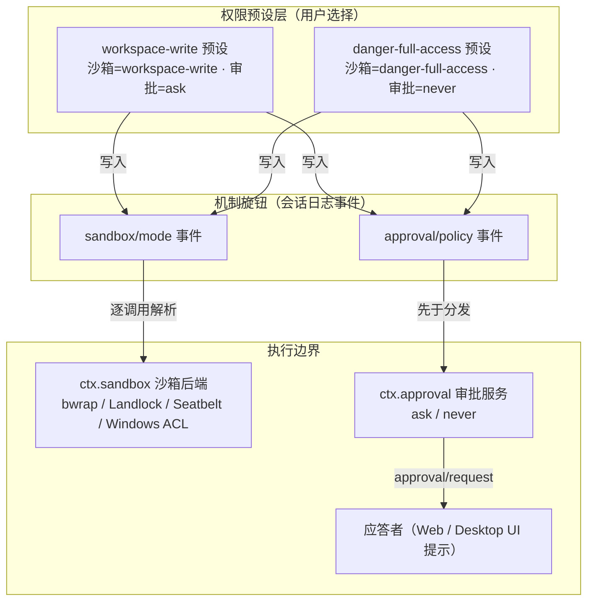
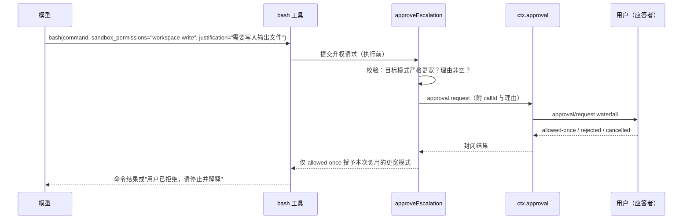

DeepSeek Harness 是一个能执行模型生成的代码与命令的智能体框架——这本身就是它最大的风险面。本页面向初次接触本项目的开发者，回答三个问题：官方对安全状态怎么说（安全须知）、模型的权限由什么决定（沙箱模式与权限预设）、以及敏感操作如何被放行或拦下（工具审批与升权）。读完本页，你应当能安全地跑起第一次会话，并知道每个权限选项背后的确切语义。



Sources: [SAFETY.zh.md](SAFETY.zh.md#L1-L28), [permission-presets/src/index.ts](packages/interaction/permission-presets/src/index.ts#L1-L13)

## 先读这份：官方安全声明

项目根目录的 `SAFETY.zh.md` 是官方安全声明，`README.zh.md` 明确要求"运行本项目前，请阅读安全说明"。声明分为四段：**实验性状态**（尚未接受安全审计，不得视为安全或可用于生产环境）、**沙箱限制**（沙箱与审批只是降低风险，不是隔离保证）、**负责任地使用**（最小权限、一次性环境、备份、先审查再放行）、**免责**（按 MIT 许可证"按原样"提供，作者不为损害承担责任）。核心结论一句话：不要把 DeepSeek Harness 当作不可信工作负载唯一的安全控制措施。

Sources: [SAFETY.zh.md](SAFETY.zh.md#L5-L27), [README.zh.md](README.zh.md#L11-L15)

为什么声明如此谨慎？因为本项目可以执行模型生成的代码与命令、加载第三方插件，并访问向其开放的网络、进程、凭据和文件——错误的模型输出、缺陷、配置错误、恶意输入或不可信插件都可能损坏宿主机、修改或删除文件、泄露数据或凭据。更关键的是，即使沙箱限制得到正确执行，也**无法保护本项目获准访问的资源**：例如 `workspace-write` 模式下工作区内的文件本来就是允许写入的，任何沙箱机制都保护不了它们。这解释了后续所有权限设计的出发点——它们是风险削减手段，不是安全边界保证。

Sources: [SAFETY.zh.md](SAFETY.zh.md#L7-L23)

## 权限模型全景：两个旋钮与一个预设层

Harness 的"模型权限"由两个**相互独立的机制旋钮**构成，再由一个用户友好的预设层把它们捆绑起来：

- **沙箱模式**：`SandboxMode` 三档，管控文件系统效果；
- **审批策略**：`ApprovalPolicy` 两档（`ask` / `never`），决定敏感操作是否要先问人。

[权限预设服务](packages/interaction/permission-presets/src/index.ts)把这两个旋钮打包成具名预设：默认出厂表只有 `workspace-write`（workspace-write + ask）和 `danger-full-access`（danger-full-access + never）两个预设，名称 `custom` 与 `auto` 保留给推导状态与 Auto review 集成，不能在配置表中出现。切换预设时，服务仍通过各自的权威 setter（`setSandboxMode` 与 `setApprovalPolicy`）逐个写入旋钮——所以预设只是"捆绑开关"，执行层永远读的是两个旋钮各自最新的值。

| 预设名 | 沙箱旋钮 | 审批旋钮 | 面向用户的描述 |
|---|---|---|---|
| `workspace-write`（默认之一） | `workspace-write` | `ask` | 工作区与许可的临时目录内可写；更宽的重试需要审批 |
| `danger-full-access` | `danger-full-access` | `never` | 完整文件访问，无审批提示 |
| `auto`（保留，需显式集成） | `danger-full-access` | `ask` | Auto review 集成的固定当前会话预设 |

Sources: [permission-presets/src/index.ts](packages/interaction/permission-presets/src/index.ts#L63-L105), [permission-presets/src/index.ts](packages/interaction/permission-presets/src/index.ts#L182-L199), [docs/subsystems/permission-presets.md](docs/subsystems/permission-presets.md#L9-L57)

两个旋钮的**出厂默认值**本身就体现了安全取向：沙箱模式默认 `read-only`（注释明确称其为"fail-safe 默认"，想要工作区可写的部署必须显式选择加入），审批策略默认 `ask`（委托给应答者链，没有应答者时以拒绝方式关闭）。也就是说，一个未做任何安全配置的部署，起点是最保守的组合。

Sources: [sandbox-policy/src/index.ts](packages/sandbox/sandbox-policy/src/index.ts#L64-L79), [user-approval/src/index.ts](packages/interaction/user-approval/src/index.ts#L134-L153)

## 沙箱模式：文件效果的运行边界

`SandboxMode` 只管控**文件系统效果**——网络访问与进程可见性明确不在这个词汇表内。三种模式的语义如下：

| 模式 | 文件效果 | 备注 |
|---|---|---|
| `read-only`（默认） | 任何位置都不可写；仅放行 `/dev/null` 等必需接收器 | `>/dev/null` 这样的 shell 重定向仍然可用 |
| `workspace-write` | 仅允许写入工作区根目录（取自会话的不可变 cwd）加上后端定义的临时区 | bwrap 下临时区为 ephemeral `/tmp`，Landlock 为主机 `/tmp`，Seatbelt 为 `/private/tmp` 加每用户临时目录 |
| `danger-full-access` | 完全不约束——消费方直接 spawn 原始 argv，**根本不调用** `ctx.sandbox` | 这是显式的"无沙箱模式"，不是"更宽的沙箱" |

Sources: [docs/subsystems/sandbox.md](docs/subsystems/sandbox.md#L9-L39), [bash-sandbox/README.md](packages/shell/bash-sandbox/README.md#L34-L40)

两个初学者最容易踩坑的细节值得单独强调。第一，**强制执行完整性是后端报告的事实而非承诺**：`full` 表示后端管控了该模式承诺的所有文件效果，`partial` 表示活跃后端或较旧内核 ABI 只能管控其中一部分（旧版 Landlock ABI 与 Windows ACL runner 会报告 `partial`），要求绝对保证的消费方必须把 `partial` 与 `full` 区别对待。第二，**沙箱是 fail-closed 的**：如果没有任何运行器能执行一个受约束模式，前台调用会以 `SANDBOX_UNAVAILABLE` 失败，而不是静默地不加约束地运行——受约束策略下"静默放行"被架构明令禁止。平台后端（Linux 的 bwrap/Landlock、macOS 的 Seatbelt、Windows 的 ACL）的内部机制在[沙箱与安全边界](18-sha-xiang-yu-an-quan-bian-jie-ce-lue-jie-xi-bwrap-landlock-seatbelt-hou-duan-yu-shen-pi-seam)页有深入展开。

Sources: [docs/subsystems/sandbox.md](docs/subsystems/sandbox.md#L30-L39), [docs/subsystems/sandbox.md](docs/subsystems/sandbox.md#L154-L158), [bash-sandbox/README.md](packages/shell/bash-sandbox/README.md#L93-L99), [bash-sandbox/README.md](packages/shell/bash-sandbox/README.md#L164-L175)

## 工具审批：ask / never 与 fail-closed 语义

审批服务 `ctx.approval` 回答一个问题：**这一个具体动作能不能继续？** 会话的审批策略决定进入交互流程之前发生什么：`ask`（默认）把请求委托给组合好的应答者链；`never` 则在服务内部、waterfall 分发**之前**就确定性地返回 `rejected`——这是 CI 与无人值守运行的严格无头模式，甚至连模型收到的系统提示词都会改写为"审批提示已禁用，请勿请求沙箱升权（不要设置 `sandbox_permissions`）"。

Sources: [user-approval/src/index.ts](packages/interaction/user-approval/src/index.ts#L57-L75), [user-approval/src/index.ts](packages/interaction/user-approval/src/index.ts#L267-L275), [docs/subsystems/approval.md](docs/subsystems/approval.md#L31-L47)

审批结果是**封闭词汇表**，且全链路 fail-closed：

| 结果 | 含义 | 后续动作 |
|---|---|---|
| `allowed-once` | 唯一的授权形式：只批准被问到的这一件事 | 放行本次操作 |
| `rejected` | 应答者明确拒绝 | 调用方拒绝执行 |
| `cancelled` | 请求被中止信号撤回 | 调用方拒绝执行 |
| `unavailable` | 没有应答者、应答者抛异常、或返回了词汇表外的值 | 调用方**必须**按拒绝处理 |

注意 `unavailable` 的设计意图：缺失、抛异常或不合规范的应答者都会被归一化为 `unavailable` 而不是打开闸门——组合不完整的部署（例如无头环境没有人类应答者）会以拒绝方式关闭，而不是放行。

Sources: [docs/subsystems/approval.md](docs/subsystems/approval.md#L21-L29), [user-approval/src/index.ts](packages/interaction/user-approval/src/index.ts#L276-L292), [user-approval/README.zh.md](packages/interaction/user-approval/README.zh.md#L147-L158)

每次审批还会留下**审计事件对**：服务先追加携带请求身份与工具名的 `approval/asked`，决策完成后再追加携带最终结果的 `approval/decided`。这对事件只写入会话日志、**绝不进入模型上下文**——模型只会看到发起请求的工具最终返回的"允许/拒绝/取消/不可用"结果，面向人类的权限 UI 也不属于上下文。此外，审批请求要求当前处于一个尚未结束的轮次内：审计事件对必须被 `turn/start` 与 `turn/end` 包住（轮次是持久日志的提交/重放边界，轮次之间的孤立事件在重载时无法与崩溃残留区分），在空闲时调用会在写审计前直接抛错。

Sources: [user-approval/src/index.ts](packages/interaction/user-approval/src/index.ts#L215-L234), [docs/subsystems/approval.md](docs/subsystems/approval.md#L84-L88), [user-approval/src/index.ts](packages/interaction/user-approval/src/index.ts#L77-L92)

## 升权流程：sandbox_permissions + justification

当受约束模式下的一条命令被沙箱拦下时，工具结果会追加标记 `[sandbox: file access denied under <mode> mode]`——这是策略拒绝，不是命令失败。若组合声明了升权能力，结果还会追加同轮次提示 `[sandbox: escalation available — retry this exact command once with sandbox_permissions …]`，模型可以在**同一轮次内**用严格更宽的模式重试一次原命令，并附一句理由。这套编排由所有沙箱执行工具家族（bash 与文件系统工具）共享的 `approveEscalation` 完成：



Sources: [bash-sandbox/README.md](packages/shell/bash-sandbox/README.md#L58-L60), [sandbox/src/escalation.ts](packages/sandbox/sandbox/src/escalation.ts#L1-L17)

升权有三条铁律。第一，**只能严格更宽**：升权梯子是封闭的（`read-only` 可升到 `workspace-write` 或 `danger-full-access`；`workspace-write` 只能升到 `danger-full-access`；`read-only` 是地板，没有任何东西能升到它），请求不严格更宽的目标会在执行前抛错。第二，**参数成对出现**：`sandbox_permissions` 与 `justification` 必须一起提交——没有理由的审批请求是畸形请求，空的或重复当前模式的理由同样会被校验拦截。第三，**授权严格一次性**：即使用户批准，更宽的模式也只作用于这一次调用，不存在"永久允许"或记住的规则。

Sources: [sandbox/src/escalation.ts](packages/sandbox/sandbox/src/escalation.ts#L22-L61), [sandbox/src/escalation.ts](packages/sandbox/sandbox/src/escalation.ts#L161-L198)

用户在审批提示里看到的是模型理由的本地化展示（例如"允许本次操作使用 workspace-write 权限：……"），而模型在用户拒绝时收到的错误消息值得原样体会：*"the user rejected escalating this command; it stays denied, so stop and explain instead of working around it"*——被拒绝的权限就是被拒绝的，系统明确要求模型停止并解释，而不是绕道重试。

Sources: [sandbox/src/escalation.ts](packages/sandbox/sandbox/src/escalation.ts#L188-L208)

## 把权限用起来：配置与会话内切换

对部署者来说，预设表与新会话默认值都在插件配置里完成。下面是最常见的配置形状（新会话默认钉在 `workspace-write` 预设）：

```yaml
- name: '@deepseek-ai/dsh-permission-presets'
  config:
    presets:
      workspace-write:
        sandbox: workspace-write
        approval: ask
      danger-full-access:
        sandbox: danger-full-access
        approval: never
    defaultPreset: workspace-write
```

Sources: [permission-presets/README.zh.md](packages/interaction/permission-presets/README.zh.md#L30-L64)

有三条组合约束需要记住：预设服务要求已挂载**具有约束能力的 bash 执行器**（能报告 `sandboxMode` 能力事实）和 `ctx.approval`，否则在插件加载期直接抛错——一个不约束的执行器配"权限预设"是配置矛盾；`custom` 不是可选项，而是当前旋钮值不匹配任何预设时的**推导展示值**，可以从它切换出去但不能选中它；配置的 `defaultPreset` 必须指向配置表中的预设。运行中的会话内切换通过 `/permission` 命令（客户端从进程级目录 `catalog()` 渲染可选条目），切换会先追加一条 `permission/preset` 意图事件，再逐个写入实际变化的旋钮。

Sources: [docs/subsystems/permission-presets.md](docs/subsystems/permission-presets.md#L45-L57), [permission-presets/README.zh.md](packages/interaction/permission-presets/README.zh.md#L127-L138), [permission-presets/README.zh.md](packages/interaction/permission-presets/README.zh.md#L84-L101)

## 安全使用清单：给初学者的实操建议

把官方声明与机制语义合起来，下面是一张按使用场景选择的速查表：

| 使用场景 | 建议预设 | 理由 |
|---|---|---|
| 日常交互开发 | `workspace-write`（workspace-write + ask） | 工作区内可写、越界操作先问人，兼顾效率与可控 |
| 处理不可信输入或首次尝试陌生任务 | `read-only`（沙箱部署默认） | 只读起点，任何写入都需显式升权 |
| CI / 无人值守 / 无头运行 | 审批策略 `never` | 确定性拒绝所有审批请求，不挂起等待人类 |
| 明确需要全权限的隔离环境 | `danger-full-access` | 仅在一次性虚拟机、容器或专用环境中使用 |

Sources: [SAFETY.zh.md](SAFETY.zh.md#L17-L23), [sandbox-policy/src/index.ts](packages/sandbox/sandbox-policy/src/index.ts#L64-L79), [user-approval/src/index.ts](packages/interaction/user-approval/src/index.ts#L57-L67)

在此基础上，请把官方"负责任地使用"五条落实为习惯：仅授予所需的最小权限和访问范围；优先在一次性虚拟机、容器或专用环境中运行；备份本项目可以访问的文件；除非接受相关风险，否则不暴露敏感凭据或数据；在允许运行前检查插件、配置和拟执行命令。关于凭据还有一条架构层面的好消息：凭据 seam 的设计就是让配置文件只携带**环境变量名引用**而不是密钥值本身，密钥由提供方（如环境变量、`.env` 文件）持有——所以请遵循这个设计，把 API key 放进环境变量而不是写进 `cordis.yml`。最后，Web UI 默认只绑定本机 `http://127.0.0.1:3080`，通过 SSH 远程启动时只打印宿主机 URL，这个默认姿势本身就是最小暴露面的体现，请勿随意改动。

Sources: [SAFETY.zh.md](SAFETY.zh.md#L17-L23), [docs/subsystems/credentials.md](docs/subsystems/credentials.md#L1-L7), [README.zh.md](README.zh.md#L25-L30)

## 常见误区与边界澄清

初学者对权限系统最常见的五个误解，用一张表逐一澄清：

| 常见误解 | 实际语义 |
|---|---|
| "沙箱能拦住网络访问" | 不能。`SandboxMode` 只管控文件系统效果，网络与进程可见性明确在词汇表之外 |
| "批准一次就永久允许了" | 不会。结果词汇只有 `allowed-once`，没有 `allow-always`、记住的规则或授权存储 |
| "审计事件会进入模型上下文" | 不会。`approval/asked` / `approval/decided` 只写会话日志，模型只见最终工具结果 |
| "danger-full-access 是更强的沙箱" | 恰恰相反。它是显式的无约束模式，消费方直接 spawn 原始 argv、不经过沙箱 |
| "partial 强制执行可以当 full 用" | 不行。`partial` 表示后端只能管控承诺文件效果的子集，要求绝对边界的调用方必须区别对待 |

Sources: [docs/subsystems/sandbox.md](docs/subsystems/sandbox.md#L11-L39), [user-approval/README.zh.md](packages/interaction/user-approval/README.zh.md#L147-L158), [bash-sandbox/README.md](packages/shell/bash-sandbox/README.md#L164-L175)

还有一条贯穿始终的元规则值得内化：**沙箱、审批提示与权限控制可以降低风险，但不保证隔离**。这套系统的设计哲学是 fail-closed（缺应答者即拒绝、缺运行器即报错、缺理由即拦截）加上最小授权（一次性批准、严格更宽的升权梯子），但它们保护不了已授权的资源——工作区内本来就可写的文件、`danger-full-access` 下的一切，都依赖你在部署层面做出的环境选择。

Sources: [SAFETY.zh.md](SAFETY.zh.md#L11-L15)

## 延伸阅读

- 想深入沙箱后端（bwrap/Landlock/Seatbelt/Windows ACL）的解析与执行细节，请继续阅读[沙箱与安全边界：策略解析、bwrap/Landlock/Seatbelt 后端与审批 seam](18-sha-xiang-yu-an-quan-bian-jie-ce-lue-jie-xi-bwrap-landlock-seatbelt-hou-duan-yu-shen-pi-seam)。
- 想了解工具调用的完整流水线（审批发生在 pre/execute/post 的哪一步），请阅读[工具系统与执行流水线：ToolDefinition、schema DSL 与 pre/execute/post 把关事件](16-gong-ju-xi-tong-yu-zhi-xing-liu-shui-xian-tooldefinition-schema-dsl-yu-pre-execute-post-ba-guan-shi-jian)。
- 想知道无头/CI 部署如何组合审批策略与权限预设，请阅读[CLI 与 Headless/ACP：profile 启动、命令行参数与 Agent Client Protocol](22-cli-yu-headless-acp-profile-qi-dong-ming-ling-xing-can-shu-yu-agent-client-protocol)。
- 想在 Web UI 中实际操作权限选择器与审批提示，请阅读[Web 应用与浏览器客户端：连接传输、UI 插件模块与产品隔离](20-web-ying-yong-yu-liu-lan-qi-ke-hu-duan-lian-jie-chuan-shu-ui-cha-jian-mo-kuai-yu-chan-pin-ge-chi)。