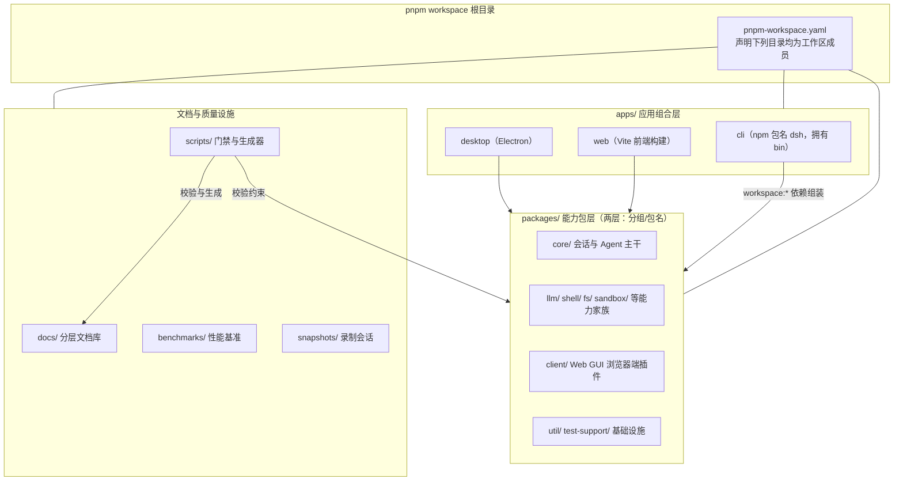

初次打开 DeepSeek Harness 仓库，你看到的不是零散的项目文件夹，而是一台由数百个 npm 包组装而成的机器。本页是全仓库的"平面图"：解释每个顶层目录的职责、`packages/` 下的能力分组规则、`apps/` 里的应用如何组装这些包、`docs/` 的分层文档体系，以及 `scripts/` 中那些守卫代码质量的大门。读完本页，你应该能对任何一份代码或文档说出"它属于哪里、归谁管、去哪找它的说明书"。

## 先建立两个概念：Monorepo 与 Workspace

在逐个目录展开之前，需要先理解这个仓库的组织形式——**Monorepo（单仓库）**，即把许多本可以独立发布的 npm 包放在同一个 Git 仓库里统一开发。管理这些包的工具是 **pnpm**，它通过根目录的 `pnpm-workspace.yaml` 声明"哪些目录下的每个 `package.json` 都算作一个工作区成员"。这份清单是理解全仓库的钥匙：`packages/*/*`（两层通配，即"分组/包名"）、`apps/*`、`native/system`、`benchmarks`、`website`，以及 Python 单文件可执行版的部署根 `python/sdk-runtime`。

图中箭头方向是初学者最容易混淆的一点：**应用在包之上，而不是包在应用里**。`apps/` 下的应用几乎不自己实现功能，而是通过 `workspace:*` 依赖把 `packages/` 里的成品插件组装成产品。后续章节将按这个顺序展开。

Sources: [pnpm-workspace.yaml](pnpm-workspace.yaml#L1-L19), [package.json](package.json#L11-L18)

## packages/：按能力家族分组的两层结构

`packages/` 是仓库的主体，采用**两层目录结构**：第一层是"能力分组"，第二层才是真正的 npm 包。以 `packages/boot/app-boot/` 为例，它的 npm 包名是 `@deepseek-ai/dsh-app-boot`——即 `packages/<分组>/<包名>/` 对应 `@deepseek-ai/dsh-<包名>`。分组目录本身不是包，只放置该组的 README 导览（如 `packages/core/` 下只有 README 与 `agent`、`agent-loop`、`session` 等子包目录）。在根目录操作某个具体包时，用 `pnpm --filter <包名> run <脚本>` 即可精确定位。

官方对全部分组维护了一张"组 → 职责"总表（共 54 组）。下表摘取初学者最先会接触的几组，帮助建立方位感；完整版本请直接阅读分组总表：

| 分组目录 | 装什么 | 代表性子包 |
|---|---|---|
| `core/` | 产品 API 主干：会话、提示、工具与具体的 Agent 循环 | `agent`、`agent-loop`、`session`、`tools` |
| `llm/` | LLM 能力家族：抽象服务 + 各家模型适配器 | `llm-deepseek`、`llm-retry`、`token-meter` |
| `shell/` / `fs/` / `sandbox/` | 命令执行、文件系统与进程隔离的"执行面"能力 | `tool-bash`、`fs-local`、`sandbox-policy` |
| `session/` | 持久会话数据面：格式版本、JSONL 后端、投影与遥测 | `session-persistence-jsonl`、`session-projection` |
| `client/` | Web GUI 的浏览器一半：外壳、连接与几十个 `ui-*` 插件 | `web`、`ui-chat`、`ui-settings` |
| `bundle/` | 可安装的 `dsh --profile` 补丁层 | `base`、`headless`、`web-app`、`sdk-minimal` |
| `experimental/` | 预稳定原型，发布时不承诺 API 稳定性与支持 | `agent-team`、`inspector`、`webworker-runtime` |
| `util/` / `test-support/` | 零依赖工具与测试基础设施，兼容性预期较低 | `atomic-write`、`llm-mock-server`、`llm-replay` |

Sources: [AGENTS.md](AGENTS.md#L17-L18), [AGENTS.md](AGENTS.md#L129), [packages/README.md](packages/README.md#L29-L84)

分组不只是目录划分，还携带三条对初学者有用的"公约"。**其一是发布预期**：大多数组是面向产品、API 稳定的；例外是 `experimental/`（无稳定性承诺）以及 `test-support/`、`runtime-diagnostics/`、`util/`（支持性质、兼容预期较低）。**其二是依赖方向**：包之间的依赖图是生成物（`docs/module-graph.md`），扩展类插件必须依赖"服务定义"而非具体实现，这是后面架构篇会展开的核心设计。**其三是 README 契约**：每个包的 README 必须覆盖用途、配置、扩展点等内容，有专门的脚本把关，你日后为一个包找说明书时，第一站永远是它的 README。

Sources: [packages/README.md](packages/README.md#L88-L91), [packages/README.md](packages/README.md#L96-L99), [packages/README.md](packages/README.md#L104-L106)

## apps/：把成品包组装成可运行产品的四个应用

`apps/` 下每个成员都是"组合层"：npm 包名独立、自带启动方式，功能则全部来自对 `packages/` 成品的 `workspace:*` 依赖。四个成员各有分工，识别它们最直接的方式是看各自的 `package.json` 里的 `name` 与 `bin` 字段：

| 应用目录 | npm 包名 | 形态与职责 |
|---|---|---|
| `apps/cli/` | `@deepseek-ai/dsh` | 仓库唯一拥有 `dsh` 命令行入口的应用，负责 profile 启动、插件管理与配置检查 |
| `apps/web/` | `@deepseek-ai/dsh-web-frontend` | Vite 构建的 Web 前端，其 `dist/` 产物由 `apps/cli` 的 `dsh web` 命令对外服务 |
| `apps/desktop/` | `@deepseek-ai/dsh-desktop` | Electron 桌面应用，含打包与签名配置 |
| `apps/desktop-host/` | （桌面宿主子包） | 桌面端的宿主侧实现 |

两个细节值得初学者记住。第一，`pnpm-workspace.yaml` 在 `apps/*` 一行上方明确注释：**只有 `apps/cli` 拥有 `dsh` 这个 bin**——仓库里其他任何包都不得声明同名命令，这是刻意的单一入口约束。第二，`apps/web` 的定位写在它的 `description` 里：它只是"对 `dsh-client-web` 外壳库做 Vite 构建的应用入口"，也就是说浏览器界面的真正逻辑在 `packages/client/` 一侧，`apps/web` 更像一条装配流水线。这种"应用薄、包厚"的布局意味着：改功能通常去 `packages/`，改启动与装配才来 `apps/`。

Sources: [pnpm-workspace.yaml](pnpm-workspace.yaml#L9-L11), [apps/cli/package.json](apps/cli/package.json#L2-L16), [apps/web/package.json](apps/web/package.json#L2-L3), [apps/desktop/package.json](apps/desktop/package.json#L2)

## docs/：分层文档库与双语配对

`docs/` 不是文档的堆放场，而是一套有明确"归属法"的分层体系——仓库规定**每个事实只有一个家**，写错了层级会被文档门禁拦下。对初学者而言，按查什么选入口即可：想知道系统怎么组装看总览图，想知道某个子系统的类型与语义看参考页，想动手做事看教程。主要层级如下表：

| 层级 | 内容 | 什么时候看 |
|---|---|---|
| `architecture.md` | 有序的总览地图：组成、核心包、循环、扩展点 | 改动 `packages/` 之前 |
| `subsystems/` | 每个子系统一页的参考：类型定义与语义（约 60 个子系统） | 查某个子系统的类型或行为 |
| `cookbook/` | 带编号验证步骤的教程：添加包、工具、LLM 适配器等 | 照着动手做一件事 |
| `user/` | 面向最终用户的产品指南（`guide/` 与 `develop/`），由文档网站发布 | 以使用者身份了解功能 |
| `glossary.md` / `tool-catalog.md` / `config-catalog.md` | 术语表与生成目录 | 查术语、工具清单、配置清单 |
| `postmortem/` | 事故复盘，唯一的"叙事性"层 | 了解历史故障与教训 |
| `persistence-changes/` | 会话格式与持久化类型的历史记录与 schema | 处理会话数据兼容性 |

另有一个贯穿全部文档的形态约定：**双语三元组**。几乎每个文档都以 `名字.md`（英文）、`名字.zh.md`（中文）、`名字.i18n.yaml`（配对元数据）三个文件成组出现，例如 `architecture.md` / `architecture.zh.md` / `architecture.i18n.yaml`。此外每篇文档受字数预算约束（`scripts/doc-budgets.manifest.json` 设上限，超了会被拒绝），所以文档普遍短小精悍——找不到长篇大论不是缺失，而是刻意的标准。文档体系的完整规则将在后续页面展开。

Sources: [docs/AGENTS.md](docs/AGENTS.md#L15-L33), [docs/AGENTS.md](docs/AGENTS.md#L48-L62), [AGENTS.md](AGENTS.md#L75)

## scripts/：门禁与生成器的军火库

`scripts/` 是仓库质量体系的发动机，仓库地图对它的一句话定义是"gates and generators"（门禁与生成器）。脚本统一用 `tsx` 直跑 TypeScript 源码，`scripts/AGENTS.md` 还规定它们必须以无 shell 的方式调用 pnpm、并对路径做平台归一化——这保证了同一套脚本在 Windows 与 Linux 上行为一致。对初学者来说，不必逐个读完上百个脚本，只需认清三种命名角色：

| 角色前缀 | 干什么 | 例子 |
|---|---|---|
| `verify-*` | 校验现状，不合法即失败（CI 门禁的主体） | `verify-md-links.ts`、`verify-package-meta.ts` |
| `gen-*` | 从源码生成目录/图表，支持 `--check` 模式比对漂移 | `gen-config-catalog.ts`、`gen-module-graph.ts` |
| `run-gates.ts` | 聚合器：把上面两类按场景编排成大门禁 | `check-all`、`ci-static`、`doc-sync` |

这个设计在根 `package.json` 的 `scripts` 里看得最清楚：像 `pnpm run check:all` 这类命令，实际只是在调 `tsx scripts/run-gates.ts check-all`；`pnpm run doc-sync` 调的也是同一个聚合器。还有一个容易被忽视的惯例：**几乎每个门禁脚本都配有同名的 `.spec.ts` 测试**（如 `verify-md-links.ts` 旁边就有 `verify-md-links.spec.ts`），门禁自身也要被测试，这是本仓库"用工程方法管工程"的缩影。日常你不需要主动运行这些脚本——Lefthook 钩子与 CI 会替你调用它们，理解它们存在的原因即可。

Sources: [AGENTS.md](AGENTS.md#L76), [scripts/AGENTS.md](scripts/AGENTS.md#L1-L6), [package.json](package.json#L79), [package.json](package.json#L188)

## 周边目录速览：基准、快照、原生与多语言

除了上述四大目录，顶层还有几个按用途划分的成员，认清它们能避免"进错楼层"。它们全部是 workspace 成员或独立测试设施，与主代码的关系如下：

| 目录 | 角色 | 关键事实 |
|---|---|---|
| `benchmarks/` | 性能基准门禁 | 独立私有包 `@deepseek-ai/dsh-benchmarks`，按场景分子目录（如 `session-open/`、`terminal-io/`） |
| `snapshots/` | 录制会话的期望输出 | 按 `session/`、`sdk/`、`acp/`、`web/` 四类组织，顶层树专用于会话驱动的用例 |
| `native/` | 原生 Node 插件源码 | `node-addon-system`，随主 workspace 一起构建与发布 |
| `python/` | Python SDK 与内置运行时 | `sdk/` 是 Python 客户端包，`sdk-runtime/` 是单文件可执行版的部署根 |
| `website/` | 文档网站 | VitePress 工程（`@deepseek-ai/website`），把 `docs/` 投影为站点 |
| `patches/` | 第三方依赖补丁 | 由 `pnpm-workspace.yaml` 的 `patchedDependencies` 段登记，逐个对应 |
| `.agents/` | Agent 工作流与决策笔记 | `skills/` 存放可复用工作流，`notes/` 存放设计决策记录 |

Sources: [AGENTS.md](AGENTS.md#L13-L80), [benchmarks/package.json](benchmarks/package.json#L2-L5), [AGENTS.md](AGENTS.md#L155), [pnpm-workspace.yaml](pnpm-workspace.yaml#L85-L105)

## 检验你的方位感：三个导航问题

用三个问题自查是否真的掌握了这张地图。**"我要给某个功能加逻辑，改哪里？"**——先在 `packages/README.md` 的分组总表里找到能力归属的组，再进入组内具体子包，并读该包 README 的契约部分。**"这个命令是谁提供的？"**——查 `apps/cli/package.json` 的 `bin` 字段，全仓库只有它声明了 `dsh`。**"这份中文文档的英文原版在哪？"**——同名去掉 `.zh`，即 `docs/` 下与 `名字.zh.md` 配对的 `名字.md`。能答上这三问，仓库布局一页的目标就达成了。

Sources: [packages/README.md](packages/README.md#L29-L84), [apps/cli/package.json](apps/cli/package.json#L14-L16), [docs/AGENTS.md](docs/AGENTS.md#L15-L33)

## 下一步阅读路径

本页是空间地图，接下来的内容按"由浅入深"排列。若你还没动手装过环境，建议先按顺序完成：[项目概述：一切皆插件的智能体框架（DeepSeek Harness 是什么、解决什么问题）](1-xiang-mu-gai-shu-qie-jie-cha-jian-de-zhi-neng-ti-kuang-jia-deepseek-harness-shi-shi-yao-jie-jue-shi-yao-wen-ti) → [快速开始：npx 运行、从源码构建到启动 Web UI](2-kuai-su-kai-shi-npx-yun-xing-cong-yuan-ma-gou-jian-dao-qi-dong-web-ui) → [开发环境搭建：Node/pnpm 前置条件、Windows 与 WSL2、Lefthook 钩子与首次类型检查](3-kai-fa-huan-jing-da-jian-node-pnpm-qian-zhi-tiao-jian-windows-yu-wsl2-lefthook-gou-zi-yu-shou-ci-lei-xing-jian-cha)。之后进入"深入"篇时，本页的分组表会成为最好的路标：理解包如何组装看 [总体架构：插件树、核心包职责与 ctx 服务键位图](9-zong-ti-jia-gou-cha-jian-shu-he-xin-bao-zhi-ze-yu-ctx-fu-wu-jian-wei-tu) 与 [Profile 与组合包：dsh-base、patch 叠加顺序与运行时组装机制](10-profile-yu-zu-he-bao-dsh-base-patch-die-jia-shun-xu-yu-yun-xing-shi-zu-zhuang-ji-zhi)；动手扩展看 [扩展手册：添加工具、包、LLM 适配器、Remote API 与设置卡片](24-kuo-zhan-shou-ce-tian-jia-gong-ju-bao-llm-gua-pei-qi-remote-api-yu-she-zhi-qia-pian)；各应用形态的细节分别在 [Web 应用与浏览器客户端：连接传输、UI 插件模块与产品隔离](20-web-ying-yong-yu-liu-lan-qi-ke-hu-duan-lian-jie-chuan-shu-ui-cha-jian-mo-kuai-yu-chan-pin-ge-chi)、[Electron 桌面应用：签名运行时、Desktop Host 与内置 profile](21-electron-zhuo-mian-ying-yong-qian-ming-yun-xing-shi-desktop-host-yu-nei-zhi-profile)、[CLI 与 Headless/ACP：profile 启动、命令行参数与 Agent Client Protocol](22-cli-yu-headless-acp-profile-qi-dong-ming-ling-xing-can-shu-yu-agent-client-protocol)；质量设施则对应 [测试策略：单元测试、100% 覆盖率门禁与真实 API e2e](26-ce-shi-ce-lue-dan-yuan-ce-shi-100-fu-gai-lu-men-jin-yu-zhen-shi-api-e2e)、[快照测试与录制会话：session/sdk/acp/web 快照的组织与回放](27-kuai-zhao-ce-shi-yu-lu-zhi-hui-hua-session-sdk-acp-web-kuai-zhao-de-zu-zhi-yu-hui-fang)、[性能基准测试：benchmarks 布局、worker 计时与回归预算](28-xing-neng-ji-zhun-ce-shi-benchmarks-bu-ju-worker-ji-shi-yu-hui-gui-yu-suan) 与 [贡献指南与 CI 工作流：PR 规范、门禁组织与发版流程](29-gong-xian-zhi-nan-yu-ci-gong-zuo-liu-pr-gui-fan-men-jin-zu-zhi-yu-fa-ban-liu-cheng)。