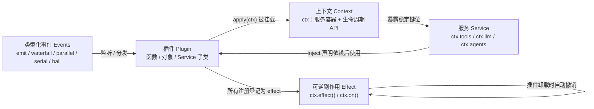
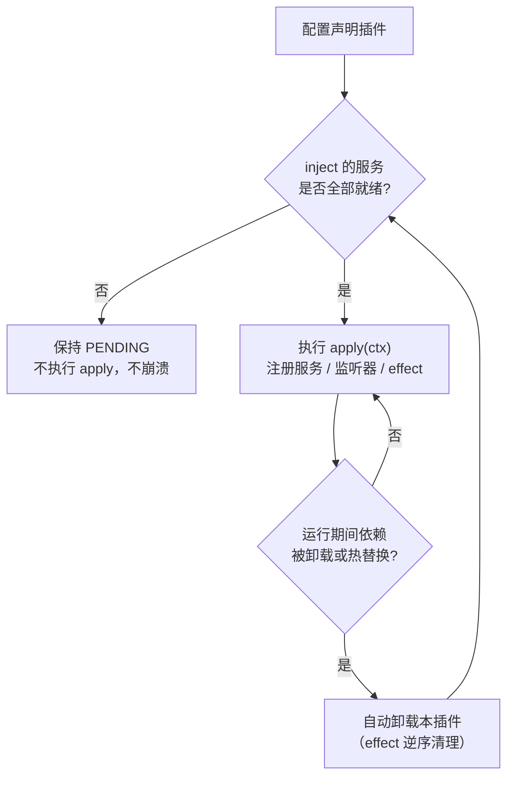
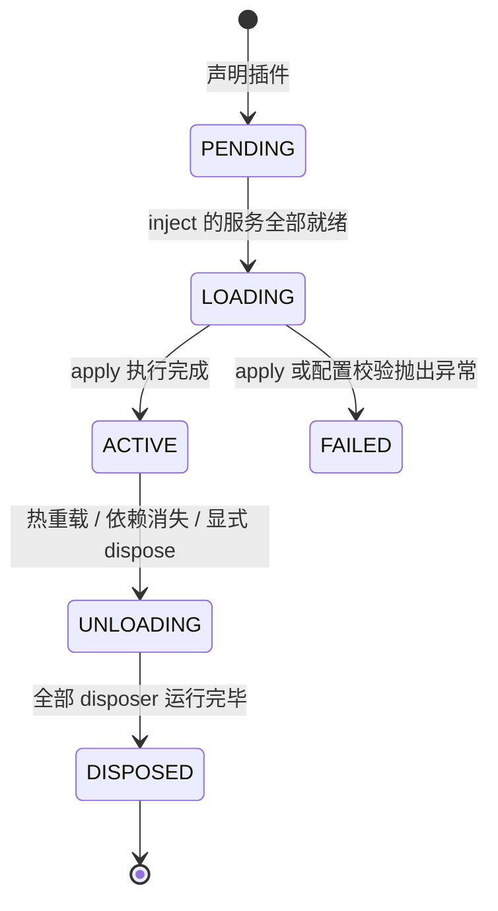

Cordis 是 DeepSeek Harness 底层以 vendor 方式引入的插件框架：它是一个小型运行时，其中每项能力——包括工具、LLM 适配器、文件访问乃至 agent loop（智能体循环）本身——都是挂载到共享上下文中的插件。本页面向初学者，从概念层面解释 Cordis 的五个核心概念，帮你建立阅读后续架构文档所需的心智模型。动手实践请跟随实战教程页，框架级 API 细节请参考 API 参考页。

Sources: [index.zh.md](docs/cordis-tutorial/index.zh.md#L5), [cordis-primer.zh.md](docs/cordis-primer.zh.md#L5)

## 为什么需要 Cordis：一切皆插件

传统应用的扩展方式往往是在代码里预留钩子或编写配置开关，扩展点越多，核心代码越臃肿。Cordis 反其道而行：框架本身几乎不包含任何具体功能，所有能力都由**插件**提供，运行时只负责一件事——把插件挂载到上下文、管理它们的依赖与生命周期。在 harness 中，`ctx.tools`（工具注册表）、`ctx.llm`（模型适配）、`ctx.agents`（实时智能体协调）这些你会在子系统文档中反复见到的键位，全都是某个插件注册的服务。

这种"一切皆插件"的设计带来两个直接收益：**可替换**（同一个服务键位可以由不同实现提供，例如本地 shell 或沙箱 shell）和**可撤销**（插件卸载时，它贡献的一切都会被自动清理）。理解这两个性质，是理解后文服务注入与副作用机制的钥匙。

Sources: [index.zh.md](docs/cordis-tutorial/index.zh.md#L5), [cordis-primer.zh.md](docs/cordis-primer.zh.md#L10-L13)

五个概念的关系可以用一张图概括：插件是行为单元，上下文是它运行的服务容器，服务是插件间共享能力的通道，事件是插件间的广播通信，而副作用机制保证以上一切注册都可逆。



阅读上图的前提：`ctx` 是每个插件启动时收到的一个对象，后面几节会逐一展开图中每条边的含义。

Sources: [cordis-primer.zh.md](docs/cordis-primer.zh.md#L7-L13)

## 五个核心概念总览

Cordis 官方入门文档将框架浓缩为五条互相咬合的规则，先总览再逐节展开：

| `#` | 概念 | 一句话定义 | 涉及的关键 API |
|---|---|---|---|
| 1 | 插件 | 实现 Service 的对象，由 Cordis 挂载到当前上下文 | `apply(ctx)` / `Service` 子类 |
| 2 | 上下文 | 服务的容器，每个服务占据稳定的 `ctx.<key>` 键位 | `ctx.tools`、`ctx.llm` |
| 3 | 服务注入 | 通过 `inject` 声明依赖，服务就绪后插件才启动 | `inject: ['tools']` |
| 4 | 类型化事件 | 声明合并注册事件名，按五种模式分发 | `ctx.emit` / `ctx.waterfall` / `ctx.on` |
| 5 | 可逆副作用 | 所有注册通过 effect 安装，reload 与 teardown 时自动撤销 | `ctx.effect()`、`ctx.on()` |

注意第 3 条与第 5 条的因果配合：`inject` 决定插件**何时启动**，effect 决定插件**如何干净退出**。二者共同支撑了热重载与服务热替换等 harness 的高级能力。

Sources: [cordis-primer.zh.md](docs/cordis-primer.zh.md#L7-L13)

## 插件：三种形态，一个约定

最小可行的插件只有一个 `apply` 函数：

```ts
import type { Context } from '@deepseek-ai/cordis'

export const name = 'hello'

export function apply(ctx: Context) {
  console.log('hello from my first plugin')
}
```

Cordis 加载模块时会用**上下文**调用 `apply`，插件通过这个 `ctx` 对象注册自己贡献的所有内容。`name` 导出项是可选的显示元数据，仅用于诊断信息。函数形态之外，Cordis 还接受对象形态（带 `apply` 方法的对象）和类形态（`Service` 子类）：

| 形态 | 定义方式 | 适用场景 |
|---|---|---|
| 函数插件 | `export function apply(ctx) {}` | 最常见；只需执行副作用，不对外暴露服务 |
| 对象插件 | `export const p = { name, apply(ctx) {} }` | 需要携带名称等元数据的匿名组合单元 |
| 类插件 | `class MyService extends Service` | 需要**对外提供服务**（占据 `ctx.<key>` 键位）时 |

`apply` 抛出异常会让加载明确失败、进程终止，而不是静默跳过——这是刻意设计，插件错误应当在开发期就暴露。源码层面，三种形态由 `Plugin.Function`、`Plugin.Constructor`、`Plugin.Object` 三个类型定义，它们共享同一个 `Base` 元数据接口（`name`、`Config`、`inject`、`provide`）。

Sources: [01-first-plugin.zh.md](docs/cordis-tutorial/01-first-plugin.zh.md#L11-L21), [01-first-plugin.zh.md](docs/cordis-tutorial/01-first-plugin.zh.md#L55-L77), [01-first-plugin.zh.md](docs/cordis-tutorial/01-first-plugin.zh.md#L83-L91), [registry.ts](vendor/cordis/src/registry.ts#L92-L146)

## 上下文：服务的容器与插件的作用域

**上下文是服务的容器**。一个服务占据一个稳定的 `ctx.<key>` 键位，其他插件通过 key 查找服务，而非导入具体实现——消费方只认识 `'tools'` 这个名字，不关心背后是哪家提供方。源码中的 `Context` 是一个代理对象：普通属性读取会经过服务解析器，而 `extend()`、`isolate()`、`intercept()` 三个方法可以创建有作用域的子上下文，且不修改父上下文。

根上下文在构造时安装了四个内置服务：`ctx.events`（事件总线，其方法被混入每个 `ctx`）、`ctx.logger`（日志）、`ctx.reflect`（服务解析的底层反射层）、`ctx.registry`（插件注册表）。每当你看到 `ctx.on()`、`ctx.plugin()`、`ctx.emit()` 这类方法，它们实际上都是内置服务方法被混入上下文后的快捷方式。

| 上下文操作 | 行为 | 典型用途 |
|---|---|---|
| `ctx.extend(meta)` | 创建原型继承的子上下文，父不受影响 | 给子树附加元数据 |
| `ctx.isolate(name)` | 让某个服务名在子树下解析到独立作用域 | 并存多个同名服务实现 |
| `ctx.intercept(name, config)` | 为子树下启动的插件合并服务专属配置 | 按子树定制服务行为 |

初学阶段只需记住一点：`ctx` 既是你注册贡献的入口，也是你消费他人能力的入口。

Sources: [context.ts](vendor/cordis/src/context.ts#L35-L33), [context.ts](vendor/cordis/src/context.ts#L42), [context.ts](vendor/cordis/src/context.ts#L99-L146), [context.zh.md](docs/cordis-api/context.zh.md#L10-L12)

## 服务注入：用 inject 声明依赖

**服务**是一个插件提供、其他插件通过 `ctx` 消费的具名能力。提供服务需要两部分配合，以教程中的 greeter 服务为例：

```ts
import { Service, type Context } from '@deepseek-ai/cordis'

declare module '@deepseek-ai/cordis' {
  interface Context {
    greeter: GreeterService
  }
}

export class GreeterService extends Service {
  constructor(ctx: Context) {
    super(ctx, 'greeter')
  }

  greet(who: string) {
    return `Hello, ${who}!`
  }
}
```

**运行时**部分：`super(ctx, 'greeter')` 内部调用 `ctx.reflect.provide(name, this)`，以名称 `greeter` 注册实例，并把它与当前插件的生命周期绑定——提供方卸载时服务自动移除。**编译时**部分：`declare module` 块利用 TypeScript 声明合并把 `greeter` 加入 `Context` 接口，让 `ctx.greeter` 通过类型检查；它不生成任何代码，没有它服务在运行时照样工作，只是失去类型安全。

Sources: [03-services.zh.md](docs/cordis-tutorial/03-services.zh.md#L5-L5), [03-services.zh.md](docs/cordis-tutorial/03-services.zh.md#L11-L42), [service.ts](vendor/cordis/src/service.ts#L42-L59)

消费服务只需在插件上导出一个 `inject` 数组：

```ts
export const inject = ['greeter']

export function apply(ctx: Context) {
  console.log(ctx.greeter.greet('world'))
}
```

`inject` 的语义是：Cordis 让插件保持 PENDING 状态，直到列出的每项服务都存在，因此在 `apply` 内可以保证 `ctx.greeter` 已就绪。这带来两个重要性质：其一，配置文件中的加载顺序无关紧要，**决定插件何时启动的是依赖关系，而不是文件顺序**；其二，依赖是持续跟踪的——如果运行期间所需服务消失（提供方被卸载或热替换），每个依赖插件也会随之卸载，并在服务恢复后再次加载。这正是 harness 能在配置中整体替换某个服务实现（例如换一个 `shell` 提供方）而所有消费方自动重启的原理。



对于**可有可无**的依赖，不要写进 `inject`，改在使用处用 `ctx.get('greeter')` 探测——返回 `undefined` 表示无提供方，插件照常运行：

| 依赖策略 | 写法 | 行为 |
|---|---|---|
| 硬依赖 | `export const inject = ['tools']` | 服务缺失则插件保持 PENDING 不启动；服务消失则自动卸载 |
| 软依赖（探测） | `ctx.get('tools')` | 缺失时得到 `undefined`，插件仍正常运行，需自行判空 |

Sources: [03-services.zh.md](docs/cordis-tutorial/03-services.zh.md#L48-L59), [03-services.zh.md](docs/cordis-tutorial/03-services.zh.md#L61-L78), [03-services.zh.md](docs/cordis-tutorial/03-services.zh.md#L82-L90)

## 类型化事件：五种分发模式

服务支持直接调用；**事件**让插件无需知道有哪些插件正在监听，就能发出通知。事件的类型化同样依赖声明合并：插件在自己的文件里合并 `interface Events`，声明事件名和监听器签名，之后 `ctx.emit` 与 `ctx.on` 就都拥有完整类型：

```ts
declare module '@deepseek-ai/cordis' {
  interface Events {
    'stats/report'(name: string, count: number): void
  }
}

// 发出
this.ctx.emit('stats/report', name, next)
// 监听
ctx.on('stats/report', (name, count) => { ... })
```

事件名遵循 `namespace/action` 命名约定，让扁平命名空间保持易读。分发事件有五种模式，**每个事件采用哪种模式是其公开约定的一部分**，且只能通过对应方法分发：

| 模式 | 调用方式 | 是否 await | 监听器运行方式 | 返回值 |
|---|---|---|---|---|
| `emit` | `ctx.emit(name, ...args)` | 否 | 按注册顺序同步观察 | 无 |
| `waterfall` | `ctx.waterfall(name, ...args, next)` | 否 | 按注册顺序层层包装 | 有 |
| `parallel` | `await ctx.parallel(name, ...args)` | 是 | 所有监听器并行扇出 | 无 |
| `serial` | `await ctx.serial(name, ...args)` | 是 | 按序执行，首个有效返回值胜出即停止 | 有 |
| `bail` | `ctx.bail(name, ...args)` | 否 | `serial` 的同步版本，停在首个 bail 值 | 有 |

"有效返回值"由 `isBailed` 判定：`null`、`false`、`undefined` 都不算 bail，其余任何值都会中断后续监听器。每种模式各司其职：通知类场景用 `emit`，并发收尾用 `parallel`，抢占式决策用 `serial`/`bail`，而需要**拦截或包装**的场景交给 `waterfall`。

waterfall（瀑布式事件）是环绕中间件：每个监听器收到参数和一个 `next()`，调用 `next()` 会执行下游监听器并把下游返回值交回当前层包装；不调用 `next()` 直接返回则短路整个链条。harness 用 waterfall 处理协作插件可以包装或回答的决策——例如 `agent/request` 允许插件替换模型调用配置，`approval/request` 允许策略代替用户作答。由此衍生一条常设纪律：**只负责观察或标注的 waterfall 监听器必须调用 `next()`**，不调用就直接返回代表有意短路。分发模式的完整语义（包括短路细节与协作式中间件协议）见分发模式专页。

Sources: [04-events.zh.md](docs/cordis-tutorial/04-events.zh.md#L14-L44), [04-events.zh.md](docs/cordis-tutorial/04-events.zh.md#L82-L92), [04-events.zh.md](docs/cordis-tutorial/04-events.zh.md#L96-L140), [events.ts](vendor/cordis/src/events.ts#L13-L15), [events.ts](vendor/cordis/src/events.ts#L32), [cordis-primer.zh.md](docs/cordis-primer.zh.md#L21-L39)

## 可逆副作用：effect 与 fiber 生命周期

Cordis 插件可能因修改配置、热重载、显式释放或所需服务消失而卸载。框架保证的核心承诺是：**通过 Cordis API 建立的所有注册都是可逆副作用**，会在所属插件卸载时按预期撤销。对于 Cordis 尚未管理的资源——定时器、连接、文件 watcher——应将获取逻辑包装在 `ctx.effect()` 中，并返回一个 disposer（资源释放函数）：

```ts
function heartbeat(ctx: Context) {
  ctx.effect(() => {
    const timer = setInterval(() => console.log('tick'), 200)
    return () => {
      clearInterval(timer)
      console.log('heartbeat cleaned up')
    }
  })
}
```

effect 主体在加载期间运行，返回的 disposer 在卸载期间运行。只要资源的生命周期与插件一致，你永远不需要手动调用 disposer——插件卸载时 Cordis 会替你执行。底层实现上，每个已加载插件实例对应一个 **fiber**（插件运行时实例），disposer 按注册顺序的**逆序**启动；多个异步 disposer 会并发运行，因此有严格顺序要求的清理步骤应放进同一个 disposer 内依次等待。

Sources: [02-lifecycle-and-effects.zh.md](docs/cordis-tutorial/02-lifecycle-and-effects.zh.md#L5-L5), [02-lifecycle-and-effects.zh.md](docs/cordis-tutorial/02-lifecycle-and-effects.zh.md#L18-L43), [02-lifecycle-and-effects.zh.md](docs/cordis-tutorial/02-lifecycle-and-effects.zh.md#L64-L66), [02-lifecycle-and-effects.zh.md](docs/cordis-tutorial/02-lifecycle-and-effects.zh.md#L94-L94), [fiber.ts](vendor/cordis/src/fiber.ts#L68-L74), [fiber.ts](vendor/cordis/src/fiber.ts#L402-L418)

fiber 在一组明确定义的状态间转换，状态机是理解"插件为什么没启动/为什么被卸载"的诊断工具：



各状态含义：**PENDING** 表示已声明但所需服务尚不可用（这是"为什么我的插件没有输出"最常见的原因）；**LOADING/ACTIVE** 表示 `apply` 正在运行/已经完成；**FAILED** 表示 `apply` 或配置校验抛出异常；**UNLOADING/DISPOSED** 表示 disposer 正在运行/一切均已拆除。

好消息是初学者很少需要亲手编写 `ctx.effect()`，因为内置注册 API 本身就已是 effect：

| 内置注册 | 撤销行为 |
|---|---|
| `ctx.on(event, listener)` | 监听器随插件卸载自动移除，无需手动 `removeListener` |
| `ctx.plugin(child)` | 子插件随父插件一同递归 dispose |
| 服务注册（`super(ctx, name)`） | 提供方卸载时自动移除该服务 |
| harness 注册表（如 `ctx.tools.register`） | 返回的 disposer 附着到调用插件上，自动撤销 |

Sources: [02-lifecycle-and-effects.zh.md](docs/cordis-tutorial/02-lifecycle-and-effects.zh.md#L70-L82), [02-lifecycle-and-effects.zh.md](docs/cordis-tutorial/02-lifecycle-and-effects.zh.md#L86-L92), [fiber.ts](vendor/cordis/src/fiber.ts#L139-L154), [04-events.zh.md](docs/cordis-tutorial/04-events.zh.md#L78-L78)

## 把概念映射到 harness：实践规则

掌握了五个概念后，harness 的官方实践规则可以归纳为两条。**第一，将行为封装到正确的服务域**：工具流水线相关逻辑属于 `ctx.tools`，模型流式输出属于 `ctx.llm`，实时智能体协调属于 `ctx.agents`——harness 注册的每个服务名都记录在子系统页面的 `cordis-surface` 生成区块中。**第二，区分两种扩展通道的适用场景**：拦截和策略优先使用事件（尤其是 waterfall），直接的能力调用优先使用服务方法。

另一个入门期值得养成的习惯：每个注册都应有对应的 disposer——要么从 `ctx.effect()` 返回一个，要么使用 Cordis 提供的辅助方法自动处理；如果 teardown 顺序有要求，把相关工作放在同一个 effect 中以确保按预期顺序释放。

Sources: [cordis-primer.zh.md](docs/cordis-primer.zh.md#L47-L52), [03-services.zh.md](docs/cordis-tutorial/03-services.zh.md#L94-L94), [04-events.zh.md](docs/cordis-tutorial/04-events.zh.md#L140-L140)

## 学习路径

建议按以下顺序继续深入，每一步都建立在本页概念之上：

1. **[Cordis 分发模式与瀑布语义：emit/waterfall/parallel/serial/bail 的协作式中间件](6-cordis-fen-fa-mo-shi-yu-pu-bu-yu-yi-emit-waterfall-parallel-serial-bail-de-xie-zuo-shi-zhong-jian-jian)** — 本页分发模式表格的完整展开，重点讲透 waterfall 协作式中间件协议与短路纪律。
2. **[Cordis 实战教程（七讲）：从第一个插件到生命周期、服务、事件、配置与 HMR](7-cordis-shi-zhan-jiao-cheng-qi-jiang-cong-di-ge-cha-jian-dao-sheng-ming-zhou-qi-fu-wu-shi-jian-pei-zhi-yu-hmr)** — 在可运行的最小环境中逐章动手验证本页全部概念，并进入配置、组合与热重载。
3. **[Cordis API 参考：Context、Service、Fiber、Event 与 Registry 的框架级细节](8-cordis-api-can-kao-context-service-fiber-event-yu-registry-de-kuang-jia-ji-xi-jie)** — 需要查阅精确签名与边界行为时的框架级参考。
4. **[总体架构：插件树、核心包职责与 ctx 服务键位图](9-zong-ti-jia-gou-cha-jian-shu-he-xin-bao-zhi-ze-yu-ctx-fu-wu-jian-wei-tu)** — 把 Cordis 概念放到 harness 全景中，查看真实插件树与服务键位。
5. **[插件开发实战：服务定义、事件监听与动态 Cordis 配置](25-cha-jian-kai-fa-shi-zhan-fu-wu-ding-yi-shi-jian-jian-ting-yu-dong-tai-cordis-pei-zhi)** — 面向在 harness 中编写真实插件的实战指引。