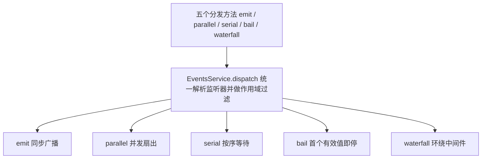
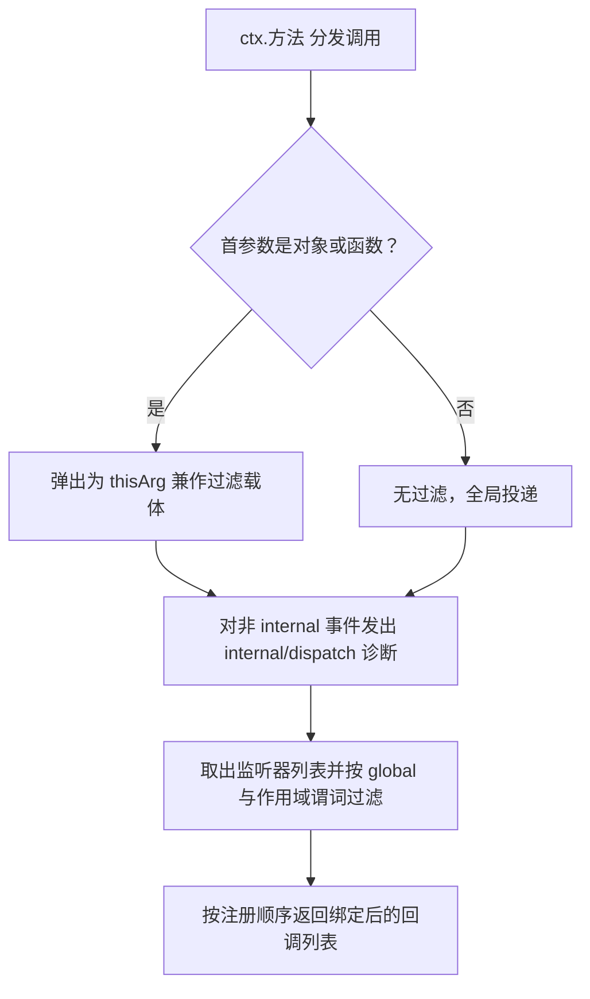
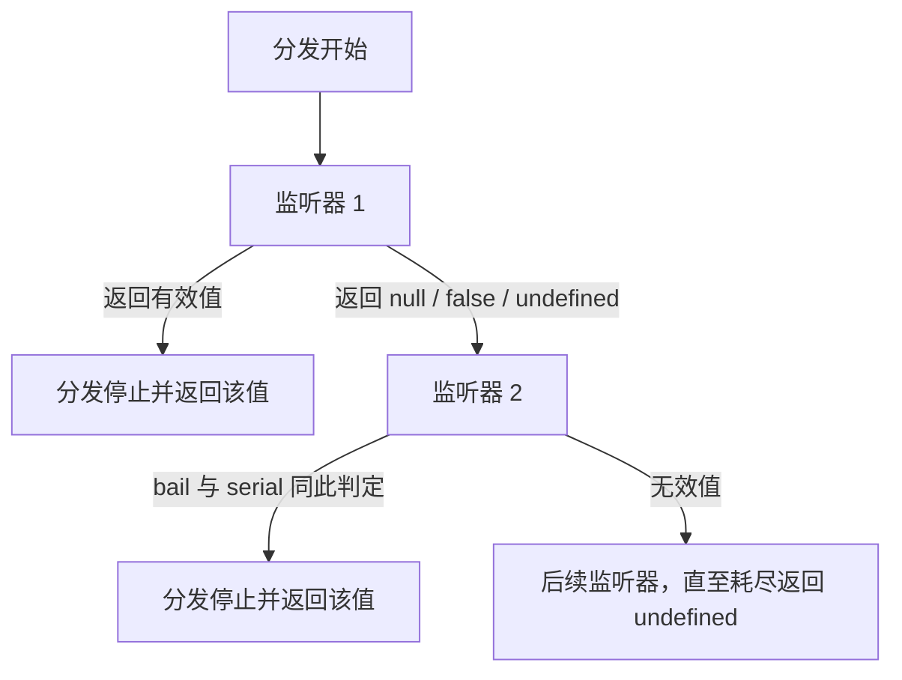
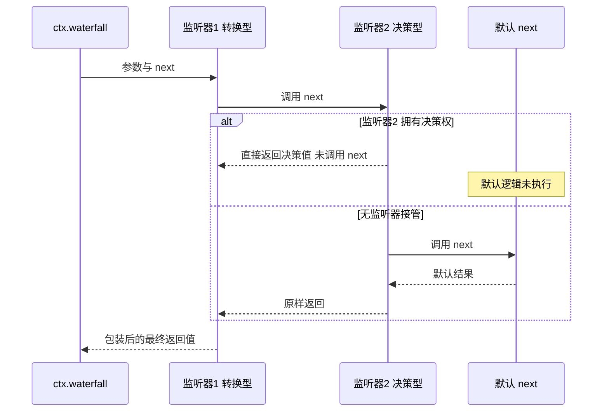
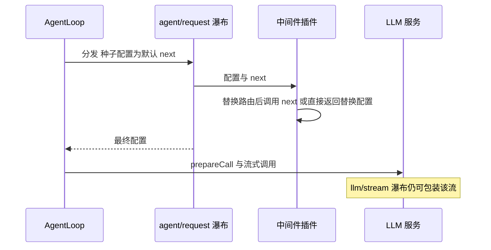
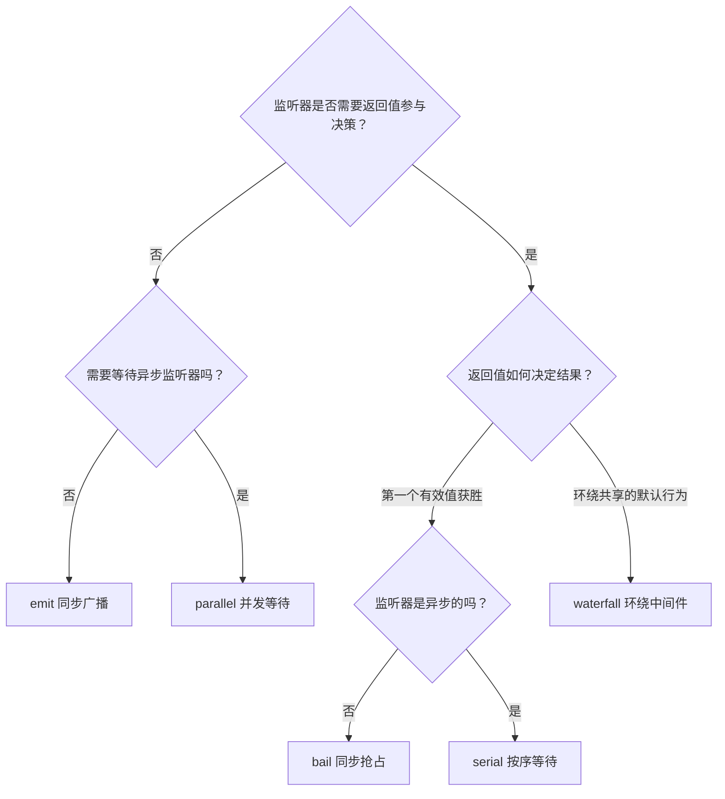

Cordis 是 DeepSeek Harness 以 vendor 方式引入的插件框架，事件系统是插件之间协作的主要通道。本文是面向中级开发者的**解释型**文档：从实现源码出发，逐一拆解 `emit`、`parallel`、`serial`、`bail`、`waterfall` 五种分发模式的语义、共享的分发管线，以及 waterfall 环绕中间件在 harness 中的真实用法。阅读本文前建议先浏览 [Cordis 入门](5-cordis-ru-men-cha-jian-shang-xia-wen-fu-wu-zhu-ru-lei-xing-hua-shi-jian-yu-ke-ni-fu-zuo-yong)；API 级细节请查 [Cordis API 参考](8-cordis-api-can-kao-context-service-fiber-event-yu-registry-de-kuang-jia-ji-xi-jie)。

## 五种分发模式要解决什么问题

传统 EventEmitter 只提供一种“同步广播、无返回值”的语义，但 harness 中插件之间需要四类不同的事件协作：等待异步监听器完成、按返回值做出决策、保证监听器之间的执行顺序，以及让插件环绕（包装或否决）某个默认行为。Cordis 的答案是**把分发策略编码为事件类型的一部分**：每个事件在 `interface Events` 声明合并中确定一种 `DispatchMode`，此后只能通过与之匹配的方法分发。

```ts
type DispatchMode = 'emit' | 'parallel' | 'serial' | 'bail' | 'waterfall'
```

这一约定由 `EventsService`（安装为 `ctx.events` 并混入每个上下文）实现：五个分发方法共享同一条监听器解析管线，只在"是否等待、按什么顺序、如何对待返回值"上分叉。



五种模式的对外约定如下表（"是否 await"指分发方法自身是否异步等待监听器）：

| 模式 | 是否 await？ | 监听器顺序 | 返回值 | 典型用途 |
|---|---|---|---|---|
| `emit` | 否 | 按注册顺序 | 无 | 通知、观察 |
| `waterfall` | 否（返回值通常是 Promise） | 按注册顺序，外层在前 | 最外层监听器的返回值 | 拦截、转换、否决 |
| `parallel` | 是 | 并发 | 无（`Promise<void>`） | 等所有观察者完成 |
| `serial` | 是 | 按注册顺序 | 第一个 bail 值 | 有序的异步接管 |
| `bail` | 否 | 按注册顺序，遇 bail 停 | 第一个 bail 值 | 同步抢占、认领 |

分发模式是事件公开约定的一部分，harness 新事件通过 `@mode` 标签记录模式，供生成的目录交叉校验声明与分发调用点。

Sources: [events.ts](vendor/cordis/src/events.ts#L24-L32) [events.ts](vendor/cordis/src/events.ts#L131-L156) [cordis-primer.zh.md](docs/cordis-primer.zh.md#L19-L29)

## 公共管线：监听器解析与作用域过滤

五个方法的第一步都是 `EventsService.dispatch(type, args)`。它完成三件事：其一，从参数头部提取可选的 `thisArg`（对象或函数时弹出）——harness 用它携带**作用域载体**，让事件只投递给相关 agent 或 session 的监听器；其二，对非 `internal/` 事件分发 `internal/dispatch` 诊断事件；其三，取出该事件名的 `Hook` 列表，用 `hook.global || !filter || filter.call(thisArg, hook.ctx)` 做上下文过滤，最后把每个回调绑定到分发 `this` 上按注册顺序返回。

监听器的注册端也有统一约定。`ctx.on()` 会先 `assertActive()` 确认当前 fiber 存活，再把监听器作为 **effect** 存入 `fiber.effect(...)`——监听器随插件卸载自动注销，调用方永远不会手动 `removeListener`。`EventOptions` 提供两个开关：`prepend: true` 把监听器插到队首（仅当必须先于普通注册运行时使用），`global: true` 让监听器无视上下文过滤。`ctx.once()` 只是在 `on()` 外包了一层“调用后自注销”。



另外值得注意：`internal/listener` 是一个 `bail` 型内部事件，监听器返回非空值即可**替换整个注册过程**——框架自身就利用它为 `internal/update` 事件开辟了按 fiber 存储的快速路径。

Sources: [events.ts](vendor/cordis/src/events.ts#L158-L175) [events.ts](vendor/cordis/src/events.ts#L111-L123) [events.ts](vendor/cordis/src/events.ts#L245-L260) [events.ts](vendor/cordis/src/events.ts#L277-L302) [events.ts](vendor/cordis/src/events.ts#L348-L352)

## 观察类：emit 与 parallel

`emit` 是最接近传统事件总线的模式：同步调用所有监听器，忽略返回值，不等待任何 Promise。实现只有一行 `.map(cb => cb(...args))`——这带来一个必须理解的实现语义：**某个监听器同步抛错会中断 `map`，排在它后面的监听器收不到事件**；监听器返回的 Promise 也无人观察。当事件涉及多个不可信插件时，harness 的做法不是修改 Cordis，而是在生产方容器化：agent 通知分发器自行取出过滤后的回调列表，逐个 `try/catch` 并把 Promise 拒绝降级为日志告警。

`parallel` 与 `emit` 使用同一种监听器解析，但用 `Promise.allSettled` 并发等待全部监听器；任一失败则聚合抛出 `AggregateError`。它适合"所有观察者都必须完成，但没有谁拥有决策权"的场景——典型如 `session/flush`：会话缓冲事件落盘前的持久化检查点，每个监听器（各持久化后端）并发执行，调用方等待全部完成，且没有 waterfall 否决语义。一个实现细节：`parallel` 在 `internal/dispatch` 上报告的类型标签也是 `'emit'`，诊断消费方不应依赖模式标签区分这两者。

| | emit | parallel |
|---|---|---|
| 等待异步监听器 | 否 | 是（`allSettled`） |
| 监听器返回值 | 丢弃 | 丢弃 |
| 错误传播 | 同步抛错中断后续监听器 | 聚合为 `AggregateError` |
| harness 案例 | `tools/result`、`session/event`、`agent/status` | `session/flush` |

Sources: [events.ts](vendor/cordis/src/events.ts#L183-L196) [dispatch.ts](packages/core/agent/src/dispatch.ts#L118-L135) [index.ts](packages/core/session/src/index.ts#L76-L85)

## 抢占类：bail 与 serial

`bail` 与 `serial` 是"第一个有效返回值获胜"的模式，判定标准由 `isBailed` 定义：**返回值不是 `null`、`false`、`undefined` 三者之一即为 bail**。这意味着 `0`、`''`、甚至一个 Promise 实例都会被判定为有效 bail 值——这也是 `bail` 与 `serial` 分野的根源：`bail` 完全同步，异步监听器返回的 Promise 会被当成"已接管"直接返回；而 `serial` 在每个监听器上 `await`，只有最终兑现值通过 `isBailed` 判定才停止分发。**事件涉及异步监听器时必须声明为 serial**，否则应保持监听器纯同步。

harness 中两类典型用户恰好对应两种变体。客户端输入系统用 `bail` 实现"认领"：四个 `slash/input-*` 事件（开始命令、插入引用、消费 token、插入文本）的监听器是各输入源，返回 `true | undefined`，第一个认领的输入源赢下 token，控制器用 `=== true` 判定是否被消费。agent 注册表则用 `serial` 实现有序的创建广播：`agent/created` 的监听器按注册顺序等待，AgentLoop 会挂起队列输入直到全部监听器完成，任一监听器抛错则创建失败并跳过后续监听器。



| | bail | serial |
|---|---|---|
| 是否 await 监听器 | 否 | 是 |
| 停止条件 | 同步返回值通过 `isBailed` | 兑现值通过 `isBailed` |
| 异步监听器 | 不适用（Promise 会被当作 bail 值） | 适用 |
| harness 案例 | `slash/input-*` 认领 | `agent/created`、`agent/turn-stopping` |

Sources: [events.ts](vendor/cordis/src/events.ts#L7-L15) [events.ts](vendor/cordis/src/events.ts#L198-L222) [input.ts](packages/client/ui-conversation/src/client/contract/input.ts#L134-L158) [controller.ts](packages/client/ui-input-trigger/src/client/controller.ts#L461-L475) [index.ts](packages/core/agent/src/index.ts#L535-L557) [runtime-types.ts](packages/core/agent/src/runtime-types.ts#L240-L261)

## waterfall：环绕中间件与瀑布语义

waterfall 是五种模式中唯一支持**拦截默认行为**的，实现却极其紧凑：

```ts
waterfall(...args: any[]) {
  const cbs = this.dispatch('waterfall', args)
  const inner = args.pop()
  const next = () => {
    const cb = cbs.shift() ?? inner
    return cb(...args)
  }
  args.push(next)
  return next()
}
```

分发时最后一个参数被弹出，作为**最内层的默认 `next`**（内置行为）；一个闭包 `next` 每次被调用就从监听器队列 `shift` 出下一个监听器，队列耗尽后回落到默认行为。于是按注册顺序，先注册的监听器位于**洋葱的最外层**：每个监听器收到 `(...args, next)`，调用 `next()` 即执行下游；下游的返回值沿洋葱**回卷**，外层可以包装、替换后再向外返回；不调用 `next()` 直接返回则**否决**整条剩余链，包括最内层默认逻辑。两个衍生语义需要注意：`next()` 不是幂等的，重复调用会把控制权交给再下一个监听器而非重放同一个；水瀑布分发方法本身是同步的，异步性完全由监听器返回的 Promise 承载。

这套语义对应两条监听器纪律。**转换型**监听器在 `await next()` 之后包装结果；**观察/标注型**监听器必须无条件调用 `next()`——忘记调用不会报错，只会悄无声息地吞掉所有下游默认行为。而对"单决策"事件，短路恰是设计意图：拥有决策权的策略监听器可以不调用 `next()` 直接作答。教程中的 `demo/transform` 示例完整演示了这两条路径：包装监听器把下游结果转大写，拦截监听器看到 `blocked` 后直接返回替换文本，默认逻辑从未运行。



框架自身也用这套原语构造内部机制：`EventsService` 构造函数中手工搭建了 `internal/update` 的递归瀑布——每次递归重新读取当前监听器列表，队列耗尽后才落到分发时传入的默认 `next`，并以 `{ global: true, prepend: true }` 注册，保证配置更新拦截始终最先执行。

Sources: [events.ts](vendor/cordis/src/events.ts#L224-L243) [cordis-primer.zh.md](docs/cordis-primer.zh.md#L33-L39) [04-events.zh.md](docs/cordis-tutorial/04-events.zh.md#L94-L127) [04-events.zh.md](docs/cordis-tutorial/04-events.zh.md#L136-L140) [events.ts](vendor/cordis/src/events.ts#L140-L156)

## harness 中的 waterfall 案例

harness 把"多个协作插件环绕同一默认行为"的关键决策全部建模为 waterfall。按"默认 `next` 是什么、否决意味着什么、失败如何收场"三个维度比较代表性事件：

| 事件 | 默认 `next` | 监听器接管方式 | 失败收场 |
|---|---|---|---|
| `agent/request` | 返回冻结的种子配置（agent 选项或持久化头） | 返回替换后的 `LlmCallConfig` | 解析后校验 provider/model 非空，缺失则抛错 |
| `approval/request` | 返回 `'unavailable'` | 策略直接作答 `approved`/`rejected` 等 | 非法答案或抛错一律归一为 `'unavailable'`（fail-closed） |
| `tools/pre-execute` | 返回 `{ kind: 'allow' }` | 返回 `allow`/`deny`/`cancel`/`ask` | 监听器抛错由注册表捕获并转为错误结果 |
| `llm/stream` | 解析适配器并返回分块流 | 返回自己的 `AsyncIterable<StreamChunk>` 短路 | 适配器失败转为终止 chunk，中间件失败照常抛出 |
| `system-prompt/assemble` | 原样返回程序集 | 转换 sections/tools/variables | 返回值即权威结果 |

三个案例值得展开。**`agent/request`** 是模型调用配置的替换点：AgentLoop 先把 agent 选项（或持久化头派生）深冻结为种子配置，再以它为默认 `next` 分发瀑布——插件可整体替换路由（provider/model/reasoningEffort/maxTokens），但无法经此改动消息内容；未注册路由可由中间件代答，终端分发仍要求真实适配器。**`approval/request`** 展示了防御性收场：默认 `next` 返回 `'unavailable'`，答案白名单之外的返回值与抛错的作答者都被归一为 `'unavailable'`，且分发与请求取消信号竞速；`never` 策略在分发前就地拒绝，避免监听器注册顺序影响确定性。**`llm/stream`** 展示 waterfall 包装的可以不只是值——监听器拿到的是 `AsyncIterable<StreamChunk>` 工厂，重试、重放、路由类中间件可以整体替换流，也可以逐 chunk 转发。



Sources: [agent.ts](packages/core/agent-loop/src/agent.ts#L559-L566) [runtime-types.ts](packages/core/agent/src/runtime-types.ts#L322-L337) [index.ts](packages/interaction/user-approval/src/index.ts#L267-L290) [index.ts](packages/core/tools/src/index.ts#L136-L210) [index.ts](packages/core/tools/src/index.ts#L1505-L1508) [index.ts](packages/llm/llm/src/index.ts#L62-L76) [index.ts](packages/llm/llm/src/index.ts#L1143-L1148) [index.ts](packages/core/system-prompt/src/index.ts#L20-L30) [index.ts](packages/core/system-prompt/src/index.ts#L625-L632)

## 契约保障：@mode 标签与作用域分发

分发模式不是口头约定。事件声明处的 JSDoc 里写 `@mode waterfall` 这样的标签，文档目录的英文源文件由 `scripts/gen-cordis-catalog.ts` 生成，使每个事件的模式进入 [Cordis API 参考](8-cordis-api-can-kao-context-service-fiber-event-yu-registry-de-kuang-jia-ji-xi-jie)与各子系统页面，从而可以对"声明的模式"与"实际的分发调用点"做交叉校验。

作用域过滤同样有生成物的护持。带作用域的事件在负载中携带路由主体（如 `payload.agent`），`scopeTarget(base, key)` 构造的不透明载体作为分发 `this`，把基上下文的 `Context.filter` 与作用域谓词组合：无标签监听器放行，带标签监听器仅接收该键及其后代的事件，`{ global: true }` 则绕过筛选。哪些事件参与这套过滤由 `scoped-events.generated.ts` 的解析器表固化——每个事件名映射到一个从参数中提取路由键的函数，`null` 表示只能做"载体存在性"检查。对插件作者的实际含义是：监听 `agent/*` 或 `tools/*` 事件时，通过 `agent.ctx`（作用域上下文）注册的监听器只会收到该 agent 的事件，且随作用域释放自动注销。

| 模式 | 代表性 harness 事件 |
|---|---|
| emit | `session/event`、`tools/result`、`agent/status`、`agent/error`、`tools/change` |
| parallel | `session/flush` |
| serial | `agent/created`、`agent/turn-stopping` |
| bail | `slash/input-begin-command` 等 4 个输入认领事件 |
| waterfall | `agent/request`、`agent/pre-step`、`tools/pre-execute`、`tools/execute`、`tools/post-execute`、`llm/stream`、`system-prompt/assemble`、`approval/request`、`user-questions/request` |

Sources: [cordis-primer.zh.md](docs/cordis-primer.zh.md#L29) [events.zh.md](docs/cordis-api/events.zh.md#L1-L2) [scoped-events.generated.ts](packages/core/scope/src/scoped-events.generated.ts#L12-L51) [README.zh.md](packages/core/scope/README.zh.md#L78-L80)

## 选型决策与常见陷阱

为事件选择模式时，依次回答三个问题：监听器是否需要返回值参与决策？是否需要等待异步监听器？多个监听器的返回值如何合成结果？下图把这棵决策树画成一目了然的流程：



最后汇总五条高频陷阱，均对应上文验证过的实现语义：

| 陷阱 | 后果 | 正确做法 |
|---|---|---|
| waterfall 观察/标注监听器忘记调用 `next()` | 静默吞掉所有下游默认行为 | 只有不接管决策的监听器才允许直接返回 |
| 在 `bail` 事件中写异步监听器 | 返回的 Promise 被当作有效 bail 值提前终止 | 改用 `serial`，或保持监听器纯同步 |
| 误以为 `0`、`''` 不算 bail 值 | 意外短路分发 | 需要放行时显式返回 `undefined`/`false`/`null` |
| 依赖 `emit` 监听器的执行完整性 | 同步抛错会中断后续监听器，返回的 Promise 无人观察 | 关键通知用 `parallel`，或在生产方容器化分发 |
| 捕获 `parallel` 错误时按普通 Error 处理 | 丢失并发失败明细 | 按 `AggregateError` 读取 `errors` 列表 |

Sources: [events.ts](vendor/cordis/src/events.ts#L7-L15) [events.ts](vendor/cordis/src/events.ts#L183-L187) [04-events.zh.md](docs/cordis-tutorial/04-events.zh.md#L136-L140)

## 延伸阅读

本文覆盖了分发语义本身；动手路径与相邻主题请继续：

- 亲手写一个 waterfall 监听器：[Cordis 实战教程（七讲）：从第一个插件到生命周期、服务、事件、配置与 HMR](7-cordis-shi-zhan-jiao-cheng-qi-jiang-cong-di-ge-cha-jian-dao-sheng-ming-zhou-qi-fu-wu-shi-jian-pei-zhi-yu-hmr)，其中第 4 讲与本页互为理论与实践。
- 查询每个事件的签名与模式：[Cordis API 参考：Context、Service、Fiber、Event 与 Registry 的框架级细节](8-cordis-api-can-kao-context-service-fiber-event-yu-registry-de-kuang-jia-ji-xi-jie)。
- `agent/request`、`agent/pre-step` 在轮次机器中的触发时点：[Agent Loop 与轮次生命周期：turn/start 到 turn/end 的步骤流与事件时序](11-agent-loop-yu-lun-ci-sheng-ming-zhou-qi-turn-start-dao-turn-end-de-bu-zou-liu-yu-shi-jian-shi-xu)。
- `tools/pre-execute`/`execute`/`post-execute` 三段瀑布的完整流水线：[工具系统与执行流水线：ToolDefinition、schema DSL 与 pre/execute/post 把关事件](16-gong-ju-xi-tong-yu-zhi-xing-liu-shui-xian-tooldefinition-schema-dsl-yu-pre-execute-post-ba-guan-shi-jian)。
- 会话事件与 `agent/*` 实时事件的选择原则：[事件域与扩展点：会话事件、agent/* 实时事件与能力事件的选择原则](12-shi-jian-yu-yu-kuo-zhan-dian-hui-hua-shi-jian-agent-shi-shi-shi-jian-yu-neng-li-shi-jian-de-xuan-ze-yuan-ze)。