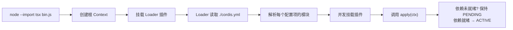
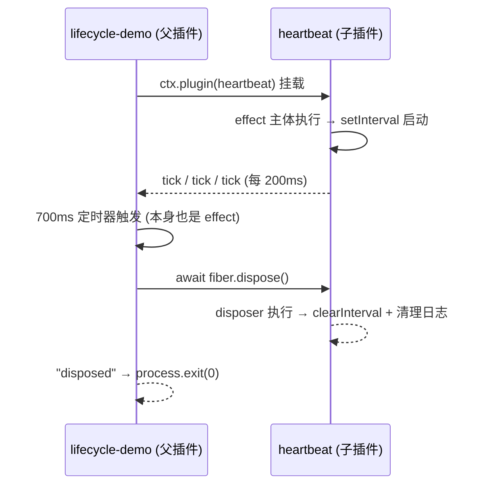
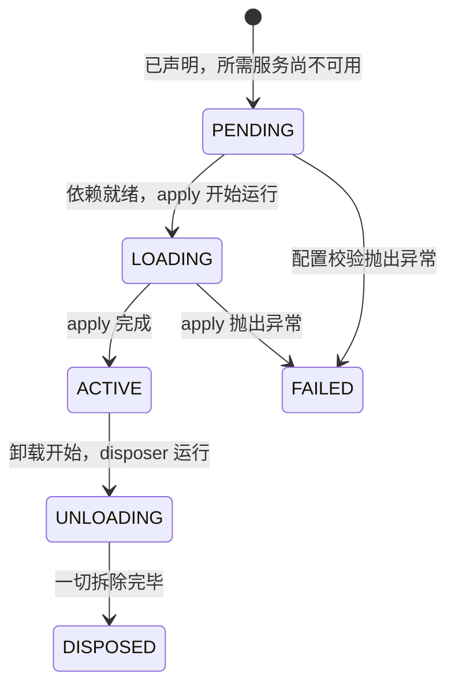
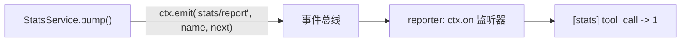
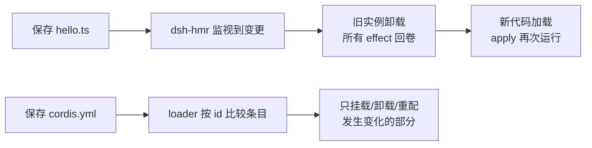

本页是 `docs/cordis-tutorial/` 七讲实战教程的导览与精要重述。Cordis 是 DeepSeek Harness 底层的插件框架——一个把工具、LLM 适配器、文件访问乃至 agent loop 本身都作为插件挂载到共享上下文的小型运行时。这套教程面向 agent 开发者，采用**动手实践**的方式：每一讲都在 `tmp/cordis-tutorial` 目录中编写真实代码、运行并观察输出，全程无需 API 密钥。读完本页，你将掌握从插件定义、可逆副作用、服务注入、类型化事件、schema 配置校验到热模块替换（HMR）的完整插件开发链条。

Sources: [index.zh.md](docs/cordis-tutorial/index.zh.md#L1-L10)

## 定位与前置阅读

在文档体系中，本教程处于概念入门与 API 参考之间：若只需要精简的概念参考而非逐步实践，请先阅读 [Cordis 入门：插件、上下文、服务注入、类型化事件与可逆副作用](5-cordis-ru-men-cha-jian-shang-xia-wen-fu-wu-zhu-ru-lei-xing-hua-shi-jian-yu-ke-ni-fu-zuo-yong)；需要框架级细节时再查 [Cordis API 参考：Context、Service、Fiber、Event 与 Registry 的框架级细节](8-cordis-api-can-kao-context-service-fiber-event-yu-registry-de-kuang-jia-ji-xi-jie)。教程不要求深入掌握 TypeScript——索引页的 "TypeScript 说明" 一节解释了示例中仅有的三项特性：**类型注解**（描述值但不改变运行时行为）、`import type`（只导入类型信息、运行时消失）、以及**声明合并**（`declare module '@deepseek-ai/cordis'` 为已有接口追加条目，不生成任何运行时接线）。

Sources: [index.zh.md](docs/cordis-tutorial/index.zh.md#L48-L63)

## 环境准备与统一启动方式

教程的唯一前置条件是克隆仓库并 `pnpm install`；示例全部写入 `tmp/cordis-tutorial` 临时目录（`tmp/` 已被 git 忽略）。每一讲都从该目录运行同一条命令：

```sh
node --import tsx ../../vendor/cordis/bin.js
```

这个单文件启动器（[vendor/cordis/bin.js](vendor/cordis/bin.js)）只做一件事：创建根 `Context`、挂载 Loader 插件，并让它从当前目录加载 `./cordis.yml`。**其余一切**——有哪些插件、如何配置它们——都来自你编写的 YAML 文件，而非框架启动代码。下面是七讲反复使用的启动流程：



理解这一流程后再进入第一讲，你会发现每一讲的新知识都只是往 `cordis.yml` 与插件文件中追加内容，启动方式从未改变。

Sources: [index.zh.md](docs/cordis-tutorial/index.zh.md#L25-L38)

## 七讲路线图

七讲的编排是一条严格递进的认知阶梯，每一讲都建立在前一讲的结论之上：

| 讲次 | 主题 | 核心 API/机制 | 产出能力 |
|---|---|---|---|
| 1 | 你的第一个插件 | `apply(ctx)` 函数、`cordis.yml` 条目 | 理解插件即函数、配置即组合 |
| 2 | 生命周期与 effect | `ctx.effect()`、`ctx.plugin()`、`fiber.dispose()` | 资源随插件自动回卷 |
| 3 | 服务 | `Service` 子类、`inject`、声明合并 | 通过 `ctx` 共享具名能力 |
| 4 | 事件 | `ctx.on`、emit/parallel/serial/bail/waterfall | 解耦广播与拦截链 |
| 5 | 配置 | `Schema.object`、`.volatile()`、`!!js` 标签 | 带校验的插件选项 |
| 6 | 组合与 HMR | `id`/`disabled`/组/`isolate`、`dsh-hmr`、注册表诊断 | 把 `cordis.yml` 当作应用本身 |
| 7 | 进入 harness | `ctx.tools.register`、`defineTool`、`tools/result` 事件 | 注册模型可调用的真实工具 |

Sources: [index.zh.md](docs/cordis-tutorial/index.zh.md#L40-L46)

## 第一讲：插件是函数

插件的最小形态是一个导出 `apply` 函数的模块。Cordis 加载模块时会用一个**上下文**调用 `apply`，插件通过这个 `ctx` 对象注册自己贡献的一切。`name` 导出项是可选的显示元数据，仅用于诊断标识：

```ts
import type { Context } from '@deepseek-ai/cordis'

export const name = 'hello'

export function apply(ctx: Context) {
  console.log('hello from my first plugin')
}
```

配套的 `cordis.yml` 只有一行 `- name: './hello.ts'`。关键细节是：配置项列表**并发启动**，列表顺序不保证加载先后——真正的顺序由服务依赖（第 3 讲的 `inject`）决定。

Sources: [01-first-plugin.zh.md](docs/cordis-tutorial/01-first-plugin.zh.md#L11-L31)

第一讲还确立了本教程的核心心智模型：**插件描述自己的贡献，`cordis.yml` 组合应用**。真实仓库中的 `dsh` base profile 就是一份更长的插件组合，由部署 overlay 对其修补。除了函数形态，Cordis 还接受另外两种形式：

| 形态 | 定义方式 | 适用场景 |
|---|---|---|
| 函数插件 | `export function apply(ctx) {}` | 默认选择；无服务需求时始终使用 |
| 对象插件 | `{ name, apply(ctx) {} }` | 需要携带额外导出元数据的对象 |
| 类插件 | `class X extends Service` | 需要公开服务时（第 3 讲） |

Sources: [01-first-plugin.zh.md](docs/cordis-tutorial/01-first-plugin.zh.md#L51-L77)

"尝试制造错误"一节值得提前记住两条规则：`apply` 抛出异常会使**进程因该错误而终止**（加载失败明确报错，绝不静默跳过配置项）；但若模块本身**无法解析**（如路径或包名拼写错误），Cordis 只通过 logger 服务报告错误而不崩溃——且启动阶段这条报告可能在 console 导出器开始观察前丢失。

Sources: [01-first-plugin.zh.md](docs/cordis-tutorial/01-first-plugin.zh.md#L79-L91)

## 第二讲：生命周期与 effect

Cordis 插件可能因配置修改、热重载、显式释放或所需服务消失而卸载。核心契约是：**通过 Cordis API 建立的注册属于 effect，会在所属插件卸载时自动撤销**；在此之外管理的资源（定时器、连接、watcher）必须包装进 `ctx.effect()` 并返回 disposer。教程用 `lifecycle.ts` 演示了这一点——心跳插件的 `setInterval` 包装为 effect，外层插件再挂载它为子插件，并在 700ms 后调用 `fiber.dispose()` 主动卸载：



Sources: [02-lifecycle-and-effects.zh.md](docs/cordis-tutorial/02-lifecycle-and-effects.zh.md#L13-L43)

观察输出可以提炼三条不变量：`ctx.plugin(heartbeat)` 与 YAML loader 为每个配置项做的事完全相同（函数插件直接被调用，只有对象形态才要求 `apply` 方法）；effect 主体在**加载期**运行、返回的 disposer 在**卸载期**运行，生命周期与插件一致的资源永远不需要手动调用 disposer；`fiber.dispose()` 会等待全部清理工作（含异步 disposer）完成并**递归卸载所有子插件**。

Sources: [02-lifecycle-and-effects.zh.md](docs/cordis-tutorial/02-lifecycle-and-effects.zh.md#L62-L66)

每个插件实例的状态由 **fiber 状态机**跟踪，这个模型在第 6 讲诊断"永远不加载的插件"时会再次出现：



Sources: [02-lifecycle-and-effects.zh.md](docs/cordis-tutorial/02-lifecycle-and-effects.zh.md#L68-L78)

本讲最后给出一条顺序纪律：disposer 按注册**逆序**启动，但多个**异步** disposer 会**并发**运行——若拆除步骤必须按序执行，应把它们放进同一个 disposer 内依次 await。

Sources: [02-lifecycle-and-effects.zh.md](docs/cordis-tutorial/02-lifecycle-and-effects.zh.md#L80-L96)

## 第三讲：服务与 inject

**服务**是插件提供、其他插件通过 `ctx` 消费的具名能力——harness 中的 `ctx.tools`、`ctx.llm`、`ctx.agents` 都是服务。提供方由两半组成：运行时的 `Service` 子类（`super(ctx, 'greeter')` 以名称注册实例，注册本身是 effect），以及编译时的声明合并（把 `greeter` 加进 `Context` 接口，使 `ctx.greeter` 通过类型检查但不生成任何代码）：

```ts
export class GreeterService extends Service {
  constructor(ctx: Context) {
    super(ctx, 'greeter')
  }
  greet(who: string) {
    return `Hello, ${who}!`
  }
}
```

消费方则通过 `inject` 声明硬依赖：

```ts
export const name = 'consumer'
export const inject = ['greeter']

export function apply(ctx: Context) {
  console.log(ctx.greeter.greet('world'))
}
```

Sources: [03-services.zh.md](docs/cordis-tutorial/03-services.zh.md#L14-L57)

`inject` 的语义是本讲的核心：Cordis 让插件保持 **PENDING** 直到列出的每项服务都存在，因此 `apply` 内可以保证 `ctx.greeter` 就绪。这带来三个可验证的行为——交换 `cordis.yml` 中两行顺序输出不变（启动顺序由依赖决定而非文件顺序）；彻底移除提供方时消费方静默停留在 PENDING，既不崩溃也不运行一部分；PENDING 的 fiber 不会让 Node 事件循环保持活跃。

Sources: [03-services.zh.md](docs/cordis-tutorial/03-services.zh.md#L58-L72)

依赖跟踪并非一次性启动检查：运行期间所需服务消失（提供方被卸载或热替换）时，每个依赖插件也会随之卸载，服务恢复后再次加载。这正是**配置可替换服务**的机制基础——卸载 `dsh-bash-local`、挂载另一个 `shell` 提供方，所有注入 `'shell'` 的插件都会重启并使用新实现。对缺失仍可运行的功能，则跳过 `inject` 改用 `ctx.get('greeter')` 探测（无提供方时返回 `undefined`）。最后注意命名纪律：服务名共用一个**扁平命名空间**，自有服务应加有辨识度的前缀，因为 harness 已占用 `tools`、`llm` 等普通名称。

Sources: [03-services.zh.md](docs/cordis-tutorial/03-services.zh.md#L74-L94)

## 第四讲：事件与五种分发模式

服务支持直接调用，**事件**则让插件无需知道监听者是谁就能发出通知。事件系统与第 3 讲的声明合并相互对应：`interface Events` 声明事件名称与监听器签名，使 `ctx.emit` 与 `ctx.on` 都获得完整类型；`namespace/action` 命名约定（如 `stats/report`）让扁平命名空间保持易读。教程构建了一个计数服务 `stats` 与观察者插件 `reporter`，后者用 `import type {} from './stats.ts'` 引入类型而不产生运行时导入：



因为 `ctx.on()` 属于 effect，监听器随插件一同消失，永远不需要手动维护 `removeListener`。

Sources: [04-events.zh.md](docs/cordis-tutorial/04-events.zh.md#L9-L78)

`emit` 只是五种分发模式之一，事件采用哪种模式是其约定的一部分，决定了监听器能否返回值、能否并发运行、能否彼此短路：

| 模式 | 调用 | 语义 |
|---|---|---|
| emit | `ctx.emit(name, ...args)` | 同步广播；不等待、不收集返回值 |
| parallel | `await ctx.parallel(name, ...args)` | 所有监听器并发运行并一同等待 |
| serial | `await ctx.serial(name, ...args)` | 按序运行；第一个非 `null`/`false`/`undefined` 返回值胜出并停止后续监听器 |
| bail | `ctx.bail(name, ...args)` | serial 的同步版本 |
| waterfall | `ctx.waterfall(name, ...args, next)` | 环绕中间件，可转换或短路 |

每个 harness 事件都在其所属子系统页面的自动生成参考中记录了自己的模式。五种模式的框架级语义在 [Cordis 分发模式与瀑布语义：emit/waterfall/parallel/serial/bail 的协作式中间件](6-cordis-fen-fa-mo-shi-yu-pu-bu-yu-yi-emit-waterfall-parallel-serial-bail-de-xie-zuo-shi-zhong-jian-jian) 中有更深入的展开。

Sources: [04-events.zh.md](docs/cordis-tutorial/04-events.zh.md#L80-L92)

**waterfall 是实现拦截的模式**：每个监听器收到参数和一个 `next()` continuation，可以转换 `next()` 的返回值，也可以不调用 `next()` 直接返回从而短路链条（教程称之为"否决"）。示例中两个监听器串联——监听器 1 包裹下游结果转大写，监听器 2 在输入含 `blocked` 时短路——由此产生本仓库的常设纪律：**只负责观察或标注的 waterfall 监听器必须调用 `next()`**，否则会悄无声息吞掉所有下游默认行为。harness 用 waterfall 处理协作插件可包装或回答的决策：`agent/request` 允许插件替换模型调用配置，`approval/request` 允许策略代替用户作答。

Sources: [04-events.zh.md](docs/cordis-tutorial/04-events.zh.md#L94-L145)

## 第五讲：配置

`cordis.yml` 中的每个条目都可携带 `config` 块，插件声明一个 schema 在 `apply` 之前校验它。**错误配置导致加载失败并给出准确错误——插件绝不会在配置不完整时启动**。教程的模式是导出一个既是 TypeScript 接口又是同名运行时 schema 的 `Config`：消费方获得类型，Cordis 获得验证器（本仓库用 Schemastery 定义，Cordis 本身接受任意 Standard Schema 验证器）：

```ts
export interface Config {
  greeting: string
  targets: string[]
}

export const Config: Schema<Config> = Schema.object({
  greeting: Schema.string().default('Hello'),
  targets: Schema.array(String).default(['world']),
})

export function apply(ctx: Context, config: Config) {
  for (const target of config.targets) {
    console.log(`${config.greeting}, ${target}!`)
  }
}
```

未提供的字段由 schema 默认值补齐，`apply` 始终收到完整且经过验证的配置。

Sources: [05-config.zh.md](docs/cordis-tutorial/05-config.zh.md#L11-L45)

校验失败的行为是本讲第二条主线。传入 `targets: 'not-an-array'` 会得到 `ValidationError: invalid config: - $.targets expected array but got not-an-array (at targets)`，插件 fiber 进入 **FAILED** 状态，启动器打印错误后以状态码 1 退出。合法但引用不可用资源的插件也应在能解析引用时立即拒绝。

Sources: [05-config.zh.md](docs/cordis-tutorial/05-config.zh.md#L57-L68)

两项进阶特性针对热重载场景。**Volatile 字段**用 `.volatile()` 标记每次操作都会读取的字段：字段变化时 loader 只更新稳定引用而不重新挂载插件，代码通过 `.get()` 读取；loader 比较原始配置时忽略 volatile 字段，仅 volatile 变化经 `internal/config` 钩子校验后提交到运行中的引用，并发出一次 `loader/volatile-update` 事件。声明位置有限制——必须在固定对象路径上，数组/字典/union 分支/lazy/transform 内部的独立引用会被拒绝。**`!!js` 标签**则用于加载时计算的值（如 `greeting: !!js process.env.DEMO_GREETING ?? 'Hello'`），仅在 `config` 与条目 `disabled` 字段内有效；`disabled: !!js ...` 在每次挂载决策时求值，可按平台或环境门控一行配置。

Sources: [05-config.zh.md](docs/cordis-tutorial/05-config.zh.md#L70-L107)

## 第六讲：组合与 HMR

到本讲为止构建的每项能力都是插件，`cordis.yml` 就是应用的插件树。条目元数据不止 `name` 和 `config`：`id` 提供稳定标识，使 loader 能区分"修改现有条目"与"先删再加"；`disabled: true` 卸载插件但保留条目，改回后插件及所有因依赖其服务而 PENDING 的插件都会重新加载。**组**可嵌套子列表作为一个单元整体装卸；`isolate` 为组内某服务名提供独立实例——两个组可以各自看到配置不同的 `shell` 提供方。

Sources: [06-composition-and-hmr.zh.md](docs/cordis-tutorial/06-composition-and-hmr.zh.md#L7-L21)

HMR 是前两讲结论的直接应用：卸载会释放 effect（第 2 讲），加载遵循依赖关系（第 3 讲），因此"先卸载再加载"即可替换运行中的插件。`@deepseek-ai/dsh-hmr` 插件监视文件并在保存时执行该流程。教程的 `cordis.yml` 新增了两个辅助插件，它们的存在本身就是一个依赖驱动加载的活教材——HMR 通过 logger 服务记录日志、`inject` `timer` 服务做去抖，缺了 timer 它会永远停在 PENDING 且不发任何提示：



Sources: [06-composition-and-hmr.zh.md](docs/cordis-tutorial/06-composition-and-hmr.zh.md#L23-L59)

依赖驱动加载的另一面是诊断难题：`inject` 指定了无人提供的服务时，插件永远等待且不输出——这不是错误，因为 PENDING 是合法状态，提供方可能稍后才挂载。解决方案是枚举插件注册表检查 fiber 状态：

```ts
for (const runtime of ctx.registry.values()) {
  for (const fiber of runtime.fibers) {
    if (fiber.state === FiberState.PENDING) {
      console.log(`${fiber.name} is PENDING — a required service is missing`)
    }
  }
}
```

教程的 `needs-timer.ts`（`inject: ['timer']` 无提供方）配合 `diagnose.ts` 复现了完整链路：诊断插件输出 `needs-timer is PENDING — a required service is missing`；向列表添加 `@deepseek-ai/cordis-plugin-timer` 后插件立即加载。经验法则：插件既不执行操作也不报错时，先检查其 fiber 状态。

Sources: [06-composition-and-hmr.zh.md](docs/cordis-tutorial/06-composition-and-hmr.zh.md#L61-L109)

## 第七讲：进入 harness

最后一讲把前六讲的所有模式组合到真实 harness 服务上：向 `tools` 服务注册一个模型可调用的工具，经真实工具流水线执行，并观察结果事件——全程无需密钥、不调用模型。每个模式都有出处：`inject: ['tools']` 来自第 3 讲（等待工具注册表就绪），`ctx.tools.register(...)` 的 disposer 自动附着到插件来自第 2 讲（卸载时注销工具），`defineTool` 定义名称/参数 schema/输出渲染：

```ts
export const name = 'greet-tool'
export const inject = ['tools']

export function apply(ctx: Context) {
  ctx.tools.register(defineTool({
    name: 'greet',
    description: 'Greet the named person.',
    parameters: {
      name: { type: 'string', required: true, description: 'Who to greet' },
    },
    output: {
      schema: { type: 'string' },
      render: (_args, value) => [{ type: 'text', text: value }],
    },
    async execute(args) {
      return `Hello, ${args.name}!`
    },
  }))
  // 模拟模型发起一次调用，驱动真实执行流水线
}
```

独立的 `tool-logger.ts` 插件监听 `tools/result` 事件，用 `import type {} from '@deepseek-ai/dsh-tools'` 在包级别复用第 4 讲的类型引入技巧。

Sources: [07-into-the-harness.zh.md](docs/cordis-tutorial/07-into-the-harness.zh.md#L11-L73)

组合配置中还有一个 PENDING 陷阱的现场重现：`@deepseek-ai/dsh-tools` 会注入 `systemPrompt` 服务（工具需要向系统提示词贡献 schema），所以组合必须同时列出 `@deepseek-ai/dsh-system-prompt`，否则工具插件会像第 6 讲所述保持 PENDING。运行后 logger 先于调用方输出——`tools/result` 在结果物化过程中发出，早于 `execute` 返回的 promise 兑现。两个插件互不知晓对方存在，完全由注册表服务和事件连接。

Sources: [07-into-the-harness.zh.md](docs/cordis-tutorial/07-into-the-harness.zh.md#L75-L95)

本讲的收尾揭示了整条教程的终点即起点：**真实 agent 就是这套组合再加上更多插件**——LLM 适配器、agent loop、持久化和应用入口。对照 base profile 层与 headless 层的 `cordis.patch.yml`，教程中的每个示例都能在真实组合中找到对应角色。

Sources: [07-into-the-harness.zh.md](docs/cordis-tutorial/07-into-the-harness.zh.md#L97-L106)

## 故障排查速查表

七讲中反复出现的异常现象可归纳为一张表，多数答案都指向 fiber 状态机：

| 现象 | 根因 | 处置方式 | 出处 |
|---|---|---|---|
| 进程启动即崩溃退出 | `apply` 抛出异常 | 加载失败明确报错，属预期行为；检查插件代码 | 第 1 讲 |
| 启动时提到模块无法解析但进程存活 | 路径/包名拼写错误 | 修正 `name` 指定符；注意启动期错误可能在 console 导出器就绪前丢失 | 第 1 讲 |
| 插件无任何输出、不崩溃 | `inject` 的服务无人提供，fiber 停在 PENDING | 用 `ctx.registry` 枚举 fiber 状态；补上提供方 | 第 3、6 讲 |
| `ValidationError: invalid config` | `config` 块未通过 schema 校验 | fiber 进入 FAILED；按错误路径修正 YAML | 第 5 讲 |
| HMR 未生效 | 缺少 `timer` 提供方（HMR 去抖所需）或 console logger | 组合中加入 `cordis-plugin-timer` 与 `logger-console` | 第 6 讲 |
| waterfall 日志监听器吞掉下游行为 | 观察型监听器忘记调用 `next()` | 观察或标注型监听器必须调用 `next()`，不调用即短路 | 第 4 讲 |

Sources: [01-first-plugin.zh.md](docs/cordis-tutorial/01-first-plugin.zh.md#L79-L91)、[06-composition-and-hmr.zh.md](docs/cordis-tutorial/06-composition-and-hmr.zh.md#L61-L109)、[05-config.zh.md](docs/cordis-tutorial/05-config.zh.md#L57-L68)

## 学习路径与下一步

完成七讲后，建议按以下路径继续深入仓库文档。理解了插件机制后，[总体架构：插件树、核心包职责与 ctx 服务键位图](9-zong-ti-jia-gou-cha-jian-shu-he-xin-bao-zhi-ze-yu-ctx-fu-wu-jian-wei-tu) 提供这些插件所处的系统地图；需要框架级细节时回到 [Cordis API 参考：Context、Service、Fiber、Event 与 Registry 的框架级细节](8-cordis-api-can-kao-context-service-fiber-event-yu-registry-de-kuang-jia-ji-xi-jie)。教程第七讲给出的官方后续阅读对应本目录的 [扩展手册：添加工具、包、LLM 适配器、Remote API 与设置卡片](24-kuo-zhan-shou-ce-tian-jia-gong-ju-bao-llm-gua-pei-qi-remote-api-yu-she-zhi-qia-pian)（深入了解 `defineTool` 与更丰富的 schema）与 [插件开发实战：服务定义、事件监听与动态 Cordis 配置](25-cha-jian-kai-fa-shi-zhan-fu-wu-ding-yi-shi-jian-jian-ting-yu-dong-tai-cordis-pei-zhi)。

Sources: [07-into-the-harness.zh.md](docs/cordis-tutorial/07-into-the-harness.zh.md#L97-L106)、[index.zh.md](docs/cordis-tutorial/index.zh.md#L1-L10)

七讲浓缩为一句话：**插件描述贡献，配置组合应用，effect 保证可逆，inject 决定顺序，事件解耦通信，schema 守住边界，注册表让一切可见**。这五个不变量贯穿 harness 的所有子系统——从工具流水线到审批策略，都是同一套模式在不同服务键上的重复。