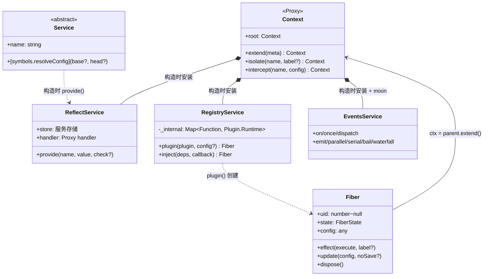
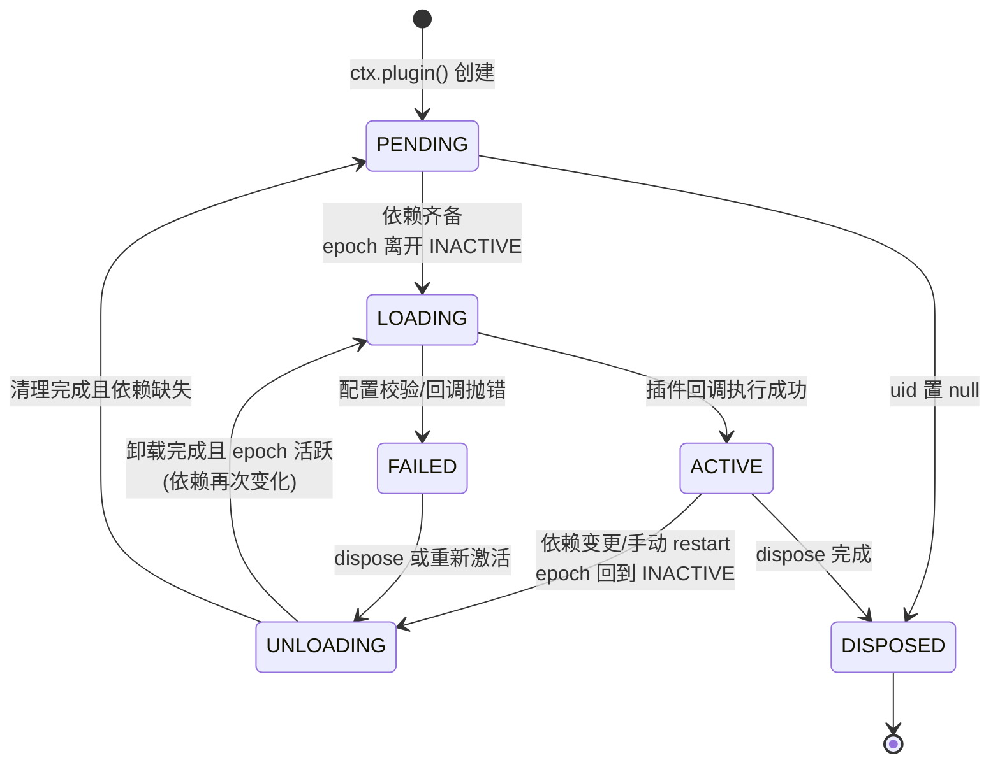
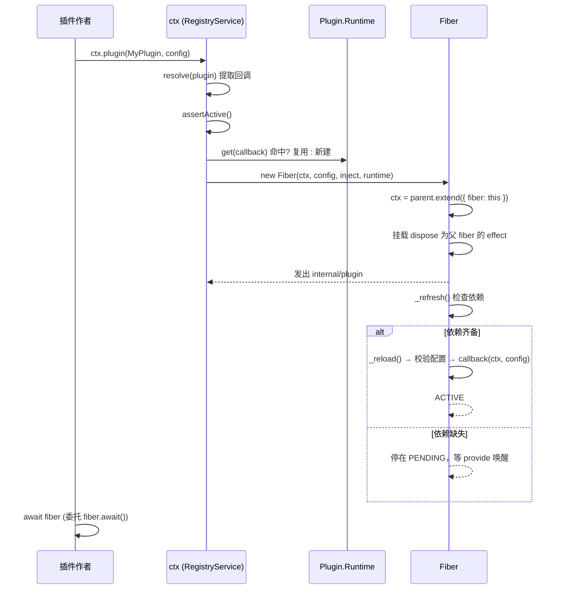

本页是 Cordis 框架层（framework tier）API 的权威索引与深度解读。deepseek-harness 的 API 文档分为两层：**harness 层**——每个 `ctx.<key>` 服务与事件域按所属子系统生成到 `docs/subsystems/` 各页；**框架层**——来自 vendor 固定源码的 Context、Service、Fiber、Events、Registry 五大核心对象，集中生成到 `docs/cordis-api/` 目录。本页梳理这套参考的组织方式、五个对象的内部机制，以及它们如何被生成管线与源码保持逐字节同步。若你尚未了解插件模型本身，建议先读 [Cordis 入门：插件、上下文、服务注入、类型化事件与可逆副作用](5-cordis-ru-men-cha-jian-shang-xia-wen-fu-wu-zhu-ru-lei-xing-hua-shi-jian-yu-ke-ni-fu-zuo-yong)。

Sources: [gen-cordis-catalog.ts](scripts/gen-cordis-catalog.ts#L1-L19)

## 参考文档地图与生成管线

`docs/cordis-api/` 下的每个主题文件与 vendor 源码存在一一映射，且全部由 `scripts/gen-cordis-catalog.ts` 经 Typert 目录投影自动生成。生成器将原始 JSDoc 注入 ` ```ts cordis-catalog ` 代码围栏，并附带 `file:line` 源码指针；中文侧文件是经双语配对评审的对侧，通过 `pnpm run verify-translation-pairing` 记录配对关系。签名块中嵌入的行号意味着：只要在已记录符号的上方插入代码行，提交的产物即告陈旧——即使符号本身未变，也会以"逐字节复现失败"的形式暴露，因此修改任何被记录的源码文件后必须重新生成。

| 文档 | 主题 | 源码 | 核心内容 |
| --- | --- | --- | --- |
| `context.zh.md` | 上下文 | `vendor/cordis/src/context.ts` | 代理容器、`extend/isolate/intercept`、服务存储成员 |
| `service.zh.md` | 服务基类 | `vendor/cordis/src/service.ts` | 注册协议、静态 symbol 键、拦截配置解析 |
| `fiber.zh.md` | Fiber | `vendor/cordis/src/fiber.ts` | 生命周期状态机、`effect` 机制、`update/restart` |
| `events.zh.md` | 事件 | `vendor/cordis/src/events.ts` | 五种分发模式、`on/once`、内置 `internal/*` 事件 |
| `registry.zh.md` | 注册表 | `vendor/cordis/src/registry.ts` | 插件形态、`plugin/inject`、`@Inject` 装饰器 |
| `inherited.md` | 框架继承层 | 多个 vendor 源 | 简明的继承 `ctx` 成员与事件清单 |

Sources: [context.zh.md](docs/cordis-api/context.zh.md#L1-L14)

## 核心对象关系总览

五个对象并非并列关系，而是围绕 **Context 代理** 组织的运行时协作网络：`Context` 的构造函数按固定顺序安装四个内置服务（`reflect`、`registry`、`events`、`logger`）和一个根 Fiber，然后返回一个包装自身为 Proxy 的实例——普通属性读取会穿过 `ReflectService.handler` 进入服务解析器，这就是 `ctx.fs`、`ctx.tools` 之类的服务键位之所以成立的机制基础。RegistryService 负责创建 Fiber，Fiber 持有插件的运行上下文（`parent.extend({ fiber: this })`），EventsService 的方法则通过 `ctx.mixin` 混入到每个上下文表面。



Sources: [context.ts](vendor/cordis/src/context.ts#L70-L84)

## Context：可派生的代理容器

Context 是全框架唯一的心智模型入口。`Context` 接口声明了两个内部映射与若干环境句柄：`[symbols.isolate]` 是"服务名 → 作用域标签"的隔离映射，`[symbols.intercept]` 是"服务名 → 拦截配置"的映射；`root`、`baseUrl`、`events`、`logger`、`reflect`、`registry` 则是运行图的常驻句柄。跨副本与跨 realm 的类型判定不依赖 `instanceof`，而是以全局 symbol（`Symbol.for('cordis.is')`）为键的品牌检查——`Context.is(value)` 据此可安全收窄类型，这是多 bundle 环境下防御重复安装 cordis 副本的关键性质。

Sources: [context.ts](vendor/cordis/src/context.ts#L16-L68)

Context 的三个派生方法共享同一个约束——**父上下文不可变**。`extend(meta)` 以原型继承创建子上下文，`meta` 的自有属性（含 symbol 键）遮蔽继承属性；`isolate(name, label?)` 在隔离映射的影子原型上重定向单个服务名的解析标签，传入相同 `label` 的两次调用会合并作用域；`intercept(name, config)` 则在拦截映射的影子原型上登记服务专属配置，供其下启动的插件在 `Service[symbols.resolveConfig]` 中合并（祖先条目优先）。三者均通过 `extend()` 实现，形成层层叠加的作用域链。

| 方法 | 变更范围 | 实现机制 | 典型用途 |
| --- | --- | --- | --- |
| `extend(meta)` | 新增自有属性 | 原型继承 + 属性遮蔽 | 为子树附加元数据 |
| `isolate(name)` | 单服务解析作用域 | `[symbols.isolate]` 影子原型 | 同名服务的独立实现 |
| `intercept(name, config)` | 单服务配置合并 | `[symbols.intercept]` 影子原型 | 按子树定制服务配置 |

Sources: [context.ts](vendor/cordis/src/context.ts#L99-L145)

服务存储的底层成员由 `reflect.ts` 通过模块扩充（module augmentation）补充到 `Context` 接口上。`ctx.get(name, strict?)` 在 `strict` 为默认值 `true` 时只返回提供方 fiber 处于活动状态的实现；`ctx.provide(name, value)` 注册一个归当前 fiber 所有的服务实现，fiber 卸载时自动注销并唤醒依赖方；`ctx.set` 仅允许提供方 fiber 覆写；`ctx.accessor` 定义由 get/set 钩子支撑的计算属性；`ctx.mixin` 将服务的指定成员以转发访问器的形式暴露到 `ctx` 表面（`ctx.on` 即转发到 `ctx.events.on`）。这些原语是 harness 各包向 `ctx` 发布具名 API 的统一通道。

Sources: [reflect.ts](vendor/cordis/src/reflect.ts#L7-L71)

## Service：具名服务的基类协议

`Service` 基类把"在 `ctx` 上公开具名 API"这件事收敛为一个构造函数协议：子类调用 `super(ctx, name)` 后，实例立即通过 `ctx.reflect.provide(name, this, this[Service.check])` 注册，并随所属 fiber 卸载而自动移除。`name` 缺省时回退到静态 `provide` 字段。若类定义了 `[Service.invoke]` 调用体，服务会以可调用实例的形式返回（`ctx.logger('name')` 之所以能直接调用，正是这一机制），实例的可追踪性通过 `symbols.tracker` 元数据绑定到 `ctx` 属性。

Sources: [service.ts](vendor/cordis/src/service.ts#L42-L59)

基类的静态成员几乎全部是 **symbol 键协议**——它们不是普通方法，而是框架各子系统间约定俗成的扩展点插槽。事件过滤由实例方法 `[symbols.filter](ctx)` 实现：仅当请求方上下文与提供方上下文解析出相同的隔离作用域标签时，服务对该事件分发可见。拦截配置解析 `[symbols.resolveConfig](base?, head?)` 沿原型链回溯 `[Context.intercept]` 映射收集祖先条目，靠近根的条目先应用，`base` 前置、`head` 后置，合并时优先使用服务声明的 `Config.merge`，否则退化为浅 `Object.assign`。

| 静态 symbol | 职责 |
| --- | --- |
| `Service.init` | 类插件构造完成后执行的实例方法键 |
| `Service.check` | 传给 `ctx.provide()` 的可用性谓词键 |
| `Service.config` | 拦截配置的虚设类型参数键 |
| `Service.invoke` | 使服务可调用的调用体键 |
| `Service.extend` | 派生扩展服务实例的辅助方法键 |
| `Service.tracker` | 上下文追踪的元数据键 |
| `Service.resolveConfig` | 拦截配置解析辅助方法键 |

Sources: [service.ts](vendor/cordis/src/service.ts#L11-L63)

`Service` 的 `Symbol.hasInstance` 同样是为代理环境定制：它沿构造函数原型链回溯匹配，而非直接 `instanceof`，使得跨代理、跨副本的服务类型判断保持可靠。这一点与 `Context.is()` 的全局 symbol 品牌检查共同构成框架"代理透明"的两块基石——任何运行在 Proxy 包装下的对象，其类型判定都不会因包装而失效。

Sources: [service.ts](vendor/cordis/src/service.ts#L104-L114)

## Fiber：插件运行时与生命周期状态机

Fiber 是单次插件应用的运行时实例，其字段构成了一张完整的生命周期画像：`uid` 是注册表内的唯一 id（根 fiber 恒为 0，dispose 后置 `null`），`ctx` 是插件运行所在的子上下文，`config` 是经校验的配置，`state` 是当前生命周期状态，`store` 是加载期间所需服务实现的快照，`inertia` 是进行中的加载/卸载转换 promise。fiber 的构造函数还完成了一项关键的发布时序控制：子 fiber 的 `dispose` 挂接为父 fiber 的一个 effect（标签 `ctx.plugin()`），只有父级完全持有已赋值的 disposer 后才发出 `internal/plugin` 事件——这保证了同步观察者即便立即 dispose 子 fiber 或父 fiber，也不会观察到半初始化状态。

Sources: [fiber.ts](vendor/cordis/src/fiber.ts#L184-L333)

状态机由 `FiberState` 常量枚举驱动。`_getState()` 从三个事实推导状态：`uid === null` 即 `DISPOSED`；存在 `_error` 即 `FAILED`；runner 的 epoch 为 `INACTIVE` 即 `PENDING`，否则 `ACTIVE`。状态转换经 `_updateState()` 发出 `internal/status` 事件，且仅当转换跨越 ACTIVE/非 ACTIVE 边界时才向 reflect 存储中本 fiber 提供的服务发送变更通知——这一"边界过滤"避免了 PENDING→LOADING 等中间态抖动惊动依赖方。



Sources: [fiber.ts](vendor/cordis/src/fiber.ts#L574-L595)

状态机的核心是 **epoch 机制**。`_refresh()` 将每个已注入服务实现所属 fiber 的 uid 拼接为字符串指纹，任一依赖缺失则置为哨兵值 `INACTIVE`；`_setEpoch()` 对比新旧指纹，仅在有变化且无进行中转换（`inertia`）时驱动状态转换：从 `INACTIVE` 转为具体指纹触发 `_reload()`，反向触发 `_unload()`。`_reload()` 在执行插件回调前先经 `_resolveConfig()`——先跑 `internal/config` waterfall 允许修改原始配置，再应用 `runtime.Config` 的 standard-schema 校验（不支持异步校验，失败抛出聚合了 issue 列表的 `ValidationError`）。`_unload()` 则逆序执行 `_disposables` 中收集的全部清理函数并等待完成。两个方向的转换都通过循环检查 epoch 是否再次变化来自然实现"转换中途依赖又变了"的重入语义。

Sources: [fiber.ts](vendor/cordis/src/fiber.ts#L597-L696)

副作用（effect）是 Fiber 对外最重要的 API。`Effect` 类型接受三种形态：单个清理函数、兑现为清理函数的 promise、或（可能异步的）可迭代对象——生成器作用会在每个清理函数产生时即刻注册，且异步迭代器在每步前检查 epoch，fiber 卸载后停止消费。`ctx.effect()` 与 `fiber.effect()` 是同一方法：`execute` 立即运行，产生的清理函数按注册逆序执行，重复调用返回的 disposer 是 no-op；对已 dispose 的 fiber 调用会抛出稳定错误码的 `CordisError('INACTIVE_EFFECT')`。每个带标签的作用会在 disposer 上暴露一棵 `EffectMeta` 诊断树（`label` + `children`），`getEffects()` 据此返回当前活动作用的元数据，这是 `cordis-inspect` 等诊断工具的数据来源。

Sources: [fiber.ts](vendor/cordis/src/fiber.ts#L74-L101)

对外生命周期入口有三个。`await()` 循环等待 `inertia` 排空后重抛 `_error`，这正是 `ctx.plugin()` 返回值可被 `await` 的原因——RegistryService 用 `Object.create(fiber)` 包装 fiber 并注入 `then` 方法委托给 `await()`。`restart()` 将 epoch 置为 `INACTIVE` 后立即 `_refresh()`，实现"dispose 后马上以当前配置重载"。`update(config, noSave?)` 先保存原始配置，若 fiber 尚非 ACTIVE 则延迟解析（配置解析可能访问注入的服务），否则先经 `internal/update` waterfall——任何钩子（包括 HMR）跳过 `next()` 即可否决重启——最后才以校验后的配置执行重启。`noSave` 作为提示传递给持久化钩子，表示该变更无需写回。

Sources: [fiber.ts](vendor/cordis/src/fiber.ts#L704-L753)

`fiber.name` 的 getter 沿 `parent.fiber` 链向上查找最近的具名祖先，找不到则返回 `'root'`，这使日志名与诊断信息天然携带插件树位置。`assertActive()` 通过 `uid !== null` 判活，是所有公共 effect/registry 入口的第一道防线。

Sources: [fiber.ts](vendor/cordis/src/fiber.ts#L336-L354)

## Events：五种分发模式与 fiber 属主的监听器

`EventsService` 安装为 `ctx.events` 并把方法混入每个上下文。判定提前终止值（bail value）的规则由 `isBailed()` 定义：仅 `null`、`false`、`undefined` 不构成终止——这意味着任何真值乃至 `0`、`''` 都是合法的"有结果"返回。五种分发模式共享同一个 `dispatch()` 前置管线：从参数中解出可选 `thisArg` 与事件名，对非 `internal/` 事件发出 `internal/dispatch` 诊断事件，再按 `hook.global || !filter || filter.call(thisArg, hook.ctx)` 过滤监听器并绑定 `this`——上下文过滤器通过 `Context.filter` symbol 挂载，`Service[symbols.filter]` 即利用它实现服务级事件可见性。

| 模式 | 执行时序 | 返回值 | 终止语义 |
| --- | --- | --- | --- |
| `emit` | 同步运行，不等待 | `void` | 无 |
| `parallel` | 并发运行，`Promise.allSettled` 聚合 | `Promise<void>` | 全部完成；有拒绝则抛 `AggregateError` |
| `serial` | 依次 await | 首个 bail 值（promisify） | `isBailed(result)` 为真即停 |
| `bail` | 同步依次调用 | 首个 bail 值 | 同上，不等待 promise |
| `waterfall` | 监听器包装链，外层先执行 | 最外层监听器返回值 | 不调 `next()` 即否决整条链（含内置行为） |

Sources: [events.ts](vendor/cordis/src/events.ts#L165-L243)

监听器的属主模型是本服务最重要的设计约束：`ctx.on(name, listener, options?)` 内部调用 `EventsService.register()`，后者以 `ctx.on("...")` 为标签把监听器记录为**当前 fiber 的一个 effect**——监听器随 fiber 卸载自动移除，其存在也可在 `getEffects()` 诊断树中被观测。`once()` 由 `on()` 派生：包装函数先自注销再调用真实监听器。`EventOptions` 提供两个开关：`prepend` 控制插入队首，`global` 使监听器无视上下文过滤。对已 dispose 的 fiber 调用 `on()` 同样触发 `INACTIVE_EFFECT`。

Sources: [events.ts](vendor/cordis/src/events.ts#L254-L318)

框架内置事件集中在 `Events` 接口中，全部以 `internal/` 前缀标记（因此不再触发 `internal/dispatch`）。它们的模式差异体现了各自的用途：`internal/config`、`internal/update`、`internal/get`、`internal/set` 是 waterfall（可在 `next()` 前改写/否决），`internal/listener` 是 bail（非空返回值会替代注册流程），`internal/plugin` 与 `internal/status` 是普通 emit。其中 `internal/update` 有特例处理：构造时通过 `internal/listener` 拦截钩子把非 global 的监听器重定向到 fiber 自身的 `_hooks` 中，使更新钩子天然随 fiber 生命周期管理——这正是 HMR 每插件粒度热更新的支撑点。

Sources: [events.ts](vendor/cordis/src/events.ts#L131-L156)

Sources: [events.ts](vendor/cordis/src/events.ts#L329-L352)

## Registry：插件形态、运行时登记与依赖注入

`RegistryService` 本质是一个以"解析后的回调函数"为键的 `Map<Function, Plugin.Runtime>`。插件支持三种入口形态——函数（`(ctx, config) => any`）、类（`new (ctx, config)`）、对象（`apply(ctx, config)` 方法）——共享同一份 `Base` 元数据：`name`（诊断与 logger 名）、`Config`（standard-schema 校验器）、`inject`（必需服务）、`provide`（声明提供的服务名，供 `Service` 基类与加载器读取）、`intercept`（声明消费其拦截配置的服务名）。`Plugin.Runtime` 是同一回调所有 fiber 共享的可变登记记录：`fibers` 列表、可执行回调（注册表身份键）与 `Config` 校验器。

Sources: [registry.ts](vendor/cordis/src/registry.ts#L92-L146)

`ctx.plugin()` 的执行流可概括为四步：`resolve()` 规范化形态并提取回调（非函数且无 `apply` 的输入直接抛错）；`assertActive()` 确保当前 fiber 存活；按需创建或复用 `Plugin.Runtime`（对象插件的 `name === 'apply'` 会被抹去以获得更有意义的显示名）；最后构造 `new Fiber(ctx, config, Inject.resolve(plugin.inject), runtime, getOuterStack)` 并返回可 await 的包装。`ctx.inject(deps, callback)` 是 `plugin({ inject, apply: callback })` 的简写，语义关键点在于：**必需服务变化时回调会被卸载并重跑**——依赖驱动的生命周期贯穿始终。



Sources: [registry.ts](vendor/cordis/src/registry.ts#L300-L336)

依赖声明的类型系统围绕 `Inject` 展开：数组形式请求不带拦截配置的服务，对象形式将服务名映射到插件上下文中可选的拦截配置。`Inject.resolve()` 把数组、对象乃至**类继承的 inject 元数据**统一规范化为"服务名 → 配置或 null"的平面映射。`@Inject(name, config?)` 装饰器则支持两种落点：装饰类时写入静态 `inject` 映射（经原型链继承检查确保子类不污染父类）；装饰方法时通过 `addInitializer` 把方法调用延迟到 `ctx.inject()` 满足依赖后执行。注册表另提供 map 式检查面：`get/has/delete/keys/values/entries/forEach`，其中 `delete(plugin)` 会 dispose 该插件的所有 fiber 并移除运行时记录。

Sources: [registry.ts](vendor/cordis/src/registry.ts#L19-L88)

Sources: [registry.ts](vendor/cordis/src/registry.ts#L222-L291)

## 框架层与 harness 层的边界：inherited 分层

框架 API 的"完整清单"落在 `docs/cordis-api/inherited.md`：一份自动生成的继承层总表，收录 cordis core 加上 loader/hmr/timer 四个 vendor 包混入的 `ctx` 成员（如 `ctx.timer` 系列、`ctx.loader`）与内置事件（`internal/*` 九个加上 loader 的六个）。它与五个主题文档的分工由生成器的 **fail-closed 双向校验**保证：`SERVICE_PAGE` 表把每个 harness 发现的 `ctx.<key>` 服务硬性映射到唯一的 `docs/subsystems/` 页面，发现键缺失映射、或映射键不再被发现，都是硬错误——harness 层词汇与框架层词汇的分区不可能静默漂移。产物另有第三个出口：`packages/extensions/tool-cordis/src/api-catalog.ts` 将同一投影渲染为运行时可用的 API 目录。

Sources: [inherited.md](docs/cordis-api/inherited.md#L10-L38)

Sources: [gen-cordis-catalog.ts](scripts/gen-cordis-catalog.ts#L39-L52)

## 后续阅读

掌握框架层 API 后，建议沿以下路径继续：[总体架构：插件树、核心包职责与 ctx 服务键位图](9-zong-ti-jia-gou-cha-jian-shu-he-xin-bao-zhi-ze-yu-ctx-fu-wu-jian-wei-tu)展示这些原语如何组装为完整插件树；[Cordis 分发模式与瀑布语义：emit/waterfall/parallel/serial/bail 的协作式中间件](6-cordis-fen-fa-mo-shi-yu-pu-bu-yu-yi-emit-waterfall-parallel-serial-bail-de-xie-zuo-shi-zhong-jian-jian)深入五种分发模式的实战模式；[Cordis 实战教程（七讲）：从第一个插件到生命周期、服务、事件、配置与 HMR](7-cordis-shi-zhan-jiao-cheng-qi-jiang-cong-di-ge-cha-jian-dao-sheng-ming-zhou-qi-fu-wu-shi-jian-pei-zhi-yu-hmr)提供逐讲上手练习；[扩展手册：添加工具、包、LLM 适配器、Remote API 与设置卡片](24-kuo-zhan-shou-ce-tian-jia-gong-ju-bao-llm-gua-pei-qi-remote-api-yu-she-zhi-qia-pian)则演示如何用本页的 Service/Registry 协议扩展 harness 自身。