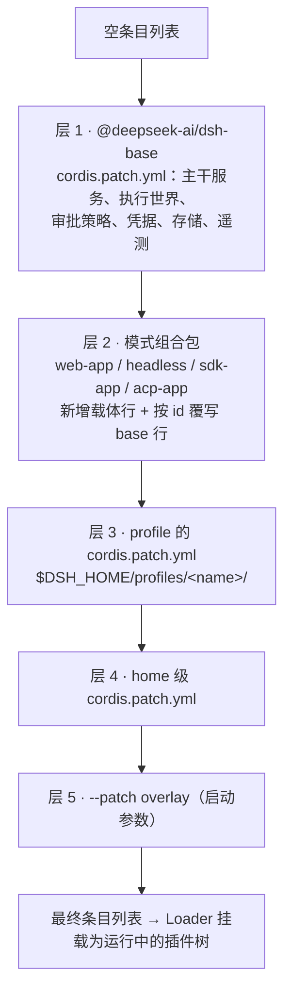
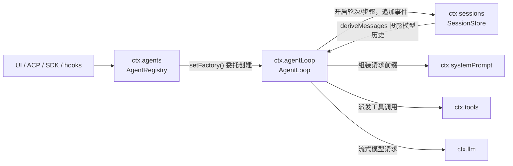

本页是 dsh（DeepSeek Harness）核心架构的**概念地图**：回答三个问题——运行中的 dsh 是一棵什么样的插件树、这棵树由哪些核心包撑起、每个包（以及每个可替换能力）在 `ctx` 上暴露哪个服务键。阅读本页前建议先完成 [Cordis 入门](5-cordis-ru-men-cha-jian-shang-xia-wen-fu-wu-zhu-ru-lei-xing-hua-shi-jian-yu-ke-ni-fu-zuo-yong)，掌握插件、上下文与服务注入的基本语义。

Sources: [architecture.zh.md](docs/architecture.zh.md#L1-L13)

## 一棵没有特权内核的插件树

dsh 建立在 Cordis 之上：插件向共享上下文贡献服务、类型化事件和可逆副作用。产品的每一部分都是插件——模型适配器、工具注册表、会话日志，乃至 agent loop 本身。这里**不存在需要打补丁的特权内核**：扩展 dsh 的唯一方式是把插件挂载到其他插件旁边，而每一项注册都是副作用，会在所属插件卸载时自动撤销。

Sources: [architecture.zh.md](docs/architecture.zh.md#L9-L13)

由此推出本仓库最重要的架构不变量：**运行中的 `dsh` 就是一棵插件树**，没有"主程序调用插件"的分层，只有"配置数据决定挂载哪些插件"的组合。改动体验的方式不是改内核，而是向树中插入、替换或 patch 某一行插件配置。这条不变量是后续所有章节（组合包机制、事件域、能力 seam）的共同前提。

Sources: [architecture.zh.md](docs/architecture.zh.md#L17-L27)

## 组装：profile、组合包与 patch 叠层

这棵树不是写死在代码里的，而是**启动时按序叠加的数据**。**profile** 是存放在 Harness home（`$DSH_HOME/profiles/<name>`）中的具名组装：它列出自己叠放的组合包，存放树外插件，并持有用户自己的 `cordis.patch.yml`。**组合包** 则是 Cordis 配置行及其挂载代码的 npm 分发格式，通过 `package.json` 的 `dsh` 字段自描述——`dsh.profile` 列出一个 profile 的组合包，`dsh.bundle.patch` 指向组合包的 patch 文件。

Sources: [architecture.zh.md](docs/architecture.zh.md#L15-L23), [profile.ts](packages/boot/app-boot/src/profile.ts#L1-L17), [package.json](packages/bundle/base/package.json#L36-L38)

各层**按固定顺序应用在空条目列表之上**：先按 profile 列出的顺序应用每个组合包，然后是 profile 自己的 `cordis.patch.yml`，然后是 home 级的那份，最后是任意 `--patch` overlay。一条 patch 按 `id` 定位某个条目并**替换其整个 config**（不是合并），或插入新行——这正是"任何一层的插入内容都始终可被其上各层 patch"的实现基础。值得注意的是，行序本身不承载加载语义（激活由服务可用性驱动），分组只服务于读者。

Sources: [architecture.zh.md](docs/architecture.zh.md#L27-L29), [cordis.patch.yml](packages/bundle/base/cordis.patch.yml#L1-L11), [cordis.patch.yml](packages/bundle/web-app/cordis.patch.yml#L4-L6)



随发行版交付的五个 profile 模板直接写在启动器源码中：`web`、`headless`、`sdk` 与 `acp` 都是"`dsh-base` 打底 + 各自模式组合包"的两层结构，而 `sdk-minimal` 独占一棵更小的树、不含 `dsh-base`。模式组合包除了插入自己的行，还会**按 id 覆写 base 行**（例如 web 层重写 `system-prompt` 的人设前后缀、`tools` 的模式开关、`session-query-sqlite` 的开启策略），并且可以一次声明多个 patch 文件——`dsh-web-app` 就按顺序叠加了 `standard`/`ptc`/`minimal` 预设 patch。

Sources: [profile.ts](packages/boot/app-boot/src/profile.ts#L170-L192), [package.json](packages/bundle/web-app/package.json#L41-L50), [cordis.patch.yml](packages/bundle/web-app/cordis.patch.yml#L14-L38)

想知道**你的机器**实际启动了什么树，有一条现成命令：

```sh
dsh --profile web --dump-config
```

它打印出的任何条目都可以由你自己的 patch 替换——组合即数据，数据皆可 patch。profile 叠层顺序、组合包与 patch 文件的完整机制（含 HMR 与安装协调）由 [Profile 与组合包：dsh-base、patch 叠加顺序与运行时组装机制](10-profile-yu-zu-he-bao-dsh-base-patch-die-jia-shun-xu-yu-yun-xing-shi-zu-zhuang-ji-zhi) 专页展开。

Sources: [architecture.zh.md](docs/architecture.zh.md#L33-L41)

## 核心包：一条轮次流经的六个包

`packages/core` 是每个组合都会启动的主干：事件溯源的会话日志、系统提示词组装、工具注册表、agent 类型，以及驱动它们的具体循环。一个轮次按同一条路径流经六个包——`agent-loop` 的 driver 认领排队的提示词，在会话日志（`ctx.sessions`）上开启轮次，通过 system-prompt（`ctx.systemPrompt`）组装请求前缀，在工具注册表（`ctx.tools`）上派发调用，经 `ctx.llm` 完成流式模型请求。

Sources: [core.zh.md](docs/subsystems/core.zh.md#L5-L9)

| 包 | 职责 | `ctx` 键 | 键声明位置 |
|---|---|---|---|
| `core/session` | 仅追加的 `SessionEvent` 日志与内存 store——唯一真源 | `ctx.sessions` | [index.ts](packages/core/session/src/index.ts#L38-L41) |
| `core/system-prompt` | 有序提示词段落、动态上下文与工具 schema 组装 | `ctx.systemPrompt` | [index.ts](packages/core/system-prompt/src/index.ts#L13-L16) |
| `core/tools` | 作用域化工具注册表与带把关的执行流水线 | `ctx.tools` | [index.ts](packages/core/tools/src/index.ts#L137-L140) |
| `core/agent` | `Agent` 接口、活跃 agent 注册表、发起者作用域与 `agent/*` 事件 | `ctx.agents` | [index.ts](packages/core/agent/src/index.ts#L27-L31) |
| `core/agent-loop` | 实现 `Agent` 约定的唯一具体 driver | `ctx.agentLoop` | [index.ts](packages/core/agent-loop/src/index.ts#L215-L227) |
| `core/scope` | 按 agent 作用域化的注册原语（库，无 ctx 键） | —（库） | [core.zh.md](docs/subsystems/core.zh.md#L18-L20) |

`core/scope` 是其中唯一的非服务包：一个零依赖库，刻意放在模块图中 `session/` 与 `system-prompt/` 之下，让二者消费它而不形成环。`agent-loop` 是公开 `Agent` 约定的唯一具体实现，但它通过 `ctx.agents.setFactory()` 向注册表注册工厂——消费方只依赖 `ctx.agents`，无需依赖具体循环包；这正是"接口包与实现包分离"在主干上的直接体现。

Sources: [core.zh.md](docs/subsystems/core.zh.md#L13-L20), [core.zh.md](docs/subsystems/core.zh.md#L26-L53)



轮次内部 `turn/start → step/* → turn/end` 的事件时序属于 [Agent Loop 与轮次生命周期](11-agent-loop-yu-lun-ci-sheng-ming-zhou-qi-turn-start-dao-turn-end-de-bu-zou-liu-yu-shi-jian-shi-xu) 的范围，本页只固化架构层面的依赖方向：**驱动器消费其余四个服务，而消费方只看 `ctx.agents`**。与主干并列，`llm/llm` 提供 `ctx.llm`——消息与流式词汇表及适配器 seam，模型适配器（如 `llm-deepseek`、`llm-pi-ai`）以消费者身份向它注册。

Sources: [core.zh.md](docs/subsystems/core.zh.md#L9-L9), [llm/src/index.ts](packages/llm/llm/src/index.ts#L57-L60), [architecture.zh.md](docs/architecture.zh.md#L57-L70)

## ctx 服务键位图

仓库用生成脚本维护着一份权威的**能力 seam 与核心服务目录**：服务从 Cordis 声明中自动发现，接口、实现与消费方角色在 `scripts/gen-doc-graphs.ts` 中分类并设有完整性守卫。每个服务键被归为四类——`core`（主干服务）、`seam`（可替换能力：Service Definition + Service Provider + Consumer 三角色）、`service`（独立服务）与 `bundle`（组合即服务，如 agent-loop）。下面按**域**重排这份目录，作为查键速查表；完整的提供方/消费方关系图见 [能力 Seams 与核心服务全景](13-neng-li-seams-yu-he-xin-fu-wu-quan-jing-ke-ti-huan-fu-wu-de-ti-gong-fang-yu-xiao-fei-fang-guan-xi-tu)。

Sources: [capability-seams.zh.md](docs/capability-seams.zh.md#L663-L663), [graph-atlas.zh.md](docs/graph-atlas.zh.md#L9-L17)

### 核心主干（轮次路径）

| `ctx` 键 | 分类 | 定义包 | 已知实现 | 典型消费方 |
|---|---|---|---|---|
| `ctx.sessions` | core | `core/session` | — | agent、agent-loop、session-query* |
| `ctx.systemPrompt` | core | `core/system-prompt` | — | agent-loop、tools、tool-fs、tool-web |
| `ctx.tools` | core | `core/tools` | — | agent-loop、tool-bash、tool-web、tool-ask-user |
| `ctx.agents` | core | `core/agent` | — | agent-loop、acp、subagent-in-process-driver |
| `ctx.agentLoop` | bundle | `core/agent-loop` | —（唯一具体循环） | dsh-base、dsh-sdk-minimal |
| `ctx.llm` | core | `llm/llm` | 适配器：llm-deepseek、llm-pi-ai、llm-replay | agent-loop、compaction-basic |
| `ctx.agentDefaultModel` | core | `core/agent-default-model` | — | api-session-controller、headless |

Sources: [capability-seams.zh.md](docs/capability-seams.zh.md#L600-L632)

### 执行世界（可替换后端）

这一组是"替换一个提供方就搬走半个产品"的 seam 群：文件系统与进程提供方共享同一个执行世界，把它们指向远程沙箱，Bash、PTY、LSP 随之迁移，无需提供方专用 fork。

| `ctx` 键 | 分类 | 定义包 | 已知实现 | 典型消费方 |
|---|---|---|---|---|
| `ctx.fs` | seam | `fs/fs` | fs-local、fs-sandbox、fs-ssh | tool-fs |
| `ctx.subprocess` | seam | `subprocess/subprocess` | subprocess-local、subprocess-ssh | bash-local、bash-sandbox、terminal-bash、lsp-stdio |
| `ctx.sandbox` | seam | `sandbox/sandbox` | sandbox-local、sandbox-ssh | bash-sandbox、terminal-bash |
| `ctx.sandboxPolicy` | core | `sandbox/sandbox-policy` | — | bash-sandbox、fs-sandbox、terminal-bash |
| `ctx.shell` | seam | `shell/shell` | bash-local、bash-sandbox、pwsh-local、pwsh-sandbox | tool-bash、tool-pwsh、hooks-* |
| `ctx.shellEnv` | core | `shell/shell-env` | — | tool-bash、tool-pwsh |
| `ctx.terminals` | seam | `terminal/terminal` | terminal-bash | tool-terminal |
| `ctx.lsp` | seam | `lsp/lsp` | lsp-stdio | tool-lsp |
| `ctx.ssh` | core | `ssh/ssh` | — | fs-ssh、subprocess-ssh、sandbox-ssh |
| `ctx.jobs` | seam | `jobs/jobs` | jobs-local | tool-bash、tool-pwsh、tool-terminal、tool-subagent、api-job-controller |

Sources: [architecture.zh.md](docs/architecture.zh.md#L133-L139), [capability-seams.zh.md](docs/capability-seams.zh.md#L635-L651)

### 会话周边与持久化

| `ctx` 键 | 分类 | 定义包 | 已知实现 | 典型消费方 |
|---|---|---|---|---|
| `ctx.sessionPersistence` | seam | `session/session-persistence` | session-persistence-jsonl | agent-loop、tool-bash、hooks-*、session-query* |
| `ctx.sessionQuery` | seam | `session-query/session-query` | session-query-sqlite | session-reference、tool-session-query |
| `ctx.sessionProjections` | core | `session/session-projection` | — | api-session-controller、tool-todo、session-title |
| `ctx.sessionProjectionCache` | core | `session/session-projection-cache` | — | api-session-controller、session-query、session-reference |
| `ctx.sessionTitle` | seam | `session/session-title` | session-title-first-prompt-llm、session-title-all-prompts-llm | — |
| `ctx.attachments` | seam | `attachment/attachment` | attachment-local | tool-fs、llm-deepseek、llm-pi-ai、api-session-controller |
| `ctx.compaction` | seam | `compaction/compaction` | compaction-basic | compaction-basic |
| `ctx.toolResultPruner` | core | `compaction/compaction-tool-result-pruner` | — | — |
| `ctx.spillStore` | seam | `spill/spill` | spill-local | spill-policy |
| `ctx.sessionTelemetry` | seam | `session/session-telemetry` | session-telemetry-otel | — |

Sources: [capability-seams.zh.md](docs/capability-seams.zh.md#L603-L653)

### 交互、审批与凭据

| `ctx` 键 | 分类 | 定义包 | 已知实现 | 典型消费方 |
|---|---|---|---|---|
| `ctx.approval` | seam | `interaction/user-approval` | — | tools、tool-bash、acp |
| `ctx.permissionPresets` | core | `interaction/permission-presets` | — | — |
| `ctx.userQuestions` | seam | `interaction/user-questions` | — | tool-ask-user |
| `ctx.commands` | core | `interaction/commands` | — | — |
| `ctx.planMode` | core | `plan/plan-mode` | — | — |
| `ctx.settings` | core | `settings/settings` | — | api-settings-controller |
| `ctx.configEditor` | core | `boot/config-editor` | — | settings、agent-default-model |
| `ctx.credentials` | seam | `credentials/credentials` | credentials-local | llm-deepseek、llm-pi-ai、api-settings-controller |
| `ctx.authorization` | seam | `credentials/authorization` | — | llm-pi-ai |
| `ctx.deepseekAccount` | seam | `credentials/deepseek-account` | deepseek-account-platform | llm-deepseek、api-account-controller |

Sources: [capability-seams.zh.md](docs/capability-seams.zh.md#L604-L643)

### 模型可见能力与自动化后端

| `ctx` 键 | 分类 | 定义包 | 已知实现 | 典型消费方 |
|---|---|---|---|---|
| `ctx.skills` | seam | `skill/skill` | skill-badge、skill-filesystem、skill-office | tool-skill |
| `ctx.web` | seam | `web/web` | web-search-deepseek/exa/perplexity、web-fetch-http | tool-web |
| `ctx.mcpResources` | seam | `mcp/mcp-resources` | mcp-client | mcp-resources |
| `ctx.ptcRuntime` | seam | `ptc-runtime/ptc-runtime` | ptc-runtime-node、experimental-ptc-runtime-python | tools、workflow-ptc |
| `ctx.workflowEngine` | seam | `workflow/workflow` | workflow-ptc | tool-workflow、tool-ralph |
| `ctx.officeToPdf` | service | `document/office-to-pdf` | — | client-ui-sidebar-documentpreview |
| `ctx.browserUse` | seam | `browser-use/browser-use` | experimental 三个驱动 | — |
| `ctx.computerUse` | seam | `computer-use/computer-use` | experimental 两个驱动 | — |
| `ctx.fileReferences` | seam | `context/file-reference` | file-reference-local | api-session-controller |
| `ctx.sessionReferenceResolver` | core | `context/session-reference` | — | — |

Sources: [capability-seams.zh.md](docs/capability-seams.zh.md#L577-L659)

### 子代理与编排

| `ctx` 键 | 分类 | 定义包 | 已知实现 | 典型消费方 |
|---|---|---|---|---|
| `ctx.subagents` | seam | `subagent/subagent` | spawn-in-process、fork-in-process、acp、codex、claude-code、dsh-sdk | tool-subagent、tool-subagent-control |
| `ctx.agentTeams` | core | `experimental/agent-team` | — | experimental-tool-agent-team |
| `ctx.agentPresets` | core | `preset/agent-preset-registry` | — | — |
| `ctx.goals` | core | `goal/goal` | — | — |
| `ctx.schedule` | core | `schedule/schedule` | — | — |
| `ctx.webhookRuntime` | core | `webhook/webhook` | — | webhook-github |

Sources: [capability-seams.zh.md](docs/capability-seams.zh.md#L625-L658)

### Host、客户端载体与运行时设施

| `ctx` 键 | 分类 | 定义包 | 已知实现 | 典型消费方 |
|---|---|---|---|---|
| `ctx.profileContext` | core | `boot/app-boot`（启动器提供） | — | hmr、plugin-manager、settings、config-editor |
| `ctx.webServer` | core | `host/webserver` | — | client-connection、client-modules、client-hmr |
| `ctx.connection` | seam | `client/connection` | — | api-gateway、host-frontend-static |
| `ctx.clientModules` | core | `client/modules` | — | client-hmr |
| `ctx.pluginManager` | core | `boot/plugin-manager` | — | plugin-manager/tools、ui-settings-plugin-inventory |
| `ctx.typert` | core | `typert/registry` | — | typert-loader、api-gateway |
| `ctx.typertGateway` | core | `api/gateway` | — | — |
| `ctx.storage` | seam | `storage/storage` | storage-json、storage-sqlite | storage-domain |
| `ctx.storageDomain` | core | `storage/storage-domain` | — | workspace |
| `ctx.invariants` | core | `runtime-diagnostics/invariants` | — | session、agent、scope、agent-loop |
| `ctx.dynamicCordisRunner` / `ctx.cordisInspect` | core | `extensions/cordis-host-runner` | — | tool-cordis |
| `ctx.deepseekLlmApiExtensions` | core | `llm/deepseek-llm-api-extensions` | — | llm-deepseek、session-log-deepseek |

Sources: [capability-seams.zh.md](docs/capability-seams.zh.md#L600-L661), [profile-context.ts](packages/boot/app-boot/src/profile-context.ts#L32-L37)

## 键的声明约定：源码里的固定模式

每个服务键在源码中都遵循同一套两段式约定。**第一段是模块增强**：包在自己的入口文件里对 `@deepseek-ai/cordis` 的 `Context` 接口做 `declare module` 扩展，把键名写进全局类型（这也意味着整个键位图可以被 TypeScript 编译器机械地校验）。**第二段是 Service 子类**：服务类 `extends Service` 并作为插件默认导出，由 Loader 在对应配置行挂载时实例化。

Sources: [agent/src/index.ts](packages/core/agent/src/index.ts#L27-L31), [session/src/index.ts](packages/core/session/src/index.ts#L925-L928)

```ts
// 第一段：声明键（packages/core/agent/src/index.ts L27-31）
declare module '@deepseek-ai/cordis' {
  interface Context {
    agents: AgentRegistry
  }
}

// 第二段：实现并默认导出（packages/core/session/src/index.ts L925/L1328）
export class SessionStore extends Service { /* … */ }
export default SessionStore
```

对 seam 类服务还有一条关键语义：**每个上下文一个实现**。以 `ctx.subprocess` 为例，其抽象类文档明确写道——子类化并作为插件加载后即注册为 `ctx.subprocess`，同一上下文加载第二个实现会直接抛错（Cordis 标准的重复服务行为）；`ctx.shell` 采用同样约定。这条约束让"换一个提供方"成为 patch 一行配置的操作，而不是运行时路由问题。

Sources: [subprocess/src/index.ts](packages/subprocess/subprocess/src/index.ts#L82-L95), [shell/src/index.ts](packages/shell/shell/src/index.ts#L30-L40)

最后一个值得注意的细节是：组合 YAML 可以**读取 ctx 做条件挂载**。`dsh-base` 的多行配置用 `disabled: !!js "!ctx.get('profileContext')"` 表达"只有被 dsh 启动器拉起时才挂载"（如 plugin-manager、settings、hmr），而 `profileContext` 本身就是启动器通过同样的模块增强方式提供的服务。组合层与运行时由此共享同一套键位词汇。

Sources: [cordis.patch.yml](packages/bundle/base/cordis.patch.yml#L19-L21), [profile-context.ts](packages/boot/app-boot/src/profile-context.ts#L32-L37)

## 把新行为接到正确的键上

服务键位图的价值在落地时显现：绝大多数新功能都是"找到正确的键，注册进去"，而不是修改主干。事件是另一条扩展轴（会话事件持久入日志、`agent/*` 观察进行中的工作、能力事件向 seam 附加策略），其域选择原则见 [事件域与扩展点](12-shi-jian-yu-yu-kuo-zhan-dian-hui-hua-shi-jian-agent-shi-shi-shi-jian-yu-neng-li-shi-jian-de-xuan-ze-yuan-ze)；下表仅收录以**服务注册**为载体的常见目标。

Sources: [architecture.zh.md](docs/architecture.zh.md#L74-L84), [architecture.zh.md](docs/architecture.zh.md#L141-L147)

| 目标 | 机制 |
|---|---|
| 添加模型提供方 | 在 `ctx.llm` 上注册适配器 |
| 添加面向模型的能力 | 在 `ctx.tools` 上注册；schema 进入提示词组装 |
| 添加 shell 执行 | 注册 `ctx.shell` 后端；本地后端经 `ctx.subprocess` spawn 进程 |
| 添加持久化终端执行 | 注册 `ctx.terminals` 后端 + `dsh-tool-terminal` |
| 添加用户命令 | 在 `ctx.commands` 上注册（无需模型轮次） |
| 管理后台任务 | 在 `ctx.jobs` 上注册；`job_*` 工具读取或停止 |
| 添加文件系统访问或策略 | 注册 `ctx.fs` 提供方，或监听 `fs/*` 事件 |
| 限制所启动的进程 | 使用 `ctx.sandbox` 后端；消费方在启动前包装 argv |
| 生成会话标题 | 注册唯一的 `ctx.sessionTitle` 提供方 |
| 将注册项限定到单个 agent | 使用该 agent 的 `agent.ctx` |

Sources: [architecture.zh.md](docs/architecture.zh.md#L145-L166)

动手路径建议按 [扩展手册：添加工具、包、LLM 适配器、Remote API 与设置卡片](24-kuo-zhan-shou-ce-tian-jia-gong-ju-bao-llm-gua-pei-qi-remote-api-yu-she-zhi-qia-pian) 的实操章节走，本页的键位图负责回答"往哪个键上接"。

Sources: [architecture.zh.md](docs/architecture.zh.md#L168-L168)

## 阅读路径

本页建立了"插件树 + 服务键"的心智模型，建议按以下顺序继续：

1. [Profile 与组合包：dsh-base、patch 叠加顺序与运行时组装机制](10-profile-yu-zu-he-bao-dsh-base-patch-die-jia-shun-xu-yu-yun-xing-shi-zu-zhuang-ji-zhi)——深挖本页第 2 节的组装机制。
2. [Agent Loop 与轮次生命周期：turn/start 到 turn/end 的步骤流与事件时序](11-agent-loop-yu-lun-ci-sheng-ming-zhou-qi-turn-start-dao-turn-end-de-bu-zou-liu-yu-shi-jian-shi-xu)——展开核心主干的轮次内部时序。
3. [能力 Seams 与核心服务全景：可替换服务的提供方与消费方关系图](13-neng-li-seams-yu-he-xin-fu-wu-quan-jing-ke-ti-huan-fu-wu-de-ti-gong-fang-yu-xiao-fei-fang-guan-xi-tu)——本页键位表的完整关系图版本。
4. [Cordis API 参考：Context、Service、Fiber、Event 与 Registry 的框架级细节](8-cordis-api-can-kao-context-service-fiber-event-yu-registry-de-kuang-jia-ji-xi-jie)——本页所有机制的框架层语义。